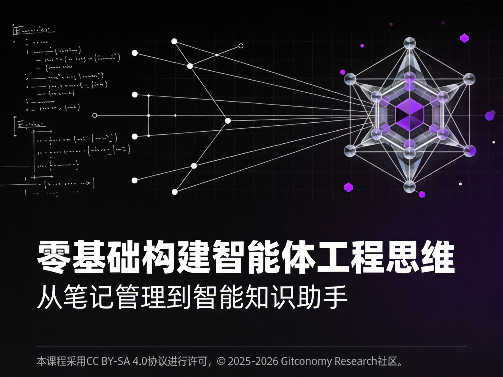

# 关于《零基础构建智能体工程》——从笔记管理到智能知识助手

-FF991F?style=flat-square&logo=probot&logoColor=white)

> **别再只和 AI “聊天”，开始构建能为你“干活”的系统。**
> **14 天，不写一行代码，把你的 Obsidian 变成会思考、能行动的智能知识助教。**

---

## 1. 课程简介



在生成式 AI 普及的今天，大多数人仍然停留在“聊天框式”的交互：把 AI 当作一个更聪明的搜索引擎，问一句答一句？收藏了无数 Prompt 技巧，却发现换个场景就失效？笔记软件里躺着几千条想法，却依然要手动整理周报、拼凑文章？

**并不是 AI 不够强，而是你的打开方式还在“石器时代”。** 真正的 AI 高手，早已不再手动写提示词，而是构建“会自己干活的系统”**。

《零基础构建智能体工程》是一门“三无”课程：

- **无代码**：不需要安装 Python、Docker 或复杂的开发环境。只要会打字，你就能跟上。
- **无废话**：不长编大论讲 AI 理论，只讲怎么解决你手边的问题。
- **无风险**：**本地优先（Local-First）**。你的数据、你的知识、你的智能体，全部存在你自己的电脑里，绝对安全。

 <br>

本课程的工具实验将基于 **Obsidian（黑曜石）** 这一款强大的知识管理工具。**你将学到的不是编程，而是“工程”**

---

## 2. 课程核心设计理念

本课程基于借鉴了敏捷开发（Agile）与精益思想（Lean）中“以最小可行成果驱动迭代、以真实反馈持续改进”的核心原则，将复杂的智能系统学习过程拆解为可验证、可积累的学习阶段，帮助学员掌握构建“最小可行智能体 (MVA)”的工程化方法和实践：

1. **本地优先——Local-First**：你的数据、你的知识、你的智能体，全部运行在你的电脑上。安全可控，无隐私焦虑。
2. **无代码/低代码—Low-Code**：我们使用 Obsidian 插件与模版来替代 Python 代码。只要你会打字，就能跟上节奏
3.  **笔记即数据库—Note as Database**：把笔记看作**半结构化的数据记录**。通过 YAML 元数据和原子化切片，我们让非结构化的笔记变得“机器可读”。
4.  **人机协同——Human-in-the-Loop**：AI 负责建议 (Suggest)，你负责确认 (Confirm)。在享受自动化的同时，保留对结果的最终控制权。

<br>

---

## 3. 课程智能体工程架构选择


在智能体开发领域，我们将本课程的技术选型定位为 **“低门槛、高上限”的工程中间路线**。我们选择Obsidian + MCP，而不是刻意避开了市面上主流的纯云端或纯代码方案，基于以下工程考量：

- 对抗“云端失忆症”**： 网页端 AI 虽然智商高，但患有“顺行性遗忘症”。我们引入 **Obsidian** 作为智能体的 **“海马体”**。通过本地 Markdown 文件存储，让 AI 拥有持久、可视化的长期记忆。你是在积累资产，而不是消耗对话。
- **拒绝“黑盒”与“显卡门槛”**： **LangChain** 等框架往往将 Prompt 逻辑封装在代码深处，初学者难以理解底层原理；**Ollama** 等本地推理工具对显卡（GPU）有硬性要求。本课程采用 **MVA (最小可行智能体)** 策略——利用云端 API (大脑) + 本地轻量级 MCP (手脚)，即使是普通笔记本电脑也能跑通复杂的智能体工作流。
- **拥抱协议化未来 (MCP)**： 我们不教你写死代码，我们教你用 **Model Context Protocol**。这是 AI 时代的“USB 接口”。通过标准协议，你的智能体可以即插即用式地连接搜索、文件系统或
- GitHub/ModelScope ，实现真正的系统级协作。

<br>

这套架构允许系统随着学员能力的提升而演进：

1. **入门**：用 Text Generator 插件做简单的 Prompt 工程。
2. 进阶：通过 MCP 接入外部工具，构建多智能体协作网络（Planner/Executor/Critic）。
3. **高阶**：引入 RAG 和 Git 版本控制，管理知识资产。

<br>

选择 Obsidian + MCP，是因为我们不希望你只是 AI 的“游客”（聊完即走），也不希望你被复杂的代码框架劝退。我们希望赋予你一套 **低门槛、高上限、完全私有** 的工程体系，让你亲手打造一个能持续生长、为你干活的数字分身。

本课程教你的是“内燃机原理”（底层机制），而 LangChain 是“法拉利”（高级工具）。只有懂原理的赛车手，才能在赛道上发挥出法拉利的极限性能，而不是并在第一个弯道冲出跑道。

---

## 4. 课程结构设计

### 4.1 课程进阶之旅

课程总共 14 天。你每天只需要花 30-45 分钟进行学习和动手实验， 你将从一个只会跟 AI 聊天的‘提问者’，进阶为**能亲手打造专属智能知识助教**的工程设计者。

-  **第 1-3 天：驯服 AI 的嘴** —— 从“随机聊天”到“精准指令”，让 AI 输出你真正想要的 Markdown 表格和 JSON 数据。
- **第 4-7 天：构建 AI 的脑** —— 改造你的 Obsidian 笔记，让 AI 读懂你的知识网络，学会你的写作风格。
- **第 8-14 天：打造 AI 的手** —— **实战构建“笔记园丁”智能体**。不需人工干预，让它自动把你的碎片灵感整理成结构化知识。

<br>

**未来只有两种人：一种是忙着敲键盘的人，一种是懂得指挥 AI 敲键盘的人。** **加入我们，成为后者。**

### 4.2 课程大纲

#### 第一阶段：驯服 AI 的嘴 —— 从随机聊天到精准协议

**目标：** 掌握 **S.C.O.R.E 结构化提示工程**，让 AI 停止胡编乱造，输出可用的结构化数据。

- **[第1天：环境觉醒](./docs/module-notes/01-environment-setup-notes.md)** —— 搭建 Obsidian + Text Generator 的本地 MVA 底座。
- **[第2天：告别聊天](./docs/module-notes/02-score-model-notes.md)** —— 掌握 **S.C.O.R.E. 模型**，将 Prompt 升级为“可执行协议”。
- **[第3天：强制输出](./docs/module-notes/03-schema-contracts.md)** —— 学习 **JSON Schema** 与数据契约，为智能体装上标准化的“数据接口”。

<br>

#### 第二阶段：构建 AI 的脑 —— 知识工程与记忆植入

**目标：** 实施 **智能知识工程**，通过原子化和元数据，让 Obsidian 笔记变成 AI 读得懂的“长期记忆”。

- **[第4天：风格克隆](./docs/module-notes/04-few-shot-learning-notes.md)** —— 利用 **Few-Shot Learning** (少样本学习)，让 AI 学会你的“方言”与思维模式。
- **[第5天：知识切片](./docs/module-notes/05-knowledge-chunking-notes.md)** —— 打造智能切片刀，将长文重构为高内聚的 **原子化笔记 (Atomic Notes)**。
- **[第6天：数据契约](./docs/module-notes/06-data-contract-notes.md)** —— 自动化注入 **YAML 元数据**，建立机器可读的知识索引与 Schema 约束。
- **[第7天：记忆链接](./docs/module-notes/07-knowledge-graph.md)** —— 构建双向链接与知识图谱，赋予 AI 跨文档推理的能力。

<br>

#### 第三阶段：打造 AI 的手 —— 实战“笔记园丁”智能体

**目标：** 构建 **MVA (最小可行智能体)**，跑通 **PEAR 闭环**，实现从“被动问答”到“主动干活”。

- **[第8天：智能体觉醒](./docs/module-notes/08-agent-mental-mode-notes.md)** —— 学习智能体的“心智模型”。理解 **PEAR** (感知-评估-行动-反思) 闭环，这是智能体“思考”的基石。
- **[第9天：协议握手](./docs/module-notes/09-mcp-inbound-notes.md)** —— 配置 **Obsidian as MCP Server**。让 Claude Desktop 等外部最强大脑直接“插管”你的知识库，实现“外脑接入”（In-Bound模式）。
- **[第10天：本地触手](./docs/module-notes/10-mcp-outbound-notes.md)** —— 开发 **Custom Tools**。编写轻量级 Python 脚本（如联网搜索），通过 MCP 让 Obsidian 主动调用外部工具（Out-Bound模式）。
- **[第11天：技能装载](./docs/module-notes/11-mcp-routing-notes.md)** —— 体验 **Agent App Store**。从 **ModelScope** 生态中“下载”现成的 MCP 工具（如 PDF 解析、图表生成），即插即用。
- **[第12天：安全围栏](./docs/module-notes/12-agent-uardrails-notes.md)** —— 实现 **人机协同**（Human-in-the-Loop)。通过 MCP 权限分级（R0-R3），给智能体的高风险操作（如删除文件）加上“安全锁”。
- **[第13天：MVA实战](./docs/module-notes/13-mva-project-notes.md)*** —— 构建一个自动扫描 Inbox、识别内容、打标签并归档笔记的“智能分拣”智能体。
- **第14天：协同涌现** —— 在一个 Client 下挂载多个 MCP Server（记忆+联网+文件操作），见证多能力协同的智能涌现。

<br>

###  4.3 课程仓库结构

在这个仓库里，**你不是在“上课”，而是在“参与一个开源项目”**；你不是在“下载”课程，而是在 **Fork**（派生）课程。你的学习产出（作业、笔记、代码修改）将通过issue和 **Pull Request**的形式提交回主仓库或小组仓库。你的每一次 Commit，都是在为你的数字大脑添砖加瓦。

```text
📂aAgentic-KW-Engineering-2026/
├── 📂docs                    # 课程文档和讲义
│   ├── 📂module-notes        # 每日课程讲义 (Markdown)
│   ├── 📂labs-guide          # 实验手册 (一步步操作指南)
│   └── 📂references          # 参考资料
│
├── 📂src                      # 课程代码
│   ├── 📂components           # 各个模块的实现代码
│   ├── 📂utils                # 工具函数和API集成
│   └── main.py                # 主程序
│
├── 📂assets                   # 课程图像和可视化文件
│   ├── 📂images               # 课程相关图表、架构图
│   └── 📂examples             # 示例数据和输出
│
├── 📂resources                # 外部资源和插件说明
│   ├── 📂tools                # 相关工具介绍和使用方法
│   └── 📂tutorials            # 外部教程和学习资源
│
└── README.md                  # 课程介绍和使用说明
```

---

## 5. 学习准备

你不需要具备编程基础，但需要准备以下环境：

1.  **硬件**：一台能够运行桌面软件的电脑 (Win/Mac/Linux)。
2.  **软件**：
	  - [Obsidian](https://obsidian.md/) (最新版)
	  - **Text Generator** 插件
3.  **API Key**：DeepSeek / Qwen / OpenAI 等任意一个主流模型的 API Key。
4.  **心态**：
	  - 愿意尝试 **Git 驱动的学习模式** (Fork -> Edit -> PR)。
	  - 愿意接受“AI 会犯错”，并学习如何纠正它。

---

## 6. 共创与贡献

本课程践行 **知识即代码** (Knowledge as Code) 的理念，我们认为课程讲义不应是静态的文件，而应像开源软件一样不断迭代进化。

Gitconomy Research为讲义提供了核心骨架，而你们的实战经验将赋予它血肉。我们鼓励学员提交基于原始讲义的 衍生版本 (Derived Versions)。

**如果你在学习过程中完成了以下任意一项：**

- 对某个晦涩的概念进行了更通俗易懂的**重写或扩写**。
- 为某个理论补充了自己所在行业的**具体应用案例**。
- 绘制了比官方讲义更清晰的**流程图或架构图**。
- 整理了针对某一章节的**深度思维导图**。

**请按以下步骤贡献你的智慧：**

1. **Fork 本仓库**：确保你拥有自己的代码库副本。
2. **创建文件**：在 `Agentic-KW-Engineering-2026/resources/tutorials` 目录下新建 Markdown 文件。

	-  _推荐命名规范：_ `DayXX-Topic-Enhanced-by-YourName.md`
	- _（例如：Day03-Prompt-Engineering-Enhanced-by-ZhangSan.md）_

3. **引用声明**：请在你的文档开头注明基于那一个讲义文件进行衍生，并简述你的增强点（如：增加了医疗行业的 Prompt 案例）。
4. **提交 PR**：将你的修改提交给主仓库。

<br>

一经合并，你将成为本课程的贡献者，你的名字将被永久记录在贡献者列表中。Gitconomy Research将会根据学员贡献的内容，挑选合适的内容补充增加到原有的课程讲义和相关文件中。让我们一起持续迭代和更新高质量的课程内容，这《零基础构建智能体工程》课程打造成最实用的智能体工程指南！

---

## 7. 如何开始

本课程采用 **Git 驱动** 的学习模式：

1. **Fork** 本仓库到你的GitLink 账号。
2. **Clone** 到本地，作为你的 Obsidian Vault (知识库) 打开。

<br>

---

## 8. 许可声明

本文档采用 [知识共享署名--相同方式共享 4.0 国际许可协议 (CC BY--SA 4.0)](https://creativecommons.org/licenses/by-sa/4.0/deed.zh) 进行许可， &copy; 2025-2026 Gitconomy Research社区。
