<!--
---
module: 00-课程简介 —— 零基础构建智能体工程
file: 00-course-introduction-notes
date: 2026-02-20
version: 1.1.0
author: Gitconomy Research-郭晧
license: CC BY-SA 4.0
tags:
  - Agentic-Workflow
  - MVA
  - Prompt-Engineering
  - MCP
difficulty: Beginner
duration: 30 min
---
-->
# 《零基础构建智能体工程》课程导论

## 1. 课程简介

在人工智能技术井喷的当下，大多数用户仍处于“AI 游客”的阶段，局限于一次性、纯文本的“问答”模式，数据无法沉淀，高度依赖人工重复操作。这种传统的自然语言聊天交互虽然便捷，但本质上是高熵的、无记忆的，无法支撑复杂的业务逻辑。

本课程旨在完成一次认知的重构：帮助学员从传统的 AI 使用者（User）进化为系统架构师（System Architect）。在未来的 14 天里，我们将摒弃“发微信式”的 AI 使用习惯，通过严谨的工程思维，打造属于你自己的最小可行智能体（MVA, Minimum Viable Agent）。我们将构建一个能感知、能思考，并主动调用工具去行动的自动化工作流（Agentic Workflow）。

*图0-1：课程价值定位*



本课程与基于 Ollama 等框架进行本地大模型部署，以及基于 Coze 等高度封装的云端平台，的核心区别，可以总结为“无 GPU 环境下的存算分离”与“系统架构与思维白盒化”**：

1. **区别于 Ollama 本地部署：无 GPU 环境与算力边界划分**

与需要高性能显卡在本地强行运行大模型的方案不同，本课程明确立足于**无 GPU 环境**（例如仅有 12GB RAM 的普通本地主机）。因此，我们不教授如何本地部署模型，而是采用**云端大脑（Remote Brain）与本地肢体（Local Body）物理隔离**的混合拓扑架构。在这个架构下，复杂的逻辑推理（如生成、规划）作为“云端大脑”交由远程大模型 API 在公网上执行，而隐私数据处理、本地 Python 工具函数（如 OCR 引擎、FastAPI 服务、FAISS 向量库）作为“本地肢体”在本地 CPU 上安全运行。

2. **区别于 Coze 等无代码平台：拒绝黑盒，强调“思维白盒化”**

使用 Coze 往往是拖拽式的“黑盒”体验，开发者无法触及底层流转。而本课程强调思维白盒化 (White-Box Thinking)。我们要求在代码和系统架构层面完整刻画出大模型内部的 “ReAct 循环”（思考-行动-观察）。你将亲自编写并调度整个循环，从云端发出指令，到本地工具执行，再到将观察结果回传云端，实现对智能体每一步运转的完全掌控。

在课程的最后阶段，学员将学会如何设计并实现跨平台的智能体工作流，利用本地存算分离架构的优势，通过云端模型与本地工具的协同工作，实现一套高效、智能的知识管理自动化系统。学员不仅能独立完成智能体构建，还能在自己的工作中灵活应用这些技术，推动团队知识工作流的自动化和智能化。

此外，本课程的最大亮点是其工程思维的深度应用。通过结合 **S.C.O.R.E. 模型**、**PEAR 架构** 和 **ReAct 范式**，学员将能够深入理解智能体的运行机制，并能对其进行精细的控制与优化。

---

## 2. 课程核心理念

构建智能体并非单纯堆砌模型算力，而是需要建立一套可控的系统架构。我们将基于以下三大工程基石展开整个课程的学习：

### 2.1 重构交互协议 (Prompt as Protocol)

提示词（Prompt）不再是随意的自然语言聊天，而是人机交互的软协议（Soft Protocol）。我们将学习使用 S.C.O.R.E. 模型（Setting, Context, Objective, Requirements, Evaluation），将模糊的自然语言压缩为确定性的执行指令。通过强制 AI 输出结构化数据（如 JSON），我们确保机器能够稳定解析输出结果，实现从高熵文本到低熵数据的转化。

### 2.2 沉淀持久数据 (Note as Database)

不要把笔记仅仅看作死板的文字，而是应将其视为半结构化（Semi-structured）的数据记录。我们将依托本地优先的 Obsidian 作为智能体的“身体”（Body），通过 YAML 元数据（Metadata）和原子化知识切片，将个人笔记转化为机器可读的实体，为智能体提供检索和推理的长期记忆（Memory）。

### 2.3 闭环系统智能 (System as Intelligence)

智能不仅来自大语言模型的内部参数，更来自运行环境与执行闭环。我们将云端的大语言模型（如 DeepSeek 或 Claude）视为“大脑”（Brain），并通过模型上下文协议（MCP, Model Context Protocol）这一通用标准，连接大脑与本地文件系统及外部工具。这为智能体赋予了操作真实世界的“手”，形成“感知 -> 思考 -> 行动 -> 反馈”的完整闭环。

---

## 3. 课程结构与学习路径

本课程分为三个核心阶段，遵循从局部控制到系统联动的进阶路径：

| 阶段划分                              | 核心目标           | 关键技术节点                         | 预期工程产出                                                |
| --------------------------------- | -------------- | ------------------------------ | ----------------------------------------------------- |
| **第一阶段：驯服大语言模型的嘴**<br>(Day 1 - 3) | 结构化交互与协议握手     | 环境配置、S.C.O.R.E. 模型、JSON 强制输出   | 搭建本地存算分离架构，输出可被代码直接解析的低熵数据载体。                         |
| **第二阶段：构建智能体的脑**<br>(Day 4 - 7)   | 知识切片与 RAG 记忆库  | 少样本学习 (Few-Shot)、知识切片、双向链接     | 实现 AI 风格克隆，利用 Obsidian 构建机器可读的图谱与检索增强生成体系。            |
| **第三阶段：打造自动化的手**<br>(Day 8 - 14)  | MCP 工具调用与自动化协作 | PEAR 闭环、ReAct 范式、MCP Server 接入 | 激活“数字员工”，实现多智能体协同 (Multi-Agent Collaboration) 处理本地文件。 |

*图0-2：学员阶梯式学习之旅路线图*


>**💡 提示工程技巧：** 在学习前期，请务必克制让 AI “自由发挥”的冲动。严格执行 S.C.O.R.E. 框架与 JSON 数据契约，是后续系统能够稳定调用外部工具（Tool Use）的物理前提。

---

## 4.  课程实验环境系统架构说明

*图0-3：实验环境系统架构*



本课程采用 **“本地优先 (Local-First)”** 的极客工具栈，兼顾隐私安全与工程扩展性：

1. **大脑 —Brain**： DeepSeek / Qwen / Claude (通过 API 连接)。
2. **身体 —Body**：Obsidian作为知识库与主控台)。
3. **神经 —Nerves**：Obsidian `Text Generator` 和 `Tars` 插件 (连接大脑与身体)。
4. **协议—Protocol**：MCP (Model Context Protocol)** (连接工具与生态)。
5. **客户端 —Client**：Cherry Studio / Cursor/Claude Desktop (用于 MCP 调试与编排)。

<br>

---

## 5. 课程仓库目录结构

课程仓库组织了所有的学习资源，包括文档、实验代码、示例等。以下是课程仓库的目录结构：

```text
📂Agentic-KW-Engineering-2026/
├── 📂docs                    # 课程文档和讲义
│   ├── 📂module-notes        # 每日课程讲义 (Markdown)
│   ├── 📂labs-guide          # 实验手册 (一步步操作指南)
│   └── 📂references          # 参考资料
│
├── 📂src                      # 课程代码
│   ├── 📂components           # 各个模块的实现代码
│   ├── 📂utils                # 工具函数和API集成
│   └── main.py                # 主程序
│
├── 📂assets                   # 课程图像和可视化文件
│   ├── 📂images               # 课程相关图表、架构图
│   └── 📂examples             # 示例数据和输出
│
├── 📂resources                # 外部资源和插件说明
│   ├── 📂tools                # 相关工具介绍和使用方法
│   └── 📂tutorials            # 外部教程和学习资源
│
└── README.md                  # 课程介绍和使用说明
```


---

## 6. 学习准备与前置知识

- **计算机操作基础**：学员应具备基础的计算机操作能力，例如文件管理和浏览器使用。无需编程背景，但需能够操作常见软件工具。
- **英语阅读能力**：由于部分工具和插件文档为英文，具备一定的英语阅读能力有助于更好地理解软件文档和资源。
- **拥抱报错**：在第三阶段配置 MCP 时，你可能会遇到端口冲突、环境依赖等问题。这正是工程实战的一部分。请善用 GitHub Issues 和社区讨论。
- **坚持动手**：课程采用 **Task-Based Learning (TBL)**。只看不练，你依然只是一个“观众”；动手敲一遍，你就是“架构师”。

<br>

现在，请打开你的终端或 Obsidian，让我们开始这次学习之旅。

---

## 7. 结语

本课程将帮助你从“AI使用者”转变为“智能体系统设计师”，掌握如何构建一个能够自主管理知识和任务的智能体。通过低代码工具，你将亲自体验如何设计并实现一个智能系统，提升个人效率，并为未来的工作和科研奠定基础。

---

## 8. 许可声明

本文档采用 [知识共享署名--相同方式共享 4.0 国际许可协议 (CC BY--SA 4.0)](https://creativecommons.org/licenses/by-sa/4.0/deed.zh) 进行许可， &copy; 2025-2026 Gitconomy Research社区。
