<!--
---
module: 01-环境觉醒 —— 构建你的智能体底座
file: 01-environment-awakening-notes
date: 2026-02-19
version: 1.1.0
author: Gitconomy Research -郭晧
license: CC BY-SA 4.0
tags:
  - Setup
  - Obsidian
  - Local-First
  - MVA
difficulty: Beginner
duration: 45 min
---
-->
# 第一天：本地环境配置 —— 构建你的智能体底座
## 1. 本章摘要

欢迎来到《零基础构建智能体工程》的第一阶段：**构建 AI 的嘴**。

在人工智能技术井喷的当下，大多数用户仍处于“AI 游客”的阶段。这类用户的典型行为是打开网页端的 ChatGPT、Claude 或 DeepSeek，输入一段指令，获取一段文字，然后关闭窗口。这种“一问一答”的模式虽然便捷，但存在着致命的工程学缺陷：它是无记忆的、上下文割裂的，且数据完全存储在第三方云端服务器中 。当浏览器标签页关闭，那些闪烁着智慧火花的交互便成为了历史尘烟，无法沉淀为个人知识体系的一部分，更无法被集成到复杂的业务逻辑流中。

今天我们不探讨复杂的 Prompt Engineering 理论，也不拆解高深的智能体架构，我们旨在构建最小可行智能体 (MVA) 的运行底座。我们将通过 Obsidian 社区的`Text Generator` 和 `Tars` 插件，建立本地存储 (Obsidian) 与云端推理 (LLM) 之间的 API 通信管道，解决网页端对话“无状态、无记忆、无隐私”的工程痛点。

完成本章后，你将拥有一套支持本地持久化存储的智能体开发环境 (Runtime)，并成功跑通“Hello World”式的第一次对话。

## 2. 基础理论：存算分离的 MVA 架构

### 2.1 智能体工坊的“三体架构”设计

传统的网页端 AI（如 ChatGPT）本质上是一个“会话级”系统。当你关闭浏览器标签页，所有的交互数据、思维火花和上下文语境都会随之消失。这种“无状态”特性导致我们无法构建复杂的、需要长期记忆的智能体。为了解决这一工程痛点，我们需要引入“存算分离”的架构设计理念。

在 MVA (Minimum Viable Agent) 架构中，我们将智能体的“大脑”与“身体”进行物理分割。云端的大模型（如 DeepSeek、OpenAI）仅作为纯粹的计算节点，负责逻辑推理和文本生成，它不再持有数据；而本地的 Obsidian 则作为数据节点，负责永久存储所有的记忆、知识图谱和交互日志。两者通过 API 接口进行毫秒级的数据交换。这种架构不仅确保了数据主权（Data Sovereignty），更让 AI 能够调用你本地沉淀了数年的知识库作为思考的上下文。

*图1-1：智能体工坊三体架构*



我们可以将一个完整的本地智能体工作流比作一个生物有机体，其结构如下：

1. **云端大脑——远程 LLM**：无状态的推理引擎（LLM）。它提供算力，但不保存记忆。

这是智能的核心所在。无论是 OpenAI 的 GPT 系列，还是 DeepSeek、Claude，它们本质上是部署在高性能服务器集群上的大型语言模型（LLM）。它们拥有庞大的知识库和逻辑推理能力，但它们在网页端是“孤立”的。它们没有自己的存储空间来长期保存你的私人数据，也没有物理世界的触角去感知你的工作流。在大脑的世界里，信息是流动的、瞬时的。

2. **本地身体——本地 Obsidian**：基于 Markdown 的文件系统（Obsidian）。它提供持久化存储和物理操作环境。

Obsidian 不仅仅是一个笔记软件，它是智能体的“躯壳”和“记忆库”。由于 Obsidian 基于本地 Markdown 文件存储，它确保了数据的主权完全归属于用户。在智能体工程中，Obsidian 提供了存放上下文（Context）、参考资料和最终产出的物理空间。它不仅承载了你的过去（笔记历史），还通过双向链接（Wikilinks）构建了复杂的知识网络，这正是智能体产生深度洞察的土壤 。

3. **神经接口——插件系统**：通信中间件（Text Generator / Tars Plugin）。它负责将本地文件打包为 JSON 请求，并解析云端的流式响应。

连接“大脑”与“身体”的关键在于神经系统。在我们的工作流中，Text Generator 插件扮演了这一角色。它负责将你在 Obsidian 中书写的文字（Prompt 或上下文）打包，通过加密通道发送给云端大脑，并将大脑返回的电信号（生成结果）精准地注入到笔记的特定位置。这种集成使得 AI 能够直接在你的知识库内“呼吸”和“生长”。

<br>

### 2.2 “智力模式”的选择

在云端工具盛行的今天，坚持本地优先并非某种复古的情怀，而是出于对数据隐私、响应速度和知识持久性的深层考量。云端 AI 服务虽然强大，但其本质是“租赁”智力，而本地优先则是“拥有”智力。

*图1-2：“租赁”和“拥有”智力的差异*




表1-1详细对比了传统云端 AI 对话与本地智能体工坊的核心差异：

|维度|云端 AI 对话 (如网页版 ChatGPT)|本地智能体工坊 (Obsidian 架构)|
|---|---|---|
|**数据存储位置**|服务商服务器，存在数据泄露与隐私风险 [2, 3]|本地硬盘，完全受控，支持离线访问 [4, 5, 14]|
|**知识沉淀形式**|线性对话记录，难以结构化检索 [1, 7]|纯文本 Markdown，支持图谱、搜索与双向链接 [4, 6, 9]|
|**隐私与合规**|数据可能被用于模型训练，隐私权受限 [2, 14]|数据绝不外流，符合 GDPR/HIPAA 等合规要求 [2, 15]|
|**定制化程度**|受限于厂商 UI，难以自动化 [3, 8]|2700+ 插件支持，可自由编写脚本驱动 AI [16, 17]|
|**计费模式**|月租订阅制（固定成本，无论用多少） [15, 18]|API 按量付费（极低起步价，用多少付多少） [15, 18, 19]|
|**版本控制**|基本没有，一旦覆盖无法找回|利用 Git 实现毫秒级快照回溯 [20, 21, 22]|

从“游客”到“设计师”的转变，核心在于从“消费服务”转向“构建资产”。本地化的笔记文件就是你的数字资产，而配置好的智能体工作流则是你的生产工具。

### 2.3 “智力”进阶的心法

虽然今天我们只做基础配置，但请务必记住以下三个将在后续课程中反复出现的“心法”。它们是你未来从“使用者”进阶为“架构师”，成功驯服 AI 的关键武器：

*图1-3：智能工作坊三大心法*



- **S.C.O.R.E. 模型**（Day 02 学习）： 它将成为你大脑中的 **控制指令集**。通过设定角色 (Setting)、背景 (Context)、目标 (Objective)、要求 (Requirements) 和评估 (Evaluation) 这五个维度，你将学会如何通过结构化提示词（Structured Prompts）精准驯服 AI 的输出质量，让它不再产生幻觉，而是输出可用的协议。
- **PEAR 架构**（Day 08 学习）： 它将把你的 Obsidian 变成一个自动化的 **智能中心**。这套架构代表了智能体运行的四个阶段：感知 (Perceive) → 评估 (Evaluate) → 行动 (Act) → 反思 (Reflect)。通过这个闭环，你的系统将不再是被动等待指令的聊天机器人，而是能够主动处理信息的智能管家。
- **ReAct 范式**（贯穿第三阶段）： 这是实现“智能行动”的底层逻辑，即 推理 (Reasoning) + 行动 (Acting)。在未来的课程中，我们将利用 ReAct 范式让智能体学会“先思考，再动手”，并在行动受阻时自我修正。这是让 AI 真正具备解决复杂问题能力的“认知引擎”。
<br>

没有今日的“环境觉醒”，后续的所有进阶模型都只是空中楼阁。我们今天所做的，是为未来的智能大厦打下最坚实的第一根地桩。
<br>

>🤔**为什么选择 Obsidian？**
>
>在开始动手之前，你可能会问：市面上有那么多 AI 聊天网页，为什么我们要折腾一个本地软件？想象一下，如果 ChatGPT 或 Claude 是一个智商超群的“大脑”，那么它最大的缺点是什么？是**健忘**。当你关闭网页，它就切断了与你的联系。我们需要给这个大脑配一个“海马体”  —— 也就是长期的记忆系统。**Obsidian** 就是这个完美的“海马体”。你的笔记就是你电脑上的 Markdown 文件。没有云端审查，没有隐私泄露风险，这是工程安全的基础。它像一个乐高底座，允许我们通过插件（Plugins）为它装上“耳朵”和“嘴巴”，连接云端的超级大脑。


---
## 3. 实战演练

现在，让我们像工程师一样开始工作。请跟随以下步骤，完成你的智能体底座搭建。

*图1-4：第一天课程实验步骤*



### 3.1 初始化你的知识库 (Vault)

Obsidian 的存储单元被称为 **Vault (知识库)**。它本质上只是你电脑上的一个文件夹。

1. **下载与安装**：访问 [Obsidian官网]([obsidian.md](https://www.google.com/url?sa=E&q=https%3A%2F%2Fobsidian.md%2F))下载并安装最新版本。
2. **创建仓库**：
    - 打开 Obsidian，点击“Create new vault”（创建新仓库）。
    - **Vault Name**：建议命名为 `AI-Agent-Space`。
    - **Location**：选择一个你熟悉的本地磁盘路径（建议非系统盘）。
3. **基础设置**：
    - 进入 `Settings` (设置) -> `Files & Links` (文件与链接)。
    - 将 `Default location for new attachments` (新附件的默认位置) 修改为 `In subfolder under current folder` (当前文件夹下的子文件夹)。
    - _这一步是为了确保未来 AI 处理图片或文件时，路径逻辑清晰。_
<br>

### 3.2 接入你的 AI 模型

#### 3.2.1 工程示例：配置Obsidian Text Generator 插件

##### 3.2.1.1 Obsidian Text Generator 插件工作原理

在 MVA (最小可行智能体) 架构中，我们需要一个“中间件”来连接本地的 Obsidian Vault 与云端的LLM API。 本工程示例，我们部署并配置 **Text Generator** 插件，使其能够通过 HTTP 协议向 DeepSeek/OpenAI 发送请求，并将返回的流式文本 (Streaming Text) 实时渲染到当前的 Markdown 笔记中，完成“神经回路”的物理接通。

Text Generator 不仅仅是一个自动补全工具，而是一个完整的 LLM Client (客户端)。它负责处理 `Context Injection` (上下文注入)，将你选中的笔记内容、Frontmatter 元数据打包成标准的 JSON 格式发送给模型。当你按下 `Ctrl+J`  生成快捷键时，该插件在后台执行了以下“序列化”与“网络传输”过程：

1. **上下文抓取** (Context Scraping)：读取当前光标前的文本或选中的笔记内容。
2. **载荷封装** (Payload Packing)：将非结构化的 Markdown 文本封装为符合 OpenAI API 标准的 JSON 数据包（包含 `messages`, `temperature`, `max_tokens` 等参数）。
3. **异步请求** (Async I/O)：通过 HTTP POST 向指定的 API 端点发送请求。
4. **流式渲染** (Stream Rendering)：监听服务器返回的 SSE (Server-Sent Events) 数据流，像打字机一样将 Token 逐个写入本地编辑器。

<br>

##### 3.2.1.2  环境准备

本次课程的示例我们将通过国内领先的模型服务商 **硅基流动 (SiliconFlow)**，免费接入强大的 **DeepSeek** 模型，搭建从本地到云端的“神经通道”。

1.  **获取准入证 (API Key)**：访问 [硅基流动官网 (SiliconFlow)](https://www.google.com/url?sa=E&q=https%3A%2F%2Fcloud.siliconflow.cn%2F) 并注册账号。
2. 然后进入控制台，点击 **“API 密钥”** -> **“新建密钥”**。

<br>

>⚠️ API Key 仅在创建时显示一次，请立即复制并存放在安全的地方（如密码管理软件中）。切勿将含有密钥的截图发到朋友圈。

##### 3.2.1.3 配置步骤

###### 步骤 1：解除安全锁与安装 Obsidian 默认处于“沙箱模式”，禁止运行第三方代码。

1. 进入 **Settings** -> **Community plugins**。
2. 关闭 **Restricted mode** (受限模式)。
3. 点击 **Browse**，搜索 `Text Generator`，点击 **Install** 并 **Enable**。

<br>

###### 步骤 2：配置通信协议 (关键工程)

这是建立握手的核心步骤。打开插件设置页，进行如下参数配置（以硅基流动 为例）：

1. **LLM Provider**: 选择 `Custom`。
2. **API Key**: 粘贴你的 `sk-xxxx` 密钥。
3. **Base Path**: 采用 Tars 默认输出的 url，不需要修改。
4. **Model**: 输入 `deepseek-ai/DeepSeek-R1-0528-Qwen3-8B`

<br>

###### 步骤 3：配置生成参数 (超参数调优)

在 **Advanced Settings** 中调整模型行为：

1. **Max Tokens**: 设置为 `2000`。 (防止 AI 一次性输出过长导致 token 耗尽)
2. **Temperature**: 设置为 `0.7`。 (保持创造性与逻辑性的平衡)

<br>

##### 3.2.1.4 运行你的第一次对话

环境搭建好了，现在我们来测试一下这套“赛博义肢”是否接通了神经。

1. **新建笔记**：点击左侧栏的 `New note`，命名为 `00-Hello-World`。
2. **输入指令**：在笔记中输入以下内容（这是给 AI 的指令）：

```
你好，AI。请你扮演一位资深的 Python 工程师。
请用 3 句话向我解释什么是“Hello World”，并输出一段 Python 的 Hello World 代码。
```

3. **触发生成**：
    - 将光标停在文字末尾。
    - 按下快捷键（默认通常是 `Cmd+J` 或 `Ctrl+J`，具体看插件设置）。
    - 观察屏幕，如果一段文字自动流淌出来，恭喜你！**环境觉醒成功**。


这段代码会向控制台输出 "Hello World!" 这句话。

<br>

>⚠️ **幻觉警示**： 如果 AI 没有反应，或者输出了乱码，通常是因为 API Key 填写错误或网络连接问题。请检查插件设置中的红字报错信息。

##### 3.2.1.5 常见报错

1. `401 Unauthorized`：API Key 填写错误或余额不足。
2. `404 Not Found`：Base Path 填写错误（检查是否多了空格或少了 `/v1`）。
3. `Connection Error`：网络不通。请检查本地代理设置

<br>

#### 3.2.2 工程示例 —— 配置 Obsidian Tars 插件

##### 3.2.2.1 Obsidian Tars 插件工作原理

如果说 Text Generator 是你的“内联打字机”，专注于文本补全；那么 Tars 则更像是一个常驻的“会话代理”。在 MVA 架构中，Tars 主要承担“多轮会话管理”与“上下文挂载"的角色。

Tars 通过在 Obsidian 中构建一个侧边栏对话界面，改变了信息交互的形态。它的核心工作流如下：当你发起提问时，Tars 会自动抓取当前激活的笔记内容（作为背景知识），结合你的聊天输入，封装为完整的 JSON 会话历史（包含 `system`, `user`, `assistant` 角色排列）。云端大脑处理完毕后，Tars 将流式数据渲染在独立的面板中，并允许你将高质量的回答一键提取为本地的 Markdown 永久节点。

##### 3.2.2.2 环境准备

本示例我们将继续复用在 `3.2.1.2` 节中获取的硅基流动 (SiliconFlow) API 密钥与大语言模型。

1. **准备密钥**：请确保你手头已有 `sk-xxxx` 格式的 API 密钥。如果尚未获取，请返回上一节查阅获取步骤。
2. **确认网络**：确保本地计算机能够正常发起外部 HTTP 请求。

##### 3.2.2.3 配置步骤

###### 步骤 1：安装与启用

1. 进入 `Settings` -> `Community plugins`。
2. 点击 `Browse`，在搜索框中输入 `Tars`。
3. 点击 `Install` 进行安装，并随后点击 `Enable` 启用插件。

<br>

###### 步骤 2：配置通信接口

进入 Tars 的插件设置页面，建立与云端大脑的连接通道：

1. **Provider**：选择 SiliconFlow
2. **Base URL**：采用 Tars 默认输出的 url，不需要修改。。
3. **API Key**：粘贴你的硅基流动密钥。
4. **Model Name**：选择`deepseek-ai/DeepSeek-R1-0528-Qwen3-8B`。

<br>

##### 3.2.2.4 运行你的第一次对话

###### 步骤 1：呼出控制面板

在 Obsidian 的右侧边栏找到 Tars 的图标并点击，或者使用快捷键 `Ctrl+P`唤出命令面板，输入 `Tars:` 打开对话窗口，选择 `Tars` 有关的指令。

###### 步骤 2：注入上下文并测试


```text
#我 :

你好，AI。请你扮演一位资深的 Python 工程师。
请用 3 句话向我解释什么是“Hello World”，并输出一段 Python 的 Hello World 代码。
并参考@02-告别聊天——S.C.O.R.E.结构化提示工程中的模型，输出生成这段代码的提示词。

#SiliconFlow :  
```

>💡 **提示工程技巧：** Tars 的核心工程优势在于动态上下文引用。除了自动读取当前笔记，你还可以在提问时使用特定的引用符（如 @），将知识库中任意的其他 Markdown 文件挂载到单次请求中。这是未来构建复杂“本地知识问答”底座的基础动作。

##### 3.2.2.5 常见报错

1. `Model Not Found (HTTP 404)`：模型名称填写错误或该端点不支持此模型。请检查 Model Name 的拼写是否与服务商控制台提供的 ID 完全一致。
2. `Context Length Exceeded (HTTP 400)`：挂载的本地笔记过长。如果你让 Tars 读取了一篇长达数万字的笔记，打包后的 Token 数量超出了当前大语言模型的上下文窗口（Context Window）上限，云端大脑会拒绝处理。解决方案是裁剪笔记，或更换支持更大上下文长度的模型（如支持 128k 的版本）。
3. `Empty Response`：API URL 配置错误（例如多写了 `/chat/completions` 后缀），导致解析失败。请严格按照服务商的文档调整 Base URL 层级。

<br>

---

## 4. 本章总结

在本章中，我们成功完成了最小可行智能体 (MVA) 底座的“存算分离”架构搭建。我们摒弃了无状态、高遗忘率的网页端聊天模式，转向了以数据主权为核心的工程实践。

1. **构建本地物理躯体**：初始化了 Obsidian 知识库 (Vault)，确立了基于纯文本 Markdown 的本地优先 (Local-First) 存储策略，保障了知识资产的持久性与隐私安全。

2. **打通神经通信回路**：通过配置 Text Generator 和 Tars 插件，成功建立了本地客户端与云端推理引擎 (DeepSeek) 之间的 API 连接通道。

3. **掌握上下文挂载机制**：通过 Tars 的 `@` 引用功能，跑通了跨文件动态读取本地知识片段的流程。这不仅解决了模型上下文窗口限制的问题，也为后续构建复杂的检索增强生成 (RAG) 系统提供了基础动作。

<br>

环境的觉醒是建立系统秩序的第一步。你现在拥有了一个可以持久化沉淀记忆的运行环境 (Runtime)。在后续章节中，我们将在此基础上引入系统性的控制指令集 (S.C.O.R.E.) 与工作流转架构 (PEAR)。

---

## 5. 课后思考

1. **如何实现智能体的长期记忆功能？**  
    本章中，我们通过 MVA 架构实现了存算分离，云端大模型负责推理，但如何将智能体的记忆进行持久化和管理，是后续课题中需要深入探讨的问题。你可以思考如何通过本地存储和智能体交互的机制，实现记忆的更新与回溯。

2. **如何保证 AI 在复杂业务逻辑中的可靠性？**  
    AI 的输出不仅仅依赖于模型的推理能力，还需要结合复杂的业务规则。在智能体的实际应用中，如何确保 AI 的推理与业务需求相符合，是我们需要进一步解决的挑战。

3. **未来的智能体如何支持更高效的团队协作？**  
    随着智能体的进化，未来它们不仅能独立完成任务，还能与人类协作完成更加复杂的项目。你可以思考，如何通过插件、集成或协作机制，让智能体成为团队成员的“智力伙伴”。

---

## 附录 1：核心术语表 (Glossary)

|英文术语|中文术语|说明|
|:--|:--|:--|
|**MVA**|**最小可行智能体**|Minimum Viable Agent。具备最基础感知与行动能力的 AI 系统。|
|**Vault**|**知识库/仓库**|Obsidian 的数据存储单元，对应你电脑上的一个文件夹。|
|**Plugin**|**插件**|用于扩展软件功能的小程序，本课程中用于连接 LLM。|
|**LLM**|**大语言模型**|Large Language Model。如 GPT-4, Claude, DeepSeek 等 AI 模型。|
|**Local-First**|**本地优先**|一种软件设计理念，强调数据的所有权和本地处理优先于云端。|
|**Context Window**|**上下文窗口**|AI 的“短期记忆”容量。|
|**Hallucination**|**幻觉**|AI 的一本正经胡说八道。|
|**Agent**|**智能体**|具备感知-行动循环的系统。|
|**API**|**应用程序接口**|计算机软件之间的交互接口，用于实现不同系统间的通信。|
|**Prompt**|**提示词 / 指令**|人与 AI 交互的协议，用户输入的内容会影响 AI 的输出。|
|**PEAR**|**PEAR 架构**|用于智能体开发的四阶段模型：感知 (Perceive) → 评估 (Evaluate) → 行动 (Act) → 反思 (Reflect)。|
|**ReAct**|**ReAct 范式**|实现智能体推理与行动的底层逻辑，结合推理 (Reasoning) 与行动 (Acting)。|
|**S.C.O.R.E.**|**S.C.O.R.E. 模型**|用于结构化提示词的控制指令集，包括角色设定 (Setting)、背景 (Context)、目标 (Objective)、要求 (Requirements) 和评估 (Evaluation)。|

---
### 许可声明

本文档采用 [知识共享署名--相同方式共享 4.0 国际许可协议 (CC BY--SA 4.0)](https://creativecommons.org/licenses/by-sa/4.0/deed.zh) 进行许可， &copy; 2025-2026 Gitconomy Research社区。
