<!--
---
module: 03-结构化输出 —— 编写提示词语义契约
file: 03-schema-contract-notes
date: 2026-02-19
author: Gitconomy Research Team
version: 1.1.0
tags:
  - Structured Output
  - JSON
  - Markdown
  - Schema
  - Obsidian
difficulty: Intermediate
duration: 45 min
---
-->
# 第三天：结构化输出 —— 编写提示词语义契约

## 1. 本章摘要


在完成了第二天对提示词的结构化重构后，解决了“输入端”的指令遵循问题。今天，我们将把目光转向“输出端*”，完成智能体工程的第二次关键跃迁：从面向人类的“自然语言对话”升级为面向机器的“结构化数据交付”。

构建自动化工作流的核心痛点在于，大语言模型 (LLM) 默认生成的是 **“高熵”** 的自然语言。其弥散性和不确定性，使得下游程序无法解析。本章我们将不再满足于 AI “写得好”，而是要求它“写得对”。

我们将重点讲解如何通过 **编写语义契约**(Schema Contracts)，强制模型输出 Markdown 表格（人机共读）和 JSON（机器通信）两种低熵格式。你将学会利用 S.C.O.R.E. 模型中的 `R (Requirements)` 模块，定义严格的 Schema (模式)，将发散的思维收敛为可被代码读取的确定性资产。

通过第三天的实战演练，你将不再满足于让 AI 生成“看起来不错”的文本，而是掌握让 AI 从混乱信息中提取”可计算资产“的能力。这意味着你的 Obsidian 笔记将不再只是静态的文字堆砌，而是可以被代码读取、被数据库存储、被其他插件调用的动态数据节点，为后续构建“会干活”的自动化智能体工作流奠定坚实的逻辑基石。

---

## 2. 基础理论：低熵化的语义契约

### 2.1 熵的战争：非结构化 vs 结构化

在信息论的框架下，熵（Entropy）被定义为对系统混乱度或不确定性的度量。这一概念最早由克劳德·香农（Claude Shannon）在 1948 年引入通信领域，用于量化信息的价值。在智能体工程中，熵值的高低直接反映了数据的工程可用性。 [

当 AI 以散文化的自然语言进行回复时，数据处于高熵状态。这种“高熵输出”意味着信息在时空分布上是弥散的，边界模糊且具有极高的预测难度。例如，一段关于个人简历的描述可能包含姓名、工作年限和核心技能，但这些信息被包裹在大量的连接词、语气词和修饰性叙述中。对于下游的机器程序或 Obsidian 插件而言，直接从这种高熵文本中提取特定字段（如“工作年限”）需要极高的计算代价，且极易出错。

相反，结构化数据（Structured Data）是低熵的体现。通过将信息压缩进预定义的 JSON 对象或 Markdown 表格中，每一个数据点都获得了明确的空间定位和语义标签。在这种状态下，信息的“惊喜度”降低了，但“确定性”极大地增强了。

从数学角度看，熵的计算公式为：

$$
H(X) = -\sum_{i=1}^{n} P(x_i) \log_2 P(x_i)
$$

$P(x_i)$ 是表示在计算熵时使用的概率。代表某一特定结果发生的概率。在强制输出的场景下，提示词工程的目标是通过施加强有力的约束（Schema），使得特定字段出现的概率 P(xi​) 趋近于 1，从而使整个输出系统的熵值 H(X) 趋向于零。当熵值降低，数据的确定性便得以显现，这是构建可靠自动化流程的先决条件。

我们来看一个具体的例子：

- **非结构化数据 —高熵**：也就是自然语言。例如：“张三是个程序员，今年30岁，擅长Python。” 这句话对人类很友好，但对电脑来说，要提取“年龄”需要复杂的解析，且充满了不确定性。
- **结构化数据—低熵**：也就是数据格式。例如 `{ "name": "张三", "age": 30 }`。这对电脑来说是确定的、无歧义的。

<br>

因此，构建智能体，本质上就是把**自然语言的高熵迷雾**，压缩成**结构化数据的低熵晶体**。

### 2.2 两大核心格式：Markdown 与 JSON

在 Obsidian 的智能体工坊中，我们主要使用两种格式：
#### 2.2.1 Markdown 表格：人机共读契约

Markdown 表格在智能体工程中扮演着“人机共读接口”的角色。它处于结构化与非结构化的平衡点上：对人类而言，它是直观的信息呈现方式；对 Obsidian 的解析引擎而言，它是具备初步逻辑结构的文本块。

*图3-1：Makrdown表格人机共读接口示意图*



在 Obsidian 本地优先的工作流中，Markdown 表格通常作为智能体任务的“初步交付成果”。例如，在处理多份文献摘要或市场调研报告时，要求 AI 将对比结果填入表格，可以极大地方便人类进行“人机协同”（Human-in-the-Loop）的快速审计。这种表格化的输出降低了人类在海量文字中寻找关键信息的认知负担，同时也为 `Dataview` 等插件提供了可被检索的物理标记点。

实现强制输出后，智能体的角色从一个“会说话的助手”进化为了一个“会产生能量的引擎”。这种能量以“机读数据”的形式在系统中自由流动。

在本地化视角下，掌握 JSON 输出意味着学员能够将 AI 生成的内容直接写入 Obsidian 的 Frontmatter（YAML/JSON 属性区）。这种操作打破了“笔记”与“数据库”之间的隔阂，使每一条笔记都能成为智能系统中的一个“状态记录”。

这种“本地优先”的数据治理模式具有以下优势：

-  **隐私受控**：所有结构化提取逻辑都在本地笔记库中完成，不依赖中心化的数据库服务。
- **零代码联动**：生成的低熵数据可以立即被 `Dataview` 插件识别。例如，你可以瞬间生成一个“全库人才技能分布看板”，数据来源正是你刚才提取的那些 JSON。
- **即时验证**：通过 Metadata Menu 插件，可以对这些 AI 提取的字段进行类型校验。如果 AI 提取的“年龄”字段包含文字，插件会自动高亮显示错误，实现“白盒化”的监控。

<br>

在这个闭环中，如果没有 JSON 作为“数据接口”，智能体之间的沟通将退化为低效的、充满幻觉的自然语言争论。正是因为有了强制输出，我们才能像搭建乐高积木一样，将不同的 AI 能力节点组合成一个复杂的自动化系统。

#### 2.2.2 JSON：机器通信契约

在工程实践中，为了确保 AI 产出的结构化数据具备 100% 的有效性，我们不能仅依赖模型的默契，必须引入 **Schema（契约模式）** 这一核心概念。Schema 是数据的“格式守门人”，它严密定义了数据的形状、类型以及合规性边界，是连接人类模糊意图与机器精确执行的桥梁。

*图3-2：JSON格式的契约作用*



**1. 智能体的通信协议：JSON 信封**

JSON（JavaScript Object Notation）作为一种轻量级的数据交换格式，已成为现代互联网和 AI Agent 系统的通用语。在未来的智能体协作网络（Multi-Agent Systems）中，JSON 的意义远远超越了单纯的代码块，它实际上是一种**“通信协议”**。

对于智能体而言，JSON 就像是一个标准化的**“信封”**。一个完整的智能体交互信封通常由三部分组成：

- **信封头—Metadata**：记录了发信智能体的身份、处理时间、使用的模型版本以及预测的置信度分数。
- **有效载荷—Payload**：这是信件的核心内容，包含了经过提炼和格式化的核心数据。
- **地址栏—Schema Reference**：指明了这份数据遵循哪种规范（Schema），以便收信智能体能够准确解析。

<br>

**2. 从自然语言到类型约束**

有了协议的载体（JSON），我们还需要在提示词中强制执行这份契约。在设计 S.C.O.R.E. 提示词时，仅要求 AI “以 JSON 格式回复”是极其脆弱的。成熟的工程实践要求在 `R (Requirements)` 模块中显式定义每一个字段的物理属性。

这类似于在填写一张严密的纸质表格：

- **类型声明**：这是对 AI 生成路径的强力锚定。当 AI 明确知道某个字段（如 `age`）需要 `integer` 类型时，它会抑制生成修饰性形容词（如“大约 30 岁”）的概率，而倾向于输出纯粹的数值（如 `30`）。
- **物理属性**：明确规定名字必须是 String，是否已婚必须是 Boolean（true/false），从而消除了自然语言的歧义。

<br>

**3. 收敛决策空间：枚举限制**

在处理分类任务时，**枚举** (Enum) 是 Schema 中最强大的约束工具之一。如果不对输出进行枚举限制，AI 可能会产生大量语义相近但字符串不一致的标签（如“高紧急”、“非常急”、“紧急度高”），这将导致下游程序无法识别。

通过在契约中规定：`"priority": ["High", "Medium", "Low"]`，我们可以强制 AI 在这三个预定义的决策空间内进行选择。这种约束将概率生成的无限可能性，收敛到了有限的、可预测的离散集合中，从而消除了自动化逻辑中的不确定性。

**4. 负向约束的清洁生产**

最后，我们需要解决 AI 的“热心肠”问题。默认情况下，模型倾向于在输出 JSON 之前加上一段开场白（如“好的，这是为您提取的 JSON：”），或者使用 Markdown 的三反引号代码块标记（` json `）包裹内容。对于一个自动化的数据接口而言，这些多余的字符就是导致解析程序崩溃的“杂质”。

因此，强制输出的契约中必须包含明确的**负向指令 (Negative Constraints)**：

- **严禁解释**：禁止包含任何前导或后缀文本。
- **纯净提取**：禁止包含 Markdown fences（反引号）。
- **物理占位**：规定输出的第一个字符必须是 `{`，最后一个字符必须是 `}`。
<br>

> **💡 提示工程技巧**：要彻底消除 AI 的“反引号强迫症”，最有效的策略是进行“角色认知矫正”。
> - **System Prompt**：强调“你目前正处于一个自动化数据通道中，任何非 JSON 字符都会导致系统严重报错。请以原始、压缩的字符串格式回复。”
> - **User Prompt**：可以在提示词的末尾放置一个 `{` 符号作为引导（Pre-fill），利用模型的“自动补全”特性来确保输出的纯净性。

---
## 3. 实战演练

为了将上述理论落地，本节将演示如何将一段典型的、具有非结构化特征的个人背景文本，精准地转化为低熵的 JSON 数据档案。

*图3-3：非结构化文本的S.C.O.R.E重构实验步骤*



### 3.1原始输入的高熵状态

假设在 Obsidian 中获取了以下这段从访谈录音整理而来的文本：

“噢，我叫韩梅梅，不过我现在的同事都叫我 Meimei。我出生在 1996 年，现在正好 28 岁。我在上海已经工作 5 年了，目前在一家挺牛的广告公司担任资深文案策划。要说我的专长，那肯定是对品牌故事的深度挖掘，还有就是能写特别带感的短视频脚本。哦，我以前在复旦大学念的新闻学，拿了文学学士学位。工作之余，我自己还捣鼓了一个播客节目，叫《字里行间》，主要聊文学和城市文化，现在已经在各平台更了 50 多期了，粉丝反馈还不错。”

这段文本具有典型的自然语言特征：包含口语化的插入语、冗余的修饰词，以及非线性的信息分布。

### 3.2 契约化的提示词架构设计

基于 S.C.O.R.E. 模型，设计如下强制输出提示词。注意其中的 “R (Requirements)” 模块如何嵌入具体的 JSON Schema 约束。

*表3-1：Requirements结构化输出要求列表*

| 约束维度                   | 字段/细项                   | 规则定义与说明                          |
| :--------------------- | :---------------------- | :------------------------------- |
| **1. Schema 约束**(字段定义) | **full_name**           | 字符串，优先使用正式姓名                     |
|                        | **alias**               | 字符串，若无则设为 null                   |
|                        | **age**                 | 整数                               |
|                        | **occupation**          | 字符串，包含当前职位                       |
|                        | **years_of_experience** | 整数，仅保留数字                         |
|                        | **core_skills**         | 字符串数组                            |
|                        | **education**           | 包含 "university" 和 "degree" 的嵌套对象 |
|                        | **side_projects**       | 字符串数组                            |
| **2. 格式规范**(物理属性)      | **代码标记**                | **严禁**输出 Markdown 代码块标记（```）     |
|                        | **纯净度**                 | **严禁**包含任何前导说明（如“好的”）或后续评价文字     |
|                        | **边界符**                 | 响应内容必须严格以 `{` 开头，以 `}` 结尾        |
|                        | **压缩**                  | 使用压缩后的单行格式（Single-line JSON）     |
| **3. 真实性原则**(幻觉控制)     | **数据来源**                | 仅提取文中**显式提及**的信息，严禁编造数据          |
|                        | **缺失处理**                | 若字段缺失，必须填入 `null`                |

- Evaluation：输出是否可以通过标准 JSON 校验？ 是否消除了所有非结构化杂质？ 字段类型是否与 Schema 完全一致？

请在 Obsidian 中使用 Text Generator 插件输入以下 Prompt。注意 `R(Requirements)` 部分是如何用自然语言编写“代码级契约”的。

```markdown
**S (角色)**:
你是一位资深的数据清洗工程师。你的核心能力是将混乱的自然语言提取并重构为生产级的 JSON 数据。

**C (背景)**:
处理一份非正式的面试自我介绍录音转录文本。
【原始文本开始】
{{粘贴上面的韩梅梅文本}}
【原始文本结束】

**O (目标)**:
提取文本中的核心实体，生成一个单层的、无冗余的 JSON 对象。

**R (要求)**:
1. **语义契约 (Schema Contract)** (必须严格遵循以下字段定义):
   - "full_name": String, 优先提取全名。
   - "age": Integer, 仅保留数字。 // 注释：强制类型转换，防止字符串混入
   - "occupation": String, 当前职位。
   - "years_of_experience": Integer.
   - "skills": String Array (数组).
   - "education": Nested Object (嵌套对象), 包含 "university" 和 "degree"。
   - "side_projects": String Array.
2. **格式规范**:
   - **严禁** 使用 Markdown 代码块。 // 注释：确保输出纯净文本
   - **严禁** 输出任何解释性文字。
   - 输出必须以 `{` 开头，以 `}` 结尾。
   - 使用压缩的单行 JSON 格式。

**E (评估)**:
在输出前自检：生成的 JSON 能否通过 JSONLint 校验？字段类型是否与 Schema 一致？
````


通过应用上述提示词，可以获得以下输出结果：

```
{"full_name":"韩梅梅","alias":"Meimei","age":28,"occupation":"资深文案策划","years_of_experience":5,"core_skills":["品牌故事挖掘","短视频脚本撰写"],"education":{"university":"复旦大学","degree":"文学学士"},"side_projects":["独立播客《字里行间》"]}
````

该结果可以直接被存入数据库，或被前端页面渲染，无需任何人工清洗。

与普通 Prompt 的对比分析可见表3-2：

|提示词策略|典型输出片段|处理状态|工程可用性|
|---|---|---|---|
|**常规总结式**|“韩梅梅，28岁，毕业于复旦...”|高熵，包含自然语言描述|差，无法被代码解析|
|**基础格式要求**|` ```json { "name": "韩梅梅" } ``` `|中熵，包含 Markdown 标记|一般，需要额外步骤清洗标记|
|**S.C.O.R.E. 契约式**|`{"full_name":"韩梅梅",...}`|低熵，纯净单行 JSON|极高，可直接写入属性区|

>**💡 提示工程技巧：** 为什么我们要强调“严禁 Markdown 代码块”？因为在自动化脚本中，如果 AI 输出包含了 ```json，我们就需要写额外的正则表达式去清洗它。最好的工程实践是在源头（Prompt）就解决数据脏乱问题。


>⚠️ **幻觉警示**：JSON 语法错误的风险 即便施加了强力约束，AI 仍可能因推理深度不足而产生语法瑕疵。
>
>1. **闭合丢失**：在处理较长数组时，AI 可能因 Token 截断而丢失结尾的 `}` 或 `]`。建议将 `max_tokens` 设置在合理区间。
>2. **逗号溢出**：在数组末尾添加非法逗号（Trailing Comma）。在提示词中加入“检查最后一个元素后的逗号”可以缓解此问题。
>3. **引号冲突**：若文本中包含双引号而未进行转义（如 `"He said "Hello""`），将导致解析失败。应强制要求对内容进行“标准 JSON 字符串处理”。 在 Obsidian 中，建议配合 `json_repair` 逻辑或使用支持 JSON5 宽泛语法的插件进行预处理。

### 3.3 对比实验：普通 Prompt

我们先试试 Day 1 水平的 Prompt： `请把这段话变成 JSON 格式。`

**🔴 预期结果 (不稳定)**： AI 可能会生成如下内容（注意键名的随机性和格式的冗余）：

```
{
 "姓名": "韩梅梅",
 "英文名": "Meimei",
 "年龄": "28岁",
 "职业": "广告公司资深文案策划",
 "技能": "写脚本, 品牌故事",
 "教育背景": "复旦大学新闻学"
}
```

**_问题：**

1. **键名不可控**：使用了中文键名（如 `"姓名"`），导致代码无法统一解析。
2. **类型混乱**：年龄 `"28岁"` 是字符串而非整数 `28`，无法进行数值计算。
3. **结构扁平**：“教育背景”丢失了学位信息，技能变成了逗号分隔的字符串而非数组。
4. **高熵状态**：每次生成的键名可能都不一样（下次可能是 `"Name"`），无法作为稳定的 API 接口。

<br>

---

## 4. 本章总结

在本章中，我们完成了智能体工程从“自然语言交互”向“自动化数据处理”的关键跃迁。我们不再把 AI 视为一个只会聊天的机器人，而是将其视为一个可以被自然语言编程的**数据提取引擎**。

1. **熵减战争的胜利**： 我们深刻理解了熵 (Entropy) 在信息工程中的意义。通过 S.C.O.R.E. 模型，我们成功将高熵的自然语言（弥散、模糊）压缩为低熵的结构化数据（确定、可计算）。这是构建稳定智能体系统的物理基础。

2. **双模态交付标准**： 我们确立了两种核心的交付格式：

	- **Markdown 表格**：作为 **“人机共读接口”**，服务于本地笔记的快速检索与 Dataview 看板。
	- **JSON 信封**：作为 **“机器通信协议”**，服务于自动化脚本与插件间的数据流转。

3. **Schema 即法律**： 我们学会了在 `R (Requirements)` 模块中编写 语义契约 (Schema Contract)。通过显式的类型声明（如 `Integer`）、枚举限制（如 `["High", "Low"]`）和负面约束（如 `No Markdown Blocks`），我们强制模型遵守数据的物理属性，从而消除了下游程序解析失败的风险。

至此，你的 Obsidian 已经不再是一个静态的文本编辑器，而是一个能够源源不断生产"可计算资产 " 的数据工厂。

## 5. 课后思考

1. **提示词的版本控制**
	如果我们修改了提示词中的 Schema 定义（例如将 `age` 字段改为 `birth_year`），但没有通知下游接收数据的插件或脚本，系统会发生什么？ _思考方向_：这是否意味着我们需要像管理 API 接口一样，引入“语义版本控制 (Semantic Versioning)”来管理我们的 Prompt？

2. **结构化的代价**
	生成严格的 JSON 格式通常比生成纯文本消耗更多的 Token（因为包含大量的引号、括号和键名）。在什么样的业务场景下，我们应该**放弃**结构化输出，回归自然语言？ _思考方向_：在成本（Token Cost）、延迟（Latency）与机器可读性（Readability）之间，工程师该如何做权衡？

3. **真值的校验**
	Schema 契约只能保证数据的**格式**是正确的（例如 `age` 确实是数字），但无法保证数据的**内容**是真实的（例如 AI 是否编造了年龄）。在工程落地中，我们还需要在哪一层增加“业务逻辑校验”？ _思考方向_：回顾 Day 01 的 Tars 插件与 Day 02 的 Evaluation 环节，如何构建自动化的 Fact-Checking 机制？

<br>

---

## 附录 1：核心术语表 (Glossary)

| 英文术语                     | 中文术语      | 说明                                                                   |
| ------------------------ | --------- | -------------------------------------------------------------------- |
| **Schema Contract**      | **语义契约**  | 上游（AI）与下游（程序）之间关于数据含义、类型和结构的正式约定，确保双方对数据的理解一致。                       |
| **Entropy**              | **熵**     | 信息论概念，衡量系统的不确定性。智能体工程的核心目标是将自然语言的“高熵”转化为结构化数据的“低熵”。                  |
| **Structured Output**    | **结构化输出** | 符合特定 Schema（如 JSON, YAML, CSV）的数据流，具有键值对应、类型明确的特征。                   |
| **JSON**                 | **JSON**  | JavaScript Object Notation。一种轻量级的数据交换格式。在智能体系统中，它充当承载意图与数据的“通用信封”。   |
| **Payload**              | **有效载荷**  | JSON 信封中实际承载业务数据的部分（区别于 Metadata 元数据）。                               |
| **Serialization**        | **序列化**   | 将内存中的对象状态或非结构化信息转换为可存储或传输的格式（如 JSON 字符串）的过程。                         |
| **Type Declaration**     | **类型声明**  | 在 Prompt 中显式规定字段的数据类型（如 String, Integer, Boolean），用于抑制模型的模糊生成。       |
| **Negative Constraints** | **负面约束**  | 在 R (Requirements) 模块中明确规定“禁止做”的事项（如“严禁输出 Markdown 代码块”），是清洗数据的关键手段。 |
| **Human-in-the-Loop**    | **人在环路**  | 一种半自动化的工作流模式，指在 AI 生成结果后，保留人类介入审核或修改的环节（如通过 Markdown 表格检查）。          |

---

## 许可声明

本文档采用 [知识共享署名--相同方式共享 4.0 国际许可协议 (CC BY--SA 4.0)](https://creativecommons.org/licenses/by-sa/4.0/deed.zh) 进行许可， &copy; 2025-2026 Gitconomy Research社区。
