<!--
---
module: 04-风格克隆——注入少量样本学习
file: 04-few-shot-learning-notes
date: 2026-02-19
version: 1.1.0
author: Gitconomy Research -郭晧
license: CC BY-SA 4.0
tags:
  - Few-Shot,
  - Prompt
  - Engineering
  - Style-Transfer]
difficulty: Beginner
duration: 45 min
---
-->
# 第四天：AI风格克隆——注入少量样本学习

## 1. 本章摘要

欢迎来到《零基础构建智能体工程》的第二阶段：**构建 AI 的脑**。

在《零基础构建智能体工程》的前三天，我们的工程重点聚焦于“驯服 AI 的嘴”。通过 S.C.O.R.E. 模型与 JSON 语义契约，我们成功让大语言模型（LLM）输出了具备逻辑确定性的结构化数据。然而，这种“工程化”的成功往往伴随着“机器味”的副作用：生成的文本虽然准确，却缺乏情感温度、叙事张力与独特的品牌人格。

本章将引导学员实现从“通用逻辑”到“个性化表达”的范式转移，进入“构建 AI 的脑”的关键阶段。我们将引入 **少样本学习** (Few-Shot Learning) 技术，利用极少量的 **样本** (Exemplars) 激活模型内部的 **上下文学习**(In-Context Learning) 能力。

通过本章的“风格提取-提示链构建-对比测试”实战方案，你将引导智能体完成从“工具性输出”向“人格化交互”的进阶，使其能够复刻特定人类的“方言”

---

## 2. 基础理论：少样本学习的思维锚点

你可能会问：_“我并没有重新训练模型（Fine-tuning），为什么它能学会新风格？”_ 大语言模型展现出的“智慧”在很大程度上源于其在推理阶段的自适应能力。这种能力被称为上下文学习（In-Context Learning），它允许模型在不改变物理参数（Weight）的前提下，通过对输入提示词中示例的观察，动态调整其预测输出的概率分布。

### 2.1 学习范式的阶梯：零样本、单样本与少样本

在智能体工程的提示设计中，根据提供示例的数量与深度，通常将学习范式分为三个层级。

表3-1展示了不同学习范式在技术实现与应用效果上的差异：

| 范式名称                | 示例数量   | 核心机制                 | 预期效果                    | 典型应用场景                     |
| ------------------- | ------ | -------------------- | ----------------------- | -------------------------- |
| **零样本** (Zero-Shot) | 0      | 依赖预训练阶段的通用语义概率分布     | 泛化性强，但缺乏特定任务的针对性与风格一致性  | 基础问答、通用翻译、情感分类初筛           |
| **单样本** (One-Shot)  | 1      | 通过单个锚点确立输入/输出的映射边界   | 初步具备格式模仿能力，但容易对单一示例过度拟合 | 简单的 JSON 格式定义、命名实体提取规范     |
| **少样本** (Few-Shot)  | 2 - 10 | 捕捉数据分布的细微特征、节奏感与叙事逻辑 | 能够实现高度人格化的风格克隆与复杂逻辑推理   | 品牌声量建设、个性化写作助手、特定领域法律/医学文案 |

如果将大语言模型比作一位精通世界菜系的资深厨师，那么：

1. **零样本提示**（Zero-Shot）就相当于只给厨师一张写着“红烧肉”三个字的订单。厨师会根据职业生涯中见过的数百万份红烧肉的平均做法（预训练数据）来烹饪，结果往往中规中矩，缺乏惊喜。
2. **单样本提示**（One-Shot）则相当于给厨师一份某位名家的详细食谱。厨师开始尝试模仿其中的配比，但由于缺乏对成品口感的直观认知，做出来的菜可能神似而形不似。
3. **少样本提示**（Few-Shot）则是直接带厨师去尝几口那位名家亲手做的“样菜”。通过品尝（处理样本 Token），厨师能够立刻捕捉到那些无法用食谱记录的细微差别：火候造成的肉皮弹性、特定糖色的光泽、以及那一抹若有若无的陈皮清香。

在智能体工程中，这些“样菜”就是示例（Examples），它们充当了“思维空间的锚点”，强力引导 AI 进入特定的表达语境 。 当 LLM（大语言模型）面对一个空白的输入框时，它的思维是在一个巨大的、高熵的概率空间里游荡的。当你提供几个 `输入 -> 输出` 的示例时，你实际上是在这个高维空间里打下了几根桩子。

### 2.2 技术机制：注意力机制与诱导头的协作

从底层原理来看，**少样本学习**的实现高度依赖于 Transformer 架构中的注意力机制（Attention Mechanism）。注意力机制允许模型在处理当前 Token 时，通过计算查询向量（Query）与键向量（Key）的相似度，将权重分配给输入序列中的相关部分。

数学表达如下：

$$
\text{Attention}(Q, K, V) = \text{Softmax}\left(\frac{QK^T}{\sqrt{d_k}}\right)V
$$

其中，其中${d_k}$ 作为缩放因子确保了数值稳定性 。当提示词中包含多个风格样本时，模型内部会形成一种被称为“潜空间漂移”（Latent Space Shifting）的现象。

*图4-1：少样本学习原理示意图*


研究表明，模型中存在一种特定的神经回路，被称为“诱导头”（Induction Heads） 。诱导头通常由跨层的两个注意力头协作完成：第一层头负责将前一个 Token 的信息传递给当前位置；第二层头（即真正的诱导头）则在序列中搜索与当前模式匹配的历史记录，并预测下一个 Token。这种“扫描-匹配-复制”的算法逻辑，是 AI 能够通过区区几个例子就学会某种“方言”的技术原理。当提示词中包含样本（Examples）时，模型的 诱导头 (Induction Heads)会在序列中扫描这些样本的模式（Pattern）。这些样本充当了高维潜空间中的 “锚点” (Anchors)：

*   **无样本时**：思维游荡在高熵的通用概率空间。
*   **有样本时**：样本改变了 Query 与 Key 向量的相似度计算，将模型的生成策略强行“拖拽”到特定的风格区域。
* **权重调整**：虽然我们没有修改模型的**参数**（权重），但示例改变了模型的注意力机制（Attention）。模型会分析示例之间的规律（Pattern），并在推理时临时调整其生成策略，以匹配这些规律。

因此，In-Context Learning 本质上是在推理过程中进行了一次微型的、临时的梯度下降，让模型在几毫秒内“学会”了你的特定任务。

<br>

> **💡 提示工程技巧：样本的多样性很重要**
>
> 如果你给的 3 个例子都是关于“科技新闻”的，AI 可能会误以为你只想要它写科技新闻。 最佳实践：提供风格统一、但**内容领域不同**的样本（例如：一个写美食、一个写旅游、一个写心情），这样 AI 就能剥离出“内容”，只锁定“风格”。

---

## 3. 实战演练：从“机器味”到“人格化”的风格克隆

本次实战的核心任务是：利用 **“少样本学习** (Few-Shot Learning)” 技术，将一段“说明书式”的产品介绍，将其封装为可被自动化脚本直接调用的 **JSON 数据契约**，然后重构为一篇极具感染力的小红书“种草文案”。

*图4-2：第四天实验步骤*



### 3.1 实验任务工单：智能手表文案的“工程化重构”

**任务背景**：你是一名刚入职的社交媒体运营，老板扔给你一段关于“智能手表”的技术参数，要求你发一篇小红书笔记。

**任务目标**：不能只发枯燥的参数，必须模仿小红书博主的独特“方言”（Emoji、感叹号、情绪词），让读者产生购买冲动。

### 3.2 执行步骤拆解

请按照以下步骤执行您的实验：
#### 步骤 1：获取“原石” (准备高熵文本)

首先，我们需要一段没有风格、平铺直叙的原始文本。请在 Obsidian 中新建笔记，粘贴以下内容作为**待处理对象**：

> **原始文本：** “这款智能手表具备长达 14 天的续航能力。它支持多种运动模式监测，并能实时记录心率和血氧数据。外观采用极简设计，适合各种场合佩戴。现在购买可享受限时折扣。”

#### 步骤 2：提取“样本” (寻找风格锚点)

为了让 AI 学会“小红书味”，你需要给它喂食 3 个高质量的样本（Exemplars）。请复制以下三段文案，它们将作为 Few-Shot 的核心素材：

- **样本 1**：

    > 🆘干皮亲妈！这款面霜真的绝绝子！😭 💧满满的玻尿酸成分，上脸瞬间吸收，感觉几万个水分子在往毛孔里钻！集美们，闭眼冲！🔥 #干皮救星 #无限回购

- **样本 2**：

    > 不允许还有人没去过这家神仙咖啡店！☕️✨ 复古的装修风格，随手一拍都是电影感大片，氛围感直接拉满！💯 #探店 #氛围感

- **样本 3**：

    > 救命！这个收纳神器真的太香了！🏠 以前乱糟糟的桌面瞬间整齐，强迫症表示极度舒适！收纳控必入，谁用谁知道！👇 #收纳 #提升幸福感


_注：这些样本虽然内容不同（面霜、咖啡、收纳），但**风格高度统一**（Emoji、感叹号、情绪词），这正是 Few-Shot 生效的关键。_

#### 步骤 3：组装 S.C.O.R.E. 提示词 (构建Prompt)

请在 Obsidian 的 Text Generator 插件中，输入以下完整的结构化提示词。注意看 `Example` 模块是如何嵌入上述样本的：

```text
*S (Setting / 角色设定)**:
你是一位深谙社交媒体流量密码的爆款文案专家。

**C (Context / 背景信息)**:
我需要将一段枯燥的产品说明书改写为极具感染力的“种草文案”。
请基于以下被 <input> 标签包裹的目标文本进行创作：
<input>
{{这款智能手表具备长达 14 天的续航能力。它支持多种运动模式监测，并能实时记录心率和血氧数据。外观采用极简设计，适合各种场合佩戴。现在购买可享受限时折扣。}}
</input>

**O (Objective / 任务目标)**:
学习【参考样本】的语气、Emoji 用法和分段结构，对目标文本进行风格重写。

**R (Requirements / 输出要求)**:
1. **语气**：必须使用“绝绝子”、“救命”、“家人们”等强情绪词汇。
2. **视觉**：每句话必须包含 1-2 个 Emoji，全文不少于 10 个。
3. **结构**：痛点引入 + 沉浸体验 + 强力推荐 + 标签。
4. **内容**：必须保留“14天续航”、“心率监测”、“限时折扣”三个核心卖点，严禁篡改。

**E (Examples / 少样本锚点)**:
<examples>
【样本 1-美妆领域】: 🆘干皮亲妈！这款面霜真的绝绝子！😭 💧满满的玻尿酸成分，上脸瞬间吸收！集美们，闭眼冲！🔥 #干皮救星
【样本 2-探店领域】: 不允许还有人没去过这家神仙咖啡店！☕✨ 复古的装修风格，随手一拍都是电影感大片，氛围感直接拉满！💯 #探店
【样本 3-家居领域】: 救命！这个收纳神器真的太香了！🏠 以前乱糟糟的桌面瞬间整齐，强迫症表示极度舒适！谁用谁知道！👇 #收纳
</examples>
// 注释：跨领域的样本多样性能帮助模型剥离业务内容，纯粹锁定“文体风格” 。
```


>**💡 提示工程技巧：样本多样性至关重要**
>
>如果你给的 3 个例子都是“科技产品”，AI 可能会误以为你只想要它写科技新闻。最佳实践是提供 **风格统一、但领域不同** 的样本（如美食、美妆、家居），这样 AI 就能剥离出“内容”，只锁定“风格”。

#### 步骤 4：运行与验收 (对比测试)

1. **执行生成**：将光标放在提示词最后，`Ctrl+J` 触发 Text Generator。或者 `Ctrl+P` 触发Tars
2. **验收标准**：
    - AI 是否使用了“救命”、“绝绝子”等词？（这是 One-Shot 很难做到的）
    - AI 是否在“续航能力”后面自动加了电池 Emoji 🔋？（这是上下文学习产生的联想）
    - AI 是否保留了核心参数没有瞎编？

`Text Generator` 产生的样例效果：

```markdown
【痛点引入👀别再为手机没电烦恼了！】【沉浸体验💥充电一次用 14 天！】【功能亮点❤️运动模式全覆盖，心率血氧随时测！】【强力推荐🚨极简设计百搭造型，上班族学生党闭眼入！】【限时福利🎁现在下单享受超值折扣！】

#智能手表推荐
```

`Tars` 产生的样例效果

```markdown
【沉浸体验】🏃‍♀️🏃‍♂️戴上这个小手表，运动监测直接开挂！心率、血氧、卡路里统统搞定～有种追剧追到半途自动提醒的感觉呢 😱💗  

【核心优势】⌚14天续航不蹦迪？不存在的！谁用谁知道，睡前放好，第二天醒来秒变电量满格！比普通的智能手表优秀百倍好吗 👏🔥  

【卖点强化】❤️心率监测？血氧数据？这都能实时看！姐妹们在家办公🏕️或者健身完，随时了解自己的身体状态～超级安心！  

【强力推荐】💥限时折扣搬起小板凳来！买它！现在下单不然后悔一整年～  

【结语标签】👇好物分享，保护健康一点不难！  
#智能手表必备 #健康管理神器 #限时优惠 alert！
```

通过这个具体的“复制 -> 组装 -> 生成”流程，您就能直观体会到 Few-Shot Learning 是如何通过几个例子（Anchors），强行把 AI 从“说明书模式”拽进“小红书模式”的。

---

## 4. 本章总结

在本章的课程中，本章我们揭示了提示词工程的第二层逻辑：Prompt 不止是指令，数据本身也是指令。我们通过少样本学习（Few-Shot Learning），证明了提示词工程的核心逻辑：

1. **从硬约束到软引导**：结构化提示词（S.C.O.R.E.）确立了骨架，而少样本示例则赋予了皮肉与灵魂 。
2. **Prompt 不止是指令**：在 Few-Shot Learning 中，数据（样本）本身就是指令的一部分。
3. **白盒机制**：上下文学习（In-Context Learning） 并非魔法，而是模型内部注意力机制在示例锚点引导下产生的潜空间定向漂移。你不需要懂复杂的训练代码，只要懂得如何**挑选和展示高质量的样本**，你就掌握了微调模型权重的钥匙。
4. **风格提取三要素**：成功的风格克隆离不开对高质量样本的词汇、句式、节奏的深度提炼。

<br>

接下来，我们将进入更硬核的知识工程领域。既然 AI 已经学会了你的“语调”，下一步，我们要教会它如何像你一样“阅读”——我们将学习**知识切片**（Chunking），让你的 Obsidian 笔记变成 AI 真正读得懂的原子化知识。

---

## 5. 课后思考

1. **中间迷失**
	当 Prompt 过长时，模型往往只能记住开头和结尾的例子，而位于中间的风格特征会被“稀释”。在构建包含 10 个以上样本的复杂 Prompt 时，应该如何排列样本的顺序？

2. **注意力稀释与幻觉⚠️ 幻觉警示**
	样本过多若演变为杂乱，会干扰模型的注意力分配。请尝试在你的 Prompt 中放入 8 个风格迥异的样本，观察输出结果是否会出现逻辑崩坏或事实性幻觉？

3. **Token 成本**
	每一个少样本示例都会占据昂贵的上下文窗口。如何建立一个“样本库”，根据不同的任务动态抽取最相关的 3 个样本注入 Prompt，而不是每次都发送全部样本？
<br>

**课后任务：** 尝试在你的智能体中分别放入 1 个、3 个和 8 个风格样本。观察输出结果在风格细腻度、指令遵循度以及逻辑稳定性上的变化。是否存在一个“甜点位”（Sweet Spot）？

---

## 附录 1：核心术语表 (Glossary)

| **英文术语**                  | **中文术语**      | **说明**                                            |
| ------------------------- | ------------- | ------------------------------------------------- |
| **Few-Shot Learning**     | **少样本学习**     | 通过在提示词中提供 2-10 个示例（Exemplars），激活模型自适应能力的技术手段。     |
| **In-Context Learning**   | **上下文学习**     | 模型在不改变物理参数（权重）的前提下，通过观察输入示例动态调整输出概率分布的能力。         |
| **Exemplars**             | **示例 / 样本**   | 在提示词中充当“思维空间锚点”的样本，用于引导 AI 锁定特定的逻辑、格式或文体风格。       |
| **Induction Heads**       | **诱导头**       | Transformer 架构中负责“扫描-匹配-复制”算法逻辑的神经回路，是少样本学习的技术底层。 |
| **Attention Mechanism**   | **注意力机制**     | 模型处理 Token 时分配权重的机制，通过计算查询向量（Q）与键向量（K）的相似度来实现。    |
| **Latent Space Shifting** | **潜空间漂移**     | 指提示词中的样本改变了模型的计算权重，将生成策略强行“拖拽”到特定风格区域的现象。         |
| **Zero-Shot / One-Shot**  | **零样本 / 单样本** | 分别指不提供示例或仅提供一个示例的提示范式，主要依赖预训练阶段的通用语义概率。           |
| **Lost in the Middle**    | **中间迷失**      | 工程痛点之一。指当 Prompt 过长时，模型往往只能记住开头和结尾的例子，而忽略中间的特征。   |
| **Style-Transfer**        | **风格迁移**      | 将文本从一种表达形式（如说明书）重构为另一种特定人格化风格（如小红书）的过程。           |

---
## 许可声明

本文档采用 [知识共享署名--相同方式共享 4.0 国际许可协议 (CC BY--SA 4.0)](https://creativecommons.org/licenses/by-sa/4.0/deed.zh) 进行许可， &copy; 2025-2026 Gitconomy Research社区。
