<!--
---
module: 06-知识切片——构建原子化知识库
file: 05-knowledge-chunking-notes
date: 2026-02-20
version: 1.1.0
author: Gitconomy Research -郭晧
license: CC BY-SA 4.0
tags:
  - Knowledge-Engineering
  - Chunking
  - Atomic-Notes
  - S.C.O.R.E
difficulty: Beginner
duration: 45 min
---
-->
# 第五天：知识切片——构建原子化知识库

## 1. 本章摘要

在完成了第四天的风格克隆演练后，我们已经掌握了如何塑造智能体的“性格”与“语调”。然而，一个真正的智能体不仅仅是一个复读机，它必须具备基于事实的推理能力。这就引出了大模型工程落地中的核心矛盾：人类的知识通常以“篇章”或“书籍”的形式存在，而大语言模型的处理逻辑却受制于物理极限。

如果我们试图给 AI 塞进一整头牛（长达数万字的研究报告），它不仅会面临上下文窗口（Context Window）的截断，更会因为注意力机制的稀释而产生“中间迷失”（Lost in the Middle）现象，导致输出结果的准确性直线下降。

今天我们学习的核心理念是**原子化设计**。我们将这种过程比喻为“细嚼慢咽”的知识消化。只有被切碎、提炼并赋予结构的知识，才能作为高价值的养分进入智能体的“海马体”（Obsidain 知识库）。我们将深入探讨为何长文本是 AI 的噩梦，并引入 **S.C.O.R.E. 模型** 来指导我们如何自动化地执行这一“肢解”任务，将庞大且笨重的文本转化为灵动且互联的原子笔记。这一步是构建 RAG（检索增强生成）系统的物理基础，没有高质量的切片，未来的智能检索将如沙上筑塔。

---

## 2. 基础理论：给 AI 的“咀嚼”指南

> “如果说 Prompt Engineering 是教 AI 如何‘说话’，那么 Knowledge Chunking（知识切片）就是教 AI 如何‘阅读’。在把人类的图书馆搬进硅基大脑之前，我们必须先把书本变成砖块。”

知识切片在智能体工程中，本质上是一个“信息重组”的过程。它将人类习惯的线性、流式的阅读材料（文章、书籍、报告），转化为机器擅长的离散、高维的数据库记录（向量、图谱）。这不仅是一个简单的文本处理动作，更是一场关于**计算成本、认知负荷与检索精度**的精密工程博弈。

今天，我们将深入大语言模型（LLM）的“消化系统”底层，揭示为什么哪怕在 Context Window（上下文窗口）突破 1M Token 的今天，我们依然需要像外科医生一样，对知识进行精准的解剖与缝合。

### 2.1 物理边界：上下文窗口与计算的“熵增”

每一个大语言模型都有其预定义的上下文窗口限制，这决定了它在单次推理中能“握住”的 Token 总量。虽然 Gemini 或 GPT等模型宣称支持 128k 甚至 1M 的 Token，但在工程实践中，盲目填充上下文（Context Stuffing）往往是通往低效与高成本的捷径。

*图5-1： 上下文物理极限与计算“熵增”原理*



#### 2.1.1 Transformer 的二次方魔咒：$O(N^2)$ 的代价

为什么我们不能把整本书塞进 Prompt 里？这不仅仅是“放不放得下”的问题，更是“算不算得动”的问题。

从计算机科学的底层视角来看，当前主流 LLM 所依赖的Transformer 架构，其核心组件——自注意力机制（Self-Attention Mechanism）——并不是免费的午餐。在推理过程中，模型需要计算序列中每一个 Token 与其他所有 Token 之间的关联权重，以理解上下文关系。

这就导致了一个残酷的数学事实：计算开销（FLOPs）和显存占用（KV Cache）与序列长度 $N$ 呈现二次方增长关系：复杂度为：$O(N^2)$

这意味着工程成本的指数级爆炸：

- 当我们将输入文本增加到原来的 **2 倍** 时，计算成本不是增加 2 倍，而是激增至 **4 倍**。
- 当输入增加到 **10 倍** 时，成本将暴涨至 **100 倍**。

<br>

这种非线性的成本增长带来了两个严重的工程后果：

1. **延迟的不可接受**：在实时交互的智能体系统中，用户期待的是秒级响应。处理超长上下文导致的几十秒甚至几分钟的“思考时间（Time to First Token）”，会彻底破坏“智能助手”的体验，使其退化为“离线批处理任务”。
2. **昂贵的 Token 开销费用**：Token 的增加直接对应着 API 账单的飙升。在企业级 RAG 系统中，如果每次查询都需要重新读取数万字的背景文档，其运营成本将是不可持续的。

因此，高效的智能体工程绝不是盲目地“喂整牛”，而是通过精准的“知识切片”，仅在必要时将最相关的片段（Top-K Chunks）推送到模型的注意力中心，实现计算资源的**“熵减”**。

#### 2.1.2 信噪比（SNR）与注意力的稀释

除了计算成本，长文本还带来了“信噪比” (Signal-to-Noise Ratio) 的稀释问题。

当我们把整本《公司员工手册》扔给 AI 去回答一个关于“差旅报销流程”的具体问题时，99% 的文本（如关于“着装规范”、“休假制度”或“知识产权协议”的章节）对于当前特定任务来说都是噪声（Noise）。在 RAG（检索增强生成）系统中，检索的本质是在高维向量空间（Vector Space）中寻找“最相似”的片段。

- **大块切片的弊端**：如果切片过大（例如包含了整章内容），其中包含的无关信息会像杂音一样干扰向量的方向性，导致检索结果在向量空间中“漂移”，偏离用户的真实意图。
- **小块切片的优势**：切片越精准，语义向量的指向性越明确，信噪比越高，智能体的回答就越犀利。

<br>

**工程原则**：最小够用上下文（Minimum Viable Context）。我们只给 AI 看解决当前问题所必须的那几段话，多一句都是干扰。

---

### 2.2 认知盲区：“中间迷失”现象深度解析

即便我们不考虑成本，假设拥有无限算力，大语言模型在处理长文本时，在认知层面也存在着类似于人类的“缺陷”。

斯坦福大学与加州大学伯克利分校的研究者在论文《Lost in the Middle: How Language Models Use Long Contexts》中揭示了一个令人不安的真相：**模型的注意力并非均匀分布**。

#### 2.2.1 U 型性能曲线与注意力沉没

实验数据表明，当相关信息位于长上下文的不同位置时，模型的检索准确率呈现出显著的 **U 型曲线**(表5-1）：

*表 5-1：长文本上下文的注意力分布特征*

| 序列位置     | 认知偏差类型                        | 行为描述与工程启示                                                                                                                                       |
| :------- | :---------------------------- | :---------------------------------------------------------------------------------------------------------------------------------------------- |
| **文档开头** | **首因效应** (Primacy Bias)       | **现象**：模型对 Prompt 开头的指令、角色设定或背景信息极其敏感。**原理**：这部分信息往往占据了“注意力沉没点”（Attention Sinks），在 Softmax 计算中获得了极高的初始权重。**启示**：把最重要的 System Prompt 和核心指令放在最前面。 |
| **文档中间** | **迷失中间** (Lost in the Middle) | **现象**：随着上下文深度增加，注意力被层层稀释。位于中间 50% 区域的关键事实极易被模型“视而不见”，发生信息塌陷（Information Decay）。**原理**：深层网络的梯度消失或注意力分散。**启示**：**切片是唯一的解药**。必须把中间的信息挖出来，放到前面去。   |
| **文档结尾** | **近因效应**(Recency Bias)        | **现象**：最近生成的 Token（即 Prompt 末尾的问题）距离输出端最近，对生成结果有直接的强影响。**原理**：Transformer 的自回归生成特性决定了它对“刚刚看过”的内容记忆犹新。**启示**：把用户的问题（User Query）放在 Prompt 的最后。    |

#### 2.2.2 工程本质：人工制造“边缘”

这种“中间迷失”现象意味着，如果我们不进行切片，而是将整个文档投入 Prompt，那么隐藏在文档中部的关键论据可能永远无法被智能体正确调取。

**知识切片的工程本质，就是人工制造更多的“开头”和“结尾”。**

通过将长文拆解为独立的片段（Chunks），我们将原本位于长文“中间”的死角，变成了每一个独立片段的“开头”或“结尾”。当这些片段被 RAG 系统检索并作为 Context 喂给模型时，它们处于 Prompt 的显著位置，从而规避了认知盲区，确保了信息的召回率（Recall）。

### 2.3 哲学回归：原子笔记的复兴

在 AI 时代，德国社会学家尼克拉斯·卢曼（Niklas Luhmann）的“卡片盒笔记法”（Zettelkasten）获得了算法层面的新生。如果在 Day 1 我们把 Obsidian 比作智能体的“海马体”，那么“原子笔记（Atomic Notes）”就是构成记忆的神经元。

#### 2.3.1 原子性 (Atomicity) 的双重定义

原子笔记的核心原则是**“一个笔记，一个思想”**。这一原则在 AI 工程中具有双重含义：

1. **人类认知的解耦**：原子性意味着你可以随意组合、拼接这些卡片来构建新的文章，而不用担心上下文牵连。这使得知识变成了可复用的“乐高积木”。
2. **机器语义的纯粹性**：对于 AI，原子性意味着**语义的低熵状态**。一个包含多个主题（如既讲“苹果财报”又讲“香蕉种植”）的笔记，在向量空间中是一个模糊的、多峰分布的点。而一个原子切片（只讲“苹果财报”）在向量空间中是一个清晰的、锐利的方向向量。**原子化程度越高，向量检索的精度越高**。

<br>

#### 2.3.2 独立性与去语境化

一个合格的原子切片必须是"自解释的（Self-Contained）"。这是知识切片中最容易被忽视的工程难点。

在原始长文中，句子是依赖上下文存在的。例如：

> _原文段落：_ “**它**具有极高的导电性，且在常温下保持稳定。”

如果我们机械地切分出这句话，AI 读到“它”时会感到困惑——“它”是谁？是石墨烯？是超导体？还是铜？如果这个切片被单独检索出来，就是一个**废数据**。

**智能切片工程**要求我们在切割的同时，进行“去语境化（De-contextualization）”处理——即把隐性的上下文显性化：

> _处理后的切片：_ “**[石墨烯]**具有极高的导电性，且在常温下保持稳定。”

通过 S.C.O.R.E. 模型驱动的 AI 切片，我们可以强制模型执行这种“指代消解”（Coreference Resolution），确保每一个切片即使脱离了原文，依然是一个完整、独立的事实单元。

> **💡 提示工程技巧：Markdown 的结构价值** AI 非常喜欢 Markdown 的结构。在切片时，保留 `# 标题` 和 `---` 分隔符，相当于给 AI 提供了语义的“抓手”。
>
> - **H1/H2 标题**：作为强语义特征，在混合检索（Hybrid Search = 关键词 + 向量）中具有极高的权重。
> - **分割线**：明确了逻辑边界，防止 AI 在推理时发生跨主题的“串线”。
> - **列表与表格**：结构化数据天然是低熵的，保留 Markdown 表格语法能显著提升 AI 对数据的理解力。

### 2.4 切片策略分类学：如何优雅地“肢解”知识

并非所有的切片方式都是平等的。根据数据的结构（PDF、Markdown、代码）和检索需求（事实问答、摘要、分析），我们需要在不同的“切片刀”之间做出权衡。以下是 2025 年主流的 RAG 切片策略分类学：

#### 2.4.1 策略对比：从暴力拆解到语义洞察

*表 5-2：2025 主流 RAG 切片策略对比*

| 切片策略                        | 技术原理                                                                     | 适用场景                                      | 局限性与工程代价                                                                    |
| :-------------------------- | :----------------------------------------------------------------------- | :---------------------------------------- | :-------------------------------------------------------------------------- |
| **固定步长切片**(Fixed-size)      | 按固定 Token 或字符数（如 500 chars）机械切分，通常保留 10%-20% 的重叠区。这是 LangChain 等框架的默认设置。 | 处理格式极不规范的纯文本、OCR 后的乱码文本、快速原型开发。           | **语义破坏**：极易在句子或单词中间切断，造成语义支离破碎，导致检索时的“断章取义”。**成本**：极低。                      |
| **递归式切片**(Recursive)        | 使用一组分隔符（如 `\n\n`, `\n`, `.`, ）按优先级递归尝试。优先在段落处切，不行再切句子，最后切单词。             | 通用文档处理（文章、博客），平衡了速度与语义完整性。                | **逻辑割裂**：依然可能在逻辑单元（如一个长列表、一个代码函数块）中间强行分块，破坏整体逻辑。**成本**：低。                   |
| **文档结构切片**(Structure-Aware) | 利用 Markdown 或 HTML 的原生结构（Header, Table, Code Block）作为边界。确保表格和代码块不被拆散。    | 结构良好的技术手册、API 文档、Obsidian 笔记、代码库。         | **依赖源质量**：高度依赖源文件本身的结构质量。如果原文缺乏标题或结构混乱，效果会退化为固定切片。**成本**：中。                 |
| **语义切片**(Semantic)          | 基于 Embedding 模型计算相邻句子的**余弦相似度**。当语义发生剧烈跳变（相似度距离超过阈值）时，自动触发切断。            | 深度研究报告、小说、长论文。能精准捕捉话题的转换点（如从“背景”转到“方法论”）。 | **计算昂贵**：需要对全文进行 Embedding 推理，计算开销大。**敏感度难调**：阈值难以设定，容易切得太碎或太粗。**成本**：高。    |
| **代理式切片**(Agentic)          | **(本章重点)** 利用 LLM 的推理能力，识别核心命题（Propositions），并重写为独立卡片。                   | 高价值知识库构建、Obsidian 个人第二大脑、法律合同分析。          | **成本最高**：每个切片都需要 LLM 生成，Token 消耗巨大。**质量最高**：实现了真正的“原子化”与“去语境化”，是构建智能体的最佳基石。 |

#### 2.4.2 黄金重叠度 (Overlap) 的艺术

无论选择哪种物理切片策略（固定或递归），设置 **10%-20% 的重叠度** (Chunk Overlap) 都是至关重要的工程保险。

这就像是全景照片拼接时的边缘重叠，确保了相邻切片之间有足够的语义“胶水”。

- **防止语义断裂**：例如，一个关于“因果关系”的论证，如果被切成两段且没有重叠，第一段只有“原因”，第二段只有“结果”，AI 检索到任意一段都无法理解两者的必然联系。
- **滑动窗口效应**：重叠区允许我们在检索时保留一定的上下文余量，使得检索窗口可以在文本上平滑滑动，而不是跳跃式移动，从而捕捉到跨越切分点的完整语义。

<br>

---

## 3. 实战演练：利用 S.C.O.R.E. 模型自动化切片

**场景设定**：你的老板丢给你一篇硬核的[《2025年生成式AI数据工程与智能体架构深度研究报告》](./../refference/lab-refference-sample-report-01.md))（Markdown 格式），字数虽只有几千字，但信息密度极高，包含了算法原理、切片策略和架构模型。 **任务目标**：你需要将其拆解为独立的“原子化概念卡片”，存入 Obsidian，以便未来你的 AI 助手能精准回答“什么是语义切片？”或“PEAR 模型包含哪几个阶段？”等问题。

*图5-2：第五天实验步骤*



### 3.1 准备“原石”

首先，我们需要待处理的高熵文本。请在 Obsidian 中新建一篇笔记，命名为 `Source-GenAI-Report-2025.md`，并将以下样本报告内容粘贴进去作为**输入素材**：

> **[输入素材预览]** _摘要：随着大语言模型（LLM）上下文窗口的扩展……本文深入探讨了2025年RAG系统的核心挑战……_ _第一章：上下文物理极限与认知盲区……自注意力机制的计算开销与序列长度 N 呈现二次方增长关系……_ _第二章：RAG 系统的切片策略演进……包括固定大小切片、递归字符切片、语义切片……_ _第四章：……智能体运行环境需遵循 PEAR 闭环：Perceive（感知）、Evaluate（评估）、Act（行动）、Reflect（反思）……_

*注：实际操作中，请使用完整的[报告文本](./../refference/lab-refference-sample-report-01.md)*

### 3.2 设计“切片刀” Prompt

我们将使用 **S.C.O.R.E. 模型** 来构建这个能够自动化拆解知识的 Prompt。重点在于 **Requirements** 模块，我们需要在这个模块中定义“原子化”的物理标准，强迫 AI 识别出文中的“切片策略”和“PEAR模型”等独立概念。

请在Obsidian中输入以下 Prompt：

```markdown
**S (Role - 角色设定)**:
你是一位资深的知识架构师，精通卡片盒笔记法 (Zettelkasten) 和信息论。你擅长从冗长的技术报告中剥离噪音，提炼出高信噪比的原子化知识晶体。
// 注释：锁定潜空间权重，确保模型使用知识工程的专业标准，而非简单的“文章摘要”模式。

**C (Context - 语境背景)**:
我将提供一篇关于《2025年生成式AI数据工程》的深度报告。该文本包含复杂的算法原理（如 O(N^2)）和架构模型（如 PEAR）。目前的线性格式不适合知识库存储，也不利于 AI 未来的精准检索。
// 注释：设定任务土壤，明确当前长文本存在的问题。

**O (Objective - 任务目标)**:
请将这篇文章“切碎”，识别出文中的核心概念（如特定的切片策略、架构模型），并将其拆解为多个独立的原子化笔记 (Atomic Notes)。
// 注释：触发动作，将宏大任务转化为具体的“识别”与“拆解”子任务链。

**R (Requirements - 切片契约)**:
请严格遵守以下输出规则：
1. 原子性：每张卡片只阐述【一个】核心概念。
2. 结构化 Frontmatter：每张卡片顶部必须包含 YAML 元数据，字段包括 `type` (concept/algorithm), `tags`, `topic`。
3. 内容规范：
   - 使用 `---` 分隔每一张卡片（以便后续自动化脚本按此定界符分割文件）。
   - 正文结构强制为：【定义/原理】->【优缺点/特征】->【核心数据/公式】。
   - 必须保留文中的关键术语（如 O(N^2), Cosine Similarity）。
4. 负面约束：去除原报告中的过渡性废话（如“如前所述”、“接下来我们讨论”）。
// 注释：建立严格的数据 Schema 契约。YAML 的引入将自然语言转化为机器可读的半结构化数据，`---` 分隔符为文件级切割提供了物理标记。

**E (Evaluation - 评估标准)**:
在输出每张卡片前，请进行自我检查：这张卡片如果脱离了原文上下文，是否还能被读者或系统独立理解？如果存在指代不明（如使用了“它”、“这个模型”），请替换为具体实体名称。
// 注释：LLM-as-a-Judge。强制执行“去语境化 (De-contextualization)”和指代消解，确保切片在向量检索被单独召回时语义依然完整。

**Target (待处理文本)**:
<input>
{{input}}
</input>
// 注释：使用定界符隔离指令与数据源，防范提示词注入干扰。
```

### 3.3 运行和切片输出

将光标放在 Prompt 最后，运行 Text Generator——Ctrl+p（Windows)或者Ctrl+J（macOS/Linux）。基于我们提供的样本，AI 应当输出如下结构的**原子化笔记**：

**(预期输出示例)**

1. 卡片1：注意力机制的计算开销 (self-attention-complexity.md)

```markdown
---
type: concept
tags: [transformer, complexity, latency]
topic: Context Limits
---

**【定义/原理】** 在 Transformer 架构中，自注意力机制（Self-Attention）负责计算序列中每个 Token 之间的关联性。其核心计算复杂度与输入序列长度 $N$ 呈现二次方增长关系。

**【特征与瓶颈】**

- **计算壁垒**：这意味着上下文窗口的线性扩展（如从 4k 到 128k），会导致算力和延迟的指数级上升。
- **应用限制**：处理超长文本（Context Stuffing）在企业级应用中会带来昂贵的边际成本。

**【核心公式】** $$ \text{Complexity} = O(N^2) $$
```

2.  中间迷失现象 (lost-in-the-middle.md)

```markdown
---
type: phenomenon
tags: [llm, recall, psychology]
topic: Context Limits
---

**【定义/原理】** 斯坦福大学研究揭示的一种大模型认知偏差。模型对长文本开头（首因效应）和结尾（近因效应）的信息提取精度最高，而位于文档中间部分的关键信息极易被忽略或遗忘。

**【特征与启示】**

- **性能曲线**：呈现典型的 **U 型曲线**。
- **工程启示**：单纯扩大 Context Window 无法解决长尾知识召回问题，必须依赖精细化的**知识切片 (Chunking)** 策略来打破上下文长度的物理限制。
```

3. 固定大小切片 (fixed-size-chunking.md)

```markdown
---
type: strategy
tags: [rag, chunking, prototyping]
topic: Chunking Strategies
---

**【定义/原理】** 最基础的数据切分策略。忽略语义结构，强制按照设定的字符数（Character Count）或 Token 数进行截断。

**【特征/优缺点】**

- **优点**：计算成本极低，无需依赖模型，适合 MVP 快速开发。
- **缺点**：极易切断句子或段落的语义逻辑，导致检索上下文不完整。
- **补救措施**：通常保留 **10%-20% 的重叠区 (Overlap)** 以维持一定的连贯性。

**【核心参数】**

- `Chunk Size`: e.g., 500 chars
- `Chunk Overlap`: e.g., 50 chars
```

4. 递归字符切片 (recursive-character-splitting.md)

```markdown
---
type: strategy
tags: [rag, chunking, best-practice]
topic: Chunking Strategies
---

**【定义/原理】** 通用 RAG 系统的首选方案。它不强制硬切，而是使用一组优先级递减的分隔符列表来尝试寻找最佳切分点。

**【特征/优缺点】**

- **分割逻辑**：优先寻找自然段落边界（`\n\n`），其次是句子边界（`\n`, `.`），最后才强制字符截断。
- **优势**：在严格控制切片大小的同时，最大程度地保留了文本的语义完整性。

**【分隔符优先级】** `["\n\n", "\n", " ", ""]`
```

5. 语义切片 (semantic-chunking.md)

```markdown
---
type: algorithm
tags: [rag, chunking, embedding, cosine-similarity]
topic: Chunking Strategies
---

**【定义/原理】** 一种基于模型理解的高级切片方法。它利用 Embedding 模型将文本转化为向量，并计算相邻句子之间的**语义距离**。

**【特征/优缺点】**

- **触发机制**：当相邻句子的**余弦相似度 (Cosine Similarity)** 变化超过设定的阈值时，系统认为语义发生了漂移，从而自动触发切断。
- **权衡**：生成的切片边界最符合人类逻辑，但计算开销较大（需要大量模型推理）。
```

6. 文档结构感知切片 (structure-aware-chunking.md)

```markdown
---
type: strategy
tags: [rag, chunking, markdown, html]
topic: Chunking Strategies
---

**【定义/原理】** 针对结构化文档（Markdown, HTML）的专用策略。利用文档原有的层级标记（Header Tags）作为天然的语义边界。

**【特征/优缺点】**

- **原子单元**：确保特定的 Markdown 元素（如表格、代码块、`H1/H2` 章节）作为一个完整的原子单元存在，不被拆散。
- **适用场景**：技术文档、API 手册、法律条文。
```

7. 元数据架构 (metadata -schema.md)

```markdown
---
type: concept
tags: [metadata, yaml, retrieval]
topic: Intelligent Knowledge Engineering
---

**【定义/原理】** 为了提升 RAG 检索的确定性，将非结构化文档转化为“半结构化数据”的工程规范。通常通过 **YAML Frontmatter** 实现。

**【核心属性】**

- **唯一性 (`uuid`)**：防止文件名变更导致向量库索引失效。
- **成熟度 (`status`)**：标记知识状态（如 Seedling, Evergreen），RAG 优先检索高置信度内容以降低幻觉。
- **合成问题 (`related_questions`)**：利用 LLM 预生成的查询问题。检索时匹配“问题-问题”而非“问题-原文”，可显著提升召回率。
```

8. GraphRAG (知识图谱增强检索)

```markdown
---
type: architecture
tags: [graph-rag, knowledge-graph, multi-hop]
topic: Intelligent Knowledge Engineering
---

**【定义/原理】** 一种超越传统向量检索（Vector RAG）的新型架构。通过提取非结构化文本中的**实体 (Nodes)** 与**关系 (Edges)** 构建知识图谱。

**【特征/优缺点】**

- **解决痛点**：传统向量检索在处理**“多跳推理” (Multi-hop Reasoning)** 时表现疲软，而 GraphRAG 能显式遍历关系链。
- **社区摘要 (Community Summary)**：通过对图谱中的节点群进行聚类，能够支持回答“整体趋势如何”这类跨文档的全局性问题。
```

9. PEAR 模型 (PEAR Loop)

```markdown
---
type: model
tags: [agent, workflow, cognitive-architecture]
topic: Agentic Workflow
---

**【定义/原理】** 智能体运行环境（Runtime）的核心闭环结构，指导智能体如何处理任务。

**【流程结构】**

1. **Perceive (感知)**：读取环境状态，通过语义分块降低噪声。
2. **Evaluate (评估)**：基于目标规划路径，利用思维链 (CoT) 拆解任务。
3. **Act (行动)**：调用工具（Search, Code Interpreter）执行具体决策。
4. **Reflect (反思)**：根据执行结果修正策略，将经验写入长期记忆。
```

10. 反思模式 (Reflection Pattern)

```markdown
---
type: pattern
tags: [agent, hallucination, prompt-engineering]
topic: Agentic Workflow
---

**【定义/原理】** 一种旨在降低 AI 幻觉、提升输出质量的智能体设计模式。引入了类似 GAN（生成对抗网络）的角色博弈机制。

**【角色构成】**

- **Generator (生成者)**：负责生成初步的回答或代码。
- **Critic (批评者)**：负责审查生成内容的逻辑漏洞或错误。
- **机制**：在执行最终动作前，通过多轮“生成-审查-修正”循环，实现自我纠错。
```

### 3.4 结果的白盒化检查

当 AI 输出切片后，我们不能直接全盘接收。高质量的切片必须满足“半结构化数据”的标准。AI 在切片时为了追求逻辑的“圆满”，可能会自行补全一些它认为理所当然但在原文中并无记载的信息。在将切片存入 Obsidian 前，必须通过“事实校对”环节，确保每一条数据都有原文支撑。

| 检查维度                       | 判定标准               | 失败案例                                     |
| -------------------------- | ------------------ | ---------------------------------------- |
| **自洽性** (Self-containment) | 片段是否能独立解释一个问题？     | “如前所述，这种方法非常有效。”（引用了消失的前文）               |
| **数据密度** (Data Density)    | 是否包含了原文中的核心数值？     | “行业增长迅速，前景广阔。”（缺乏具体的百分比数据） [26]。         |
| **幻觉程度** (Hallucination)   | AI 是否自行添加了原文没有的预测？ | AI 为了让卡片完整，自己编造了一个 2026 年的财报数据 [27, 28]。 |

> **💡 提示工程技巧：利用结构化标记** 注意到样本中原本就有 `1.`, `2.` 和 `####` 等 Markdown 标记吗？AI 非常擅长利用这些“天然边界”进行切分。在准备长文时，如果你能先花 1 分钟手动把大标题刷一遍，AI 的切片准确率会提升 30% 以上。

---

## 4. 本章总结

今天，我们完成了智能体工程中至关重要的“数据预处理”环节：

1. **切片即理解**：大模型的物理极限要求我们不能投喂“整牛”。只有经过熵减、被切碎并去语境化的知识，才是 AI 能高效计算的养分。
2. **结构即索引**：通过 S.C.O.R.E. 模型的 `Requirements`，我们强制 AI 输出了带有 YAML 元数据和标准结构的原子笔记。这不仅是给人看的，更是给机器读的。
3. **Obsidian 的新角色**：它正式成为了你智能体系统的**海马体 (Hippocampus)**——负责将长篇的、混沌的输入，编码为独立的、离散的、可被检索的高质量记忆神经元。

明天，我们将进一步激活这些原子卡片，学习**数据契约** ，利用 Dataview 插件将 Obsidian 彻底升级为一个可查询的本地向量与图谱数据库。

---

## 5. 课后思考

1.  **如何有效管理知识的切片？**
	学员可以思考如何通过切片策略提升 RAG 系统的查询效率。在实践中，切片的大小、重叠度和上下文内容的选择直接影响模型的推理速度和准确性。你能想到哪些方法来优化长文本的切片策略，以避免性能瓶颈？

2. **如何克服"中间迷失"现象？**
	中间迷失现象揭示了长文本处理中对信息的注意力稀释问题。在实际的智能体应用中，如何在切片过程中有效处理文本的“头”和“尾”信息，确保关键内容不会因为过长的上下文被忽略？

3. **如何提升智能体的推理精度？**
	本章强调通过精准的知识切片提升智能体的推理精度。学员可以思考如何通过调整上下文窗口和知识切片的交互，提升智能体在复杂任务中的表现，例如如何避免因过长上下文导致的“认知误差”或“计算负担”。

---

## 附录 1：核心术语表 (Glossary)

| 英文术语                     | 中文术语        | 说明                                              |
| ------------------------ | ----------- | ----------------------------------------------- |
| **Chunking**             | **切片 / 分块** | 将长文本拆解为较小、语义完整的片段的过程。是 RAG (检索增强生成) 系统的核心预处理步骤。 |
| **Atomic Note**          | **原子化笔记**   | 包含单一概念或事实的笔记，强调高度的独立性、自解释性和可复用性。                |
| **Context Window**       | **上下文窗口**   | 模型单次推理能处理的 Token 物理极限。窗口越大，算力消耗呈二次方指数级增长。       |
| **Lost in the Middle**   | **中间迷失**    | 大模型的一种认知缺陷：对长文本中间部分信息的注意力严重衰减，呈现 U 型记忆曲线。       |
| **De-contextualization** | **去语境化**    | 在切片过程中进行指代消解，使得被切分的片段无需依赖原文也能被独立理解的工程           |

---
## 许可声明

本文档采用 [知识共享署名--相同方式共享 4.0 国际许可协议 (CC BY--SA 4.0)](https://creativecommons.org/licenses/by-sa/4.0/deed.zh) 进行许可， &copy; 2025-2026 Gitconomy Research社区。
