<!--
---
module: 06-数据契约——定义机器可读索引
file: 06-data-contract-notes
date: 2026-02-20
version: 1.1.0
author: Gitconomy Research -郭晧
license: CC BY-SA 4.0
tags:
  - data-contract
  - yaml
  - metadata
  - schema
  - data-cleaning
  - obsidian
  - chunking
difficulty: Beginner
duration: 45 min
---
-->
# 第六天：数据契约——定义机器可读索引

## 1. 本章摘要

回顾第五天的课程，我们掌握了通过语义边界将长文本拆分为原子笔记的技术。我们对《2025年生成式AI数据工程与智能体架构深度研究报告》进行了外科手术式的解构，将其肢解为“中间迷失”、“递归字符切片”、“GraphRAG”等一个个独立的 Markdown 文件。这种“去中心化”的处理方式解决了长文本在 RAG（检索增强生成）系统中容易造成的噪声干扰问题。

然而，切片后的笔记在文件夹中往往呈现出无序状态。如果没有属性和索引，这些文件就是“死文件”，AI 检索器在面对成千上万个切片时，依然无法区分哪些是核心概念，哪些是支撑案例，哪些是具有时效性的重要数据。

今天课程的通过在 Markdown 文件的顶部引入 **YAML Frontmatter**，知识工程师将笔记从单纯的文本文件转变为数据库中的结构化记录。这种转变建立了一种“数据契约”，确保每一个知识片段都携带可被机器识别的元数据，从而为未来智能体（Agent）的精准路由（Routing）和高级检索奠定基础。

---

## 2. 基础理论：数字契约的工程逻辑

在进入技术细节之前，理解元数据的本质逻辑至关重要。元数据并非额外的负担，而是信息的“通行证”。想象一个装满黄金的包裹（高质量的笔记内容）。如果这个包裹上没有面单（元数据），没有写明收件人地址、包裹重量、内部物品类别以及紧急程度，那么物流中心（Agent 检索系统）的机器人就无法将其准确投递到目的地。内容写得再好，如果没有面单，它也只是码头上的一块石头。

元数据可以被视为笔记的“数字基因”。它定义了该笔记在知识库生态系统中的地位——它是“基础概念（Concept）”基因，还是“实践案例（Case）”基因？这种基因决定了它在 RAG 系统中被调用的概率和权重。

**这就是我们今天要做的：给每一个原子笔记，贴上一张机器能读懂的“身份证”。**

### 2.1 结构化视图：文本与数据的通信桥梁

YAML 是一种专为人类可读而设计的数据序列化语言。它比 JSON 更简洁，只关注严谨的键值对 (Key-Value Pairs)。引入 YAML 让笔记发生了质变：从一串扁平的字符流 (String)，升级为具备 **机器可读性** (Machine Readability) 的结构化对象。在 Obsidian 中，这部分元数据会被内核实时扫描、解析，并渲染为可视化的“属性 (Properties)”面板，同时存入底层的 Metadata Cache（元数据缓存）中。

*图6-1：YAML作为数据契约的数据结构示意图*



**YAML让笔记发生了质变：**

- **以前**：笔记是一串字符流（String）。

- **现在**：笔记是一个对象（Object），拥有了属性（Property）。

<br>

在 Obsidian 等现代知识管理工具中，元数据不再是隐藏的死文本，而是被转化为 **Properties**（属性）界面。这种结构化的设计极大地提升了“机器可读性”。机器可读性是指系统能够直接解析数据结构而无需依赖复杂的自然语言理解 。

在 Markdown 编辑器中，我们在文档的最顶部，使用三根短横线包裹的区域，就是笔记的“快递面单”（**YAML Frontmatter**）。

```yaml
---
uuid: "20231027-001"
type: "concept"
status: "seed"
tags: ["semiconductor", "AI"]
---

这里才是正文内容...
````

### 2.2 Obsidian 的幕后机制：属性面板

你可能会问：“写这些代码好麻烦，我必须每次都手敲 YAML 吗？” 并不需要。Obsidian 在近期版本中引入了 “属性” (Properties) 核心插件，它充当了 YAML 的 **“可视化驾驶舱”**。

它是如何工作的？

当你打开一个笔记时，Obsidian 的内核（App Core）会实时扫描文件头部：

1. **解析** (Parsing)：如果它发现顶部有 `---` 包裹的区域，它会立即启动 YAML 解析器。

2. **渲染** (Rendering)：在预览模式（Reading View）或实时预览模式（Live Preview）下，它不再显示枯燥的代码，而是渲染成一个漂亮的**交互式表格**。你可以在这里像操作 Excel 一样点击下拉菜单选择 `status`，或者点击日历图标选择 `date`。

3. **索引** (Indexing)：最关键的一步是，Obsidian 会将这些键值对存入后台的 **Metadata Cache**（元数据缓存）。

>**💡 极客冷知识**： 为什么 Dataview 插件查询速度那么快？因为它根本不需要去读你的硬盘文件。它直接查询的是 Obsidian 早就为你准备好的内存缓存（Internal Index）。如果你不写 YAML，这个缓存就是空的，Dataview 也就成了瞎子。

### 2.3 契约模式：对抗自然语言的“高熵”

在构建数据契约时，我们面临一个核心的工程矛盾：自然语言的发散性与机器语言的收敛性。如果你允许元数据随意填写，数据库里将会有 50 种表示“完成”或“问题”的词汇，这将导致检索系统陷入“弱类型灾难”。

Schema（模式）就是你与 AI 签订的法律合同。它强制规定了数据的结构，其本质是一场 **“熵减”** 运动。它通过以下三种机制，强迫混乱的自然语言坍缩为有序的结构化数据：

1. **统一词汇表** (Controlled Vocabulary)：规定字段命名标准（必须叫 `type`，不能叫 `category`），降低系统的认知负荷。

2. **类型约束** (Type Constraint)：规定数据的数据类型（如 `importance` 必须是数字 `Number`），使得计算机能够执行过滤 (FILTER) 和排序 (SORT)。

3. **枚举限制** (Enumeration)：限制字段值只能在特定的集合中选择（如 `[concept, person, company]`），防止 AI 发挥“文学才华”随意创造新标签，导致检索遗漏。

<br>

回想第五天的实验报告，文中用 `Phenomenon` 类别来描述“中间迷失”。但在接下来的实战中，作为架构师的你，可能希望将其归类为更通用的 `Problem` 类别。如果我们允许 AI 照搬原文的 `phenomenon`，你的数据库里最终会有 50 种表示‘坏事’的词汇。当你未来想一键检索‘所有需要解决的技术难题’时，查询语句将变得无比复杂。

因此，数据清洗的本质，就是通过 Prompt 指令建立一个‘映射协议’——强制命令 AI：当你看到自然语言中的现象、缺陷或瓶颈时，请统一清洗为工程语言中的 [Problem]。这种把“原文的词”强行改成“规定的词”的过程，就是 Schema 的核心价值——它不仅仅是贴标签，更是一场“熵减”运动。

*表 6-1：元数据字段在机器检索中的业务映射*

| 元数据字段          | 数据类型   | 机器视角的功能            | 业务场景示例   |
| -------------- | ------ | ------------------ | -------- |
| `uuid`         | String | 唯一身份标识，防止链接冲突      | 全局引用定位   |
| `type`         | Enum   | 定义知识实体类别（概念/案例/数据） | RAG 路由分发 |
| `status`       | Enum   | 记录知识的成熟度（种子/常青/废弃） | 过滤陈旧信息   |
| `tech_node`    | String | 领域特定属性（如智能体技术节点）   | 精准技术筛选   |
| `confidence`   | Float  | 记录 AI 提取信息的置信度     | 权重排序参考   |
| `last_updated` | Date   | 记录信息的最后修正时间        | 时效性排序    |

### 2.4 机器可读性与 RAG 的未来

在未来的 RAG（检索增强生成）系统中，元数据起着**路由**（Routing) 和 **预过滤**（Pre-filtering) 的决定性作用。

*图6-2：数据契约在 RAG 系统中的作用*



当用户问：“_帮我分析 2023 年之后，英伟达公司提出的所有芯片架构概念。_”

- **没有元数据的 AI**：必须把知识库里几千篇笔记全部作为 Context 塞进大脑（这会撑爆上下文窗口，且极其昂贵），然后一行行读，去猜哪篇是 2023 年的，哪篇是讲芯片的。
- **有元数据的 Agent**：会先执行一个 SQL 般的查询： `SELECT * FROM notes WHERE date >= "2023-01-01" AND type == "concept" AND tags CONTAINS "nvidia"` 瞬间，几千篇笔记被过滤成精准的 3 篇。AI 只需要精读这 3 篇，就能给出完美的答案。

<br>

我们今天所做的枯燥工作——定义字段、清洗数据、建立契约——实际上是在为未来的超级智能体铺设**高速公路**。没有这条路，再强大的 AI 也跑不起来。

---

## 3. 实战演练：AI 自动贴标机


**场景**：接续第五天的成果，我们从《2025年生成式AI数据工程与智能体架构深度研究报告》中切分出了一段关于“中间迷失 (Lost in the Middle)”的原子笔记。现在，我们要训练 AI 自动为它加上元数据。

*图：第6天实验流程*



### 3.1 第一步：定义 Schema (制定契约规则)

根据报告的内容特性，我们设计一套适用于“技术研究报告”的元数据标准：

| 字段 (Key)           | 类型     | 约束条件 (Enum/Format)                    | 说明                   |
| ------------------ | ------ | ------------------------------------- | -------------------- |
| **type**           | String | `[concept, problem, strategy, trend]` | **实体类型**：概念/问题/策略/趋势 |
| **status**         | String | `[seed, tree]`                        | **知识状态**             |
| **tags**           | List   | 小写英文，不含空格                             | **关键词**              |
| **context_source** | String | "2025 GenAI Report"                   | **来源**：固定为报告名称       |
| **relevance**      | Number | 1-5                                   | **重要性打分**            |

### 3.2 第二步：设计“贴标机” Prompt

我们将使用 **S.C.O.R.E. 模型** 来编写这个 Prompt。请将以下指令发送给到Obsidian：

📋 提示词设计

```markdown
**S (Role)**: 你是一位专业的数据契约师和 AI 架构师。
// 注释：设定专业工程视角，避免输出冗长、发散的自然语言说明。

**C (Context)**: 我正在整理一份《2025年生成式AI数据工程深度研究报告》。我已经将报告切分成了原子笔记，现在需要为它们添加 YAML 元数据，以便构建 RAG 索引。
// 注释：明确任务的工程上下文，说明提取元数据的最终用途。

**O (Objective)**: 请阅读我提供的【待处理笔记】，根据【Schema 约束】，生成标准的 YAML Frontmatter 代码块。
// 注释：精准动作指令，触发格式转换的思维链。

**R (Requirements - 核心 Schema 约束)**:
1. **type**: 必须从以下列表中选择最精准的一项：
   - `problem`: 指出的挑战、瓶颈或负面现象（如延迟、幻觉）。
   - `strategy`: 具体的解决方案或技术策略（如切片、图谱）。
   - `concept`: 定义或理论模型。
   - `trend`: 未来展望或预测。
   // 注释：利用 Enums (枚举) 锁定决策空间。强制 AI 将“现象”、“瓶颈”等词汇坍缩为标准的 "problem"。
2. **tags**: 提取 2-3 个核心技术关键词，必须全部转为小写。
3. **summary**: 用一句话概括笔记核心（严格小于25字）。
4. **relevance**: 基于对 RAG 系统构建的重要性打分（1-5的整数）。
5. **context_source**: 强制固定填写为 "2025 GenAI Report"。

**E (Evaluation - 防范约束)**:
* 只允许输出 YAML 代码块（必须包裹在 `---` 之间）。严禁输出任何问候语或解释。
* **反幻觉约束**：若遇到无法归类的内容，`type` 请标记为 "other"，严禁自行编造枚举外的词汇。若找不到某项数据，强制填充 null。
// 注释：部署“负面约束 (Negative Constraints)”和兜底逻辑，确保下游 Dataview 能够 100% 成功解析输出结果。

**Input Data (待处理笔记)**:
<input>
{{**【定义/原理】** 斯坦福大学研究揭示的一种大模型认知偏差。模型对长文本开头（首因效应）和结尾（近因效应）的信息提取精度最高，而位于文档中间部分的关键信息极易被忽略或遗忘。

**【特征与启示】**

- **性能曲线**：呈现典型的 **U 型曲线**。
- **工程启示**：单纯扩大 Context Window 无法解决长尾知识召回问题，必须依赖精细化的**知识切片 (Chunking)** 策略来打破上下文长度的物理限制。}}
</input>
```


>💡 **提示工程技巧 (Tip)**：利用 Enums (枚举) 锁定语义。注意我们在 `Rules` 中对 `type` 的定义是基报告逻辑定制的（problem/strategy/concept/trend）。 如果不加限制，AI 看到“中间迷失”，可能会打上 `psychology`（心理学）的标签，这虽然没错，但对我们构建 AI 工程知识库毫无帮助。**Schema 必须服务于你的业务目标**。

### 3.3 第三步：运行与验收

假设我们将上述“中间迷失”的片段喂给 AI，预期的输出结果应该是：

**AI 输出结果：**

```yaml
---
type: "problem"
tags: ["lost in the middle", "contextual bias", "performance curve"]
summary: "模型对文本中间部分的事实提取能力较差，易造成信息遗失。"
relevance: 5
context_source: "2025 GenAI Report"
---
```

**验收标准**：

1. **类型准确性**：AI 是否正确识别出这是一条 `problem`（问题/现象），而不是 `strategy`（策略）？

2. **来源标记**：`context_source` 是否正确填充了报告名称？这对于后续筛选“只看该报告内的知识”至关重要。

**Obsidian 效果演示**： 当你把这段代码粘贴到笔记顶部，切换到**阅读视图**，Obsidian 会自动渲染出一个漂亮的属性面板。配合 Dataview，你以后可以一键查询：“_列出这份报告里提到的所有技术瓶颈（type = problem）_”。

一旦笔记被赋予了“数字基因”，你就可以在 Obsidian 中使用 **Dataview** 插件进行即时的数据看板展示。比如通过以下查询代码，一键提取所有技术瓶颈：

```
TABLE summary, relevance
FROM "KnowledgeBase"
WHERE type = "problem" AND context_source = "2025 GenAI Report"
```

>⚠️ 幻觉警示：AI 往往具有“讨好型人格”，当它在文中找不到相关数据（如找不到特定的技术节点）时，可能会根据常识瞎编一个数值。因此，必须在指令中明确：“若数据缺失，强制填充"null”。这在数据治理中被称为“确定性偏差控制” 。

---

## 4. 本章总结

今天，我们完成了从**非结构化文本**到**半结构化数据**的关键跨越。我们通过构建 **数据契约**，为每个知识片段赋予了结构化的身份标识。

- **元数据是 RAG 的神经系统**：没有它，检索只是关键词匹配（String Matching）；有了它，检索变成了语义路由（Semantic Routing）。
- **Schema 是 Agent 协作的契约**：它确保了无论是人工标注还是 AI 标注，数据都遵循统一规范，避免了"数据方言"导致的理解障碍。
- **YAML Frontmatter 是桥梁**：它让人类（通过 Obsidian 阅读）和机器（通过 Dataview/Python 解析）都能舒适地消费知识。

下一章我们将学习如何利用这些元数据，让 AI 利用双向链接构建 **知识图谱** (Knowledge Graph)，让你的笔记库涌现出支持多跳推理的神经网络。

---

## 5. 课后思考

1. **关于元数据**
	你认为在实际应用中，哪些字段（如 `type`、`status`、`tags` 等）是最关键的？它们如何影响信息检索的效率和准确性？什么时候该用tag？什么时候该用type？

2. **AI 的“中庸”陷阱**
	在让 AI 为 `relevance` (重要性) 打分时（1-5 分），你可能会发现 AI 倾向于给出 3 分（“安全分”），导致大量笔记的分数趋中，失去了区分度。你有哪些 Prompt 技巧或后处理策略，可以迫使 AI 做出更果断、更具鉴别力的判断？

3. **人机协同的边界**
	完全依赖 AI 自动贴标，难免会有误判和“幻觉”。一个稳健的系统需要“人工质检”环节。假设你有 1000 条原子笔记，你如何设计一个**高效的人机协同工作流**，让人类专家只干预最有可能出错的那部分（比如，只复核 AI 置信度低或类型模糊的笔记），而不是逐条检查？

---

## 附录 1：核心术语表 (Glossary)

| 英文术语                    | 中文术语                       | 说明                                                              |
| ----------------------- | -------------------------- | --------------------------------------------------------------- |
| **Metadata**            | 元数据                        | 描述数据的数据。就像书的目录、身份证上的信息，而非正文或本人。                                 |
| **YAML**                | YAML Ain't Markup Language | 一种人类可读的数据序列化格式，用缩进表示层级，是 Frontmatter 的语法基础。                     |
| **Frontmatter**         | Frontmatter                | 位于 Markdown 文件顶部的元数据区域，包裹在 `---` 之间，通常使用 YAML 格式。               |
| **Schema**              | Schema                     | 数据库术语，指数据的“模式”或“结构定义”，规定有哪些字段、什么类型、允许什么值。                       |
| **Dataview**            | Dataview                   | Obsidian 社区插件，允许使用类 SQL 语法查询笔记的元数据，生成动态表格或列表。                   |
| **UUID**                | 全局唯一标识符                    | Universally Unique Identifier，v4 版本是随机生成的 128 位 ID，确保每条记录在全球唯一。 |
| **Machine Readability** | 机器可读性                      | 指数据能被软件程序自动解析和处理，无需人类理解上下文。                                     |
| **RAG**                 | 检索增强生成                     | Retrieval-Augmented Generation，一种让大模型先查资料再回答的架构，元数据是检索精度的关键。    |

---

## 许可声明

本文档采用 [知识共享署名--相同方式共享 4.0 国际许可协议 (CC BY--SA 4.0)](https://creativecommons.org/licenses/by-sa/4.0/deed.zh) 进行许可， &copy; 2025-2026 Gitconomy Research社区。
