<!--
---
title: 07-记忆链接 —— 增强图谱推理网络
date: 2026-02-20
version: 1.1.0
author: Gitconomy Research-郭晧
license: CC BY-SA 4.0
tags:
  - Knowledge Graph
  - GraphRAG
  - Obsidian
  - Bi-directional Linking
  - Multi-hop Reasoning
  - Agentic Workflow
difficulty: Beginner
duration: 45 min
---
-->
# 第七天：记忆链接——增强图谱推理网络

## 1. 本章摘要

在第六天，我们为原子笔记注入了“数字基因”——通过 YAML Frontmatter 赋予了每个知识片段结构化的身份标识。然而，这些带有元数据的笔记在文件系统中依然是孤立的节点。一个真正的智能大脑，其力量不仅来自神经元本身，更来自神经元之间错综复杂的连接网络。

今天，我们将完成从“孤岛笔记”到“知识网络”的质变。通过建立笔记之间的 **双向链接** (Bi-directional Linking)，我们将在 Obsidian 中为 AI 构建起“神经突触”，让智能体能够看透概念之间的隐性关系，并执行复杂的 **多跳推理** (Multi-hop Reasoning)。这种基于知识图谱的增强检索（GraphRAG）架构，将彻底超越简单的向量匹配，为未来的自动化智能体提供精准的导航路标。

---

## 2. 基础理论：基于图谱的推理网络

在传统的思维定式中，文件夹是层级化的、线性的，而真实的知识是网状的。为了让 AI 能够像人类一样进行联想记忆，我们必须在底层物理层面改变数据的存储结构。

*图7-1：文件结构与网状图谱结构对比*


### 2.1 从孤岛笔记到神经回路：链接的物理意义

想象一下你的原子笔记是大脑中的一个个**神经元**。第六天的数据契约（元数据）为每个神经元赋予了**类型**（是运动神经元还是感觉神经元？），但神经元之间如果没有**突触**连接，它们就无法形成回路，无法协同工作，无法产生智能。

在Obsidian中，双向链接 `[[笔记名称]]` 就是这些突触。当你在一篇笔记中引用另一篇笔记时，你不仅创建了一个跳转链接，更是在两个概念之间建立了一条**语义通路**。这条通路会被Obsidian的后台索引捕捉，形成一张机器可读的**知识图谱**。如果没有链接，你的笔记库只是一个文件系统；有了链接，它才是一个**第二大脑**。

- 原子笔记 (Nodes)*= **神经元**：存储具体的信息单元（如一个概念、一个数据）。
- 双向链接 (Edges) = **突触**：传递信号的桥梁。

<br>

*图7-2：从层级文件夹到网状知识图谱的演进*


### 2.2 向量检索的局限与 GraphRAG 的崛起

目前大多数 AI 教程所教授的 RAG（检索增强生成）系统，主要依赖 **向量检索 (Vector Search)**。其原理是将用户提问转化为高维向量，然后通过余弦相似度寻找“长得像”的文本片段。但这在工程实践中存在严重的逻辑盲区。

*图7-3：向量检索与图谱检索比较*



*表 7-1：向量检索 (Vector RAG) 与图谱检索 (GraphRAG) 的工程对比*

|比较维度|传统向量检索 (Vector RAG)|知识图谱增强检索 (GraphRAG)|
|---|---|---|
|**匹配逻辑**|基于语义的模糊相似度。|基于显式的物理连接与逻辑关系。|
|**逻辑感知**|极弱。无法感知因果、包含或对立关系。|极强。通过有向边 (Edges) 定义严谨的逻辑。|
|**多跳推理能力**|几乎为零。无法回答需要跨文档推导的问题。|优秀。能够沿着 A -> B -> C 的路径进行网络遍历。|
|**全局视角**|只能寻找局部碎片（Local Search）。|能通过社区发现（Community）生成全景摘要。|

**多跳推理的威力**：假设用户提问 _“如何解决长文本中的信息遗忘问题？”_ 如果使用纯向量检索，由于目标笔记中可能只写了“递归切片”或“GraphRAG”等技术名词，没有出现“遗忘”这个词，检索极其容易失败。 而在 GraphRAG 架构下，智能体会沿着网络进行 **多跳推理**：

1. **Hop 1**：检索到 `lost-in-the-middle.md`（中间迷失现象），其中包含“首因效应”与“信息遗忘”。

2. **Hop 2**：智能体顺着图谱中的边 (Edge) 发现，该现象被 `graph-rag.md` 链接，且关系定义为“解决方案”。

3. **结论输出**：智能体沿着路径成功推导出答案。即使它没在方案笔记里看到“遗忘”二字，也能通过网络拓扑结构锁定靶点。

<br>

*图7-4：知识图谱多跳推理示意*


> **💡 极客洞察**：向量检索像是让AI“闻味道找东西”——只能找到气味相似的；而图谱检索是让AI“看地图找路线”——能看到事物之间的连接路径，找到即使看起来不像但逻辑相关的内容。

### 2.3 双向链接的魔法：反向链接的力量

在Obsidian中，链接的真正力量来自**双向性**。当你在“GraphRAG.md”中写下 `[[Lost in the Middle]]` 时，Obsidian会自动在“Lost in the Middle.md”笔记的底部（或侧边栏）创建一个**反向链接**区域，显示所有链接到该笔记的其他笔记。

这个简单的机制产生了两个重要效应：

1. **上下文外显化**：你不需要记住所有链接，系统会帮你展示。当阅读“中间迷失”时，你能立刻看到哪些解决方案链接到了它。

2. **关系涌现**：随着链接增多，你会注意到某些笔记成为了**枢纽节点**（有很多笔记链接到它），这往往标志着核心概念或关键问题。

<br>

---

## 3. 实战演练：编织智能体的局部网络

**场景**： 打开你的 Obsidian 仓库。此时，我们在第五天切分出的原子笔记正孤零零地躺在文件夹里。

- 📄 **笔记 A**：`lost-in-the-middle.md` (中间迷失现象) —— **[问题]**
- 📄 **笔记 B**：`graph-rag.md` (知识图谱增强检索) —— **[方案]**

虽然我们知道“GraphRAG 是解决中间迷失的手段之一”，但 **AI 不知道**。在 AI 眼里，这是两个完全无关的文件。我们的任务是建立连接，打通推理路径。


*图7-5：第 7  天实验流程*


### 3.1 步骤一：手动建立“强连接” (Explicit Linking)

首先，我们体验一下最基础的“神经突触”构建——手动双向链接。

1. 打开第5天生成的笔记 **`graph-rag.md`**。

```
---
type: architecture
tags: [graph-rag, knowledge-graph, multi-hop]
topic: Intelligent Knowledge Engineering
---

**【定义/原理】** 一种超越传统向量检索（Vector RAG）的新型架构。通过提取非结构化文本中的**实体 (Nodes)** 与**关系 (Edges)** 构建知识图谱。

**【特征/优缺点】**

- **解决痛点**：传统向量检索在处理**“多跳推理” (Multi-hop Reasoning)** 时表现疲软，而 GraphRAG 能显式遍历关系链。
- **社区摘要 (Community Summary)**：通过对图谱中的节点群进行聚类，能够支持回答“整体趋势如何”这类跨文档的全局性问题。
```
<br>

2. 找到 **【特征/优缺点】** 部分。
3. 我们想在这里补充说明 GraphRAG 解决了什么问题。请在编辑器中输入 `[[`，Obsidian 会自动弹出笔记列表，选择 `lost-in-the-middle`。

**修改后的笔记代码：**

```
---
type: architecture
tags:
  - graph-rag
  - knowledge-graph
  - multi-hop
topic: Intelligent Knowledge Engineering
---

### GraphRAG (知识图谱增强检索)

**【定义/原理】**
一种超越传统向量检索（Vector RAG）的新型架构。通过提取非结构化文本中的 **实体 (Nodes)** 与 **关系 (Edges)** 构建知识图谱。

**【特征/优缺点】**
*   **解决痛点**：
    1. 传统向量检索在处理 **“多跳推理” (Multi-hop Reasoning)** 时表现疲软，而 GraphRAG 能显式遍历关系链。
    2. 针对长文本检索，它能有效缓解 [[lost-in-the-middle]] 现象。通过社区摘要（Community Summary）技术，即使关键信息散落在文档中间，也能被图谱结构捕获，从而避免了注意力机制的稀释。
*   **社区摘要 (Community Summary)**：通过对图谱中的节点群进行聚类，能够支持回答“整体趋势如何”这类跨文档的全局性问题。

**【核心架构】**
*   **Indexing**: Text -> Chunks -> Element Instances -> Element Summaries -> Graph Index
*   **Query**: Local Search (具体问题) / Global Search (全集摘要)
```

**✨ 效果验收**：

- 在 **预览模式** 下，`[[lost-in-the-middle]]` 变成了蓝色的可点击链接。
- 当你把鼠标悬停在链接上，会浮现出“中间迷失”的卡片预览。这意味着两条知识已经物理连接了。

---

### 3.2 步骤二：使用 AI 发现“隐性连接” (Librarian Agent)

当你有 1000 条笔记时，手动连线是不现实的。我们需要训练一个 **“AI 图书管理员”**，让它帮我们阅读笔记，并自动发现逻辑关系。

请使用以下 Prompt，将第5天的两段切片内容喂给 AI：

📋 提示词设计：关系挖掘机 (Relationship Miner)

```markdown
**S (Role)**: 你是一位资深的知识图谱架构师 (Librarian Agent)，擅长在非结构化文本中发现深层的逻辑关联，并构建可供机器遍历的图谱网络。
// 注释：设定专业角色，激活大模型在知识图谱和逻辑推理领域的专业权重。

**C (Context)**: 我正在构建一个关于生成式 AI 的本地图谱。目前有两个独立的原子笔记，需要评估它们之间是否存在可以建立双向链接的语义通道。
// 注释：明确任务背景，指出当前面临的“信息孤岛”问题。

**O (Objective)**: 请阅读我提供的【笔记 A】和【笔记 B】，分析它们之间是否存在强逻辑关系，并输出标准的 Markdown 追加文本。
// 注释：明确动作，触发关系提取的思维链。

**R (Requirements - 契约约束)**:
1. **关系类型**：必须且只能从以下枚举 (Enums) 中选择最精确的一项：
   - `SOLVES` (方案 -> 解决 -> 问题)
   - `CONTRADICTS` (观点 A <-> 反驳 <-> 观点 B)
   - `EXTENDS` (进阶概念 -> 扩展 -> 基础概念)
   - `PART_OF` (子概念 -> 属于 -> 母概念)
   // 注释：利用枚举锁定决策空间，防止 AI 发明诸如 "RELATES_TO" 这样模糊的高熵关系。
2. **输出格式**：输出必须包含“关系说明”与“双向链接代码”。
3. **链接语法**：必须严格使用 Obsidian 双向链接语法 `[[文件名]]`。

**E (Evaluation - 防范约束)**:
- **思维链强制 (CoT)**：在给出最终链接代码前，请严格按照“概括主张 -> 寻找交集 -> 匹配类型”的步骤输出你的思考过程。
- **反幻觉约束**：若判断两篇笔记无强逻辑关联，直接输出“无关联”，严禁强行牵线搭桥。
// 注释：通过强制展示思考过程 (CoT) 降低幻觉，确保底层逻辑关系的可靠性。
# Input Data

【笔记 A：lost-in-the-middle.md】
<input>
{{斯坦福大学研究揭示的“中间迷失”（Lost in the Middle）现象：模型对文本开头（首因效应）和结尾（近因效应）的信息提取最为准确，而处于文档中间部分的关键事实极易被遗忘。这种 U 型性能曲线表明，如果不进行精细的知识切片，仅依靠扩大窗口无法解决长尾知识的召回问题。}}
</input>

【笔记 B：graph-rag.md】
<input>
{{GraphRAG 通过提取非结构化文本中的实体 (Nodes) 与关系 (Edges) 构建知识图谱。它能显式遍历关系链，解决传统向量检索在处理“多跳推理”时的疲软问题，特别擅长回答跨文档的全局性问题。}}
</input>

# Execution
请分析【笔记 B】相对于【笔记 A】的关系。
```

#### 🤖 AI 输出结果演示

当你运行上述 Prompt 后，AI 应该会输出类似以下内容的建议：

1. `Text Generator`输出的结果示例：

```markdown
### 分析【笔记 B】相对于【笔记 A】的关系

【笔记 A】的内容是：“**待办事项**：\n  - 结账\n  - 停车”。  
【笔记 B】的内容是：“**待办事项**：\n  - 付款\n  - 停车”。

基于以上内容，我对【笔记 B】相对于【笔记 A】的关系进行分析。分析将从内容相似性、差异点以及整体关系三个方面展开。

#### 1. **内容相似性**
   - 【笔记 A】和【笔记 B】都是待办事项列表，结构和格式完全相同，都使用了“**待办事项**”作为标题，并列出了两项任务。
   - 两者都包含“停车”这一项任务，表明“停车”是共同的核心内容，可能表示这是一个常见的待办事项或用户在不同时间点的重复记录。
   - 整体来看，【笔记 B】在形式上与【笔记 A】高度相似，只有部分内容发生了变化，显示出两者之间的紧密关联。

#### 2. **差异点**
   - 主要差异在于待办事项的第一项任务：
     - 【笔记 A】使用“结账”（jié zhàng），这通常指完成交易或结算账单，例如在餐厅或商店结束支付。
     - 【笔记 B】使用“付款”（fù kuǎn），这更广泛地指支付钱款，可能包括在线支付、转账或其他形式的交易。
   - 其他部分保持不变，包括标题、格式和“停车”任务，表明变化仅限于第一项任务的表述。
   - 可能的原因：这种变化可能源于语言习惯或具体情境的调整。例如，“结账”可能更侧重于结束账单的场景，而“付款”则更通用，适用于多种支付方式。用户可能在创建【笔记 B】时，根据实际情况简化或泛化了任务描述。

#### 3. **整体关系**
   - 【笔记 B】可以视为【笔记 A】的一个修改或演变版本。具体来说，【笔记 B】继承了【笔记 A】的核心结构和内容，但对第一项任务进行了调整，这可能表示：
     - **相似性**：两者都是待办事项列表，体现了用户对相同或类似任务的记录，仅存在细微差异。
     - **差异性**：【笔记 B】通过改变“结账”为“付款”，反映了用户对任务表述的优化或上下文的调整，但并未改变列表的整体意图。
   - 在更广泛的语境中，如果【笔记 A】和【笔记 B】是来自同一用户或系统，这种变化可能表示用户在不同时间点（如不同日期或场景）对任务的重新表述，但核心需求（如停车和支付相关任务）保持一致。

总之，【笔记 B】相对于【笔记 A】的关系可以总结为：**高度相似但不完全相同**，主要区别在于第一项任务的表述变化，而其他内容保持不变。这种关系可能源于语言习惯、具体情境或用户偏好，但未改变列表的整体功能或目的。如果提供更多上下文（如创建时间或相关事件），可以进一步细化分析。
```

2. `Tars`输出的结果示例：

```markdown
1. **概括主张**：
   - 笔记A的核心主张：中间迷失现象导致长文本中间部分信息难以召回（如未切分的超长文本处理瓶颈）。
   - 笔记B的核心主张：GraphRAG通过实体关系图谱构建解决多跳推理弱项问题，擅长跨文档全局性问题处理。

2. **寻找交集**：
   - 两篇笔记均涉及解决文本信息处理问题。
   - 图谱技术（GraphRAG）可显式连接跨文档关系，间接延伸至单一文档内部矛盾（如中间迷失现象）：
     ▶️ 通过图谱聚类将中间迷失的关键信息纳入关系链中
     ▶️ 用显式关系替代隐式上下文，绕过物理长度限制

3. **匹配类型**：
   符合 `SOLVES` 关系特征：GraphRAG*部分覆盖了*原有问题在扩展场景中的衍生困境（如单文本中间段落的全局关联断裂）

**双向关系声明**：

(GraphRAG)_SOLVES_PARTIALLY_THE_DERIVATIVE_CONSEQUENCES_OF_(中间迷失)_

```markdown
[[lost-in-the-middle]]_ADRESSED_BY_[[graph-rag]]
# （问题扩展场景：图谱化重构中间段落逻辑）
```


> **💡 提示工程技巧**：要让AI准确提取关系，可以使用**思维链** (CoT) 技巧。在Prompt中加入：“请按以下步骤思考：1. 概括每个笔记的核心主张；2. 寻找主张之间的逻辑交集；3. 对照关系类型定义选择最匹配的。”

---

### 3.3 步骤三：点亮图谱 (Graph View)

现在，我们将这些微小的连接可视化。

1. 在 Obsidian 中完成上述修改（将 AI 建议的链接贴入笔记）。
2. 点击左侧边栏的 **“打开图谱视图 (Open graph view)”**。
3. **见证时刻**：
    - 你应该能看到 `graph-rag` 和 `lost-in-the-middle` 两个点之间，出现了一条连线。
    - 这代表你的知识库不再是散乱的沙子，而开始结晶成网。

**💡 架构师视点**： 未来的 **Agent** 在回答问题时，就不会只盯着关键词匹配了。当你问“_GraphRAG 为什么比传统 RAG 好？_”时，Agent 会顺着这条线爬到 `lost-in-the-middle`，然后回答：“因为它解决了长文本中间信息易丢失的物理缺陷。” —— **这就叫“多跳推理** (Multi-hop Reasoning)。

### 3.4 继续编织

请尝试用同样的方法（手动或 AI），建立以下 Day 5 笔记之间的连接：

1. `Recursive Character Splitting` (递归切片) $\rightarrow$ `Fixed-Size Chunking` (固定切片)
    - _提示关系_：`IMPROVES_ON` (改进了...)
2. `PEAR Model` (PEAR模型) $\rightarrow$ `Reflection Pattern` (反思模式)
    - _提示关系_：`CONTAINS` (包含...作为其子步骤)

<br>

### 4. 进阶思考：链接作为“意图的路径”

### 4.1 链接即导航：AI Agent的未来“行走路径”

在未来的智能体系统中，双向链接不仅仅是人类浏览时的跳转工具，更是**AI Agent的导航路标**。

想象这样一个场景：你的智能体需要回答“如何为我的研究论文构建一个智能文献管理系统？”这个复杂问题。在没有图谱的系统中，智能体可能只能进行关键词检索，找到一些零散的笔记。

但在有图谱的系统中，智能体可以：

1. **路径规划**：识别用户意图中的关键概念（“研究论文”、“文献管理”）
2. **图遍历**：从相关节点出发，沿着链接探索相关概念：
    - 研究论文 → 需要文献整理 → [[Zettelkasten方法]]
    - 文献整理 → 涉及知识提取 → [[语义切片]]
    - 知识提取 → 需要处理PDF → [[PDF解析工具]]
3. **综合回答**：沿着这些路径收集到的信息，智能体可以构建一个完整的解决方案，而不仅仅是堆砌相关笔记。

<br>

### 4.2 MOC：为知识图谱建立“骨架”

当笔记和链接数量增多时，图谱可能变得过于复杂而难以导航。这时，我们需要**Map of Content**（MOC）——一种特殊的笔记，作为某个主题的“目录”或“入口”。

**如何创建MOC**：

1. 新建笔记“RAG技术全景图.md”

2. 使用标题组织结构：


```markdown
# RAG技术全景图

## 核心问题
- [[lost-in-the-middle]] - 长文本检索的主要挑战

## 切片策略
### 基础策略
- [[fixed-Size-chunking]] - 简单快速，但可能破坏语义
- [[recursive-Chunking]] - 平衡语义与大小的通用选择

### 高级策略  
- [[csemantic-chunking]] - 基于Embedding的智能切分
- [[structure-aware-chunkin]] - 利用Markdown/HTML结构

## 高级架构
- [[graph-rag]] - 基于知识图谱的增强检索
- [[pear-model]] - 智能体运行的闭环框架

```


3. 为每个列表项添加简短说明，解释该笔记在此上下文中的意义

**MOC的价值**：

- **人类友好**：提供主题的鸟瞰视图，避免在数百个链接中迷失
- **机器友好**：MOC本身成为一个高级节点，智能体可以先访问MOC理解整体结构，再深入细节
- **版本控制**：当知识演进时，更新MOC比更新所有分散的链接更容易

---

## 5. 本章总结

今天，我们完成了知识工程的第二次质变：从**结构化数据**到**互联网络**。我们正在实践“知识即代码”的第二层含义：**结构即逻辑**。正如在编程中，函数之间的关系定义了程序的行为；在知识库中，笔记之间的关系定义了智能体推理的路径。

- **链接即关系**：双向链接 `[[ ]]` 不仅是跳转工具，更是语义关系的显性表达。
- **图谱即推理**：通过构建知识图谱，我们为AI提供了进行多跳推理的“认知地图”。
- **可视化即洞察**：Obsidian的图谱视图让隐性的知识结构显性化，成为知识审计的强大工具。
- **MOC即导航**：地图笔记为复杂知识网络提供了人类和机器都能理解的“骨架”。

<br>

明天，我们将正式进入课程的 **第三阶段：打造 AI 的手**。我们将不再满足于让 AI “坐着回答问题”，我们要让它“站起来干活”。

---

## 6. 课后思考

1. **链接的噪音问题**
	如果每篇笔记都过度链接到其他所有相关笔记（“连接一切”的极端），会对检索造成什么负面影响？如何通过“链接类型”（如`solves:`、`contrasts:`、`evidences:`这样的前缀）或链接权重来解决这个问题？

2. **动态图谱vs静态图谱**
	我们今天构建的是相对静态的图谱（基于显式链接）。但真实世界的知识关系是动态演化的。如何设计一个系统，让AI能够基于新的上下文**动态发现并建议新链接**，甚至**淘汰过时链接**？

3. **规模化挑战**
	当知识库增长到数万笔记、数十万链接时，Obsidian的图谱视图可能会变得难以渲染和解读。有哪些工程策略可以管理超大规模的知识图谱？（提示：分层、聚类、子图隔离）

<br>

---

## 附录 1：核心术语表 (Glossary)

| 英文术语                       | 中文术语     | 说明                                                                                  |
| -------------------------- | -------- | ----------------------------------------------------------------------------------- |
| **Knowledge Graph**        | 知识图谱     | 一种以图形结构（而非线性文本）存储知识的方式。由节点（实体）和边（关系）组成，模拟人类大脑的联想记忆机制。                               |
| **GraphRAG**               | 图谱增强检索   | Graph Retrieval-Augmented Generation。结合了知识图谱结构信息的检索技术，相比传统向量检索，它能更好地处理复杂推理和跨文档关联问题。 |
| **Multi-hop Reasoning**    | 多跳推理     | 一种推理能力，指 AI 能够通过中间节点（A → B → C）发现间接关系，从而回答“A 与 C 有什么关系”这类复杂问题。                      |
| **Bi-directional Linking** | 双向链接     | Obsidian 等工具的核心功能（语法为 `[[...]]`）。它不仅建立从 A 到 B 的跳转，还自动生成从 B 到 A 的反向引用，是构建图谱的物理基础。    |
| **Node**                   | 节点       | 图谱中的基本单元，对应知识库中的一篇“原子笔记”或一个具体概念。                                                    |
| **Edge**                   | 边        | 图谱中连接两个节点的线，代表它们之间的逻辑关系（如“支持”、“包含”、“解决”）。                                           |
| **Backlinks**              | 反向链接     | 指向当前笔记的所有链接列表。它是发现“谁在引用我”的关键，有助于涌现出未曾预料的知识聚类。                                       |
| **MOC**                    | 内容地图     | Map of Content。一种特殊的索引笔记，用于像目录一样汇集和组织特定主题下的所有相关笔记链接，是图谱的“骨架”。                       |
| **Librarian Agent**        | 图书管理员智能体 | 本课程中定义的一种 Agent 角色，专门负责阅读孤立笔记，分析语义关系，并自动添加双向链接以编织知识网。                               |

---

## 许可声明

本文档采用 [知识共享署名--相同方式共享 4.0 国际许可协议 (CC BY--SA 4.0)](https://creativecommons.org/licenses/by-sa/4.0/deed.zh) 进行许可， &copy; 2025-2026 Gitconomy Research社区。
