<!--
---
module: 08-执行闭环 —— 激活自动化智能体
file: 08-agent-awakening-notes.md
date: 2026-02-20
version: 1.1.0
author: Gitconomy Research 社区-郭晧
license: CC BY-SA 4.0
tags:
  - Agent
  - PEAR
  - ReAct
  - Agentic-Workflow
difficulty: Beginner
duration: 45 min
---
-->
# 第八天：执行闭环 —— 激活自动化智能体

## 1. 本章摘要

在前七天的课程中，我们相继完成了智能体工程的两大核心阶段：“驯服 AI 的嘴”（强制 JSON 结构化输出）与“构建 AI 的脑”（基于少样本切片与双向链接的图谱记忆网络）。此时的智能体已经具备了低熵的表达能力和深度的多跳推理能力。

然而，目前的它依然是一个“缸中之脑”。它只能像传统的 Chatbot 一样，被动地等待人类输入 Prompt 才能做出响应。

今天，我们正式跨入课程的第三阶段：**打造自动化的手**。我们将摒弃“一问一答”的被动模式，引入 **PEAR 架构**（感知、评估、行动、反思）与 **ReAct 范式**。你将学习如何通过特定的提示词协议，赋予模型自主规划任务与纠错的能力。这是智能体走出聊天框，最终在本地系统中调用 MCP 外部工具、自动化处理复杂工作流的底层逻辑骨架。

---

## 2. 循环的认知模型

传统的 AI 使用方式是“指令驱动（Prompt-driven）”的，而真正的智能体系统是“目标驱动（Goal-driven）”与“事件驱动（Event-driven）”的。为了实现这种主动性，系统在底层架构上必须具备一个完整的闭环回路。

要实现这种进化，我们需要引入 **PEAR** 和**ReAct** 模型。

### 2.1 理解 PEAR 闭环

我们在第一天的课程导论中提到了 PEAR 架构。这并不是一个具体的软件，而是一套控制大模型行为的认知框架。它要求智能体在接收到顶级目标后，必须按照四个阶段循环运转：

1.  **Perception** (感知)：智能体首先需要“看”到世界。在我们的架构中，这不仅仅是读取 User Prompt，更是**检索** Obsidian 中的笔记、读取文件元数据、甚至感知当前的日期和时间。

2.  **Encoding** (编码)：大脑（LLM）不能直接理解原始数据，它需要将感知到的环境状态转化为它能处理的自然语言或向量。这就是我们在第二阶段学到的“Prompt as Protocol”——将模糊的观察编译为清晰的上下文。

3.  **Action** (行动)：这是智能体与聊天机器人的分水岭。智能体根据思考结果，调用外部工具（Tools）去改变环境。在后续课程中，这些工具是 MCP Server；而在今天的设计中，它是对笔记的增删改查。

4.  **Reflection** (反思/奖励)：行动结束后，智能体必须确认结果。如果行动失败（如文件被锁定），它需要调整策略重试；如果成功，它通过更新上下文来获得“奖励”。

<br>

*图8-1：PEAR 架构与智能体感知-行动闭环*



通过 **PEAR** 模型，智能体能够有效地感知、处理和改变环境，最终实现对 Obsidian 知识库的持续优化和智能管理。

### 2.2 确立 ReAct 范式

PEAR 架构描述了宏观的系统流转，而 **ReAct**  (Reasoning and Acting) 则是实现这一流转的具体工程范式。

在大模型的发展早期，研究人员发现：如果只让模型“推理”（如思维链 CoT），它容易陷入基于过时知识的幻觉；如果只让模型“行动”，它又会像无头苍蝇一样盲目调用工具。ReAct 范式将这两者强制绑定。它要求模型在每次输出具体操作前，必须先显式地输出一段“思考过程（Thought）”。

*   **Thought** (思考)：我现在的任务是什么？即使是简单的任务，也要强制模型输出思考过程。
*   **Action** (行动)：调用具体的函数或工具。
*   **Observation** (观察)：读取工具执行的返回结果。

<br>

ReAct 的精髓在于“交错进行”：不是想好全部再行动，而是“想一步，做一步，再看一步”。这非常像人类解决问题的方式：遇到复杂任务，我们先制定一个初步计划（推理），执行第一步（行动），根据反馈调整计划（再次推理），如此反复。

> **公式**：`思考 (Thought) -> 行动 (Action) -> 观察 (Observation) -> 重复`。

_表 8-1：被动问答模式与 ReAct 智能体模式的工程对比_

| 比较维度     | 被动对话模式 (Chatbot)   | ReAct 智能体模式 (Agent)                    |
| -------- | ------------------ | -------------------------------------- |
| **触发机制** | 依赖人类输入单次 Prompt。   | 人类给定长期目标，系统自主循环推进。                     |
| **输出产物** | 直接生成最终文本答案。        | 生成 `Thought` (思考) + `Action` (工具调用指令)。 |
| **错误处理** | 需要人类发现错误并重新输入修正指令。 | 通过 `Reflect` 阶段读取报错日志，自主尝试修复方案。        |
| **外部感知** | 仅依赖输入框中给定的静态上下文。   | 主动拉取最新的环境状态（如查询本地文件元数据）。               |

*图8-2：智能体行动架构演进*



### 2.3 宏观闭环与微观决策的融合

仅仅掌握孤立的概念是不够的。我们需要理解这两个模型如何在工程中协同工作：PEAR 定义了宏观的生命周期（战略），而 ReAct 则填充了微观的决策逻辑（战术）。

*图8-3：智能体任务决策与目标管理工作流*



在 PEAR 的“编码”阶段，智能体运用 ReAct 来拆解任务意图；在“行动”阶段，它根据 ReAct 的推理结果调用具体工具。

- **你的知识库** (Obsidian Vault)： 这是一座半结构化的"数据花园"。里面种满了各种“植物”（笔记）。有些生机勃勃（结构清晰），有些杂草丛生（信息冗余），有些则在等待嫁接以产生新思想（双向链接）。

- **大语言模型** (LLM)： 这是一位拥有渊博植物学知识的"园艺大师的大脑"。它熟知分类学，知道什么植物喜阴喜阳，也精通修剪造型的理论。但它被困在玻璃缸里，没有手脚，无法亲自下地干活。

- **智能体** (Agent = PEAR + ReAct)： 这是你即将构建的"全自动化机器人园丁"。它装备了“大师的大脑”（LLM），并连接了机械臂（MCP 工具）。它的工作流如下：

<br>

今天，你的任务不是写代码，而是要作为架构师，在 Obsidian Canvas 上绘制出这份**包含逻辑判断与数据流向**的系统蓝图。

---

## 3. 实战演练：可视化的逻辑编排

在接入真正的自动化脚本（如 Python 或 MCP 客户端）之前，我们必须先在 Obsidian 内部通过纯文本协议来验证 **ReAct 循环**。在这个过程中，我们将通过 **S.C.O.R.E. 提示词** 设计一个符合 **PEAR 架构** 的任务流，并让 AI 扮演“知识库质检员”角色。以下是两个实验的设计和目标：

### 3.1 实验1：验证 ReAct 循环 —— 设计智能体行为模型

验证 **ReAct 循环** 的完整性和工作流。通过 **PEAR 架构**，设计一个 **S.C.O.R.E. 提示词**，让 AI 扮演“知识库质检员”，并主动检查 Obsidian 中原子笔记的属性完整性。

*图8-4：实验1流程*


#### 3.1.1 定义环境边界 (Environment)

在 Obsidian 中创建一个新 Canvas，命名为 `08-digital-gardener-blueprint`。

首先，在画布中央放置一个代表环境的节点。我们可以用一个矩形表示，并在其中定义数据的物理位置：

- **环境节点**：`我的读书笔记库`
- **存储路径**：`/Books/`
- **包含内容**：书籍摘要 Markdown 文件、标签系统、作者笔记。

#### 3.1.2 设计感知模块 (Perception)

从“环境”节点拉出一条线，指向一个新节点，代表 **感知 [👁]**。 智能体不是全知全能的，它需要明确的“触发器”。在此节点中，列出感知模块的规格说明：

```text
感知模块:
  触发条件:
    - 定时扫描: "每天 09:00"
    - 文件系统事件: "当 /Books/ 目录下有新建或修改的 .md 文件时"
  原始数据:
    - 变更的文件路径 (File Path)
    - 文件全文内容 (Content)
```

#### 3.1.3 构建编码与 ReAct 核心(Encoding)

从“感知”节点拉出箭头，指向 **编码模块 [🧠]**。 这是智能体的大脑。它的核心工作是将原始数据（Raw Data）组装成大语言模型能理解的 **Prompt**。在这里，你需要植入 **ReAct 范式** 的核心指令。

>**💡 提示工程技巧：ReAct 风格指令模板** 在 System Prompt 中，不要只给目标，要强制模型按“思考-行动-观察”的步骤输出。以下是一个标准的 ReAct 模板：

```text
你是一个智能图书管理员。请根据以下问题，分步骤思考并调用工具解决问题。

问题：{从感知模块传入的具体问题，如“请处理新文件《失控》摘要.md”}

你可以使用的工具：
1. `extract_keywords(content)`：从文本中提取关键词。
2. `find_related_notes(keywords)`：根据关键词在库中查找相关笔记。
3. `update_tag_system(book, tags)`：为书籍更新全局标签系统。

请严格按以下格式输出（不要跳过任何步骤）：
思考：首先，我需要分析文件内容...
行动：调用 `extract_keywords`，参数为《失控》摘要的内容。
观察：工具返回了关键词：['凯文·凯利', '分布式系统', '生物逻辑']。
思考：接下来，我需要查找库中是否已有关于“分布式系统”的笔记...
行动：调用 `find_related_notes`，参数为 ['分布式系统']。
...
最终答案：已完成处理，关联了 3 篇笔记并更新了 #复杂系统 标签。
```

#### 3.1.4 规划行动工具库 (Action)

编码模块的输出，直接输入到 **行动模块 [🦾]**。 行动模块是工具集的调度中心（这通常是 MCP Server 负责的区域）。在画布上，列出你的智能体可用的“武器库”：

- **笔记工具**：`create_note`, `update_note`, `link_notes`
- **标签工具**：`add_tags_to_note`
- **查询工具**：`search_vault_by_keyword`

#### 3.1.5 注入反思与纠错机制 (Reflection)

从“行动”模块拉出两条线：一条指向环境（表示行动改变了环境，如新笔记被创建），另一条指向 **反思模块 [🪞]**。

反思模块是工程稳健性的关键。你需要在这里定义“熔断机制”：

- **监控项**：工具调用是否报错？大语言模型输出的 JSON 格式是否解析失败？
- **纠错策略**：如果连续 3 次调用工具失败，触发警报并停止运行。
- **反馈循环**：用虚线箭头将反思模块指回“感知”或“编码”模块。这象征着经验反馈会优化下一轮的决策。

<br>

>**⚠️ 幻觉警示：警惕逻辑死循环** 智能体极易进入死循环。例如：1. 感知到 `文件A` -> 2. 生成 `摘要B` -> 3. 感知到新 `摘要B` -> 4. 生成 `摘要B的摘要`... **规避策略**：在感知模块中明确排除规则（如“忽略 `/Processed` 文件夹”），或在反思模块中设置“处理历史记录”校验。

#### 3.1.6 闭环连接

现在，检查你的画布。箭头应该形成一个完整的闭环： **环境 -> 感知 -> 编码 -> 行动 -> (环境 & 反思) -> 感知**

这不仅仅是一张图，它是你的“数字员工”的底层逻辑架构。在接下来的课程中，我们将通过配置 MCP 协议，将这张蓝图变成可运行的代码。


### 3.2 实验 2：编写具备 PEAR 骨架的 S.C.O.R.E. 提示词

**任务目标**：  让 AI 扮演“知识库质检员”，主动找出属性不完整的原子笔记并提出修复动作。这一过程将通过设计 **S.C.O.R.E. 提示词**，应用 **PEAR 架构**，使智能体自动化处理笔记修复工作。

*图8-5：实验2流程*


#### 3.2.1 准备测试环境数据

在 Obsidian 中准备两条包含 YAML 缺陷的测试笔记：

_笔记 A：__AI-agent-concept.md_

```
---
type: concept
tags: [ai, workflow]
---
正文：智能体是一种具备自主行动能力的系统。
```

_(缺陷：缺失了我们在第六天契约中定义的_ _status_ _和_ _relevance_ _字段)_

#### 3.2.2 编写包含 PEAR 循环的 S.C.O.R.E. 提示词

打开 Text Generator，输入以下提示词。请重点观察 **R (Requirements)** 模块中，我们是如何通过格式强制要求模型遵守 ReAct 思维规范的。

```markdown
**S (Role)**: 你是一个运行在本地知识库中的数据质检智能体 (Data QA Agent)。你遵循严格的 ReAct (推理与行动) 范式。

**C (Context)**: 你的任务是审查当前系统中的原子笔记元数据是否符合标准 Schema（要求包含 type, tags, status, relevance 四个字段）。

**O (Objective)**: 依次分析我提供的【输入日志】，指出缺陷，并输出修复数据的【执行指令】。

**R (Requirements - ReAct 契约)**:
你必须严格按照以下格式输出你的处理循环。严禁跳过任何一个环节：
1. **[感知 Perceive]**: 提取输入日志中的 YAML 现状。
2. **[评估 Evaluate]**: 对比标准 Schema，列出缺失或错误的字段。
3. **[行动 Act]**: 输出一段纯净的 JSON 补丁 (Patch)，用于修复上述缺陷。
4. **[反思 Reflect]**: 自检上一步生成的 JSON 是否符合标准格式要求。

**E (Evaluation - 负面约束)**:
- 你的行动输出必须只包含 JSON 载荷，严禁在 `[行动 Act]` 块中包含任何解释性文本或 Markdown 反引号。
- 若无数据缺陷，直接在行动区输出 `{"action": "none"}`。

**Input Data (输入日志)**:
【笔记名称】：AI-agent-concept.md
【当前内容】：
---
type: concept
tags: [ai, workflow]
---
正文：智能体是一种具备自主行动能力的系统。
```


>**💡 提示工程技巧：强制结构化输出思维路径**
>在大模型工程中，强制要求模型打出 `[感知 Perceive]`、`[评估 Evaluate]` 这样的前缀标签，本质上是在利用自回归模型（Auto-regressive）的特性。这就像给思维列车铺设了强制的物理轨道，能够极大地降低模型跳步或产生逻辑断层的幻觉概率。

#### 3.3.3 运行与白盒化验证

执行生成后，AI 将严格遵守契约，输出如下的自动化执行工单：

```markdown
**[感知 Perceive]**:
目标文件 `AI-agent-concept.md` 当前 YAML 仅包含 `type` 和 `tags` 字段。

**[评估 Evaluate]**:
根据系统标准 Schema 契约，该记录缺失 `status` (状态) 和 `relevance` (重要性打分) 字段。根据正文内容判断，该概念属于早期定义，重要性较高。

**[行动 Act]**:
{"file": "AI-agent-concept.md", "action": "update_yaml", "payload": {"status": "seed", "relevance": 4}}

**[反思 Reflect]**:
自检通过。`[行动 Act]` 区域生成的载荷为有效、闭合且纯净的 JSON 对象，且未被代码块包裹，可直接交付给下游自动化脚本执行。
```

>**💡 提示工程技巧**：看在 `[行动 Act]` 这一环，AI 输出的不再是供人类阅读的散文，而是一段**低熵的机器指令（API Payload）**。在未来的架构中，本地的 Python 守护进程会通过正则表达式抓取这个 JSON，并自动修改你的 Markdown 文件。这就是“自动化工作流”的雏形。


---

## 4. 本章总结

今天，我们迈出了让智能体走向自动化的关键一步。通过 PEAR 和 ReAct 范式，我们赋予了智能体自主感知、决策和反思的能力，实现了从被动的“问答模式”到主动的“工作流管理模式”的转变。

1. **从被动问答到主动行动**：本章的核心转变是从传统的“问答式”智能体转向“目标驱动”和“任务驱动”的智能体系统。智能体通过主动感知环境、规划任务并自主执行，而非仅仅响应用户输入。
2. **执行闭环与反馈机制**：通过 **PEAR** 和 **ReAct** 体系，智能体能够在执行任务后通过反思机制自动调整行为，实现自我优化和纠错，提高智能体的效率与智能化水平。    
3. **多跳推理与知识图谱**：利用 **GraphRAG** 和知识图谱的结构化能力，智能体能够进行多跳推理，理解和关联不同笔记之间的隐性关系，从而更精准地处理复杂问题。
4. **自动化工作流的底层逻辑**：通过结合 **PEAR** 和 **ReAct**，智能体能够实现自动化的工作流管理，主动调用外部工具，自动化处理复杂的任务，极大提高工作效率和智能体的操作范围。

<br>

这些知识点总结了本章的核心内容，为学员提供了关于智能体如何从简单问答模式转变为自动化工作流的深入理解。

---

## 5. 课后思考

1. **如何为智能体设计更高效的目标管理系统？**
	在 PEAR 架构中，目标管理是整个系统的核心。你能想到哪些方法来优化目标分配与任务优先级？如何确保智能体能够在复杂、多任务的环境中自我调整、合理分配资源？

2. **ReAct 范式如何应对突发情况？**
    虽然 ReAct 范式非常适用于复杂任务的逐步执行，但在突发情况下（例如，操作失败或系统无法预料的错误），如何在智能体中实现灵活的错误处理和自动恢复？如何设计“自我纠错”机制？

3. **PEAR 模型与 ReAct 范式的结合对智能体自适应能力的提升**
	在实际工作中，PEAR 模型如何与 ReAct 范式结合，提高智能体的自适应能力？智能体如何在接收到外部环境变化时，通过这两者的结合做出有效的反应？

---

##  附录1：核心术语表 (Glossary)

|英文术语|中文术语|说明|
|:--|:--|:--|
|**PEAR**|**PEAR 架构**|Perception (感知) → Encoding (编码) → Action (行动) → Reflection (反思)，智能体的核心认知循环。|
|**ReAct**|**ReAct 范式**|Reasoning (推理) 和 Acting (行动) 结合的工程化推理与行动模型，用于智能体的推理与决策。|
|**Goal-driven System**|**目标驱动系统**|由明确目标驱动的系统，不是被动响应输入，而是主动规划并执行任务。|
|**Event-driven System**|**事件驱动系统**|基于事件触发的系统，智能体根据外部事件主动采取行动，而非被动等待输入。|
|**Thought**|**思考**|ReAct 范式中的一部分，指智能体对任务或问题的初步推理，生成行动计划。|
|**Action**|**行动**|ReAct 范式中的一部分，智能体根据思考输出执行的具体操作。|
|**Observation**|**观察**|ReAct 范式中的一部分，指智能体执行任务后获取的反馈信息，用于后续反思与调整。|
|**Feedback Loop**|**反馈循环**|系统通过自我反思与调整的机制，持续改进行为和决策过程。|
|**Multi-hop Reasoning**|**多跳推理**|在知识图谱中，智能体通过多次推理连接节点，从而推导出复杂的答案。|
|**Bi-directional Linking**|**双向链接**|在 Obsidian 中，利用双向链接在笔记间建立语义关系，使其形成知识网络。|
|**Knowledge Graph**|**知识图谱**|通过节点与边构建的图形结构，表示知识中概念与其关系的网络。|
|**MCP**|**MCP（模型上下文协议）**|Model Context Protocol，智能体与外部工具交互的协议，确保数据流的顺畅与高效。|
|**Task-driven Workflow**|**任务驱动工作流**|智能体基于任务目标驱动的一系列操作流程，确保任务按照优先级和要求执行。|

---

## 许可声明

本文档采用 **知识共享署名-相同方式共享 4.0 国际许可协议 (CC BY-SA 4.0)** 进行许可， © 2025-2026 Gitconomy Research 社区。
