<!-----
module: 09-协议握手 —— 让大脑直接触摸记忆
file: 09-mcp-inbound-notes.md
date: 2026-02-22
version: 1.0.0
author: Gitconomy Research-郭晧
license: CC BY-SA 4.0
tags:
  - MCP
  - Client-Server Architecture
  - JSON-RPC
  - Inbound Mode
  - Obsidian
difficulty: Beginner
duration: 45 min
---
-->
# 第九天：协议握手 —— Inbound 外部读取

## 1. 本章摘要

在完成了基于 PEAR 架构的执行闭环设计后，我们的智能体已经具备了自主规划任务的认知逻辑。然而，当前的智能体仍受限于隔离的运行环境，无法直接触及外部数据源。如果需要读取笔记，我们依然依赖人工复制粘贴或特定的内部插件，这在工程上是低效且高耦合的。

本章将引入 MCP (Model Context Protocol) 协议，为 Obsidian 知识库建立标准化的数据读取接口。我们将剖析 MCP 的客户端-服务端架构，并实战部署 Inbound（入站）模式。通过配置 Claude Desktop、Cursor 或 Cherry Studio，我们将打通外部大语言模型与本地知识库的物理连接，使智能体能够自主检索本地 Markdown 文件，实现从“被动填充上下文”到“主动获取上下文”的系统架构跃迁。


---

## 2. 基础理论：标准化的模型上下文协议


**Model Context Protocol** (MCP) 是由 Anthropic 等推动的开放协议，旨在统一 AI 模型与外部数据源、工具之间的集成方式，为智能体提供标准化、稳定且可扩展的能力接入方案。MCP 通过协议级的规范，实现不同模型、不同应用与不同服务之间的通用连接，无需为每组集成重复开发。

### 2.1 定制化的接口开发

在 MCP 标准确立之前，将大语言模型连接到本地数据是一场高成本的工程挑战。为了让模型读取 Obsidian 笔记，开发者需要编写专用的 Python 脚本调用本地 API；若需接入 PostgreSQL 数据库或 Google Drive，则需重新开发完全不同的鉴权与调用逻辑。系统每增加一个数据源，集成复杂度便呈指数级上升。

**MCP** (Model Context Protocol) 的出现，就是为了解决这个问题。它是由 Anthropic 开源的一套开放标准，旨在标准化 AI 模型与数据源之间的通信。

MCP 协议确立了“USB-C”式的通用连接标准：

*   **标准化**：无论后端是本地文件系统还是云端数据库，只要部署了标准的 MCP Server（服务端），任何支持 MCP 的 AI 客户端均可即插即用。
*   **解耦设计**：大语言模型无需知晓底层数据的存储结构，只需通过协议约定的标准指令（如 `resources/list`、`resources/read`）即可完成数据拉取。
*   **隐私隔离**：在本地部署模式下，数据读取流转完全发生在本地宿主机，避免了敏感笔记被批量上传至第三方云端的安全合规风险。

<br>

MCP 协议为智能体系统提供了：

1.  **通用性**：你只需要为 Obsidian 配置一次 Server，所有的 AI 客户端都能复用这个连接。
2.  **安全性**：数据不出本地。Inbound 模式下，AI 客户端是运行在你本地机器上的，它直接读取本地文件，不需要将你的私密日记上传到第三方云端中转。
3.  **解耦**：模型不知道（也不在乎）后面连的是 Obsidian 还是 Notion，它只知道通过标准的 `resources/list` 命令能拿到文件列表。

<br>

### 2.2 MCP 架构解析

#### 2.2.1 核心四要素

*图9-1：MCP协议架构的关键组成*



MCP 采用 **客户端–服务器（Client–Server）架构**，其核心角色通常包括以下四个部分：

1. **MCP Host**（宿主应用）

    - 负责运行 AI 模型或承载智能体的应用端。
    - 接受用户命令，与模型交互并触发外部上下文请求。
    - 例如：Claude Desktop、Obsidian、IDE 等具备智能体能力的前端应用。

2. **MCP Client**（MCP 客户端）

    - 内嵌在 Host 端，与模型协作进行协议通信。
    - 将模型的请求封装成规范化的 MCP 消息并发送给 MCP Server。
    - 管理与多个 MCP 服务器的连接（可同时接多个工具服务器）。

3. **MCP Server**（MCP 服务端）

    - 实现协议端点，处理来自客户端的请求。
    - 与实际工具 / 数据源集成，执行具体操作或读取外部上下文信息。
    - 返回标准化 JSON 格式结果，以供模型继续推理或生成回答。

4. **Transport Layer**（传输层）

    - 定义客户端与服务器之间的通信方式，可基于 **JSON‑RPC / STDIO / HTTP + SSE** 等现代通信规范。
    - 所有请求与响应遵循 JSON 结构，有助于标准化工具调用与结果解析。


<br>

#### 2.2.2 MCP 协议的工作流程

以下是一个典型 MCP 调用流程：

1. **用户发起请求**  ：宿主应用接收用户输入 / 任务意图。
2. **模型识别需求** ：大模型分析需求，需要外部上下文或工具能力来执行任务。
3. **MCP Client 发起请求** ：客户端根据模型推理结果构建协议请求，并与合适的 Server 建立协议连接。
4. **执行工具逻辑**（MCP Server）：Server 负责访问数据源、执行操作，并返回标准化结果。
5. **返回结果至模型**： MCP Client 将 Server 返回的结果传给模型，模型将其融合到后续推理中。
6. **生成最终回答或执行动作** ：模型基于上下文信息生成用户回应，并触发必要的行动执行。

<br>

---

#### 2.2.3 Inbound 和 Outbound 架构模式

MCP 协议定义了两种主要的连接形态：**Inbound 模式** 和 **Outbound 模式**。这两种模式描述了智能体如何与外部世界交互，通过不同的角色和协议实现任务的执行。

*图9-2：MCP架构比较*



##### 1. Inbound 模式 (入站连接)

- **定义**：在 **Inbound 模式** 中，智能体主要充当 **接收器**，它负责接收外部请求或信息，并根据请求生成响应。该模式下，智能体主要依赖外部输入进行推理和响应，没有主动执行任何任务的能力。智能体被动地等待外部指令，处理并返回结果。

- **应用场景**：

    - 智能体作为被动响应的工具，如对话系统中的聊天机器人，用户输入信息后，智能体给出相应的答复。
    - 适用于接收数据、处理信息后返回给用户，无法主动介入物理世界的场景。

- **示例场景**：智能体在 Obsidian 中查询笔记

	- **需求**：用户希望从 Obsidian 笔记中提取有关某个主题的信息。
    - **流程**：
	    1. 用户在智能体中输入查询请求，如：“提取关于人工智能的最新笔记”。
	    2. 在 **Inbound 模式** 中，智能体会被动地向 **Obsidian** 发送请求，查询笔记库中的相关信息。
	    3. Obsidian 作为知识库，返回符合查询条件的笔记数据。
	    4. 智能体将这些数据进行分析并生成响应，提供给用户。
	    5. **特点**：**Obsidian** 仅提供静态的数据存储和查询服务，智能体没有主动执行任务的能力，只是依赖 Obsidian 提供的数据进行推理和反馈。

##### 2. Outbound 模式 (出站连接)

- **定义**：在 **Outbound 模式** 中，智能体不仅能够接收信息，还能够 **主动采取行动**，如调用外部工具、执行代码或修改文件等。智能体通过协议触发外部工具的执行，主动与外部环境进行交互。该模式强调 **主动发起请求** 并执行物理任务，如写入文件、搜索互联网、调用 API 等。

- **应用场景**：

    - 智能体主动执行任务，如使用 Python 脚本操作文件、触发 API 请求等，智能体能够根据自己的推理或外部条件主动做出决策并进行物理操作。
    - 适用于需要跨越多种工具与资源的场景，例如从自然语言中提取任务并在外部系统中执行该任务。

* **示例场景**：智能体主动更新 Obsidian 笔记

	- **需求**：用户希望将某项任务添加到 Obsidian 的待办事项清单中。
	- **流程**：
		1. 用户在智能体中输入命令，如：“将‘完成AI报告’添加到待办事项列表”。
		2. 在 **Outbound 模式** 中，智能体会通过 **MCP 协议** 生成标准化的 JSON 指令，并将其发送给 **Obsidian**。
		3. **Obsidian** 收到指令后，主动修改笔记文件（如“Inbox.md”），将“完成AI报告”任务添加到待办事项清单中。
		4. 完成更新后，智能体确认操作并反馈给用户。
	- **特点**：**Obsidian** 不再是单纯的被动存储工具，而是成为了执行外部指令的工具，支持智能体主动执行任务，如写入、编辑、删除文件内容。

<br>

这两种模式通过 **MCP 协议** 保证了智能体能够与外部工具进行有效沟通，在 **Inbound 模式** 下提供反馈，而在 **Outbound 模式** 下则通过工具的调用实现主动的任务执行和外部环境的交互。

*表 9-1：MCP 协议架构模式对比*

| 比较维度 | Inbound 模式 (入站连接) | Outbound 模式 (出站连接) |
| :--- | :--- | :--- |
| **数据流向** | External (外部大脑) $\rightarrow$ Local (本地数据) | External (外部大脑) $\rightarrow$ Local (本地环境操作) |
| **智能体角色** | **只读检索器**。主动发起查询，被动接收环境状态。 | **主动执行器**。发起修改指令，改变物理世界状态。 |
| **工具权限** | L1 级低风险：仅读取文件列表 (`list_files`) 或文件内容 (`read_file`)。 | L2/L3 级高风险：执行写入 (`write_file`)、删除或执行脚本。 |
| **业务场景** | RAG（检索增强生成）、本地知识库问答、代码库依赖分析。 | 自动化任务创建、文件重构、系统级脚本执行。 |

### 2.3 Inbound 模式架构：智能体充当接收器

在今天的课程中，我们关注的是 **Inbound 模式**。这是最基础也最直观的智能体连接形态，意味着我们将打通一条从“大脑”通往“记忆”的单向车道。

*图9-3：MCP Inbound架构示意图*



#### 2.4.1 数据流转原理

在 Inbound 模式下，数据流转遵循 **“按需提取”** 的原则。即使你看不懂代码，也需要理解下面这个 **“回旋镖”** 式的流转过程：

1. **意图** (Intent)：你在 Claude Desktop 中输入：“总结我的 Inbox 笔记。”

2. **感知与请求** (Perceive & Request)：

	  - 云端模型思考后，指示本地客户端：“我需要读取 `Inbox.md`。”
	  - 客户端（Client）构造一个 `resources/read` 的 JSON 请求发送给服务端（Server）。

3. **行动** (Act)：

	   - 服务端（Server）收到指令，去硬盘读取 `Inbox.md` 的真实内容。
	   - 服务端将内容打包，通过本地管道发回给客户端。

4. **推理**(Reasoning)：客户端拿到数据后，将其作为上下文（Context）再次发送给云端模型，最终生成总结发回给你。

<br>

#### 2.4.2 安全性

你可能会担心：“既然用到了云端模型，我的笔记安全吗？”Inbound 架构的一个核心优势就是 **数据主权在本地**。

- **不是全量上传**：你不需要将整个知识库上传到云端。

- **本地守门**：AI 客户端运行在你本地。只有当模型**明确请求**读取某一篇笔记时，**这一篇**笔记的内容才会被提取并发送。其余 99% 的数据依然安然躺在你的本地硬盘里，云端对此一无所知。

<br>

---

## 3. 实战演练：**Inbound 协议握手实战**

为了接通这套“神经接口”，我们需要将 Obsidian 配置为标准的 MCP Server，并为其接入支持该协议的外部客户端。

*图9-4：第 9 天实验流程*



### 3.1 本地的服务配置

理论已通，现在让我们来接通这条神经。我们将把你的 Obsidian 改造为一个标准的 MCP Server。

请确保你已经做好了以下准备：

1. 安装了最新版的 **Obsidian**。
2. 安装了以下其中一个应用程序：*Claude Desktop、Cursor或者Cherrt Studio*
3. 安装了 **Node.js** 环境（这是运行 MCP Server 的基础依赖）。

<br>

为了让 Obsidian 听懂 MCP 协议，你需要安装一个“翻译器”。Obsidian 本身不懂 JSON-RPC，我们需要一个插件来充当中间人。Claude Desktop自带官方的MCP插件，Cursor和Cherry Studio可以采用来自社区的MCP插件，例如`mauricio.wolff/mcp-obsidian` ，这是一个基于 **MCP** (Model Context Protocol) 标准开发的插件/包，它的核心作用是将你的本地 Obsidian 知识库“伪装”成一个标准的 **MCP Server** (服务端)。

使用插件后，你的 AI 助手将获得以下直接操作本地笔记的能力：

- **Resources List**：查看你的知识库里有哪些文件和文件夹。
- **Resources Read**：读取特定 Markdown 文件的具体内容。

<br>

### 3.2 配置本地客户端

现在，Obsidian（服务端/海马体）已经准备就绪，我们需要配置“大脑”（客户端）来建立连接。为了让你体验 MCP 协议的通用性，我们将展示三种不同客户端的配置方法。你只需要选择其中一种进行配置，或者为了工程测试，同时配置两者。

#### 选项 A：连接 Claude Desktop

Claude Desktop 是测试 MCP 协议最直观的“原生大脑”。它是通过修改本地的 JSON 配置文件来识别服务的。

##### 1. 定位神经配置文件

Claude 不提供图形化配置界面，我们需要直接修改它的“海马体映射表”。打开你的终端或文件管理器，找到以下文件：

- **macOS**: `~/Library/Application Support/Claude/claude_desktop_config.json`
- **Windows**: `%APPDATA%\Claude\claude_desktop_config.json`

<br>

##### 2. 注入连接代码

使用 VS Code 或记事本打开该文件。如果文件为空，请复制以下完整的 JSON 结构；如果已有内容，请将 `obsidian-vault` 节点合并到 `mcpServers` 对象中。

```json
{
  "mcpServers": {
    "obsidian-vault": {
      "command": "npx",
      "args": [
        "-y",
        "@modelcontextprotocol/server-obsidian",
        "/home/wguo/Downloads/MyVault"
      ]
    }
  }
}
```

- **`command`**: 我们使用 `npx`，这意味着你不需要全局安装插件，它会动态调用 Node.js 环境。传统方式需要你先下载软件安装包。而 `npx` 就像是“流媒体播放”——它不需要你手动安装 MCP 服务器软件到电脑深处，而是直接从云端（npm 仓库）临时拉取并运行。这意味着你不需要懂复杂的编程环境配置，只要装了 Node.js，这行命令就能自动帮你搞定一切依赖。
- **`args`**: 注意最后一行 `"/Users/yourname/Documents/MyVault"`，**必须**替换为你本地 Obsidian 仓库的真实绝对路径。

<br>

##### 3. 重启生效

完全退出 Claude Desktop（macOS 需按 Cmd+Q），然后重新打开。观察输入框右侧的 **🔌 插头图标**，若显示绿色或无报错，即握手成功。

#### 选项 B：连接 Cursor

Cursor 作为 AI 代码编辑器，天生支持 MCP 协议。它的配置更加“工程化”，直接集成在 IDE 的设置面板中。

##### 1. 打开 MCP 控制台

在 Cursor 中，点击右上角的 **设置 (Settings)** 齿轮图标，或者使用快捷键 `Cmd + ,` (macOS) / `Ctrl + ,` (Windows)。在设置菜单中找到 **Tools & MCP**。

##### 2. 添加新服务

点击 `+ Add New MCP Server` 按钮。Cursor 会弹出一个表单，要求你填写服务的连接参数。请按以下“白盒化”逻辑填写：

- **Type (类型)**: 选择 `stdio` (标准输入输出流，这是本地通信的基础管道)。
- **Name (名称)**: 填写 `Obsidian-Brain` (你可以自定义这个名字，它会出现在 Cursor 的 Composer 面板中)。
- **Command (命令)**: 填写 `npx` (这是驱动程序的引擎)。
- **Args (参数)**: 这里需要将参数拆分填写（注意空格）：
    - `-y`
    - `@modelcontextprotocol/server-obsidian`
    - `/Users/yourname/Documents/MyVault` (你的绝对路径)

<br>

json配置文件示例：

```json
{
  "mcpServers": {
    "obsidian-vault": {
      "command": "npx",
      "args": [
        "-y",
        "@mauricio.wolff/mcp-obsidian@latest",
        "/home/wguo/Downloads/MyVault"
      ]
    }
  }
}
```


##### 3. 验证连接

- **步骤 1**：确认神经连接

添加完成后，你会看到 `obsidian-vault` 出现在列表中，状态指示灯应变为 **绿色**。

在开始对话前，请确保：

- **Obsidian** 已打开。
- **Cursor** 的 `Settings > Features > MCP` 中，`obsidian-vault`（或你命名的服务）状态指示灯为 **绿色**。

<br>

2. **步骤 2**：发起 ReAct 指令

在 Cursor 中打开 **Chat 面板** (`Cmd + L` 或 `Ctrl + L`)，输入以下提示词。注意，我们使用 **ReAct 风格** 的指令，强制 AI 分步行动：

**Context**: 你已连接到我的 Obsidian 知识库 (MCP Server)。 **Task**: 请帮我回顾一下最近的笔记。 **Steps**:

- 使用工具列出我的知识库根目录（或 `/00-Inbox` 目录）下的文件。
- 找到最近修改过的 Markdown 文件。
- 读取其中关于“Agent”或“智能体”的笔记内容。
- 总结这些笔记的核心观点。

<br>

3. **步骤 3**：观察思维链

这是最关键的一步。不要只看最后的回复，请观察 Cursor 对话框中跳动的 **工具调用日志**（通常显示为 `Used tool ...` 或折叠的 `Tool Call` 区域）。

你将看到一个标准的 **PEAR 循环** 被触发：

| 阶段                                | AI 内部思考                                                                                | 工具调用 /                                                      | 系统反馈 / 结果                                                  |
| :-------------------------------- | :------------------------------------------------------------------------------------- | :---------------------------------------------------------- | :--------------------------------------------------------- |
| **1. 感知 (Perceive)**              | "I need to see what files are available first."                                        | `obsidian-vault.list_files(path="/")`                       | 返回了一个包含 `['Day01-Setup.md', 'Meeting-Notes.md', ...]` 的列表。 |
| **2. 评估 (Evaluate)**              | "I see a file named 'Day08-Agent-Awakening.md', which seems relevant. I will read it." | _(决定下一步策略)_                                                 | -                                                          |
| **3. 行动 (Act)**                   | -                                                                                      | `obsidian-vault.read_file(path="Day08-Agent-Awakening.md")` | 返回了该文件的全文 Markdown 内容。                                     |
| **4. 反思与输出 (Reflect & Response)** | -                                                                                      | **AI 生成回答**                                                 | "根据你的笔记，你最近在学习智能体的 PEAR 模型，笔记中提到了感知、评估、行动和反思四个阶段……"        |

4. **步骤 4**：进阶用法

Cursor 的 **Composer** (Cmd + I / Ctrl + I) 是一个更强大的编辑器集成功能。你可以用它来让 AI 直接基于你的笔记写代码或文章。

**操作演示**：

- 打开 Composer (`Cmd + I`)。
- 输入指令：`@Obsidian-Vault 请读取 'Project-Specs.md' 中的需求，并基于此在当前编辑器中生成一个 Python 脚本大纲。`
- **现象**：Cursor 会先去 Obsidian 拉取文件内容（Inbound），理解需求后，直接在你的代码编辑器里生成代码。

<br>

#### 选项C：Cherry Studio

Cherry Studio 是一个支持多模型（OpenAI, DeepSeek, SiliconFlow 等）的 AI 客户端。通过在此处配置 MCP，你可以让 DeepSeek V3 或其他模型也能“读写”你的 Obsidian 笔记。

##### 1. 打开Cherry Studio 配置界面

- 进入神经配置中心 (Access MCP Settings)
- 打开 **Cherry Studio**。
- 点击左下角的 **设置 (Settings)** ⚙️ 图标。
- 在侧边栏找到并点击 **MCP 服务器 (MCP Servers)** 选项。
- 添加触手配置 (Add Configuration)

<br>

##### 2. 点击 “添加 (Add)” 按钮

系统会弹出一个配置表单。请按照“白盒化”逻辑填写以下参数（这与 Cursor 的逻辑是一致的，底层都是通过 `stdio` 管道通信）：

- **Name** (名称): `Obsidian-Vault` (或者你喜欢的任何名字)
- **Type** (类型): 选择 **stdio** (标准输入输出流)
- **Command** (命令): `npx`
- **Args (参数)**: 这里需要将参数拆分填写（注意空格）：
    - `-y`
    - `@modelcontextprotocol/server-obsidian`
    - `/Users/yourname/Documents/MyVault` (你的绝对路径)

json配置文件示例：

```json
{
  "mcpServers": {
    "obsidian-vault": {
      "command": "npx",
      "args": [
        "-y",
        "@mauricio.wolff/mcp-obsidian@latest",
        "/home/wguo/Downloads/MyVault"
      ]
    }
  }
}
```

<br>

- 点击 **保存** (Save)。

<br>

##### 3. 验证连接状态

保存后，观察列表中的状态指示灯：

- 🟢 **绿色 (Connected)**：握手成功！Cherry Studio 已经成功启动了后台的 Node.js 进程，并与 Obsidian 建立了通信。

-  🔴 **红色 (Error)**：连接失败。 _排查思路_：点击错误图标查看日志。常见原因是 `npm` 路径问题（参考之前的 `npmrc` 修复）或 Obsidian 路径填写错误（检查是否有空格、是否是绝对路径）。

<br>

##### 4. 实战：多模型操作笔记

这是 Cherry Studio 相比 Claude Desktop 最大的优势——你可以**换脑**。

- 回到对话界面。
- 在模型选择器中，切换为 **DeepSeek-V3** (或你配置的其他模型)。
- 点击输入框上方的 **工具 (Tools)** 图标（通常是一个小锤子或拼图图标），确保 `Obsidian-Vault` 下的工具（如 `read_notes`, `search_notes`）是 **开启** (Enabled)状态。
- 输入 Prompt。
- **观察**：你会看到 DeepSeek 能够像 Claude/Cursor 一样，调用 `read_notes` 工具，获取你本地的内容并进行回答。

<br>

>💡 **架构师视角：为什么这个实验很重要？**
>
>通过这次测试，你实际上验证了《零基础构建智能体工程》课程中 **“系统即智能”** 的核心架构理念：
>- **大脑** (Brain) 是可插拔的：你可以随时从 Claude 换成 DeepSeek。
>- **身体** (Body)是恒定的：你的 Obsidian 知识库数据不动。
>- **协议** (Protocol)是通用的：MCP 协议（即 `@mauricio.wolff/mcp-obsidian`）作为标准接口，让不同的“大脑”都能无缝控制同一个“身体”。
>
>这正是我们从“使用工具”进阶到“设计系统”的关键一步。

<br>

> ⚠️ **幻觉警示：路径的陷阱**
>
在配置这两个客户端时，**90% 的错误**都来自于路径问题：
>
>1. **Windows 用户**：JSON 配置文件中的反斜杠需要转义（例如 `C:\\Users\\...`），而在 Cursor 的 UI 界面中通常不需要转义。
>2. **空格问题**：如果你的文件夹名包含空格（如 `My Obsidian Vault`），在 JSON 中是安全的，但在某些命令行解析中可能会出错。**最佳工程实践**是给你的知识库文件夹改个没空格的名字（如 `My-Obsidian-Vault`）。

---

## 4. 工程思维进阶：提示词与幻觉管理

连接建立只是第一步。就像你有了一只灵巧的手，但如果大脑控制不好，手也会乱抓。在 MCP 架构下，**提示工程 (Prompt Engineering)** 的重点从“内容生成”转向了“工具调度”。

### 4.1 引导工具调用链 (Chain of Thought)

现在的 AI 虽然聪明，但在面对 MCP 工具时偶尔会“偷懒”或“自作聪明”。

**常见错误**： 你问：“总结关于‘摄影’的笔记。” AI 直接回答：“摄影是一门用光的艺术……”（这是它训练数据里的通用知识，它根本没有去查你的笔记！）

**优化策略**： 你需要显式地强制 AI 使用工具。使用 **ReAct 风格** 的提示词引导它：

> **Context**: 你连接着我的 Obsidian 知识库。
>
> **Task**: 总结我对“摄影”的独到见解。
>
> **Constraint**:
>
> 1. **必须**先使用 `search_notes` 工具搜索关键词“摄影”。
> 2. **必须**根据搜索结果，使用 `read_note` 读取至少 3 篇相关笔记。
> 3. **禁止**使用你预训练的通用知识回答，只依据读取到的笔记内容进行总结。
> 4. 在回答中引用笔记的文件名。

这种显式的步骤引导（Chain of Thought）能显著减少 AI 的偷懒行为，确保它真的在用“手”干活。

### 4.2 上下文溢出与迷失

现在 AI 可以自由读取你的笔记了，但切忌让它“贪多嚼不烂”。一个大语言模型的**上下文窗口**（短期记忆）是有限的。

**风险场景**： 如果你发送指令：“读取我所有的笔记并建立索引。” Obsidian 可能有几千个文件。AI 会尝试列出所有文件，然后死循环地读取，直到 token 耗尽，或者报错崩溃。

**规避原则**：

1. **分治法** (Divide and Conquer)：永远限定范围。例如“只读取 `/Projects/Active` 目录下的笔记”。
2. **元数据优先**：让 AI 先读取文件的 YAML Frontmatter（元数据），判断是否需要深入读取正文。
3. **迷失中间**(Lost in the Middle)：当一次性塞入 50 篇笔记时，AI 往往会忽略中间位置的信息。最好的做法是“搜索 -> 筛选 -> 精读”的漏斗模式，而不是“全量读取”。

---

## 5. 本章总结

今天，我们完成了一次工程上的质变，这是从“聊天机器人”向“智能体”进化的关键里程碑：

1. **从 API 到 MCP**：我们理解了标准化协议的重要性。MCP 就像 USB 接口，让我们彻底告别了为每个工具写适配代码的“电线缠绕”时代。
2. **从搬运到直连**：配置了 **Inbound 模式**，打通了从 Claude Desktop 到 Obsidian 的数据通路。你的知识库正式成为了 AI 的扩展显存。
3. **系统即智能**：你亲身体验了，智能不再仅仅来自于大模型的参数（Brain），更来自于它与你个人数据（Body）的实时交互能力。

现在，你的 AI 已经有了“眼睛”和“手”，它可以看见你的数字花园了。在接下来的课程中，我们将进一步训练它，让它不仅能“读”，还能帮你“写”和“整理”。

---

## 6. 课后思考

1. **架构扩展**：如果把今天的 Obsidian Server 换成你公司的 PostgreSQL 数据库，MCP 架构需要改变吗？是 Client、Server，还是协议本身需要调整？你认为实现一个数据库 MCP Server 的核心挑战是什么？

2. **安全边界**：Inbound 模式允许外部 Client 连接本地 Server。如果这个 Server 配置不当（例如暴露了过多权限或运行在公网），可能带来什么风险？在你的配置中，Obsidian MCP Server 默认提供了哪些安全保证？

3. **工作流重构**：有了 MCP 直连能力，你过去哪些需要手动切换应用、复制信息的工作流可以被重新设计？尝试用文字描述一个全新的、以 Claude 为交互中心、动态调取 Obsidian 笔记的创作或研究流程。

<br>

---

## 附录1：核心术语表 (Glossary)

| 英文术语         | 标准中文翻译          | 说明                                                |
| :----------- | :-------------- | :------------------------------------------------ |
| **MCP**      | **模型上下文协议**     | Model Context Protocol。一种标准化的开放协议，用于连接 AI 模型与数据源。 |
| **Client**   | **客户端**         | 发起请求的一方（如 Claude Desktop），通常也是大语言模型的宿主。它负责决策。     |
| **Server**   | **服务端**         | 提供数据或工具的一方（如 Obsidian MCP 插件）。它负责执行。              |
| **Host**     | **宿主**          | 运行 Client 和 Server 的物理机器或环境。                      |
| **JSON-RPC** | **JSON 远程过程调用** | MCP 底层使用的轻量级数据交换协议，无状态且易于调试。                      |
| **Inbound**  | **入站模式**        | 外部 AI 主动访问本地数据的连接方式。数据流向是 External -> Local。      |

---

## 许可声明

本文档采用 [知识共享署名--相同方式共享 4.0 国际许可协议 (CC BY--SA 4.0)](https://creativecommons.org/licenses/by-sa/4.0/deed.zh) 进行许可， &copy; 2025-2026 Gitconomy Research社区。
