<!--
---
module: M0-本地触手 —— 从被动存储到主动出击
file: 10-mcp-outbound-notes.md
date: 2026-02-10
version: 1.0.0
author: Gitconomy Research-郭晧
license: CC BY-SA 4.0
tags:
  - MCP
  - Outbound Mode
  - Tool Call
  - Python Server
  - Agentic Workflow
difficulty: Beginner
duration: 45 min
---
-->
# 第十天：本地触手 —— Outbound 主动调用

## 1. 本章摘要

在第 9 天的课程中，我们部署了 Inbound（入站）模式，使外部 AI 获得了读取本地笔记的权限。今天，我们将完成智能体工程中至关重要的一次反向贯通：构建 **Outbound（出站）模式**。

本章旨在将 Obsidian 从被动的知识库重构为能够主动指挥工具的**智能体主控台**。我们将编写 Python 守护脚本作为智能体干涉物理世界的“手”，并通过 Prompt 协议强制大语言模型输出标准的 JSON 指令，从而精准指挥底层脚本修改本地文件。完成本章实战后，你将跑通从“自然语言意图”到“结构化 JSON”，再到“物理文件变更”的完整执行闭环。

---

## 2. 基础理论：从被动响应到主动行动

在传统的 AI 系统中，大多数交互模式属于 **Inbound 模式**，即智能体主要负责 **感知输入**，如接收用户请求并返回响应。然而，在 **Outbound 模式** 中，智能体变得更具 **行动力**，它不仅可以 **感知外部信息**，还能够 **主动采取行动**，如搜索网络、调用 API、读取文件或运行脚本等。智能体不仅仅是在等待外部请求，它能够根据需求主动触发外部工具，执行任务，甚至进行决策。

### 2.1. Outbound模式架构：让智能体主动“出击”

*图10-1：智能体Outbound模式拓扑架构*



在这个架构中，我们构建了一个完整的 **PEAR 闭环**，系统被划分为三个核心角色：

1. **决策大脑**(Model) —— 真正的“思考者”

决策大脑在这一架构中扮演着纯粹的推理引擎角色。当你在 Obsidian 中调用 DeepSeek 或 Qwen 时，它们不再是被动的聊天机器人，而是负责解析你意图的指挥官。在 Outbound 模式下，大脑的核心任务不是生成优美的散文，而是进行严密的逻辑推理：它必须从你模糊的自然语言指令（如“帮我记下这个”）中提取出精确的关键信息。为了实现这一点，我们依赖 “提示即协议 (Prompt as Protocol)”，通过系统提示词强制模型输出标准的 JSON 格式。大脑只负责“想”，它没有手，无法直接触碰你的硬盘，因此它输出的仅仅是一份行动指南。

2. **神经中枢** (MCP Client) —— 调度一切的“总经理”

神经中枢是整个系统的调度核心，由你的 Obsidian（配合 Text Generator 插件）承担。在这一层，Obsidian 完成了从“静态笔记库”到“动态控制台”的进化。它起到了承上启下的桥梁作用：一方面，它将你的需求和上下文（Selection）打包发送给大脑；另一方面，它负责接收大脑返回的 JSON 指令，并将其路由分发给正确的工具。它就像一个繁忙的机场塔台，确保数据流在思考层与执行层之间准确、有序地传输，体现了“系统即智能 (System as Intelligence)” 的设计哲学。

>💡**架构师视觉：Obsidian的角色反转**
>
>Obisdian为什么会在 Inbound（第9天）和 Outbound（第10天）两种模式下出现“角色反转”，取决于 **“谁在发起请求”** 以及 **“谁在提供资源”**。
>
>- Inbound 模式：Obsidian 是 Server (资源供给者)，此时的 Obsidian 是一个 只读数据库 (Note as Database)。它被动地提供知识，供外部 AI 消费。
>- Outbound 模式 ：Obsidian 是 Client (指挥官)，此时的 Obsidian 是 智能体主控台 (Console)。它主动调度工具，指挥外部的 Python 脚本去改变物理世界。

3. **行动中枢** (MCP Server) —— 坚实的“手与脚”

行动中枢则是智能体坚实的“手与脚”，由我们编写的 Python 脚本或外部 MCP 工具构成。无论大脑的决策多么精妙，最终都需要这一层来落实到物理世界。Server 是一个个独立运行、只听命于 JSON 指令的执行单元。它们不具备思考能力，但拥有执行 I/O 操作（如读写文件、联网搜索）的权限。同时，这里也是安全防御的前线——正如我们在代码中设置的 `ALLOWED_FILES` 检查一样，Server 负责将 AI 的操作限制在安全围栏内，防止“幻觉”导致系统文件被误删。

通过这三个层级的协作，我们构建了一个完整的 **PEAR 闭环**：大脑负责决策，Client 负责传递，Server 负责执行。这种架构将“智能”从单一的模型参数中解放出来，弥散到了整个运行环境中。

>**💡 架构总结**： Outbound 模式的本质，就是利用 **MCP 协议**，让 大脑 (Model)的决策能力，通过神经中枢 (Client)的调度，转化为行动中枢 (Server)的具体执行。

### 2.2 MCP 工具的标准化：让智能体具备外部交互能力

在即将开始的实战中，我们将面临一个棘手的工程挑战：如何让“只会说话”的大模型，精准地控制“只会执行代码”的 Python 脚本？

想象一下，如果你让 DeepSeek “把这件事记下来”，它可能会回复一段优美的文字：“好的，我已经记在心中了。” 但实际上，你的硬盘上没有任何文件被修改。或者，它可能会生成一段 Python 代码给你看，而不是直接运行它。

这就是 **MCP** 存在的意义。如果说大模型是电网中的“电力”，那么 MCP 就是通用的“USB 接口”。它定义了一套严格的交互契约，强制“大脑”放弃随意的自然语言，改用标准化的机器指令来驱动“手脚”。

#### 2.2.1 协议的本质：通用的“世界语”

在 Outbound 模式下，智能体与外部世界的交互不再是聊天，而是远程过程调用 (RPC)。为了理解这套机制，让我们模拟一个即将发生的场景。

**🎬 场景预演：购物清单** 假设你对智能体下达了这样一句模糊的口语指令：

用户指令 (Natural Language)： “哎，帮我把‘买牛奶、鸡蛋、全麦面包’这件事记到收件箱里，别忘了。”

**🧠 传统模式 vs. MCP 模式**

• **传统模式**：AI 可能会回复一段文本，或者不知所措。

• **MCP 模式**：通过我们在 Prompt 中植入的协议，AI 不会直接回复你，而是会在后台“编译”出一段标准的 **JSON 指令**：

**💻 MCP 标准指令** (JSON-RPC)

```json
{
  "method": "tools/call",
  "params": {
    "name": "append_to_note",
    "arguments": {
      "file_name": "Inbox.md",
      "content": "- [ ] 买牛奶\n- [ ] 鸡蛋\n- [ ] 全麦面包"
    }
  }
}
```


- **method**: `tools/call` 是一个信号弹，告诉系统：“我现在不是在生成文本，而是在**发起动作**。”
- **name**: 精确指定要调用的函数名 (`append_to_note`)。
- **arguments**: AI 极其聪明地将你模糊的自然语言（“买牛奶、鸡蛋...”）清洗成了结构化的参数。注意，它甚至自动推断出了 `file_name` 应该是 `Inbox.md`。

<br>

这就是“提示即协议 (Prompt as Protocol)”的核心——通过强制 AI 输出这种格式，我们搭建了一座桥梁，让 Python 脚本能毫无歧义地执行 AI 的意图。

#### 2.2.2 接口定义：让大脑“看见”工具

解决了“怎么说”的问题，还有一个更深层的问题：“大脑怎么知道它能用 `append_to_note` 这个工具？它为什么不编造一个` write_file` 呢？”

智能体不是算命先生，它不能靠猜。它必须先看到“菜单”才能点菜。这就是 MCP 的另一个核心概念：工具发现 (Tool Discovery)。

**📝 静态注册：为智能体编写“说明书”** 在稍后的实战环节中，我们将通过创建一个名为 `agent_tool_writer.md` 的模版文件来解决这个问题。这个模版的作用就是向大脑（Model)注册我们的工具。

让我们先预览一下我们将要写入的**接口定义 (Schema)**：

```json
# Tools Available
## Tool 1: append_to_note
- **功能**: 向指定的 Obsidian 笔记文件中追加内容。
- **参数**:
  - `file_name`: 目标文件名。
  - `content`: 要写入的内容。
```

这段自然语言描述看似简单，实则至关重要：

1. **声明** (Declare)：它告诉大脑“你拥有这个能力”。
2. **约束** (Constrain)：它规定了大脑必须提供哪些参数（漏了参数，脚本就会报错）。
3. **对齐** (Align)：它确保大脑生成的 JSON 中的 `name` 和 Python 脚本里的函数名是一致的。

<br>

>**💡 架构师注脚：从静态到动态**
>
>我们采用这种"静态注册"的方式，即手动把工具描述写在 Prompt 里。这是为了让你理解底层逻辑。在未来的第 11 天，我们将展示 "动态发现"——由程序自动生成这份说明书，实现“即插即用”的工具生态。

#### 2.2.3 安全沙箱：给触手戴上“手套”

赋予智能体行动力是令人兴奋的，但也伴随着风险。一个没有约束的 Outbound 智能体可能会因为“幻觉”而误删你的系统文件，或者将隐私数据上传到错误的服务器。

因此，MCP 架构强调安全边界。在设计 Server 端（即 Python 脚本）时，我们必须引入 **“安全沙箱”** 机制：

- **白名单机制**：例如，只允许 AI 修改 `Inbox.md`，严禁访问系统目录。
- **被动执行**：工具永远不会自己运行，它必须等待用户的显式批准或大脑的明确指令。

通过"标准化协议"、"接口定义" 和"安全沙箱"，我们就能放心地把“手脚”交给 AI，让它真正开始为我们干活。

---

## 3. 实战演练：Outbound 模式集成实验

在理解了 Outbound 架构的理论后，现在我们要亲手构建这个 **PEAR 闭环**。

*图10-2：第 10 天实验流程*



我们将分三步走：

1. **构建行动中枢** (Server)：编写 Python 脚本，作为智能体的“手”。
2. **配置决策大脑** (Client)：编写 Prompt 模版，作为智能体的“脑”。
3. **首次人工握手** (Handshake)：通过“复制-粘贴”的方式，验证这条从自然语言到物理行动的链路。

<br>

### 3.1 第一步：构建 MCP Server

我们需要一个能够“听懂” JSON 指令并执行文件写入的 Python 脚本。

**操作步骤：**

1. 新建文件 `server_obsidian_io.py`。

2. 将以下代码复制进去。

```python
import os
import datetime
import json
import sys

# ================= 配置区域 =================
# ⚠️ 请修改为你实际的 Obsidian 库路径 (绝对路径)
VAULT_PATH = "/home/wguo/Downloads/MyVault"

# 🛡️ 安全围栏：只允许修改特定文件，防止 AI 误删系统文件
ALLOWED_FILES = ["Inbox.md", "00-inbox.md"]

def append_to_note(file_name: str, content: str, timestamp: bool = True) -> str:
    """工具函数：向笔记追加内容"""
    try:
        # 1. 路径与权限校验 (Grounding)
        if file_name not in ALLOWED_FILES:
            return f"Error: 权限拒绝。AI 只能访问 {ALLOWED_FILES}"

        full_path = os.path.join(VAULT_PATH, file_name)

        # 2. 构造内容
        final_content = content
        if timestamp:
            time_str = datetime.datetime.now().strftime("%H:%M:%S")
            final_content = f"\n> 🕒 {time_str} {content}"

        # 3. 执行写入 (Append Mode)
        # 使用 'a' 模式打开，确保是追加而不是覆盖
        with open(full_path, 'a', encoding='utf-8') as f:
            f.write(final_content)

        return f"Success: 已成功写入 {file_name}。"

    except Exception as e:
        return f"Error: 写入失败 - {str(e)}"

# ================= 模拟 MCP 监听循环 =================
if __name__ == "__main__":
    print(f"🔌 Obsidian IO Server 已启动... 监听路径: {VAULT_PATH}")
    print("等待 JSON 指令 (输入 'exit' 退出):")

    while True:
        try:
            # 模拟接收指令：注意 input() 一次只读一行
            user_input = input()
            if user_input.strip() == "exit": break

            # 解析与路由 (Routing)
            data = json.loads(user_input)

            # 只有当 tool_name 匹配时才执行
            if data.get("tool_name") == "append_to_note":
                args = data.get("arguments", {})
                result = append_to_note(
                    args.get("file_name"),
                    args.get("content"),
                    args.get("timestamp", True)
                )
                # 返回标准 JSON 结果
                print(json.dumps({"status": "completed", "result": result}, ensure_ascii=False))
            else:
                print(json.dumps({"status": "error", "message": "未知工具"}, ensure_ascii=False))

        except json.JSONDecodeError:
            print(json.dumps({"status": "error", "message": "无效的 JSON 格式 (请确保输入为单行)"}, ensure_ascii=False))
```

- **安全沙箱** (ALLOWED_FILES)：这是工程思维的第一课。我们**严禁** AI 访问文件系统中的任意位置。只有在这个白名单里的文件，才允许被修改。
- **标准输入监听** (input())：为了演示最底层的原理，我们不使用复杂的 HTTP 服务，而是直接监听终端的标准输入。这模拟了最原始的管道通信。

### 3.2 第二步：生成 JSON 指令

现在“手”（Python 脚本）准备好了，我们需要教会“大脑”如何使用它。这需要通过 **Text Generator** 插件来实现。在这个架构中，Text Generator 的任务是提取你在笔记中的自然语言需求（`{{selection}}`），将其发送给大模型（DeepSeek/Claude），并将返回的结构化指令（JSON）展示给你。

**操作步骤：**

1.  新建文件，命名为 `agent_tool_writer.md`。

2. 填入以下内容。

```python
---
description: 智能体工具路由模版 - 强制Inbox版
type: text-generator
---

# Role
你是一个智能体调度中枢。你的任务是将用户的自然语言意图，转化为符合 MCP 标准的 JSON 动作指令。

# Tools Available
你当前拥有以下工具的访问权限 (Schema)：

## Tool 1: append_to_note
- **功能**: 向指定的 Obsidian 笔记文件中追加内容。
- **参数 (Arguments)**:
    - `file_name` (string): 目标文件名。**系统级强制规则：必须严格输出 "Inbox.md"。严禁生成 "00-inbox.md" 或其他变体。**
    - `content` (string): 要写入的具体内容。请自动为内容添加 Markdown 列表符 "- [ ] "。
    - `timestamp` (boolean): 固定为 true。

# Constraints
1. **只输出 JSON**：不要输出任何解释性文字。
2. **纯文本格式**：严禁使用 ```json 代码块包裹，直接输出原始 JSON 字符串。
3. **单行压缩**：为了便于机器读取，请将 JSON 压缩为单行输出。

# Input
{{用户需求：帮我把‘深入学习 MCP 协议’这件事记下来，提醒我明天复习。}}

# Output Format
{ "tool_name": "append_to_note", "arguments": { "file_name": "Inbox.md", "content": "内容", "timestamp": true } }
```

- **提示即协议** (Prompt as Protocol)：注意 `file_name` 参数后的 **“系统级强制规则”**。这是为了解决我们在调试中发现的“文件名不一致”问题（AI 喜欢叫 `00-inbox`，但脚本只认 `Inbox`）。我们必须在协议层强制对齐。
- **压缩输出约束**：我们在 `# Constraints` 中要求不要输出 Markdown 代码块，且尽量单行。这是为了适应 Python 脚本 `input()` 函数的读取特性。

<br>

### 3.3 第三步：执行人工中继闭环

在第 11 天实现全自动化之前，今天我们将手动扮演 **“消息总线”** 的角色，体验一次完整的 Outbound 流程。现在，让我们把 **大脑 (Model)**、**中枢 (Client)** 和 **手脚 (Server)** 连接起来。

**操作步骤：**

1. . **步骤1**：启动 Server (Python 端)：

	- 打开终端 (Terminal/Cmd)。
	- 运行脚本：`python server_obsidian_io.py`

```bash  
$ python3 server_obsidian_io.py
 🔌 Obsidian IO Server 已启动... 监听路径: /home/wguo/Downloads/MyVault
等待 JSON 指令输入 (输入 'exit' 退出):
```

<br>

2. **步骤2**：生成指令 (Obsidian 端)**：

	- 将鼠标光标移动在`agent_tool_writer.md`文件最后
	- Ctrl+j 调用Text Generator
	    ◦ **预期结果**：Obsidian 会自动在当前笔记中生成一行 JSON 代码。

```text
{"tool_name": "append_to_note", "arguments": {"file_name": "Inbox.md", "content": "- [ ] 深入学习 MCP 协议\n- [ ] 提醒明天复习", "timestamp": true}}
```

<br>

3. **步骤3**：传递信号 (人工中继)

	- **复制** 那段生成的 JSON 代码（确保只复制 `{` 到 `}` 之间的内容，不要有多余空格）。
	- 切换到终端窗口。
	- **粘贴** 并按下回车。
	- **终端反馈**：你应该看到 `{"status": "completed", "result": "Success: 已成功写入 Inbox.md。"}`。

<br>

```bash
🔌 Obsidian IO Server 已启动... 监听路径: /home/wguo/Downloads/MyVault
等待 JSON 指令输入 (输入 'exit' 退出):
{"tool_name": "append_to_note", "arguments": {"file_name": "Inbox.md", "content": "- [ ] 深入学习 MCP 协议\n- [ ] 提醒明天复习", "timestamp": true}}
{"status": "completed", "result": "Success: 已成功写入 Inbox.md。"}
```

<br>

4. **步骤4**：验证

	 - **文件检查**：回到 Obsidian，打开你的 `Inbox.md` 文件。
	 - **见证时刻**：你应该能看到一条带有时间戳的 `> 🕒 [时间] - [ ] 深入学习 MCP 协议` 自动出现在了文件末尾！

<br>

```text
> 🕒 23:19:56 - [ ] 深入学习 MCP 协议
- [ ] 提醒明天复习
```

<br>

>**💡 提示工程技巧： 为什么会报错？**
>
>如果你在粘贴到终端时遇到 `JSONDecodeError`，通常是因为复制了多行内容或包含了 Markdown 的 ` ``` ` 标记。 Python 的 `input()` 函数默认遇到换行符就结束读取。这也是为什么我们在 Prompt 中强调 **“单行压缩”** 和 **“严禁代码块”** 的原因。


---

## 4. 本章总结

今天，你的智能体发生了质的飞跃。我们不再满足于让 AI 在聊天框里“纸上谈兵”，而是通过 **Outbound 模式**，赋予了它触碰物理世界（尽管只是本地文件系统）的能力。

让我们回顾一下这个里程碑式的转变：

1. **从“缸中之脑”到“具身智能”**：在第9天，AI 只能“读”你的笔记（Inbound）；而在今天，AI 学会了“写”你的文件（Outbound）。这标志着它从一个纯粹的观察者进化为了一个行动者。

2. **工具即函数，提示即协议**：你亲身体验了 “Prompt as Protocol” 的力量。通过在模版中强制约束 JSON 格式，我们将模糊的自然语言（“帮我记下这个”）编译成了确定性的机器指令（`{"tool_name": "append_to_note", ...}`）。

3. **系统即智能**：你构建了一个由 大脑 (JSON Prompt)、Obsidian(Client) 和手脚 (Python Server)组成的完整闭环。智能不再仅仅源于大模型的参数，更源于你设计的这个精密的交互架构。

虽然今天的操作还依赖“人工复制粘贴”来传递信号，但你已经看清了智能体运作的底牌。明天，我们将引入更强大的工具生态，并开始尝试自动化这一过程。

---

## 5. 课后思考

1. **工具设计的鲁棒性**
	我们今天的 `append_to_note` 工具非常简单。但如果用户说：“帮我把这个记在‘那个’文件里”，或者输入了一个不存在的文件名，你的 Python 脚本会崩溃吗？在 **Server 端**（代码逻辑）和 **Client 端**（Prompt 约束）分别应该如何处理这种模糊性？

2. **安全边界的前哨战**
	想象一下，如果你给 AI 提供了一个 `delete_file` (删除文件) 的工具。
	- 如果 AI 产生幻觉，决定删除你硬盘里的所有笔记怎么办？
	- 如果它错误地理解了指令，把“删除废稿”理解成了“清空收件箱”怎么办？_提示：这正是我们将在_ **第 12 天：安全围栏** _中深入探讨的“人机回路 (Human-in-the-Loop)”机制。_

<br>

3. **架构的扩展性**
	目前的 Python 脚本只能处理单一请求。如果未来有多个 AI 智能体（比如一个负责规划，一个负责执行）同时想调用这个工具，你的脚本扛得住吗？MCP 协议本身是如何支持这种多客户端并发的？

---

## 附录1：核心术语表 (Glossary)

| 英文术语                   | 标准中文翻译                                         | 说明                                       |
| :--------------------- | :--------------------------------------------- | :--------------------------------------- |
| **Model**              | **决策大脑** (DeepSeek / Qwen / Claude)            | 负责逻辑推理的核心组件，通过自然语言生成标准 JSON 格式指令，指导行动。   |
| **MCP Client**         | **神经中枢** (Obsidian)                            | 作为智能体的调度核心，负责传递需求并分发 JSON 指令给执行工具。       |
| **MCP Server**         | **行动中枢** (Python Scripts / External MCP Tools) | 执行具体操作，处理读写文件、调用外部工具等任务，确保 AI 执行命令的物理实现。 |
| **Prompt as Protocol** | **提示即协议**                                      | 强制将自然语言指令转换为结构化 JSON 格式，确保 AI 的命令可被准确执行。 |
| **PEAR Loop**          | **PEAR 闭环**                                    | 由决策大脑、神经中枢、行动中枢组成的循环结构，用于完成从指令到执行的完整过程。  |
| **Tool Discovery**     | **工具发现**                                       | 让决策大脑清楚地了解自己可以调用的工具，并确保生成的指令与实际工具功能对接。   |
| **JSON-RPC**           | **JSON远程过程调用**                                 | 一种标准协议，通过 JSON 格式的指令与外部系统进行交互，执行具体任务。    |
| **Security Sandbox**   | **安全沙箱**                                       | 限制执行环境的安全机制，防止智能体误操作，确保其只在允许的范围内修改文件。    |

---

## 许可声明

本文档采用 [知识共享署名--相同方式共享 4.0 国际许可协议 (CC BY--SA 4.0)](https://creativecommons.org/licenses/by-sa/4.0/deed.zh) 进行许可， &copy; 2025-2026 Gitconomy Research社区。
