<!--
---
module: M11-技能装载 —— 接入 MCP 生态与工具路由
file: 11-mcp-routing-notes.md
date: 2026-02-22
version: 1.1.0
author: Gitconomy Research-郭晧
license: CC BY-SA 4.0
tags:
  - MCP Ecosystem
  - Tool Routing
  - ModelScope
  - Intent Classification
  - Description Engineering
difficulty: Beginner
duration: 60 min
---
-->
# 第十一天：技能装载 —— 接入 MCP 生态与工具路由

## 1. 本章摘要

在第 10 天，我们掌握了 Outbound（出站）模式的核心逻辑，通过手写 Python 脚本为智能体打造了干涉物理环境的专属“触手”。然而，如果要求每一个通用功能都从零编写定制化脚本，高昂的工程成本将扼杀智能体的扩展性。

今天，我们将从“单点脚本开发”跃迁至“生态化系统工程”。本章将探索由 MCP 协议催生的标准化工具生态（如 ModelScope 魔搭社区），学习如何发现、评估并即插即用地装载成熟的外部能力。当智能体的能力栈中包含多个工具时，系统面临着新的决策挑战。我们将深入解析 **智能工具路由** (Intelligent Tool Routing) 机制，学习通过“描述工程”引导大语言模型精准执行“意图识别与指令分发”。完成本章后，你的智能体将蜕变为一个能力可动态扩展、能自主调度复杂任务的通用操作系统。

---

## 2. 基础理路：从“单点功能”到“生态化系统工程”


在第 10 天的课程中，我们体验了 **Outbound 模式** 的原型开发——通过编写 Python 脚本，让智能体拥有了特定的“行动能力”。这种“手搓代码”的方式类似于传统的软件开发，适用于构建私有的、高度定制化的业务逻辑。

然而，作为一名智能体架构师，我们需要面对更宏大的场景：如何让智能体具备操作操作系统、管理数据库、解析复杂文档甚至编写代码的通用能力？如果每一个通用功能都需要从零编写，工程成本将是不可接受的。

接下来，我们将探讨智能体工程中的两个核心系统概念：**生态集成模式**(Ecosystem Integration Mode) 与 **智能工具路由** (Intelligent Tool Routing)。这是智能体从“单一功能脚本”进化为“通用任务解决系统”的关键跃迁。

### 2.1 生态集成模式：基于协议的模块化架构

在传统的软件集成中，引入第三方能力往往意味着编写大量的“胶水代码”来适配各种不同的 API。MCP (Model Context Protocol) 的出现，彻底改变了这一局面。

#### 2.1.1 建立标准化的接口协议

MCP 的核心价值在于它定义了一套标准化的 **JSON-RPC 通信协议**。这不仅仅是一个数据传输格式，更是一种**接口契约**。

- **解耦实现与调用**：在 MCP 架构中，工具的“实现端”（Server）和“调用端”（Client/Host）是完全解耦的。Server 可以由 Python、Rust、Go 或 Node.js 编写，只要它遵循 MCP 标准，就能被任何支持 MCP 的 Client（如 Claude Desktop、Cursor 或你的 Obsidian 插件）无缝调用。
- **统一的资源抽象**：无论背后的能力是读取 SQLite 数据库、请求 GitHub API 还是操作本地文件系统，MCP 都将其抽象为统一的 **Tools** (工具)、**Resources** (资源) 和 **Prompts** (提示词)  三大原语。

<br>

这种标准化设计使得智能体能力的扩展不再依赖于特定的编程语言或环境，实现了真正的“语言无关性 (Language Agnostic)”。

#### 2.1.2. 拥抱即插即用的应用商店范式


基于标准化协议，MCP 催生了类似智能手机“应用商店”的生态系统。这就是 **生态集成模式**。ModelScope(魔搭社区) / Glama这些平台扮演了 MCP 注册中心 (Registry) 的角色。开发者将通用的能力封装为 MCP Server 并发布；用户无需关心源码细节，只需通过配置指令（如 `npm install` 或 `uvx`）即可加载。

*表 11-1：单点脚本开发与 MCP 生态集成的工程对比*

| 比较维度 | 私有脚本开发 (第 10 天) | MCP 生态集成 (第 11 天) |
| :--- | :--- | :--- |
| **接入成本** | 高。需从零编写 I/O 逻辑、异常处理与路由分发代码。 | 极低。通过修改 JSON 配置文件或运行 `npx`/`uvx` 命令一键装载。 |
| **可维护性** | 差。API 变更需手动修改与测试底层代码。 | 优。由开源社区或厂商持续维护与迭代版本。 |
| **安全机制** | 依赖开发者自行实现硬编码白名单。 | 成熟的 Server 通常内置沙箱 (Sandbox) 与严格的目录权限约束。 |
| **适用场景** | 包含高度涉密逻辑、强定制化的企业内部业务流。 | 网页抓取、PDF 解析、Git 基础操作等高频通用计算需求。 |

MCP 即插即用的工程意义：

- **复用性** (Reusability)：90% 的通用计算机操作能力（如 PDF 解析、Git 操作、网页抓取）已被社区标准化。架构师的精力应集中在剩余 10% 的核心业务逻辑上。
- **安全性** (Security)：成熟的 MCP Server 通常内置了沙箱机制（Sandbox），例如 `filesystem` 工具可以通过配置参数限制只能访问特定的目录，从而降低了直接运行非受信代码的风险。

<br>

### 2.2 智能工具路由的机制

当我们通过生态集成装载了数十个工具后，智能体面临着一个新的工程挑战：**决策复杂性**。

在一个拥有 50 个工具的系统中，用户输入一句“帮我整理一下资料”，系统如何精准地知道该调用“文件读取”还是“网页搜索”？这就是 **工具路由** 的核心任务。

*图11-1： MCP智能工具路由机制*



在 LLM 驱动的智能体架构中，路由并非传统的 `if-else` 硬编码逻辑，而是一个基于 **语义理解** (Semantic Understanding) 和 **概率预测** (Probabilistic Prediction) 的动态流转过程。其生命周期包含四个关键阶段：

*图11-2：MCP智能路由的语义理解流程*



*表11-2：MCP路由机制的生命周期*

| 阶段    | 核心动作                    | 机制说明                                                                                                            |
| ----- | ----------------------- | --------------------------------------------------------------------------------------------------------------- |
| **1** | **能力注册** (Registration) | 系统启动时，Client 向所有挂载的 MCP Server 发送 `ListTools` 请求。Server 返回其名下所有工具的元数据（包含 `name`、`description` 与 `inputSchema`）。 |
| **2** | **上下文注入** (Injection)   | Client 将收集到的工具 Schema 序列化，作为环境背景知识注入到大语言模型的 **System Prompt** 中。此时，LLM 的上下文窗口不仅包含对话历史，还掌握了一份全局的“能力说明书”。         |
| **3** | **意图识别与决策** (Decision)  | 当接收到用户指令时，LLM 执行文本分类任务。它将用户的意图向量与所有工具的 `description` 进行相似度比对，选择匹配度最高的工具，并生成符合该工具 `inputSchema` 的 JSON 参数载荷。     |
| **4** | **指令分发** (Dispatch)     | Client 拦截到 LLM 生成的 JSON-RPC 指令（通常表现为 Function Call Token），将其通过 `stdio` 管道分发给对应的物理 MCP Server 进程执行，最终将结果回传闭环。    |

>⚠️ **幻觉警示 ：不要盲目信任 AI 的路由选择**
>
当工具功能非常相似时（例如“通用搜索”和“学术搜索”），模型可能会随机选择。在关键任务中，建议通过 Prompt 显式指定工具，例如：“请**务必**使用学术搜索工具来查找这篇论文。”

### 2.3 优化工具的描述工程

在理解了路由原理后，我们会发现一个关键的工程杠杆：**工具描述** (Tool Description)。

*图11-3：MCP“描述即路由协议*



在 MCP 架构中，代码的注释就是路由的协议。LLM 并不是通过阅读工具的源代码来决定是否调用它，而是完全依赖于开发者提供的 `description` 字段。这诞生了一门新的工程学科：**描述工程**。

当两个工具的功能描述过于接近时，路由就会失效。

- **案例**：工具 A 描述为“搜索网络”，工具 B 描述为“查询信息”。
- **后果**：当用户说“帮我查一下”时，LLM 可能会陷入随机选择，或者产生幻觉（Hallucination），甚至拒绝执行。

<br>

编写高质量的 Schema 描述必须遵循以下原则：

1. **排他性原则** (Exclusivity)：明确界定工具的失效边界，指出它**不能**做什么。
    *   *反例*："读取文件内容。"
    *   *正例*："读取本地文件系统中的纯文本文件。*注意：不支持读取 PDF 或 Word 文档，如有此类需求请路由至 pdf_parsing_tool。*"

2. **场景化原则 (Scenario-based)**：利用业务上下文触发模型的联想权重。
    *   *正例*："当用户询问实时股票价格、天气变化或突发新闻时，优先调用此工具。"

<br>

>**💡 提示工程技巧：Description is All You Need**
>
当你发现智能体在多工具场景中频繁发生“调用错乱”时，不要急于更换更庞大的推理模型或重构底层代码。优先修改配置文件中该工具的 `description` 字段，使用强烈的负向约束（Negative Constraints）明确其禁用场景，这通常是修复路由迷失成本最低、见效最快的工程手段。

### 2.4  防范上下文窗口溢出

随着智能体集成的工具越来越多，我们面临着物理限制：**Context Window** (上下文窗口)。

*图11-4：MCP上下文窗口与动态加载机制*


如果我们将 100 个工具的完整 Schema 注入到 Prompt 中，可能会消耗数万个 Token。这不仅增加了推理成本和延迟，还会因为无关信息过多而干扰 LLM 的注意力，导致推理能力下降（Lost in the Middle 现象）。

了解决这个问题，高阶架构通常采用分级路由策略。

- **L1 路由器**（Manager）：仅加载少量的“分类工具”。例如，判断用户意图是“编程”、“写作”还是“绘图”。
- **L2 执行器**（Worker）：如果 L1 判定为“编程”，系统动态加载 Git、Linter 和 Python 解释器等相关工具，同时卸载不相关的绘图工具。

<br>

这种动态加载机制（Dynamic Loading）是实现通用人工智能（AGI）基础设施的关键一步，也是我们在后续课程中将深入探讨的高级模式。

---

## 3. 实战演练：玩转 ModelScope MCP 广场


今天我们将直接利用 ModelScope (魔搭社区) 提供的标准化工具，验证工具路由机制。我们将同时装载联网抓取工具 (`fetch`) 与本地读写工具 (`filesystem`)，驱动智能体完成端到端的自动化信息采集工作流。

*图11-5：第 11 天实验流程*



### 3.1  实验整体目标

不需要写一行代码，直接装载 ModelScope 社区 MCP 广场 成熟工具（`fetch`），并让智能体学会根据任务自动选择是用“抓取工具”还是“文件工具”。

1. 掌握 ModelScope MCP 广场工具的 Hosted（云端）和 Local（本地）两种运行模式；
2. 理解 MCP 工具路由机制，实现多工具协作完成 “网页内容抓取 → 关键信息提取 → Obsidian 笔记写入” 端到端流程；
3. 适配 Claude Desktop、Cursor、Cherry Studio 三款主流 MCP 兼容客户端（选择任何一种），完成全场景验证。

*表 11-3：MCP 工具运行模式对比 (Hosted vs Local)*：

| 比较维度         | Hosted 模式 (云端动态加载)                        | Local 模式 (本地安全守护)                      |
| ------------ | ----------------------------------------- | -------------------------------------- |
| **部署与运行机制**  | 无需本地部署与安装环境依赖，直接依赖 ModelScope 云端配置动态拉取执行。 | 需要手动在本地计算机启动专属服务进程（如使用 `uvx` 直接运行工具包）。 |
| **启动速度与稳定性** | 适合快速验证功能原型，但性能受限于外部网络状态与云端波动。             | 启动速度更快，版本运行更稳定，且方便开发者对源码进行二次修改与定制。     |
| **数据流转与安全性** | 数据载荷流转需经过公网中转，在处理企业级涉密信息时存在合规风险。          | 数据完全在本地宿主机闭环流转，具备极高的隐私隔离与物理安全性。        |
| **系统配置核心**   | 极简接入，通常只需复制粘贴云端的完整 JSON 配置即可启用。           | 必须在客户端中精准配置底层环境的「命令 + 参数 + 工作目录」。      |

### 3.2 实验任务设计

#### 3.2.1 实验一：实现 MCP Hosted 模式 (云端动态加载)

**实验目标**：

1. 从 ModelScope MCP 广场获取 `@modelcontextprotocol/fetch` 云端配置；
2. 在三款客户端中配置并启用 Hosted 模式 fetch 工具；
3. 调用工具抓取网页内容，验证云端工具可用性。

##### 步骤 1：获取 fetch 云端配置

1. 访问 ModelScope MCP 广场：[https://www.modelscope.cn/mcp](https://www.modelscope.cn/mcp)；
2. 进入`fetch`工具详情页：https://modelscope.cn/mcp/servers/@modelcontextprotocol/fetch；
3. 切换至「Hosted 模式」标签，复制完整 JSON 配置（示例如下）：

```json
{
  "mcpServers": {
    "fetch-hosted": {
      "type": "sse",
      "url": "https://mcp.api-inference.modelscope.net/bf56fce2e65e40/sse"
    }
  }
}
```


##### 步骤2：各客户端配置与调用验证

###### Clause Desktop配置

1. 打开 Claude Desktop → 左下角「设置」（齿轮）→ 左侧「MCP」→ 「Add Server」；
2. 配置项填写：粘贴步骤 1 复制的云端 JSON 配置；

```json
{
  "mcpServers": {
    "fetch-hosted": {
      "type": "sse",
      "url": "https://mcp.api-inference.modelscope.net/bf56fce2e65e40/sse"
    }
  }
}
```

- 点击「Save」，确认工具处于「Enabled」状态；

<br>

3. 调用验证：在对话框输入 Prompt：“请使用 fetch-hosted 工具访问 https://www.gitlink.org.cn/Gitconomy/Git4GenThinking ，总结该课程的基本信息。”

<br>

###### Cursor 配置

1. 打开 Cursor → 左下角「设置」（齿轮）→ 左侧「Extensions」→ 找到「MCP」模块 → 「Add Server」；
2. 配置项填写：

```json
{
  "mcpServers": {
    "obsidian-vault": {
      "command": "npx",
      "args": [
        "-y",
        "@mauricio.wolff/mcp-obsidian@latest",
        "/home/wguo/Downloads/MyVault"
      ]
    },
    "obsidian-writer": {
      "command": "uv",
      "args": [
        "run",
        "--with",
        "mcp",
        "/home/wguo/Downloads/MyVault/obsidian_writer.py"
      ]
    },
    "fetch-hosted": {
      "type": "sse",
      "url": "https://mcp.api-inference.modelscope.net/bf56fce2e65e40/sse"
    }
  }  
}
```

3. 保存并启用工具；
4. 调用验证：打开「Chat」面板，输入 Prompt：“请使用 fetch-hosted 工具访问 https://www.gitlink.org.cn/Gitconomy/Git4GenThinking/ ，总结该课程的基本信息。”

<br>

###### Cherry Studio 配置

1. 打开 Cherry Studio → 右上角「设置」→ 左侧「MCP 服务器」→ 「添加服务器」；
2. 选择`import from json`
3. 复制完整 JSON 配置（示例如下）：

```json
{
  "mcpServers": {
    "fetch-hosted": {
      "type": "sse",
      "url": "https://mcp.api-inference.modelscope.net/bf56fce2e65e40/sse"
    }
  }
}
```

3. 保存并启用工具；
4. 调用验证：打开「Chat」面板，MCP选择`fetch-hosted`，然后输入 Prompt：“请访问 https://www.gitlink.org.cn/Gitconomy/Git4GenThinking/ ，总结该课程的基本信息。”

<br>

#### 实验 3.2.2：实现 MCP fetch 工具 Local（本地）模式

**实验目标**：

1. 本地启动 `@modelcontextprotocol/fetch` 服务；
2. 在三款客户端中配置并启用 Local 模式 fetch 工具；
3. 调用工具抓取网页，验证本地服务可用性。

<br>

将工具下载到本地运行。相比 Hosted 模式，Local 模式启动更快、版本更稳定，且方便进行二次修改。

##### 步骤1：获取 fetch 本地配置

本次实验，我们将使用uvx直接运行mcp-server-fetch，因此不需要额外的安装步骤，只需要进行JSON文件的配置。


复制完整 JSON 配置（示例如下）：

```json
{
  "mcpServers": {
    "fetch-local": {
      "command": "uvx",
      "args": [
        "mcp-server-fetch"
      ]
    }
  }  
}
```

###### 步骤2：各客户端配置与调用验证
###### Clause Desktop配置

1. 打开 Claude Desktop → 左下角「设置」（齿轮）→ 左侧「MCP」→ 「Add Server」；
2. 配置项填写：粘贴步骤 1 复制的云端 JSON 配置；

```json
{
  "mcpServers": {
    "fetch-local": {
      "command": "uvx",
      "args": [
        "mcp-server-fetch"
      ]
    }
  }  
}
```

- 点击「Save」，确认工具处于「Enabled」状态；

<br>

3. 调用验证：在对话框输入 Prompt：“请使用 fetch-local 工具访问 https://www.gitlink.org.cn/Gitconomy/the-art-of-git-project ，总结该课程的基本信息。”

###### Cursor 配置

1. 打开 Cursor → 左下角「设置」（齿轮）→ 左侧「Extensions」→ 找到「MCP」模块 → 「Add Server」；
2. 配置项填写：

```json
{
  "mcpServers": {
    "obsidian-vault": {
      "command": "npx",
      "args": [
        "-y",
        "@mauricio.wolff/mcp-obsidian@latest",
        "/home/wguo/Downloads/MyVault"
      ]
    },
    "obsidian-writer": {
      "command": "uv",
      "args": [
        "run",
        "--with",
        "mcp",
        "/home/wguo/Downloads/MyVault/obsidian_writer.py"
      ]
    },
    "fetch-hosted": {
      "type": "sse",
      "url": "https://mcp.api-inference.modelscope.net/bf56fce2e65e40/sse"
    },
    "fetch-local": {
      "command": "uvx",
      "args": [
        "mcp-server-fetch"
      ]
    }
  }  
}

```

3. 保存并启用工具；
4. 调用验证：打开「Chat」面板，输入 Prompt：“请使用 fetch-local 工具访问 https://www.gitlink.org.cn/Gitconomy/the-art-of-git-project ，总结该课程的基本信息。”

###### Cherry Studio 配置

1. 打开 Cherry Studio → 右上角「设置」→ 左侧「MCP 服务器」→ 「添加服务器」；
2. 选择`import from json`
3. 复制完整 JSON 配置（示例如下）：

```
{
  "mcpServers": {
    "fetch-local": {
      "command": "uvx",
      "args": [
        "mcp-server-fetch"
      ]
    }
}
```

3. 保存并启用工具；
4. 调用验证：打开「Chat」面板，MCP选择`fetch-local`，然后输入 Prompt：“请访问 https://www.gitlink.org.cn/Gitconomy/the-art-of-git-project ，总结该课程的基本信息。”

<br>

#### 3.2.3 多工具协作（fetch + filesystem）实现网页抓取写入 Obsidian

同时挂载 **Fetch** (联网) 和 **Filesystem** (本地读写) 两个工具。验证 AI 如何根据工具描述 (Description) 进行意图识别，自动在不同工具间切换。

**实验目标**：

1. 配置 filesystem 工具（Hosted/Local），与 fetch 工具联动；
2. 理解 MCP 工具路由机制，触发 “抓取 → 提取 → 写入” 自动化流程；
3. 验证 Obsidian 笔记写入结果的正确性。

<br>

##### 步骤1：获取 filesystem 工具配置

本次实验，我们将使用uvx直接运行@modelcontextprotocol/server-filesystem，因此不需要额外的安装步骤，只需要进行JSON文件的配置：

```json
{
  "mcpServers": {
    "filesystem": {
      "command": "npx",
      "args": [
        "-y",
        "@modelcontextprotocol/server-filesystem",
        "/home/wguo/Downloads/MyVault"
      ]
    }
  }
}
```

请参考实验2的步骤，将上述JSON配置文件导入到Clause Desktop、Cursor和Cherry Studio的 MCP 配置中。

###### 步骤2：触发多工具路由并验证

输入以下 Prompt（替换 Obsidian 路径和目标网页）：

```text
# 任务指令

1. 调用 fetch 工具（@fetch-local)，抓取网页:https://www.gitlink.org.cn/Gitconomy/Git4Research；
2. 提取网页核心信息：标题、作者（如有）、核心知识点（整理为 Markdown 列表）；
3. 调用 filesystem 工具（@filesystem）将提取的内容写入 Obsidian 笔记：
   - 文件路径：/home/wguo/Downloads/MyVault/Tutorial.md；
   - 编码：utf-8；
   - 要求：写入前清空文件原有内容，格式为 Markdown，标题用 # 标注，知识点用
   - 标注。

# 执行要求 - 严格按工具能力路由，先完成抓取再写入；
   - 输出执行日志，包括抓取结果摘要和写入状态；
   - 若步骤失败，输出具体错误原因。
```

#####  步骤3：验证结果

**Obsidian 验证**：

打开目标知识库，找到 `Tutorial.md`，确认：

- 文件存在，无乱码；
- 内容为提取的网页核心信息，格式为 Markdown；
- 无无关内容（如网页源码、广告）。

<br>

#### 3.2.4 实验四：从“切片”到“归档” —— 原子化笔记的自动落地

**实验目标** ：

在第 5 天，我们利用 AI 将长文切分成了原子化卡片，但那时我们还需要手动复制粘贴到 Obsidian。 今天的实验将升级这一流程：我们将结合 **Filesystem 工具**，让智能体在“大脑”中完成切片后，自动调用“手”将每一张卡片直接写入硬盘，实现 **“一篇长文进，多篇笔记出”** 的全自动化归档。

**前置条件**：

1. 确认 `filesystem` 工具的挂载路径包含你的 Obsidian 仓库（如 `/Inbox` 目录）。
2. 准备好[实验样本：2025年生成式AI数据工程与智能体架构深度研究报告](./../../referencelab-reference-sample-report-01.md)

#### 步骤 1：准备 S.C.O.R.E. Prompt

我们需要重写第 5 天的 Prompt。核心变化在于 **R (Requirements)** 模块：我们不再要求 AI 输出 Markdown 文本供人阅读，而是强制要求它调用工具。

请复制以下完整 Prompt 到你的 MCP 客户端（Claude Desktop / Cursor / Cherry Studio）：

```
# S (Role - 角色设定)
你是一位拥有文件系统权限的知识架构师。你擅长执行“Agentic Chunking”（代理式切片），并将切分后的原子化知识直接固化为本地文件。

# C (Context - 语境背景)
我将提供一篇关于《2025年生成式AI数据工程》的长文本。
当前环境已挂载 `filesystem` 工具，你有权限在我的 `/Inbox` 目录下创建文件。

# O (Objective - 任务目标)
请分析输入文本，识别出文中的核心概念（如特定的切片策略、架构模型），并**为每一个核心概念分别调用一次 `write_file` 工具**，将其保存为独立的原子化笔记。

# R (Requirements - 工具调用契约)
**严禁**在对话框中直接输出 Markdown 正文。你必须严格遵守以下工具调用协议：

1.  **Action Protocol (动作协议)**：
    - 识别出 N 个核心概念 = 调用 N 次 `write_file` 工具。
    - 这是一个多步执行任务，请确保所有核心概念都被保存。

2.  **Parameter Constraints (参数约束)**：
    - `path`: 必须存储在 `/Inbox/` 目录下。文件名格式：`Atomic - {核心概念名}.md`。
    - `content`: 写入的内容必须是完整的 Markdown，且**首部必须包含 YAML Frontmatter**：
      ```yaml
      ---
      type: atomic_note
      source: GenAI_Report_2025
      tags: [AI, RAG, Chunking]
      created: {{date}}
      ---
      ```
    - 正文结构：【定义/原理】->【优缺点/特征】->【核心公式/数据】。

3.  **Safety (安全边界)**：
    - 文件名若包含特殊字符（如 `/`, `:`, `?`），请替换为 `-`。
    - 确保内容进行了“去语境化”处理（De-contextualization），即代词“它”需替换为具体名词。

# I (Input - 待处理文本)

{{(此处粘贴第5天讲义中的报告摘要或任意长技术文本)}}

```

##### 步骤 2：执行与观察

点击发送后，请密切关注客户端的 **工具调用日志 (Tool Logs)**。你将看到真正的“智能路由”过程：

1. **思考** (Reasoning)：AI 分析文本，决定拆解出“自注意力机制”、“中间迷失现象”等概念。
2. **路由** (Routing)：AI 识别到意图是“保存文件”，匹配到 `filesystem` 工具。
3. **连续行动 **(Chain of Actions)：
    - `Call tool: write_file` (参数: path="/Inbox/Atomic - 自注意力机制.md")
    - `Call tool: write_file` (参数: path="/Inbox/Atomic - 中间迷失现象.md")
    - ...

##### 步骤 3：结果验证

打开你的 Obsidian **Inbox** 文件夹：

- **预期结果**：你应该能看到目录下瞬间“生长”出了多个以 `Atomic -` 开头的 `.md` 文件。
- **质量检查**：点击任意一个文件，检查其是否包含了 YAML 头（用于 Dataview 索引）以及“去语境化”后的正文。

<br>

>💡 **提示工程技巧：负向约束**
>
>在 Outbound 模式下，AI 有时会“话痨”——既调用了工具，又把内容在对话框里发了一遍。 我们在 Prompt 的 `R` 模块中加入了 **“严禁在对话框中直接输出 Markdown 正文”**。这种 **负向约束** 能显著降低 Token 消耗，并强制 AI 专注于工具调用。

####  3.4 实验核心要点总结

1. **Hosted 模式**：无需本地部署，依赖 ModelScope 云端配置，适配所有客户端，适合快速验证。
2. **Local 模式**：需启动本地服务，数据本地流转更安全，配置核心为「命令 + 参数 + 工作目录」。
3. **工具路由核心**：多工具协作需通过清晰的 Prompt 指令触发 LLM 意图识别，先调用 fetch 完成抓取，再调用 filesystem 完成写入，工具名称和参数需与客户端配置一致。
4. **多客户端适配**：Claude/Cursor 支持直接粘贴 JSON 配置，Cherry Studio 需拆分字段手动填写，核心配置（工具名称、路径、命令）在三款客户端中逻辑一致。

---

## 4. 本章总结

今天，我们为智能体接入了标准化的生态引擎，完成了从封闭系统向开放能力的跃迁：

1. **从铁匠到指挥官**：我们不再执着于从零编写每一行代码，而是学会了利用 MCP 生态，像搭积木一样组装能力。
2. **掌握了“接线员”思维**：理解了工具路由不仅仅是技术连接，更是 **语义匹配**。工具的描述（Description）就是路由的灵魂。
3. **实现了异构集成**：在同一个 Agent 中成功运行了 Python 和 Node.js 两种不同语言编写的工具，验证了 MCP 协议的通用性。

<br>

随着工具栈的膨胀，智能体拥有了强大的破坏力（如越权篡改、数据擦除）。在下一章（第 12 天）中，我们将切入智能体工程的深水区——**安全围栏 (Safety Rails)** 与 **人机协同 (Human-in-the-Loop)**，为你的自动化系统加装最后一道由人类物理控制的“制动闸”。

---

## 5. 课后思考

1. **令牌消耗与路由权衡**
	如果我们在 System Prompt 中一次性塞入了 100 个工具的详尽 Schema 描述，会导致多少 Token 的隐性消耗？这会对 AI 的首字响应延迟 (TTFT) 产生何种影响？在实际生产环境中，你有何种降本增效的路由优化方案？

2. **幻觉响应与兜底机制**
	如果用户要求智能体“查询月球背面的实时天气”，而系统内仅挂载了获取地球天气的工具，LLM 是会抛出异常报告，还是会触发幻觉强行编造参数去调用地球天气工具？这种行为边界由什么决定？

3. **权限收敛的软控制**
	在实战中，我们通过物理配置将文件修改权限限制在了 `/MyVault` 目录。如果在不修改底层 MCP Server 源码的前提下，仅通过 Prompt 约束，我们该如何实现“允许读取该目录下所有文件，但**绝对禁止**读取或修改以 `.` 开头的隐藏文件”这一细粒度权限控制？

<br>

---

## 6. 附录

### 附录 1：核心概念术语表 (Glossary)


|英文术语|中文翻译|工程定义|
|---|---|---|
|**Tool Routing**|**工具路由**|智能体基于用户意图的语义理解，在多个挂载工具中自动决策并分发调用指令的机制。|
|**Description Engineering**|**描述工程**|通过精心设计工具 Schema 中的描述字段，引导 LLM 准确理解工具适用边界与使用场景的技术。|
|**Registration**|**能力注册**|Client 在启动阶段向 Server 拉取可用工具列表及其输入参数规范 (Schema) 的通信过程。|
|**Dynamic Loading**|**动态加载**|根据当前任务上下文，按需将特定工具集调入或移出大模型 System Prompt 的内存管理策略。|
|**Hosted Mode**|**云端托管模式**|依赖远程服务器算力提供 MCP 工具响应，本地免安装依赖，但数据流经公网。|
|**Local Mode**|**本地运行模式**|依赖宿主机环境（如 `uvx`）在本地起守护进程执行 MCP 工具逻辑，确保数据物理隔离。|

---

## 附录2：MCP 脚本中主要命令比较

在 MCP 配置与实战中，有3个指令分别代表了**工具运行方式**和**通信协议**的不同维度：

| 语       | 类别  | 核心作用                    |
| ------- | --- | ----------------------- |
| **sse** | 协议  | 基于 HTTP 的远程通信协议 (非本地管道) |
| **uvx** | 执行器 | Python 生态的动态运行工具，免安装运行  |
| **npx** | 执行器 | Node.js 生态的动态运行工具，免安装运行 |
1. `sse` 模式允许 MCP Server 通过 HTTP 服务运行。当你的智能体工具部署在远程服务器（而非用户本地电脑）时，或者需要通过网络接口进行持久化连接时，配置文件中会指定 `sse` 相关的 URL，而非本地 `command` 路径。
2. `uvx`是 Python 生态中极速包管理器 **uv** 的执行工具。它允许开发者在不污染全局环境的情况下，临时、动态地下载并运行 MCP Server。这体现了 MCP 生态“即插即用”的特性，用户只需配置指令即可加载能力，无需关心源码细节。
3. `npx`是 Node.js的包执行运行工具 (Package Runner)。当你在配置文件（如 `claude_desktop_config.json`）的 `command` 字段填写 `npx`， 时MCP 客户端会在每次启动时尝试从 npm 镜像源动态拉取最新的工具包运行。

<br>

---

## 许可声明

本文档采用 [知识共享署名--相同方式共享 4.0 国际许可协议 (CC BY--SA 4.0)](https://creativecommons.org/licenses/by-sa/4.0/deed.zh) 进行许可， &copy; 2025-2026 Gitconomy Research社区。
