<!-----
module: M12-安全围栏 —— 人机协同与风险分级
file: 12-agent-uardrails-notes.md
date: 2026-02-21
version: 1.1.0
author: Gitconomy Research-郭晧
license: CC BY-SA 4.0
tags:
  - HITL
  - Safety Rails
  - Risk Tiering
  - Blocking Approval
  - MCP
difficulty: Beginner
duration: 60 min
---
-->
# 第十二天：安全围栏 —— 人机协同与风险分级

## 1. 本章摘要

在第 11 天，我们通过 MCP 协议和工具路由，赋予了智能体“三头六臂”。现在的 AI 不仅能读（Inbound），还能写（Outbound），甚至能联网抓取。它从一个被动的咨询顾问，变成了一个拥有执行力的数字员工。

但是，**能力越大，风险越大**。

如果 AI 因为幻觉，把“清理废纸篓”理解成了“删除整个项目文件夹”怎么办？如果它在联网搜索时，不小心把你的 API Key 发送给了第三方服务器怎么办？

今天，我们将构建智能体工程中最重要的一道防线：**安全围栏** (Safety Rails)。我们将引入 **人机协同**(Human-in-the-Loop, HITL) 机制，学习如何对工具操作进行风险分级，并亲手编写代码，为那些高风险的“核按钮”操作（如删除文件）加上一道必须由人类亲自开启的保险锁。

---

## 2. 基础理论：分级的风险控制模型

在工程实践中，我们不能对所有工具一视同仁。让 AI “读一篇笔记”和“删一篇笔记”，在风险权重上有着天壤之别。盲目的信任会导致灾难，而过度的限制则会扼杀效率。因此，我们需要建立一套**分级的风险控制模型**。

### 2.1 隐形的流量过滤器

想象一下，你的智能体内部有一个流量网关，所有的工具调用请求在抵达 Python 脚本之前，都必须经过这个网关的审查。

*图12-1：智能体Prompt分级风险控制模型*




*表12-1：分级风险控制模型 (Risk Grading Matrix)*

| 风险等级                         | 定义                 | 工具示例                                                       | 防御策略                                                                                                        |
| :--------------------------- | :----------------- | :--------------------------------------------------------- | :---------------------------------------------------------------------------------------------------------- |
| **L1 低风险区**(Read-Only)       | 只读操作，不改变物理世界状态。    | `read_note``list_files``fetch_url`                         | **自动放行** (Auto-Approve)<br>为了保证流畅的交互体验，此类操作无需人工干预，系统默认允许执行。                                                 |
| **L2 中风险区**(Sandboxed Write) | 增量写入或受限修改，风险可控。    | `append_to_note` (追加日记)`create_file` (新建草稿)                | **沙箱限制** (Sandboxing)<br>如第 10 天所学，通过 `ALLOWED_FILES` 白名单或目录限制，允许 AI 自由创作，但将其圈定在 `/Inbox` 或“草稿箱”内，防止污染核心数据。 |
| **L3 高风险区**(Destructive)     | 不可逆的破坏性操作，或涉及敏感隐私。 | `delete_note` (删除)`overwrite_file` (覆盖)`send_email` (发送邮件) | **人机协同** (HITL)<br>这是最高级别的防御。系统必须挂起 (Suspend)，向用户发起<br> **用户授权** (User Approval)<br>请求，等待人类明确确认后，才能放行指令。    |

**🎨 架构可视化描述：**

用户指令 -> **LLM 大脑** (生成 JSON) -> **MCP 路由器** (识别工具名) -> **风险过滤器** (判定 Risk Level): -> 若 L1/L2: -> **放行** -> 执行工具 -> 若 L3: -> **拦截** -> 触发 HITL 弹窗 -> **人类确认 (Y/N)** -> (Y)执行 / (N)驳回

### 2.2 理解人机协同机制

**HITL** (Human-in-the-Loop) 不仅仅是一个弹窗，它是一种**协议层面的协作**。

*图12-2：Human-in-the-loop决策与执行工作流*



在 MCP 架构中，当 Server（服务端）收到高危指令时，它不会立即执行 Python 代码中的逻辑，而是向 Client（客户端）发送一个“采样请求”。此时，你的终端或界面会进入 `Pending`（等待）状态。 这就像核潜艇发射导弹的流程：大副（AI）可以计算弹道并建议发射，但最终扭动发射钥匙的，必须是艇长（你）。


>**💡 提示工程技巧：系统提示词中的“交通规则”**
>
在 System Prompt 中，你可以显式定义这些规则，帮助模型自我审查： "对于读取操作，你可以自主执行；但如果涉及**删除**或**修改**现有文件，你必须先向用户请求许可，并解释修改的具体内容。"


### 2.3 安全围栏的两种基础模式：Soft Rails 与 Hard Rails

针对 L3 级高风险区的人机协同 (HITL) 拦截，根据系统防御层级和实现深度的不同，在基础原理上分为 **Soft Rails（软围栏）** 和 **Hard Rails（硬围栏）** 两种核心模式：

*图12-3：软围栏 vs 硬围栏*



#### 2.3.1 Soft Rails (认知层的软围栏)

Soft Rails 是一种基大模型提示词工程和纯对话拦截 (Chat-based HITL)构建的逻辑防线。它本质上是给智能体设定一套严格的多阶段“交通规则”，完全依靠大模型自身的认知理解、指令遵循能力以及上下文记忆 (Context Window) 来实现安全控制。

 **运作机制**：

1. **规则约束**：通过在系统提示词中增加“描述示例”（Few-Shot Prompting）或设定 S.C.O.R.E. 执行契约，要求 AI 必须自我审查。
2. **两阶段路由**：当涉及破坏性修改时，AI 必须先调用只读工具（如 `read_file`）将内容加载到内存中处理，并在聊天框内输出修改预览。
3. **状态挂起**：展示预览后，AI 会在聊天框主动挂起，等待用户输入纯文本（如“Y”或“N”）进行授权。只有在识别到人类的文本许可后，AI 才会动态路由去调用写入工具。

<br>

Soft Rails部署轻量，无需编写底层拦截代码。但由于它依赖于大模型的“自觉性”，一旦遭遇恶意的提示词注入（Jailbreak）或发生严重的 AI 幻觉，这道软围栏仍有被绕过的潜在风险。

#### 2.3.2 Hard Rails (代码级的强制物理围栏)

Hard Rails 是一种操作系统级别的物理拦截网关。它不再盲目信任大模型在聊天框里的“文字承诺”，而是将拦截逻辑下沉到 MCP 协议后端的底层代码中（如 Python 拦截脚本）。

 **运作机制**：

 1. **流量劫持**：当 AI 试图调用 L3 级高危工具时，指令载荷被路由给底层网关程序。此时，协议层会强制挂起大模型的执行流和底层进程。
 2. **系统级物理弹窗**：底层脚本利用操作系统的原生 UI 库（如 `Tkinter`），在屏幕最前端强行召唤出一个图形确认界面。这完美解决了 Cherry Studio 等客户端在 Headless（无头）模式下的交互盲区。
 3. **真实物理落盘控制**：由于脚本同时接管了文件路径（`file_path`）和待写入的新内容（`new_content`），真正的文件 I/O 被死死卡在操作系统的弹窗层。

Hard Rails 是最高级别的“核按钮”防御机制。无论大模型产生怎样的幻觉或尝试跳步，只要用户没有用鼠标物理点击系统弹窗上的“Yes”，任何危险代码都绝对无法在本地磁盘上落盘执行。

---

## 3. 实战演练：代码化的安全拦截


本次实验，我们将分别部署软围栏与硬围栏。我们将摒弃将目录路径“写死”的静态做法，采用“动态输入”的真实业务场景：全凭大模型通过多轮对话提取用户输入的目录与文件，并在上下文中保持状态。

*图：12-4：实验流程*



### 3.1 纯对话式人机协同 (Chat-based HITL)

#### 3.1.1 实验目标与前置条件

**实验目标**：

1. 学会如何使用Cherry Studio、 Cursor 或 Claude Desktop 配合 MCP 协议调用 `filesystem` 工具进行跨风险层级的文件操作。
2. 在执行 L3 级高风险修改操作前，强制 AI 展示修改预览并获取用户的纯文本授权（基于 Chat-based HITL 模型）。
3. 测试 AI 在客户端环境中保持对话上下文和多轮对话的能力。

<br>

**前置条件**：

1. Cherry Studio、Cursor或者Claude Desktop 已安装并能够与 MCP 协议配合使用。
2. 目标文件（如会议记录）已存在，并且 `filesystem` 工具已正确配置，允许读写文件。

<br>

#### 3.1.2 设计“四步走”安全修改提示词 (S.C.O.R.E. 软围栏)

为了防止 AI 产生幻觉直接覆盖文件，我们需要在系统提示词中显式定义“交通规则”，构建认知层的软围栏（Soft Rails）。

请在聊天框中输入以下设计的提示词协议：

```markdown
**S (Role)**: 你是一个运行在本地系统的知识库智能体。你具备基于 MCP 协议读取和修改本地文件的能力，但必须严格遵守系统的安全围栏规范。

**C (Context)**: 我需要你协助我查找特定目录下的文件，并更新某份会议记录的内容。

**O (Objective)**: 依次执行扫描目录、定位文件、根据我的要求在内存中修改内容，并最终在获得我的纯文本授权后保存文件。

**R (Requirements - 纯对话 HITL 契约)**:
你必须严格遵守以下 4 步工作流，绝不允许跳步或私自调用写入工具：
- **第一步（目录扫描）**：调用工具扫描我指定的目录，并在聊天框中向我列出所有与“会议记录”相关的文件名。
- **第二步（信息收集）**：询问我具体需要修改列表中的哪一个文件，以及我想要修改的具体内容。
- **第三步（读取与预览，阶段一）**：调用 `read_file` 读取我指定的文件内容。根据我的要求在内存中进行修改，并在聊天框中向我展示修改后的全文预览。**注意：展示预览后，必须立即暂停操作 (Suspend)，在聊天框中询问我是否确认修改，并等待我的纯文本确认（输入 Y 或 N）**。
- **第四步（保存更新，阶段二）**：只有在聊天框中收到我明确的授权回复（Y）后，你才能调用 `write_file` 工具将更新后的内容覆盖保存到原文件中。若我回复拒绝（N），你必须立刻取消操作。

**E (Evaluation)**: 在第三步和第四步之间，系统必须处于 Pending（等待）状态。严禁在没有我明确输入“Y”的情况下执行覆盖操作。
```

#### 3.1.3 实验操作流与执行阶段

发送上述提示词后，请按照以下流程与 AI 进行多轮对话交互：

##### 步骤 1：触发目录扫描 (L1 低风险区)

- **用户操作**：输入“请扫描我的 /home/wguo/Down;oads.MyVault/Inbox 测试目录。”
- **AI 行为**：AI 识别为只读操作（L1 级），自动放行（Auto-Approve）调用 `list_directory` 工具，输出该目录下的会议记录列表，并主动询问你需要修改哪个文件及具体内容。

##### 步骤 2 & 3：执行阶段一（指定信息、读取与预览）

- **用户操作**：输入“修改 会议记录A.md，将日期改为2026年2月16日。”
- **AI 行为**：AI 动态路由至 `read_file` 工具读取原文件内容。随后，AI 在内存中将日期更新为 **2026年2月16日**，并在窗口中输出修改后的内容预览。
- **挂起等待**：AI 停止执行，主动向用户发起用户授权（User Approval）请求，等待你输入 Y 或 N 确认。

##### 步骤 4：执行阶段二（用户纯文本决策与保存）

根据你的风险判断，在聊天框中直接输入纯文本指令：

- 1. **分支 A：确认写入**
    - **用户输入**：`Y`（是）
    - **AI 行为**：AI 确认用户授权，调用 `write_file` 工具将修改后的内容写入原文件。随后回复：“已成功更新文件。”
    - **验证**：你可以打开 Obsidian 或本地文件，确认日期已变更为 **2026年2月16日**。
- 2. **分支 B：拒绝写入**
    - **用户输入**：`N`（否）
    - **AI 行为**：AI 确认用户拒绝修改，拦截指令并取消操作。回复：“操作已取消，文件未做任何修改。”
    - **验证**：检查文件的“最后修改时间”，确认未发生变化。

<br>

### 3.2 基于 FastMCP 的动态硬围栏与物理拦截 (Dynamic Hard Rails HITL)

#### 3.2.1 实验目标与前置条件

**实验目标**：

1. 实现对 L3 级高风险区（破坏性操作）的物理拦截，在执行前强制操作系统弹出 Tkinter 确认窗口。
2. 支持“动态目录与文件指定”，全凭大模型通过多轮对话提取用户输入，保持上下文状态不丢失。
3. 解决工具调用的“伪成功”问题，使拦截网关真正具备物理文件 I/O 的写入能力。

<br>

**前置条件**：

- **客户端环境**：Cherry Studio 、Cursor 或者Claude Desktop已正确安装并支持 MCP 协议。
- **Python 环境**：已安装 Python 3，并通过 `pip install mcp` 安装了官方 SDK。

#### 3.2.2 环境与底层代码配置

##### 3.2.2.1 MCP 客户端 JSON 配置

在您的 MCP 配置文件（如 `claude_desktop_config.json` 或客户端 UI 设置）中，需要挂载两个服务器，分别处理 L1/L2 低风险只读操作和 L3 高风险操作：

```
{
  "mcpServers": {
    "filesystem": {
      "command": "npx",
      "args": [
        "-y",
        "@modelcontextprotocol/server-filesystem",
        "/您的测试目录的绝对路径"
      ]
    },
    "Note-Guard": {
      "command": "python3",
      "args": [
        "/您的脚本存放路径/note-guard.py"
      ],
      "autoApprove": []
    }
  }
}
```

*注1：`autoApprove: []` 确保无自动批准特权，强制人机协同拦截。*
##### 3.2.2.2 部署物理网关拦截脚本 (`note-guard.py`)

使用 `FastMCP` 框架替换传统的进程调用，完美解决启动生命周期问题，并接收 AI 传入的 `new_content` 实现真实物理落盘。

```python
from mcp.server.fastmcp import FastMCP
import tkinter as tk
from tkinter import messagebox
import os

# 创建 FastMCP 实例，持续监听客户端 stdio 通信流
mcp = FastMCP("Note-Guard")

# 注册 L3 级高风险操作拦截工具
@mcp.tool()
def safe_modify_or_delete(file_path: str, new_content: str = "") -> str:
    """当执行 L3 级高风险修改或删除操作前，触发底层的安全拦截弹窗。"""

    # 构建隐藏主窗口并强制置顶，解决 Headless 模式下的交互盲区
    root = tk.Tk()
    root.withdraw()
    root.attributes('-topmost', True)

    action_type = "修改" if new_content else "删除"

    # 挂起进程，触发人机协同 (HITL) 授权
    user_confirmed = messagebox.askyesno(
        "安全拦截 (HITL) - 物理授权网关",
        f"⚠️ 高风险操作警告\n\n智能体正尝试{action_type}以下文件：\n{file_path}\n\n是否物理授权执行？"
    )

    if user_confirmed:
        # 分支 A：确认执行 -> 物理落盘
        try:
            if new_content:
                with open(file_path, 'w', encoding='utf-8') as f:
                    f.write(new_content)
                return f"已成功更新文件：{file_path}。"
            else:
                if os.path.exists(file_path):
                    os.remove(file_path)
                    return f"已成功删除文件：{file_path}。"
                else:
                    return "执行失败：找不到指定的文件。"
        except Exception as e:
            return f"执行失败：操作系统报错 {str(e)}"
    else:
        # 分支 B：拒绝写入 -> 物理阻断
        return "操作已取消，文件未做任何修改。"

if __name__ == "__main__":
    mcp.run()
```

#### 3.2.3 S.C.O.R.E. 安全提示词契约

在对话框中向智能体下发以下指令，构建“认知层+物理层”的双重围栏：

```markdown
**S (Role)**: 你是一个运行在本地系统的知识库智能体。你具备基于 MCP 协议读取和修改本地文件的能力，但必须严格遵守系统的分级风险控制模型。

**C (Context)**: 我需要你协助我查找特定目录下的文件，并动态更新某份会议记录的内容。

**O (Objective)**: 依次执行扫描目录、定位文件、在内存中修改内容，并最终触发底层授权网关以真实保存文件。

**R (Requirements - 动态硬围栏契约)**:
你必须严格遵守以下 4 步工作流，绝不允许跳步：
- **第一步（目录扫描）**：询问我需要扫描哪个目录。收到后，调用 `list_directory` 扫描该目录，向我列出相关文件名。
- **第二步（信息收集）**：询问我具体需要修改哪一个文件，以及修改的具体内容。
- **第三步（读取与预览，阶段一）**：调用 `read_file` 工具读取我指定的文件。在内存中修改后，在聊天框中向我展示全文预览。完成此步后，必须暂停 (Suspend) 等待我的文字放行指令。
- **第四步（触发拦截与真实保存，阶段二）**：只有在我回复同意后，你必须调用 `safe_modify_or_delete` 工具。你务必将目标绝对路径作为 `file_path`，并将修改后的完整内容作为 `new_content` 参数传递给该工具。调用后静待系统级弹窗的物理执行结果。

**E (Evaluation)**: 严禁在第三步展示预览前私自修改文件。严禁调用其他写入工具绕过拦截。
```

#### 3.2.4 实验交互演示流

- **[第一轮] 扫描目录 (L1 自动放行)**
    - **您**：“请按照契约开始工作，我要扫描 `/home/wguo/Downloads/MyVault/Inbox` 目录。”
    - **AI**：（自动调用只读工具）目录扫描完成，以下是扫描结果：......”
- **[第二轮] 动态提取与读取预览 (状态保持)**
    - **您**：“修改 `会议记录.md`，把日期改为 2026年2月16日。”
    - **AI**：（调用 `read_file`，在内存中完成修改并输出文本预览）“预览如下... 是否确认保存？”此时大模型主动挂起。
- **[第三轮] 触发高风险物理网关 (L3 人机协同)**
    - **您**：“Y” 或 “确认”。
    - **底层触发**：AI 组装 `file_path` 和 `new_content` 调用 `safe_modify_or_delete`。此时 Python 进程挂起，**操作系统最前端弹出 Tkinter 警告框**。
    - **您的物理裁决**：
        - 点击 **"Yes"** -> Python 代码中的 `open(..).write()` 执行，文件在硬盘上被真实篡改。AI 在客户端回复“已成功更新文件”。
        - 点击 **"No"** -> 拦截生效，代码返回“操作已取消”，文件分毫未损。

<br>

---

## 4. 本章总结

本章介绍了如何在智能体工程中引入 **安全围栏**，并通过 **人机协同 (HITL)** 机制来降低高风险操作的潜在危害。具体包括：

1. **分级风险控制模型**：我们确立了 L1（自动放行）、L2（沙箱隔离）、L3（人机协同）的分级流量过滤体系，在安全底线与执行效率之间找到了平衡。

2. **双重围栏防御架构**：

	- **Soft Rails（软围栏）**：基于 S.C.O.R.E. 模型，依靠大模型自身上下文保持能力实现的两阶段多轮对话拦截。
	- **Hard Rails（硬围栏）**：基于 FastMCP 与 Tkinter 强力打造的操作系统底层物理网关，消除了 Headless 模式的交互盲区，并彻底根治了 AI 的“伪成功”幻觉。

<br>

3. **协议层面的协作**：人机协同 (HITL) 并非简单的代码报错，它是利用底层进程挂起机制，将物理世界的鼠标点击作为解锁大模型行动的“发射钥匙”。

<br>

我们通过实验演练，在 Claude Desktop、Curso和Cherry Studio  环境中成功实现了基于人机协同的文件修改操作，从而提升了操作的安全性和可靠性。

---

## 5. 课后思考

1. **流量过滤器的自动化审查**
	在企业级分级的风险控制模型中，纯粹依赖人类点击弹窗会导致效率瓶颈。如何在系统架构中引入另一个更小、更快的“合规审查模型”（如 Qwen-2.5-1.5B），使其作为独立的判别器去自动化审查主模型的高危请求？

2. **幂等性与竞态条件控制**
	在复杂的网络环境中，如果用户在系统弹出 Tkinter 窗口时犹豫了 5 分钟，MCP 客户端可能会发生超时重试 (Retry)。你的 `safe_modify_or_delete` 工具是否具备**幂等性 (Idempotency)**，以防止因为重试导致文件内容被重复覆盖或损坏？

3. **硬围栏的云端适配**
	我们利用 Tkinter 解决了本地客户端的硬围栏问题。如果未来你的智能体部署在没有操作系统的纯云端 Docker 容器中（无法渲染 GUI），你该如何设计类似于“硬围栏”的物理阻断机制（例如通过钉钉/企业微信的异步审批回调）？

<br>

---


## 附录1： 核心术语表 (Glossary)

|英文术语|中文翻译|工程定义|
|---|---|---|
|**HITL**|**人机协同**|Human-in-the-Loop。在自动化系统的关键决策节点，强制引入人类反馈介入以进行授权的协作机制。|
|**Safety Rails**|**安全围栏**|防止智能体产生有害输出或执行危险操作的限制机制，分为认知层的软围栏和代码层的硬围栏。|
|**Soft Rails**|**软围栏**|基于 Prompt Engineering 构建的认知防线。依赖模型的指令遵循能力，理论上存在被“越狱”的风险。|
|**Hard Rails**|**硬围栏**|基于底层代码物理挂起构建的强制网关。即使大模型产生幻觉，也无法绕过系统级 UI 拦截执行落盘。|
|**Headless Mode**|**无头模式**|指软件在没有图形用户界面 (GUI) 的情况下运行。本章利用 Tkinter 强制破除了无头环境下的交互盲区。|
|**FastMCP**|**FastMCP 框架**|官方推荐的高级 Python SDK，通过 `@mcp.tool()` 装饰器可快速注册长期运行的守护进程，解决生命周期断连死局。|
|**Idempotency**|**幂等性**|一个操作执行一次和执行多次产生的结果是相同的。设计修改工具时必须考虑的工程稳健性指标。|

---

## 许可声明

本文档采用 [知识共享署名--相同方式共享 4.0 国际许可协议 (CC BY--SA 4.0)](https://creativecommons.org/licenses/by-sa/4.0/deed.zh) 进行许可， &copy; 2025-2026 Gitconomy Research社区。
