# Day 01: Obsidian 环境配置指南 

> **引用声明 / Reference**
> * **适用系统:** macOS
> * **贡献者:** Fangfei
> * **增强说明:** 补充了 Obsidian 环境的创建步骤及截图，以及小白自身的理解，便于其他小白更好地理解。

---

Obsidian环境配置小白教程

一、安装Obsidian并初步设置环境
1. 访问Obsidian官网，下载适配自己电脑的版本，比如我是mac，那么我选择下载该版本：
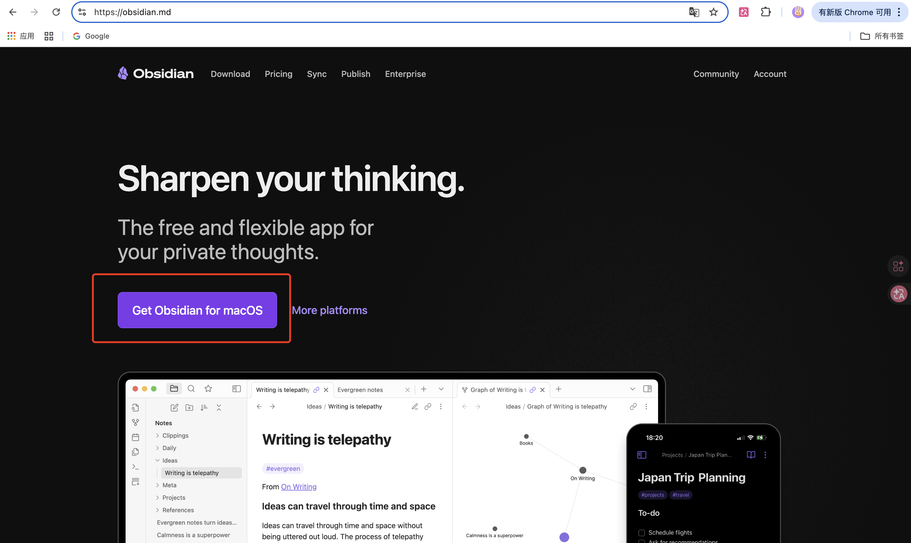

2. 下载到本地成功后，点击打开它：
点击“Create new vault”（创建新仓库）。
Vault Name：建议命名为 AI-Agent-Space。
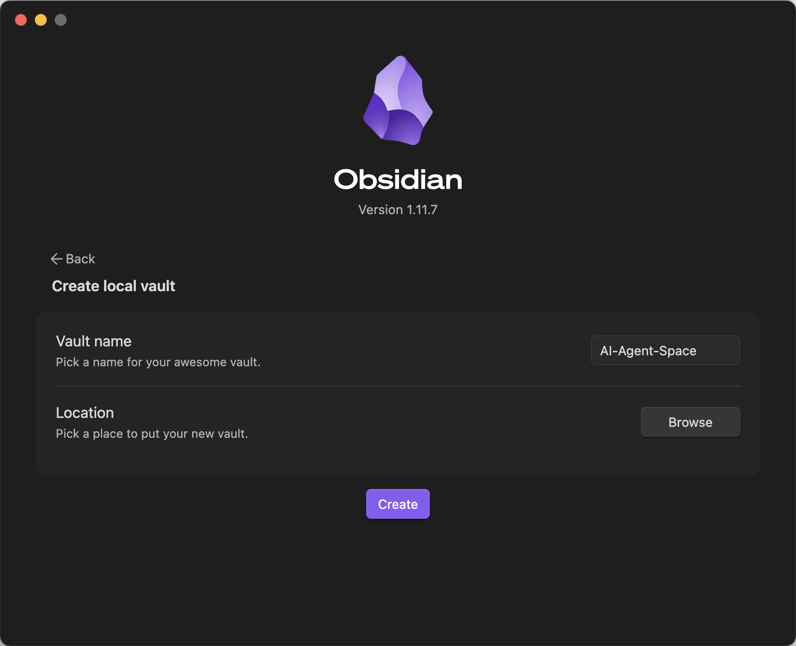

3. 点击ceate按钮之后，界面显示如下：
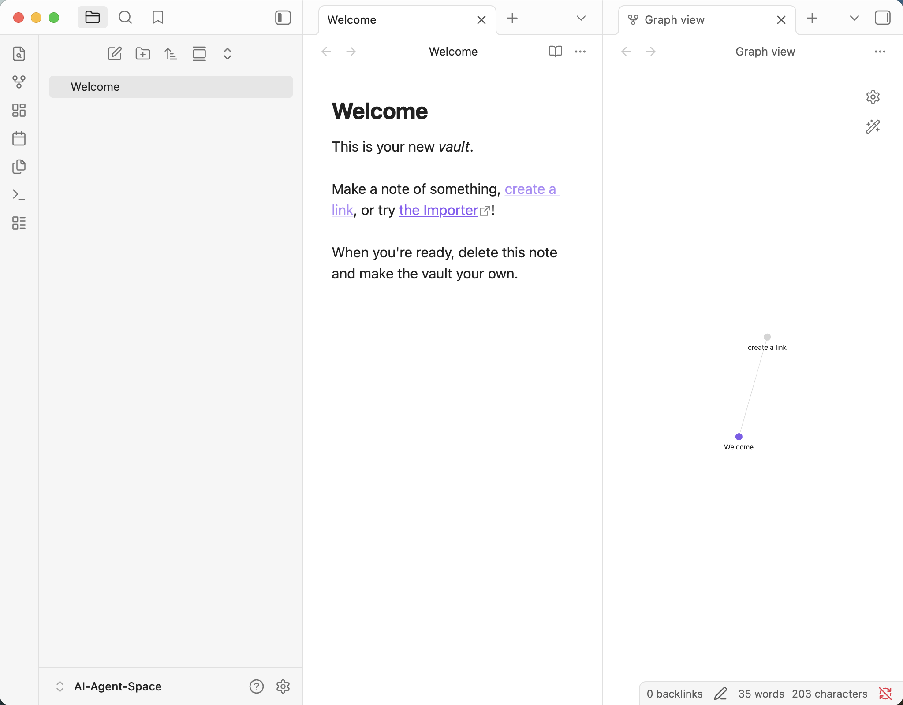

4. 进入 Settings (设置) -> Files & Links (文件与链接)，将 Default location for new attachments (新附件的默认位置) 修改为 In subfolder under current folder (当前文件夹下的子文件夹)：
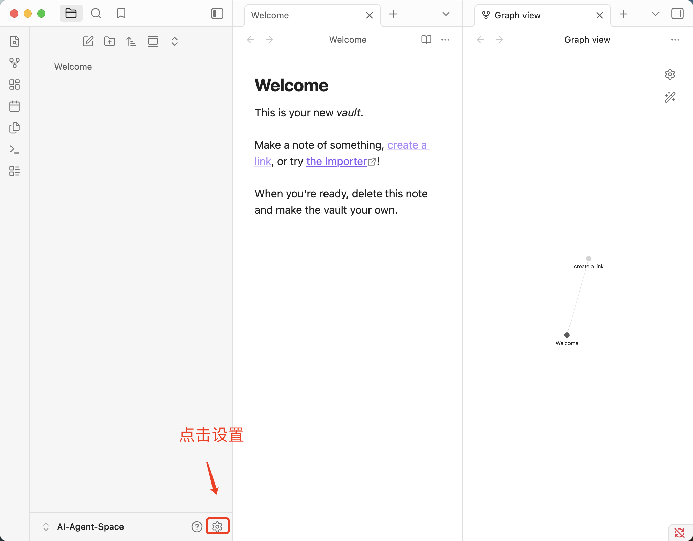
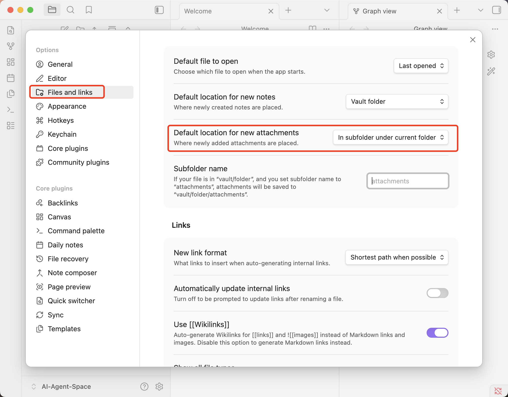

二、Text Generator 插件
1. 关闭安全模式：
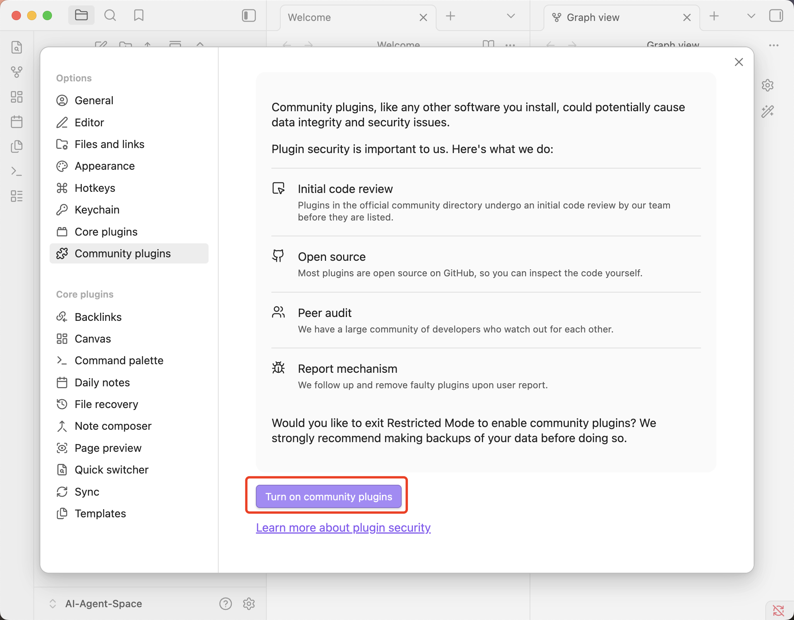

2. 安装插件：
点击 Browse (浏览)，搜索 Text Generator。
点击 Install (安装) -> Enable (启用)。
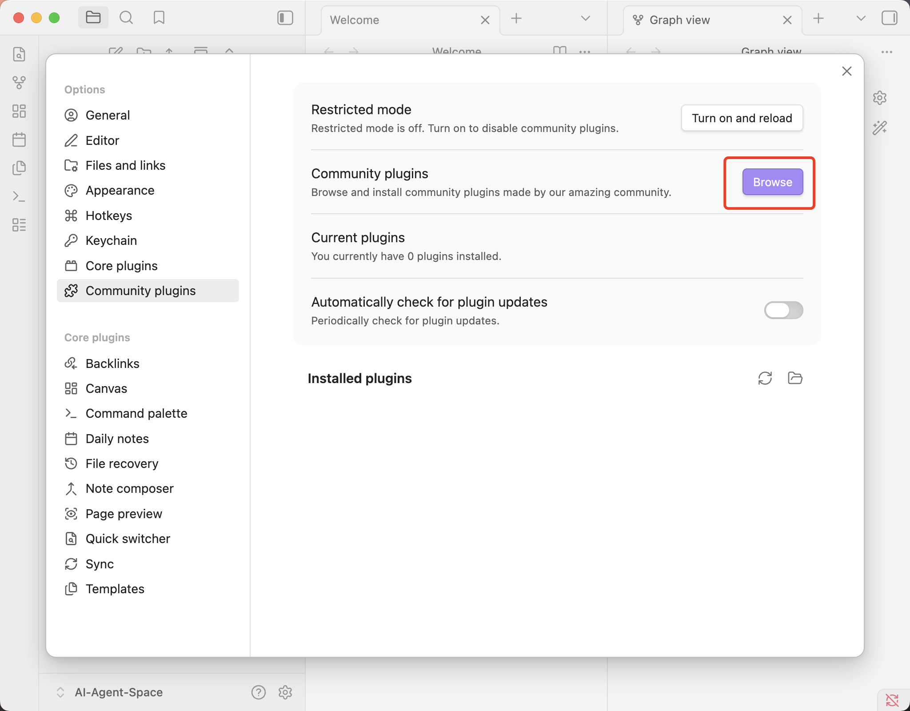
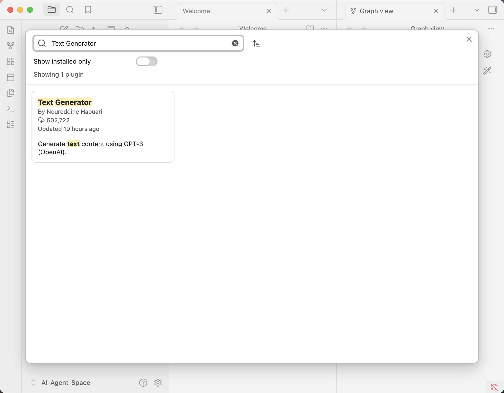
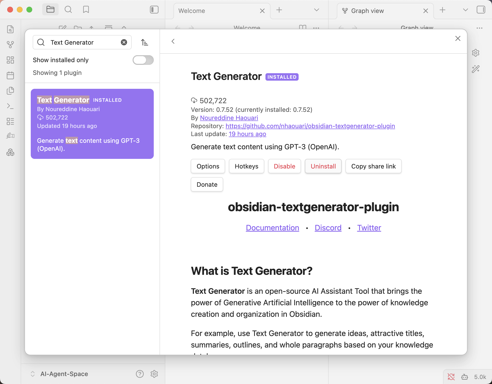

3. 配置大脑 (LLM)：
这里主要是为了跑通整个流程，所以使用的大模型是不收费的deepseek-ai/DeepSeek-R1-0528-Qwen3-8B，后续需要更智能化的计算，可以自行使用付费模型。这里使用的是国内领先的模型服务商 硅基流动 (SiliconFlow)，免费接入强大的 DeepSeek 模型，搭建从本地到云端的“神经通道”。

    注册硅基流动主要是为了获取大模型的API密匙，方便插件调用云端大模型。

    访问 硅基流动官网 (SiliconFlow) 并注册账号。
进入控制台，点击 “API 密钥” -> “新建密钥”。 ⚠️：API Key 仅在创建时显示一次，请立即复制并存放在安全的地方（如密码管理软件中）。切勿将含有密钥的截图发到朋友圈。

4. 配置 Text Generator 插件：
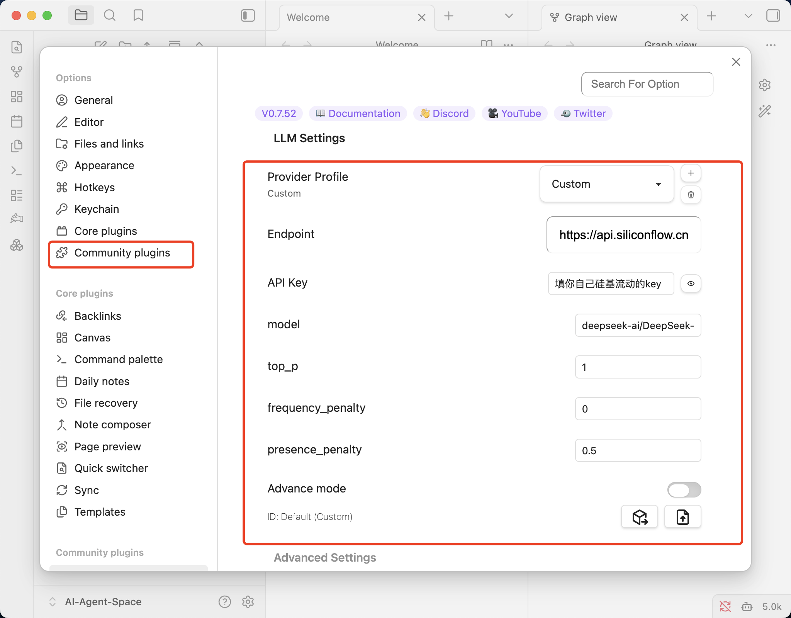

三、运行第一次对话
1. 装载提示词
新建笔记：点击左侧栏的 New note，命名为 00-Hello-World。
输入指令：在笔记中输入以下内容（这是给 AI 的指令）：
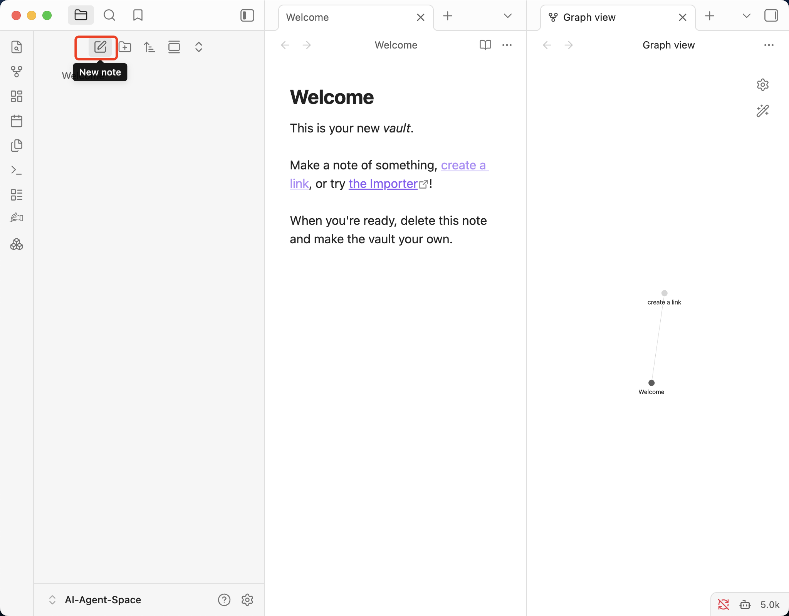

2. 触发生成：
将光标停在文字末尾。
按下快捷键（默认通常是 Cmd+J 或 Ctrl+J，具体看插件设置）。
观察屏幕，如果一段文字自动流淌出来，恭喜你！环境觉醒成功。
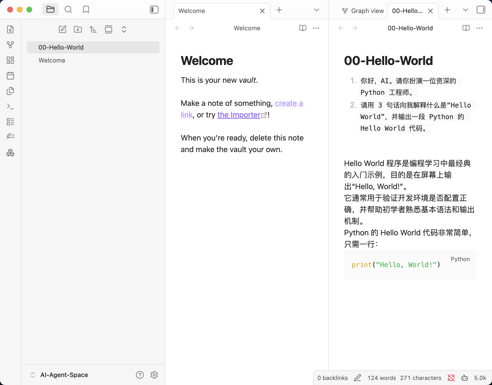

