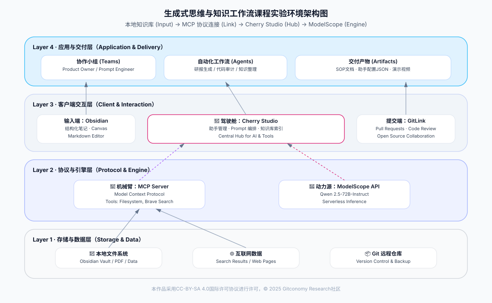

# 《生成式思维与知识工作流课程实验工具指南》

## 1. 工具体系总览

> 📌 本指南是课程学习的基础工具说明文档，旨在帮助学习者完成环境准备、工具配置，并在课程中形成一套可迁移、可复用的 AI知识工作流工具体系



*图：课程实验环境架构图*

本课程不教授单一软件的使用，而是构建一套完整的**知识生产力工作流**。我们将工具分为三个层级：

| **层级 (Layer)**                                   | **阶段**                         | **核心工具 (Core Tools)**                                                                    | **主要功能与角色 (Function & Role)**                                  | **课程应用场景 (Application Scenarios)**                                                    | **底层技术/协议**                                                                           |
| ------------------------------------------------ | ------------------------------ | ---------------------------------------------------------------------------------------- | -------------------------------------------------------------- | ------------------------------------------------------------------------------------- | ------------------------------------------------------------------------------------- |
| **1. 结构化输入层**<br><br>  <br><br>(Structure Layer) | **Input**<br><br>  <br><br>    | **Obsidian**<br><br>  <br><br>                                                           | **“图纸设计”**<br><br>  <br><br>将模糊的想法转化为结构化的Markdown笔记；构建本地知识库。   | • 整理课程笔记<br><br>  <br><br>• 使用 Canvas 梳理 Prompt 逻辑<br><br>  <br><br>• 编写结构化 Prompt 草稿 | Markdown<br><br>  <br><br>YAML Frontmatter                                            |
| **2. 生成与推理层**<br><br>  <br><br>(Inference Layer) | **Process**<br><br>  <br><br>  | **DeepSeek** (Web)<br><br>  <br><br>**Qwen** (Web)<br><br>  <br><br>**ModelScope** (API) | **“动力引擎”**<br><br>  <br><br>提供推理能力；执行生成任务；多模型交叉验证；提供底层算力API。   | • 快速验证 Prompt 效果<br><br>  <br><br>• 进行“模型竞技”对比差异<br><br>  <br><br>• 为智能体提供 API 算力支持   | LLM (大语言模型)<br><br>  <br><br>Serverless API                                           |
| **3. 智能体集成层**<br><br>  <br><br>(Agentic Layer)   | **Automate**<br><br>  <br><br> | **Cherry Studio**<br><br>  <br><br>(客户端)<br><br>  <br><br>**MCP**协议                      | **“驾驶舱”与“机械臂”**<br><br>  <br><br>集成模型与工具的统一工作台；通过协议连接本地文件与互联网。 | • 构建专属 AI 助手<br><br>  <br><br>• 配置 MCP 读取本地草稿<br><br>  <br><br>• 实现“搜索+阅读+写作”全自动工作流   | Electron (客户端)<br><br>  <br><br>Node.js<br><br>  <br><br>MCP (Model Context Protocol) |

****

## 2. 第一阶段：结构化输入 (Module 01-03)

在这一阶段，重点是学会“如何向AI提问”，前提是不仅要有Prompt，还要有结构化的知识库。

### 2.1 Obsidian

- **用途**：课程笔记、结构化信息整理、Prompt 构思。
- **下载地址**：[obsidian.md](https://obsidian.md/)
- **必要插件/配置**：

    - 开启 `Core Plugins` 中的 **Outline (大纲)**：便于查看长文结构。
    - 开启 `Core Plugins` 中的 **Canvas (白板)**：用于可视化的梳理 Prompt 逻辑（Task 02 必备）。

- **核心技能要求**：

    - **Markdown 基础**：熟练使用 `#` (标题), `-` (列表), `[[ ]]` (双链), ` ``` ` (代码块)。

    - **结构化思维**：能将一篇杂乱的文章拆解为YAML Frontmatter (元数据) + 正文层级。


---

## 3. 第二阶段：生成与迭代 (Module 04-05)

这一阶段重点在于“人机协作”与“模型祛魅”，通过对比不同模型的表现来理解 Prompt 的艺术。

### 3.1 Web 端模型 (用于快速验证)

在此阶段，我们暂不需要配置复杂的客户端，直接使用网页版进行 **Model Arena (模型竞技)**。

- **通义千问 (Qwen Web)**

    - **地址**：
    - **用途**：中文理解能力强，tongyi.aliyun.com适合进行长文本润色和风格化改写。
    -
- **DeepSeek (深度求索)**

    - **地址**：chat.deepseek.com
    - **用途**：逻辑推理强，适合用于由大纲生成初稿，以及代码类任务。
    - **特性**：关注其“思维链 (Chain of Thought)”功能，观察AI是如何思考的。

- **实操任务**：

    - **交叉验证**：同一条 Prompt（如 Task 03 编写的结构化笔记），分别发给DeepSeek和Qwen，对比其输出差异，并记录在Obsidian 中。


---

## 4. 第三阶段：智能体开发与自动化 (Module 06-07)

这一阶段是课程的高潮，我们将从“网页聊天”进阶到“构建本地智能助手”。

### 4.1 环境准备 (Prerequisites)

- **Node.js (运行时)**

    - **用途**：运行 MCP 服务器的必要环境。
    - **下载**：[nodejs.org](https://nodejs.org/) (请下载 LTS 长期支持版)。
    - **验证**：在终端/命令行输入 `node -v`，显示版本号即成功。


### 核心驾驶舱：Cherry Studio

- **用途**：集成了模型对话、知识库管理和 MCP 工具的本地客户端。
- **下载**：[Cherry Studio GitHub Releases](https://www.google.com/search?q=https://github.com/Kangfenmao/Cherry-Studio/releases&authuser=1) (支持 Win/Mac/Linux)。

- **初始化设置**：

    - 建议将界面语言设置为“简体中文”。
    - 熟悉“助手 (Assistant)”界面，这是我们配置 Agent 的主要工作区。


### 4.2 模型源：ModelScope (魔搭社区)

我们将使用 ModelScope 的 API 服务作为 Cherry Studio 的动力源。

- **步骤 1：获取 API Key**

    - 访问 [ModelScope 官网](https://modelscope.cn/) 并注册。
    - 进入个人中心 -> “模型推理” -> “API Key 管理”，复制 Key。

- **步骤 2：连接 Cherry Studio**

    - 打开 Cherry Studio `设置` -> `模型服务`。
    - 选择提供商：**OpenAI Compatible** (兼容模式)。
    - **API Key**: 粘贴你的 ModelScope Key。
    - **API Host (Base URL)**: `https://api-inference.modelscope.cn/v1`

- **步骤 3：添加模型**

    - 在模型ID栏输入：`Qwen/Qwen2.5-72B-Instruct` (推荐) 或 `Qwen/Qwen2.5-Coder-32B-Instruct`。

### 4.3 能力扩展：MCP (Model Context Protocol)

通过 MCP 协议，给你的 AI 助手装上“机械臂”。

#### **配置 A：让AI读取本地文件 (Filesystem MCP)**

- **场景**：Module 07 中，让 AI 自动读取 Obsidian 中的笔记草稿进行润色。

- **配置方法**：

    1. Cherry Studio -> `工具/MCP` -> `添加`。
    2. **类型**: `command`
    3. **命令**: `npx`
    4. **参数**: `-y @modelcontextprotocol/server-filesystem "你的笔记文件夹路径"`

    - _注意：路径不要包含特殊字符，Windows用户注意反斜杠 `\`。_

#### **配置 B：让 AI 联网搜索 (Brave Search MCP)**

- **场景**：Module 07 中，让 AI 自动搜索最新的数据来佐证观点。

- **配置方法**：

    1. 获取 [Brave Search API Key](https://brave.com/search/api/) (免费)。
    2. Cherry Studio -> `工具/MCP` -> `添加`。
    3. **类型**: `command`
    4. **命令**: `npx`
    5. **参数**: `-y @modelcontextprotocol/server-brave-search`
    6. **环境变量**: 添加一行，Key为 `BRAVE_API_KEY`，Value 为你的 Key。


---
## 许可声明

本文档采用 [知识共享署名--相同方式共享 4.0 国际许可协议 (CC BY--SA 4.0)](https://creativecommons.org/licenses/by-sa/4.0/deed.zh) 进行许可， &copy; 2025 Gitconomy Research社区。
