# 第一章 课程导论：站在认知范式的临界点

## 1.0 引言：从计算辅助到智能编排的范式转移

### 1.0.1 认知革命的临界点：当机器进入“类思维”领域

在人类技术文明的演进长河中，我们正处于一个前所未有的临界点。如果说工业革命是对人类体力的延伸与替代，那么以大语言模型（LLM）为代表的生成式人工智能（Generative AI）的崛起，则标志着一场更为深刻的“认知革命”的爆发。这不仅是工具层面的迭代，更是人类工作方式、思维模式乃至知识本身定义的根本性重构。

本课程《生成式思维与知识工作流》的设计初衷，并非仅仅作为一份AI工具的操作手册，而是旨在回应这一时代巨变对知识工作者提出的核心挑战：当机器不再仅仅是执行预设指令的“计算器”，而是演化为具备概率推理、语境理解和创造性生成能力的“智能体”（Agent）时，人类在知识生产链条中的位置应当如何重新锚定？

我们所处的时代背景，正如计算机科学家Edsger Dijkstra数十年前所预言的那样：“机器是否会思考的问题，就像潜水艇是否会游泳一样无关紧要。”[1] 真正关键的问题在于，人类如何与这些具备“类思维”能力的机器共同进化。本讲义作为课程的第一模块“课程导论”，将宏观地构建这一认知框架，深入剖析生成式 AI 带来的协作范式转移，解构传统知识工作的痛点，并详细阐述本课程基于“任务驱动学习”（Task-Based Learning, TBL）的教学逻辑与预期成果。这是一份为未来知识工作者准备的生存与进化蓝图，旨在帮助每一位学习者完成从“工具使用者”到“智能编排者”的身份跃迁。

然而，正如每一次技术革命都会带来新的结构性风险，当“生成能力”被快速普及却缺乏系统性承载时，一个新的矛盾开始浮现：

>📌 **我们是否真的理解了这种能力应当如何被使用？**

### 1.0.2 从“会生成”到“必须能运行”

生成式人工智能以前所未有的速度进入知识工作场景。  从文本写作、代码生成到分析推理，越来越多的任务开始呈现出一种共同特征：结果不再完全由人类一步步完成，而是由人类与模型协作生成。

然而，在“生成能力”迅速普及的同时，一个更深层的问题逐渐显现，如果生成无法被持续、可控地重复，它究竟算不算一种可靠的工作方式？在大量实际应用中，人们已经发现，仅仅“让 AI 生成一次答案”并不足以支撑真实世界中的知识工作。  

原因并不在于模型能力不足，而在于生成行为本身缺乏结构、状态与运行条件：

- 生成结果难以复现
- 上下文无法延续
- 经验无法积累
- 成果难以复用

 
这意味着，我们所面对的挑战，已经不再是“如何把 AI 用得更熟练”，而是一个更根本的问题，生成式 AI 应当如何被纳入一种“可运行的知识工作系统”？

正是在这一背景下，本课程并未将生成式 AI 视为一种“更聪明的工具”，而是将其视为一种迫使人类重新理解知识工作结构的技术变量。  作为课程的起点，并不试图回答“怎么做 Agent”、“如何搭建系统”，而是首先完成一项更基础、也更关键的任务：

> 📌 **重构学习者对“思考、生成与工作流程”的认知坐标。**

### 1.0.3  本章学习目标

🔑 完成本章学习后，学习者应当在**认知层面**完成以下转变：

| 维度  | 学习目标表述                         |
| --- | ------------------------------ |
| 思维层 | 从“把 AI 当工具”转向“把生成看作一种系统行为”     |
| 认知层 | 意识到生成结果的价值取决于其**是否可被重复、延续与复用** |
| 方法层 | 理解“结构、约束、状态”在生成式系统中的基础地位       |
| 系统层 | 初步建立“生成 ≠ 一次输出，而是运行过程”的判断框架    |

这一模块将帮助学习者意识到生成式 AI 的真正影响，不在于“替你完成了多少工作”，而在于它迫使人类第一次必须正面回答——  什么是一个可以被系统性运行的知识生产过程。

### 1.0.4 本章课堂实验要求：从“认知判断”到亲身体验

本章并不设置传统意义上的“操作型实验”，而是通过一组低门槛、高对比度的认知实验，帮助学习者在亲身体验中完成对生成式 AI 的重新理解。

通过[本章课堂实验](./../04-Labs/lab01-guide.md)，学习者应当在实践层面完成三项关键体验：

1. **打破“检索惯性”：**  通过对比“搜索（Search）”与“生成（Generate）”两种问题解决方式，直观感受生成式 AI 对知识获取路径的改变，而不仅是效率提升。

2. **测绘 AI 的能力边界：**  通过刻意设计的测试任务，识别 AI 在不同类型问题上的“能力区”与“幻觉区”，理解“锯齿状技术前沿”并非抽象概念，而是可被反复观察的现象。

3. **建立最小人机协作闭环：**  在一次完整的“生成 → 反馈 → 修订”过程中，体验人类与 AI 的协作关系，理解为什么“批判性介入”是生成式工作流中不可替代的一环。

---

## 1.1 迎接生成式思维革命

### 1.1.1 时代背景：AI从工具到思维框架的本体论跃迁

1. **技术演进的历史脉络：从机械梦想到智能伙伴**
 
要理解当下的革命，必须回溯人机协作的历史演变。从1843年Ada Lovelace 与Charles Babbage的合作开始，人类就梦想着机器能够处理符号与逻辑。然而，在很长一段历史时期内，这一梦想主要体现为“自动化”（Automation）——即用机器替代人类重复性的体力和低级脑力劳动。

进入20世纪中叶，随着达特茅斯会议的召开，人工智能学科诞生。此后的几十年间，AI 的发展经历了多次起伏，从基于规则的专家系统（Expert Systems）到基于统计的机器学习（Machine Learning）。在这一阶段，AI主要表现为“判别式”（Discriminative）模型，其核心能力在于分析既有数据、识别模式并进行分类或预测。例如，垃圾邮件过滤器可以高效地将邮件分类，推荐算法可以精准地预测用户喜好。然而，这类AI的局限性在于其“再现性”而非“创造性”——它无法生成训练数据之外的新内容。

2023年被视为“人机协作的新纪元”，以GPT-4为代表的生成式AI的爆发，彻底改变了这一格局。生成式AI不仅能够理解复杂的自然语言指令，更能够基于海量的训练数据进行推理、组合并创造出全新的文本、图像、代码甚至策略。这种能力的跃迁，使得AI从一个被动的“检索与分析工具”，质变为一个主动的“生产与推理引擎”。生成式AI不仅仅是一个工具，它代表了一种系统级的转变，重塑了学习、工作流乃至组织设计。
 
2. **生成式思维（Generative Thinking）的认知模型**
 
在本课程中，我们将“生成式思维”定义为一种适应 AI 时代的全新认知习惯。它区别于传统的“搜索式思维”（Search-Oriented Thinking）和“记忆式思维”（Memory-Oriented Thinking）。

- **从“获取”到“生成”：** 传统思维下，当我们面临一个问题（如撰写一份市场报告），第一反应是“搜索”——去寻找现成的模板、数据或文章，然后进行拼接。生成式思维的第一反应是“构建”——设计一个能够产出该报告的逻辑结构，然后引导 AI 根据这一结构生成内容。前者是信息的搬运，后者是信息的炼金。
- **提示词作为思维的脚手架：** 许多人误以为 Prompt（提示词）仅仅是与AI对话的命令，但实质上，Prompt是人类思维结构的显性化表达。一个优秀的 Prompt 包含了背景（Context）、任务（Task）、约束（Constraints）和输出标准（Criteria）。在设计 Prompt 的过程中，人类被迫将模糊的意图清晰化、结构化。因此，Prompt Engineering 本质上是思维工程（Thinking Engineering）。
- **概率推理与逻辑引导：** 大语言模型本质上是概率预测机。生成式思维要求我们理解这一点，并学会用逻辑结构去“收敛”概率。当我们提供清晰的大纲和约束时，我们实际上是在缩减模型生成的搜索空间，强制其在高质量的逻辑通道中运行，从而避免“幻觉”（Hallucination）和平庸的输出。

 
3. **“锯齿状技术前沿”（Jagged Technological Frontier）**
 
在拥抱生成式思维时，我们必须保持理性的边界意识。哈佛商学院的一项重要研究(Dell’Acqua et al. ,2023)[2]提出了“锯齿状技术前沿”的概念：AI 的能力边界是不规则的。在某些人类认为极其困难的任务上（如撰写复杂的代码、生成创意营销文案），AI 可能表现出超越顶尖人类专家的水平；而在某些人类认为简单的任务上（如基本的算术、事实核查或需要高度语境感知的社交协调），AI 可能表现得像个初学者甚至完全失效。

*图：锯齿状技术前沿示意图*

这种不均匀的能力分布对知识工作者提出了极高的要求。我们需要具备一种动态的判断力，能够识别当下的任务是处于 AI 能力前沿的“内部”（适合自动化与生成）还是“外部”（必须由人类主导）。盲目地将所有工作交给AI会导致质量下降，而完全拒绝 AI 则意味着效率的巨大损失。本课程将着重训练这种“任务甄别”与“边界管理”的能力。

### 1.1.2 人机协作范式的变化：从指令执行到智能编排

1. **协作光谱的四个阶段**

*图：人机协作四阶段光谱图示意图*

随着AI能力的提升，人机协作的关系正在经历从简单到复杂的演变。我们可以将其划分为四个阶段，这也对应了本课程学员能力的进阶路径：

| **阶段**  | **模式**                                        | **描述**                                     | **人类角色**                            | **AI 角色**                    |
| ------- | --------------------------------------------- | ------------------------------------------ | ----------------------------------- | ---------------------------- |
| **阶段一** | **指令执行**  (Command-Control)             | 传统的软件交互模式。人类输入明确的指令，机器执行单一操作。              | 操作者     (Operator)         | 工具     (Tool)       |
| **阶段二** | **辅助增强**     (Augmentation)          | AI 作为副驾驶。人类主导工作流，AI 提供建议、补全或草稿。            | 驾驶员     (Pilot)            | 副驾驶     (Co-pilot)  |
| **阶段三** | **协作共创**     (Collaboration)         | 人与 AI 进行多轮对话，共同打磨作品。AI 具备一定的上下文记忆和推理能力。    | 导演     (Director)          | 演员/编剧  (Actor)         |
| **阶段四** | **智能编排**     (Agentic Orchestration) | AI 演化为智能体。人类设定目标和评价标准，AI 自主规划路径、调用工具并执行任务。 | 指挥官      (Orchestrator) | 代理人      (Agent) |

*表：人机协作四阶段说明*

本课程的核心目标，是带领学员从阶段二、三向阶段四跨越。在未来的工作流中，人类将更多地扮演“编排者”的角色，负责定义问题、设计工作流模板（Workflow Template）以及评估最终产出的价值，而具体的执行过程将越来越多地由 AI 代理完成。
 
2. **认知卸载与批判性思维的悖论**
 
在享受AI带来的效率红利时，我们必须警惕“认知卸载”（Cognitive Offloading）带来的副作用。MIT研究研究表明，生成式AI虽然显著降低了知识检索和初稿生成的门槛，但也可能导致人类批判性思维的退化[3]。当AI 能够轻易给出一个看似完美的答案时，学习者可能倾向于跳过验证和深思的环节，直接采纳。

这被称为“GenAI 批判性思维悖论”（GenAI-Critical Thinking Paradox）。为了对抗这一Available at 趋势，本课程特别强调“批判性迭代”的重要性。我们不仅教如何让 AI 生成，更教如何“质疑”AI。在工作流中，人类必须保留“否决权”和“修改权”。信任机制需要从传统的“信任专家”转变为“信任验证过程”。只有经过人类严谨审查和多轮迭代的AI产出，才具备真正的知识价值。
 
3. **信任的重构：认识性信任的转移**
 
在传统的知识网络中，我们对信息的信任往往基于社会关系（Social Epistemic Ties），例如我们信任某位同事或某个权威机构。然而，生成式AI打破了这一链条。AI生成的内容往往缺乏明确的来源标注，且容易产生极其逼真的虚假信息。这迫使知识工作者必须从“信息的消费者”转变为“信息的审计者”。我们在课程中将反复训练学员如何通过多模型交叉验证、溯源检查和逻辑一致性测试来确保知识的可靠性。

*图：搜索式思维 vs 生成式思维对比图*

### 1.1.3 传统知识工作方式的瓶颈

在引入新范式之前，我们需要深刻理解旧范式为何难以为继。传统知识工作面临着“不可能三角”的制约：速度、质量与规模难以兼得。

1. **静态知识管理的崩溃**
 
传统的知识管理系统（Knowledge Management Systems, KMS）通常基于静态文档库（如 SharePoint, Wiki）。它们面临着三大致命缺陷：

- **静态性与滞后性：** 知识被固化在文档中，一旦生成即开始贬值。维护和更新这些文档需要巨大的人力成本，导致知识库往往滞后于业务现实。
- **检索的低效性：** 传统检索依赖关键词匹配。如果你不知道准确的术语，就无法找到信息。此外，大量的隐性知识（Tacit Knowledge）——如专家的经验、直觉——无法被有效地文档化和检索。
- **信息孤岛：** 不同部门、不同系统之间的数据难以互通，导致企业内部存在大量的重复劳动，“重新造轮子”现象普遍。

 
相比之下，生成式AI引入了动态的知识管理模式。AI 可以实时读取、理解并综合多源信息，通过自然语言对话提供精准的答案，而非仅仅返回一堆文档链接。它将“搜索-阅读-综合”的繁琐过程压缩为一次“提问-获取”的交互。
 
2. **协调成本与“协作磨损”**
 
一份由Asana发布的《Anatomy of Work Index》报告指出，许多知识工作者将约 60% 的时间花在所谓 “work about work”（为工作本身而做的工作上，例如会议、邮件、协调、切换工具、行政任务等[4]。因此知识工作者实际上只有不到 40% 的时间用于核心的个人产出。这种“协调磨损”是组织效率低下的主要原因。

生成式AI虽然无法完全替代面对面的情感交流，但它可以通过以下方式显著降低协调成本：

- **异步通信的质量提升：** AI 可以自动生成高质量的会议纪要、行动清单和项目摘要，使得异步协作更加顺畅，减少不必要的同步会议。
- **知识流动的自动化：** 智能体可以自动将某个项目组的更新同步给相关方，打破信息壁垒，减少人工汇报的负担。
- **决策辅助：** 在需要共识的环节，AI 可以预先整理各方观点，分析利弊，为决策者提供结构化的参考，从而缩短决策周期。

 
3. **能力方差与“拉平效应”**
 
在传统模式下，资深专家与新手之间的能力差距是巨大的，且这种差距的弥合通常需要数年的经验积累。生成式AI对此产生了颠覆性的影响，即“拉平效应”（Leveling Effect）。

最近一项针对近5,000名软件开发者的大规模随机对照实验发现，在使用生成式 AI 辅助后，整体任务完成率提升了约 26%。不过，对于经验较浅、初级职位的开发者，生产力提升更大（27%–39%），而对于资深开发者，提升则较小（8%–13%）。这暗示生成式 AI 有可能对“新手 / 低经验人群”产生“拉平效应”，缩小与老手之间在产出效率上的差距（Cui et al., 2024）[5]。

这一现象对组织意味着：

- **培训周期的缩短：** 新员工可以借助AI辅助快速上手，掌握原本需要长期摸索的隐性知识。
- **专家角色的转变：** 专家不再通过垄断信息或基础技能来维持地位，他们必须转向更高阶的“判断力”、“创新力”和“复杂系统管理”能力。本课程正是为了帮助学员（无论是新手还是专家）在这一新格局中找到自己的生态位。

生成式 AI 的崛起标志着人类进入了“认知革命”的临界点。我们正在经历从传统的“指令执行”向“智能编排”的根本性范式转移。在这种新范式下，人类的角色不再是单纯的生产者，而是系统的设计师与调度者。通过理解LLM的概率推理本质，我们可以将AI视为一种具备“类思维”能力的共生体，而非单纯的软件工具。

通过区分“会生成”与“能运行”的根本差异，本节明确了课程的核心立场：

> 📌 **真正有价值的生成，不是一次输出，而是能够被持续组织与复用的过程。**
>
---

## 1.2 课程目标：从理解生成式 AI 到构建可运行的知识工作流

本课程的总体目标，并非帮助学习者掌握某一具体生成式 AI 工具的使用技巧，而是引导学习者完成一次认知角色的转变： 从生成式 AI 的使用者，转变为生成式系统的设计者与组织者。

随着生成式 AI 能力的快速普及，单纯“会用工具”已不再构成核心竞争力。真正的差异，体现在是否能够理解生成行为背后的运行逻辑，并为其提供清晰的结构、约束与协作方式。因此，本课程将重点放在以下三个层面的能力培养上：

第一，**生成式思维能力的建立**。学习者需要理解生成并非“自动给出答案”，而是一种依赖输入结构、上下文与反馈机制的过程。这一目标对应第二章中对生成式思维与知识工作流的系统性展开。

第二，**结构化知识工作的能力**。课程将引导学习者将复杂、模糊的任务拆解为可组织、可迭代的工作单元，并通过结构化输入、阶段性生成与评价机制，使生成过程逐步收敛。这一目标在第三章与第四章中通过结构化输入与智能知识工程体系得到具体化。

第三，**面向系统的协作与运行意识**。学习者不仅需要理解“生成什么”，还需要理解“如何让生成持续发生”。因此，课程目标进一步延伸至对可运行系统的认知，为后续章节中关于智能体运行环境与多智能体协作的内容奠定基础。

## 1.3 课程学习成果说明

本课程的学习成果，并不以单点技能或工具熟练度作为衡量标准，而是以学习者是否能够逐步构建一个可运行、可扩展的生成式知识工作系统作为核心判断依据。  围绕这一目标，课程通过第二章至第七章的递进式设计，引导学习者完成从“生成式思维”到“智能体协作系统”的系统性跃迁。

完成本课程后，学习者将在以下六个层面形成稳定、可迁移的学习成果：

| **成果层级**   | **学习成果表述（What）** | **能力内涵说明（How）**                                      | **主要对应章节** | **成果形态（Deliverable）**  |
| ---------- | ---------------- | ---------------------------------------------------- | ---------- | ---------------------- |
| **认知层**    | 建立生成式思维与运行视角     | 能区分搜索式与生成式思维，理解“生成必须能运行”                             | 第1–2章      | 生成式工作流认知框架说明           |
| **工作流层**   | 构建可复用的生成式知识工作流   | 能将任务拆解为 Input–Structure–Generate–Iterate–Express 五阶段 | 第2章        | 最小可行工作流（MVW）说明         |
| **输入与协议层** | 使用结构化提示作为“可执行语言” | 能用 SCORE / 结构化 Prompt 将意图转化为机器协议                     | 第3章        | Prompt 模板 / 提示链设计（MVG） |
| **知识工程层**  | 将生成结果沉淀为工程化知识资产  | 能构建可被 RAG 与 Agent 使用的知识库结构                           | 第4章        | 工程化知识库（含元数据）（MVR）      |
| **智能体层**   | 构建可持续运行的单体智能体    | 能设计具备感知、决策、行动、反思的 MVA                                | 第5–6章      | 最小可行 Agent（MVA）        |
| **协作系统层**  | 设计多智能体协作与协议化系统   | 能理解并使用 MCP 构建 Agent 协作体系                             | 第7章        | 多智能体协作结构设计             |

*表：《生成式思维与知识工作流》课程核心成果交付矩阵*
### 1.2.2 完成路径与成果闭环：从DIKW到知识工作流的螺旋上升

为了确保课程目标不流于概念性描述，本课程为学习者设计了一条清晰且可执行的完成路径。这一路径并非零散技能的简单叠加，而是围绕知识如何被生成、组织与应用，构建起一个**可反复运行、持续进化的成果闭环**。

传统知识管理领域常使用 DIKW（Data–Information–Knowledge–Wisdom）模型[6]来描述知识价值的递进关系。在这一模型中，数据经过整理形成信息，信息经过理解形成知识，知识在实践中升华为智慧。DIKW 模型为理解知识层级提供了清晰框架，但其隐含前提是：知识的形成过程相对线性，且主要依赖人类个体的认知加工。

生成式 AI 的引入，使这一前提发生了变化。在生成式环境中，信息与知识不再只通过“理解—总结—记忆”的方式积累，而是可以被系统性生成、重组与迭代。这意味着，DIKW 模型需要被重新解释：它不再是一次性向上的线性阶梯，而更像是一个**可以在系统中不断循环与放大的过程**。

基于这一判断，本课程并未简单复述 DIKW 模型，而是将其重构为一条**以知识工作流为核心的螺旋式完成路径**。在这一路径中，学习者首先面对的是未经整理的输入（数据与原始信息），随后通过结构化处理与生成式推断，将其转化为阶段性知识产出；这些产出并非终点，而是被再次纳入下一轮生成与评估之中，逐步形成稳定、可复用的知识资产。

这种“螺旋上升”的路径设计，体现了生成式 AI 时代知识工作的两个关键特征：一是**生成并非一次性完成**，而是需要在反馈中不断修正；二是**成果的价值体现在可持续运行能力**，而非单次输出质量。学习者在课程中的每一个阶段，都会产生可验证的中间成果，这些成果既服务于当前任务，也为后续阶段提供输入基础。

从课程结构上看，这一完成路径贯穿第 2 章至第 7 章的全部内容：从生成式思维的建立，到结构化输入与知识工作流设计，再到面向运行的系统理解与协作意识培养。学习者最终获得的，并不是零散的知识点，而是一套能够在不同场景中反复应用的工作方法。

因此，本课程的成果闭环并不以“掌握多少概念”作为终点，而是以学习者是否能够**独立完成一次从输入到成果、并能够再次启动下一轮生成的完整过程**作为衡量标准。这正是从 DIKW 模型迈向生成式知识工作流螺旋上升的核心意义所在。

*图：生成式知识工作流五阶段*

- **阶段一：定义与结构化（Definition & Structuring）** —— 对应 Task 01 & 02

    - _核心任务：_ 明确工作流的目标，并准备高质量的输入。
    - _理论基础：_ 信息熵理论。无序的信息是高熵的，AI 难以处理。学员需要通过结构化手段降低信息熵，为 AI 提供清晰的“语境锚点”。

 
- **阶段二：生成与批判性迭代（Generation & Critical Iteration）** —— 对应 Task 03

    - _核心任务：_ 利用 AI 生成初稿，并进行多轮打磨。
    - _理论基础：_ 人在回路（Human-in-the-loop）控制论。AI 负责高发散的生成，人类负责高收敛的判断。通过反馈循环（Feedback Loop）不断缩小生成结果与目标之间的误差。

 
- **阶段三：抽象与模板化（Abstraction & Templating）** —— 对应 Task 04

    - _核心任务：_ 复盘 Task 03 的过程，剔除偶然因素，提炼必然规律。
    - _理论基础：_ 知识工程中的“本体构建”（Ontology Construction）。将具体的经验抽象为通用的方法论，使其具备可迁移性。

 
- **阶段四：自动化与代理化（Automation & Agentization）** —— 对应 Task 05

    - _核心任务：_ 将模板配置进 Agent 平台，进行调试与发布。
    - _理论基础：_ 分布式认知（Distributed Cognition）。将人类的认知过程外包给智能代理，实现认知能力的扩展。

 
- **阶段五：沉淀、迭代与生态化协作（Repository & Evolution）** —— 对应最终成果提交 + 长期增量实践

	- 核心任务：  将已构建的 MCP 智能体发布至仓库，实现复用、评价、版本演进，并在实践中持续迭代，完成从**个人工具**到**群体知识资产**的升级。
	- 理论基础： 知识循环（Knowledge Lifecycle）与开放协作（Open Collaboration）机制。

 
单次产出只是智能体的第一个版本，真正的价值来自**长期使用、改进、复用与社区协作反馈**。  当智能体拥有版本演化记录（Versioning）、使用域（Domain Scope）、贡献路径（PR Workflow）后，学习者才真正从“使用 AI → 设计 AI → 维护 AI”迈入**生成式生产力的持续生态循环**。这一路径形成了一个“实践-反思-抽象-工具化”的螺旋上升闭环，确保学员不仅获得了鱼，还学会了渔，更制造了自动捕鱼机。

### 1.2.3 Task-Based Learning (TBL) 模型说明

本课程采用**任务驱动学习（Task-Based Learning, TBL）** 作为核心教学法。这并非随意的选择，而是基于对AI教育特性的深刻理解和教育学实证研究的支撑。

1. **为什么AI教育需要采用 TBL？**
 
传统课堂普遍采用 **PPP（Presentation–Practice–Production）模式**[7]，即“呈现 → 练习 → 产出”。教师负责讲授（Presentation），学生通过重复练习巩固内容（Practice），最终在考试或作业中展示掌握程度（Production）。这种教学方式强调知识传递与记忆，对结构化内容教学有效，但学习过程较被动，创新性、探索性和批判性思维空间较小，难以适应生成式AI时代对“自主学习、问题提出与开放式探究”的能力要求。

由于生成式AI极易上手，学生只需输入简单指令即可获得看似不错的结果，这容易让他们误以为自己已经掌握了技能。但实际上，他们可能并不理解背后的逻辑，一旦遇到复杂场景就会束手无策。

还有，AI 的表现高度依赖于具体的任务情境。脱离真实任务谈Prompt是没有意义的。因此，将AI工具整合进 TBL 框架，能够显著提升学习者的流利度、动机以及解决实际问题的能力。

2. **本课程的TBL模型架构：Pre-Task, Task Cycle, Post-Task**
 
我们的TBL模型包含三个核心阶段，每个阶段都深度融合了AI工具的使用：

| **阶段**                                | **教学目标**             | **讲师动作 (Instructor)**                             | **学员动作 (Student)**                                                                | **AI 角色**                                           |
| ------------------------------------- | -------------------- | ------------------------------------------------- | --------------------------------------------------------------------------------- | --------------------------------------------------- |
| **Pre-Task**      (前任务)   | 激活背景知识，明确任务目标，提供脚手架。 | 引入概念，展示优秀的 Agent 案例，提供基础的 Prompt 框架（Scaffolding）。 | 分析任务需求，进行头脑风暴，明确工作流设计思路。                                                          | **概念辅助**：利用 AI 解释复杂概念，或生成头脑风暴的初始点子。                 |
| **Task Cycle**      (任务环) | 执行任务，经历困难，进行迭代。      | 观察学员操作，提供即时反馈（非直接答案），引导学员查阅文档。                    | **计划**：设计工作流。  **执行**：与 AI 进行高强度交互，记录 Prompt 日志。  **报告**：整理生成结果，准备展示。 | **执行伙伴**：AI 生成初稿，根据反馈修改，甚至反向提问以澄清需求。                |
| **Post-Task**      (后任务)  | 反思、分析、归纳与内化。         | 抽取典型案例进行点评（Critique），强调“结构化”与“迭代”的价值。             | 复盘整个过程，分析哪些 Prompt 成功了，哪些失败了，为什么？将经验沉淀为模板。                                        | **分析工具**：利用 AI 分析自己的 Prompt 日志，甚至让 AI 给自己打分并提出改进建议。 |

*表：AI 增强型任务驱动教学 (AI-TBL) 实施框架表*

3. **基于 Git 的协作式 TBL：将学习过程代码化**
 
为了进一步强化 TBL 的效果，我们将软件工程中的Git工作流引入教学：

- **Issue 作为提问板：** 学员通过Issue提出在任务执行中遇到的困难，通过讨论区进行协作学习。
- **Pull Request (PR) 作为作业提交：** PR的机制天然包含了“Code Review”。讲师和助教可以直接在学员提交的Markdown文档上进行行级评论（Line-by-line Comment），指出 Prompt 的逻辑漏洞。
- **Commit History 作为思维黑匣子：** Git的提交记录忠实地保存了学员的每一次修改。这使得学习过程变得可视、可追溯。我们不仅评价最终的“作品”，更评价“修改的过程”。

---

## 1.3 核心概念深度解析：结构、熵与人机接口

在导论中，我们反复提到了“结构化”。为什么在生成式 AI 时代，结构化变得如此重要？这不仅仅是一个操作技巧，更关乎大语言模型（LLM）的本质运作机理和信息论的基本原理。

### 1.3.1 概率与逻辑的博弈：LLM 的“熵减”游戏

从底层原理来看，LLM本质上是一个概率模型。它是基于海量文本数据训练出来的，通过计算“给定上文，下一个词出现的概率分布”来生成文本。它并没有人类那样严密的、基于因果律的内在逻辑世界观。

*图：信息熵状态转化图示意图*

- **高熵状态：** 当你给出一个模糊指令（如“帮我写个方案”）时，模型面临的上下文极其宽泛，可能的输出路径成千上万。这是一种“高熵”状态。在这种状态下，模型倾向于输出最平庸、最常见（概率最高）的内容，甚至产生幻觉），因为它在茫茫的概率海洋中“猜”你想要什么。
- **低熵状态：** 当你提供一个清晰的结构（背景、角色、任务、约束、输出格式）时，你实际上是极大地缩小了模型的搜索空间。你排除了那些低质量的概率路径，强制模型在高质量的逻辑通道中运行。这就是 Prompt Engineering 的本质——通过引入负熵（Structure Information），对抗生成的随机性。

 
### 1.3.2 Prompt作为“认知接口”

生成式思维的一个核心功能，就是充当人类“模糊认知”与 AI “精确结构”之间的翻译器。

- **人类端：** 思考往往是跳跃的、碎片的、隐性的（Tacit）。
- **AI 端：** 执行需要是连续的、完整的、显性的（Explicit）。

 

本课程后续章节，特别是第三章《结构化输入——为AI准备清晰的“图纸”》将重点训练这种“翻译能力”——如何将你脑海中灵光一现的想法，拆解为 AI 能够一步步执行的工序。Prompt在这里不仅是指挥 AI 的工具，更是人类思维显性化的接口。如果你自己对任务没有想清楚，你是写不出好Prompt的。因此，我们常说：“清晰的写作来自清晰的思考”，在 AI 时代，我们可以说：**“清晰的生成来自结构化的思考”。**

### 1.3.3 伦理与责任：作为AI公民的自觉

在课程导论中，我们必须提及AI使用的伦理维度。随着AI逐步介入决策流程，其潜在的偏见、隐私风险和所有权问题不容忽视。

- **数据隐私：** 在构建工作流时，特别是涉及企业内部数据时，必须了解哪些数据可以输入给公有大模型，哪些必须本地化处理。
- **责任归属：** 即便AI完成了 99% 的工作，人类依然是最终结果的责任人。我们不能将错误推卸给算法。这种“责任感”是人机协作中人类不可让渡的底线。

 
---

## 1.4 学员学习思考指南

在正式进入 第二章《从搜索到生成——定义你的知识工作流》之前，请学员思考以下问题，并尝试在脑海中构建初步答案：

1. **痛点识别：** 在你目前的工作中，哪一个环节最让你感到重复、枯燥且低效？（是会议纪要整理？是周报撰写？还是文献综述？）
2. **思维实验：** 如果有一个AI实习生完全听命于你，且具备无限的精力，你最想把什么任务交给它？
3. **障碍分析：** 你认为阻碍你将该任务交给 AI 的最大障碍是什么？（是任务太复杂？还是你不知道如何描述？或者是数据安全顾虑？）
 

---

## 1.5 课程总结

>📌 本章引导学习者完成生成式思维转变，建立对 AI 能力边界与协作方式的基本认知。

围绕这一目标，本章并未从工具操作或技术细节入手，而是通过背景分析、范式对比与课堂实验，引导学习者重新审视自己熟悉的知识工作方式。通过对搜索式思维与生成式思维的对比，学习者逐步意识到，生成式 AI 并不是“更快给出答案的工具”，而是一种要求人类重新组织问题、结构与判断过程的协作对象。同时，通过对 AI 能力不稳定性与幻觉现象的体验式观察，学习者开始理解 AI 并非在所有任务中都可靠，人类在生成过程中的判断、修正与责任承担仍然不可替代。

因此，本章的重点不在于“学会使用 AI”，而在于建立一种新的学习与工作心态：在与 AI 协作时，主动区分人机分工边界，保持批判性介入，并将生成视为一个需要被管理和反思的过程。这一认知基础，将为后续章节中关于生成式工作流的定义与结构化提供必要前提。

---

## 1.6 附录1：核心概念术语表 (Glossary)

为了帮助学员更好地理解本课程，以下列出导论部分涉及的核心术语及其在本课程语境下的定义。

| **English Term**                       | **中文术语**   | **定义与解析 **                                                                  |
| -------------------------------------- | ---------- | --------------------------------------------------------------------------- |
| **Generative Thinking**                | 生成式思维      | 一种以推理和迭代为核心，通过结构化输入引导 AI，将信息转化为成果的思维模式。它区别于传统的“搜索式”与“记忆式”思维，强调“构建”而非“搬运”。   |
| **Knowledge Workflow**                 | 知识工作流      | 将知识工作拆解为“输入-结构化-生成-迭代-表达”五个关键环节，并利用 AI 对各个环节进行辅助或自动化的流程链路。                  |
| **Agentic AI**                         | 代理式/智能体 AI | 具备一定自主性（Autonomy）的AI系统。它不仅能回答问题，还能根据设定的目标自主规划路径、调用外部工具并执行多步复杂任务。            |
| **Jagged Frontier**                    | 锯齿状技术前沿    | 指 AI 能力分布的不均匀性现象。AI可能在某些人类认为困难的任务上表现极强，却在某些简单的任务上表现极弱或完全失效。使用者需具备识别这一边界的能力。 |
| **Task-Based Learning (TBL)**          | 任务驱动学习     | 本课程采用的核心教学法。强调将学习过程置于真实、复杂的任务情境中，通过完成具体的项目（如构建一个 Bot）来内化知识和技能。              |
| **Human-in-the-loop**                  | 人在回路       | 指在自动化系统中，人类保留关键的监督、审核和决策权。在AI生成初稿后，必须有人类的介入进行价值判断和迭代优化，以确保结果的可靠性。           |
| **Epistemic Trust**                    | 认识性信任      | 在知识网络中对信息有效性的信任机制。在 AI 时代，这种信任需要从基于“权威信源”转移到基于“严谨的验证过程”（如交叉验证、逻辑自洽性检查）。     |
| **Minimum Viable Workflow**            | 最小可行工作流    | 借鉴MVP概念，指一个能够跑通、产出基本结果的最简化的Prompt链路。它是构建复杂智能体（Agent）的基础原型。                  |
| **GIGO** (Garbage In, Garbage Out)_ | 垃圾进，垃圾出    | “垃圾进，垃圾出”原理。在生成式 AI 中，特指输入数据的质量、结构和清晰度直接决定了 AI 生成结果的质量。                     |

---

## 1.8 附录2：参考文献

[1] Dijkstra, E. W. (1984). _The threats to computing science_ (EWD898).
University of Texas at Austin. Available at: https://www.cs.utexas.edu/~EWD/transcriptions/EWD08xx/EWD898.html  
[2] Dell’Acqua, F., McFowland, E. III., Mollick, E., Rajendran, S., Krayer, L., Candelon, F., & Lifshitz-Assaf, H. (2023). _Navigating the Jagged Technological Frontier: Field Experimental Evidence of the Effects of AI on Knowledge Worker Productivity and Quality_ (Working Paper No. 24-013). Harvard Business School. Available at: https://www.hbs.edu/ris/Publication%20Files/24-013_d9b45b68-9e74-42d6-a1c6-c72fb70c7282.pdf  
[3] Noy, S., & Zhang, W. (2023). Experimental evidence on the productivity effects of generative artificial intelligence. _Science_, 381(6654), 187–192. Available at : https://economics.mit.edu/sites/default/files/inline-files/Noy_Zhang_1.pdf  
[4] Asana. (2021). _Anatomy of Work Index 2021_. Asana, Inc. Available at : https://asana.com/resources/anatomy-of-work-index  
[5] Cui, Zheyuan and Demirer, Mert and Jaffe, Sonia and Musolff, Leon and Peng, Sida and Salz, Tobias, The Effects of Generative AI on High-Skilled Work: Evidence from Three Field Experiments with Software Developers (August 20, 2025). Available at SSRN: [https://ssrn.com/abstract=4945566](https://ssrn.com/abstract=4945566)  
[6] Ackoff, R. L. (1989). From data to wisdom. _Journal of Applied Systems Analysis_, 16, 3–9. Available at: https://faculty.ung.edu/kmelton/documents/datawisdom.pdf  
[7] Harmer, J. (2007). _How to teach English_ (New edition). Pearson Education. Available at:  https://www.academia.edu/41620410/How_To_Teach_English  

---

## 许可声明

本文档采用 [知识共享署名--相同方式共享 4.0 国际许可协议 (CC BY--SA 4.0)](https://creativecommons.org/licenses/by-sa/4.0/deed.zh) 进行许可， &copy; 2025 Gitconomy Research社区。
