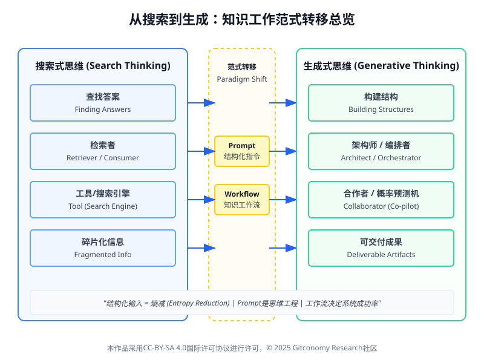
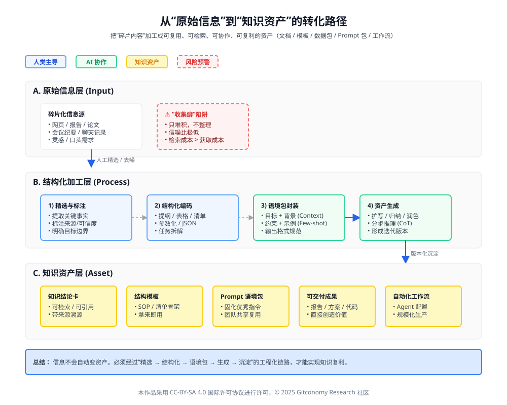
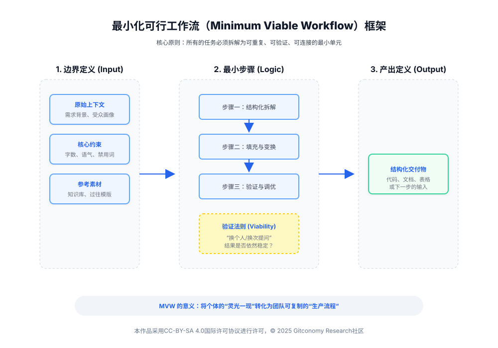

# 第二章 从搜索到生成：重构知识工作流

## 2.0 引言：从自然语言的混沌到认知工程的秩序

>  ⭐ 本章将逐步引入 Prompt、评估、迭代等多个概念，用于说明生成式AI如何参与知识工作。但请注意本章的学习目标并不是掌握所有技巧或理解所有理论。 本章唯一且明确的目标，是帮助你跑通一条可以被重复执行的最小可行知识工作流（Minimum Viable Workflow, MVW）。

### 2.0.1 语言的熵值与人机对齐的挑战

在第一章《课程导论：站在认知范式的临界点》中，我们确立了生成式思维的核心宗旨：从被动的信息检索者转变为主动的知识编排者。然而，当我们试图跨越这一鸿沟时，首要面临的阻碍并非算力的匮乏，而是沟通的“带宽”限制。人类语言本质上是一种高压缩、高语境且充满歧义的编码系统。这种基于“共享意向性”的沟通是人类协作的基石，但对于大语言模型（LLM）而言，这种含混性是致命的。

大语言模型，本质上是一个基于概率的下一词预测引擎（Next-Token Predictor）。它在海量的互联网文本上进行训练，学习到了人类知识的统计分布。当我们向模型输入一个模糊的指令时，我们实际上是在一个近乎无限的解空间中进行盲目采样。根据信息论的熵（Entropy）概念，模糊的提示词具有极高的熵值，意味着其对应的不确定性极大。

因此，本章的核心任务——**“结构化提示工程”（Structured Prompt Engineering）**，本质上是一场**熵减运动**。我们需要通过引入特定的句法结构、逻辑约束和认知框架，人为地降低输入信息的熵值，从而迫使模型的概率分布向我们需要的高价值区域坍缩。这不仅仅是学习如何“提问”，更是一种**思维工程（Thinking Engineering）**——在向AI发出指令之前，我们必须首先对自己的混沌思维进行结构化清洗，将其编译为机器可读的“认知合约”。

### 2.0.2 提示工程的认识论转折：从黑客技巧到系统科学

随着模型能力（特别是 DeepSeek V3、GPT-4o 等强推理模型）的指数级跃迁，提示工程正在经历一场深刻的认识论转折——从经验主义的炼金术转向基于原理的系统科学。

这种转折体现在三个层面：

1. **从自然语言到半结构化语言**：引入XML标签、Markdown语法、JSON 结构，利用符号体系界定语义边界，防止“指令遵循”（Instruction Following）漂移。
2. **从单轮指令到思维链（CoT）设计**：通过植入“思维链”，强制模型调用“系统2”（慢思考）能力，实现复杂逻辑任务的性能飞跃 。
3. **从通用模版到模型特异性优化**：针对不同架构（如 DeepSeek V3 的 MLA 架构）调整策略，更多依赖上下文学习（In-Context Learning）而非死记硬背。

<br>


*图：知识工作范式转移总览*

### 2.0.3 本章学习目标

🔑 完成本章学习后，学习者应当在以下几个方面形成明确、可检验的学习成果：

| 维度  | 学习目标表述                             |
| --- | ---------------------------------- |
| 思维层 | 从“写好一句 Prompt”转向“设计一条完整的生成流程”      |
| 认知层 | 理解生成结果的稳定性来源于流程结构，而非模型本身           |
| 方法层 | 掌握将任务拆解为**输入 → 生成 → 评估 → 修订**的基本步骤 |
| 实践层 | 能够设计并跑通一条**最小可行工作流（MVW）**          |
| 表达层 | 能清晰说明工作流的目标、步骤、输入与输出               |

在整个课程体系中，第二章承担的是“方法起步”的角色：

- 第一章完成的是认知重构：为什么“会生成”还不够
- 第二章开始进入“做事方式”：如何把生成组织成流程
- 第三章将在此基础上，进一步解决**流程中输入不稳定的问题**

<br>
因此，第二章的学习成果不是“生成质量是否最好”，而是**流程是否成立、是否可复现**。  这一成果将作为后续所有结构化提示、知识工程与智能体设计的共同起点。

---

## 2.1 生成式思维：Prompt是结构化思考的投影

### 2.1.1 大语言模型的认知架构与交互机制

Transformer架构的核心本质在于“注意力机制”（Attention Mechanism），它通过并行计算输入序列中每一个Token与其他Token之间的关联权重来理解语义。在处理上下文窗口时，以DeepSeek V3为例，尽管其支持高达128K token的输入，但为了有效解决长文本中常见的“中间迷失”现象，用户仍需通过标题、分隔符等显著的格式标记来人为提升关键信息的权重。此外，DeepSeek V3采用的MLA技术显著减小了KV Cache的规模，从而提升了推理效率，这意味着我们在交互中可以更“奢侈”地使用少样本示例（Few-Shot Examples），而无需过分担忧由此带来的推理延迟或成本压力。

在此基础上，我们需要重新审视“锯齿状技术前沿”（Jagged Technological Frontier）这一概念，并培养对任务进行甄别的元能力。对于位于“前沿内部”的任务，如文本摘要、翻译及简单代码生成，AI展现出卓越的能力，此时的交互重点应聚焦于指令的清晰度和格式规范。相反，对于“前沿外部”的任务，例如复杂的数学证明或创作长篇连贯小说，AI的能力尚显不足，因此策略重心必须转向过程控制，需要通过拆解任务、强制反思以及运用多路径推理（Tree of Thoughts）来引导模型。

为了进一步优化输出质量，我们可以借鉴人类认知心理学，尝试唤醒AI的“慢思考”（系统2）。例如，使用Zero-Shot CoT策略，即提示模型“Let's think step by step”，虽然这增加了计算时间，但却为模型提供了一个宝贵的“自我纠错”缓冲区。特别值得注意的是DeepSeek R1带来的启示：由于R1已通过强化学习内化了思维链，在使用此类模型时，过分琐碎的过程指导反而可能干扰其内部优化的路径，因此应调整策略，更侧重于提供清晰的最终验证标准。

### 2.1.2 信息熵（Information Entropy）与结构化的必要性

为什么有时候 AI 会一本正经地胡说八道（幻觉）？从信息论的角度来看，这是因为输入信息的熵（Entropy）过高。

- **理论支撑**：**Claude Shannon (1948)** 在其信息论奠基之作中指出，信息传递的有效性取决于信号的组织结构[1]。当输入信号极其混乱（高熵）时，接收端（无论是人还是 AI）解码出准确信息的概率就会大幅下降。
- **在 AI 中的映射**：一个模糊的Prompt（如“帮我写个方案”）包含极高的熵，模型在潜在空间中的搜索范围接近无限，因此输出质量不可控。
- **结构化的本质**：**结构化输入 = 熵减（Entropy Reduction）**。通过引入明确的约束（Constraints）、背景（Context）和格式（Format），我们实际上是在对信息进行“预压缩”，迫使模型在更窄、更准确的概率空间内进行推理。

<br>


*图：信息熵状态转化图*

### 2.1.3 Prompt不只是和AI对话的命令，更是人类结构化思维的载体

在生成式 AI 出现之前，解决问题往往依赖我们搜索资料并直接整理答案，这更接近于信息的搬运和记忆；而生成式思维要求我们先搭建解决问题的逻辑框架，再让 AI 去填充细节。Barbara Minto 在《金字塔原理》中提到，有效传达想法的前提是清晰的逻辑结构(Minto, 1996)[2]。类似地，一个精心设计的Prompt会包含**角色设定、背景上下文、任务目标、约束条件和输出评价**等要素，使我们的意图对 AI 来说清晰明了。这一过程迫使我们将模糊的想法条理化，把隐藏的假设摊开来审视——可见，**Prompt Engineering 本质上是思维工程**，要求我们具备结构化表达和问题分解的能力。

值得强调的是，在与大型语言模型(LLM)交互时，“生成”不等于直接得到输出，而是一个包括推理、迭代和裁剪的循环过程。首先是**推理**：我们引导模型逐步思考，分解复杂问题，让它给出初步的推理过程或草稿答案。这一点与人类写作先列提纲再行文类似，大模型通过链式思考获得了更高质量的结果(Wei et al., 2022)[3]。接着是**迭代**：对模型的初始回答进行批判性评估，找出其中的不足之处，然后通过新的提示对其进行改进。迭代是生成式思维的核心环节——正如 Sweller (1988)[4] 强调的，逐步解决问题、不断反馈修正，可以有效降低认知负荷，让复杂任务更易管理。最后是**裁剪**：在多轮生成之后，我们需要对内容进行取舍和定稿。这一阶段就像编辑润色文章，去除冗余信息，纠正错误与不一致之处，确保输出与预期目标严丝合缝。

| **阶段**                | **核心动作**             | **认知原理与技术映射**                                                                            |
| --------------------- | -------------------- | ---------------------------------------------------------------------------------------- |
| **1. 推理 (Reasoning)** | 引导模型构建逻辑链条，而非仅做概率续写。 | 利用 **CoT (Chain-of-Thought)** 技术，强迫模型展示思考过程（如 DeepSeek R1 的 `<think>` 过程），激活其“系统2”慢思考能力。 |
| **2. 迭代 (Iteration)** | 对初稿进行反向提问、评价与修正。     | 生成式 AI 的初稿通常只是“平均水平”。**高质量是聊出来的**。利用反馈回路（Feedback Loop）降低误差。                             |
| **3. 裁剪 (Pruning)**   | 删除噪声、剔除幻觉、强化关键内容。    | 人类回归**编辑（Editor）与裁判（Judge）**的角色，运用批判性思维进行价值判断。                                           |
*表：AI 协作流程的三阶段模型*

这种“推理→迭代→裁剪”的三部曲，体现了生成式思维从发散到收敛的完整过程。通过掌握这三个阶段，提示词设计者可以像雕刻家一样打磨作品：既充分发掘 AI 创造力，又通过人类的判断力和结构化指导将结果收敛到高质量的状态(Shneiderman, 2022)[5]。

### 2.1.4 小结：Prompt是思维工程，而不是聊天技巧

理解大语言模型（LLM）的关键在于将其视为一个“基于概率的下一词预测引擎”，而非百科全书。人类语言的含混性在机器视角下表现为高“熵值”（不确定性）。因此，知识工作的重构本质上是一场“熵减工程”：通过结构化的输入，将模型从无限的随机采样中引导至确定的、符合预期的解空间内。

Prompt的真正价值并不在“把话说得更漂亮”，而在于它迫使人类先把问题**拆开、立架、定边界**：角色、背景、目标、约束与评价等要素，让模糊意图变成可执行的指令结构。更关键的是，“生成”并不等于一次性输出，而是一个包含推理、迭代、裁剪的循环过程——人类在其中承担批判与取舍的角色。

---

## 2.2 从指令到系统：构建可控的知识工作流
### 2.2.1 什么是知识工作流？

在深入探讨 Prompt 技巧之前，我们需要先回答一个更基础的问题：什么是知识工作流（Knowledge Workflow）？

当我们处理写研究综述、周报、项目方案或数据分析等**知识密集型任务**时，我们永远不会是一蹴而就的。相反，我们会经历一系列隐性的认知步骤：从收集材料开始，经过整理理解、形成结构、撰写草稿、打磨修改，直到最终产出成果。这些步骤之间存在明确的依赖关系、角色分工和信息流动，就像一条精密的**“知识生产流水线”**。

因此，我们将**知识工作流**定义为：**人类认知步骤的可视化 + 可复用的执行链路**。与企业中处理标准化事务的“业务流程”不同，知识工作流处理的是开放性问题、复杂任务以及抽象的思考与表达。其本质是一种从输入到输出的系统化协作方式，它规定了信息如何进入系统、如何被结构化处理、如何被 AI 生成草稿以及如何被人类迭代。

> ⭐ 核心洞察：
>
> Prompt 是单点行为，着眼于“怎么说”；
>
> 知识工作流是系统行为，着眼于“整个任务怎么跑”。

### 2.2.2 为什么生成式AI需要知识工作流？

生成式 AI 的出现并没有消灭工作流，反而使其变得更加重要。大语言模型（LLM）虽然在文本生成、语言转化、多轮推理和信息总结方面表现卓越，但它存在天然的短板：它不擅长定义任务目标、规划执行步骤、检查质量标准以及决定最终的表达形式。


*图“：思维链与直接生成的推理路径对比*

如果缺乏工作流的约束，完全依赖 AI 的“自由发挥”，我们往往会遇到生成内容“看起来正确实则离谱”、内容冗长无重点，甚至在多轮对话中逐渐偏离主题（幻觉）的问题。因此，生成式时代的核心技能，不再仅仅是“写好一个 Prompt”，而是**“设计一条可控的知识工作流”**。

|**维度**|**AI 的擅长点 (能力)**|**AI 的短板 (风险)**|**人类的角色 (工作流设计)**|
|---|---|---|---|
|**执行层面**|高速生成、海量知识检索、多语言转换|幻觉、逻辑跳跃、无法自检|**规则制定者**：定义约束条件与验证标准|
|**规划层面**|战术执行 (微观推理)|战略缺失、任务拆解能力弱|**架构师**：拆解任务步骤，设计依赖关系|
|**结果层面**|输出初稿、提供素材|缺乏审美、难以对齐业务目标|**把关人**：质量评估、价值判断与最终决策|

### 2.2.3 知识工作流与Prompt的关系

为了避免陷入“Prompt 理论堆砌”的误区，我们需要明确二者的辩证关系：**Prompt是工具，知识工作流是方法。**



*图：MVW最小可行工作流vs理想/复杂状态*

在没有工作流设计时，Prompt 只能一次次“碰运气”，试图用一个指令解决所有问题。但一旦建立了“输入 → 结构 → 生成 → 迭代 → 表达”的链路，每个 Prompt 就变成了任务链中的一个“结构化组件”或“节点函数”。每一步都清楚信息从哪里来、到哪里去。可以说，Prompt决定了“局部最优”，而工作流决定了“整体最优”和任务的成功率。

|**对比维度**|**Prompt (提示词)**|**Knowledge Workflow (知识工作流)**|
|---|---|---|
|**定位**|**操作指令 (Operation)**|**任务架构 (Architecture)**|
|**作用范围**|决定“这一小步怎么走”|决定“整个任务怎么跑”|
|**效能提升**|优化提升约 **30%** (提升单点质量)|优化提升约 **300%** (决定系统成功率)|
|**性质**|往往是即兴的、一次性的|可复用的、可迭代的、自动化的|
|**核心要素**|语境、指令、风格|流程、拆解、评估、反馈环|

*表：提示词+知识工作流*
### 2.2.4 重定位：Prompt是知识工作流的“通信协议”

基于上述理解，我们对“Prompt 是结构化思考”这一概念进行更精确的重写：**Prompt 是知识工作流中“Structure（结构化）→ Generate（生成）”之间的接口层。**



*图：Prompt是人机协作的“通信协议层”*

在一个完整的五步知识工作流中，Prompt 承担着承上启下的关键作用。它不再是随口而出的“请求”，而是人类的结构化思考能够被模型准确接收与执行的“通信协议”。

| **工作流环节** | **环节名称**            | **动作描述**     | **Prompt 在其中的位置与作用**                       |
| --------- | ------------------- | ------------ | ------------------------------------------ |
| **1**     | **Input (输入)**      | 人类整理原始材料     | (准备阶段，为 Prompt 提供 Context)                 |
| **2**     | **Structure (结构化)** | 人类进行认知整理与架构  | **Prompt 的核心**：将人类的结构化思维翻译成模型指令            |
| **3**     | **Generate (生成)**   | AI 依据结构推理并生成 | **Prompt 的执行**：模型接收协议，产出内容                 |
| **4**     | **Iterate (迭代)**    | 人类评价 AI 输出   | **Prompt 的修正**：通过反馈指令（Feedback Prompt）进行纠偏 |
| **5**     | **Express (表达)**    | 制作最终成果形式     | **Prompt 的规范**：定义输出的格式标准 (Format)          |

*表：Prompt作为'通信协议'的作用*

### 2.2.5 小结：从指令到系统——知识工作流是“可复用执行链路”

MVW（Minimum Viable Workflow）是本课程的核心实践方法。它强调不要试图一次性解决所有复杂问题，而是先跑通一个包含“输入-处理-反馈-输出”的最小闭环。通过将任务拆解为可重复、可观测的步骤，我们可以将不可控的 AI 生成转化为可预测的工业化流水线，从而实现效率的指数级提升。

---

## 2.3 知识工作流的五环节模型：I-S-G-I-E 的深度解构

基于 Tiago Forte 的CODE模型[6]及现代AI最佳实践，我们提出了五环节模型：Input（输入）、Structure（结构）、Generate（生成）、Iterate（迭代）、Express（表达）。

| **环节**    | **英文**        | **传统范式**       | **AI 范式 **       | **核心能力要求**  |
| --------- | ------------- | -------------- | ---------------- | ----------- |
| **1. 输入** | **Input**     | 被动收集、海量存储、稍后阅读 | 主动筛选、语境投喂、RAG 增强 | 信息架构与数据清洗能力 |
| **2. 结构** | **Structure** | 文件夹分类、标签管理     | 提示工程、思维链设计、角色设定  | 逻辑拆解与元认知能力  |
| **3. 生成** | **Generate**  | 人工撰写、从零起草      | 概率生成、骨架扩展、多模态合成  | 概率思维与模型驾驭能力 |
| **4. 迭代** | **Iterate**   | 自我校对、线性修改      | 自我修正、密度提升、人机回环   | 批判性思维与鉴赏力   |
| **5. 表达** | **Express**   | 单一文档交付         | 多渠道分发、逆向沉淀、自动化流转 | 资产化与系统化思维   |

*表：传统知识处理范式与生成式 AI 知识工作流范式的对比：以“五环模型”为分析框架*
### 2.3.1 环节一：输入（Input）—— 语境的质量决定智能的上限

在计算机科学中，有一句经久不衰的名言：“垃圾进，垃圾出（Garbage In, Garbage Out）”。在生成式 AI 领域，这一原则被放大到了极致。大语言模型本质上是一个基于上下文的预测机器，其输出的质量、准确性与相关性，严格受限于输入信息的质量。如果输入给模型的上下文（Context）是模糊的、过时的、充满噪音的，那么无论模型参数多么庞大，其输出都必然是平庸甚至错误的。
举例来说，若任务是撰写市场分析报告，输入阶段就需要整理好相关的市场数据、竞品资料和明确的分析命题。

>输入必须回答三个问题：
>
>- 你要解决什么问题？
>- 你有什么材料？
>- 哪些内容是必须遵循的？
#### 2.3..1.1 上下文窗口与精选 (Curation)

尽管 GPT-4、Claude 3 等先进模型的上下文窗口（Context Window）正在不断扩大，达到了 128k 甚至 200k tokens，但这并不意味着我们可以无脑地将所有信息倾倒给 AI。研究发现，随着输入长度的增加，模型在中间部分的注意力会发生衰减（Lost in the Middle Phenomenon）[7]。这一现象意味着，模型并非简单地“读得越多、理解越好”，冗余信息反而可能稀释关键信号，降低推理与生成质量。因此，“精选（Curation）”能力变得比“收集（Collection）”更为重要。我们需要构建高信噪比的“语境包（Context Package）”，不仅包含任务所需的核心事实与数据，还应包含明确的负面约束（Negative Constraints）与参考风格。
#### 2.3.1.2 检索增强生成 (RAG) 的前奏

在更高级的工作流中，输入不仅仅是简单的复制粘贴，而是涉及到检索增强生成（RAG, Retrieval-Augmented Generation）的逻辑。通过连接外部知识库（如 Obsidian 笔记、企业数据库），我们可以让 AI 在生成时实时调用私有的、最新的知识。在 MVW 阶段，我们通过手动筛选高质量素材来模拟这一过程，培养对“优质输入”的敏感度。

### 2.3.2 环节二：结构（Structure）—— 将人类意图转化为机器指令

“结构”是连接人类意图与机器执行的桥梁。在这一环节，我们将不再只是“写一句话”，而是设计一个复杂的“认知架构”。这正是提示工程（Prompt Engineering）的核心所在。

>这是本课程的核心技能，即将非结构化信息（长文、材料、语音记录）转化为：
>
>- 层级化大纲
>- 要点列表
>- 表格
>- 矩阵结构

#### 2.3.2.1 结构化编码：将原始输入转化为可计算的认知骨架

将原始输入进行整理、编码，转化为模型易于消化的结构化形式。这一步的产出通常是提纲、表格、清单或JSON结构等。通过结构化，复杂问题被分解为有层次的子问题，杂乱的信息被整理成有序的知识。正如Sweller 的认知负荷理论[4]所示，恰当的组织信息可以减轻工作记忆负担，提高问题解决效率(。在实践中，这可能体现为将长篇幅的笔记提炼成层级分明的要点大纲，或者把用户的模糊需求翻译成明确的参数列表。在结构化模块，**我们充当信息架构师**：搭建知识的骨架，使后续的 AI 生成有据可循、有章可循。

#### 2.3.2.2 思维链（Chain of Thought）：认知的显性化

结构化设计的核心在于任务的拆解。Google Research 提出的“思维链（CoT）”技术深刻揭示了 LLM 的推理机制：当引导模型将一个复杂问题拆解为一系列中间推理步骤时，其解决数学、逻辑与常识推理问题的能力将得到显著提升 。例如，不仅要求 AI “写一份市场报告”，而是要求其“先分析市场规模数据，再评估竞争对手策略，最后基于 SWOT 分析得出结论”。这种分步骤的结构设计，实际上是将人类专家的“元认知（Metacognition）”注入到了 AI 的生成过程中，迫使模型由浅入深地处理信息。

#### 2.3.2.3 结构化框架的必要性

为了消除自然语言的歧义性，我们需要使用标准化的框架来封装我们的指令。本章将重点介绍 SCORE 模型，它就像是建筑蓝图，确保了Prompt具备所有必要的构件——角色、语境、目标、约束与示例。使用框架可以显著降低模型出现“幻觉（Hallucination）”的风险，并提高输出的稳定性。
### 2.3.3 环节三：生成（Generate）—— 概率与逻辑的共舞

生成环节是 AI 执行指令、产出内容的阶段。理解 LLM 作为“概率预测机”的本质，对于驾驭这一环节至关重要 。AI 并不是在像人类一样“思考”，而是在高维向量空间中，根据上文预测下一个最可能的Token。

>基于结构化输入生成初稿，而不是让 AI 自由发挥。生成的关键词是：
>
>- 分段生成
>- 逐步生成
>- 参考结构生成
>- 遵循约束生成
#### 2.3.3.1 从概率预测到推理展开：生成环节的认知控制

生成环节是AI执行指令、产出内容的阶段。理解 LLM 作为“概率预测机”的本质，对于驾驭这一环节至关重要 。AI 并不是在像人类一样“思考”，而是在高维向量空间中，根据上文预测下一个最可能的 Token。利用生成式 AI 对结构化的输入进行推理求解，产出初版结果。在这一环节，人类的角色是编剧或策划，撰写清晰的提示让模型“演出”。需要注意的是，我们追求的是引导AI深度推理，而非让它浅层拼凑答案。这意味着Prompt中会包含明确的指令和步骤提示，比如要求模型逐步演绎推理过程(Chain-of-Thought)，或者遵循提供的纲要填充内容。Wei 等人(2022)的研究表明，通过在 Prompt 中加入链式思维示例，模型在数学推理等复杂任务上的表现显著提升(Wei et al.,2022)[8]。因此，在生成阶段，一个好的提示会鼓励模型创造性且合逻辑地发挥，以获取高质量的初稿。

#### 2.3.3.2 确定性与创造性的权衡

在生成环节，我们需要根据任务属性调整策略。对于数据提取、摘要等**确定性任务**，我们需要通过降低“温度（Temperature）”参数或在 Prompt 中施加严格的格式约束，限制模型的发散，确保其忠实于原文 。而对于头脑风暴、创意写作等**创造性任务**，我们则可以允许模型探索概率空间中那些非大概率的路径，从而产生新颖的组合 。   

#### 2.3.3.3 骨架思维（Skeleton of Thought）：并行的艺术

为了解决长文本生成中容易出现的逻辑松散与速度缓慢问题，“骨架思维（Skeleton of Thought, SoT）”技术应运而生 。其核心思想是模仿人类的写作过程：先构思大纲（Skeleton），再填充内容。在 AI 工作流中，我们可以先要求 AI 生成一个包含关键论点的大纲，确认逻辑无误后，再让 AI（甚至可以是多个并行的 AI 进程）分别扩展每一个论点。这不仅大幅提升了生成速度，更保证了长文在宏观结构上的严谨性与连贯性 。
### 2.3.4 环节四：迭代（Iterate）—— 从平庸到卓越的跃迁

许多初学者止步于第一次生成的结果，这往往只能得到 60 分的平庸之作。真正的专家深知，好内容是“改”出来的，更是“人机协作”迭代出来的。迭代环节不仅仅是简单的修改，而是一个包含自我修正、密度提升与反馈循环的系统工程。

>本阶段是本课程与其它 AI 使用课程的最大区别。  你不是接收模型输出，而是要：
>
>- 评价
>- 标注问题
>- 给出反向指令
>- 控制模型收敛
#### 2.3.4.1. 从发散到收敛：通过人类反馈实现结果优化

对AI的输出进行评估、反馈，并通过多轮对话不断改进结果。Iteration 是保证结果质量的关键环节，其本质是人在回路的反馈控制(Shneiderman, 2022)[5]。模型擅长发散生成，而人类擅长根据目标进行收敛判断。在每次迭代中，人类或上层代理会识别输出中的问题（例如事实错误、语气不当、结构混乱），然后通过新的Prompt提出具体修改要求。这个过程类似于导师指导学生改稿：给出批评意见，并要求其针对性地完善。当模型根据反馈调整输出后，我们再次评估，如此循环直至满意为止。需要注意的是，有效的迭代技巧包括**具体化指令**（指出具体哪里需要修改）、角色扮演（让模型以某专家身份自检输出）以及示例引导（提供理想输出的示例片段）等，它们能帮助模型更准确地领会我们的改进意图。

#### 2.3.4.2 自我修正（Self-Correction）机制

AI 具备一种独特的能力：它可能无法一次性写出完美的代码或文章，但它往往具备“识别错误”的能力。通过设计“生成者（Generator）— 批评者（Critic）— 修正者（Refiner）”的回环工作流，我们可以让 AI 自我审视初稿，指出其中的逻辑漏洞、数据幻觉或风格不符之处，并据此进行重写 。研究表明，这种递归式的自我修正过程（Recursion）能显著提升输出质量，甚至超越了单纯增加模型参数带来的提升 。   

#### 2.3.4.3 密度链（Chain of Density）：信息的提纯

在知识管理与摘要任务中，我们需要的是高密度的信息而非冗长的废话。“密度链（Chain of Density）”技术通过多轮迭代，要求 AI 在保持字数不变的前提下，逐步识别并融入更多缺失的实体（Entities）与细节，从而不断提升内容的“信息熵” 。这一过程形象地展示了迭代如何将松散的文本锻造为精炼的知识晶体。

### 2.3.5 环节五：表达（Express）—— 资产的沉淀与分发

工作流的终点并非生成文本，而是将价值交付给受众，并将经验沉淀为资产。这个阶段是将生成的内核（Kernel）转化为适配最终受众的格式（PPT, 邮件, 代码）。这一步实现了知识的资产化。将对话过程沉淀为 SOP 或模板，供下次复用。



*图：从“原始信息”到“知识资产”的转化路径*
#### 2.3.5.1 成果表达：让知识被正确的人以正确的方式理解

根据特定受众和用途，对最终内容进行包装和呈现。再好的内容也需要合适的形式表达出来。表达模块关注输出的格式、风格和可读性。例如，同样是技术报告，给管理层阅读可能需要精炼的要点和商业价值强调，而给工程团队则需要详细的数据和实现细节。成果表达阶段可能涉及让 AI 将内容改写为特定文体，增加引导语、插图，或生成摘要方便不同读者快速理解。这里，人类扮演“发行人”的角色，确保最终成果既专业美观又切合受众需求。经过这一环节，知识工作流的链路闭环完成——最初输入的信息已经被转化为对目标受众有价值的知识成果。

>表达不是最后润色，而是**适配最终受众**。包括：
>
>- 风格
>- 格式
>- 受众阅读场景（汇报、文档、说明书、公告）
>- 表达方式（图、表、结构图）
>
>完整的知识工作流，是从 **原始材料 → 可用成果** 的系统化路径。
#### 2.3.5.2 多模态与多渠道分发

在 AI 时代，同一份知识内核（Knowledge Core）可以被低成本地转换为多种表达形式。通过调整 Prompt 中的“角色”与“格式”要求，我们可以将一份深度研报瞬间转化为适合CEO阅读的 Executive Summary、适合开发者的Python代码演示、甚至是适合社交媒体传播的图文脚本 。这种能力的释放，极大拓展了知识工作者的影响力边界。   

#### 2.3.5.3 逆向沉淀（Reverse Prompting）：闭环的最后一步

当我们在“表达”环节获得了一个惊艳的结果时，不应止步于此。我们需要利用“逆向提示（Reverse Prompting）”技术，让 AI 分析“是怎样的 Prompt 生成了这个结果”，从而将这次成功的偶发经验固化为可复用的 Prompt 模板 。这不仅是个人知识库的建设，更是将隐性知识显性化、标准化的过程，为下一次工作流的启动提供了更高的起点 。

### 2.3.6 小结：I–S–G–I–E框架让生成进入“五环系统”

I–S–G–I–E 把知识工作拆成五个可运行环节：输入、结构、生成、迭代、表达。它的关键意义在于：你不再试图用一次提示解决一切，而是把不确定性分散到多个可控步骤里，让每一步都有明确的输入/输出与责任边界。其中，“迭代”被具体化为可设计的机制，例如通过“生成者—批评者—修正者”的回环实现自我修正；以及通过密度链在多轮中提纯信息密度。而“表达”强调工作流的终点不是文本本身，而是交付与资产化：把生成结果转成适配受众的形式，并把过程沉淀为 SOP/模板以便复用。

---

## 2.4 提示工程中的 S.C.O.R.E 模型——结构化Prompt 的设计艺术

在掌握了宏观的工作流设计方法后，我们将视角拉回到微观的**Prompt 编写**上。如何确保每一次提示都尽可能高效地引导 AI 得到我们想要的结果？为此，我们引入**S.C.O.R.E 模型**来指导Prompt的结构设计。S.C.O.R.E 是五个要素的首字母缩写，分别代表：

**S = Setting（角色设定）**  
**C = Context（背景信息）**  
**O = Objective（任务目标）**  
**R = Requirements（输出要求）**  
**E = Evaluation（评估标准）**

这五个要素分别回答了：

| 维度           | 提示中回答的问题         | 典型句式                              |
| ------------ | ---------------- | --------------------------------- |
| Setting      | “你希望模型以谁的身份来工作？” | “你是一名……专家 / 导师 / 编辑……”            |
| Context      | “你需要让模型知道什么背景？”  | “以下是任务背景 / 数据 / 原始材料……”           |
| Objective    | “你真正想让它做什么？”     | “你的任务是……请帮我……分析 / 设计 / 比较 / 生成……” |
| Requirements | “输出需要满足什么条件？”    | “请用……结构 / 字数 / 语气 / 语言 / 格式输出……”  |
| Evaluation   | “如何判断输出好不好？”     | “在输出前，请自检是否……并在结尾给出一个……的自评/检查清单。” |

*表：Prompt工程S.C.O.R.E 模型*

它为构造**可控、明确**的提示提供了一个检查清单，帮助我们从多方面约束和引导模型的输出。
### 2.4.1 Setting (角色设定)：锚定潜空间

也称“角色定位”，明确告诉模型它所扮演的角色或所处的场景。这一部分为模型赋予了初始视角和语气。大模型在不同角色指令下会倾向于采用相应的风格和侧重点。例如，以“你是一名精通营销的AI顾问”开头，模型回复时就会更多采用专业咨询的口吻。角色设定还能限定输出形式，比如“充当翻译，将以下文本翻译成英文”，模型就会只产出翻译结果。通过角色设定，我们确保模型以合适的身份和状态来理解后续请求。

>- **定义**：设定 AI 在对话中的身份、角色或模拟的人物画像。
   >
>- **原理**：通过定义角色（Persona），利用角色定位缩减搜索空间，激活潜空间中相关的专业权重 ^18^。
   >
>- **实战对比**：
  >  
>	- ❌ **弱 Prompt**：“写一篇关于量子计算的文章。”
>	-  ✅ **SCORE Prompt**：“你是一位拥有20年经验的量子物理学教授，同时也是特约专栏作家。你的写作风格深入浅出...”

### 2.4.2 Context (语境/背景)：构建认知基石

背景信息是模型理解任务的“土壤”。大模型本质上是基于概率预测的，如果没有充分的上下文，它会根据训练数据中的“平均概率”进行猜测，从而产生平庸的回答甚至幻觉。在这一部分，我们需要提供任务相关的背景知识、参考数据、历史对话或特定的业务约束。这不仅能缩小模型的搜索范围，还能让输出结果更“接地气”，符合特定的业务场景（如：“基于以下会议记录总结...” vs “总结一下...”）。

>- **定义**：提供任务所需的背景信息、原始数据、历史记录。
   >
>- **原理**：利用 **上下文学习 (In-Context Learning)** 能力，将相关知识注入到模型的短期记忆（Context Window）中，减少对模型内部训练数据的依赖，从而降低幻觉。
>
>- **实战对比**：
>
>	- ❌ **弱 Prompt**：“帮我写一份由于服务器宕机的道歉信。”
>	- ✅ **SCORE Prompt**：“【背景】：我们是一家SaaS公司，昨天因数据库升级导致服务中断了2小时，受影响客户约500人。我们需要向核心用户发送邮件...【参考】：请参考我们以往的公关语调（附文风样本）...”

### 2.4.3 Objective (目标/任务)：植入思维链

这是 Prompt 的指令核心，即“动词”部分。虽然模型有强大的推理能力，但它无法读心。如果目标模糊，模型往往会产出大而化之的内容。一个清晰的目标应当包含具体的动作指令（Action Verbs），如“分析”、“提取”、“重写”、“分类”或“代码生成”。在这一部分，我们要将模糊的需求（“我想了解X”）转化为明确的任务指令（“请分析X的优缺点并给出建议”），确保模型的注意力机制聚焦在正确的任务类型上。

>- **定义**：明确、具体、原子化的任务指令，以及解决问题的逻辑步骤。
   >
>- **原理**：结合 **CoT (Chain-of-Thought)** 技术，强迫模型展示思考过程。通过将大目标拆解为“一步步（Step-by-step）”的子任务，可以显著降低模型的推理错误率，激活其“系统2”慢思考能力。
>
>- **实战对比**：
>
>	- ❌ **弱 Prompt**（模糊指令）：“分析一下这份财务报表。”
>	- ✅ **SCORE Prompt**（链式指令）：“请作为财务专家分析报表。请按以下步骤执行：
>		1. **提取**近三年的营收与净利润数据；
>		2. **诊断**成本结构中变动最大的科目；
>		3. 基于历史趋势**预测**下一季度的现金流；
>		4. 综合以上分析，**提出**三条具体的战略建议。”

### 2.4.4 Requirement (要求/约束)：设立质量护栏

这一部分是用户作为“甲方”对交付物提出的验收标准。为了避免模型输出内容过于发散或格式混乱，我们需要明确规定输出的“形状”。这包括格式约束（Markdown、JSON、表格）、字数限制、语言风格（学术、幽默、通俗）、受众对象以及必须包含或避免的元素。明确的要求可以大幅降低后续的人工编辑成本，使生成内容直接可用。

>- **定义**：对输出结果的格式、长度、风格、禁忌进行规定。包含正向要求（Do's）和负面约束（Don'ts）。
   >
>- **原理**：在生成过程中对 **Token 的概率分布** 施加约束，强制模型按照特定的语法树或结构模式进行解码，确保输出符合预期的工程标准。
>
>- **实战对比**：
>	- ❌ **弱 Prompt**：“把上面的内容整理一下。”
>	- ✅ **SCORE Prompt**：“请将上述信息整理成一张 **Markdown 表格**。列标题为：‘事件’、‘时间’、‘责任人’。保持语言简洁，不要使用形容词。”

### 2.4.5 Example (示例/样本)：激活少样本学习

这是由“单向生成”迈向“智能推理”的关键一步。在 Prompt 中预埋评估标准，实际上是要求模型在输出最终结果前（或后）进行自我反思（Self-Reflection）。通过让模型扮演“裁判”来检查自己的生成结果，或者要求模型按照特定标准打分，可以有效激活思维链（Chain of Thought），发现逻辑漏洞并进行自我修正。这相当于在模型内部构建了一个微型的“生成-判别”对抗网络。

>- **定义**：提供 1-3 个“输入-输出”范例。
   >
>- **原理**：激活模型的 **反思 (Reflection)** 能力，通过多步推理（Multi-step Reasoning）强制模型重新审视生成的逻辑链条，模拟人类的“审稿”过程。
>- **实战对比**：
>-
>	- ❌ **弱 Prompt**：“给我五个创业点子。”
>	- ✅ **SCORE Prompt**：“...提出五个创业点子。**评估要求**：在输出后，请根据‘可行性’、‘创新性’和‘成本’三个维度，对这五个点子进行打分（1-10分），并指出得分最高的一个方案。”

### 2.4.6 S.C.O.R.E 通用 Prompt 模板

下面给出一个可复用的 Prompt 模板，你在后续所有作业中都可以按需套用与裁剪：

```markdown
[Setting / 角色设定]  
你是一名……

[Context / 背景信息]  
- 任务场景：……  
- 相关资料：……  
- 已有产出/约束：……

[Objective / 任务目标]  
你的任务是：……  
请重点完成以下目标：  
1. ……  
2. ……

[Requirements / 输出要求]  
- 目标读者：……（如：非技术背景的老师）  
- 内容结构：……（如：三部分：现状 / 分析 / 建议）  
- 表达方式：……（如：使用 Markdown 二级标题 + 列表）  
- 字数与风格：……（如：800–1000 字，正式、克制，避免口语）

[Evaluation / 评估标准]  
在给出最终答案之前，请先检查：  
- 是否覆盖了所有目标？  
- 是否与提供的背景信息一致、无自相矛盾？  
- 是否严格遵守了结构与格式要求？  

```

### 2.4.7 小结：S.C.O.R.E框架把 Prompt 写成“可执行语言”

本节引入 S.C.O.R.E 结构，把 Prompt 从“自然语言愿望”提升为“可执行协议”。每个组件都对应一种可控性来源：

- **Setting** 用角色定位缩小搜索空间；
- **Context** 提供任务土壤，减少“平均概率猜测”带来的平庸与幻觉；
- **Objective** 把目标写成可推理的任务链；
- **Requirements / Evaluation** 则是质量护栏与自检机制。

---

## 2.5 MVW：最小可行工作流（Minimum Viable Workflow）

在前面的章节中，我们已经建立了对知识工作流的宏观认知，理解了它是一条从输入到表达的完整链路，而 Prompt 在其中扮演着“人机接口”的角色。同时，我们也明确了“流程化”协作相比“单次对话”的巨大优势。然而，许多初学者在尝试设计工作流时，往往容易陷入一个误区：一开始就追求完美和复杂。例如，试图构建一个包含“自动文献检索、自动摘要、自动标注、自动成文、自动排版”的全自动系统。这种做法通常会导致设计过程卡在第一步，或者写了十几条 Prompt 却无法跑通整个流程。

为了解决这个问题，我们引入产品设计领域 MVP（最小可行性产品）的概念，提出了工作流设计的第一原则：**MVW（Minimum Viable Workflow），即最小可行工作流**。

### 2.5.1 什么是 MVW？

**MVW（最小可行工作流）** 被定义为能够把一个具体任务从输入跑到输出的、当前条件下最简单可行的工作流版本。它不是一个完美的自动化系统，而是一个“够用、能跑、可复用的 1.0 版本”。



*图：最小化可行工作流（Minimum Viable Workflow）框架*

一个合格的 MVW 应当具备以下三个核心特征：首先是**端到端完整**，即从接到任务到交付成果，中间所有必要的步骤都包含在内，形成闭环，哪怕每一步都很粗糙；其次是**结构尽可能简单**，不追求覆盖所有边缘情况，也不要求全自动，只要“70% 由 AI 协作、30% 由人工补位”即算成功；最后是**可复用与迭代**，它不应是一次性的临时拼凑，而是可以在未来遇到类似任务时再次使用的流程雏形。

### 2.5.2 从五环节模型压缩出一个MVW

我们将知识工作流的五个标准环节（Input → Structure → Generate → Iterate → Express）进行简化。在MVW 阶段，我们不需要为每个环节配置复杂的智能体或子步骤，而是通过“降维”的方式，找到每个环节的最低配版本。

下表展示了在设计MVW 时，如何将“理想状态”压缩为“最小可行状态”：

| **工作流环节**                 | **理想/复杂状态 (勿选)**       | **✅ MVW 最小可行状态 (推荐)**                         |
| ------------------------- | ---------------------- | --------------------------------------------- |
| **1. Input**<br>(输入)      | 编写爬虫从全网抓取数据，进行清洗和去重。   | **整理手头已有资料**。列出几条核心体验或粘贴 2-3 篇参考文章即可。         |
| **2. Structure**<br>(结构化) | 生成复杂的思维导图，包含多级子节点。     | **列出一页要点列表**。简单的“总分总”或 3-5 个 Bullet Points。   |
| **3. Generate**<br>(生成)   | 要求同时生成报告、PPT、摘要，并自动配图。 | **先生成纯文本初稿**。在一条 Prompt 里完成结构确认与内容扩写。         |
| **4. Iterate**<br>(迭代)    | 多轮对话，穷尽所有逻辑漏洞，要求完美无瑕。  | **只做一轮修正**。仅针对最重要的 2-3 个问题（如事实错误、语气不对）进行指令调整。 |
| **5. Express**<br>(表达)    | 自动生成排版精美的 PDF 或海报。     | **整洁的 Markdown/Word 文档**。格式清晰，标题分级正确即可。       |

*表：知识工作流各环节的“理想复杂状态”与“MVW 最小可行状态”对照*
### 2.5.3 案例演示：为课程写一篇“小论文”的 MVW

为了让大家更直观地理解，我们以“撰写一篇关于‘生成式 AI 对大学学习方式影响’的 1500 字小论文”为例，演示如何搭建一条真的跑得通的最简流程。

#### 2.5.3.1 第一步：Input（收集最起码的材料）

我们不需要进行大规模的文献综述。作为人类协作者，你只需要列出 3-5 条自己关于 AI 改变学习的真实体验（例如“用模型检查作业思路”），并找出 2-3 篇老师推荐过的相关文章。将这些信息整理成一份简单的“原始材料清单”备用。

- 人类：  
  - 列出 3–5 条自己关于“生成式 AI 改变学习方式”的真实体验；  
  - 找 2–3 篇老师或课堂推荐过的相关文章（而不是从零开始乱搜）。

<br>
- 产出：  
  - 一份简单的“材料清单”，例如：

<br>

```markdown
# 原始材料

- 我的体验：
    - 用大模型检查作业思路vs直接给答案
    - 用搜索 + 用模型的时间对比
    - 记笔记从“抄PPT”变成“和模型对话整理”

- 参考文章：
    - 文章A：某某高校关于AI辅助学习的调研
	- 文章B：某科技媒体关于学生使用GPT的报道
```


#### 2.5.3.2 第二步：Structure（粗略搭结构）

放弃完美的思维导图工具，仅在文本框中列出简单的结构草图。例如采用“引言—三个具体影响—结论”的框架，并为每一部分写下 2-3 个核心要点。这步操作是为了确保 AI 生成的内容有骨架支撑，不至于跑题。

- 人类：  
  - 采用“总分总”或“问题–分析–建议”这样的简单结构；
  - 列出每一部分的 2–3 个要点。

<br>
- 可能的结构示例：

<br>

```markdown
# 小论文结构草图

1. 引言：AI进入大学课堂的速度
	- 简要背景：ChatGPT/通义千问等工具的普及
    - 本文问题：它究竟如何改变了学习方式？

2. 影响一：学习资料获取方式的变化
    - 从“搜资料”到“要解释”
    - 学生更容易获得“多视角答案”

3. 影响二：作业与学术诚信的挑战
    - 抄答案 vs 辅助思考
    - 教师评估方式的调整

4. 影响三：学习策略与元认知的转变
    - 从“背答案”到“设计问题”
    - 学生需要掌握Prompt和工作流思维

5. 结论：如何善用AI，避免依赖与滥用？
```

#### 2.5.3.3 第三步：Generate（让 AI 生成初稿）

这是核心环节。利用 S.C.O.R.E 模型编写一条 Prompt。你需要明确告诉模型：角色是教育技术方向学生，背景是上述整理的材料和结构，任务是撰写 1500 字小论文。特别要注意自检标准的设定，例如要求模型“检查是否覆盖了结构草图中的所有章节”。

- 人类：  
  - 用 S.C.O.R.E 模型写一个 Prompt，告诉模型：

    - 角色：教育技术方向的学生 / 研究者  
    - 背景：上面那份结构和材料  
    - 目标：1500 字左右的小论文  
    - 要求：结构清晰，引用生活体验，避免浮夸词  
    - 评估：检查是否覆盖每一章的要点

<br>

- 示例 Prompt（简化版）：

<br>

```markdown
你是一名教育技术方向的本科生，需要为课程写一篇小论文。

[背景材料]
（粘贴“原始材料”和“结构草图”）

[写作任务]
请根据上述结构，撰写一篇约 1500 字的小论文，主题为“生成式 AI 对大学学习方式的影响”。

[写作要求]
	- 采用“引言 – 三个影响 – 结论”的结构。
    - 每一部分要引用至少一条我的真实体验或参考文章中的观点。
    - 语气客观、克制，避免出现“颠覆”“革命性”“史无前例”等夸张词。
    - 用一位学生第一视角写，但不要太口语化。

[自检标准]
输出前，请检查：
    - 是否覆盖了结构草图中的所有章节？
    - 是否每一章都有具体例子或论据支持？
    - 结论部分是否给出了至少两条“如何善用 AI”的建议？
```

- AI：  
  - 产出一版完整的小论文草稿。

#### 2.5.3.4 第四步：Iterate（清单式修正）

拿到初稿后，不要试图重写一切。通读一遍，找出三个最关键的问题：哪里不准确？哪里太空洞？哪里太啰嗦？将这三点整理成一个简短的“改进清单”反馈给 AI（例如：“请加入一个具体的概率论课例子”、“删掉关于全球革命的夸张描述”），让模型生成第二版。

- 人类：  
  - 读一遍初稿，先不急着埋怨模型，而是问三个问题：
    1. 有哪些地方**明显不准确或与我的真实体验不符**？  
    2. 有哪些段落**太空**，需要更具体的例子？  
    3. 有哪些地方**可以删掉或合并**，让篇幅更紧凑？
  - 根据这三点，整理一份简短的改进清单，再进行二次交互。例如：

<br>

```markdown
请在原文基础上做一次修改，注意：

1. 第二部分请加入一个更具体的例子：我如何用 GPT 帮助理解概率论课上的定理。
2. 第三部分关于“学术诚信”的内容，请删掉关于“全球教育革命”的描述，改为更实在的课堂场景。
3. 全文长度控制在 1600 字以内，可以适当合并类似句子。
```

- AI：  
  - 生成第二版文章。

<br>

  #### 2.3.5.5 第五步：Express（交付形态）

最后，由人类完成最后的“包装”工作。将 AI 生成的文本复制到文档软件中，调整标题格式、检查段落层次、添加页眉页脚和文件名。至此，一个端到端的任务就完成了。

- 人类：  
  - 最终在 Word / Markdown 中整理排版，  
  - 检查标题格式、段落层次、页眉页脚、文件名（如：`2025-Task02-AI-learning-essay-张三.md`）。

<br>

到此，一个小论文写作的 **MVW 就完成了**：  
你有一条端到端的、可复用的工作流，可以下次继续套用——只需要替换输入材料和结构草图。

### 2.5.4 设计MVW时的常见误区与原则

在实际练习中，学员们很容易因为思维惯性而踩坑。最常见的错误包括一上来就追求全自动、步骤设计得过于细碎导致无法执行，以及缺乏明确的输入输出定义。

我们可以参考下表来规避这些误区：

|**常见误区**|**典型表现**|**改进建议**|
|---|---|---|
|**追求“全自动”**|想让 AI 从搜资料到排版“一步到位”。|**拆解**：先让 AI 只负责生成初稿，人类负责结构设计与最终审稿。|
|**步骤太细碎**|流程图画得很漂亮，但自己跑一遍都累。|**剪枝**：回到 MVW 原则，删减步骤，直到流程能在 10 分钟内跑通。|
|**输入输出模糊**|只写了“写报告”，没定义“用什么材料”。|**定义**：每一步都必须明确“Input 是什么”以及“Output 是什么”。|
|**Prompt 即兴发挥**|每次与 AI 对话都临时组织语言，效果随机。|**固化**：使用固定的 S.C.O.R.E 模板，每次任务只替换变量内容。|

*表：*设计MVW常见误区*

> **💡 判断标准**：如果你在 **10–15 分钟内**，无法在真实任务上跑通一遍你设计的流程，那它就还不是 MVW，而只是一个“理想蓝图”。

### 2.5.5 小结：跑通最小可行工作流（MVW）

MVW（Minimum Viable Workflow）是应对生成式任务复杂性的核心策略。其价值在于通过“输入-处理-反馈-输出”的最简闭环，快速验证 AI 在特定任务中的可行性。与其追求一个大而全的自动化方案，不如先确保每一个原子步骤都是可观测、可重复且可被工程化调用的，从而为后续的系统演进奠定基础。

MVW的目标不是“写出一篇更好文章”，而是把“写作”改造成一条**可复制、可迁移**的流程：下一次换主题、换数据、换受众，你依然能复用同一套工作流骨架。

---

## 2.6 学员学习思考指南

请围绕以下三个问题，对你在本章中的学习过程进行反思。本章关注的不是生成结果是否“最好”，而是你是否开始用工作流的方式思考生成。

### 问题 1：关于任务视角的转变

**请描述你在本章学习后，对于处理复杂知识任务的思考路径发生了怎样的变化？**

- **思考引导**：在接触 **I-S-G-I-E** 模型之前，当你面对一个低效、重复或枯燥的任务时，你的第一反应通常是什么？在尝试将任务拆解为输入、结构化、生成、迭代和表达五个环节后，你是否意识到之前的“AI 不好用”可能源于输入材料（Input）的混乱或逻辑骨架（Structure）的缺失？

### 问题 2：关于人机协作协议的设计

**在使用 S.C.O.R.E 模型设计提示词时，你是如何通过设定“约束”与“评价”来变生成过程为“可预测”的？**

- **思考引导**：这种“填空式”的思考过程是否强迫你理清了原本模糊的任务目标？当你设定具体的 `Requirements`（要求）和 `Evaluation`（评估）引导 AI 自检时，输出结果的稳定性和可控性是否有所提升？在 **Iterate（迭代）** 环节中，你如何行使“裁判”的职责来给出修正指令，而非被动接受 AI 的初稿？

### 问题 3：关于知识资产的沉淀意识

**你所构建的最小可行工作流（MVW）是否具备“脱离开发者”也能独立运行的复用价值？**

- **思考引导**：如果明天将此任务交给队友，他仅凭你在 **Cherry Studio** 中保存的 **MVW** 记录和提示词库，能否在不经你额外解释的情况下跑出一致的结果？你是否已经开始习惯将生成结果沉淀至 **Obsidian**，并意识到你正在构建的不再只是零散的答案，而是一套可运行的数字化知识生产系统？

---
## 2.7. 课程总结

本章不仅为你介绍了一套工具，更定义了一种全新的工作方式。从 **I-S-G-I-E** 模型的宏观架构，到 **SCORE** 框架的微观操控，再到 **MVW** 的实战演练，我们完整地走过了一遍知识生成的闭环。


*图：人机协作认知理论地图*

**工具（AI）不是目的，流（Workflow）才是资产。** 现在的任务是：打开你的 AI 工具，按照 SCORE 模型，构建并运行你的第一个 MVW。未来的知识高地，属于那些能够驾驭工作流的人。

如果你已经建立起“先搭结构、再写 Prompt、最后看流程”的习惯，恭喜你，你已经完成了从“提问者”向“流程设计师”的初步跳跃。接下来，请前往[Lab 02](./../04-Labs/lab02-guide.md)验证你的流程设计。

---

## 2.8 附录1：核心概念术语表 (Glossary)

| **English Term**                  | **中文术语**     | **定义与解析**                                                                                     |
| --------------------------------- | ------------ | --------------------------------------------------------------------------------------------- |
| **Generative Thinking**           | 生成式思维        | 一种认知范式的转变。要求工作者从“寻找现成答案”转向“设计生成过程”，通过定义输入、结构与约束来驱动 AI 产出高质量结果。                                |
| **Information Entropy**           | 信息熵          | 在提示工程中指指令的不确定性。高熵意味着 Prompt 模糊、随机；结构化提示词的本质是通过“熵减”运动来降低生成结果的不可控性。                             |
| **I-S-G-I-E Model**               | I-S-G-I-E 模型 | 知识工作流的标准五环节：**I**nput（输入）、**S**tructure（结构）、**G**enerate（生成）、**I**terate（迭代）、**E**xpress（表达）。 |
| **S.C.O.R.E Framework**           | S.C.O.R.E 框架 | 结构化提示词的设计标准，包含角色设定 (Setting)、背景 (Context)、目标 (Objective)、要求 (Requirements) 与评估 (Evaluation)。  |
| **Minimum Viable Workflow (MVW)** | 最小可行工作流      | 能够完成特定任务的最简、端到端且可重复的路径。它是本阶段核心交付物，强调流程的可复现性而非结果的完美性。                                          |
| **Chain of Thought (CoT)**        | 思维链          | 引导模型展示推理步骤的技巧（如“Let's think step by step”）。通过显性化思考过程，激活模型的“慢思考”能力以处理复杂逻辑。                     |
| **Structured Prompt**             | 结构化提示词       | 使用 Markdown 等层级化语法编写的指令。它通过语义块降低注意力噪音，使 AI 更稳定地遵循复杂指令。                                        |
| **Human-in-the-Loop**             | 人机回环         | 在生成流程中，人类作为“裁判”通过评估与反馈（Iterate）对 AI 产出进行修正，确保最终结果对齐人类真实意图。                                    |
| **Knowledge Assetization**        | 知识资产化        | 将生成过程（Prompt 模板）与结果（校正后的文档）沉淀至 Obsidian 等库中，使其从一次性对话转变为可复用的系统资产。                              |
| **Jagged Technological Frontier** | 锯齿状技术前沿      | 描述 AI 能力边界的概念。在前沿内的任务 AI 表现卓越，前沿外的任务则需通过精细的工作流设计来补足。                                          |

---
## 2.9 附录2：参考文献

[1] Shannon, C. E. (1948).  A mathematical theory of communication.  
_Bell System Technical Journal_, 27(3), 379–423; 27(4), 623–656.  
https://doi.org/10.1002/j.1538-7305.1948.tb01338.x<br>
[2] Liu, P., Yuan, W., Fu, J., Jiang, Z., Hayashi, H., & Neubig, G. (2023).  
Pre-train, prompt, and predict: A systematic survey of prompting methods in natural language processing.  [arXiv:2107.13586](https://arxiv.org/abs/2107.13586)|<br >
[3] Minto, B. (1996). _The pyramid principle: Logic in writing and thinking_. London, England: Minto International Inc. <br>
[4] Sweller, J. (1988).  Cognitive load during problem solving: Effects on learning.  Cognitive Science, **12**(2), 257–285.  https://doi.org/10.1207/s15516709cog1202_4 <br>
[5] Shneiderman, B. (2022). Human-Computer Interaction (cs.HC); Artificial Intelligence (cs.AI)., [arXiv:2002.04087](https://arxiv.org/abs/2002.04087)<br>
[6] Forte, T. (2022). _Building a second brain: A proven method to organize your digital life and unlock your creative potential._ New York, NY: Atria Books. <br>
[7] Liu, N. F., et al. (2023). _Lost in the middle: How language models use long contexts_.  [arXiv:2307.03172](https://arxiv.org/abs/2307.03172) <br>
[8] Wei, J., Wang, X., Schuurmans, D., Bosma, M., Chi, E., Le, Q. V., & Zhou, D. (2022). Chain-of-thought prompting elicits reasoning in large language models. [arXiv:2201.11903](https://arxiv.org/abs/2201.11903) <br>

---

## 许可声明

本文档采用 [知识共享署名--相同方式共享 4.0 国际许可协议 (CC BY--SA 4.0)](https://creativecommons.org/licenses/by-sa/4.0/deed.zh) 进行许可， &copy; 2025 Gitconomy Research社区。
