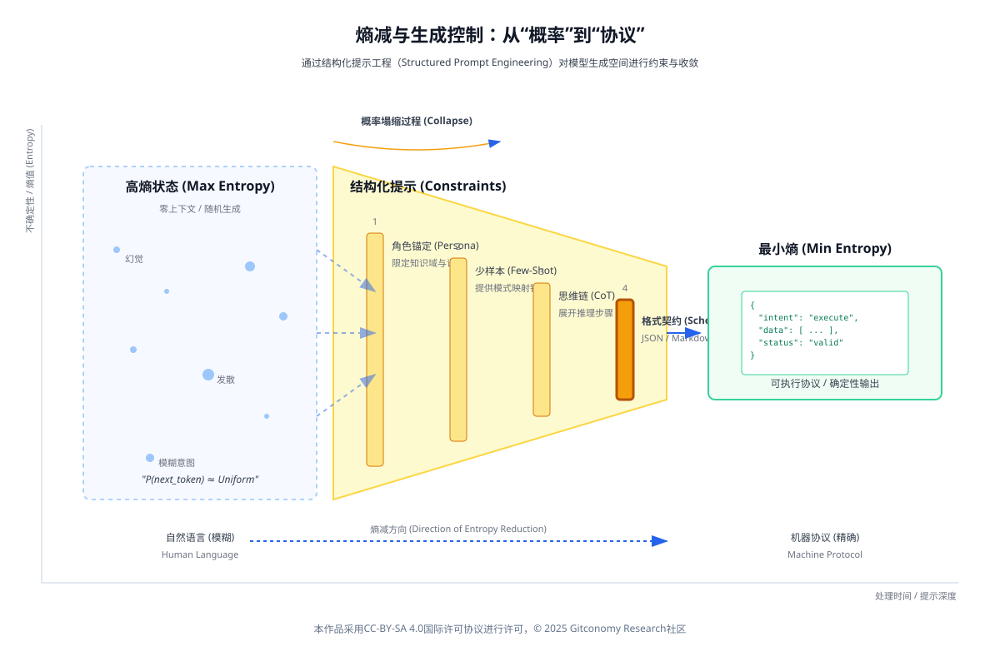
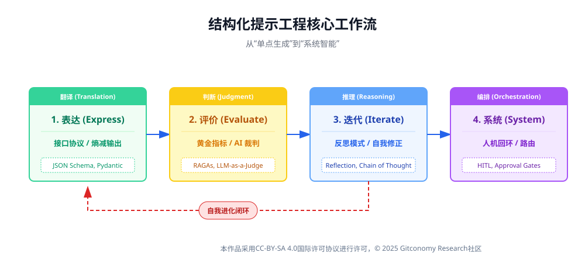
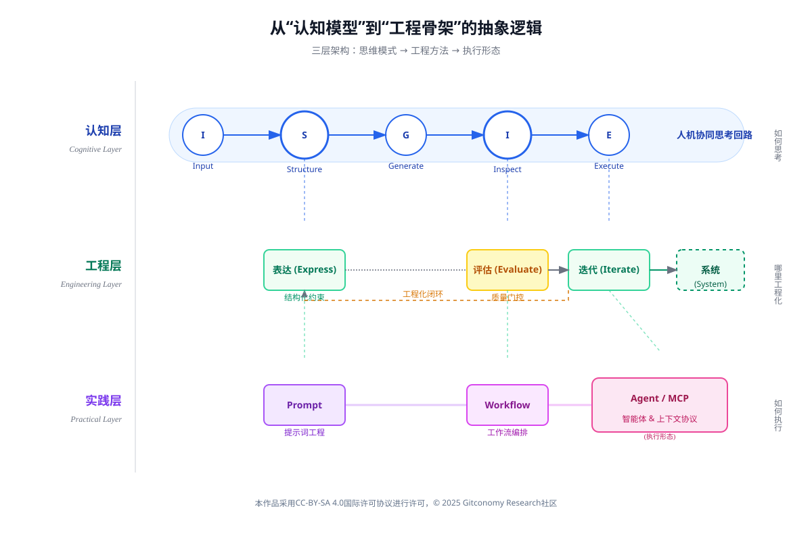
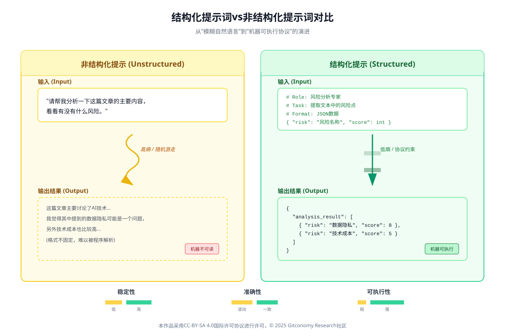
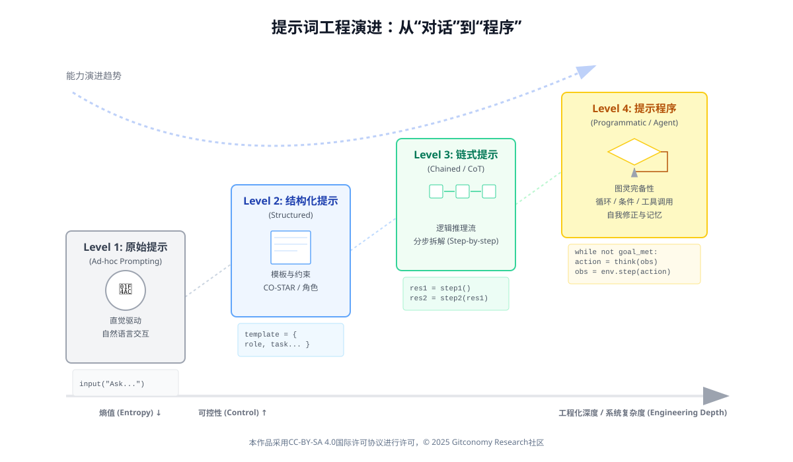
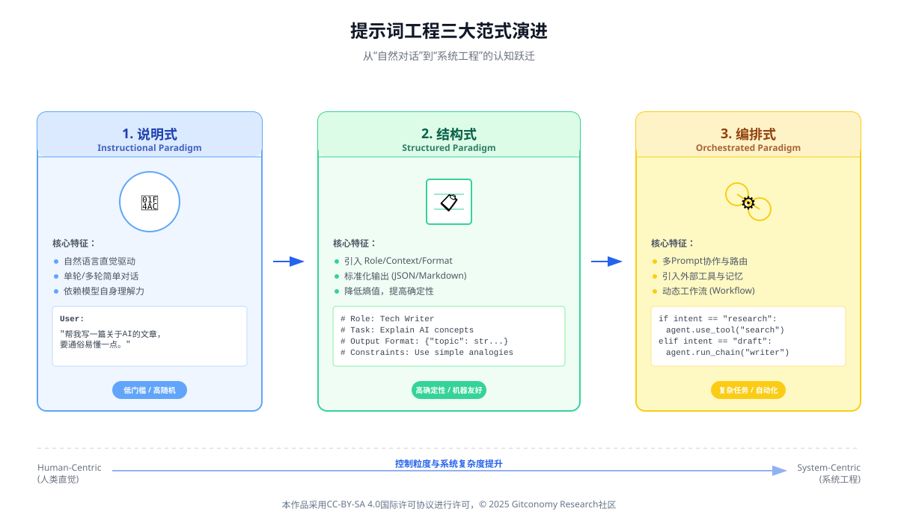
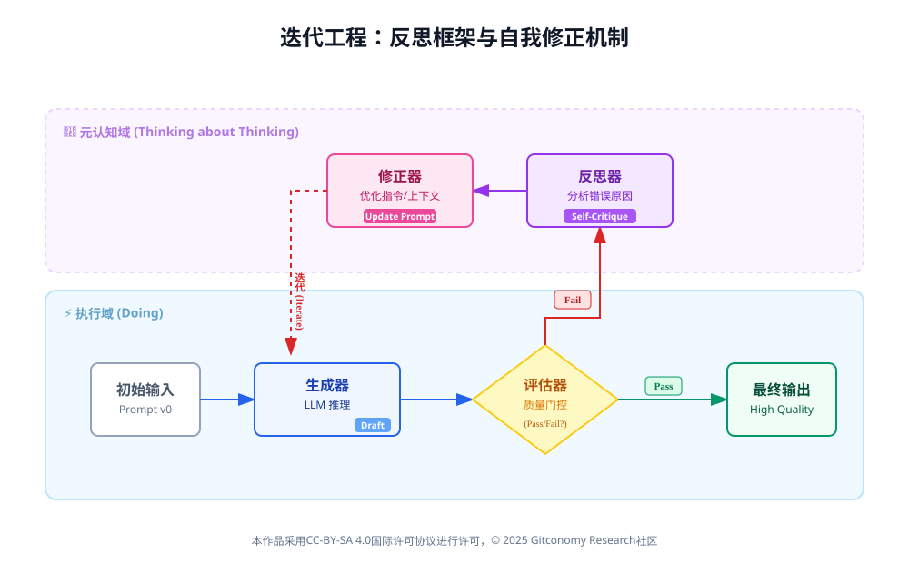
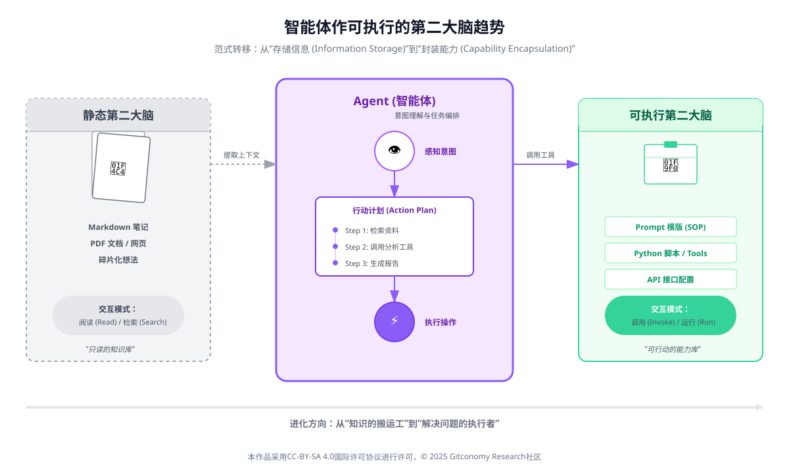

# 第三章 结构化提示工程——为知识工作流构建“可执行语言”

## 3.0 引言：当提示词成为一种“工作流语言”

>⭐ 本章将逐步引入提示词、评估、迭代等多个概念，帮助你理解如何利用结构化提示工程设计可执行的知识工作流，同时掌握将复杂任务转化为机器可执行协议的技能。

### 3.0.1 从“概率”到“协议”：智能的传动装置

在课程的前两章中，我们完成了认知的“重构”。第一章确立了“人机共生”的生成式思维，明确了人不再是单纯的创作者，而是系统的编排者；第二章解构了大型语言模型（LLM）的“概率引擎”本质，让我们理解了它是如何基于统计规律生成下一个 Token 的。

如果说第一章是**“心法”（Mindset），第二章是“引擎”Engine），那么第三章就是连接两者的“变速箱”（Transmission）。没有精密的传动装置，引擎的澎湃动力只能空转，无法转化为精确的做功。本章的主题“结构化提示工程”，正是要解决如何将人类模糊的“意图”转化为机器可执行的“协议”这一核心工程问题。

本章旨在超越“提示词即问答”的表面理解，建立一个严谨的理论框架，将“提示词”（Prompt）重新定义为一种在概率分布之上运作的“机器协议”（Machine Protocol）。在这一视角下，结构化提示工程（Structured Prompt Engineering）的核心目标被形式化为：通过精确的语义约束与逻辑引导，在模型巨大的潜在状态空间中实施“熵减”（Entropy Reduction），从而将高度不确定的随机生成过程坍缩为确定性的、可执行的知识计算工作流。
### 3.0.2 本章学习目标

🔑 完成本章学习后，学习者应当在以下几个方面形成明确、可检验的学习成果：

| 维度  | 学习目标表述                              |
| --- | ----------------------------------- |
| 思维层 | 从“结构化提示”转向“为知识工作流构建可执行语言”           |
| 认知层 | 理解结构化提示如何通过精确约束和逻辑引导，降低模型生成的不确定性    |
| 方法层 | 掌握如何设计基于**表达 → 评估 → 迭代 → 系统**的工作流结构 |
| 实践层 | 能够构建并优化一条完整的**最小可行知识工作流（MVW）**      |
| 表达层 | 能清晰定义工作流中的每个环节，确保输入与输出的可执行性         |

在整个课程体系中，第三章承担的是“生成流程优化”的角色。

---
##  3.1 提示词作为机器协议与熵减机制

### 3.1.1 概率空间中的熵值调控

要理解提示工程（Prompt Engineering）的深层机理，必须回到克劳德·香农（Claude Shannon）所奠定的<!-- end list -->信息论基础。香农指出，在缺乏任何先验约束的情况下，一个随机变量的概率分布将趋向于**最大熵（maximum entropy）状态**，此时系统的不确定性达到极值（Shannon, 1948[1]；Cover & Thomas, 2006[2]）。

对于基于Transformer架构的大规模语言模型而言，其本质是一个在高维参数空间中运行的条件概率预测系统，即对给定上下文条件下下一个token的概率分布进行建模。在零上下文（zero-context）或极弱上下文初始状态下，模型对候选 token 的预测缺乏有效约束，其输出分布呈现出近似均匀、熵值接近上界的形态，可被视为一种工程意义上的“最大熵状态”。

从这一视角看，提示（prompt）并非简单的自然语言指令，而是一种向模型施加的**信息约束条件**。随着上下文长度的增加与结构化程度的提高，模型可利用的条件信息不断累积，预测空间被持续压缩，概率分布由高熵向低熵方向演化。这一过程在统计物理意义上等价于在最大熵原理框架下逐步引入约束条件（Jaynes, 1957）[3]，在机器学习实践中则表现为条件语言模型对不确定性的持续削减(Jurafsky & Martin, 2025）[4]。

因此，提示工程的核心目标并非“命令模型做什么”，而是通过结构化输入，系统性地降低模型的条件熵，从而引导概率质量向期望语义轨道塌缩。这一过程本质上是一种人类—模型协作的认知调控机制，而非传统意义上的指令执行。



*图：从“概率”到“协议”的熵减与生成控制*

这一机制可被类比为热力学中的麦克斯韦妖（Maxwell’s Demon）：提示工程师通过向系统输入结构化信息（即做功），在原本处于高熵状态的概率生成空间中建立秩序。对于语言模型而言，在缺乏明确上下文约束时，其输出分布接近最大熵状态，表现为高度不确定的随机游走；而随着提示中约束条件的逐步增加，可行语义空间被显著压缩，条件熵迅速下降。在这一意义上，模型幻觉（hallucination）并非异常行为，而是高熵条件下概率生成机制的自然结果（Ji et al., 2023）[5]。

例如，当用户仅仅输入“写代码”时，熵值依然很高，模型可能会生成任何语言、任何功能的代码；但当指令细化为“使用 Python 3.10 的 Type Hint 特性，编写一个基于递归算法的斐波那契数列计算函数，并包含Google风格的文档字符串”时，熵值迅速收敛。此时，输出结果被限定在一个极小的、确定性极高的语义范畴内，模型“幻觉”——即高熵状态下的随机游走——的可能性被降至最低。

因此，提示工程不仅是自然语言的艺术，更是“控制概率分布的精密工程学”。为衡量自然语言生成的语义不确定性，Kuhn等提出了 Semantic Entropy 度量，该方法根据语义等价性对多输出进行聚类，并在意义层面计算概率分布的熵，表现出比传统 token 级熵更可靠的不确定性估计效果[6]。

### 3.1.2 提示词作为“软协议”的演进

在传统的计算机科学中，协议（Protocol）通常是刚性的、二进制的。HTTP 协议、TCP/IP 协议规定了比特流必须以何种严格的格式排列才能被机器解析，任何一个比特的错误都可能导致通信失败。然而(Jurafsky & Martin, 2025）[4]，在生成式 AI 时代，提示词催生了一种新型的“软协议”（Soft Protocol）.它不再依赖形式化语法的完全精确性，而是通过语义约束与上下文对齐实现可执行性（Brown et al., 2020)[7]。

这种软协议具有革命性的双重特征：

1.  **自然语言的模糊弹性：** 它允许人类使用非形式化的语言表达意图，极大地降低了编程的认知门槛，使得非技术人员也能通过自然语言定义复杂的计算任务。
2.  **机器指令的可执行性：** 经过精心设计的结构化提示词，可以像代码一样被模型“编译”和“执行”，产生结构化的输出（如 JSON 对象、SQL 查询语句或自动化脚本）。

<br>
这种软协议同时具备自然语言的表达弹性与机器可执行性，使用户能够以意图为中心描述目标状态，而非显式指定操作步骤。这一转变标志着编程范式由命令式向意图式与声明式方向演进，其思想可追溯至基于示例与约束的编程研究（Lieberman, 2001）[8]。

通过引入模板、定界符、类型约束与逻辑结构，结构化提示工程在自然语言与机器执行之间建立起稳定映射，使提示逐步“硬化”为具备确定性与可复用性的文本程序，从而重塑了软件的表达形态（White et al., 2023）[9]。

“可执行语言”的诞生，标志着编程范式从“命令式”（Imperative）——告诉机器具体的每一步操作，向“意图式”（Intent-based）——告诉机器期望的最终状态，并提供必要的上下文约束——的根本性转变。结构化提示工程正是为了弥合自然语言的模糊性与机器执行的精确性之间的鸿沟而生。它通过引入模板（Templates）、定界符（Delimiters）、类型定义（Type Definitions）和逻辑控制流（Control Flow），将自然语言“硬化”为一种伪代码，使其具备了类似于编程语言的确定性、可复用性和版本控制能力。这不仅改变了人机交互的方式，更重新定义了“软件”的形态——未来的软件可能不再是编译后的二进制文件，而是由一系列精妙的提示词组成的“文本程序”。

### 3.1.3 上下文压缩与信息论视角

在香农的理论中，信息即是对不确定性的消除。现代大语言模型通过学习海量文本数据，捕捉了人类语言的高度冗余性（Redundancy）[10]。提示工程的一个关键功能是利用这种冗余性进行高效的“上下文压缩”。

当我们在提示词中提供少样本（Few-Shot）示例时，我们实际上是在构建一个临时的、高权重的概率模型。这些示例充当了思维空间中的“锚点”（Anchors），将模型的推理路径锚定在特定的模式上(Xie et al., 2022）[11]。例如，通过提供三个“输入-输出”对，模型能够迅速推断出隐含的变换规则，而无需显式地编程定义这些规则。这种机制利用了模型内部的元学习（Meta-Learning）能力，即在推理阶段（Inference Time）通过上下文进行快速学习的能力(Jurafsky & Martin, 2025）[4]。

此外，结构化提示工程还通过显式约束（Explicit Constraints）机制来实现熵减。通过使用“必须包含...”、“禁止使用...”、“输出格式严格遵循JSON Schema”等指令，提示词直接剪除了概率树上的无效分枝。这类似于在搜索算法中加入剪枝（Pruning）策略，确保计算资源集中在最有可能产生正确结果的路径上（Russell & Norvig, 2021)[12]。从这个角度看，提示工程师不仅仅是操作员，更是“熵的管理者”，他们在开放的、混沌的语义宇宙中构建低熵的“认知隧道”，引导信息流向预期的终点。

### 3.1.4 小结：从意图到协议的语义转译

结构化提示词的核心价值在于将人类含混的“自然语言意图”转译为机器可理解的“逻辑协议”。通过引入Markdown等层级结构，我们不仅提升了信息的传输带宽，更重要的是在模型复杂的概率空间中划定了明确的边界，实现了从“概率采样”向“确定性做功”的转变。

---

## 3.2 认知范式：基于控制论的四层架构

为了构建稳定、可靠且具有自适应能力的知识工作流，我们需要超越简单的“输入-输出”线性模型，引入更高级的系统论视角。诺伯特·维纳（Norbert Wiener）的控制论（Cybernetics）为理解复杂系统的调节与控制提供了理论基石。控制论的核心洞见在于：智能行为并非静态的模式匹配，而是基于反馈回路（Feedback Loop）的动态调节过程[13]。



*图：结构化提示工程核心工作流示意图*

将控制论原理应用于提示工程，本章将深入 I-S-G-I-E 模型的“控制骨架”：**迭代（Iterate）与表达（Express）**，并引入一个新的关键层级——**评价（Evaluate）**。我们将构建一个包含机器自动评价、自我修正和人机协同的完整闭环。这四个层次构成了从单次交互到智能体系统的完整认知进化阶梯。

| 模块      | 核心概念       | 关键技术 / 工具                              | 对应认知层级                           |
| ------- | ---------- | -------------------------------------- | -------------------------------- |
| **表达层** | 接口协议、熵减输出  | JSON Schema, Markdown, Pydantic        | **翻译（Translation）**：将模糊思维转化为精确指令 |
| **评价层** | 黄金指标、AI 裁判 | RAGAs, BLEU / ROUGE, LLM-as-a-Judge    | **判断（Judgment）**：建立质量标准与反馈信号     |
| **迭代层** | 反思模式、思维链   | Reflection Pattern, Self-Correction    | **推理（Reasoning）**：利用元认知进行自我优化    |
| **系统层** | 人机回环、编排    | HITL Patterns, Routing, Approval Gates | **编排（Orchestration）**：管理硅基与碳基的协作 |

*表：结构化提示工程的多层认知模型与技术映射表*



*图：从“认知模型”到“工程骨架”的抽象逻辑示意图*

- **I-S-G-I-E**：解释“人和模型是如何一起思考与生成的”
- **表达-评估-迭代-系统**：告诉你“哪些地方必须工程化”
- **Agent / MCP**：是在这个骨架上跑起来的“执行形态”

### 3.2.1 第一层：表达（Expression）—— 基于控制论的信号编码

#### 3.2.1.1 表达的本质：降低输出熵

在 I-S-G-I-E 模型中，“表达”（Express）往往被误解为仅仅是关于文风或修辞的修饰。在智能编排的语境下，表达的本质是**机器可读性** 。当我们谈论工作流时，我们不再是孤立地与 AI 对话，而是试图将 AI 嵌入到一个由数据库、API、前端界面和其他 AI Agent 组成的复杂系统中。

自然语言（Natural Language）是高熵的、非结构化的。这种不确定性（Entropy）对于下游的自动化程序是灾难性的 。程序无法轻易地从一段随意的文本中提取出“风险等级”或“关键日期”。

因此，所有的智能知识工作流，必须以结构化数据作为其“血液”进行流动。我们必须通过强制性的约束，将模型高维度的语义理解“坍缩”为低维度的、确定性的数据结构 。



*图：结构化提示词 vs 非结构提示词化提示对比*

#### 3.2.1.2 结构化输出的两大范式：Markdown与JSON

##### 3.2.1.2.1 Markdown：人机共读的中间态

Markdown是一种轻量级标记语言，它在保留人类可读性的同时，引入了层级结构（Header）、列表（List）和表格（Table）。它是知识工作流中最通用的“草稿”格式 。

- **层级结构的认知映射：** 强制模型使用 `# H1`、`## H2` 等标题层级，实际上是强制模型构建逻辑树 。
- **表格的对比约束：** 表格是 Markdown 中最强大的工具之一。当要求模型“以表格形式对比 A 和 B”时，模型必须在行与列的矩阵中填充信息。这种空间上的约束迫使模型精炼语言，并明确地寻找对比点 。
##### 3.2.1.2 JSON：系统集成的通用语

JSON（JavaScript Object Notation）是现代互联网数据交换的标准。对于 Agentic Workflow（代理工作流），JSON 是绝对的刚需 。

- **JSON Mode：** 强制输出合法的 JSON 语法，但只能保证“语法正确”，不能保证“语义结构正确” 。
- **Structured Outputs（结构化输出）：** 最新的技术进展允许我们在 API 调用时直接传入一个严格的 **JSON Schema**。模型被底层的 Logit Bias（逻辑偏差）强制约束，只能生成符合 Schema 定义的 Token。这使得生成的可靠性接近 100% 。
#### 3.2.1.3 定义Schema：与AI签订的契约

Schema 是编排者与 AI Agent 之间签订的“数据契约” 。

**Schema 设计原则：**

- **原子性（Atomicity）：** 将复杂信息拆解为最小单元（例如将 `summary` 拆解为 `executive_summary`, `key_points`, `action_items`）。
- **类型约束（Type Constraints）：** 明确指定字段类型（string, integer, boolean, array）。
- **案例：** 情感分析不要输出“我觉得很积极”，而是定义 Enum：`["Positive", "Neutral", "Negative"]` 。
- **自描述性（Self-Description）：** 字段名应当具有语义清晰度（如 `risk_score` 优于 `score`）。

<br>

| 维度       | 非结构化提示（Unstructured Prompt）                           | 结构化 Schema（Structured Output）                                                               |
| -------- | ----------------------------------------------------- | ------------------------------------------------------------------------------------------- |
| **指令示例** | “请阅读新闻并提取关键信息，告诉我它讲了什么，涉及哪些公司。”                       | 定义 Schema：`{ "topic": string, "companies": [string], "sentiment": enum }`                   |
| **输出示例** | “这篇文章主要讲了 Apple 发布新手机，股市反应积极。涉及的公司有 Apple 和 Foxconn。” | `{ "topic": "Product Launch", "companies": ["Apple", "Foxconn"], "sentiment": "Positive" }` |
| **下游处理** | 需要复杂的 NLP 解析，容易出错。                                    | 直接读取 `companies` 数组，可直接存入数据库。                                                               |
| **错误类型** | 遗漏信息、格式混乱、冗余表达多。                                      | 类型错误（极少发生）、Schema 不匹配。                                                                      |
| **迭代潜力** | 难以针对特定信息点进行精准反馈。                                      | 可针对具体字段（如 `sentiment`）进行定点修正与迭代。                                                            |

*表 ：非结构化提示与结构化 Schema 的对比*

##### 3.2.1.4 提示工程中的“格式守门人”策略

即使有了 API 级别的支持，良好的提示工程依然是必要的“双重保险”。我们需要在 Prompt 中扮演“格式守门人”的角色。

- **零样本（Zero-Shot）格式化：** 直接提供 JSON 骨架 。
- **少样本（Few-Shot）格式化：** 提供具体的输入输出对，这对于复杂的嵌套结构尤为重要 。
- **思维链（CoT）与格式的分离：** 要求模型在 JSON 内部的一个特定字段（如 `_reasoning`）中进行思考，或者在输出 JSON 之前先输出一段文本，然后通过代码截取 JSON 部分 。

### 3.2.2 第二层：评价（Evaluation）—— 偏差的度量与反馈机制

#### 3.2.2.1 评价指标的三维体系

控制论告诉我们，开环系统（Open-loop System）本质上是脆弱的，因为它们无法感知自身的误差。为了构建健壮的闭环系统，必须引入评价机制。在提示工程中，这意味着我们需要建立一套客观的标准来衡量模型输出的质量，从而产生“误差信号”（Error Signal）。

| 评估维度                                              | 指标类型    | 核心说明                                                                          | 典型方法 / 工具                              |
| ------------------------------------------------- | ------- | ----------------------------------------------------------------------------- | -------------------------------------- |
| **维度一：确定性指标**<br>（Deterministic Metrics）          | 工程规范一致性 | 检查输出是否符合基本工程约束，如 JSON 格式是否合法、长度是否达标、是否包含敏感词等；此类指标可通过代码直接计算。                   | JSON Schema 校验、正则规则、长度统计、敏感词过滤         |
| **维度二：语义一致性指标**<br>（Semantic Consistency Metrics） | 向量相似度   | 使用 Embedding 模型将生成文本与参考文本映射到向量空间，通过余弦相似度衡量语义接近程度，相比 ROUGE / BLEU 更能反映真实语义一致性。 | Embedding Similarity、Cosine Similarity |
| **维度三：认知质量指标**<br>（Cognitive Quality Metrics）     | 高阶语义判断  | 评估内容的逻辑性、真实性与实际有用性，通常依赖 **LLM-as-a-Judge** 进行综合判断。                            | LLM-as-a-Judge、Rubric-based Evaluation |
|                                                   | 细分质量维度  | 包括 **真实性**（无幻觉）、**相关性**（回答切题）、**一致性**（逻辑通顺）、**有用性**（解决实际问题）。                  | 多维评分量表、裁判提示词                           |

*表：生成式内容质量评估的多维指标体系*

#### 3.2.2.2 LLM-as-a-Judge：以智能评价智能

我们设计一个专门的Prompt，让一个强模型（如 GPT-4）去评价另一个模型（Worker Model）的输出 。

**裁判 Prompt 的核心要素：**

- **角色定义（Persona）：** “你是一个公正、严苛的评估专家。”
- **输入数据（Input Data）：** 同时提供 `{用户问题}`、`{参考资料}` 和 `{AI 生成的回答}` 。
- **评分标准（Rubric）：** 明确定义每个分数的含义（如 1分、3分、5分的具体标准）。
- **思维链（CoT）：** 要求裁判先输出“评估理由（Reasoning）”，再输出“分数（Score）” 。

<br>
**裁判输出示例（JSON）：**

```json
{  
  "reasoning": "生成的内容准确概括了文章的主旨，提到了 Apple 和 AI 的结合。但是，它错误地引用了发布日期，原文是 '下周'，生成内容写成了 '明天'。这属于轻微的事实性错误。",  
  "faithfulness_score": 3,  
  "relevance_score": 5,  
  "pass": false  
}
```

这个JSON输出不仅告诉我们生成失败了（pass: false），还通过 reasoning 字段提供了具体的错误原因，这正是下一阶段“迭代”所需要的燃料。

| 方法 | 适用场景 | 优点 | 缺点 |
|---|---|---|---|
| **代码规则（Regex / Code）** | 格式检查、长度限制 | 速度快、成本低、绝对客观 | 无法理解语义，只能处理表层规则 |
| **向量相似度（Embedding）** | 语义搜索、大致相关性判断 | 能捕捉语义重叠，比关键词匹配更强 | 对逻辑谬误不敏感，结果可解释性较弱 |
| **LLM-as-a-Judge** | 真实性、逻辑性、风格评价 | 接近人类水平的理解能力，可解释性强 | 成本较高、响应较慢，且可能存在模型偏见 |
| **人工评估（Human Evaluation）** | 最终验收、高风险决策 | 黄金标准（Gold Standard） | 不可扩展、成本高，且评价一致性较差 |

*表 3.2：不同评价方法的对比*

评价层是系统具备“自我意识”的起点。通过评价，系统得以“看见”自己的表现，从而产生用于修正的负反馈信号，这是实现智能控制的前提。

### 3.2.3 第三层：迭代（Iteration）—— 误差修正与动态优化

#### 3.2.3.1 概率与迭代的数学逻辑

为什么我们需要迭代？从概率论的角度来看，如果一个任务的单次成功率是 $P$（例如 80%），那么失败率是 $20\%$。但是，如果我们允许系统尝试 $N$ 次，并且每次都能识别错误并修正，那么系统的整体失败率将按照 $(1-P)^N$ 衰减（Ross, 2014）[14]。

- 单次尝试：成功率 80%。
- 三次迭代：理论失败率仅为 $0.2 \times 0.2 \times 0.2 = 0.008$，即成功率提升至 99.2%。  

<br>
这种通过**重复试验与误差修正显著提升系统可靠性**的思想，是统计决策论与可靠性工程中的经典结论（Cover & Thomas, 2006）[2]。在生成式 AI 系统中，这一机制被工程化为“迭代引擎（Iterative Engine）”：通过牺牲一定的计算资源（多次推理），换取高确定性与高稳健性的输出。

#### 3.2.3.2 核心模式：反思（The Reflection Pattern）

反思模式（Reflection Pattern）是 Agentic AI 设计模式中最基础也最有效的一种。它的核心思想来源于人类的写作过程：没有人能一次写出完美的第一稿。我们都是先写草稿，然后阅读、批判、修改，最后定稿。

反思模式将这个过程拆解为两个通过 Prompt 实现的步骤：

1. **生成器（Generator）：** 负责起草内容。它的目标是“发散”，尽可能覆盖信息。
2. **反思者（Reflector/Critic）：** 负责审视内容。它的目标是“收敛”，寻找错误。

<br>
为什么需要分离角色？

认知心理学告诉我们，“创造”和“批判”是两种冲突的思维模式。让模型同时做这两件事会增加认知负荷，导致效果下降。通过分离 Prompt，我们让模型在生成时专注于内容，在反思时专注于质量 。在大语言模型研究中，自我修正已被证明能够显著提升输出质量与一致性（Madaan et al., 2023)[15]。

**反思 Prompt 的设计技巧：**

- 不要只问“这好吗？”。
- 要问：“假设这段代码有安全漏洞，它可能在哪里？”或者“作为反方辩手，请攻击上述论点。”
- 使用思维链（CoT）：让反思者一步步列出检查清单（Checklist。

#### 3.2.3.3  自我修正（Self-Correction）循环

当评价层发现错误（例如 JSON 格式错误或逻辑漏洞）时，将错误信息作为新的 Prompt 输入反馈给模型，要求其“修复这个错误”。这种机制构成了最基本的短期反馈循环（Short-term Feedback Loop），类似于 PID 控制器中的比例（Proportional）调节。

```markdown
	**工作流逻辑：**

	1. **Draft:** 生成器输出 Draft_v1 。
	2. **Evaluate:** 裁判对 Draft_v1 进行打分并给出 Feedback 。
	3. **Condition:** 检查分数。如果 > 阈值则输出；否则进入修正 。
	4. **Refine:** 将 Draft_v1 + Feedback 输入给生成器进行重写 。
	5. **Loop:** 生成 Draft_v2，回到第 2 步（设置最大重试次数） 。

```

迭代层使系统具备了纳西姆·塔勒布所描述的“反脆弱性”（Antifragility）。错误不再是失败的终点，而是系统进化的养料（Taleb, 2012）[16]。通过不断的 Reflexion（反思）循环，模型的表现可以随时间推移而自我增强。

### 3.2.4 第四层：系统（System）—— 多组件协同与涌现

#### 3.2.4.1 锯齿状技术前沿与人类的角色

在第一章中，我们提到了“锯齿状技术前沿”（Jagged Technological Frontier）。AI 的能力不是均匀分布的。它可能在复杂的创意写作上表现出色，却在简单的算术或事实核查上犯错。这个前沿是不可见的、动态变化的。

因此，完全自动化的闭环系统（在处理高风险任务时是危险的。我们不能将核电站的控制权或法律合同的最终签署权完全交给一个概率模型。

我们需要**人机回环（Human-in-the-Loop, HITL）**。在这个系统中，人类的角色从“操作员”转变为“监控者”和“最终决策者”——类似于现代飞机的飞行员，大部分时间由自动驾驶仪（Agent）操作，但人类随时准备接管。

系统架构的关键特征：

* **模块化与解耦（Modularity & Decoupling）：** 将复杂任务分解为子任务（如规划、搜索、生成、校验），每个子任务由专门优化的提示词模块处理。这种分治策略（Divide and Conquer）降低了单点故障的风险，提高了系统的可维护性。
* **动态路由（Dynamic Routing）：** 系统根据用户输入的意图或当前的上下文状态，动态选择调用哪个提示词模块。例如，遇到数学问题调用代码解释器，遇到创作问题调用创意写作模块，遇到事实性问题调用搜索引擎。这种机制实现了“按需分配算力”。
* **状态管理与记忆（State Management & Memory）：** 维护对话历史、全局变量或长期记忆（Long-term Memory），确保系统在多轮交互中保持上下文的连续性。这使得 Agent 能够超越单次对话的限制，展现出长期规划和连贯的人格特征。

<br>
在系统层，提示工程演化为“认知架构设计”（Cognitive Architecture Design）。我们不再是编写单一的指令，而是在设计一个由多个智能节点构成的网络。这些节点通过自然语言接口进行交互，共同涌现出（Emerge）单一模型所不具备的高级智能行为，如长期规划、自主探索和复杂决策。这也呼应了控制论中“必要多样性定律”（Law of Requisite Variety）：只有具备足够内部多样性（复杂性）的控制系统，才能应对环境的复杂性。

#### 3.2.4.2 人机回环的三种介入模式

根据人类介入的时机，我们将HITL 分为三种模式：

| 模式            | 核心机制                         | 适用场景                     | 交互设计 / 运行逻辑                                                                                                       | 主要优势                              |
| ------------- | ---------------------------- | ------------------------ | ----------------------------------------------------------------------------------------------------------------- | --------------------------------- |
| **阻断式审批**<br> | 工作流在关键节点自动暂停，必须获得人类确认后才能继续执行 | 对外发送邮件、涉及资金的操作、代码部署到生产环境 | 系统展示 AI 生成的草稿（如客户道歉信），并提供“批准 / 拒绝 / 修改”按钮；仅在人类点击“批准”后，API 才执行后续操作                                                 | 最大程度降低高风险操作失误，责任边界清晰              |
| **异常路由**<br>  | 根据评价层的置信度分数动态决定是否介入人类        | 大规模自动化任务、存在不确定性的业务流程     | 若 `Judge_Score ≥ 4.8`：自动执行并事后通知；<br>`4.0 ≤ Judge_Score < 4.8`：标记为“需审核”，进入人类任务队列；<br>`Judge_Score < 4.0`：触发重试或直接报错 | 遵循帕累托原则（80/20），AI 处理常规任务，人类专注边缘情况 |
| **导向性反馈**<br> | 人类作为协作者，在生成过程中持续提供方向性反馈      | 创意设计、复杂规划、多方案决策          | AI 生成多个方案 → 人类选择方案并给出反馈（如“更有创意一点”）→ AI 基于选择与评论继续迭代                                                                | 将人类嵌入迭代循环，提升结果质量与创造性              |

*表：人机协作工作流中的关键控制模式与交互机制*

#### 3.2.4.3 编排者的责任：系统架构设计

作为第三章的学习者，你们现在的身份是**系统架构师**。你们的任务不再是写一个 Prompt，而是设计整个流程图（Flowchart）：

- 哪里需要结构化输出？（Express）
- 用什么标准评价？（Evaluate）
- 何时触发重试？（Iterate）
- 何时呼叫人类？（System/HITL）

<br>

| 特征       | 完全自动化（Autonomous） | 人机回环（HITL）            |
| -------- | ----------------- | --------------------- |
| **速度**   | 极快（毫秒级）           | 较慢（取决于人类响应时间）         |
| **成本**   | 低（主要为 Token 成本）   | 高（人力成本）               |
| **一致性**  | 高（但可能一致地犯错）       | 较低（受人类疲劳、情绪等因素影响）     |
| **责任归属** | 模糊                | 明确（人类最终确认与负责）         |
| **适用场景** | 低风险、高通量任务（如日志分析）  | 高风险、低容错任务（如医疗诊断、法律建议） |

*表 ：自动化与 HITL 的权衡*

### 3.2.5 小结：提示词框架的模块化构建

当表达、评价、迭代、系统这四个词同时出现，Prompt的角色就发生了变化：它不再是“写得更像人”，而是“写得更像协议”。评价提供误差信号，迭代负责把误差吃掉，系统则决定什么时候让人介入、什么时候让机器自动收敛——可靠性不是祈祷来的，是被设计出来的。接下来需要把这个闭环落到“可维护”的形态上：否则流程一复杂，Prompt就会变成不可阅读、不可回滚的黑箱。

---

## 3.3 工程结构：从单提示到提示程序的演进

随着大语言模型应用场景的日益复杂化，传统的“手搓提示词”（Hand-crafting Prompts）作坊式生产模式已经无法满足工业级应用的需求。提示工程正在经历一场深刻的范式转移：从编写非结构化的“自然语言文本”向构建结构化、可复用、可优化的“提示程序”（Prompt Programs）演进。这种演进不仅是工具层面的升级，更是思维方式的根本转变——将提示词视为软件工程中的“源代码”，适用版本控制、单元测试和自动化编译等工程原则。



*图：提示词工程演进：从“对话”到“程序” *

### 3.3.1 阶段一：单一提示词（The Monolithic Prompt）—— 作坊式生产的起点

在提示工程的早期阶段，用户主要通过一个统一的长文本框与模型进行交互。这种单一提示词通常包含所有必要的信息：角色设定、背景描述、任务指令、少样本示例（Few-Shot Examples）以及输出格式要求。

* **特征：** 结构简单，易于上手，所见即所得。它依赖于人类的直觉和语言组织能力。
* **局限性：**
    * **上下文窗口限制与注意力稀释：** 随着任务复杂度的增加，单一提示词变得越来越长，容易导致模型忽略中间的指令（Lost in the Middle 现象），难以处理超长文档或多步骤推理任务。
    * **调试困难（Debuggability）：** 当模型输出不符合预期时，很难定位问题的根源——是背景信息太杂乱？是指令不清晰？还是示例具有误导性？修改一处往往牵一发而动全身，导致性能的不可预测波动。
    * **复用性与扩展性差：** 针对特定任务微调的“超级提示词”往往过度拟合（Overfit）于特定场景，很难直接迁移到其他类似任务中，导致重复劳动。    

<br>
这一阶段的提示工程类似于编写简单的 Shell 脚本，虽然能解决单点的、临时性的问题，但缺乏工程上的鲁棒性，无法支撑大规模、高质量的生产环境。

### 3.3.2 阶段二：提示链（Prompt Chaining）—— 流水线式的分工协作

为了解决单一提示词的局限，工程师们开始引入工业流水线的思想，将一个复杂的任务拆解为一系列线性的步骤序列。每一个步骤都有独立的、专注于单一功能的提示词，上一步的输出成为下一步的输入，形成了“提示链”。

**典型工作流模式：**

1.  **输入清洗与分类（Input Sanitization & Classification）：** 第一个 Prompt 负责去除用户输入中的无关信息，纠正拼写错误，并将意图分类（如“咨询”、“投诉”、“闲聊”）。
2.  **思维提取与规划（Reasoning Extraction & Planning）：** 第二个 Prompt 不直接生成最终答案，而是生成大纲、思维导图或推理步骤。这强制模型进行深层思考，而不是浅层的模式匹配。
3.  **内容生成（Content Generation）：** 第三个 Prompt 基于上一步生成的大纲，填充详细内容。
4.  **格式化与校验（Formatting & Validation）：** 最后一个 Prompt 将生成的内容转换为严格的 JSON 格式，并检查是否存在违规内容。

<br>

**工程优势：**

* **降低认知负荷：** 每个环节只需专注于一个小任务，显著降低了模型的认知负荷，提高了每个步骤的准确率。
* **可观测性（Observability）：** 中间步骤的输出是可见的，便于开发者检查每一步的执行情况，快速定位错误发生的环节。
* **模块复用：** 通用的清洗模块或格式化模块可以在不同的链条中复用，提高了开发效率。

<br>
提示链的出现标志着提示工程进入了“结构化组装”时代，大大提高了复杂任务的成功率和系统的可维护性。

### 3.3.3 阶段三：提示程序与模块化编程（Prompt Programming & Modularity）—— 软件工程的全面引入

当前最前沿的工程结构是将提示词彻底封装为可编程的“模块”或“函数”，并引入自动优化机制。斯坦福大学<!-- end list -->提出的 **DSPy**（Declarative Self-improving Python）框架是这一阶段的杰出代表，它通过将提示词抽象为“签名”（Signatures）和“模块”（Modules），实现了提示工程的声明式编程（Khattab et al., 2023）[17]。

在这一范式下，开发者不再直接编写具体的提示词字符串（String），而是定义程序的逻辑结构：
* **签名（Signature）：** 声明任务的输入和输出类型，例如 `input: question -> output: answer`。这定义了“做什么”（What），而将“怎么做”（How，即具体的 Prompt 措辞）的细节抽象化，交给框架处理。这类似于编程语言中的函数接口定义。
* **模块（Module）：** 实现特定的推理逻辑，如 `dspy.ChainOfThought` 或 `dspy.ReAct`。模块内部封装了具体的提示词模板和调用逻辑，开发者只需像调用 Python 类一样使用它们。
* **编译器与优化器（Teleprompter / Optimizer）：** 这是最革命性的步骤。系统可以使用训练数据自动测试不同的提示词变体，甚至自动生成 Few-Shot 示例，从而“编译”出针对特定模型（如 GPT-4 或 Llama-3）最优的提示词组合。例如，`BootstrapFewShot` 优化器会自动从数据集中挖掘高质量的输入输出对，并将其作为示例插入到 Prompt 中，通过算法搜索最优解，而非依赖人工试错。

<br>

**“提示即代码”（Prompt-as-Code）的核心特征：**
* **版本控制（Version Control）：** 提示词文件像代码一样被 Git 管理，支持分支、回滚和协同开发，变更历史可追溯。
* **类型安全（Type Safety）：** 引入 Pydantic 等库对 LLM 的输出进行严格的类型检查和验证，确保下游程序不会因格式错误（如缺少字段、类型不匹配）而崩溃。
* **自动回归测试（Automated Regression Testing）：** 构建评估数据集（Evaluation Dataset），每次修改提示逻辑后自动运行测试，计算准确率、召回率等指标。如果新版本的 Prompt 导致性能下降，系统会自动报警，防止劣化。

<br>

从单一文本到可编译程序，这一演进路径表明提示工程正在迅速成熟，成为一门严谨的软件工程学科。它不再是依赖直觉的“玄学”，而是基于数据、度量和架构设计的“科学”。这一转变对于构建大规模、高可靠性的 AI 应用至关重要。

### 3.3.4 小结：Prompt进入“可维护”的软件工程世界

当Prompt被模块化、被版本化，它就从一次性指令变成了“可维护的组件”。你开始能够定位问题发生在哪个节点，能够复用某个模板去解决同类任务，也能够在回滚与对比中积累稳定的改进路径。写 Prompt 的方式会越来越像写代码：接口要清晰，输出要可校验，变化要可追踪。接下来要解决的是“怎么选工具箱”：不同任务的主矛盾不同，语言表达、数据契约、推理路径，不可能用同一种写法全部兼顾。

---

## 3.4 Prompt工程三大范式：说明式、结构式、编排式

在实际构建知识工作流时，我们可以根据控制粒度、抽象层级以及与模型交互方式的不同，将提示工程方法论归纳为三大范式：说明式（Instructional）、结构式（Structured）和编排式（Orchestrational）。这三种范式并非截然对立，而是在不同的应用场景中相互嵌套、组合使用，共同构成了现代提示工程的工具箱。



*图：提示词工程三大范式演进*
### 3.4.1 说明式范式（Instructional Paradigm）：自然语言的精确制导

说明式范式是最基础也是最直观的交互方式，其核心在于通过自然语言直接向模型下达指令。虽然看似简单，但要在专业领域达到高可用性，需要掌握“精确制导”的技巧，避免自然语言固有的模糊性导致的歧义。

**核心原则与技巧：**
* **CO-STAR 框架的应用：** 为了确保指令的完备性，可以使用 CO-STAR 框架来构建提示词：
    * **C (Context)：** 背景设定。例如：“你现在作为一名资深Python后端工程师，负责优化高并发 API 系统的性能。”这为模型设定了特定的知识域。
    * **O (Objective)：** 目标明确。“请重构以下代码段，目标是减少内存占用并提高执行速度。”
    * **S (Style)：** 风格限定。“遵循Google Python代码规范，保持代码简洁、Pythonic。”
    * **T (Tone)：** 语气设定。“保持客观、技术性强，避免冗余的客套话。”
    * **A (Audience)：** 受众定位。“解释应面向具有 3 年以上经验的中级开发人员。”
    * **R (Response)：** 响应格式。“以Markdown代码块形式输出，并在代码后附带关键改动点的要点说明。”

* **否定约束的陷阱与转化：** 大语言模型在处理否定指令（如“不要使用被动语态”、“不要提及 OpenAI”）时往往表现不佳，因为模型在生成时更倾向于关注出现的词汇而非逻辑上的否定。在说明式范式中，应尽量将“Don't”转化为“Do”的肯定指令。例如，将“不要写长句子”转化为“请使用短句，平均句长控制在 15 个单词以内”。

* **元提示（Meta-Prompting）：** 利用模型本身的能力来生成或优化提示词。例如：“请将我这个简略的任务描述扩展为一个详细的、结构化的 Prompt，以便让 GPT-4 更好地执行该任务。”这种方法利用了模型对自身能力的“理解”，往往能产出比人类手写更符合模型偏好的指令。

<br>
说明式范式适用于开放性强、创意性高或流程较短的任务，如文案写作、头脑风暴或简单问答。

### 3.4.2 结构式范式（Structured Paradigm）：数据化交互的桥梁

结构式范式旨在将非结构化的自然语言转化为结构化的数据对象。这是将 LLM 集成到自动化工作流（Workflow Automation）系统中的关键技术，使得 AI 能够与数据库、API 和其他软件组件进行无缝交互。

**技术实现路径：**

1.  **Schema 驱动生成（Schema-Driven Generation）：** 在提示词中直接嵌入 JSON Schema、XML DTD 或 Pydantic 模型定义。明确告知模型：“你的输出必须严格符合以下 Schema 定义，不要输出任何额外的解释性文字。”

```json
// 示例：提示词中的结构定义
"输出格式要求": {
  "type": "object",
  "properties": {
    "summary": {"type": "string", "maxLength": 100},
    "tags": {"type": "array", "items": {"type": "string"}},
    "sentiment_score": {"type": "number", "minimum": 0, "maximum": 1}
  }
}
```
---

  这种技术在信息提取、数据清洗和API参数生成场景中至关重要，它将 LLM 变成了一个智能的“文本-数据转换器”。

<br>
2.  **Markdown 的语义化利用**：利用 Markdown 的层级结构（\# 标题, - 列表, \> 引用）来组织输入和输出。LLM 对 Markdown 有着天然的理解力，能够很好地识别层级关系。例如，要求模型以 Markdown 表格形式输出对比分析，不仅易于阅读，也易于通过简单的解析器转换为 Excel 或数据库记录。

<br>
3.  **定界符（Delimiters）隔离**：使用特殊符号（如 `"""`, `###`, `---`, `<input></input>`）将指令区、上下文区和数据区物理隔离。这不仅有助于防止“提示注入”（Prompt Injection）攻击（即用户输入包含恶意指令干扰模型），还能帮助模型清晰地区分哪些是“代码”（指令），哪些是“数据”（处理对象）。

<br>
结构式范式是将 LLM 从“聊天机器人”转变为“数据处理单元”的关键，它赋予了自然语言处理以工程级的精确度。

### 3.4.3 编排式范式（Orchestrational Paradigm）：复杂思维的拓扑展开

编排式范式关注的是推理过程的结构化设计。它不再满足于直接得到结果，而是干预和设计模型的思考路径（Reasoning Path）。这通常涉及将单一的推理过程展开为图（Graph）或树（Tree）结构，以应对复杂问题。

**主流模式与拓扑结构：**

| 模式名称          | 拓扑结构        | 核心机制                                                                         | 适用场景                 |
| :------------ | :---------- | :--------------------------------------------------------------------------- | :------------------- |
| **思维链 (CoT)** | 线性 (Linear) | 通过添加“请一步步思考”或提供包含推理步骤的少样本，诱导模型生成中间推理环节。实际上是在增加推理计算的深度（Depth）。                | 数学题、逻辑推理、代码解释        |
| **思维树 (ToT)** | 树状 (Tree)   | 让模型在每一步生成多个候选分支，然后对每个分支进行评估，保留有潜力的分支继续扩展，剪除死胡同。引入了广度优先搜索（BFS）或深度优先搜索（DFS）算法。 | 创意写作、战略规划、复杂解题       |
| **思维图 (GoT)** | 网状 (Graph)  | 允许思维节点之间合并、循环或回溯。模拟了人类大脑中复杂的网状思维，支持多源信息综合和循环论证。                              | 摘要聚合、多文档分析、复杂逻辑论证    |
| **ReAct**     | 循环 (Loop)   | 将“推理”与“行动”交织。模型不仅进行内部思考，还能输出动作指令（如搜索 API），获取外部结果后再次进行推理。这是构建自主 Agent 的核心范式。  | 自主 Agent、工具使用、实时信息获取 |

*表：主流推理提示模式的拓扑结构与适用场景对照表*

编排式范式实际上是在提示工程中引入了经典计算机科学的数据结构和算法，极大地扩展了 LLM 解决复杂问题的能力边界。通过设计不同的思维拓扑，我们可以针对性地增强模型在规划、探索、纠错等方面的能力。

### 3.4.4小结：先判断主矛盾，再选择提示范式

说明式让模型“听懂你想要什么”，结构式让系统“消费得了模型产物”，编排式则决定模型“沿哪条路径思考”。真正有效的提示工程，不是框架越多越好，而是先判断任务要控制的到底是哪一种不确定性：是表达走偏？是格式不可用？还是推理过程不稳定？下一步要面对的现实是：再好的框架也会失败，关键是把失败变成可重复修复的机制——这就是迭代工程要完成的事情。

-----

## 3.5 迭代工程：反思框架与自我修正机制

在软件开发中，我们绝不会期望代码一次编写就能完美运行，调试（Debugging）和测试（Testing）是必不可少的环节。同理，在提示工程中，单纯依赖模型的一次性生成（Zero-shot Generation）往往无法达到生产级的质量要求。迭代工程（Iterative Engineering）正是将软件工程中的“反馈—修正”思想系统性引入提示工程与智能体设计中，通过构建**反思—修正闭环（reflection–correction loop）**，使系统具备从错误中持续改进的能力，而非被动地接受单次生成结果（Shinn et al., 2023）[18]。



*图：迭代工程：反思框架与自我修正机制*

### 3.5.1 反思框架：赋予 Agent“元认知”

Reflexion是一种通过语言反馈强化智能体学习的框架，由 Shinn 等人提出。其核心理念并非通过昂贵的权重更新（Gradient Descent）来学习，而是通过更新“语言记忆”（Verbal Memory）来优化决策。这是一种类似于人类“短期记忆”和“元认知”的学习方式。

**Reflexion 的三步循环机制：**

1.  **行动（Actor）**：Agent 尝试执行任务，生成初步结果或动作轨迹。例如，编写一段 Python 代码来解决特定问题。
2.  **评价（Evaluator）**：对 Actor 的输出进行评分或定性评价。这可以通过确定性算法（如运行单元测试，如果代码报错，报错信息即为评价结果）或另一个 LLM 模型（作为裁判）来实现。
3.  **自我反思（Self-Reflection）**：Agent 阅读评价结果（如错误日志或裁判评语），生成一段“反思文本”。例如：“我使用了错误的库函数 numpy.meam，导致了 ImportError。下次我应该检查拼写，使用 numpy.mean。”这段反思被存储在短期记忆中。

<br>

在下一轮尝试中，Agent 会将这段反思文本作为额外的上下文（Context）输入。这意味着 Agent“知道”自己刚才犯了什么错，从而避免重蹈覆辙。实验表明，引入 Reflexion 机制后，Agent 在编程任务（如 HumanEval 基准测试）和决策任务（如 AlfWorld）上的成功率有显著提升，有时甚至能超越模型本身的参数极限。

### 3.5.2 Critic-Refine 模式：双重角色的博弈

Critic-Refine（批评-修正）模式是 Reflexion 的一种具体实现，通常采用多角色协作的方式，模拟人类工作中的“同行评审”（Peer Review）流程。

**角色定义与交互：**

  * **Generator（生成者）**：负责根据初始指令生成初稿。它倾向于创造性和发散性思维。
  * **Critic（批评者）**：扮演挑剔的审核员角色。Prompt 示例：“你是一位严厉的代码审查员。请检查上述代码的安全性、效率和风格问题。不要重写代码，只需列出具体的缺陷和改进建议。如果没有问题，请输出‘通过’。”
  * **Refiner（修正者）**：接收初稿和批评意见，输出最终版本。Prompt 示例：“根据批评者的建议，修改上述代码。确保解决了所有指出的问题，并保持代码的简洁性。”

  <br>

**机制优势：**

研究发现Zelikman et al., 2022）[19]，让 LLM 自己批评自己（Self-Critique）往往比直接生成更好。这是因为“验证”一个解通常比“生成”一个解更容易（类似于 P vs NP 问题），且 Critic 角色可以被赋予不同的特定视角（如安全性视角、性能视角、用户体验视角），从而实现多维度的优化。这种分角色的博弈机制有效地降低了单一模型产生幻觉或逻辑漏洞的概率。

### 3.5.3 自动化提示优化

迭代工程的终极形态是让机器自动优化提示词，即“用 AI 改进 AI”。这种方法彻底摆脱了人工手动调整提示词的低效与玄学。

  * **APE (Automatic Prompt Engineer)**：该算法将提示词生成视为一个搜索问题。通过生成多个候选提示词，在小样本集上测试效果，然后根据得分反向推导更优的提示词指令。它类似于在提示词空间中进行梯度下降。
  * **DSPy 中的 Teleprompter 优化器**：在 DSPy 框架中，优化器（如 `BootstrapFewShot` 或 `MIPRO`）将迭代工程自动化。
      * **工作原理**：用户定义一个度量标准（Metric，如答案准确率），优化器会自动运行模型，收集成功的输入输出对，并将它们作为 Few-Shot 示例插入到提示词中。
      * **多轮迭代**：如果效果不理想，优化器会尝试不同的指令变体，甚至重新组合示例，通过多轮迭代找到在验证集上得分最高的提示配置。
      * **结果**：最终“编译”出的 Prompt 可能包含人类意想不到的指令或示例组合，但却能实实在在地提升模型性能。

<br>
这种自动化的迭代机制彻底改变了提示工程的工作流：人类只需定义目标（Metric）和提供数据（Dataset），剩下的提示词微调工作全部由算法自动完成。这标志着提示工程从“手工艺”迈向了“工业自动化”。

### 3.5.4 小结：把失败变成“可复用的修复路径”

最危险的不是“输出不好”，而是你不知道它为什么不好，也不知道下一轮该改哪里。反思把问题从“感觉不对”转成“可操作反馈”，评价把反馈变成可比较的尺度，修正则让系统在有限轮次内收敛到更稳的版本。这样，优化不再是调参式试错，而是一条可追踪、可复用的改进路径。下一步只差一个关键动作：把这些结构从文字里拿出来，变成可视化、可协作、可重构的工作流对象。

---

## 3.6 视觉编排：Obsidian Canvas 作为提示链 IDE

随着提示链、思维图（GoT）和智能体逻辑的日益复杂，传统的纯文本代码或 JSON 配置文件已经难以直观地表达系统的拓扑结构。视觉化编程（Visual Programming）成为了新的趋势。Obsidian Canvas作为一个基于 Markdown 的无限画布工具，正在意外地演变为一种强大的提示工程集成开发环境（IDE），为知识工作者提供了一个“所见即所得”的逻辑编排平台。

### 3.6.1 画布作为思维的拓扑映射

Obsidian Canvas 允许用户在无限的二维平面上放置卡片（节点）并用线条（边）连接它们。这种节点-边的拓扑结构与提示链、思维图以及 Agent 工作流有着天然的同构性（Isomorphism）。

**在 Canvas 中构建提示逻辑的要素：**

  * **节点（Node）**：每个卡片代表一个提示模块（Prompt Module）。卡片内容可以是 Markdown 格式的提示模板，包含变量占位符（如 `{{input}}` 或 `{{previous_result}}`）。用户可以直接在卡片中编写和修改 Prompt，利用 Markdown 的格式化能力使指令更清晰。
  * **连线（Edge）**：代表数据的流向（Data Flow）。从节点 A 指向节点 B 的箭头，意味着 A 的输出将作为 B 的输入（Context）。线上的标签可以定义条件逻辑（如“如果是技术问题”）。
  * **群组（Group）**：可以将多个相关的节点框选为一个功能模块（如“数据预处理模块”或“润色模块”），实现逻辑的封装和抽象，使复杂的图表保持整洁。

<br>
这种视觉化表达使得复杂的逻辑流一目了然。开发者可以直观地看到：哪里是并行处理（Parallelization），哪里是条件分支（Routing），哪里存在循环引用（Loop），哪里是信息的汇聚点（Aggregation）。

### 3.6.2 "低代码" Agent 开发与模拟

结合社区开发的插件（如 Advanced Canvas, Text Generator, LLM-based plugins），Obsidian Canvas 可以从静态的图表变为可执行的程序：

  * **可视化的 Prompt Chaining 执行**：用户可以在 Canvas 上画出“输入 -\> 摘要 -\> 翻译 -\> 润色”的流程图。插件可以按顺序遍历这个图，依次调用 LLM API，将上一个节点的生成结果自动填充到下一个节点的占位符中，最后在终点节点输出最终结果。这使得非程序员也能构建复杂的 AI 工作流。
  * **分支逻辑模拟**：通过颜色编码或标签，可以模拟决策树。例如，设置一个“分类器”节点，如果其输出为“技术问题”，则流向左边的“技术支持 Agent”节点；如果为“销售咨询”，则流向右边的“销售 Agent”节点。用户可以直观地设计和调整这些路由逻辑。
  * **实时调试与干预（Human-in-the-loop Debugging）**：在 Canvas 中执行流程时，用户可以随时暂停，查看任何一个节点的中间输出。如果发现某一步走偏了，用户可以手动修改该节点的输出内容，然后让流程继续执行。这种“人机协同”的调试体验对于优化复杂 Agent 至关重要，它允许人类智慧实时纠正 AI 的偏差。

### 3.6.3 知识库与提示工程的融合

Obsidian本身是一个基于双向链接的个人知识库（Second Brain）。将提示工程置于其中，意味着提示词可以直接引用（Embed）知识库中的笔记作为 Context，这在其他 IDE 中是难以实现的。

  * **RAG 的原型验证（Prototyping RAG）**：用户可以直接将一篇或多篇相关的笔记（如“产品手册”、“会议记录”）拖入 Canvas，用连线将其连接到一个“问答 Agent”节点。这实际上是在本地快速搭建了一个最小可行性（MVP）的 RAG（检索增强生成）系统。用户可以立即测试特定的知识片段在提示词中的表现，验证知识库的质量和相关性。
  * **动态上下文构建**：通过Canvas的布局，用户可以直观地组合不同的知识块，测试不同的上下文组合对模型输出的影响，从而找到最优的上下文构建策略。

<br>
Obsidian Canvas因此不仅是一个绘图工具，它成为了“可执行的第二大脑”。它模糊了“知识管理”与“软件开发”的界限，让知识工作者能够通过直观的拖拽操作，构建出复杂的认知工作流，将静态的笔记转化为动态的智能生产力。

### 3.6.4 小结：把工作流从文本变成拓扑，协作才真正开始

当工作流被画出来，复杂性就不再藏在段落里，而是显露为节点、连线与回环：哪里在分支，哪里在评估，哪里需要人工确认，一眼可见。Canvas 的价值因此不只是呈现，更是协作与维护——团队讨论的不再是“你那句 Prompt 怎么写”，而是“这个节点的输入契约是否清楚、评价是否可靠、回路是否能收敛”。到这里，结构化提示工程完成了它的使命：为后续的知识工程与智能体运行，准备了一套真正可编排的语言基础。

---

## 3.7 未来趋势：Agent行动计划与可执行的第二大脑

站在结构化提示工程的当下，眺望未来，我们看到两个明显的演进趋势：一是智能体从单一任务解决者向具备长时程、自主性行动计划（Action Plan）的“具身智能”进化；二是个人知识库从静态的信息存储向主动的、可执行的“第二大脑”质变。



*图：智能体成为第二大脑的发展趋势*

### 3.7.1 从对话到代理 (Agentic Workflow)

提示工程的终局不是人与聊天机器人的对话，而是人与自主智能体（Agents）的协作。在Obsidian的未来架构中，Vault将不仅仅是存储库，而是智能体的“长期记忆”（Long-term Memory。

通过CORE（Temporal Knowledge Graph）等新兴概念，我们可以预见，AI代理将能够读取Obsidian中的迭代日志、偏好设置和历史项目，从而具备“情境感知”能力。当你说“按照我通常的风格写周报”时，代理会自动检索你过去标记为High Score的周报提示和风格模块，无需你再次重复指令。

### 3.7.2 可执行的第二大脑

传统的第二大脑（如 Notion, Obsidian, Evernote）是静态的，它们是被动的容器，等待人类去检索和阅读。随着Agentic AI的融入，第二大脑将“活”过来，进化为**行动导向的知识管理（Action-Oriented Knowledge Management, AOKM）**系统。

**AOKM 的核心特征：**

  * **主动推送与上下文感知**：系统不仅存储知识，还能理解你的当前工作上下文。当你正在写一篇关于“控制论”的文章时，第二大脑会自动检索并推送你两年前摘录的诺伯特·维纳的名言，甚至自动为你生成一段基于过往笔记的草稿。知识不再需要被“搜索”，而是主动“寻找”用户。
  * **笔记即行动（Notes as Actions）**：你的笔记不再是死的文字，而是可调用的工具。例如，你有一条关于“如何进行 SEO 优化”的 Checklist 笔记。在 AOKM 系统中，这条笔记可以直接被转化为一个 Agent 的执行计划（Plan）。Agent 会读取 Checklist，自动去检查你的网站，一项项执行检查，并生成最终报告。知识直接转化为行动力。
  * **自我整理与熵减**：Agent 会在后台默默工作，利用闲时算力整理你的知识库——建立链接、生成标签、归纳主题、发现矛盾、合并重复项。它就像一个不知疲倦的图书管理员，时刻维护着知识库的熵减，确保信息的有序和鲜活。

<br>
在这个愿景中，提示工程将成为每个人与自己的数字分身交互的基本语言。我们编写提示词，不仅是为了命令机器，更是为了组织自己的思维，将个人的隐性知识（Tacit Knowledge）编码为可被机器执行的显性程序，从而实现认知的无限扩展。

### 3.7.3 小结：Prompt 的未来会走向“工程化与系统化”

Prompt 的演进方向很清晰：它会逐步脱离“写作技巧”的语境，进入更像软件工程的世界——有模块、有接口、有版本、有测试，也有针对特定任务的评估集与回归机制。与此同时，提示本身会越来越少以“长文本指令”的形态出现，而更多以**结构化参数、可视化编排、可执行模板**的方式嵌入工具链中：你在设计的不是一句话，而是一段能被系统调用、能被质量机制约束的流程片段。沿着这条路径继续走下去，Prompt 工程会自然连接到更上层的 Agent 系统：当提示具备了可维护性，工作流才具备自动化空间；当工作流能够被稳定运行，多智能体协作才不至于变成“更大规模的混乱”。

---

## 3.8 学员学习思考指南

请围绕以下三个问题，对你在本章中的学习过程进行反思。本章关注的不是你是否记住了多少“提示技巧”，而是你是否开始把 Prompt 当作一种**可复用、可调试、可迭代的工作流语言**来使用。

### 问题 1：关于 Prompt 身份的变化：从“句子”到“协议”

**当你把 Prompt 重新理解为“机器协议/可执行语言”后，你对“写提示词”这件事的出发点发生了怎样的变化？**

- **思考引导**：在本章之前，你是否更习惯把 Prompt 当作“把话说清楚”的表达问题？当你开始关注**约束、边界、格式、禁止项、信息锚点**等“协议要素”后，你是否更容易解释：为什么同一个任务，有的提示会发散、有的提示会收敛？你能否用“熵减/不确定性收敛”的视角，复盘一次你亲手修正过的提示？


### 问题 2：关于闭环思维：你是否真的在“设计可控的反馈回路”

**在你自己的练习中，你是如何把“表达 → 评估 → 迭代 → 系统”从术语变成一条可运行的闭环的？**

- **思考引导**：你是否明确写下过“评估标准”（例如：结构完整性、论证链条、引用规则、风格一致性、格式校验等），并让模型据此自检？当输出不达标时，你的“迭代指令”是模糊的（如“再改好点”），还是带着明确差距描述与修正规则？在什么情况下，你会主动触发 **System/HITL**（让人介入确认、补充材料或终止任务）？


### 问题 3：关于可复用资产：Prompt 是否已经像“代码”那样可交付

**你在本章产出的结构化 Prompt / Prompt Chain，是否具备“交给别人也能跑出接近结果”的复用价值？**

- **思考引导**：如果把你的提示交给同学，他是否能在不了解你思路的前提下复现同样的流程？你是否开始像管理代码一样管理提示：给它命名、加注释、沉淀模板、记录版本差异与失败样例？当你使用 Obsidian（如 Canvas）去组织提示链时，你是否感受到“工作流被外化”带来的可调试性提升——你不再只是在对话框里试运气，而是在维护一个可演化的“提示程序”。


---

## 3.9 课程总结

结构化提示工程是一门正在爆发的学科，它站在语言学、计算机科学、控制论和认知科学的交叉点上。它始于对概率与熵的控制，兴于控制论的反馈闭环，盛于模块化的工程架构，终将演化为通用的认知编程语言。通过掌握这一“可执行语言”，知识工作者将不再是被 AI 替代的对象，而是进化为能够编排数以千计的 Agent 协同工作的“认知架构师”。这不仅是生产力的解放，更是人类创造力的新生。

---

## 3.10  附录1：核心概念术语表 (Glossary)

| **English Term**                     | **中文术语**      | **定义与解析**                                                                                 |
| ------------------------------------ | ------------- | ----------------------------------------------------------------------------------------- |
| **Structured Prompting**             | **结构化提示词**    | 借鉴程序语言设计思想，通过 Markdown 或类似代码的层级结构（如 Role, Goals, Constraints）来编写 Prompt，以提高模型输出的稳定性和可预测性。 |
| **Prompt Framework**                 | **提示词框架**     | 用于组织提示词逻辑的模板（如 CO-STAR, CRISPE）。它提供了一套标准化的“槽位”，确保开发者在编写时不会遗漏关键背景或约束条件。                    |
| **System Prompt**                    | **系统提示词**     | 在对话开启前预设给模型的全局指令。它定义了 Agent 的身份底色、专业技能边界以及必须遵守的底层运行逻辑。                                    |
| **Few-shot Prompting**               | **少样本提示**     | 通过在 Prompt 中提供 2-3 个“输入-输出”示例，引导模型模仿特定的逻辑风格或格式要求。是实现结构化输出最有效的方法之一。                        |
| **Constraint (Negative Constraint)** | **约束条件/负向约束** | 明确规定模型“不能做”的事。在结构化 Prompt 中通常以 `[Constraints]` 模块出现，用于降低幻觉或防止模型跳出特定流程。                    |
| **Delimiters**                       | **分隔符**       | 用于界定不同内容块的符号（如 `###`, `"""`, `< >`）。它们帮助模型准确区分指令、参考资料和用户输入，防止指令注入攻击。                      |
| **Chain-of-Thought (CoT)**           | **思维链**       | 引导模型在给出最终答案前，先展示其逻辑推导过程。在结构化 Prompt 中，常通过 `[Workflow]` 或“逐步思考”指令来触发。                      |
| **Role-play (Persona)**              | **角色设定**      | 赋予模型一个特定的专家身份。角色设定不仅是语气模拟，更重要的是确立该领域的专业知识框架和评价标准。                                         |
| **Token Optimization**               | **Token 优化**  | 通过精简提示词中的冗余描述、使用精确动词或结构化语法，在保证效果的前提下减少计算消耗，提高响应速度。                                        |
| **Output Schema**                    | **输出模式/规范**   | 预先定义好的回复格式（如特定的 JSON 结构或 Markdown 模板）。它是将 Prompt 结果无缝对接至后续自动化工具的关键。                       |

---
## 3.11 附录2：参考文献

[1] Shannon, C. E. (1948). A mathematical theory of communication. _Bell System Technical Journal, 27_(3), 379–423. https://doi.org/10.1002/j.1538-7305.1948.tb01338.x <br>
[2] Cover, T. M., & Thomas, J. A. (2006). _Elements of information theory_ (2nd ed.). Wiley. [https://onlinelibrary.wiley.com/doi/book/10.1002/047174882X](https://onlinelibrary.wiley.com/doi/book/10.1002/047174882X?utm_source=chatgpt.com <br>
[3] Jaynes, E. T. (1957). Information theory and statistical mechanics. _Physical Review, 106_(4), 620–630. https://doi.org/10.1103/PhysRev.106.620 <br>
[4] Jurafsky, D., & Martin, J. H. (2025). _Speech and language processing: An introduction to natural language processing, computational linguistics, and large language models_ (3rd ed., online manuscript). Stanford University. [https://web.stanford.edu/~jurafsky/slp3/](https://web.stanford.edu/~jurafsky/slp3/?utm_source=chatgpt.com <br>
[5] Ji, Z., Lee, N., Frieske, R., Yu, T., Su, D., Xu, Y., … Fung, P. (2023). Survey of hallucination in natural language generation. _ACM Computing Surveys, 55_(12), 1–38. [https://doi.org/10.1145/3571730](https://doi.org/10.1145/3571730 <br>
[6] Kuhn, L., Gal, Y., & Farquhar, S. (2023). _Semantic Uncertainty: Linguistic Invariances for Uncertainty Estimation in Natural Language Generation_. ICLR 2023. arXiv:2302.09664. <br>
[7] Brown, T. B., Mann, B., Ryder, N., Subbiah, M., Kaplan, J. D., Dhariwal, P., Neelakantan, A., Shyam, P., Sastry, G., Askell, A., Agarwal, S., Herbert-Voss, A., Krueger, G., Henighan, T., Child, R., Ramesh, A., Ziegler, D. M., Wu, J., Winter, C., … Amodei, D. (2020). **Language models are few-shot learners**. _Advances in Neural Information Processing Systems (NeurIPS 2020)_. https://arxiv.org/abs/2005.14165 <br>
[8] Lieberman, H. (2001). _Your wish is my command: Programming by example_. Morgan Kaufmann. https://web.media.mit.edu/~lieber/PBE/Your-Wish/ <br>
[9] White, J., Fu, Q., Hays, S., Sandborn, M., Oleynik, A., Short, C., Rysavy, S., Becker, D., & Schmidt, D. C. (2023). A prompt pattern catalog to enhance prompt engineering with ChatGPT. _arXiv preprint arXiv:2302.11382_. https://arxiv.org/abs/2302.11382 <br>
[10] Shannon, C. E. (1951). Prediction and entropy of printed English. _Bell System Technical Journal, 30_(1), 50–64. https://onlinelibrary.wiley.com/doi/abs/10.1002/j.1538-7305.1951.tb01366.x <br>
[11] Xie, S. M., et al. (2022). An explanation of in-context learning as implicit Bayesian inference. _arXiv:2111.02080_.

[12] Russell, S. J., & Norvig, P. (2021). _Artificial intelligence: A modern approach_ (4th ed.). Pearson. <br>
[13] Wiener, N. (1950). _The human use of human beings: Cybernetics and society_. Houghton Mifflin.

[14] Ross, S. M. (2014). _Introduction to probability models_ (11th ed.). Academic Press. <br>
[15] Madaan, A., et al. (2023). **Self-refine: Iterative refinement with self-feedback**. arXiv:2303.17651 https://arxiv.org/abs/2303.17651 <br>
[16] Taleb, N. N. (2012). _Antifragile: Things that gain from disorder_. Random House. <br>
[17] Khattab, O., et al. (2023). _DSPy: Compiling declarative language model calls into state-of-the-art pipelines_. arXiv:2310.03714. https://arxiv.org/abs/2310.03714 <br>
[18] Shinn, N., et al. (2023). _Reflexion: Language agents with verbal reinforcement learning_. arXiv:2303.11366. https://doi.org/10.48550/arXiv.2303.11366 <br>
[19] Zelikman, E., et al. (2022). _STaR: Self-taught reasoner_. NeurIPS. https://openreview.net/pdf?id=_3ELRdg2sgI <br>

---

## 许可声明

本文档采用 [知识共享署名--相同方式共享 4.0 国际许可协议 (CC BY--SA 4.0)](https://creativecommons.org/licenses/by-sa/4.0/deed.zh) 进行许可， &copy; 2025 Gitconomy Research社区。
