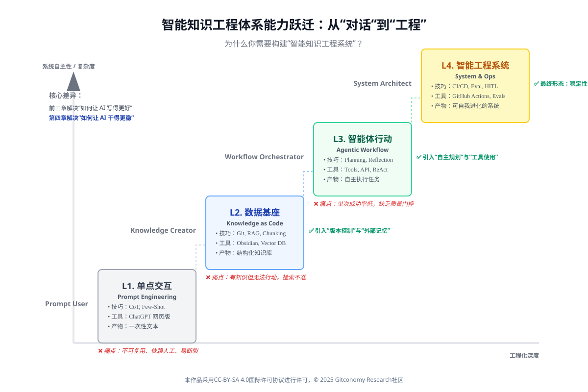
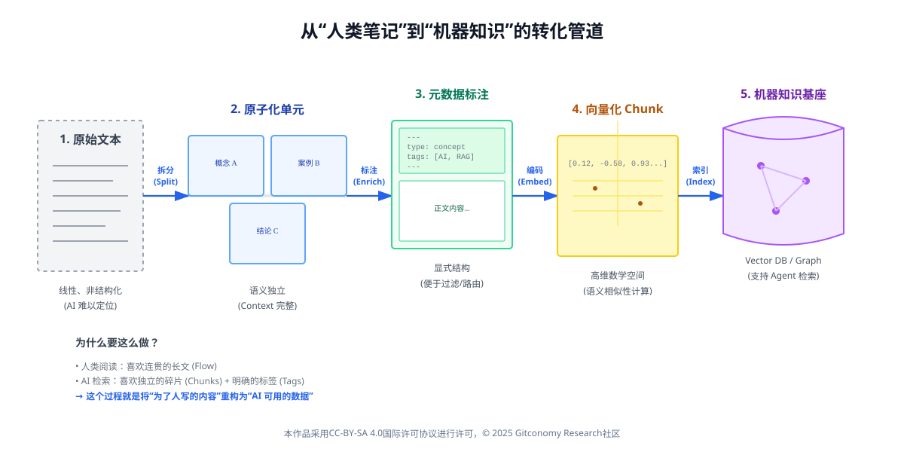
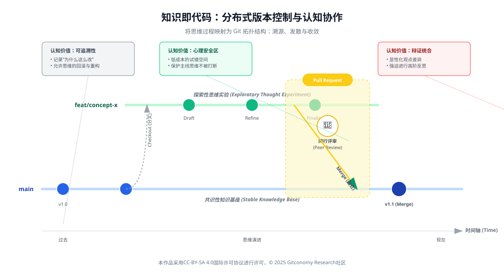
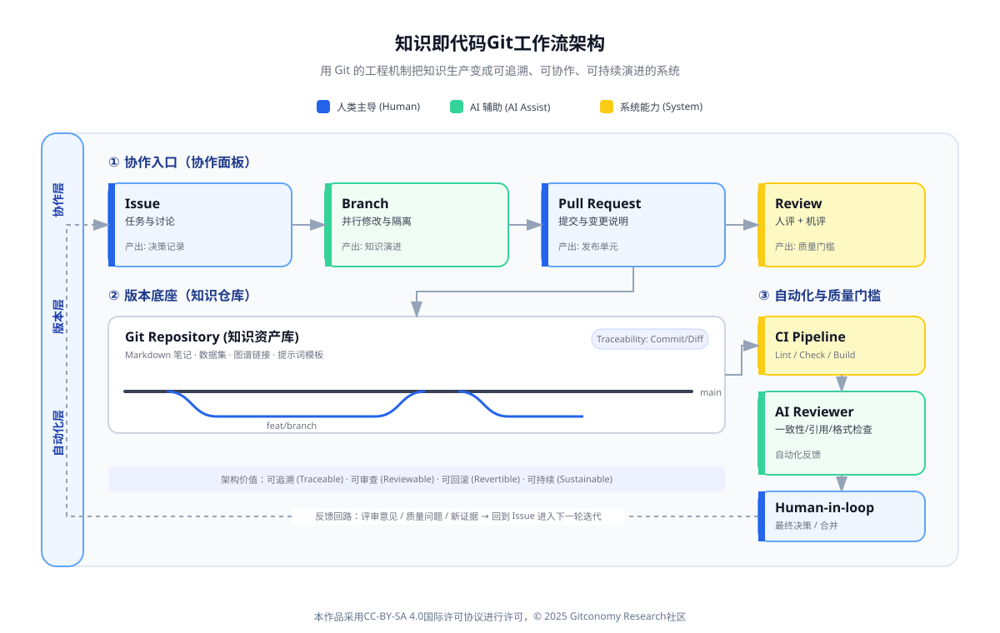
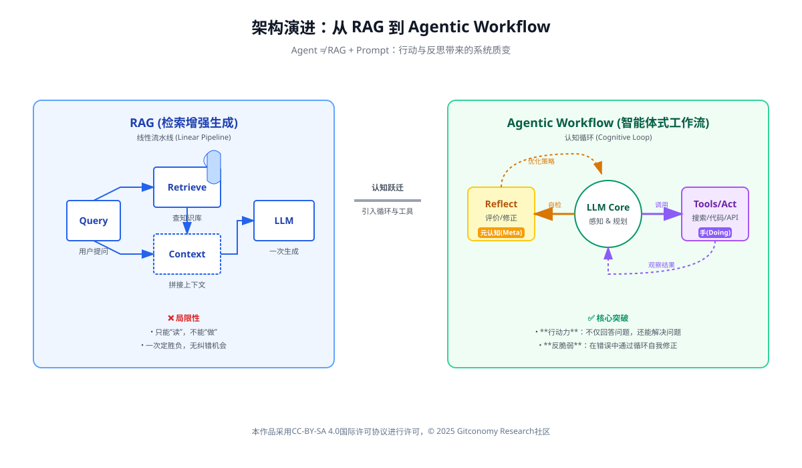
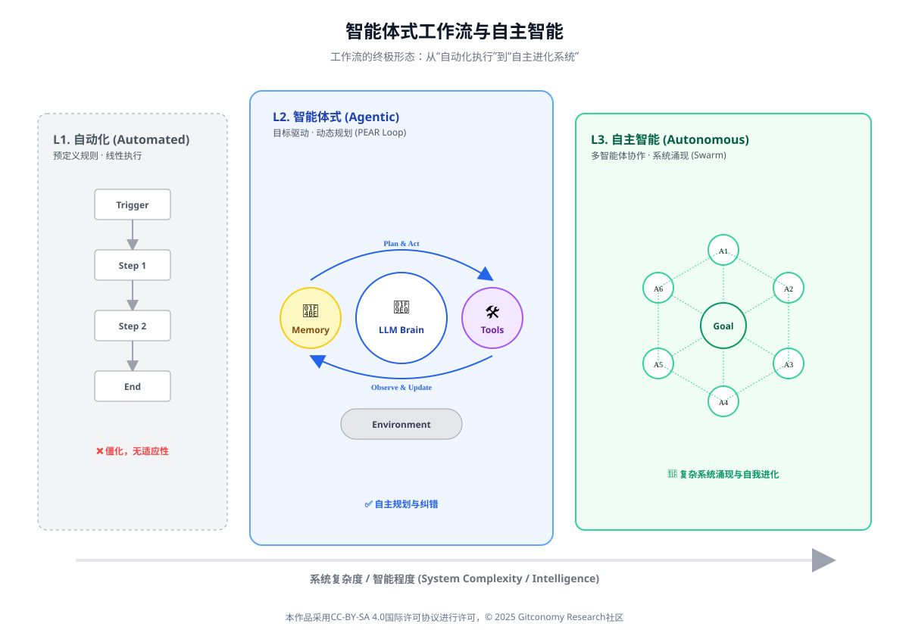
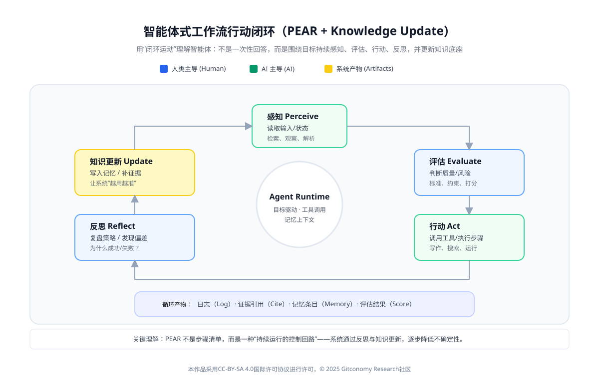
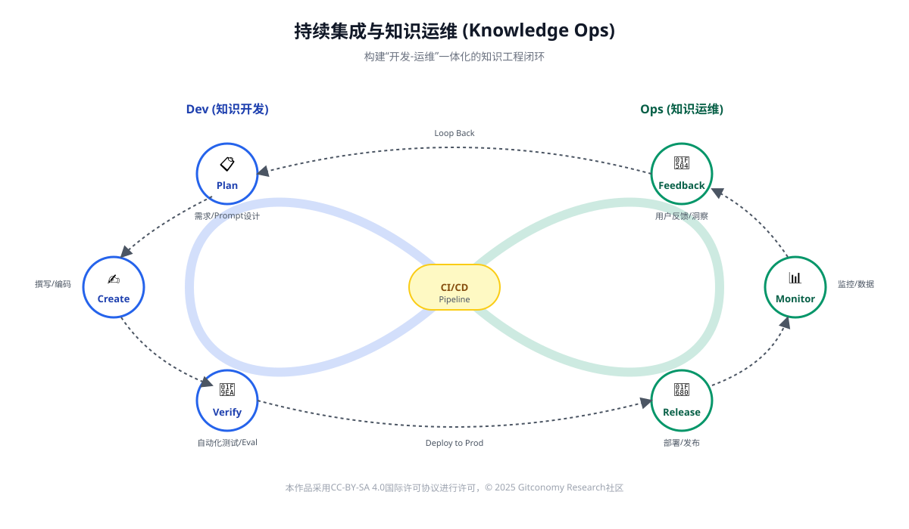

# 第四章 智能知识工程体系——从原子化笔记到代理式工作流

## 4.0 引言：知识生产的工程化重构

>⭐ 本章将逐步引入知识结构化、工程化协作、RAG 增强、代理式执行与运维反馈等关键概念，用于说明生成式 AI 如何从“参与单次知识任务”，升级为“支撑长期、可演进的知识生产系统”。

### 4.0.1 从“知识记录”到“知识工程”：生成式工作流的系统化转折点

在前三章中，我们奠定了生成式知识工作的基础能力： 结构化输入、提示链构建、控制论反馈机制以及最小可行工作流（MVW）。 这些能力解决了“如何让 AI 更好地理解你”和“如何让产出更稳定”，但仍然主要聚焦于 **个人层面** 的知识生产。

进入第四章，我们将从“点状技巧”跨越到“系统化工程”。  无论是企业知识管理、研究团队协作、还是个人构建第二大脑，都需要一种能够可扩展、可复用、
可协作和可自动化的 **生成式知识工作流系统（Generative Knowledge Workflow System）**。

这一趋势并非偶然，而是与认知科学、人机交互（HCI）、组织学习（Organizational Learning）等领域的长期研究高度契合。例如Card、Moran 和 Newell（1983） 提出了早期的人机交互认知框架，为结构化思维与任务建模奠定了基础[1]。Norman（1986）指出，系统的设计应帮助用户进行外部化思考，而非增加额外的认知负担[2]。这种从隐性知识到显性知识的转化，是知识创新过程的关键（Nonaka & Takeuchi, 1995）[3]。

本章将深入构建“智能知识工程”（Intelligent Knowledge Engineering）的完整体系，这一体系不再仅仅关注如何“记录”与“回顾”，而是关注如何将知识视为一种可计算、可版本化、可执行的“代码”，并利用智能体式工作流（Agentic Workflows）赋予静态知识库以自主行动的能力。

*图：为什么需要构建“智能知识工程系统”？*

传统的知识管理往往止步于“存储”与“检索”，其隐喻是图书馆或档案馆。而在智能知识工程的视角下，知识库的隐喻转变为“软件仓库”或“集成开发环境”（IDE）。在这种范式转移中，知识不再是静止的文本，而是动态的数据流。正如软件工程师通过版本控制系统管理代码的演进，知识工作者也需要引入分布式版本控制（如 Git）来追踪思维的迭代轨迹；正如 DevOps 工程师通过持续集成（CI/CD）流水线保障软件交付的质量，知识工程师也需要构建自动化的质量控制与发布流程 。更进一步，随着 RAG（检索增强生成）技术的成熟，原本为人脑设计的笔记结构必须同时适应机器的阅读逻辑，这要求我们在元数据架构（Metadata Schema）与文档分块（Chunking）策略上进行根本性的革新。

本章将沿着“数据—交互—代理—运维”的逻辑链条展开。

1. **数据层**：探讨如何将软件工程中的 Git 工作流范式移植到知识生产中，解决协作与版本溯源的难题；解析如何通过YAML Frontmatter与图谱化结构（GraphRAG）构建机器友好的知识库。

2. **交互层**：通过结构化提示工程（Prompt Engineering）定义人机协作的协议。

3. **智能体与运维层**：进入本章重点——智能式工作流与 Knowledge Ops，展示如何通过规划、反思与工具使用模式，构建出能够自主完成复杂任务的智能体系统。这不仅是工具的升级，更是认知维度的升维，旨在将读者从知识的“记录者”转化为智能系统的“架构师”。

### 4.0.2 本章学习目标

🔑 完成本章学习后，学习者应当在以下几个方面形成明确、可检验的学习成果：

| 维度  | 学习目标表述                                                           |
| --- | ---------------------------------------------------------------- |
| 思维层 | 从“生成式工作流”转向“将知识视为可计算、可演进系统”的工程化思维                                |
| 认知层 | 理解为什么仅有 Prompt 或 Workflow 仍不足以支撑长期知识生产，以及知识结构、版本与协作在系统稳定性中的决定性作用 |
| 方法层 | 掌握将 **结构化输入 → 知识建模 → 检索增强 → 代理式执行 → 运维反馈** 串联为完整知识工程体系的方法        |
| 实践层 | 能够构建一个**最小可行知识工程系统（MVKS）**，支持版本管理、可引用检索（RAG）与后续 Agent 调用         |
| 表达层 | 能以清晰的结构说明知识系统的组成、数据流与协作方式，使知识资产具备可复用、可审查与可持续演进的表达形态              |

> 📌 从「**我用 AI 做任务**」  到  「**AI 与我一起构建任务系统**」。

---

## 4.1 知识即代码：分布式版本控制与协作范式的认知解析

在数字化时代，知识的形态具有了前所未有的流动性与易变性。传统的文档管理方式（如“最终版_v2_修改版.docx”）在面对复杂的非线性知识迭代时显得捉襟见肘。为了实现对知识演变过程的精确掌控，我们需要引入“知识即代码”（Knowledge as Code）的核心理念，其技术载体便是分布式版本控制系统——Git。

*图：从“人类笔记”到“机器知识”的转化管道*

### 4.1.1 版本控制在认知层面的价值重构

Git最初是为管理源代码而设计的，但其核心哲学与现代高阶知识工作的需求高度契合。版本控制实际上提供了一种“外部化认知结构”，即将人的思维过程映射为可见的历史记录。

*图：将思维过程映射为 Git 拓扑结构：溯源、发散与收敛*

1.  **时间维度的可追溯性：** 每一个提交（Commit）是思维历史的一个断面。通过 `git blame` 或提交日志，知识工作者可以精准回溯观点的起源与背景。这种能力体现了分布式系统的“可恢复性”原则（Osterweil et al., 2009）[4]，并降低了修改带来的风险与心理负担。

2. **分支支持并行的思维实验 :** 分支（Branching）机制允许独立探索不同的思维路径，不破坏主线知识结构。其认知基础与科学研究中的“试错—选择”模式一致。轻量级分支降低了试验成本，显著鼓励发散式创新（Raymond, 1999）[5]。

3. **冲突的显性化与辩证解决：**  Merge Conflict 迫使作者显式处理观点之间的差异。对比差异（Diff）的过程是一种结构化反思（Schön, 1983）[6]，等同于用工具强化元认知能力。
### 4.1.2 适配知识生产的Git工作流策略矩阵

知识生产的复杂性与团队规模不同，对应不同协作拓扑。选择工作流本质上是一种“协作认知架构设计”（Grudin, 1994）[7]。

*图：用Git的工程机制把知识生产变成可追溯、可协作、可持续演进的系统*

| **工作流模式**                    | **核心机制与拓扑结构**                              | **知识管理适用场景**             | **认知负荷与优势分析**                                       |
| ---------------------------- | ------------------------------------------ | ------------------------ | --------------------------------------------------- |
| **集中式工作流 (Centralized)**     | 单一中央仓库，所有成员直接推送到 main 分支。模拟 SVN 模式。        | 个人数字花园、小型研究小组、初期文档项目。    | **低负荷**：操作简单。但多人协作时冲突频繁，缺乏完善的审查机制。                  |
| **功能分支工作流 (Feature Branch)** | main 保持稳定，所有修改在独立分支进行，最终通过 PR 合并。          | 团队知识库、白皮书撰写、课程内容维护。      | **中负荷**：PR 引入同行评审机制，提升内容结构与一致性（Rigby et al., 2014）。 |
| **Gitflow 工作流**              | 严格区分 main、develop、feature、release、hotfix）。 | 出版级教材、周期性行业报告、正式发布型知识产品。 | **高负荷**：结构严密，适合知识从“草稿”向“发布品”演化的周期管理。                |
| **派生工作流 (Forking)**          | 贡献者 Fork 仓库，通过 PR 跨仓库提交修改。典型模式来自开源社区）。     | 开源百科、众包知识库、跨机构合作。        | **中高负荷**：去中心化治理提升多样性，适合大规模协作。                       |

*表：知识协作视角下的 Git 工作流模式对比与认知负荷分析表*

### 4.1.3 深度解析：功能分支工作流的原子化实践

在智能知识工程中，**功能分支工作流（Feature Branch Workflow）** 是性价比最高的一种。其认知逻辑符合“将复杂任务拆解为原子化单元”。

**运作机制：**

1. **任务隔离**：  建立具语义的分支名（如 `feat/quantum-intro`)，符合人机交互强调的“可见性原则”（Norman, 1988）[8]。

2. **原子提交（Atomic Commit）**：  提交信息语义明确，使知识演化过程可审计（Fogel, 2017）[9]。

3. **同行评审 + AI 辅助**：   Pull Request（PR）在开源社区被证明能显著提升质量（Tsay et al., 2014）[10]。

4. **安全合并**：  代码与内容质量双重保证，是“知识型生产系统”的典型实践（Nonaka & Takeuchi, 1995）[3]。

### 4.1.4 提交信息规范：构建人类与机器可读的历史

采用 **Conventional Commits** 规范本质上是一种“认知外部化策略”（Hutchins, 1995）[11]，使历史记录不仅可读，也可被机器理解（Lin et al., 2016）[12]。

- **feat**: 引入新的知识点、章节（新功能的知识表达）。  
- **fix**: 修正错误或断链（符合文本维护的“维护性”原则）。  
- **docs**: 调整结构或注释，不改变知识本体。  
- **refactor**: 重构知识呈现方式（与软件重构理念一致）。  
- **chore**: 与构建、自动化系统相关的“元工作”。  

### 4.1.6 小结：版本控制让思维演化可追溯

当知识开始多人协作、长期演进，最先崩溃的通常不是“内容质量”，而是“过程不可控”：谁改了什么、为什么改、如何回滚，都说不清。Git 把这些隐性过程显性化：分支让探索可以并行，合并让共识得以沉淀，提交规范让变化具备结构化语义。知识因此获得了类似软件的生命线：不仅能写，还能审、能修、能迭代，并且每一步都可复查、可解释。

---

## 4.2 结构化认知与数据层构建：为 AI 准备的知识基座

智能知识工程时代的笔记必须同时服务于人类和算法（LLM）。知识库必须具备 **机器可读性（Machine Readability）** 和 **语义结构化（Semantic Structuring）**，以便为检索增强生成（RAG）提供高质量的外部知识源，从而减少幻觉并提升答案可信度

### 4.2.1 元数据架构：YAML Frontmatter 的战略意义

Obsidian 等工具支持 YAML Frontmatter（以 `---` 包裹），这一写法源于 Jekyll/静态网站生成领域，用于在 Markdown 顶部存放结构化元数据（如 `title`、`tags`、`categories` 等）

通过定义严格的 Schema，我们将笔记转化为可被程序解析的半结构化数据对象，这一做法已在架构决策记录（ADR）等工程实践中被证明有利于自动化检索和可追溯性。

**核心属性设计与 RAG 优化策略建议：**

| **属性键 (Key)**       | **数据类型** | **语义定义与工程用途**                                    | **RAG 与代理优化策略**                                                           |
| ------------------- | -------- | ------------------------------------------------ | ------------------------------------------------------------------------- |
| `uuid`              | String   | 笔记的全局唯一标识符，独立于文件名。                               | **持久化引用**：防止索引失效，便于向量库或图数据库长期引用相同节点。                                      |
| `aliases`           | List     | 别名列表，包含同义词、缩写、多语言名称。                             | **召回率提升**：解决语义模糊问题（如 "LLM" vs. "Large Language Model"），是改进检索召回的重要手段。      |
| `tags`              | List     | 主题标签，建议采用层级结构（如 `#AI/RAG/Chunking`）。             | **预过滤 (Pre-filtering)**：基于标签的先验过滤可以缩小搜索空间，提高检索效率与相关性。                     |
| `type`              | String   | 笔记类型（Concept, Person, Source, Meeting, Project）。 | **上下文感知**：指导 Agent 选择不同的处理模板和推理策略，例如对 Source 笔记应用引用规范，对 Meeting 笔记应用摘要模板。 |
| `status`            | String   | 知识成熟度（Seedling, Evergreen, Archived）。            | **质量控制**：RAG 仅检索 “Evergreen” 笔记，有助于降低幻觉与错误传播。                             |
| `visibility`        | String   | 权限级别（Public, Private, Team）。                     | **安全合规**：为后续基于角色的访问控制（RBAC）和安全 RAG 奠定结构基础。                                |
| `related_questions` | List     | 该笔记能回答的核心问题（原子问题）。                               | 集检索优化**：通过显式存储“问题–答案”对，有利于基于问题的向量检索和评估。                                   |

*表：面向 RAG 与智能代理优化的知识笔记元数据属性设计表*

### 4.2.2 从文档分块到原子化单元：RAG 检索的精度革命

传统的固定长度分块（Chunking）策略（按字数或 Token 硬切）容易在段落中间截断上下文，导致语义残缺，从而削弱 RAG 的检索与回答质量（Gao et al., 2023）[13]。为了提升检索精度，必须转向基于 **原子化单元（Atomic Units）** 的知识组织方式：每一个存储与检索的单元尽可能对应一个“相对完整、可独立理解的陈述”。

**原子化笔记的辩证法：**

- **对于人类**：保持适当的粒度（atomic-ish），以一个完整概念或论点为单位，避免过度碎片化导致的“链接地狱”，这一思想与 Zettelkasten 与“原子笔记”实践高度一致（Ahrens, 2017）[14]。

- **对于机器**：在 RAG 索引阶段，利用 LLM 将长笔记再细分为“原子陈述”（Atomic Statements），并将这些陈述作为检索单元，同时保留原始笔记作为上位上下文单元，用于回答生成时的扩展与溯源。

 
**进阶策略：合成问题（Synthetic Questions）**

- **机制**：利用 LLM 为原子知识块自动生成一组潜在的自然语言查询问题，作为该块在语义空间中的“多视角描述”，此类方法已在多篇 RAG 系统实践与评测工作中得到验证。

- **存储**：将“合成问题”与原文一起向量化，并作为独立索引条目挂载到同一知识节点上。  

- **检索**：查询阶段优先匹配用户问题与“合成问题”，再反向定位原文与上下文片段，通常能明显提高召回率和语义匹配度，尤其适用于长尾问题与表达方式差异较大的用户查询。

### 4.2.3 知识图谱与 GraphRAG：超越向量相似性的推理

为了实现深度的知识推理，我们需要构建 **知识图谱（Knowledge Graph, KG）** 并结合 RAG 形成 **GraphRAG**。知识图谱天然适合表达实体、概念、事件之间的关系结构，近年的研究已经系统梳理了如何将图结构与 RAG 结合，用以增强推理能力与可解释性。

**Markdown 到图谱的映射机制：**

- **节点 (Nodes)**：双链 `[[Concept Name]]` 视为节点，其理念与基于链接的个人知识图谱、语义网实践高度类似。  
- **边 (Edges)**：链接所在的上下文或显式属性（如 `relates_to`、`supports`）定义边的关系，可扩展为三元组 `(head, relation, tail)` 存入图数据库（如 Neo4j）。  
- **自动化构建**：使用 LLM 驱动的抽取工具（如基于 LlamaIndex/LlamaParse 等栈的实体与关系抽取流水线）从Markdown、PDF等文档中抽取实体和关系三元组，转化为图数据库可用的结构化数据，以支持后续GraphRAG。

 
GraphRAG 的推理优势在于：相比仅依赖向量相似度的朴素 RAG，GraphRAG 可以在图谱上进行路径遍历和社区级聚合，将“点状相关性”提升为“结构化关联性”。例如，在Microsoft GraphRAG的实践中，通过对图结构进行社区划分和多跳遍历，可以回答诸如 “A 对 B 的影响如何体现在 C 中？” 这类跨层级、跨实体的复杂问题。

这意味着：当我们在个人或组织的知识库中引入 **双向链接 + 元数据 + 图谱抽取** 时，不仅在“检索层”改进了RAG的命中率，更在“推理层”为 Agent 提供了可以沿路径展开思考的结构性支撑，使知识库真正成为 AI 的“认知基座”，而非简单的“向量堆积”。

*图：从RAG到Agentic Workflow的演进*

### 4.2.4 小结：机器可读的结构决定检索与代理上限

“笔记很多”并不等于“知识可用”。只要系统无法稳定识别一条笔记是什么、成熟度如何、适合回答什么问题，它就很难成为 RAG 的可靠外部记忆，更无法被智能体安全调用。元数据把笔记从文本变成数据对象，原子化与合成问题让语义在可控粒度上对齐，图谱化关系则把“相似度检索”推向“结构化推理”。这时，知识库不再只是存储，而开始具备“被计算”的条件。

---

## 4.3 提示工程与人机交互协议：定义思维的接口

提示工程（Prompt Engineering）可被视为一种“人机交互协议”（HCI Protocol），通过结构化提示构建出人与智能系统之间的可解释、可预测的互动方式（Shneiderman, 2022; Norman, 1986）。

### 4.3.1 结构化提示框架：CO-STAR 模型

**CO-STAR** 框架通过六个维度全面定义任务上下文，被广泛应用于生成式 AI 的任务指令设计，以减少幻觉并提升任务一致性（Microsoft Azure OpenAI Team, 2023）。

*图：将模糊意图转化为机器可执行协议的六大要素*

| **维度 (Component)** | **定义与作用**             | **示例指令 (Example)**     |
| ------------------ | --------------------- | ---------------------- |
| **C (Context)**    | 上下文：提供背景信息，设定场景。      | “你是一位资深的学术编辑...”       |
| **O (Objective)**  | 目标：明确任务核心。            | “请评估本章节的逻辑连贯性...”      |
| **S (Style)**      | 风格控制：确保生成内容的表现形式符合预期。 | “保持学术严谨性但通俗易懂...”      |
| **T (Tone)**       | 语气：定义情感基调。            | “保持建设性与客观性...”         |
| **A (Audience)**   | 受众：指定面向对象。            | “面向具有计算机科学背景的知识工作者...” |
| **R (Response)**   | 响应格式：强制输出结构化结果。       | “请以 Markdown 表格回应...”  |

### 4.3.2 思维链（Chain of Thought, CoT）与推理增强

在处理涉及多步逻辑或复杂计算的任务时，简单的指令往往难以获得理想结果。通过引入**思维链（Chain of Thought, CoT）**，我们可以显著提升大型语言模型（LLM）的推理表现。

- **零样本 CoT**：在提示词末尾添加“Let’s think step by step”，即可显著提升 LLM 推理表现（Kojima et al., 2022）。
- **少样本 CoT**：提供示例的推理链，可诱导模型执行更稳健的逻辑推理（Wei et al., 2022）。
- **认知负载管理**：将复杂问题分解为多个原子化的提示步骤，配合前文提到的“原子笔记”结构，可以极大提高知识处理的精度与深度。

### 4.3.3 自我修正与反思模式（Self-Correction & Reflection）

为了进一步保障知识工程的严谨性，提示工程引入了“元认知”控制机制，即让模型监控并修正自身的输出。这种 **Generate → Critique → Refine（生成-批判-完善）** 的闭环流程，是构建智能体式工作流的基础。

1. **初始生成**：根据 COSTAR 框架产生第一版初稿。
2. **自我批判**：指示模型扮演审稿人角色，针对逻辑漏洞、事实性错误或格式不符进行识别。
3. **迭代修正**：根据反馈意见，模型自主进行第二轮或多轮润色，直至达到预设的质量阈值。

 
这种反思模式有效地将错误率降至最低，使得生成的知识内容具备了准生产级的可靠性。

### 4.3.4 小结：交互协议决定生成的可执行性

生成式系统的最大成本，往往不是“写出来”，而是“写出来的东西无法稳定复用”：格式不一致、论证不完整、引用不可靠、步骤不可执行。结构化提示的意义在于把这些不确定性提前写进协议里：上下文、目标、约束、受众与输出格式被明确后，生成才可能成为可消费的结果，而不是一次性文本。更关键的是，推理过程被拆解、评价标准被写入，生成就具备了迭代达标的可能，为后续的代理式工作流提供了必要的控制回路。

---

## 4.4 智能体式工作流与自主智能：工作流的终极形态

智能体式工作流（Agentic Workflows）代表了生成式知识工程从“被动响应”向“主动协作”的进化。在这一范式下，AI 不再仅仅是一个对话窗口，而是一个具备规划（Planning）、工具使用（Tool Use）和自我反思（Reflection）能力的自主实体。它能够基于预设的知识基座（RAG），在复杂的任务指令下自主决定执行路径，显著降低了人类在流程管理上的认知负荷。

*图：智能体式工作流的终极形态：从“自动化执行”到“自主进化系统*
### 4.4.1 智能体式架构的核心特征

为了更直观地理解智能体式工作流的先进性，下表对比了其与传统自动化流程的差异：

| **特征维度** | **传统自动化工作流**       | 智能体式工作流 (Agentic Workflow)**                                           |
| -------- | ------------------ | ---------------------------------------------------------------------- |
| **触发机制** | 基于确定的规则触发（If-Then） | 基于模糊的目标触发（Goal-Oriented）（Wang et al., 2023）[15]                        |
| **执行路径** | 固定且刚性的流程分支         | 动态生成与调整执行路径（Yao et al., 2023）[16]                                      |
| **错误处理** | 遇到未知错误即停止运行        | 具备自我反思与错误修复能力（Self-Refine）（Madaan et al., 2023）[17]                    |
| **工具使用** | 静态配置的参数和模板         | 结合 RAG/GraphRAG 的上下文感知（Schick et al., 2023） [18]（Qin et al., 2023）[19] |

### 4.4.2 三大核心设计模式：规划、工具与反思

在实践中，智能体工作流通过以下三种核心模式的循环迭代来保障任务的完成质量：

1. **规划模式 (Planning Pattern)**  
   LLM 将宏大任务分解为可执行子任务序列（Task Decomposition），类似 ReAct、AutoGPT 等系统中的 Planner。

2. **工具使用模式 (Tool Use Pattern)**  
   LLM 可通过函数调用（Function Calling）、工具选择（Tool Routing）访问外部功能，包括检索、搜索、计算、代码执行等能力。

3. **反思模式 (Reflection Pattern)**  
   代理执行任务后，会根据错误信息、失败案例或逻辑不一致性进行自我修正，这是“Self-Healing Agents”应用的基础。

### 4.4.3 多代理编排（Multi-Agent Orchestration）

构建 **多代理系统 (MAS)**，让不同角色代理协作完成复杂知识任务。

- **Supervisor/Worker 模式**：Supervisor 分配任务，Worker 专注执行。  
- **典型流程**：  
  Git Issue 触发 → Planner 生成任务计划 → Researcher 检索资料 → Writer 撰写草稿 → Reviewer 评估 → 迭代 → 最终提交 PR。

 
这类架构已在研究中展示出明显优于单模型代理的协作能力。

### 4.4.4 ### 代理式工作流让系统具备行动闭环

从“流程”走向“代理”，变化不在于任务更复杂，而在于系统开始围绕目标持续运行：会规划、会用工具、会反思修正。工具扩展了行动空间，反思提供了误差反馈，规划负责把目标拆解为可执行路径；三者合起来，才形成可运行的闭环。进一步的多角色协作把复杂任务拆成可治理的分工：有人负责搜证、有人负责写作、有人负责审查，最终通过可审查的交付机制沉淀为知识增量。产出不再依赖单次灵感，而开始依赖可复制的组织方式。

---

## 4.5 持续集成与知识运维（Knowledge Ops）：闭环管理

知识运维（Knowledge Ops）是将软件工程中的 DevOps 理念引入知识管理领域的结果，旨在解决大规模知识库在长期演进过程中的“熵增”与质量退化问题。通过引入 **IssueOps** 协作模式和 **CI/CD** 自动化流水线，我们将原本碎片化的笔记活动转化为受控的、可追溯的工程化过程。

*图：智能体式工作流行动闭环：围绕目标持续感知、评估、行动、反思，并更新知识底座*

### 4.5.1 IssueOps：知识工作的控制台

利用 GitLink Issues 等任务追踪系统，我们可以将知识需求原子化。每一项新知识的引入、错误的修正或章节的重构，都被视为一个“工单”。

- **结构化输入**：利用 Issue Forms 规范化需求（如“概念名称”、“参考文献”）。
- **自动化触发**：通过 GitHub Actions，根据 Issue 状态自动触发 Agent 执行任务。
- **可视化项目管理**：利用 Kanban 管理知识生产进度。

### 4.5.2 知识库的 CI/CD 流水线

知识库的持续集成（CI）侧重于质量把关，而持续部署（CD）则侧重于知识资产的多端分发与索引同步。

*图：构建“开发-运维”一体化的知识工程闭环*

| **流程阶段**      | **关键自动化任务 (Task)**                      | **预期产出与价值**                           |
| ------------- | --------------------------------------- | ------------------------------------- |
| **持续集成 (CI)** | 自动运行格式 Linting、检查双链完整性、检测死链。            | 保持知识库的结构健康度，消除基础格式错误。                 |
| **质量门禁 (CI)** | 利用 LLM 对新合并的笔记进行“事实一致性”与“重复度”扫描。        | 防止幻觉信息或冗余内容污染核心知识资产（Evergreen Notes）。 |
| **自动索引 (CD)** | 监测到 main 分支更新，自动重新构建向量索引与图谱三元组。         | 确保下游 RAG 和 Agent 系统始终基于“真值源”进行推理。     |
| **自动分发 (CD)** | 自动将 Markdown 渲染为静态数字花园、Wiki 或同步至企业钉钉文档。 | 消除“知识孤岛”，实现生产与消费的无缝衔接。                |

### 4.5.4 小结：Knowledge Ops让系统在迭代中不被熵增吞没

知识系统的真实敌人是“熵增”：规模越大、协作越频繁，重复、过时、断链与格式漂移就越不可避免。把需求入口变成工单流转，把质量检查变成流水线门禁，把索引与图谱更新纳入持续发布，才能让知识系统像软件一样被运维：自动发现问题、自动阻止退化、自动生成可用资产。到这里，知识不再是写完就结束的文本，而成为持续集成、持续分发、持续修复的系统产物。

---

## 4.6 学员学习思考指南

请围绕下面三个问题，回看你在本章的学习与实践。本章的重点不是“学会更多工具”，而是让你开始具备一种系统能力：**把知识工作变成可追溯、可复用、可治理的工程系统**。你的反思也不需要写得很长，只要能回答“你做出了什么结构选择，以及为什么”即可。

### 问题 1：你的知识库，像“文档堆”还是“可演化系统”？

**当你引入 Git、分支、PR、提交规范之后，你对“写笔记/写文档”的理解发生了什么变化？**

- **思考引导**：你是否能清楚区分“内容写得好”与“过程可追溯”的差异？当出现错误、争议或重构需求时，你是否能用版本化手段把它们变成可讨论、可回滚、可审查的改进过程？如果让同学接手你的知识库，他是否能看懂结构、看懂变更历史，并在同一套规则里继续迭代？

### 问题 2：你的知识资产，机器真的“读得懂”吗？

**你为笔记设计的元数据与原子化结构，是否已经让知识具备“可检索、可路由、可调用”的机器可读性？**

- **思考引导**：你是否为笔记建立了统一的Frontmatter字段（类型、状态、标签、别名、可见性等），并能解释每个字段对应的工程用途？你是否能指出至少一个例子：因为结构化做得更好，检索召回更稳定、答案引用更可追溯、或路由决策更清晰？如果要接入 RAG/GraphRAG，你的知识单元是否足够原子、边界是否清晰、关联是否可表达？

### 问题 3：你是否已经把“生成”升级为“可运行闭环”？

**当你把提示工程、代理式工作流与Knowledge Ops连接起来，你是否真的拥有了一条可以长期运行的生产闭环？**

- **思考引导**：你的 Prompt 是否具备“协议”特征（输入契约、输出格式、评价标准），而不是一次性对话？在代理式工作流中，你是否能明确：规划在哪里发生、工具在哪里被调用、反思如何回写？当系统规模变大时，你是否开始用 Issue/看板/流水线去管理需求与质量，而不是靠人工记忆和临时沟通？如果让这套系统运行一个月，你最担心的退化点会在哪里（重复、过时、断链、格式漂移、幻觉引用），你准备怎样用运维机制提前防守？

---
## 4.7 课程总结

本章完成了智能知识工程体系的拼图：

- **Git** 解决了协作与回溯；
- **结构化数据与 GraphRAG** 解决了检索瓶颈；
- **提示工程** 确保了输出质量；
- **代理式工作流** 赋予了系统自主性；
- **Knowledge Ops** 保障了系统稳健运行。

智能知识工程旨在通过工程化手段，将人类从低维度的信息处理中解放出来，专注于高维度的创造与决策。在这个体系中，你不仅是知识的记录者，更是指挥硅基智能体军团的 **架构师**。

---

## 4.8 附录1：核心概念术语表 (Glossary)

| **English Term**                | **中文术语**    | **定义与解析**                                                           |
| ------------------------------- | ----------- | ------------------------------------------------------------------- |
| **Atomic Note**                 | **原子化笔记**   | 知识管理的最小构建单元。要求每条笔记只记录一个独立的观点或事实，以便于在不同的工作流中被精确调用和重新组合。              |
| **Agentic Workflow**            | **代理式工作流**  | 一种以 Agent 为核心的任务自动化模式。通过将复杂任务拆解为感知、决策、执行、反思的循环，实现比传统线性脚本更高的灵活性。     |
| **Knowledge Decoupling**        | **知识解耦**    | 将知识的内容逻辑与展示形式分离。在工程化体系中，这允许同一份原子知识被不同的 Agent 以不同的格式（如摘要、代码、对比表）输出。  |
| **Contextual Window**           | **上下文窗口**   | 模型在单次推理中能同时“记忆”和处理的 Token 总量。第四章强调通过精准的原子知识喂送，来优化窗口内的信息密度。          |
| **Pipeline (Workflow)**         | **流水线/工作流** | 将一系列相互关联的任务步骤串联起来的预设路径。在智能知识工程中，指从输入原始资料到输出最终成果的自动化处理链路。            |
| **Schema-driven**               | **模式驱动**    | 强调在构建知识库时预设结构化标准（如特定的 YAML 元数据）。它是实现 Agent 自动检索和处理大规模笔记的前提。         |
| **Metadata Management**         | **元数据管理**   | 对笔记的标签、来源、日期、关联关系等描述性信息的管理。在工作流中，元数据是 Agent 进行筛选和路由的关键指引。           |
| **Implicit Association**        | **隐性关联**    | 指笔记间未被显式链接、但语义上相关的关系。通过 Embedding 向量化技术，Agent 可以挖掘出传统笔记软件难以发现的深层联系。 |
| **Prompt Engineering (System)** | **系统提示词工程** | 在工作流中为 Agent 设定的全局性角色和行为准则。它定义了 Agent 在处理笔记时的基本逻辑框架和输出限制。           |
| **Recursive Summarization**     | **递归摘要**    | 一种处理长文本的工作流技术。通过对原子笔记进行层层叠加式的摘要提取，最终在不丢失核心论点的前提下实现长篇知识的压缩。          |

---

## 4.9 附录2：参考文献

[1] Card, S. K., Moran, T. P., & Newell, A. (1983). *The Psychology of Human-Computer Interaction*. Lawrence Erlbaum Associates.  
[2] Norman, D. A. (1986). Cognitive engineering. In D. A. Norman & S. W. Draper (Eds.), *User centered system design: New perspectives on human-computer interaction* (pp. 31–61). Lawrence Erlbaum Associates.  
[3] Nonaka, I. & Takeuchi, H. (1995). _The Knowledge-Creating Company: How Japanese Companies Create the Dynamics of Innovation_. Oxford University Press.  
[4] Osterweil, L., et al. (2009). Engineering of software—The continuing contributions of Leon Osterweil. *ACM Transactions on Software Engineering Methodology*, 18(3).  
[5] Raymond, E. S. (1999). *The Cathedral and the Bazaar*. O’Reilly Media.  
[6] Schön, D. A. (1983). *The Reflective Practitioner: How Professionals Think in Action*. Basic Books.  
[7] Grudin, J. (1994). Computer-supported cooperative work: History and focus. *IEEE Computer*, 27(5), 19–26.   https://doi.org/10.1109/2.291294  
[8] Norman, D. A. (1988). *The Design of Everyday Things*. Basic Books.  
[9] Fogel, K. (2017). *Producing Open Source Software: How to Run a Successful Free Software Project* (2nd ed.). O’Reilly Media.  
[10] Tsay, J., Dabbish, L., & Herbsleb, J. (2014). Influence of social and technical factors for evaluating contribution in GitHub . ICSE 2014: Proceedings of the 36th International Conference on Software Engineering. Pages 356 - 366 . [https://doi.org/10.1145/2568225.2568315](https://doi.org/10.1145/2568225.2568315) 
[11] Hutchins, E. (1995). *Cognition in the Wild*. MIT Press.  
[12] Lin, B., Bird, C., & Zimmermann, T. (2016). A large-scale study of programming languages and code quality in GitHub. *Communications of the ACM*, 59(10), 91–100. https://cacm.acm.org/research/a-large-scale-study-of-programming-languages-and-code-quality-in-github/  
[13] Gao, L., Lee, K., & Riedel, S. (2023). *Retrieval-augmented generation for knowledge-intensive NLP tasks: A comprehensive study.* arXiv. https://arxiv.org/abs/2312.10997  
[14] Ahrens, S. (2017). # How to Take Smart Notes: One Simple Technique to Boost Writing, Learning and Thinking for Students, Academics and Nonfiction Book Writer.  https://doi.org/10.17239/jowr-2017.09.02.05   
[15] Lei Wang, Chen Ma, Xueyang Feng, Zeyu Zhang, Hao Yang, Jingsen Zhang, Zhiyuan Chen, Jiakai Tang, Xu Chen, Yankai Lin, Wayne Xin Zhao, Zhewei Wei, Ji-Rong Wen (2023),  A Survey on Large Language Model based Autonomous Agents. arXiv:2308.1143  https://arxiv.org/abs/2308.11432  
[16] Shunyu Yao, Jeffrey Zhao, Dian Yu, Nan Du, Izhak Shafran, Karthik Narasimhan, Yuan Cao (2023), ReAct: Synergizing Reasoning and Acting in Language Models.  arXiv:2210.03629 https://arxiv.org/abs/2210.03629  
[17] Madaan, A., et al. (2023). Self-refine: Iterative refinement with self-feedback. *ICLR*. arXiv:2303.17651 https://arxiv.org/abs/2303.17651  
[18] Schick, T., Dwivedi-Yu, J., Zhou, C., et al. (2023). Toolformer: Language models can teach themselves to use tools. *NeurIPS*.  arXiv:2302.04761 https://arxiv.org/abs/2302.0476  
[19] Yujia Qin, Shihao Liang, Yining Ye, Kunlun Zhu, Lan Yan, Yaxi Lu, Yankai Lin, Xin Cong, Xiangru Tang, Bill Qian, Sihan Zhao, Lauren Hong, Runchu Tian, Ruobing Xie, Jie Zhou, Mark Gerstein, Dahai Li, Zhiyuan Liu, Maosong Sun (2023), # ToolLLM: Facilitating Large Language Models to Master 16000+ Real-world APIs.  arXiv:2307.16789 https://arxiv.org/abs/2307.1678  

---

## 许可声明

本文档采用 [知识共享署名--相同方式共享 4.0 国际许可协议 (CC BY--SA 4.0)](https://creativecommons.org/licenses/by-sa/4.0/deed.zh) 进行许可， &copy; 2025 Gitconomy Research社区。
