# 第五章 知识工程到智能体：构建本地化知识助手智能体

## 5.0 导论：从知识工程到智能体系统

### 5.0.1 构建本地化智能知识助手

在第四章中，我们已经完成了一次关键但尚未“闭环”的转变：  知识不再只是被记录、被整理，而是被工程化——具备了结构、元数据、版本与可计算性。  
然而，一个现实问题随之出现：这些工程化知识，究竟由谁来“使用”？

如果知识仍然只能在“人提问 → AI 回答”的模式下被调用，那么它的能力上限仍然停留在**被动响应**层面。这正是传统RAG系统的典型形态：它能回答问题，却不会主动行动，也无法持续执行任务。智能体（Agent）的引入，正是为了解决这一断裂。

从人工智能的经典定义来看，智能体并不是“更聪明的模型”，而是一种能够感知环境、做出判断、采取行动并根据反馈进行调整的系统形态（Russell & Norvig, 2021）[1]。这意味着，当我们把 Agent 引入知识系统时，知识的角色发生了根本变化——它不再只是“答案来源”，而是成为决策与行动的依据。

本章选择“本地化智能知识助手”作为落地场景，并非技术偏好，而是出于系统理性考量：

- 本地系统意味着**知识主权与可控性**
- 本地系统意味着**可审计、可演进的工程体系**
- 本地系统也迫使我们正视一个事实：**智能体不是云端魔法，而是工程系统**

 
“本地化智能知识助手”并不被理解为一个具体产品，而是一种系统形态：以本地知识库（如 Obsidian）为长期记忆基础，以 RAG 机制提供稳定检索能力，并在此之上引入 Agent 逻辑，使系统能够围绕真实知识工作流程持续运行。这种系统形态，正体现了认知科学所强调的“分布式认知”思想，即认知活动并不只存在于人脑中，而是分布在工具、符号与环境构成的整体系统之中（Hutchins, 1995）[2]。

### 5.0.2 本章学习目标

完成本章后，你将能够：

| 维度  | 能力描述                        |
| --- | --------------------------- |
| 认知层 | 理解智能体与 Prompt / RAG 的本体差异   |
| 结构层 | 掌握智能体的 PEAR 系统结构            |
| 工程层 | 构建面向Agent 的本地 RAG 知识系统      |
| 方法层 | 设计从提示链到行动链的智能体逻辑            |
| 系统层 | 形成一个可持续运行的 Agentic Workflow |

> 📌 本章的目标，并不是教你“调用一个 Agent 框架”，而是带你完成一次从“我向系统提问”，到“我设计一个能持续为我工作的系统”。

---

## 5.1 智能体的基础认知：从“单轮生成”到“持续行动”

在生成式人工智能快速普及的过程中，人机交互的主流范式被高度简化为一种直观结构：用户输入提示，系统生成结果。这种“单轮生成”模式在文本写作、翻译、摘要等任务中表现出极高的效率，也构成了大众对大语言模型能力的基本认知。

然而，当生成式系统开始被用于真实的知识工作场景时，这一范式很快暴露出其结构性局限。现实中的知识工作并非一系列彼此独立的问答，而是一种在时间中展开的认知过程：信息被不断采集、评估、修正、整合，并最终沉淀为可复用的知识资产。在这一过程中，关键挑战并不在于“一次是否生成得足够好”，而在于系统是否能够持续行动、维持状态并根据反馈调整行为。

理解智能体（Agent）的基础认知，正是从识别这种范式差异开始的。

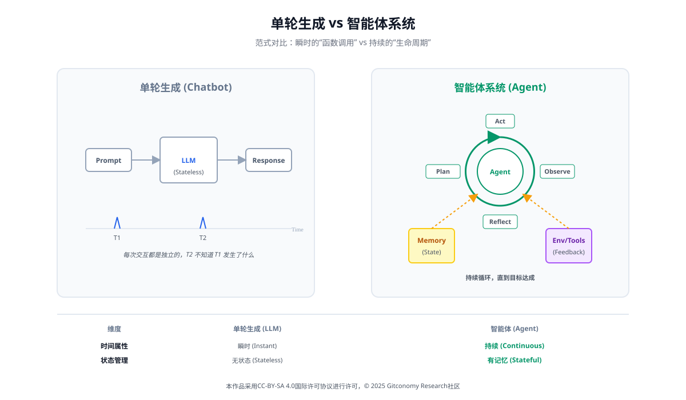
*图：单轮生成 vs 智能体系统*

### 5.1.1 单轮生成范式的能力边界

从技术角度看，单轮生成系统的核心能力来自上下文学习。研究表明，大语言模型可以通过提示在不更新参数的情况下完成多样化任务（Brown et al., 2020）[3]。随后提出的思维链提示方法，使模型能够在一次生成中显式呈现推理过程，从而显著提升复杂任务的表现（Wei et al., 2022）[4]。

然而，这些方法并未改变系统的根本运行方式。无论提示设计得多么精巧，单轮生成系统在系统层面始终具有以下特征：

- **时间上是瞬时的**：生成完成即结束
- **状态上是隐含的**：中间推理无法被系统持久化管理
- **行动上是封闭的**：输出止于文本，不改变环境

 
从系统论视角来看，这类系统更接近于一个“复杂函数”，而非一个能够在环境中持续运作的实体（Ashby, 1956）[5]。它们可以在给定条件下给出高质量输出，却无法承担长期目标导向的行为责任。

### 5.1.2 智能体的本体定义：从程序到行动系统

“智能体”并不是生成式AI时代的新概念。在经典人工智能理论中，Agent被定义为一种通过感知环境并作用于环境以实现目标的系统（Russell & Norvig, 2021）[6]。这一定义强调的并非智能水平的高低，而是系统是否具备行动能力与目标导向性。

更早的研究甚至指出，一个系统是否为Agent，与其是否“聪明”无关，而取决于其是否能够在环境中自主运行并维持内部状态（Franklin & Graesser, 1997）[7]。在这一意义上，智能体是一种**系统属性**，而不是模型属性。

当这一思想被引入生成式 AI 语境后，其核心问题随之发生转移：

> 📌 大语言模型是否能够从“生成结果的工具”，转变为“嵌入系统、持续行动的组件”？

### 5.1.3 从“推理”到“行动”：生成能力的重新定位

在大语言模型早期，思维链（Chain-of-Thought, CoT）提示技术的出现，使得模型能够通过生成中间推理步骤来解决复杂问题。然而，纯粹的CoT是一种封闭系统的“脑内模拟”，模型无法感知外部世界的实时反馈，导致推理过程容易脱离现实，产生“幻觉”。

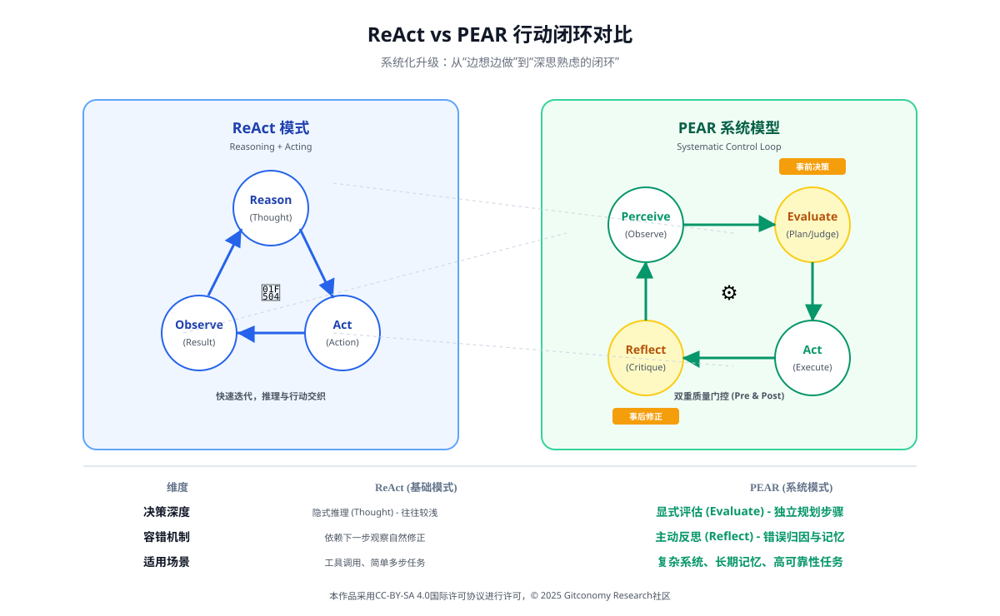
*图：ReAct vs PEAR，从“边想边做”到“深思熟虑的闭环”*

ReAct（Reasoning + Acting）范式的提出，标志着智能体架构的第一次质的飞跃。ReAct 框架明确区分了两类行为：内部的推理（Reasoning）与对外部环境产生影响的行动（Acting），并强调二者必须形成闭环，系统才能表现出智能体特征（Yao et al., 2022）。

这一区分在系统层面具有重要意义：  生成不再是终点，而是行动链中的一个中间环节。从软件架构视角来看，这相当于将语言模型从“最终输出模块”，重新定位为“决策与执行过程中的能力组件”（Bass et al., 2012）[8]。系统是否为智能体，取决于是否存在一个持续运行的控制结构，而非是否使用了某种特定模型。

ReAct通过特定的Prompt模板，强制模型遵循“观察-思考-行动”的循环：

1.  **推理轨迹 (Reasoning Trace / Thought)：** 模型首先生成一段内心独白，分析当前的任务状态。这一步骤利用了 LLM 的规划能力。
2.  **行动 (Action)：** 基于推理结果，模型生成具体的行动指令，例如调用 `Search[Guitar Model X specs]`。这是智能体与外部环境交互的接口。
3.  **观察 (Observation)：** 外部工具执行行动后，将结果返回给模型。这是模型“感知”外部世界的关键步骤。
4.  **循环迭代：** 模型将新的观察结果纳入上下文，进行下一轮推理，直至得出最终答案。

 

| 维度 | Act-Only (仅行动) | Chain-of-Thought (仅思维链) | ReAct (推理+行动协同) |
| :--- | :--- | :--- | :--- |
| **工作原理** | 直接生成动作指令，无显式推理 | 生成推理步骤，无外部交互 | 交错生成推理轨迹与动作指令 |
| **主要缺陷** | 缺乏规划，复杂任务成功率低 | 易产生事实幻觉，无法更新知识 | 推理路径可能过长，上下文窗口压力大 |
| **外部感知** | 有 | 无（封闭系统） | 有（基于 Observation 实时更新） |
| **动态适应性** | 低 | 低 | **高**（能根据 API 报错调整策略） |

*表：ReAct与传统方法的对比分析*

ReAct 的优势在于它通过“接地”（Grounding）解决了幻觉问题。推理轨迹指导了行动的方向，而行动的反馈又修正了推理的偏差。

### 5.1.4 持续行动与反馈回路

智能体与单轮生成系统最根本的差异，体现在其对时间与反馈的处理方式上。控制论早已指出，任何目标导向系统都必须依赖反馈回路来维持其行为稳定性（Wiener, 1948[9]；Ashby, 1956[5]）。如果系统无法根据行动结果调整自身策略，那么其行为将不可避免地偏离目标。

在生成式 AI 研究中，引入反思与自我评估机制，正是为了弥补这一缺失。相关研究表明，具备显式反思能力的智能体在复杂任务中表现出更高的成功率与稳定性（Shinn et al., 2023[10]；Madaan et al., 2023[11]）。但从系统角度看，这些方法的真正价值，并不在于“模型更会反思”，而在于反馈被纳入了系统运行结构之中。

**Reflexion架构的三大支柱：**

1.  **演员（Actor）：** 执行具体任务的智能体（通常基于 ReAct 架构），负责探索解空间并尝试完成任务。
2.  **评估器（Evaluator）：** 对演员的输出进行质量判断。它能识别出轨迹中的具体问题，例如“无效循环”或“搜索结果不相关”。
3.  **自我反思模型（Self-Reflection Model）：** 当任务失败时，该组件分析轨迹和评估器反馈，生成一段**“言语强化提示”（Verbal Reinforcement Cues）**，对未来行动提供指导建议。

 
**Reflexion的记忆机制：**

生成的反思会被存储在智能体的长期记或情景记忆（Episodic Memory）中。在下一次尝试同一任务或类似任务时，这些反思会作为上下文输入给演员。这使得智能体能够从过去的错误中吸取教训，实现无需昂贵模型微调（Fine-tuning）的自主学习。
### 5.1.5 智能体与知识工作的关系

从知识工作视角来看，智能体的重要性尤为突出。知识管理研究早已指出，知识并非静态存储的对象，而是在行动与反思中不断被创造与重构的过程(Davenport & Prusak, 1998）[12]。单轮生成系统只能在某个瞬间提供帮助，而无法参与这一长期过程。

认知科学中的分布式认知理论进一步指出，认知活动并不只存在于个体头脑中，而是分布在工具、符号与环境构成的系统中（Hollan et al., 2000）[13]。当智能体被嵌入到知识系统中，它实际上成为这一分布式认知系统的组成部分，而非一个外部的“对话工具”。

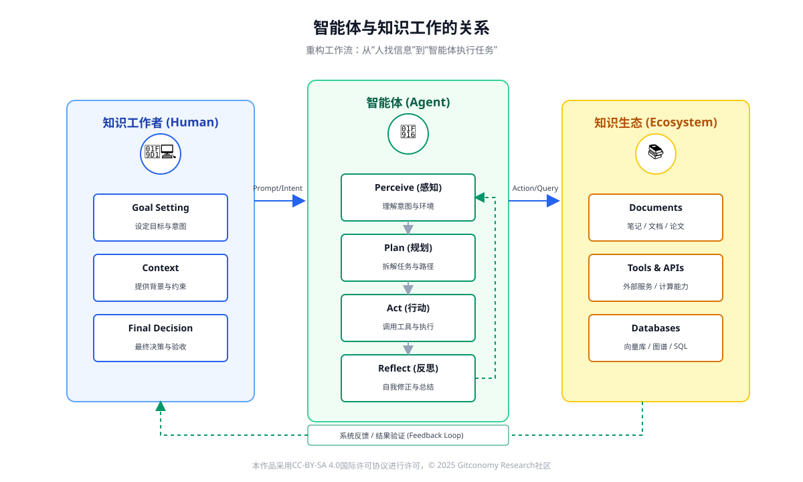
*图：智能体与知识工作的关系——从“人找信息”到“智能体执行任务”*

这也解释了为什么在本章中，智能体被理解为一种系统能力，而不是一个以聊天界面为中心的应用形态。

### 5.1.6 生成式智能体与拟人化社会模拟

斯坦福大学与 Google 合作的“Generative Agents”研究将智能体的认知架构推向极致。该研究展示了智能体如何通过记忆、反思和规划涌现出复杂的社会行为[14]。

**生成式智能体的架构特征：**

* **记忆流（Memory Stream）：** 按时间顺序记录所有感知、观察和自身想法的完整日志。
* **检索（Retrieval）：** 根据**相关性（Relevance）**、**时效性（Recency）**和**重要性（Importance）**三个维度计算分数，从记忆流中提取最相关的信息。
* **反思（Reflection）：** 智能体定期分析最近的记忆，生成更高层次的抽象观点（Synthesized High-level Thoughts），作为记忆对象存储，参与未来的检索。
* **规划（Planning）：** 基于目标和记忆生成详细的计划，并能根据实时感知进行**动态重规划**。

 
### 5.1.7 小结：完成从“生成思维”到“系统思维”的转向

本节的目标，并不是让学习者记住某个定义，而是促成一次认知转向：

| 传统理解      | 智能体视角       |
| --------- | ----------- |
| AI用来回答问题  | AI用来持续完成任务  |
| 生成即智能     | 行动 + 反馈构成智能 |
| Prompt是核心 | 系统设计是核心     |
| 模型能力决定上限  | 系统结构决定上限    |

*表：从生成范式到智能体范式的认知转向*

只有在完成这一转向之后，讨论智能体的系统结构（如PEAR模型）、工程实现与工作流设计才具有真正意义。下一节将基于这一基础，对智能体进行结构性拆解，使其从抽象概念转化为可设计、可实现的系统模型。

### ### 5.1.7 小结：从“会回答”到“能持续完成任务”

把知识工程推向智能体，并不是追求一种“更像人”的对话体验，而是承认知识工作真正的难点在于：任务跨时间、跨工具、跨上下文地推进。只要任务需要排队、需要状态、需要失败后的重来，**工作流就必须升级为系统**——也正是在这里，智能体的价值第一次变得具体：它不是替你灵机一动，而是替你把事情**持续、可控地做完**。

---

## 5.2 智能体的系统结构——PEAR 模型（感知–评估–行动–反思）

在上一节中，我们已经完成了一次关键的认知转向：  智能体并不是“更复杂的生成模型”，而是一种能够在时间维度上**持续行动**的系统。然而，仅有这一认知还不足以支撑工程实践。要让智能体真正成为一个可设计、可实现、可调试的系统，我们还必须回答一个更具体的问题：

> 📌 **一个智能体，在系统层面究竟是由哪些功能性结构构成的？**

如果缺乏清晰的结构模型，智能体很容易被误解为“若干 Prompt 的组合”或“一个不断自我调用的大模型循环”。这种理解不仅掩盖了智能体的本质，也会在工程实践中导致系统不可控、不可维护的问题。

为此，本章引入 **PEAR 模型**，作为理解和设计智能体系统结构的核心框架。

### **5.2.1 为什么智能体需要结构模型**

在计算机科学与软件工程的发展史中，每一次复杂系统的成功落地，几乎都伴随着某种关键性的结构抽象。操作系统通过进程与调度管理计算资源，数据库通过事务与索引保障一致性，软件架构通过模块与接口控制系统复杂度（Bass et al., 2012）[5]。

智能体系统同样如此。  如果我们无法清晰地区分系统中“正在发生什么”“系统如何决策”“系统正在做什么”“系统是否需要调整”，那么任何规模稍大的智能体都将迅速演变为一个难以理解、难以调试的黑箱。

结构模型的意义，正在于把“看似连续的智能行为”拆解为**可分析、可组合、可约束的功能阶段**。

### 5.2.2 PEAR 模型概述：一个闭环的行动系统

PEAR 模型将智能体的运行过程抽象为四个相互衔接、可循环的阶段：

**Perceive（感知） → Evaluate（评估） → Act（行动） → Reflect（反思）**

这一结构在思想上直接继承了控制论关于反馈回路的基本观点，同时也与经典人工智能中“感知–决策–执行–学习”的智能体范式高度一致。PEAR 模型的关键不在于阶段名称本身，而在于它强调了一个核心事实：  智能体并不是一次性完成推理，而是在行动与反馈中不断修正自身状态。

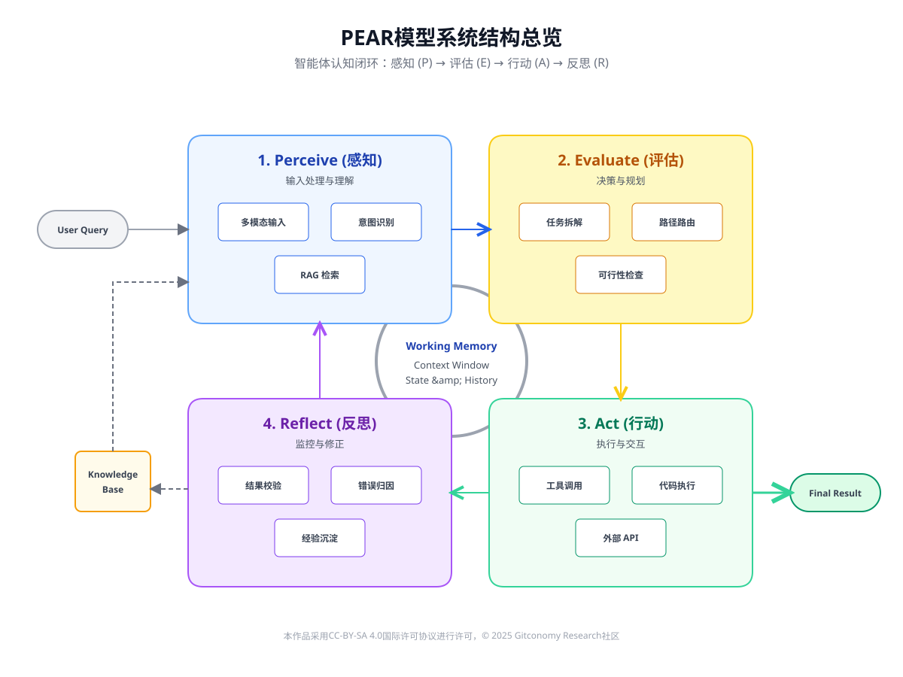
*图：PEAR 模型系统结构——感知 (P) → 评估 (E) → 行动 (A) → 反思 (R)*

为了更清晰地理解 PEAR 模型在系统层面的含义，可以将其拆解为如下结构分解表。

|模块|核心问题|主要输入|主要输出|系统角色|
|---|---|---|---|---|
|**Perceive（感知）**|当前发生了什么？|输入信号、环境状态、历史记录|结构化状态表示|输入与状态构建层|
|**Evaluate（评估）**|是否值得行动？如何行动？|状态表示、目标、约束|决策信号、行动计划|决策与控制层|
|**Act（行动）**|具体执行什么？|行动计划、工具接口|环境变化、执行结果|执行层|
|**Reflect（反思）**|是否需要调整？|行动结果、目标偏差|策略修正、经验记录|调节与学习层|

*表：PEAR 模型的系统结构分解*

这一分解清楚地表明：  语言模型的“生成能力”只覆盖其中的部分环节，而非全部。

#### 5.2.2.1 Perceive：从输入信号到可操作状态

在单轮生成系统中，“感知”往往被简化为“读取用户输入文本”。  而在智能体系统中，Perceive 阶段的目标并不是获取原始输入，而是构建一个可用于决策的状态表示。

这意味着感知阶段通常需要完成以下任务：

- **多模态输入：** 接收文本、图像、代码、音频或传感器数据。
- **环境感知：** 理解当前所处的环境状态（例如：代码库的当前版本、用户的情绪状态、网页的DOM结构）。
- **注意力机制：** 从海量信息中过滤噪音，提取关键信息（Key Information Extraction）。

 
在知识工作场景中，所谓“环境”并非物理世界，而是由文档、标签、元数据与版本历史构成的信息空间。只有当这些信息被结构化，后续的评估与行动才具备可操作性。**技术实现：** Embedding（向量化）、OCR、ASR、上下文窗口管理。

这一过程与认知科学中的观点高度一致：认知并非对刺激的被动反应，而是对情境的主动建模。

#### 5.2.2.2 Evaluate：智能体的决策中枢

Evaluate是智能体系统中最具区分度的模块，也是单轮生成系统最为缺失的部分。在传统生成范式中，“是否继续”“是否正确”通常由人类判断；而在智能体系统中，这些判断必须被显式地系统化。l两者之间的关键差异：普通 Chatbot 往往跳过此步直接生成答案，而 Agent 在此步骤会进行“慢思考”。

Evaluate 阶段通常承担以下职责：

- **记忆调用：** 检索长期记忆（RAG）或短期记忆（对话历史），寻找类似问题的解决方案。
- **任务拆解：** 将复杂目标拆解为子任务序列（Chain of Thought / Tree of Thoughts）。
- **可行性分析：** 评估不同行动方案的成功率、风险和资源消耗。

近年来的 Agent 研究表明，引入显式评估机制（如规则检查、约束验证或 LLM-as-a-Judge）可以显著提升系统的稳定性与可控性。从系统角度看，没有 Evaluate，就不存在真正的“自主行动”，只剩下被动执行。

#### 5.2.2.3 Act：从生成文本到改变系统状态

行动（Act）是智能体真正“落地”的阶段，可以是单步执行，也可以是基于规划的并行执行。  在这一阶段，系统不再只是生成描述，而是通过调用工具、修改数据或触发流程，对环境产生真实影响。需要强调的是：  行动并不等同于输出文本。

在工程实践中，Act 通常表现为：

- **工具调用（Function Calling）：** 使用搜索引擎、代码解释器、数据库查询、API 请求。
- **内容生成：** 输出文本、代码、图表或控制指令。
- **物理操作：** 如果是具身智能（Embodied AI），则涉及机械臂或移动底盘的控制。

 
软件架构研究指出，所有具有副作用的操作都必须被清晰隔离和约束。这一原则在智能体系统中尤为重要，因为行动阶段直接决定了系统的风险边界。

#### 5.2.2.4 Reflect：反思作为系统调节机制

反思（Reflect）常被误解为“让模型评价自己写得好不好”。  但在PEAR模型中，反思的核心目标并不是语言评价，而是系统调节。
Reflect 阶段通常包括：

- **结果验证：** 检查 Action 的产出是否符合预期（例如：运行代码看是否报错，检查网页是否成功抓取）。
- **错误修正：** 如果失败，分析原因（是感知错了，还是工具用错了？），并调整策略重新尝试。
- **经验沉淀：** 将成功的经验或失败的教训写入长期记忆，优化未来的 Evaluate 过程。

 
相关研究表明，引入反思与经验记忆机制，可以显著提升智能体在复杂任务中的长期表现。从控制论视角看，这正是负反馈机制在智能体系统中的体现。典型的应用，例如ReAct 模式中的 Observation 环节，或者类似Reflexion框架的自我打分机制。
### 5.2.3 PEAR模型的工程映射

为了避免 PEAR 停留在抽象层面，可以将其映射到典型的软件系统模块中：

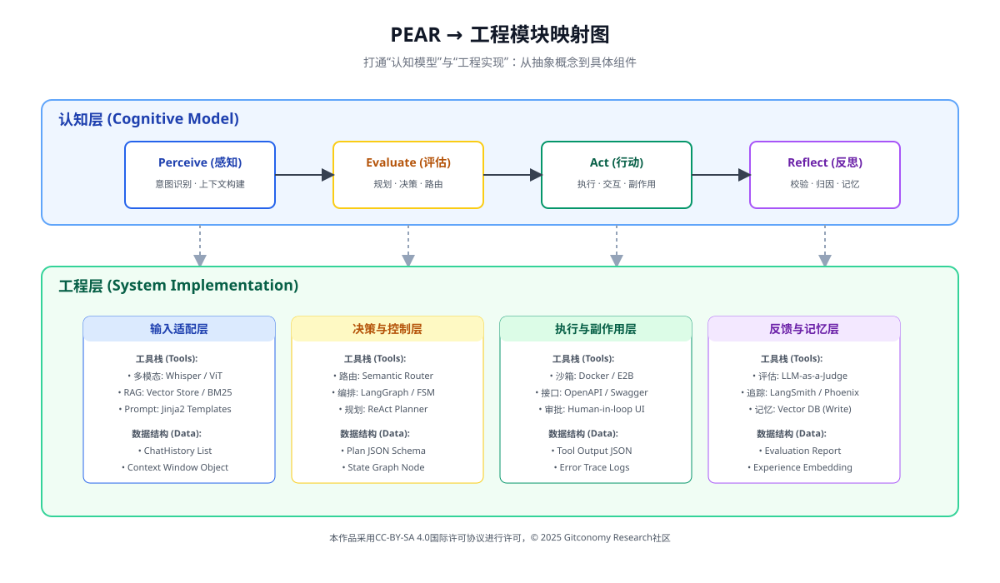
*图：PEAR → 工程模块映射图，从抽象概念到具体组件*

| PEAR 阶段  | 工程模块映射   | 典型实现          | 技术栈                                                                                                                                                                                                                                                       |
| -------- | -------- | ------------- | --------------------------------------------------------------------------------------------------------------------------------------------------------------------------------------------------------------------------------------------------------- |
| Perceive | 输入与状态适配层 | 解析器、监听器、状态管理器 | **多模态转换器：** 使用 Whisper (Audio to Text) 或 CNN/ViT (Image to Text) 预处理数据。 **Prompt Assembler：** 动态组装提示词（System Prompt + User Input + RAG Context）。 **Token Manager：** 实时监控 Token 用量，对过长的历史记录进行摘要（Summarization）或截断。                                   |
| Evaluate | 决策与策略层   | 规则引擎、规划模块     | **AG / FSM (有限状态机)：** 使用 **LangGraph** 或 **Stateflows** 来定义明确的节点跳转逻辑（例如：如果检索失败，跳转到搜索节点；如果检索成功，跳转到生成节点）。  **Router (路由分发)：** 根据意图分类，将任务分发给不同能力的子模型（专精代码的模型 vs 专精写作的模型）。 **Planner (规划器)：** 生成 JSON 格式的任务列表，并在执行过程中动态更新状态。                            |
| Act      | 执行与副作用层  | 工具调用、API、写入操作 | **Schema Definition：** 使用 OpenAPI (Swagger) 规范或 Pydantic 模型来严格定义工具的输入输出结构，强制 LLM 输出符合格式的 JSON。 **Sandboxed Environment：** 在 Docker 容器或 e2b 等沙箱环境中执行代码，防止 `rm -rf /` 等危险操作。 **Middleware：** 在执行前增加一层人工确认（Human-in-the-loop）或参数校验逻辑。                  |
| Reflect  | 反馈与学习层   | 日志系统、经验存储     | **Vector Database (向量数据库)：** 使用 Milvus / Chroma / Pinecone 存储成功的 Task-Action 对，作为未来的 Few-shot 示例。  **Evaluator：** 编写具体的单元测试（Unit Tests）或断言（Assertions）来验证 Action 的结果。 **Log & Trace：** 使用 LangSmith 或 Arize Phoenix 记录完整的思考链路，用于后续的微调（Fine-tuning）。 |

这一映射再次强调：  智能体不是一个“大模型循环”，而是一个由多类组件协同构成的系统。如果说 LLM 是**CPU**（负责运算和推理），那么PEAR 工程架构就是主板和外设：

- **P (Perceive)** = **RAM + I/O 总线** (将数据加载到内存)
- **E (Evaluate)** = **操作系统调度器** (决定下一个时钟周期处理什么进程)
- **A (Act)** = **显卡/网卡/打印机** (执行具体的物理或网络操作)
- **R (Reflect)** = **硬盘/文件系统** (存储日志，优化下次启动配置)

 
### 5.2.4 小结：PEAR作为系统视角的意义

本节的核心结论可以概括为一句话：

> 📌  **PEAR 不是一种算法，而是一种理解和设计智能体系统的结构视角。**

它帮助我们避免将智能体简化为“会调用工具的大模型”，而是将其视为一个具备感知、决策、执行与调节能力的行动系统。只有在这一结构视角下，智能体才可能成为一个**可维护、可演进、可托付的系统组件**。

在下一节中，我们将基于 PEAR 模型，进一步讨论智能体的设计方法，重点关注如何将“提示驱动的生成流程”升级为“行动驱动的工作流”。

### ### 5.2.4 小结：PEAR作为系统视角的意义

如果把智能体只理解为“更会聊天的大模型”，你会很快遇到两个天花板：一是行为不可控，二是经验无法累积。PEAR 的价值就在于，它把智能体重新还原为一个**行动系统**：能从环境读取状态（Perceive），能在目标约束下做判断（Evaluate），能通过接口改变世界（Act），也能把结果写回记忆以改变下一次决策（Reflect）。当你用这种结构去看智能体，很多工程问题会自动“显形”——边界怎么划、日志怎么留、回滚怎么做、人在回路放在哪里。

---

## 5.3 新一代知识工程：语义分块、知识图谱与 GraphRAG

在明确了智能体的系统结构（PEAR 模型）之后，一个更为基础、却常被低估的问题随之显现：  智能体究竟“依赖什么样的知识形态”，才能支撑其持续行动与复杂推理？

在传统生成式系统中，知识往往被视为一种“被动的外部资源”——模型在需要时临时检索、临时使用，生成结束后即被丢弃。然而，在智能体系统中，知识不再只是输入材料，而是构成系统认知能力的重要组成部分。  

从PEAR视角看，知识工程直接支撑着三个关键环节：

- **Perceive**：知识以何种粒度与结构被感知
- **Memory**：知识如何被长期存储、组织与调用
- **Reflect**：知识如何在行动反馈中被修正与演化

 
正是在这一意义上，传统RAG架构逐渐暴露出其结构性不足，而“新一代知识工程”成为智能体系统不可或缺的基础设施。

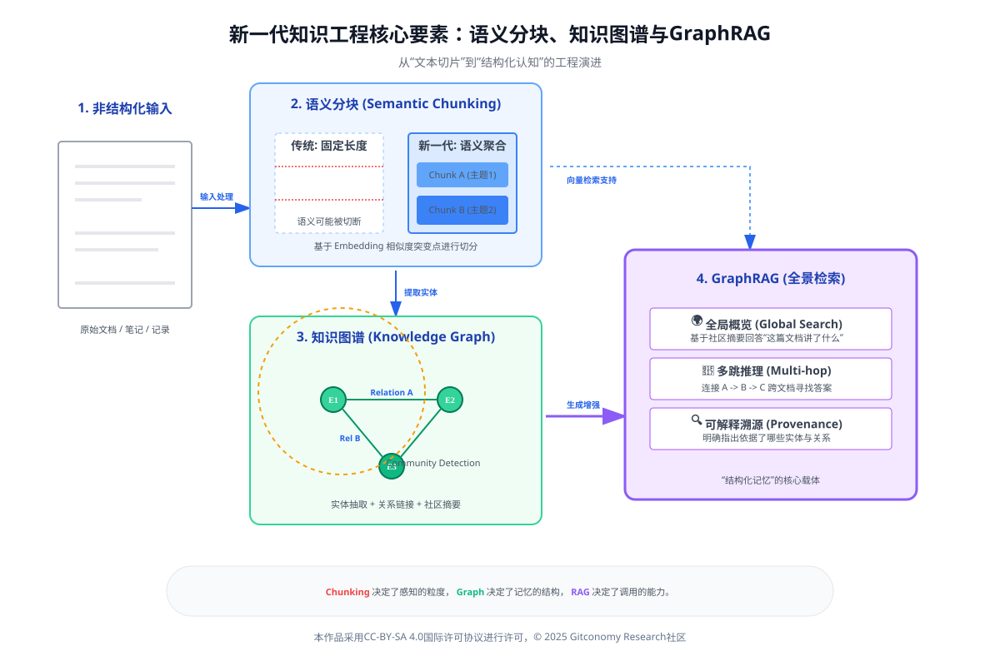
*图：语义分块、知识图谱与GraphRAG作为新一代知识工程的核心要素*

### 5.3.1 认知负荷与语义分块：Perceive阶段的工程前提

知识进入智能体系统的第一步，并不是“向量化”，而是分块（Chunking）。  
这一问题在认知科学中早已有清晰结论：个体（无论是人类还是人工系统）的信息处理能力受限于认知负荷，合理的分块是降低复杂度、提升理解效率的核心机制（Miller, 1956)[16]。

认知负荷理论（Cognitive Load Theory, CLT）指出，当信息单元过大或语义结构混乱时，系统将被迫消耗额外资源用于“理解信息本身”，而非“解决问题”（Sweller et al., 2011）[17]。这一现象在智能体系统中表现得尤为明显：  
如果感知阶段接收到的是语义破碎或上下文不完整的文本片段，后续的评估与行动将不可避免地建立在噪声之上。

从信息检索（IR）的角度看，这一问题同样具有基础性意义。Hearst（2009）[20]指出，检索系统的效果高度依赖于“信息单元的合理性”，而非单纯的匹配算法。分块策略，实质上决定了系统所能“看到”的世界。

分块策略的工程演进：

| 分块策略     | 技术原理           | 适用场景   | 系统层面影响        |
| -------- | -------------- | ------ | ------------- |
| 固定大小分块   | 按字符或 Token 数切割 | 简单搜索   | 易切断语义，增加感知噪声  |
| 递归字符分块   | 按结构分隔符递归       | 通用 RAG | 在复杂度与语义完整性间折中 |
| 文档结构分块   | 基于标题与层级        | 技术文档   | 强化可溯源性，利于反思   |
| **语义分块** | 基于嵌入相似度变化      | 深度推理   | 显著提升感知质量      |

*表：分块策略的技术演进及其对 Perceive 的影响

语义分块的关键意义在于：  它将“文本切割”提升为“语义建模”问题。  在PEAR 框架下，这意味着 Perceive 阶段不再只是“读取文本”，而是主动构建可用于决策的认知单元。

### 5.3.2 从向量集合到结构化记忆：GraphRAG与Memory 的重构

传统RAG的核心假设是：相似度足够高的文本片段，可以支撑高质量生成。这一假设在事实性问答中成立，但在复杂知识任务中逐渐失效。大量研究表明，基于向量相似度的检索机制在以下场景中表现受限：

- **多跳推理（Multi-hop Reasoning）**
- **跨文档因果关系建模**
- **全局结构性总结**

 
这些问题并非LLM 特有，而是长期存在于信息检索与问答系统中的结构性挑战。知识图谱（Knowledge Graph, KG）研究为此提供了另一条路径。KG将知识表示为由实体与关系构成的语义网络，使推理可以沿着结构化路径展开（Nickel et al., 2016[21]；Hogan et al., 2021[22]）。

GraphRAG将这一思想引入RAG架构，对智能体的Memory层进行重构：

- **实体与关系抽取**：利用 LLM 从非结构化文本中识别关键实体与语义关系
- **图结构构建**：将知识组织为可遍历的语义网络
- **社区检测与层级摘要**：在图层面形成“局部—全局”知识视图
- **路径推理支持**：为多跳问题提供显式推理路径

 
从PEAR视角看，GraphRAG的意义并不在于“检索更复杂”，而在于：Memory 不再是扁平的片段集合，而是一个可推理、可演化的认知结构。

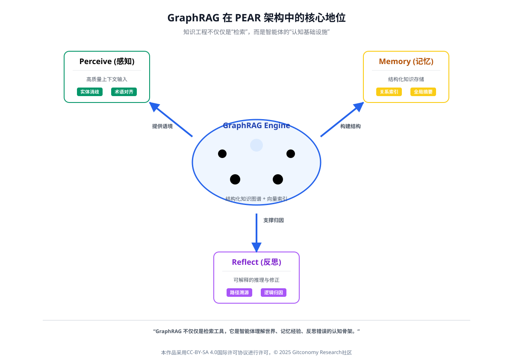
*图：GraphRAG在PEAR 架构中的核心地位*
### 5.3.3 GraphRAG对Reflect的支撑：从结果评价到结构反思

在智能体系统中，Reflect的目标并不是对文本进行主观评价，而是对系统行为进行调节与修正。  这一点在经典认知架构研究中早已有所体现：长期记忆并非静态存储，而是在行动反馈中不断被重组（Laird et al., 2017）[23]。

GraphRAG为Reflect提供了三个关键支点：

1. **可解释的推理路径**：智能体可以明确记录“结论是通过哪些实体与关系得到的”，使反思具备可追溯性。
2. **结构化经验写回** ：修正不再只是追加文本，而是直接调整图结构中的节点与关系。
3. **社区级反思能力** ：智能体可以评估某一知识领域是否存在系统性缺失，而非只关注单次回答。

 
这一过程与 Schön（1983）[24]提出的“反思性实践（Reflective Practice）”高度一致：  反思的核心不在于评价结果，而在于重构行动背后的认知结构。 近年来的Agent研究也表明，引入显式记忆与反思机制可以显著提升系统的长期稳定性（Packer et al., 2023）[25]。

### 5.3.4 知识工程的标准化：为可信智能体奠定基础

当知识工程成为智能体系统的核心基础设施时，标准化问题不可回避。  国际标准组织已开始针对 AI 知识工程与知识图谱提出系统性规范。

- **ISO/IEC 5392** [26]提供了知识工程的参考架构，明确了知识资产的生命周期、角色分工与可追溯性要求，为智能体 Memory 的治理提供了工程边界。
- **IEEE 2807**[27] 则聚焦于知识图谱，系统定义了图结构建模、推理能力与评估指标，使GraphRAG具备可比较、可审计的工程基础。
- 与此同时，NIST的AI风险管理框架也强调，知识结构的透明性与可解释性是可信 AI 的关键组成部分（NIST, 2023）[28]。

 
这些标准的引入，标志着知识工程正在从“实验性技术”转向**系统级基础设施**。

### 5.3.5 小结：新一代知识工程在PEAR中的位置

综合本章讨论，可以清晰地看到新一代知识工程在PEAR模型中的结构定位：

| PEAR 环节      | 知识工程支撑                  |
| ------------ | ----------------------- |
| **Perceive** | 语义分块降低认知噪声，提升感知质量       |
| **Memory**   | GraphRAG 构建结构化、可推理的长期记忆 |
| **Reflect**  | 图结构支持可解释反思与经验沉淀         |

*表：PEAR 四阶段中的关键知识工程技术*

这表明，知识工程并非智能体系统的外围组件，而是其**认知能力的基础设施**。  
只有当知识以合适的结构、粒度与标准被组织起来，智能体的评估、行动与反思才具备可靠性。

### ### 5.3.5 小结：知识形态决定智能体上限

到这里可以更明确地说：**智能体的推理质量，取决于它“能看见什么样的知识”**。语义分块解决的是“可检索的最小语义单元”，知识图谱解决的是“关系与可推理结构”，GraphRAG 则把两者合成一个更适合行动系统的底座——既能召回，也能沿关系走、沿依赖链找。换句话说，你不是在给模型“喂更多文本”，而是在给系统“搭一张可走的路网”，让后续的行动链与工具调用有可靠的导航。

---

## 5.4 智能体设计方法：从提示链到行动链

在生成式 AI 的早期实践中，复杂任务往往通过提示链（Prompt Chain）来完成：  系统先生成分析，再生成计划，最后生成结果。  这种方式在逻辑推理与文本生成任务中卓有成效，但当系统被要求真正介入现实工作流时，其局限迅速显现。

根本原因在于：  提示链本质上仍是“文本生成的组织方式”，而非“系统行动的组织方式”。

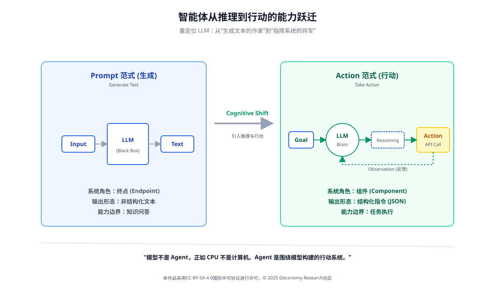
*图：智能体设计范式比较*

智能体设计的关键跃迁，正是将系统的核心输出，从“自然语言解释”转变为可执行、可验证、可回滚的行动（Action）。  这一跃迁，标志着系统从“思考型生成器”进入“行动型系统”。

### 5.4.1 提示链的系统角色：Evaluate的外显化，而非行动机制

从PEAR模型视角看，提示链的真实作用，并不是“让模型更聪明”，而是将 Evaluate 阶段的内部推理显式展开。  
例如：

- 问题分析
- 子任务拆解
- 方案比较

 
这些步骤本质上都是**决策前的评估活动**。

提示链的价值在于：它让系统“看起来像是在思考”，并在一定程度上降低了推理错误率但它并未解决一个更关键的问题：系统如何基于这些评估结果，触发真实、可控的行动？

因此，提示链是行动链的前置条件，而不是替代品。

### 5.4.2 行动链（Action Chain）：以Act为中心重构系统输出

行动链的核心思想是：将系统输出的“终点”，从文本结果，前移为“行动决策”。

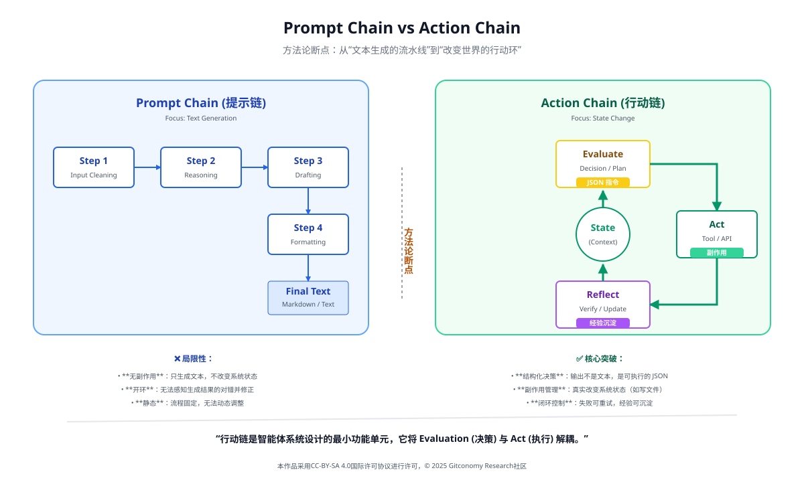
*图：提示链和行动链的比较——从“文本生成的流水线”到“改变世界的行动环”*

在行动链中，Evaluate 阶段的产出不再是一段解释性文字，而是一个结构化行动决策，例如：

- 行动类型（创建、修改、查询、调用）
- 目标对象（知识节点、工具、流程）
- 风险级别（是否需要人工确认）

 
只有在这一决策通过后，系统才进入 Act 阶段，执行真实操作。

这一设计遵循了软件工程中的基本原则：  决策逻辑与副作用执行必须解耦（Bass et al., 2012）[15]。

### 5.4.3 设计模式的本质：行动链的稳定结构形态

在工程实践中，并不存在“唯一正确的行动链”。  不同复杂度、不同风险等级的任务，会自然演化出若干稳定、可复用的行动链结构。 Andrew Ng等人在其关于智能体系统的课程与工程实践总结中，将当前主流的智能体工作流归纳为若干具有代表性的设计模式，包括反思、工具使用、规划以及多智能体协作（Ng, 2023）[29]。换言之设计模式不是替代行动链，而是行动链在特定约束下的成熟形态。

#### 5.4.3.1 反思模式：在行动前插入 Reflect，降低系统性风险

反思（Reflection）模式，是对最简单行动链的第一次结构增强。在该模式中，系统并不在 Evaluate 后立即进入 Act，而是**显式插入 Reflect 阶段**。

从行动链角度看，其结构变为：Evaluate → Reflect →（再次 Evaluate）→ Act

这意味着行动不再基于“第一次判断”，而是基于被审视后的判断。在知识密集型任务中，这种模式尤为重要。  

借助语义分块与 GraphRAG，Reflect 阶段可以检查：

- 推理是否跨越了不相关的语义社区
- 结论是否与已有高置信知识冲突

 
研究表明，引入反思机制可以显著降低复杂任务中的累积错误率（Shinn et al., 2023）[30]。

#### 5.4.3.2 工具使用模式：让行动链真正进入现实系统

如果说反思模式解决的是“行动是否可靠”，那么**工具使用（Tool Use）模式**解决的则是：系统是否真的具备行动能力。在该模式下，行动链首次与外部系统产生直接耦合：Evaluate（选择工具）→ Act（调用工具）→ Perceive（获取结果）

关键转变在于Act 阶段不再生成“应该调用工具”的描述，而是生成符合工具接口规范的结构化参数。

在这一过程中，知识底座发挥了双重作用：

- **GraphRAG**：为工具选择提供语义与关系依据
- **Memory**：记录“任务—工具—结果”的有效组合

 
这种设计，使语言模型从“执行者”退居为决策与编排核心。

#### 5.4.3.3规划模式：让行动链具备时间维度

当任务目标无法通过一次行动完成时，行动链必须扩展为**跨时间的序列结构**。  
这正是规划（Planning）模式的核心价值。

在该模式中，Evaluate 阶段不仅决定“做不做”，还负责生成一个可被反复评估的行动序列（Plan）： Evaluate（生成计划）→ Act（执行一步）→ Perceive（反馈）→ Evaluate（是否重规划）

规划模式的关键能力，并不在于“计划是否完美”，而在于系统是否允许失败并自动修正。  GraphRAG 在此提供了重要支撑：  它使系统能够在结构化知识空间中重新计算依赖关系，而非盲目重试。

#### 5.4.3.4 多智能体模式：行动链的系统级扩展

当单一行动链的复杂度持续上升时，系统面临的已不再是“如何设计一条链”，而是如何控制整体复杂性。 多智能体协作模式，正是对这一问题的系统级回应。

在该模式中，行动链被拆分并分配给不同角色的智能体：

- 某些 Agent 主要承担Evaluate
- 某些 Agent 专注Act
- 某些 Agent 专职Reflect

 
它们通过编排层协调，形成一个分布式行动系统。 这一设计遵循了经典的软件工程原则——关注点分离（Separation of Concerns），在复杂任务中显著降低系统性错误率（Wooldridge, 2009）[31]。

### ### 5.4.5 小结：设计模式是“可运行的行动链模板”

当行动链成为系统的一等结构后，“反思 / 工具使用 / 规划 / 多智能体”就不再是零散技巧，而更像一套已经被反复验证过的**运行模板**：告诉你在什么位置插入质量门控、在什么位置接入外部能力、在什么位置允许重规划、在什么位置用角色分工对抗复杂性。它们真正解决的不是“生成得更漂亮”，而是“系统跑得更稳”。

---

## 5.5 系统架构实战：构建本地 Obsidian + GraphRAG + 行动链的智能知识助手

### 5.5.1 目标与边界：我们要构建的“系统”是什么

我们构建的不是“一个能聊天的 Obsidian 插件”，而是一个能够在你的知识库中**持续完成目标导向任务**的行动系统：它能理解你当前的知识状态（Perceive），基于结构化记忆做决策（Evaluate），调用受控工具执行改动（Act），并把经验写回知识底座（Reflect）。这种闭环结构，决定了系统的上限更多来自**系统结构**而非单次生成质量。

**系统边界**建议明确三条：

1. 只处理你 vault 内的知识资产（Markdown/附件/元数据）。
2. 只执行“可审计、可回滚”的行动（文件变更必须可追踪）。
3. 默认“本地推理 + 本地检索”，必要时才切换外部服务（与下一章衔接）。

 
### 5.5.2 总体分层架构：把PEAR固化为可实现的模块边界

|层级|关键模块|对应 PEAR|说明|
|---|---|---|---|
|交互层|Obsidian 面板/命令/模板|Perceive（输入）|收集用户意图、选区、上下文|
|编排层|Agent Orchestrator（状态机/路由）|Evaluate（决策）|生成行动决策、选择工具与模式|
|行动层|Tool Runtime（受控工具）|Act（执行）|文件读写、标签整理、索引刷新等|
|记忆层|Vector Store + KG Store + Metadata|Memory|向量记忆 + 图谱记忆 + 可治理元数据|
|反思层|日志/评估器/经验库|Reflect|质量评估、错误归因、策略更新|
|治理与安全|权限、审计、风险阈值|横跨|人在回路、可追溯、可解释（NIST, 2023）|

*表：本地智能知识助手的分层架构（PEAR 对齐版）*

这个分层最重要的收益是：把副作用集中在 Act，把决策集中在 Evaluate，从而让系统具备工程意义上的可控性与可维护性。

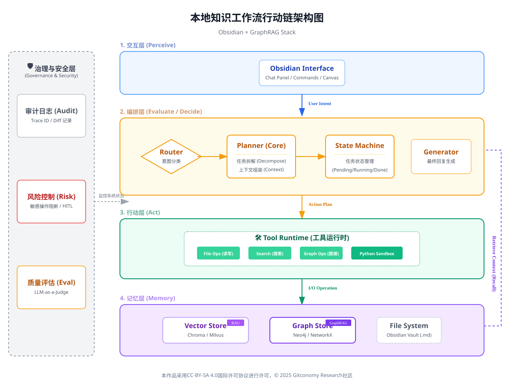
*图：Obsidian + GraphRAG 的本地知识工作流体行动链架构图*
### 5.5.3 知识底座：VectorRAG + GraphRAG 的“双记忆”设计

单一向量检索擅长“局部语义匹配”，但在多跳推理、跨文档关联、全局结构理解方面存在结构性短板。因此本地助手建议采用“双记忆”：

- **Vector Memory（向量记忆）**：快速召回相关片段，用于局部证据拼接。
- **Graph Memory（图谱记忆）**：表达实体—关系网络，支持路径推理、社区摘要与全局结构视图）。

 
#### 5.5.3.1 Chunking 是 Memory 的入口：先分块，再索引

分块不是“切文本”的小技巧，而是降低认知负荷、提升可检索性与可理解性的基础工程。

|文档类型|推荐策略|原因|
|---|---|---|
|课程讲义/长文|文档结构分块 + 语义分块|保留标题层级 + 确保语义内聚|
|会议纪要/日志|语义分块（按主题漂移）|便于按事件与决策召回|
|API/规范文档|严格结构分块|引用与溯源更可靠|
|知识卡片/短笔记|不分块或轻量分块|避免过度切碎语义|
*表：Vault 文档的推荐分块策略*
#### 5.5.3.2 GraphRAG 的“最小可行图谱”

不建议一开始就追求“全量知识图谱”。更可行的是在本地先构建 **MVG（Minimum Viable Graph）**：

- 节点：Note、Concept、Person、Project、Source
- 边：mentions、depends_on、supports、contradicts、extends、same_as
- 社区：按项目/主题聚类，生成“社区摘要”（GraphRAG 常见做法）

 
这能立刻提升：跨文档关联、观点冲突发现、知识空洞识别等能力
### 5.5.4 行动链：把“输出文本”改造成“执行决策”

本节的核心：把 5.4 的方法论固化为一个可运行的行动链框架。
#### 5.5.4.1 行动决策的数据结构

Evaluate 阶段输出必须是结构化的（JSON / YAML / Typed object），否则 Act 无法可靠执行，也无法审计。

|字段|含义|例子|
|---|---|---|
|`action_type`|行动类型|`CREATE_NOTE`, `LINK_NOTES`, `RETAG`, `SUMMARIZE_COMMUNITY`|
|`targets`|目标对象|文件路径、节点 ID、tag 列表|
|`inputs`|输入证据|RAG 片段引用、Graph 路径、用户选区|
|`risk_level`|风险级别|`LOW/MEDIUM/HIGH`|
|`dry_run`|是否试运行|true/false|
|`rollback_plan`|回滚方案|patch、备份、git commit id|
|`success_criteria`|成功判据|“新增 3 条双向链接且无重复”|

*表：行动决策（Action Plan）最小字段集*

这一步就是“从提示链到行动链”的硬分界：LLM 不再直接给最终答案，而是给可执行决策。

#### 5.5.4.2 行动目录：把工具能力限定在可控集合中

把工具做成“白名单动作”，是安全与可维护性的关键。

| 类别  | 动作                                            | 说明            |
| --- | --------------------------------------------- | ------------- |
| 组织类 | `RETAG`, `MOVE_NOTE`, `RENAME_NOTE`           | 结构整理与命名规范化    |
| 连接类 | `LINK_NOTES`, `CREATE_MOC`                    | 建立双向链接与索引页    |
| 生成类 | `DRAFT_NOTE`, `SUMMARIZE_SECTION`             | 仅生成草稿，默认不覆盖原文 |
| 图谱类 | `EXTRACT_ENTITIES`, `ADD_EDGE`, `MERGE_NODES` | 图谱增量更新        |
| 评估类 | `CHECK_CONTRADICTIONS`, `QUALITY_SCORE`       | 反思与质量评估       |
| 安全类 | `REQUEST_APPROVAL`, `DRY_RUN`                 | 人在回路与试运行      |

*表：本地 Obsidian 助手的行动目录*

### 5.5.5 Reflect：从“自评文本”到“系统级经验沉淀”

在智能体系统里，Reflect 不应该只是“这段话写得如何”。更重要的是把失败变成经验：

- 是检索失败？（Chunk/索引问题）
- 是决策失败？（Evaluate 的规则/阈值问题）
- 是执行失败？（Act 工具的副作用/权限问题）

 

|字段|用途|
|---|---|
|`trace_id`|贯穿一次工作流的唯一标识|
|`retrieval_evidence`|使用了哪些 chunk / 图路径|
|`decision_rationale`|为什么选择该 action（可简化记录）|
|`execution_diff`|文件变更 diff / 图变更记录|
|`outcome`|成功/失败/部分成功|
|`error_class`|检索/决策/执行/权限/用户取消|
|`policy_update`|是否需要更新规则、阈值、模板|

*表：反思日志的推荐字段（本地可审计）*

这与“反思性实践”的思想一致：反思的目标是重构行动背后的结构，而不是停留在结果评价。在可扩展记忆管理方面，可参考 MemGPT 对“长期记忆管理”的系统化主张。

### 5.5.7 治理与标准：把“可信”变成默认属性

当系统能够自动改写你的知识库时，治理不是外挂，而是底座能力（NIST, 2023）[28]。建议至少实现三层控制：

1. **风险分级**：LOW自动执行；MEDIUM需确认；HIGH强制dry-run + 二次确认
2. **可追溯**：所有行动都有 trace、diff、证据引用
3. **可评估**：知识资产构建与图谱质量有指标与流程参考

 
标准层面可以把 **ISO/IEC 5392** 作为知识工程活动与角色分工的“参考架构”，把 **IEEE 2807** 作为知识图谱的概念模型与评估框架依据（ISO/IEC, 2023；IEEE, 2022）。

### 5.5.8 小结：一条可落地的“本地智能知识助手”路径

到这里，你的系统已经具备“智能体”最低必要条件：

- 通过 Chunking 与双记忆（Vector + Graph）建立可用的 Memory
- 通过行动链把 Evaluate 与 Act 分离，实现可控执行    
- 通过四种模式把行动链扩展为可迭代、可工具化、可规划、可协作的工
- 通过反思日志与治理框架保证可审计、可回滚、可演进（

 
下一节（5.6）我们就可以把这一架构进一步落细到“本地 RAG 检索引擎 + 图谱构建流水线”，进入可执行的工程步骤与实验手册对齐。

---

## 5.6 核心技术深度解析：语义切分与向量化策略

如果说前几节已经完成了“智能体系统为什么要这样设计”的问题，那么本节回答的是一个更具工程现实意义的问题：在一个真实运行的 RAG + Agent 系统中，哪些底层技术决策真正决定了系统效果的上限？

在几乎所有失败的 RAG 系统案例中，问题并不出现在模型调用、Agent 编排或 Prompt 设计上，而是集中暴露在两个看似“基础”的环节上：

1. **语义切分（Chunking）是否合理**
2. **向量化（Embedding）是否服务于任务目标**

 
这两个环节共同决定了 **Memory 的“可检索性”与“可理解性”**，进而直接影响 Evaluate 阶段的决策质量（Lewis et al., 2020；Guu et al., 2020）。
### 5.6.1 语义切分不是预处理，而是认知建模

在许多入门教程中，分块（Chunking）被描述为一种“为了适配上下文长度的预处理技巧”。 这种理解是严重低估了分块的系统性意义。从认知科学与知识工程视角看，分块本质上是一个认知建模问题：你如何假设“知识以什么粒度被理解、被记忆、被调用”？

经典的认知负荷理论指出，人类在工作记忆中能同时处理的信息单元数量是有限的。  这一限制并不会因为使用 LLM 而消失，相反，它会通过检索噪声的形式体现在系统中：

- Chunk 过大 → 向量相似度被多个主题稀释
- Chunk 过小 → 检索结果碎片化，Evaluate 难以重组语义

 
因此，“一个 Chunk 是否合适”并不取决于 Token 数，而取决于它是否表达了一个“可被独立判断的语义单元”。

### 5.6.2 主流分块策略的工程对比

在实际工程中，分块策略并不存在“最优解”，而是取决于文档类型、任务目标与后续推理方式。

|分块策略|技术原理|优势|主要风险|适用场景|
|---|---|---|---|---|
|固定大小分块|按字符/Token 切割|实现简单、稳定|语义断裂严重|简单语义搜索|
|重叠分块|固定大小 + overlap|缓解断裂问题|索引冗余、噪声|通用 RAG|
|结构化分块|利用标题/段落|保留作者逻辑|依赖文档规范|教程、规范|
|语义分块|基于嵌入相似度|语义内聚|成本高、复杂|深度问答|
|事件/概念分块|按“观点/决策”|高可解释性|自动化难|研究笔记|

*表：主流分块策略的技术对比*

在 Obsidian 场景下，**强烈推荐“结构化分块 + 语义微调”的混合策略**：

- 先用 Markdown 标题确定**逻辑边界**
- 再在段落级别进行**语义连贯性检测**

 
这种方式在检索准确性与工程成本之间取得了良好平衡。

### 5.6.3 分块与GraphRAG 的耦合关系

一个常见误区是：“GraphRAG 是在分块之后、检索之前的独立步骤。实际上，分块方式直接决定了图谱的结构质量。

- Chunk 是 GraphRAG 的**候选节点来源**
- 分块过细 → 图谱节点爆炸，关系稀释
- 分块过粗 → 图谱节点臃肿，推理路径模糊

 
因此，在 GraphRAG 场景中，一个 Chunk 应尽量满足：

1. **可以被视为一个“概念/观点节点”**
2. **其内部关系密度高于外部关系**

 
这与知识图谱中“良好节点应具备语义内聚性”的原则是一致的。

### 5.6.4 向量化的本质：不是“压缩文本”，而是“对齐任务空间”

向量化（Embedding）经常被误解为“把文本压缩成向量”。  更准确的说法是：Embedding 是把文本映射到一个“相似性空间”，而这个空间是否有用，取决于它是否对齐你的任务目标。

通用向量 ≠ 任务向量

大多数通用嵌入模型优化的目标是“语义相似度”。 但在智能体系统中，我们真正关心的往往是：

- 是否支持**推理链拼接**
- 是否支持**因果/依赖关系检索**
- 是否支持**决策证据回溯**

 
这也是为什么许多系统在“看起来能搜到相关内容”，却在复杂任务中频繁失败（Karpukhin et al., 2020）[32]。

### 5.6.5 向量化策略的工程选择

在本地智能知识助手中，向量化策略至少需要在以下维度做出显式选择：

|决策维度|可选方案|影响|
|---|---|---|
|向量模型|通用 / 领域微调|决定相似性空间|
|索引粒度|Chunk / 概念 / 关系|决定检索召回结构|
|相似度度量|Cosine / Dot|影响排序稳定性|
|Top-k|小 / 大|影响噪声与覆盖|
|过滤条件|tag / source / time|提升可控性|

*表：向量化策略的关键决策点*

在 Obsidian 场景下，强烈建议结合元数据过滤（tags、type、source）进行“预筛选 + 向量排序”，以减轻 Evaluate 阶段的负担。

### 5.6.6 检索失败的系统性诊断方法

一个成熟的系统，必须能够回答：“这次失败，是分块问题、向量问题，还是决策问题？”

可以通过以下顺序进行诊断：

1. **证据缺失**：是否根本没有检索到关键 Chunk？  
    → 分块或索引问题
2. **证据噪声**：检索结果相关但无用？  
    → 向量空间或 Top-k 设置问题
3. **证据误用**：证据正确但结论错误？  
    → Evaluate/Reflect 问题

 
将这些诊断结果写入 Reflect 日志，是系统持续演进的关键。
### 5.6.7 本节小结：Chunking与Embedding 决定“能不能想对”

通过本节可以看到：

- **语义切分决定了知识能否被“正确召回”**
- **向量化策略决定了知识能否被“正确比较”**
- 二者共同决定了 Evaluate 阶段的上限，而非 Prompt 技巧

 
在智能体系统中，最昂贵的错误往往不是“模型没想明白”，而是“系统根本没把该看的证据送到它面前”。

---

## 5.7 进阶架构：从被动RAG到主动Agentic Workflow

在前面的章节中，我们已经构建了一个具备以下能力的系统：

- 能够通过 RAG 从本地知识库中检索相关信息
- 能够基于 Evaluate → Act 的行动链执行受控操作
- 能够通过 Reflection 与工具使用持续改进结果

 
然而，这个系统仍然存在一个根本性的限制：它仍然是“被动的”。也就是说，系统的运行完全依赖于外部触发（用户提问）。  一旦用户不发起请求，系统便进入“休眠状态”，无法主动维护、整理或演进知识结构。

真正意义上的智能体工作流，必须完成最后一次跃迁：从“回答问题的系统”，转变为“持续推进目标的系统”。
### 5.7.1 被动RAG的运行范式与结构性天花板

传统RAG的运行范式可以概括为：Query → Retrieve → Generate

在这一范式中：

- 检索是即时的、一次性的
- 生成是终点，而非中间态
- 系统没有“未完成任务”的概念

 
这使得 RAG 非常适合**即时问答**，但在以下场景中表现乏力：

- 知识库长期演进（冗余、冲突、碎片化）
- 跨时间的复杂目标（如“整理一个研究方向”）
- 需要反复检查与修正的任务（如“持续维护一份文档体系”）

 
从控制论角度看，被动 RAG 是一个无内部驱动力的开环系统。

### **5.7.2 Agentic Workflow：引入“目标—状态—事件”**

Agentic Workflow的核心变化，并不在于模型或检索算法，而在于系统状态观的改变。

一个 Agentic 系统至少需要显式建模三类对象：

1. **目标（Goals）**：系统正在推进的长期或中期目标
2. **状态（State）**：知识库与任务当前所处的结构状态
3. **事件（Events）**：触发评估与行动的条件

 
从而使系统运行模式变为：State → Evaluate → Act → State（循环）。用户输入，只是众多事件源之一。

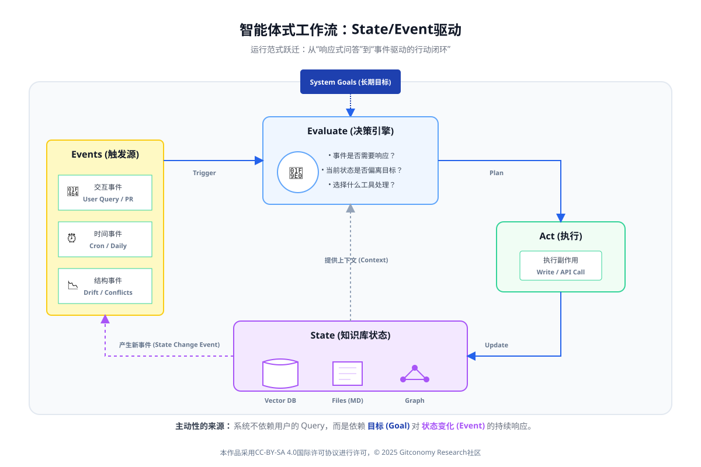
*图：智能体式工作流——从“响应式问答”到“事件驱动的行动闭环*

### 5.7.3 状态建模：让系统“知道自己现在是什么样”

在 Obsidian + GraphRAG 场景中，状态并不是抽象变量，而是可被直接观测的知识结构：

- 知识图谱的节点数量、连接密度
- 某一主题社区的覆盖率与重复率
- 标注为 “TODO / DRAFT / REVIEW” 的笔记比例

 
这些状态信号，构成了智能体进行 Evaluate 的**客观依据**。

| 状态维度  | 示例指标            | 工程意义      |
| ----- | --------------- | --------- |
| 结构完整性 | 孤立节点比例          | 是否需要自动补链接 |
| 冗余程度  | 高相似 chunk 数     | 是否触发合并    |
| 冲突风险  | contradicts 边数量 | 是否需要人工审查  |
| 演进停滞  | 长期未更新主题         | 是否触发整理任务  |

*表 ：本地智能体可观测状态示例

状态建模的关键价值在于： 它让Evaluate不再完全依赖自然语言推理，而是部分转化为结构判断。

### 5.7.4 事件驱动：让系统“在合适的时候行动”

在Agentic Workflow中，行动不是连续发生的，而是被事件触发的。

常见事件类型包括：

- **结构事件**：新增大量笔记、图谱断裂
- **时间事件**：周期性检查（每日/每周）
- **交互事件**：用户编辑、批注、确认    
- **失败事件**：行动失败、质量不达标

 

这些事件并不直接触发Act，而是触发**Evaluate**：Event → Evaluate（是否需要行动）→ Act（若通过）

这正是“行动链”在系统层面的扩展。

### 5.7.5 从RAG Query到Agent Task：任务形态的转变

在被动RAG 中，系统处理的是**Query**；  在 Agentic Workflow 中，系统处理的是 **Task**。

二者的差异是本质性的：

|维度|RAG Query|Agent Task|
|---|---|---|
|生命周期|一次性|跨时间|
|是否有状态|否|是|
|是否可暂停|否|是|
|是否可重规划|否|是|
|是否可审计|有限|完整|

*表：Query与Agent Task的系统差异*

这也是为什么 Agentic Workflow 必须引入：

- 任务队列
- 任务状态机（pending / running / blocked / done）
- 失败重试与回滚策略

 
### 5.7.6 设计模式在 Agentic Workflow 中的“系统级位置

在这一进阶架构中，前面讨论的四种设计模式不再是“可选技巧”，而是**嵌入在系统运行中的机制**。

|设计模式|在工作流中的作用|
|---|---|
|Reflection|任务完成后的质量门控|
|Tool Use|行动执行层的能力扩展|
|Planning|长任务的阶段拆解与重规划|
|Multi-Agent|高复杂度任务的并行与分工|
*表：设计模式在 Agentic Workflow 中的角色*

它们共同保证：  系统不是一次性“做完”，而是“持续把事情做对”。

### 5.7.7 主动性从何而来：目标驱动而非模型冲动

一个常见误区是把“主动智能体”理解为“模型自己想做事”。  这种理解在工程上是危险的。正确的主动性来源是：目标函数 + 状态变化 + 明确触发规则**

例如：

- 目标：降低知识库冗余度
- 状态：相似度 > 阈值的 chunk 数持续上升
- 触发：每日评估
- 行动：生成合并建议（dry-run）

 
模型并没有“冲动”，它只是**执行被明确授权的行动链**。

### 5.7.8 本节小结：Agentic Workflow是“运行范式”的升级

到这里，你已经能直观看到这次跃迁的本质：从 Query 驱动走向 State/Event 驱动，从“生成即终点”走向“行动改变状态”，从单轮智能走向可持续闭环。所谓 Agentic Workflow，并不是又一个新工具名词，而是一种更接近真实知识工作的运行方式——把 RAG、行动链、设计模式与知识工程整合进同一套系统里，让它可以长期运转、逐步纠错、不断积累。Agentic Workflow并不是一个新工具，而是一种运行范式。  它把RAG、行动链、设计模式与知识工程整合为一个可长期演进的系统。

---

## 5.8 学员学习思考指南

请围绕以下三个问题回看你在本章的学习与实践。第五章的重点并不是“搭一个更酷的智能体”，而是让你形成一种更稳定的能力：**把知识工程升级为可持续运行的本地化知识助手系统**。你的反思不需要写得很长，但需要尽量具体：描述你做出的结构选择、你遇到的失败类型，以及你如何让系统变得更稳。

### 问题 1：你的知识助手靠“记忆”还是靠“知识结构”？

**当你引入 GraphRAG / 知识图谱 / 原子化笔记之后，你的系统是否开始从“凭感觉回答”转向“沿结构推理与引用”？**

- **思考引导**：你能否举出一个例子：没有结构化时，检索结果容易碎片化、断链或跑题；引入结构化之后，助手能够沿着“实体—关系—证据”更稳定地给出答案？你的知识单元边界是否足够清晰（一个块能独立回答什么、不能回答什么）？你是否能解释：为什么“知识形态”会决定智能体上限？

### 问题 2：你的行动链是“会说步骤”还是“真能推进任务”？

**你设计的行动流程，是否已经具备 PEAR 闭环的关键特征：感知状态、评估偏差、采取行动、反思回写？**

- **思考引导**：当任务失败时，你的系统是“重复生成”还是“改变策略”？你是否明确写下了评估标准（例如：证据是否齐全、引用是否可追溯、结论是否与目标一致、输出是否满足格式契约）？你的行动是否被接口约束（建议—确认—执行）而不是一键自动化？在什么节点你会引入人在回路，为什么？

### 问题 3：你的本地化助手是“一次跑通”还是“能长期运行”？

**如果让这个助手连续使用一周，你最担心它在哪些地方退化？你准备如何用系统机制提前防守？**

- **思考引导**：你是否为系统保留了可追溯的日志与版本（知识库、提示模板、行动链）？当知识库更新、索引重建或工具变化时，你的助手还能否稳定复现行为？你是否已经开始像维护一个产品一样维护它：有清晰的输入契约、质量门槛、回滚路径与迭代计划？如果要把它交给同学继续维护，他最容易卡在哪一步，你会如何改造系统让交接更顺畅？

---
## 5.9 课程总结

第五章系统性地完成了从“生成式知识处理”向“可自主执行的智能体系统”的关键跃迁：通过引入结构化知识工程（语义分块、向量检索与 GraphRAG）、以 **Evaluate → Act** 为核心的行动链设计，以及从被动 RAG 到 **Agentic Workflow** 的运行范式升级，本章明确了智能体能力的上限并不取决于模型规模或提示技巧，而取决于系统结构与知识底座的质量；借助 Obsidian 的本地实践，本章验证了智能体可以在“人在回路、可审计、可演进”的条件下真实落地，为后续扩展到远程与多智能体系统奠定了坚实基础。

---

## 5.10 附录1：核心概念术语表 (Glossary)

|**English Term**|**中文术语**|**定义与解析**|
|---|---|---|
|**Knowledge Assistant Agent**|**知识助手智能体**|基于 RAG 架构的初级智能体形态。它不仅能检索信息，还能根据用户意图主动规划检索策略，并对获取的知识进行二次加工与任务推演。|
|**Semantic Routing**|**语义路由**|一种基于语义理解的请求分发技术。系统预先判断用户问题的意向（如：技术咨询、合同对比、闲聊），并将其引导至不同的处理逻辑或知识分片中。|
|**Recursive Retrieval**|**递归检索**|在处理复杂问题时，将长文档拆分为“摘要层”和“细节层”。先检索摘要定位范围，再深入细节层提取精准答案，解决长文本信息丢失问题。|
|**Multi-Query Transformation**|**多查询转换**|将用户的一个模糊问题拆解或重写为多个不同侧重点的搜索指令。通过从多个角度检索知识库，提升复杂任务的查全率与准确度。|
|**Rerank (Re-ranking)**|**重排序**|检索过程中的二次精校环节。利用计算开销更大但精度更高的模型，对初次检索出的候选知识片段进行相关性打分并重新排序。|
|**Self-Correction**|**自我修正**|指智能体在生成回答前，先评估所检出知识的相关性。若发现知识不足以回答问题，则自动触发“重新检索”或“扩大搜索范围”的逻辑。|
|**Agentic RAG**|**智能体化 RAG**|RAG 的演进形态。将传统的“检索-生成”线性流程改造为包含“规划-执行-核查”的循环流程，赋予知识库主动处理复杂、多步骤问题的能力。|
|**Contextual Compression**|**上下文压缩**|在将检索到的知识喂给模型前，自动剔除冗余噪声，仅保留与当前问题最相关的核心片段，以节省 Token 并减少无关信息的干扰。|
|**Knowledge Graph RAG**|**知识图谱 RAG**|一种高级检索方式，通过提取文档中的实体及关系构建图谱。它擅长处理“A 的 B 的 C 是什么”这类涉及复杂逻辑关联的跨文档查询。|
|**Structured Output**|**结构化输出**|智能体根据预设的 Schema（如 JSON 或 Markdown 表格）返回答案。这确保了知识助手产生的结论可以被后续的自动化程序直接读取和利用。|

---
## 5.11 附录2：参考文献

[1] Russell, S. J., & Norvig, P. (2021). _Artificial intelligence: A modern approach_ (4th ed.). Pearson.  
[2] Hutchins, E. (1995). _Cognition in the wild_. MIT Press.  
[3] Brown, T. B., Mann, B., Ryder, N., Subbiah, M., Kaplan, J., Dhariwal, P., … Amodei, D. (2020). _Language models are few-shot learners_. _Advances in Neural Information Processing Systems, 33_, 1877–1901. [arXiv:2005.14165](https://arxiv.org/abs/2005.14165) [| 
[4] Wei, J., Wang, X., Schuurmans, D., Bosma, M., Chi, E., Le, Q., & Zhou, D. (2022). _Chain-of-thought prompting elicits reasoning in large language models_. arXiv preprint. [arXiv:2201.11903](https://arxiv.org/abs/2201.11903) 
[5] Ashby, W. R. (1956). _An introduction to cybernetics_. Chapman & Hall.  
[6]  Russell, S. J., & Norvig, P. (2021). _Artificial intelligence: A modern approach_ (4th ed.). Pearson.  
[7] Franklin, S., Graesser, A. (1997). Is It an agent, or just a program?: A taxonomy for autonomous agents. In: Müller, J.P., Wooldridge, M.J., Jennings, N.R. (eds) Intelligent Agents III Agent Theories, Architectures, and Languages. ATAL 1996. Lecture Notes in Computer Science, vol 1193. Springer, Berlin, Heidelberg. https://doi.org/10.1007/BFb0013570 

[5] Yao, S., Zhao, J., Yu, D., Du, N., Shafran, I., Narasimhan, K., & Cao, Y. (2022). _ReAct: Synergizing reasoning and acting in language models_. arXiv preprint.  arXiv:2210.03629](https://arxiv.org/abs/2210.03629) 
[8] Bass, L., Clements, P., & Kazman, R. (2012). _Software architecture in practice_ (3rd ed.). Addison-Wesley.  
[9] Wiener, N. (1948). _Cybernetics: Or control and communicat
ion in the animal and the machine_. MIT Press.  
[10] Shinn, N., Cassano, F., Labash, B., Gopinath, A., Narasimhan, K., & Yao, S. (2023). _Reflexion: An autonomous agent with dynamic memory and self-reflection_.  arXiv:2303.11366. https://arxiv.org/abs/2303.11366  
[11]  Madaan, A., Tandon, N., Gupta, P., Hallinan, S., Gao, L., Wiegreffe, S., … Choi, Y. (2023). _Self-refine: Iterative refinement with self-generated feedback_. [arXiv:2303.17651](https://arxiv.org/abs/2303.17651) 
[12] Davenport, T. H., & Prusak, L. (1998). _Working knowledge_. Harvard Business School Press.  
[13] Hollan, J., Hutchins, E., & Kirsh, D. (2000). Distributed cognition. _ACM Transactions on Computer-Human Interaction, 7_(2), 174–196.  
[14] Park, J. S., O’Brien, J. C., Cai, C. J., Morris, M. R., Liang, P., & Bernstein, M. S. (2023). Generative agents: Interactive simulacra of human behavior.[arXiv:2304.03442](https://arxiv.org/abs/2304.03442) 
[15] Bass, L., Clements, P., & Kazman, R. (2012). _Software architecture in practice_ (3rd ed.). Addison-Wesley.  
[16] Miller, G. A. (1956). The magical number seven, plus or minus two. _Psychological Review, 63_(2), 81–97. [https://doi.org/10.1037/h0043158] 
[17] Sweller, J. (1988). Cognitive load during problem solving. _Cognitive Science, 12_(2), 257–285.   https://doi.org/10.1207/s15516709cog1202_4   
[20] Hearst, M. A. (2009). _Search user interfaces_. Cambridge University Press.  
[21] Nickel, M., Murphy, K., Tresp, V., & Gabrilovich, E. (2016). Relational machine learning for knowledge graphs. _Proceedings of the IEEE, 104_(1), 11–33.  [arXiv:1503.00759](https://arxiv.org/abs/1503.00759)  
[22] Hogan, A., et al. (2021). Knowledge graphs. _ACM Computing Surveys, 54_(4), 1–37.  [https://doi.org/10.1145/3447772](https://doi.org/10.1145/3447772)  
[23]  Laird, J. E., Lebiere, C., & Rosenbloom, P. S. (2017). A standard model of the mind# : Toward a Common Computational Framework Across Artificial Intelligence, Cognitive Science, Neuroscience, and Robotics.   
[https://doi.org/10.1609/aimag.v38i4.2744](https://doi.org/10.1609/aimag.v38i4.2744)  
[24]  Schön, D. A. (1983). _The reflective practitioner_. Basic Books.  
[25] Packer, C., et al. (2023). # MemGPT: Towards LLMs as Operating Systems. [arXiv:2310.08560](https://arxiv.org/abs/2310.08560)   
[26] ISO/IEC. (2024). _ISO/IEC 5392: Artificial intelligence — Knowledge engineering reference architecture_.  https://webstore.iec.ch/en/publication/93338  
[27] IEEE. (2022). _IEEE 2807: Standard for knowledge graph frameworks_.  
[28] NIST. (2023). _AI Risk Management Framework (AI RMF 1.0)_. https://nvlpubs.nist.gov/nistpubs/ai/nist.ai.100-1.pdf  
[29] Ng, A. (2023). Building systems with the ChatGPT API. DeepLearning.AI. https://www.deeplearning.ai  
[30] Shinn, N., Cassano, F., Labash, B., Gopinath, A., Narasimhan, K., & Yao, S. (2023). Reflexion: An autonomous agent with dynamic memory and self-reflection. [arXiv:2303.11366](https://arxiv.org/abs/2303.11366)  
[31]] Wooldridge, M. (2009). _An introduction to multiagent systems_ (2nd ed.). Wiley.  
[32] Karpukhin, V., et al. (2020). Dense passage retrieval for open-domain question answering. _EMNLP_.  [arXiv:2004.04906](https://arxiv.org/abs/2004.04906) 

---
## 许可声明

本文档采用 [知识共享署名--相同方式共享 4.0 国际许可协议 (CC BY--SA 4.0)](https://creativecommons.org/licenses/by-sa/4.0/deed.zh) 进行许可， &copy; 2025 Gitconomy Research社区。
