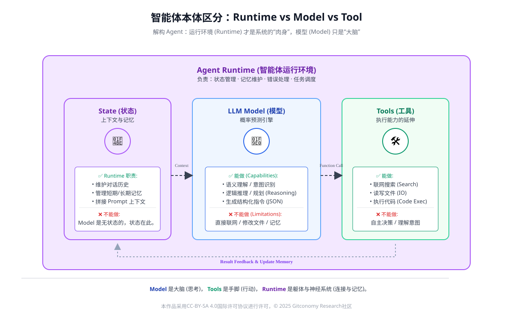
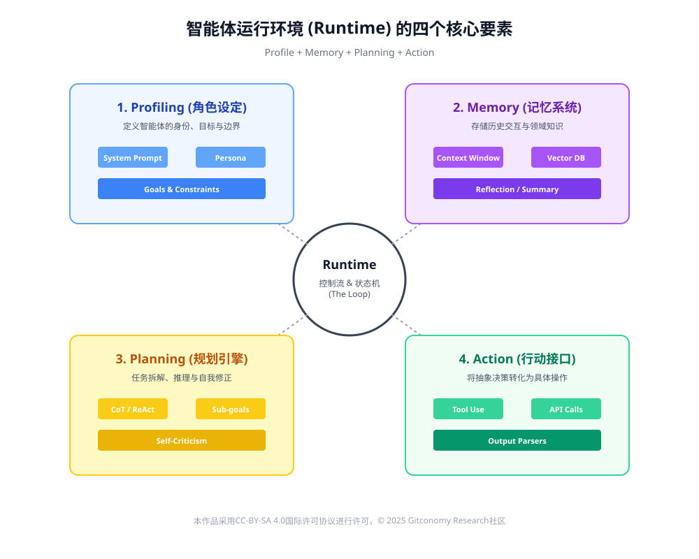
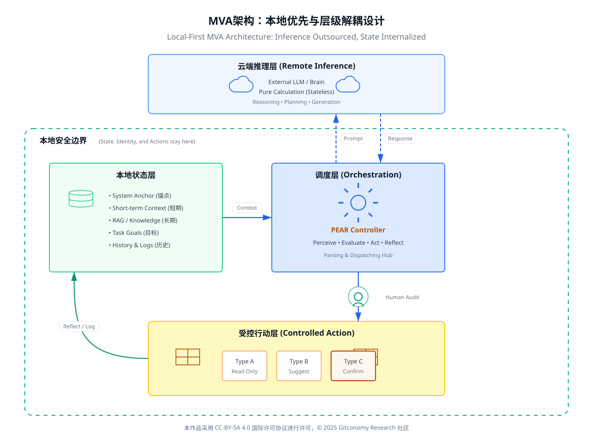
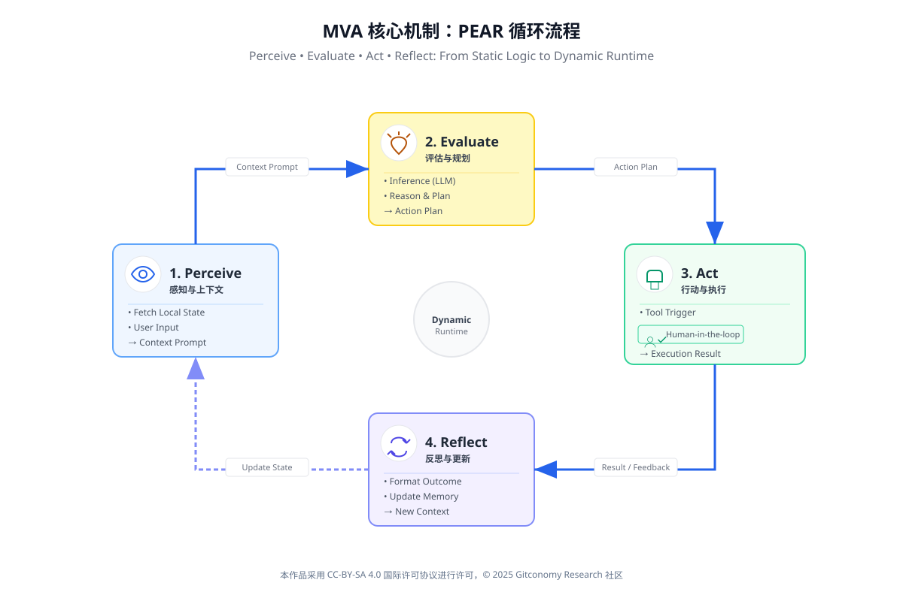
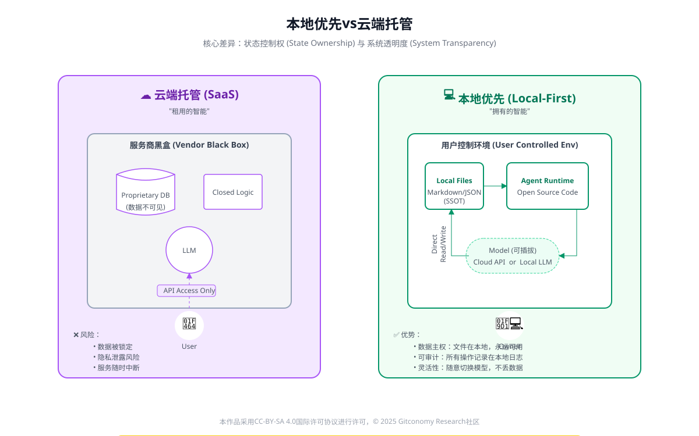
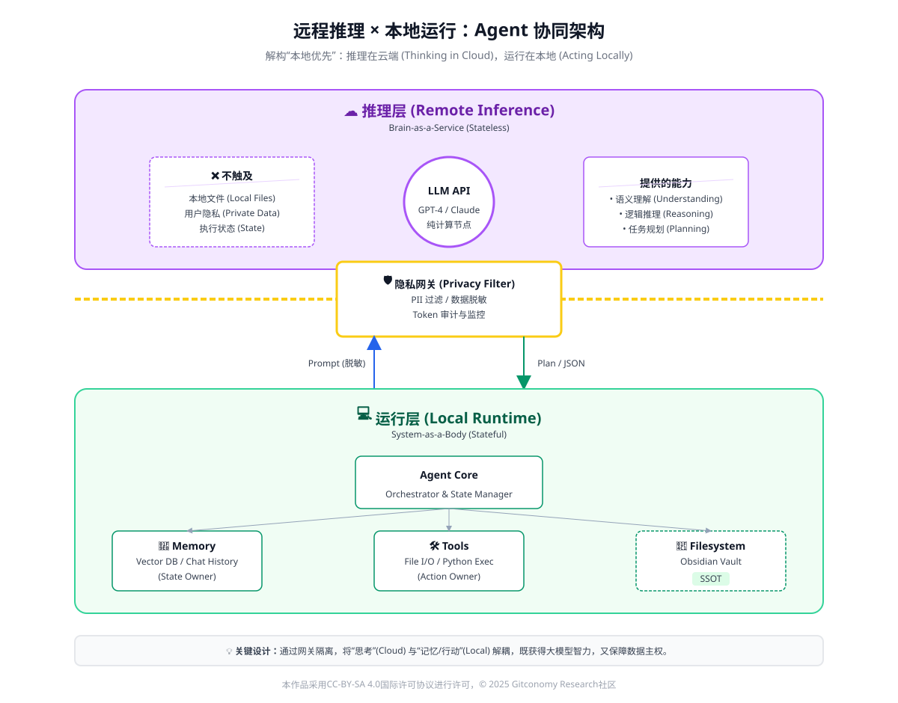
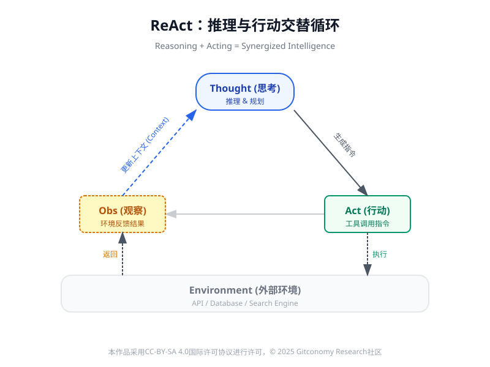
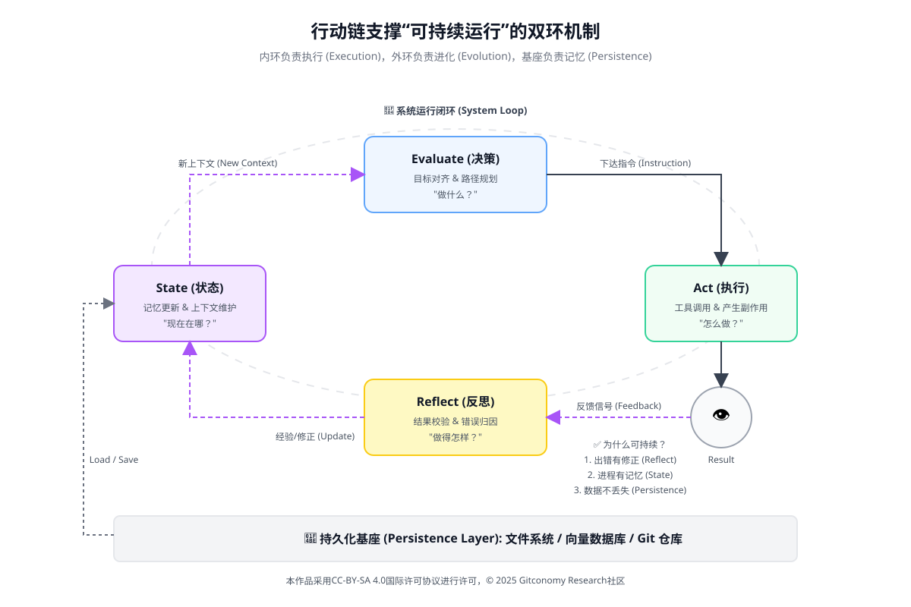
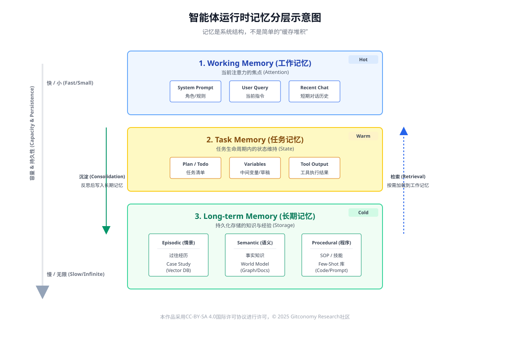
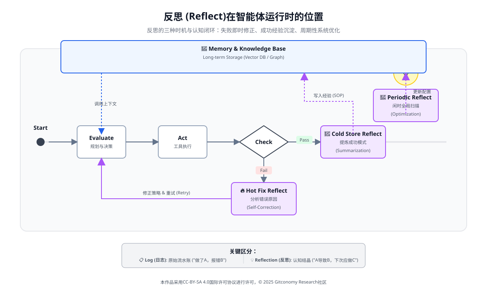

# 第六章 智能体运行环境：构建最小可行跨工具Agent

## 6.0 导论：从智能体工作流到运行环境

### 6.0.1 最小化可行 Agent (MVA) 的定义与价值

在第五章中，我们已经完成了一个关键跃迁：从“生成式系统”转向“具备持续行动能力的智能体工作流（Agentic Workflow）”。通过行动链、反思机制与结构化知识底座，智能体不再只是一次性生成答案的工具，而是能够围绕目标反复执行、评估与调整的系统。

然而，到此为止，我们仍然停留在设计层面。一个尚未回答的问题是这些智能体工作流究竟运行在哪里？

如果没有运行环境，智能体工作流只是一组逻辑规则或流程蓝图；只有当它被嵌入到真实的环境中——拥有状态、记忆、行动出口与反馈通道——智能体才真正“存在”。因此，第六章的核心任务，不是引入新的模型或技巧，而是回答一个系统性问题：如何在现实条件与工程约束下，让智能体真正跑起来。

为此，本章引入**最小可行 Agent（Minimum Viable Agent, MVA）** 的概念。

MVA 的核心思想与软件工程中的 MVP 类似：

> 📌 **不是构建能力最强的 Agent，而是构建一个能够稳定运行、可被理解、可被迭代的 Agent。**

在课程语境下，MVA 具有三重价值：

1. **教学价值**：降低门槛，使学习者能够完整理解 Agent 的运行全貌
2. **工程价值**：避免“为自动化而自动化”的技术陷阱
3. **认知价值**：帮助区分“智能体能力”与“系统复杂度”

### 6.0.2 运行环境的角色：让 智能体真正“落地”

在经典AI 理论中，智能体始终被定义为“感知环境、对环境采取行动的实体”。这一定义意味着：没有环境，就没有智能体。

运行环境并不是一个附属组件，而是智能体系统的承载体。它决定了：

- 智能体能“看到”什么（状态与记忆）
- 能“做”什么（行动接口）
- 能否被约束、审计与修正（人机回路（Human-in-the-loop））

 
本章将运行环境视为一个独立的系统层级，而非某个具体工具或平台。

### 6.0.3 本章教学目标

完成本章后，你将能够：

| 维度  | 能力描述                        |
| --- | --------------------------- |
| 认知层 | 理解智能体与 Prompt / RAG 的本体差异   |
| 结构层 | 掌握智能体的 PEAR 系统结构            |
| 工程层 | 构建面向 Agent 的本地 RAG 知识系统     |
| 方法层 | 设计从提示链到行动链的智能体逻辑            |
| 系统层 | 形成一个可持续运行的 Agentic Workflow |

> 📌 本章的目标，并不是教你“调用一个 Agent 框架”，  而是带你完成一次从“我向系统提问”，到“我设计一个能持续为我工作的系统”。

---

## **6.1 智能体运行环境的基本构成**

在前一章中，我们已经完成了一个关键的认知跃迁：智能体不等于模型，也不等于一段提示或一条工作流。智能体真正成立，依赖于一个能够支撑其“持续感知—决策—行动—反思”的**运行环境（Agent Runtime / Agent Environment）**。如果缺乏这一环境，再精巧的 Agentic Workflow 也只能停留在“逻辑蓝图”层面，而无法成为一个可运行、可维护、可演进的系统。

从系统工程的角度看，运行环境并非智能体的附属实现细节，而是决定其能力边界与行为可靠性的关键系统层。多智能体系统与自主系统研究普遍将环境、交互机制与约束条件视为与智能体本体同等重要的组成部分（Wooldridge, 2009）[1]。

### 6.1.1 为什么需要“运行环境”这一独立层

在传统Prompt或RAG应用中，系统通常遵循一种“请求—响应”范式：用户提出问题，模型生成答案，交互即告结束。系统本身不具备持续状态，也无法对行为结果负责。

而智能体系统则完全不同。它面对的是跨时间、跨任务的持续目标，需要：

- 记住过去发生了什么
- 根据当前状态做出决策
- 对环境产生真实影响
- 根据结果调整后续行为

 
这些能力并不属于模型本身，而是由运行环境提供。如果没有运行环境，智能体就退化为“会多想几步的聊天机器人”。

### 6.1.2 运行环境 ≠ 模型 ≠ 工具

为了避免概念混淆，有必要明确区分三个常被混用的对象：**模型、工具与运行环境**。

*图：运行环境 (Runtime) 才是系统的“肉身”，模型 (Model) 只是“大脑”*

|层次|核心角色|主要职责|局限性|
|---|---|---|---|
|模型（Model）|推理与生成|语言理解、推理、计划草案|无长期记忆、无法行动|
|工具（Tool）|能力扩展|执行查询、计算、修改外部系统|无目标意识、无决策能力|
|运行环境（Runtime）|系统承载|状态管理、决策入口、行动出口、反馈回路|需被精心设计|

*表：模型、工具与智能体运行环境的区别*

从这个对比可以看出：

- **模型决定“想得好不好”**
- **工具决定“能不能做”**
- **运行环境决定“系统是否真正运转起来”**

### 6.1.3 智能体运行环境的四个核心要素

综合人工智能与多智能体系统的经典定义，一个最小可行的智能体运行环境，至少应包含以下四个要素。

| **要素**      | **描述**                                    | **对应 PEAR 阶段** | **典型工程映射**                        |
| ----------- | ----------------------------------------- | -------------- | --------------------------------- |
| **状态与记忆**   | 存储当前任务的上下文、历史记录和长期经验（RAG索引）。              | Perceive（感知）   | 数据库（Chroma/Neo4j）、内存上下文窗口         |
| **决策入口**    | 接收来自 LLM 的结构化指令（Thought / Action），并解析其意图。 | Evaluate（评估）   | Prompt 解析器、JSON/Function Call 解码器 |
| **行动出口**    | 执行决策入口解析的指令，调用外部工具或修改环境。                  | Act（行动）        | 工具调度器（Tool Dispatcher）、API 封装层    |
| **反馈与反思通道** | 捕获行动结果、错误信息或人类反馈，并将其格式化为 LLM 的输入。         | Reflect（反思）    | 日志记录系统、错误处理模块                     |

*表：智能体运行环境的核心构成*

*图：智能体运行环境 (Runtime) 的四个核心要素*

这四个要素并非线性流程，而是构成一个**闭环系统**。一旦其中任意一环缺失，智能体就会出现明显退化：

- 没有记忆 → 每次都像“第一次上岗”
- 没有行动出口 → 永远停留在建议层
- 没有反馈 → 错误无法被修正
- 没有决策入口 → 系统只能被动响应

### 6.1.4 MVA 的系统架构：解构最小可行闭环

在理解了运行环境的四个核心要素后，我们可以勾勒出 **最小可行智能体 (Minimum Viable Agent, MVA)** 的标准架构图景。MVA 并非追求全能，而是追求在本地环境下实现“感知—决策—行动—反思”的最小功能闭环。

*图：MVA架构——本地优先与层级解耦设计*

MVA架构由三个关键层级交织而成，确保了系统在资源受限或远程依赖情况下的稳定性：

- 本地知识与状态层 (Local State Layer)：这是 MVA 的“锚点”。它在本地维护任务的当前进度、短期上下文以及通过 RAG 获取的长期记忆。
- 指令解析与调度层 (Orchestration Layer)：充当大脑与肢体的中介。它负责将 LLM 生成的结构化文本（如 JSON 或特定格式的提示）解析为可执行的操作指令，并将其分发至对应的工具接口。
- 受控行动层 (Controlled Action Layer)：通过预定义的 Act 接口，将工具调用限制在“只读、建议、确认后执行”三种形态内，确保行动后果的可预测性。

 
该架构通过PEAR模型的循环驱动，实现从“静态逻辑”向“动态运行”的转化：

*图：MVA的PEAR循环流程机制*

- Perceive (感知)：系统从本地环境调取状态快照，结合用户输入形成完整的上下文提示词。
- Evaluate (评估)：将上下文发送至远程或本地推理层，获取下一步的行动计划 (Action Plan)。
- Act (行动)：根据评估结果，触发 Act 接口。对于高风险操作，架构中强制引入人机回路进行确认。
- Reflect (反思)：行动产生的结果（成功、错误或人类反馈）被格式化并写回本地记忆层，作为下一轮循环的输入，实现系统自适应。

 
MVA架构的核心特征在于其**“推理外包、状态内生”的协同机制。这意味着：

- 即使远程 API (推理层) 发生变更或中断，智能体的**核心经验与任务状态**依然完整保存在本地环境中。
- 所有行动出口均受到本地系统的**审计与过滤**，防止模型生成不可控的指令直接影响外部环境。

 
MVA 架构不仅仅是一个代码框架，它是一套确立了**“谁负责想、谁负责记、谁负责做”的责任模型。这种解耦设计使得 Agent 从一个不稳定的“对话窗口”演变成了一个可被管理、可被回溯的工程实体。

### 6.1.5 运行环境决定智能体能力的上限

一个常见误解是：只要模型足够强，智能体就会足够智能。但大量工程实践表明，模型能力往往只是下限，而运行环境才是能力上限的真正决定因素。

在没有良好运行环境的情况下，即便使用最先进的模型，系统也只能完成一次性的“聪明回答”；而在设计良好的运行环境中，即便模型能力有限，智能体依然可以通过结构、流程与反思实现稳定输出。

这一观点在多智能体与自主系统研究中早已有明确论证：智能行为并非单点能力，而是系统结构的涌现结果。这正是第六章从“工作流”迈向“运行环境”的根本原因。

### **6.1.5 小结：为后续章节奠定系统坐标**

通过本节，我们完成了三个关键定位：

1. 运行环境是智能体系统中的**独立层级**
2. 它不是模型，也不是工具，而是**承载智能行为的系统结构**
3. 一个最小可行运行环境，必须具备**状态、决策、行动与反馈**四要素

 
在接下来的章节中，我们将逐步展开：
 
- 为什么“本地优先”是运行环境设计的关键原则
- 如何在不部署本地模型的前提下实现稳定运行
- 行动链、反思机制如何真正“落地”在环境中

---

## 6.2 本地优先的运行环境设计原则

在明确了“智能体运行环境”这一系统层概念之后，接下来的问题不再是**“运行环境由哪些部件构成”，而是：这个运行环境应当遵循什么样的设计原则，才能支持一个可持续、可控的智能体系统？

在本章所讨论的教学与实验语境下，我们采用的核心立场可以概括为四个字：**本地优先（Local-first）**。需要强调的是，这里的“本地”并不等同于“离线”或“本地部署模型”，而是一种系统设计思想：  智能体运行的“状态、记忆与行动后果”应当优先存在于学习者可直接掌控的环境之中。

### 6.2.1 什么是“本地优先”的智能体运行环境

在传统的云端AI应用中，用户往往只保留输入与输出的可见性，而中间状态、决策路径与历史经验完全由系统托管。这种模式在工具型应用中尚可接受，但在智能体系统中会引入严重问题：

- 用户无法判断智能体为何做出某个行动决策
- 系统一旦中断，历史经验无法被继承
- 智能体难以被“调试”，只能被“重新调用”

 
**本地优先运行环境**的核心假设恰恰相反：智能体并不是“在云端替你思考”，  而是在你的本地知识与状态空间中被运行、被约束、被演化。

*图：智能体本地有限与云端托管运行环境的比较*

从系统角度看，本地优先意味着三点：

1. **状态内生：** 智能体的长期记忆、阶段性判断与行动结果，必须能在本地被检查与修改。
2. **推理可替换：**  推理能力可以来自远程模型，但不应与运行环境强绑定。
3. **行动可控：** 所有行动都应经过本地环境的过滤、确认或审计。

 
这一思想与分布式系统中“状态与计算分离”的经典设计理念高度（Armbrust et al., 2010）[2]。

### 6.2.2 本地优先的三项核心设计原则

为了避免“本地优先”沦为一句口号，我们可以将其拆解为三条**可操作的系统设计原则**。

#### 6.2.2.1 原则一：本地状态优先于远程推理

智能体的“智能”并不只来源于模型参数，更来源于它对**当前状态的理解**。

在本地优先的运行环境中：

- 知识库是本地的
- 任务上下文是本地的
- 行动历史是本地的

 
远程模型的角色被限定为：在给定状态下，生成候选判断与行动建议，而不是维护“真实状态”。这一设计使得智能体系统在面对模型切换、API 变更或网络不稳定时，仍能保持结构连续性，这是可持续运行的前提。

#### 6.2.2.2 原则二：人机回路不是“限制”，而是系统组件

在很多自动化系统中，“人机回路”常被视为一种妥协。  但在智能体运行环境中，它恰恰是系统稳定性的关键结构。

在本章的运行环境定义中，人类承担至少三种角色：

| 人类角色  | 系统作用           |
| ----- | -------------- |
| 状态校验者 | 判断当前知识与状态是否合理  |
| 行动确认者 | 对高风险行动进行批准或否决  |
| 反思触发者 | 指出智能体行为中的结构性问题 |

这种设计符合人机协作系统中的一项基本结论： 将人类嵌入决策闭环，反而能提升系统整体可靠性**（Amershi et al., 2019）[3]。

#### 6.2.2.3 原则三：运行环境必须可审计、可回溯

智能体一旦开始“持续运行”，其行为就不再是一次性输出，而是一系列决策的累积结果。因此，一个合格的运行环境必须支持：

- 行动记录的可回溯
- 决策依据的可解释
- 失败路径的可复盘

 
这并不是为了“追责”，而是为了系统演化。如果无法理解智能体过去的行为，就不可能对其未来进行结构性改进。从工程角度看，这一原则与数据密集型系统中的“可观测性（Observability）”思想高度一致（Kleppmann, 2017）[4]。

### 6.2.3 小结：为什么第六章必须强调“本地优先”

本地优先并不是在第六章才“突然引入”的新概念，而是前几章逻辑的自然延伸：

|前序章节|核心思想|在本章中的体现|
|---|---|---|
|第 3 章：结构化输入|输入即协议|本地状态作为运行协议|
|第 4 章：知识工程|知识可治理|本地记忆可审计|
|第 5 章：智能体工作流|行动链设计|行动在本地环境中落地|

换句话说：如果没有本地优先的运行环境，  那么前几章中建立的“结构、知识与行动链”，将无法形成一个真正可持续的系统。因此，在智能体系统的早期阶段，“是否自动化”“是否强模型”并不是最关键的问题。  真正决定系统能否长期运行的，是状态是否可控、行动是否可约束和经验是否可积累。本地优先的运行环境，正是为了确保这三点成立。

---

## 6.3 远程推理与本地运行的协同机制

在第 6.2 节中，我们已经明确了“本地优先”并不意味着“完全离线”或“拒绝云端能力”。恰恰相反，在现实教学与工程条件下，一个可持续的智能体系统，往往需要在远程推理能力与本地运行环境之间建立清晰、稳定且可控的协同机制。

本节的核心问题是：  当大模型不部署在本地时，智能体还能否成立？如果可以，本地运行究竟意味着什么？

### 6.3.1 本地运行 ≠ 本地模型

一个常见的误解是将“本地智能体”直接等同为“本地部署大语言模型”。这种理解在工程上并不成立，在系统层面也并不必要。

从智能体系统的角度看，推理只是智能体能力的一部分，而不是其存在的前提条件。真正决定智能体是否“在本地运行”的，不是模型的位置，而是以下三项是否由本地系统掌控：

- **状态（State）是否本地持有**
- **记忆（Memory）是否本地可控**
- **行动（Action）是否在本地发生并被约束**

 
只要这三点成立，推理本身是通过本地模型完成，还是通过远程 API 调用完成，并不会改变智能体的系统本质。

### 6.3.2 推理外包与状态内生：协同机制的核心逻辑

在一个“远程推理 + 本地运行”的智能体系统中，系统职责可以被明确拆分为两个层级：

| 层级             | 核心职责           | 是否本地 |
| -------------- | -------------- | ---- |
| 推理层（Inference） | 语言理解、规划生成、反思推理 | 可远程  |
| 运行层（Runtime）   | 状态维护、记忆管理、行动执行 | 必须本地 |

这种拆分的关键优势在于：

1. **降低本地系统复杂度：**  本地系统无需承担模型部署、显存管理等高门槛任务。
2. **确保数据与知识主权：**  知识库、笔记结构、历史状态不随推理请求外泄。
3. **保持智能体行为的可解释性：**  行动逻辑由本地工作流与结构化计划决定，而非模型“即兴发挥”。

*图：推理在云端，运行在本地的智能体协同架构*

从系统设计角度看，这是一种典型的混合智能（Hybrid Intelligence）架构，其核心思想是让模型负责“想”，让系统负责“记”和“做”。

### 6.3.3 本地知识如何约束远程推理结果

一个常见担忧是如果推理发生在远程，智能体是否会“失控”？答案恰恰相反：在良好设计的运行环境中，远程推理反而更容易被约束。这是因为远程模型的输出，在进入行动阶段之前，必须经过本地系统的多重过滤：

1. **上下文约束：** 模型只能基于本地 RAG / GraphRAG 提供的上下文进行推理。
2. **结构约束：** 推理结果必须符合预定义的结构（如 Action Plan、JSON Schema）。
3. **执行约束：** 行动是否发生，由本地运行环境（以及人类）决定。

 

| 阶段  | 约束方式   | 目的      |
| --- | ------ | ------- |
| 输入  | 本地知识检索 | 防止脱离语境  |
| 输出  | 结构化格式  | 防止随意行动  |
| 执行  | 人机回路确认 | 防止不可逆风险 |

*表：远程推理输出的本地约束路径*

这种设计确保了模型只负责“建议”，而系统才拥有“决定权”。

### 6.3.4 小结：教学视角下的协同模式总结

智能体是否“在本地运行”，并不取决于模型的位置，而取决于状态、记忆与行动是否被本地系统所掌控。 通过将推理能力外包、将运行环境内生化，我们不仅降低了系统复杂度，也为智能体的可控性、可解释性与长期演进奠定了基础。

从教学与实践的角度看，“远程推理 + 本地运行”并不是一种过渡方案，而是一种**高度现实且可持续的智能体实现路径**。

它使得学习者可以：

- 在不具备高算力条件下，理解并实践智能体系统
- 将注意力从“模型参数”转向“系统结构”
- 构建真正服务于长期知识工作的 Agentic Workflow

 
这也正是本课程在第六章选择这一协同模式的根本原因。

---

## 6.4 行动能力的最小化实现：将工具抽象为Act接口

在第五章中，我们已经完成了一个关键的认知转变：智能体并不是“更会生成文本的模型”，而是一个能够围绕目标持续行动的系统。 而在所有能力中，Act（行动 是最容易被误解、也最容易“工程失控”的部分。

很多初学者在理解智能体时，会不自觉地把“行动能力”等同于：

- 自动调用 API
- 自动修改文件
- 自动执行脚本
- 甚至“无人值守地跑起来”

 
这种理解在工程上并非错误，但在教学与最小系统设计阶段是危险的。因此，本节的核心目标并不是“教你如何让 Agent 自动做事”，而是回答一个更基础的问题：在一个可控、可解释的运行环境中，什么样的行动能力已经“足够像一个智能体”？
### 6.4.1 为什么Act不能等同于“直接使用工具”

从系统视角看，工具（Tool）只是行动的实现方式之一，而不是行动本身。

经典人工智能理论早就指出：在一个智能系统中，行动应当首先在“知识层”被定义，而不是在实现层直接触发（Newell, 1982）[5]。智能体首先要“知道自己在做什么、为什么这样做”，  然后才轮到“具体怎么做”。

如果直接把智能体的输出绑定为“执行某个工具”，会立刻带来三个问题：

1. **不可解释**：为什么调用这个工具？是否还有其他选择？
2. **不可控**：错误决策会直接造成不可逆后果。
3. **不可演进**：工具一旦变化，系统逻辑整体崩塌。

 
因此，在MVA（最小可行 Agent）阶段，我们必须将Act抽象为接口，而不是具体动作。
### **6.4.2 Act 接口的定义：行动不是执行，而是“可执行建议”**

在本课程中，Act接口被定义为一个由智能体生成的、结构化的行动建议， 描述“要做什么”、“为什么做”、“如何做”和“风险在哪里”。

它具备以下四个基本字段（可显式或隐式）：

| 字段              | 含义                       |
| --------------- | ------------------------ |
| **Goal**        | 本次行动服务的目标                |
| **Action Type** | 行动类型（查询 / 修改 / 整理 / 合并等） |
| **Rationale**   | 行动理由与依据                  |
| **Risk Level**  | 风险等级与确认方式                |

这种设计的核心思想是行动首先是“决策产物”，其次才是“系统操作”。这一思想与 Brooks（1991）[6] 在行为式智能中的观点一致：  智能并不源自复杂的内部表示，而源自“行动与环境的正确耦合”。  而“正确耦合”的前提，是行动本身被明确建模，而不是隐含在代码中。

### **6.4.3 MVA 阶段的三类行动形态**

为了避免工程复杂度失控，本课程将 Agent 的行动能力限制在三种**最小但完整的形态**中。

| 行动形态              | 描述            | 典型用途      |
| ----------------- | ------------- | --------- |
| **Read**          | 只读型行动，不改变任何状态 | 检索、分析、对比  |
| **Suggest**       | 生成修改建议，但不执行   | 重构建议、合并方案 |
| **Confirm & Act** | 经人类确认后执行      | 文件修改、结构调整 |

*表：MVA 阶段的行动形态划分*

需要特别强调的是Read与Suggest已经构成“完整的智能体行动闭环”。因为在这两种形态下，智能体已经完成了：

- 感知环境（Perceive）
- 评估方案（Evaluate）
- 给出行动路径（Act as Proposal）

 
这在系统层面已经不同于RAG或Prompt，因为输出不再是“答案”，而是可被执行的决策建议。
### 6.4.4 人机回路：为什么“确认”是 Act 的一部分

在很多自动化系统中，“人机回路”被视为一种妥协。  但在智能体系统中，它恰恰是一种设计优势。Amershi 等人（2019）的研究指出,在高风险、复杂决策系统中，引入人类确认可以显著提升系统的可靠性与信任度[3]。

在 MVA 阶段，将“确认”纳入 Act 的定义，有三重价值：

1. **安全性**：防止不可逆错误
2. **可解释性**：迫使系统说明“为什么要这样做”
3. **学习性**：为后续反思提供清晰依据

 
因此，在本章的智能体运行环境中：

> **Act ≠ 自动执行  
> Act = 结构化行动提议 + 明确的执行边界**

### **6.4.5 小结：行动能力不是“多强”，而是“是否被正确建模”**

在第六章的语境下，我们并不追求“强大的行动能力”，  而是追求一种不会破坏系统可控性的最小行动能力。

通过将工具抽象为 Act 接口、将执行延后至确认阶段，我们实现了：

- 行动与推理的解耦
- 决策与执行的分离
- 智能体从“文本生成器”向“系统参与者”的跃迁

 
这正是**Agent Runtime**与普通应用程序之间的本质差异。

---

## 6.5 Agent行动链设计：从 ReAct 到 PEAR

在前几节中，我们已经明确：

- **运行环境**为智能体提供了状态、边界与可执行空间
- **工具与Act接口**为智能体打开了“行动出口”

 
但仍然存在一个核心问题，智能体如何把“推理”与“行动”组织成一个可持续运行的过程，而不是一次性响应？这一问题的答案，并不在于“调用更多工具”，而在于行动链（Action Chain）的设计方式。

### 6.5.1 为什么需要行动链，而不是单次行动

传统基于Promp的系统，通常遵循如下隐含逻辑：输入问题 → 模型生成答案 → 结束

这种模式存在三个根本性局限：

1. **缺乏状态连续性：**  每一次生成都是“失忆的”，系统无法判断当前任务是否完成、是否偏离目标。
2. **无法处理中途失败：**  一旦某一步推理或行动失败，系统没有结构化的方式回退或调整。
3. **推理与行动混杂**： 模型在同一段文本中既“思考”、又“执行”，导致不可控与不可审计。

 
因此，在智能体系统中，我们需要一种显式结构，将复杂任务拆解为多个可检查、可中断、可重组的步骤——这正是行动链存在的意义。

### 6.5.2 ReAct：推理与行动交替的最小结构

ReAct（Reason + Act）是当前智能体研究中最具代表性的行动链范式之一。  
其核心思想是让推理与行动以“交替回合”的形式展开，而不是一次性完成。

ReAct 的基本循环可以抽象为： Reason → Act → Observe → Reason → …

*图：ReAct：推理与行动交替循环*

这种结构的价值在于：

- 推理结果不直接决定最终输出，而是决定下一步行动
- 行动的结果（Observe）会反向影响下一轮推理
- 系统天然支持中断、修正与重规划

 

| 阶段      | 功能说明      | 关键特征    |
| ------- | --------- | ------- |
| Reason  | 分析当前状态与目标 | 不执行，只决策 |
| Act     | 执行一个具体动作  | 原子化、可回滚 |
| Observe | 获取行动结果    | 作为新输入   |
| Loop    | 判断是否继续    | 支持中断与调整 |

*表：ReAct 行动链的基本结构*

ReAct的提出，标志着智能体从“文本生成系统”迈向“行动系统”的重要一步。

---

### **6.5.3 ReAct 的局限：为什么还不够**

尽管 ReAct 提供了一个极具启发性的最小结构，但在复杂、长期运行的 Agent 系统中，仍然存在不足：

1. **缺乏显式的系统结构角色划分：**  ReAct 更像是一种“交互模式”，而不是完整的系统架构。
2. **对记忆与反思支持不足：**  推理结果往往是瞬时的，难以自然沉淀为长期经验。
3. **难以描述“运行环境”中的位置：**  ReAct 关注模型内部行为，而非 Agent 与环境的整体关系。

 
因此，在教学与工程实践中，我们需要一种更结构化、可映射到运行环境的行动链模型。

### 6.5.4 PEAR：面向运行环境的行动链模型

PEAR（Perceive–Evaluate–Act–Reflect）模型，正是为了解决上述问题而提出的一种系统级行动链抽象。与ReAct不同，PEAR 并不关注“模型如何思考”，而关注智能体如何在运行环境中感知、决策、行动并持续改进。

| 维度   | ReAct    | PEAR        |
| ---- | -------- | ----------- |
| 关注重点 | 推理与行动交替  | 系统运行闭环      |
| 核心单位 | 回合（Turn） | 状态周期（Cycle） |
| 行动边界 | 模型内部     | 运行环境接口      |
| 记忆位置 | 隐含在上下文   | 显式长期记忆      |
| 反思机制 | 弱        | 核心组成部分      |
*表：ReAct与PEAR的结构对比

在 PEAR 中：

- **Perceive**：从运行环境中读取状态（知识、文件、结构）
- **Evaluate**：基于目标与状态进行判断与规划
- **Act**：通过 Act 接口对环境施加改变
- **Reflect**：将经验写回记忆，影响未来决策

 
没有Reflect，PEAR只是一次性流程； 有了Reflect，PEAR才成为可持续系统。
这使得行动链不再是“模型行为的副产品”，而成为运行环境中的一等结构。

### 6.5.5 行动链如何支撑“可持续运行”

*图：行动链支撑“可持续运行”的双环机制*

当行动链被明确建模为PEAR结构后，智能体系统将自然具备以下能力：

1. 任务连续性：系统能够判断“任务是否完成”，而非只生成一次回答。
2. 失败容错与重规划：Act 失败不会终止系统，而会触发新的 Evaluate。
3. 经验积累：Reflect 使系统具备“越用越稳”的可能性。
4. 人与系统的协作边界清晰：人可以介入 Act，但不破坏整体循环。

 
从系统视角看，智能体的“智能”不再来自某一次推理，而来自行动链在时间维度上的稳定运行。  这一观点与经典人工智能中“智能存在于行为与环境的耦合之中”的思想一脉相承（Brooks, 1991）[6]。

### 6.5.6 小结：为什么行动链是智能体的“运行骨架”

本节的关键结论可以概括为一句话：智能体不是“会行动的模型”，而是“被行动链组织起来的系统”。行动链并不是锦上添花的设计，而是智能体系统的**运行骨架**：

- 没有行动链，智能体只能回答问题
- 没有结构化行动链，系统无法长期演进
- 没有 Reflect，行动链无法变得更可靠

 
通过从ReAct到PEAR的过渡，智能体的能力，不取决于它“能想多聪明”，而取决于它“能否在运行环境中持续、可控地行动”。

---

## 6.6 记忆与反思的运行时落地：让Agent变得稳定而非聪明

在前几节中，我们已经完成了一个最小可行Agent（MVA）的关键构件： 它具备了运行环境、决策入口、行动接口以及可执行的行动链。然而，如果一个Agent只能“一次次完成任务”，而无法从任务中积累经验，那么它仍然只是一个自动化脚本，而不是一个系统意义上的智能体。

本节关注的核心问题是记忆（Memory）与反思（Reflection）如何在运行环境中真正落地，从而提升 Agent 的长期稳定性与鲁棒性？

### 6.6.1 为什么“没有记忆的Agent注定不稳定

在工程实践中，一个常见误解是只要模型足够强，Agent就能在每次任务中“重新想清楚”。这种观点忽略了一个基本事实： 智能体的运行环境是有状态的，而模型推理是无状态的。

当Agent缺乏显式记忆时，往往会出现以下问题：

- 每次任务都“从零开始理解上下文”
- 重复犯同样的结构性错误
- 无法识别“这是我以前失败过的情形”
- 难以在复杂工作流中保持一致性

 
因此，在运行环境中引入可持续的记忆结构，并不是为了“让 Agent 记住更多事实”，而是为了让 Agent 记住“如何更好地行动”。

### 6.6.2 运行时记忆的类型划分

在Agent Runtime中，记忆并不是单一结构，而是分层存在的。一个清晰的划分，有助于避免“什么都往一个记忆池里塞”的混乱设计。

*图：智能体运行时记忆分层示意图*

| 记忆类型                         | 时间尺度    | 主要内容          | 工程作用    |
| ---------------------------- | ------- | ------------- | ------- |
| 短期记忆（Working Memory）         | 单次任务    | 当前目标、上下文、行动状态 | 支持当前决策  |
| 中期记忆（Task Memory）            | 多次相似任务  | 常见错误、有效行动模式   | 提升任务稳定性 |
| 长期记忆（Knowledge / Experience） | 跨任务、跨阶段 | 结构化知识、经验总结    | 支撑系统演化  |

*表：Agent 运行时记忆的层级结构*

在本课程的实践环境中，这些记忆往往以不同形式分布在本地知识系统中，而非集中在模型内部。

### 6.6.3 反思（Reflection）不是日志，而是系统输入

另一个常见误区是将反思理解为“事后记录”或“运行日志”。  

在智能体系统中，真正有价值的反思具备三个特征：

1. **结构化**：明确指出失败点或改进点
2. **可复用**：能够影响后续决策
3. **可沉淀**：进入记忆系统，而非停留在文本输出中

 
反思的真正角色是将一次性的执行结果，转化为可被系统吸收的经验。从运行时视角看，Reflection是一种特殊的输入信号，它不直接触发行动，但会改变未来行动的概率与路径。

### 6.6.4 反思在运行环境中的典型位置

在一个最小可行 Agent 的运行环境中，反思通常发生在以下三个节点之一：

| 阶段    | 反思关注点     | 对系统的影响 |
| ----- | --------- | ------ |
| 行动失败后 | 行动是否达成目标  | 调整行动策略 |
| 行动完成后 | 流程是否合理    | 优化行动链  |
| 周期性运行 | 是否存在系统性问题 | 改进运行环境 |

*表：反思在智能体运行时的位置*

*图：反思在智能体运行时的三种时机与认知闭环*

这种设计使得反思不再是“情绪化的自我评价”，而成为运行环境中的关键步骤。

### 6.6.5 记忆 + 反思如何提升Agent的鲁棒性

鲁棒性（Robustness）并不意味着Agent永远不会出错，而是指在面对不确定性与噪声时，系统不会迅速崩溃或偏离目标。

记忆与反思共同作用，主要体现在三个方面：

- **减少重复失败**：通过经验记忆避免相同错误
- **提升行为一致性**：在相似情境下采取稳定策略
- **支撑长期运行**：避免系统因“上下文丢失”而退化

 
这也是为什么，在复杂Agent系统中，反思机制往往比单次推理能力更重要。

### 6.6.7 小结：为什么记忆与反思决定Agent能否“长期运行”

在最小可行 Agent 的设计中，模型能力决定的是“单次表现”，  而记忆与反思决定的，是系统能否在时间维度上站得住脚。一个缺乏记忆与反思的 Agent，也许能完成任务，但无法成长；  而一个具备运行时记忆与反思机制的 Agent，才能逐步逼近“可靠的数字合作者”。

---

## 6. 学员学习思考指南

第六章的核心并不是让你“用上某个 Agent 框架”，而是让你意识到：如果没有运行环境，智能体工作流只是一张蓝图；只有当它拥有**状态、记忆、行动出口与反馈通道**，它才真正“存在”。  因此，你的复盘也不需要写成一份技术总结，而更像是一次系统设计自检：你是否真的把智能体当成一个可运行、可审计、可迭代的工程实体？

### 问题 1：你的 Agent “跑起来”依赖什么？你能画出它的 Runtime 结构吗？

**当你说“我做了一个 Agent”，你指的是一个 Prompt、一个工具调用，还是一个具备运行环境的闭环系统？**

- **思考引导**：请把你的 MVA 显式拆成四块，并写清楚它们在你的实现里分别落在哪里：  
    **状态与记忆 / 决策入口 / 行动出口 / 反馈与反思通道**。  
    再反过来想：如果拿掉其中任何一块，你的系统会退化成什么（比如“只能建议、不能行动”“会反复犯同样错误”）？

### 问题 2：你是否真正践行了“本地优先”？还是只是“远程模型 + 本地文件”？

**你所说的“本地运行”，到底是“模型在本地”，还是“状态/记忆/行动后果在本地可控”？**

- **思考引导**：用三句话检查你的系统是否符合本地优先的三条底线：

    1. **状态内生**：长期记忆、阶段性判断、行动结果能在本地被检查与修改；
    2. **推理可替换**：模型能力可以远程，但不与运行环境强绑定；
    3. **行动可控**：行动必须经过过滤、确认或审计。  
        如果你的推理在远程，系统如何做到不“失控”？请明确写下你采用的三类约束：**上下文约束 / 结构约束 / 执行约束（人在回路）**。

### 问题 3：你的 Act 是“直接执行”，还是“受控行动接口”？

**你给智能体开放的行动能力，是否已经被建模为可控、可预测、可审计的接口？**

- **思考引导**：对照 MVA 的“受控行动层”，你的工具调用是否被限制在 **只读、建议、确认后执行** 三种形态？  
    再进一步：你把“人在回路”放在了哪里？人类在你的系统里扮演的是**状态校验者 / 行动确认者 / 反思触发者**中的哪一个（或哪几个）？  
    最后，用 PEAR 的语言复述一次你的闭环：Perceive 读什么状态、Evaluate 产出什么计划、Act 触发什么接口、Reflect 写回什么经验。

---

## 6.9 课程总结

第六章通过“智能体运行环境”这一核心视角，完成了课程从**方法与结构**走向**系统与运行**的关键跃迁：本章不再关注如何写出更聪明的 Prompt，也不止于设计更复杂的工作流，而是系统性回答了**智能体在哪里运行、如何被约束、如何持续演化**这一根本问题。通过引入最小可行 Agent（MVA）、本地优先的运行原则、远程推理与本地状态的协同机制，以及行动链、记忆与反思在运行时的落地方式，本章明确指出：**智能体的能力上限不由模型参数决定，而由其运行环境的设计质量决定**。至此，课程完成了从“向系统提问”到“设计一个能长期为你工作的系统”的认知转变，为后续更复杂的多智能体与分布式形态奠定了坚实基础。

---

## 6.10 附录1：核心概念术语表 (Glossary)

|**English Term**|**中文术语**|**定义与解析**|
|---|---|---|
|**Minimum Viable Agent (MVA)**|**最小可行智能体**|指在特定业务场景下，能够以最简化的架构实现“感知-决策-行动-反思”完整闭环的工程实体。其核心特征是推理外包（依赖 LLM）而状态内生（本地存储）。|
|**PEAR Cycle**|**PEAR 循环**|描述 Agent 运行逻辑的四个阶段：**P**erceive（感知环境状态）、**E**valuate（评估行动方案）、**A**ct（执行具体操作）、**R**eflect（反思执行结果）。|
|**Agent Runtime**|**智能体运行环境**|支撑 Agent 运行的底层基础设施，负责管理上下文、维护任务状态、解析模型指令并安全地调用外部工具接口（API）。|
|**Local State Layer**|**本地状态层**|MVA 架构中的存储中枢，负责持久化存储当前任务进度、短期对话上下文及通过 RAG 调取的长期知识。它是 Agent 的“锚点”。|
|**Orchestration Layer**|**指令调度层**|运行环境中的逻辑核心，负责将 LLM 输出的结构化意图（如 JSON）转化为可执行的代码逻辑，并协调各模块间的流转。|
|**Action Interface (Act)**|**行动接口**|Agent 作用于外部世界的唯一出口。根据权限分为：只读观测（Read）、交互建议（Suggest）以及受控执行（Execute）。|
|**Human-in-the-loop (HITL)**|**人机回路**|在 Agent 自动化流程中设置的干预点。要求在高风险行动（如删除、转账）执行前必须获得人类的确认或修正，以确保系统安全性。|
|**Reflection Mechanism**|**反思机制**|Agent 对行动后的环境反馈进行自我审查的过程。成功则沉淀经验，失败则通过报错信息修正后续 Prompt，是系统自适应能力的关键。|
|**Memory Persistence**|**记忆持久化**|将 Agent 的执行日志和学习到的经验保存至本地数据库（而非仅存在于模型会话中），确保 Agent 在环境重启后能恢复任务上下文。|
|**Instruction Parsing**|**指令解析**|运行环境对模型生成的文本进行清洗、验证与转义的过程，确保模型生成的伪代码或指令符合本地系统执行的语法规范。|

---
## 6.11 附录2：参考文献

[1] Wooldridge, M. (2009). _An introduction to multiagent systems_ (2nd ed.). Wiley.  
[2] Armbrust, M., et al. (2010). _A view of cloud computing_. Communications of the ACM, 53(4), 50–58. [https://doi.org/10.1145/1721654.1721672](https://doi.org/10.1145/1721654.1721672)  
[3] Amershi, S., et al. (2019). _Guidelines for human-AI interaction_. Proceedings of the 2019 CHI Conference on Human Factors in Computing Systems, 1–13. [https://doi.org/10.1145/3290605.3300233](https://doi.org/10.1145/3290605.3300233)  
[4] Kleppmann, M. (2017). _Designing data-intensive applications_. O’Reilly Media.  
[5] Newell, A. (1982). The knowledge level. _Artificial Intelligence, 18_(1), 87–127.  
[https://doi.org/10.1016/0004-3702(82)90012-1](https://doi.org/10.1016/0004-3702\(82\)90012-1 "Persistent link using digital object identifier") 
[6] Brooks, R. A. (1991). Intelligence without representation. _Artificial Intelligence, 47_(1–3), 139–159.  [https://doi.org/10.1016/0004-3702(91)90053-M](https://doi.org/10.1016/0004-3702\(91\)90053-M "Persistent link using digital object identifier")  ---

## 许可声明

本文档采用 [知识共享署名--相同方式共享 4.0 国际许可协议 (CC BY--SA 4.0)](https://creativecommons.org/licenses/by-sa/4.0/deed.zh) 进行许可， &copy; 2025 Gitconomy Research社区。
