# 第七章 多智能体协作体系：从单体运行到协议化协同

## 7.0 导论：从单一智能体到多智能体协作系统

### 7.0.1 为什么单一智能体不再足够

在前一章中，我们已经完成了一个关键跃迁：不再将智能体理解为“一次性回答问题的模型”，而是将其视为一个**能够在本地运行环境中持续感知、评估、行动与反思的系统**。通过引入运行环境（Agent Runtime）、行动链（Action Chain）以及人在回路机制，我们已经构建出了一个**可控、可解释、可演进的最小可行智能体（MVA）**。

然而，当任务规模、复杂度与持续性进一步提升时，一个单一智能体很快会暴露出结构性瓶颈：  它既要理解问题、又要规划路径、还要执行行动并进行反思，最终会在上下文负载、角色冲突与决策深度上出现明显退化。这并非模型能力不足，而是系统结构本身不再适配问题规模。

| 限制维度   | 单一智能体表现      | 根本原因    |
| ------ | ------------ | ------- |
| 角色负载   | 同时承担规划、执行、评估 | 角色耦合过高  |
| 推理深度   | 随任务长度迅速下降    | 上下文窗口竞争 |
| 行动稳定性  | 易出现策略漂移      | 缺乏外部制衡  |
| 系统可扩展性 | 难以并行化        | 决策中心单点化 |

正是在这一背景下，多智能体系统（Multi-Agent Systems, MAS）成为下一阶段的必然选择。

### 7.0.2 多智能体的核心思想：分工、协作与涌现

多智能体系统的核心并不在于“多个模型同时运行”，而在于**将复杂任务拆解为多个角色明确、目标受限的子智能体**，并通过协作机制完成整体目标。

这种思想在人工智能领域并非新概念。早在经典研究中，Wooldridge 就指出智能行为往往并非来自单一理性主体，而是源于多个自治体在共享环境中的交互与协调（Wooldridge, 2009）[1]。

在生成式 AI 语境下，这一思想被重新激活，并呈现出新的工程形态。

### 7.0.3 从“多 Agent”到“Agent 协作协议”

需要特别强调的是多智能体 ≠ 多个 Chat 窗口。

真正的多智能体系统，至少需要回答三个问题：

1. **角色如何划分？**（Planner / Executor / Critic / Memory Agent 等）
2. **它们如何通信？**（消息格式、状态共享、协议约束）
3. **协作如何被治理？**（冲突解决、共识形成、失败回退）

 
这正是本章引入 **MCP（Model Context Protocol）** 的原因。MCP并不试图定义“智能体应该怎么想”，而是关注一个更底层的问题：多个智能体、工具与模型，如何在一个统一的上下文与协议下协同工作？

### 7.0.4 MCP：面向多智能体时代的“协作接口层”

在当前的大模型生态中，模型能力正在快速商品化，而**系统级协作能力**逐渐成为新的竞争焦点。MCP 的提出，正是为了解决以下结构性问题：

|问题|MCP 提供的能力|
|---|---|
|工具接入碎片化|统一工具调用协议|
|Agent 间上下文割裂|标准化上下文传递|
|多模型协作成本高|抽象模型访问层|
|系统难以扩展|可插拔的能力模块|

在本课程中，我们将 MCP 视为一种**“Agent 协作的操作系统接口”，而非某个具体框架或平台。

### 7.0.5 本章学习目标

在完成本章后，你将能够：

|层级|能力提升|
|---|---|
|认知层|理解多智能体为何是系统演进的必然|
|结构层|掌握多智能体的角色分工与协作逻辑|
|协议层|理解 MCP 在多智能体系统中的作用|
|工程层|使用 MCP 市场组合多 Agent 能力|
|系统层|设计一个可扩展的 Agent 协作体系|

---

## **7.1 从单体智能体到多智能体系统**

在第六章中，我们已经完成了一次关学习：  从“调用模型生成结果”，走向了在运行环境中持续运作的单体智能体。然而，一旦任务复杂度提升，这种“单体 Agent”的结构性瓶颈就会迅速显现。

现实中的复杂问题——无论是科研协作、软件工程、数据分析，还是产品决策——几乎都不可能由一个角色、一个视角、一次决策完成。  这并非模型能力不足，而是系统组织方式的限制。

*图：单体智能体结构性瓶颈*

多智能体系统（Multi-Agent System, MAS）正是对这一限制的回应。

### 7.1.1 为什么单体Agent会遇到上限

从系统视角看，单体 Agent 的问题并不在于“是否足够聪明”，而在于它必须同时承担多种职责：

- 理解问题
- 制定计划
- 执行行动
- 评估结果
- 修正策略

 
当这些职责集中在一个 Agent 内部时，系统会出现三类典型问题：

|问题类型|具体表现|系统性原因|
|---|---|---|
|认知过载|推理链冗长、上下文混乱|单一上下文窗口承载多角色|
|决策偏置|计划与评估自我循环|缺乏外部视角与对抗|
|演化困难|改一个逻辑牵一发动全身|角色与能力高度耦合|

这说明一个关键事实，单体 Agent 的上限，不是模型能力的上限，而是角色未分化的上限。

### 7.1.2 多智能体系统的基本思想

多智能体系统的基本思想并不复杂：  通过角色分工与交互机制，把复杂问题拆解为多个可协作的智能单元。

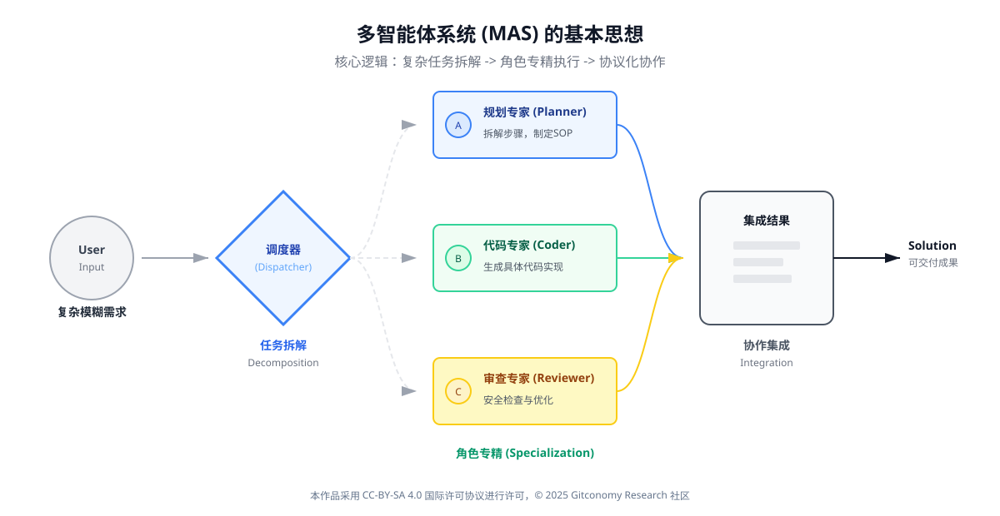
*图：多智能体系统的基本思想：复杂任务拆解 -> 角色专精执行 -> 协议化协作*

在多智能体系统中：

- 每个Agent只承担有限、明确的职责
- Agent 之间通过结构化通信协同
- 系统行为不再由单点决策决定，而是由**交互过程涌现**

 
可以用一句话概括：多智能体不是“更多模型”，而是“更好的组织结构”。

### 7.1.3 单体Agent与多智能体系统的结构对比

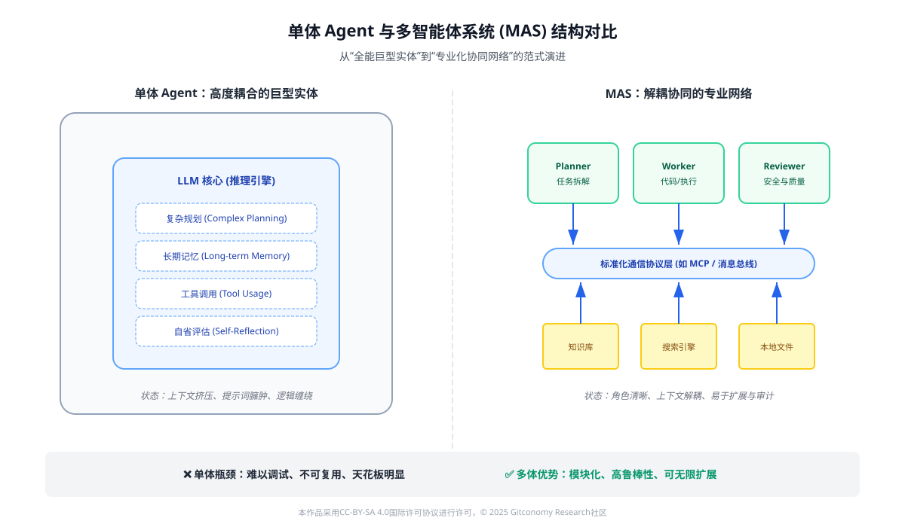
*图：单智能体与多智能体系统的比较*

下面的对比有助于理解这种跃迁的本质差异：

|维度|单体 Agent|多智能体系统|
|---|---|---|
|决策主体|单一 Agent|多个角色化 Agent|
|任务分解|内部隐式完成|显式角色分工|
|推理方式|内省式推理|对话式 / 协商式推理|
|纠错机制|自我反思|交叉审查与对抗|
|系统演化|修改单体逻辑|替换或新增 Agent|

这也是为什么，在复杂系统中，“再聪明的单体 Agent”往往不如“结构清晰的多 Agent 系统”。

### 7.1.4 多智能体并不意味着“完全自治”

需要特别强调的是，多智能体 ≠ 完全自动化系统。

在本课程语境中，多智能体系统仍然遵循以下原则：

- 人在回路（Human-in-the-loop）仍然存在
- Agent 的职责是“提出建议、执行子任务”，而不是“取代决策者”
- 系统重点在于协作结构的可解释性

 
因此，本章引入多智能体，并不是为了追求“更炫的自动化”，而是为了让系统在复杂任务下保持可控、可拆解、可扩展。

### 7.1.5 小结：为什么需要多智能体协作？

多智能体系统（MAS）的引入是为了突破单体 Agent 的“能力天花板”。当任务链路过长或涉及多个专业领域时，单模型往往会因为上下文信息过载或指令遵循度下降而失效。通过将复杂问题拆解为多个子任务并交给垂直领域的 Agent 处理，我们可以显著降低系统的逻辑熵，提升复杂任务的完成率。

因此，多智能体并不是为了“并行更多模型”，而是为了通过角色分工与协作机制，将复杂问题拆解为**可治理的子系统**。

---

## 7.2 多智能体协作范式：从单一 Agent 到 Agent Network

在第六章中，我们已经完成了一个关键转变，智能体不再是一次性生成结果的工具，而是嵌入运行环境、能够持续执行任务的系统组件。  但当任务复杂度进一步提升，仅依靠“单一智能体 + 行动链”往往会遭遇结构性瓶颈。

本节引入多智能体协作（Multi-Agent Collaboration的范式，回答一个更高阶的问题：当任务规模、知识跨度与工具复杂度持续增长时，  智能体应如何通过“分工、协作与编排”来扩展系统能力？

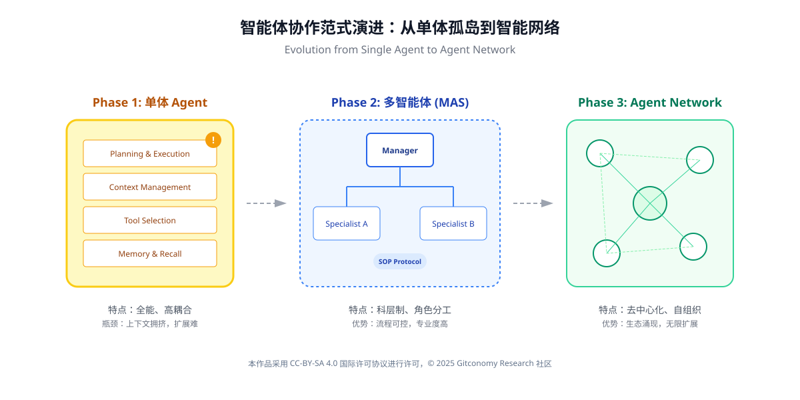
*图：智能体从单体孤岛到智能网络的演进*

### 7.2.1 为什么单一Agen 会遇到能力上限

从工程实践来看，单一 Agent 即使具备完善的 Planning / Reflection / Tool Use 能力，仍然会在以下场景中显得力不从心：

- 任务同时涉及多个专业领域（如检索、分析、执行、评估）
- 行动链过长，状态管理复杂
- 推理、执行与评估逻辑相互干扰
- 同一 Agent 需要频繁切换“角色心智”

 

*图：单体Agent的结构性瓶颈源于系统结构耦合*

这些问题并非模型能力不足，而是系统结构层面的限制。

|问题类型|单一 Agent 的典型表现|
|---|---|
|关注点混杂|同一提示中既要规划又要执行|
|推理退化|长链路下逻辑一致性下降|
|状态污染|历史上下文干扰当前决策|
|扩展困难|新能力只能“堆进同一个 Agent”|

> 📌 **这正是多智能体范式出现的根本原因： 不是让一个 Agent 更聪明，而是让系统更有结构**。

### 7.2.2 多智能体的核心逻辑：关注点分离与协同

多智能体系统的核心并不在于“数量”，而在于角色分工（Role Specialization）**与**协同机制（Coordination）。在多智能体系统中，真正的复杂性并不来自于单个智能体的能力，而来自于它们之间如何协调与协作。因此，引入一个中介层（Mediator / Protocol Layer）来规范模型、工具与智能体之间的交互，是系统可扩展性的关键。Russell 与 Norvig（2021）在其经典教材中指出，理性智能体的行为必须在明确的环境与交互规则下进行[2]，这为 MCP 作为“模型—工具—代理之间的协议层”提供了理论基础。

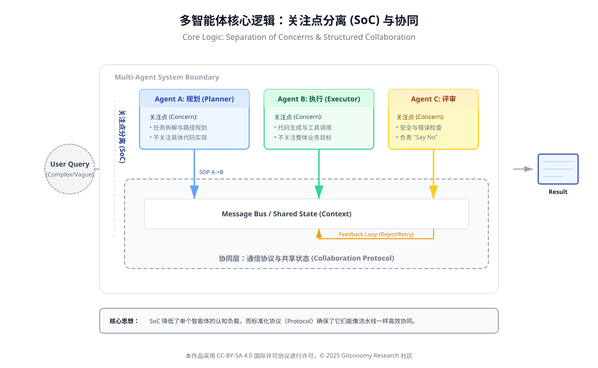
*图：多智能体的角色分工与协同机制的核心逻辑*

在最基本的多智能体结构中，不同Agent各自承担明确职责：

|Agent 类型|核心职责|
|---|---|
|规划 Agent|任务拆解、步骤生成|
|执行 Agent|调用工具、修改环境|
|评估 Agent|检查结果、发现问题|
|反思 Agent|总结经验、优化策略|

这种结构带来的好处是显而易见的：

- 每个 Agent 的提示与上下文更加“纯净”
- 推理链路更短、更稳定
- 系统行为更容易调试与审计
- 新能力可通过“新增 Agent”而非“重写系统”实现

---

### 7.2.3 多智能体从“角色扮演”到“协作网络”的演变

需要强调的是： 多智能体并不等同于在提示中写多个角色。真正的多智能体系统具备以下特征：

1. **Agent 拥有相对独立的状态与记忆**
2. **Agent 之间通过明确的协议进行通信*    
3. **存在一个协同或编排层，管理任务流转**

 
这使得系统从“线性工作流”升级为**Agent Network（智能体网络）**。

|层级|说明|
|---|---|
|单一 Agent|一个决策中心|
|多角色 Prompt|一个中心，多种语气|
|多智能体系统|多个决策节点 + 协作机制|

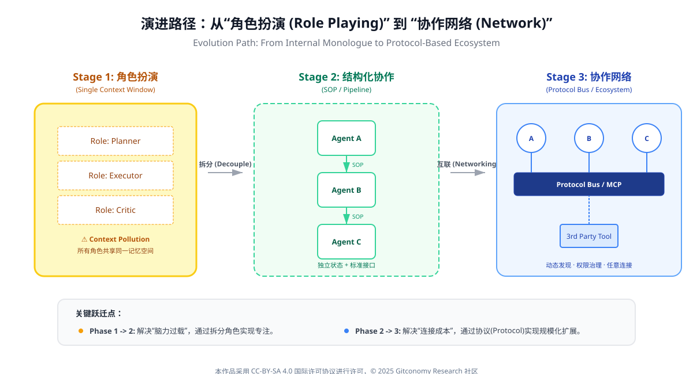
*图：智能体从“线性工作流”升级为"Agent Network"的角色演进*
### 7.2.4 多智能体与工具生态的天然耦合

当系统引入大量外部工具（搜索、代码执行、知识库、数据处理）时，多智能体结构几乎成为必然选择。

原因在于：

- 不同工具具有不同失败模式与风险等级
- 工具调用需要隔离上下文，避免污染主推理
- 工具结果往往需要二次评估与校验

 

*图：多智能体与工具生态天然耦合的本质*

在这种情况下，工具不再直接绑定某一个Agent，而是通过协作机制被“调度”。这也为后续引入 MCP（Model Context Protocol）与 工具市场化（如 ModelScope MCP 市场）奠定了结构基础。

### **7.2.5 小结：多智能体不是复杂化，而是结构化**

多智能体协作的目标，并不是让系统“更复杂”，而是通过结构化分工，降低单点复杂度，提高整体系统的稳定性与可扩展性。在这一意义上，多智能体并不是对单一 Agent 的否定，而是其在系统规模扩展过程中的自然演进形态。

将工具能力以市场化、协议化的方式进行管理，并不只是为了扩展功能数量，更是为了控制系统复杂度。Sculley 等人（2015）在研究中指出，当机器学习系统缺乏清晰的接口与依赖边界时，往往会积累大量“隐性技术债”，最终导致系统难以维护[3]。MCP 市场的价值，正在于通过标准化接口与治理机制，降低多智能体系统在规模扩展时的结构性风险。

---

## 7.3 多智能体协作的协议层：MCP的角色与机制

在第六章中，我们已经明确：智能体能力的上限由运行环境决定。当系统从“单智能体”演进到“多智能体协作”时，新的瓶颈并不在模型推理本身，而在于如何让多个智能体在共享目标下，安全、可控、低耦合地交换上下文并协商工具使用。这正是 **MCP（Model / Multi-Agent Context Protocol）** 所要解决的核心问题。

从系统工程视角看，MCP 并不是“又一个 Agent 框架”，而是一层协议化的中介：它规范了上下文（Context）如何被声明、传递、裁剪与合并，以及工具（Tool）如何被发现、描述与调用。这种“协议优先”的思路，与分布式系统中以接口与契约解耦复杂组件的传统高度一致（Wooldridge, 2009）[1]。

### 7.3.1 为什么多智能体需要协议层

在没有统一协议的情况下，多智能体系统通常依赖**硬编码的调用关系**或**平台内私有接口**，这会带来三类结构性问题：

1. **上下文割裂：** 不同 Agent 各自维护上下文，导致信息冗余、不一致，甚至相互冲突。
2. **工具耦合：** Agent 与具体工具或平台强绑定，系统难以迁移或扩展。
3. **协作不可审计：** 多 Agent 决策链条缺乏清晰的上下文与责任边界，难以调试和治理。

 
这些问题在早期多智能体研究中就已被指出：没有共享环境与通信协议的 Agent，只是“并列运行的程序”，而不是系统意义上的协作体（Wooldridge, 2009）[1[。

### 7.3.2 MCP的核心思想：上下文即接口（Context as Interface）

**MCP 的核心抽象不是“模型调用”，而是“上下文交换”**。

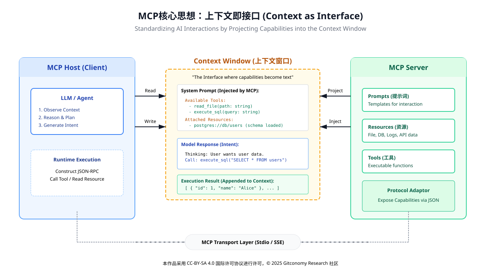
*图：MCP的核心思想*

在 MCP 的视角下：
- Agent 不直接调用工具
- 工具不直接暴露实现细节
- 所有交互都通过结构化上下文（Context）完成

 

可以将 MCP 理解为“智能体世界中的 HTTP + JSON”。它不关心“你是谁、用什么模型”，而关心你在什么上下文下、以什么结构、请求什么能力。这一思想与分布式系统中“接口优先、实现后置”的原则高度一致。

|维度|传统方式|MCP 协议方式|
|---|---|---|
|交互核心|函数 / API|上下文对象|
|耦合关系|强（代码级）|弱（协议级）|
|多 Agent 支持|困难|原生支持|
|可审计性|低|高|
|扩展性|平台相关|跨平台|

*表：传统工具调用 vs MCP 协议化调用*

### 7.3.3 MCP 的核心要素：Context、Tool 与 Contract

从实现上看，MCP通常包含三类最小要素：

|要素|职责|教学要点|
|---|---|---|
|**Context**|描述任务状态、角色视角与可见信息|上下文应“最小充分”，避免全量广播|
|**Tool**|对外部能力的统一抽象与发现|工具是接口，不是脚本|
|**Contract**|约束输入/输出与失败语义|协议化失败比“智能补救”更可靠|

*图：MCP协议架构核心三要素*

这种结构使得多智能体协作不再依赖“谁调用谁”，而是依赖上下文流动，从而显著降低系统复杂度（Luckcuck et al., 2019）[4]。这种结构也与ReAct 的“思考—行动—观察”循环形成互补：ReAct 解决的是单 Agent 内的推理—行动协同，而 MCP 解决的是多 Agent 间的上下文与工具协商（Yao et al., 2022）[5]。当二者结合时，系统能够在保持可解释性的同时，获得更强的扩展性。

### 7.3.4 从模型接口到协议接口：MCP的工程化路径

在MCP的实际推动过程中，Anthropic起到了关键的“工程化与范式化”作用。与早期多智能体研究侧重理论不同，Anthropic在其模型与工具体系中明确提出并实践了以下三点[6]：

1. **将“上下文”提升为一等公民**

Anthropic 在其文档与系统设计中强调：模型并不是“被调用的函数”，而是在给定上下文中进行推理的参与者。  这一理念直接推动了MCP将上下文作为核心协议对象。

2. **将工具使用纳入协议层，而非提示技巧**  

在 Anthropic 的设计中，工具不是 Prompt 中的“技巧性指令”，而是通过结构化上下文声明的外部能力。 这为 MCP 的“工具即上下文服务”奠定了实践基础。

3. **强调安全性与可审计性（Constitutional AI 影响）**  

MCP 中对上下文边界、权限与调用记录的强调，与Anthropi 在 Constitutional AI 中提出的可解释、可约束 AI 系统理念高度一致（Bai et al., 2022）[7]。

可以说，Anthropic并非 MCP的唯一提出者，但其工程实践使 MCP 从“理念”走向了“可用的系统模式”**。

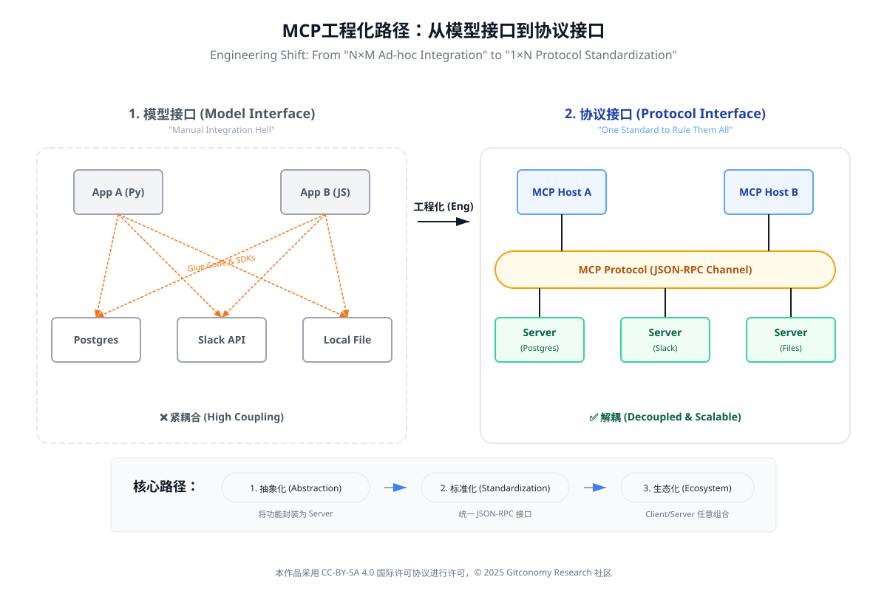
*图：MCP从模型接口到协议接口的工程化路径：*

### 7.3.5 MCP与工具生态：从“内嵌调用”到“市场化发现”

将工具封装为可发现、可组合的能力，是多智能体规模化的前提。近期实践表明，工具应被视为“市场化资源”而非代码依赖：Agent 通过协议查询能力清单、理解参数与约束，再进行调用。这一模式与“插件式”架构一致，也与混合智能强调的“人—机—工具协同”理念相吻合。引入工具市场（如ModelScope的MCP市场），可以直观理解：

- **能力解耦**：Agent 不“内置一切”；
- **协作分工**：不同 Agent 负责不同能力域；
- **风险控制**：通过 Contract 明确失败与回退路径。

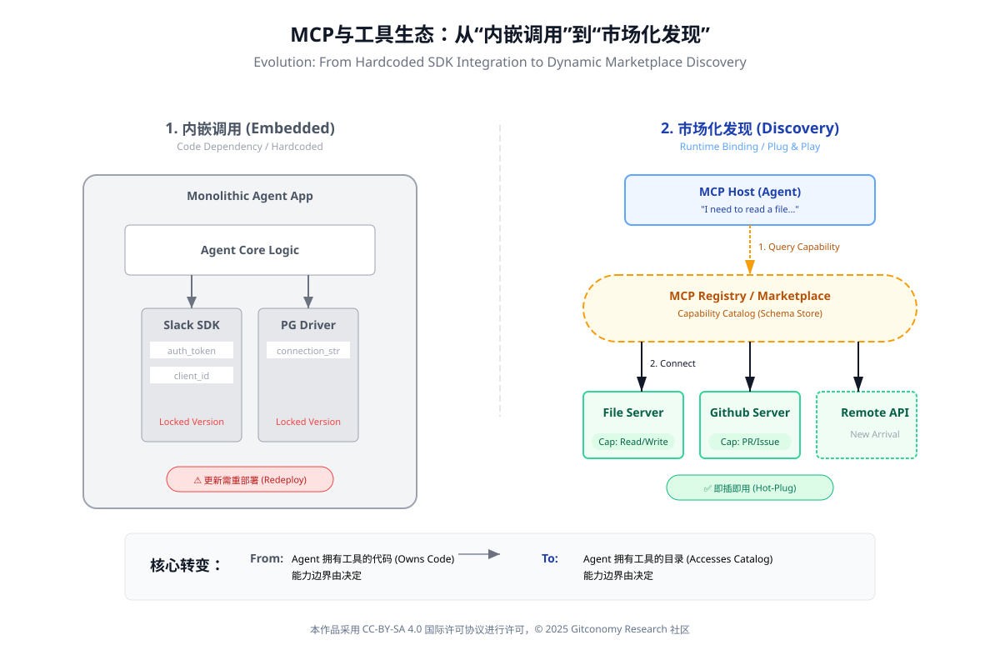
*图：MCP与工具生态*

### 7.3.4 MCP 的系统价值：降低技术债，提升可演进性

多智能体系统最大的风险不是“当下不可用”，而是“未来不可维护”。研究显示，缺乏清晰接口与数据契约的智能系统会迅速积累隐性技术债（Sculley et al., 2015）[3]。MCP 通过协议化上下文与工具边界，**把复杂度前移为设计问题**，从而降低长期维护成本。

更重要的是，MCP 为人在回路提供了稳定的锚点：当协作失败时，系统可以定位到“上下文裁剪”“工具契约”或“责任分配”，而非把问题归咎于模型“不够聪明”。这种可诊断性，正是将智能体从 Demo 推向系统工程的关键。

### 7.3.5 小结：MCP 让多智能体从“能协作”走向“可治理”

MCP的意义不在于替代Agent设计模式，而在于为多智能体提供一层可治理的协议基础。智能体之间的协作本质上是“信息与权限”的接力。为了保证这种接力的零损耗，必须建立标准化的通讯协议。接力的核心不再是原始对话的堆砌，而是结构化状态（State Snapshot）的传递，确保下游Agent能够迅速从上游的产出中提取关键上下文。

---

## **7.4 从工具调用到协作协议：多智能体系统的工程化落点**

在前一节中，我们讨论了 MCP如何通过统一上下文、工具与消息接口，为多智能体系统提供一种协议级协作机制。然而，真正决定多智能体系统能否在现实中落地的，并不仅仅是“有没有协议”，而是协议如何嵌入到真实的工程实践与安全边界之中。

在当前的大模型生态中，一个逐渐清晰的共识是多智能体系统不能被理解为“多个模型并行工作”，而应被视为多个具备角色、边界与协作规则的自治单元，在受控协议之下进行交互的系统。

这一共识并非抽象理论推演的结果，而是在真实系统设计与失败经验中逐步形成的。

### 7.4.1 协议化协作的必要性：从“工具能力”到“系统责任”

在早期 Agent 系统中，工具调用（Tool Use / Function Calling）往往被视为智能体能力扩展的核心： 只要模型能够正确选择工具、填充参数并解析返回结果，系统似乎就具备了“行动能力”。

但在多智能体场景下，这种**以工具为中心的设计迅速暴露出结构性问题**：

- 不同 Agent 对同一工具的理解不一致
- 工具调用的副作用无法被其他 Agent 感知
- 上下文在 Agent 之间传递时发生语义漂移
- 行为责任难以追溯（谁做了什么、基于什么判断）

 
这些问题在实践中并不罕见。Anthropic在其对“可控智能体系统”的一系列工程实践与安全讨论中，反复强调当模型具备行动能力时，系统设计必须从“能力导向”转向“责任导向”。

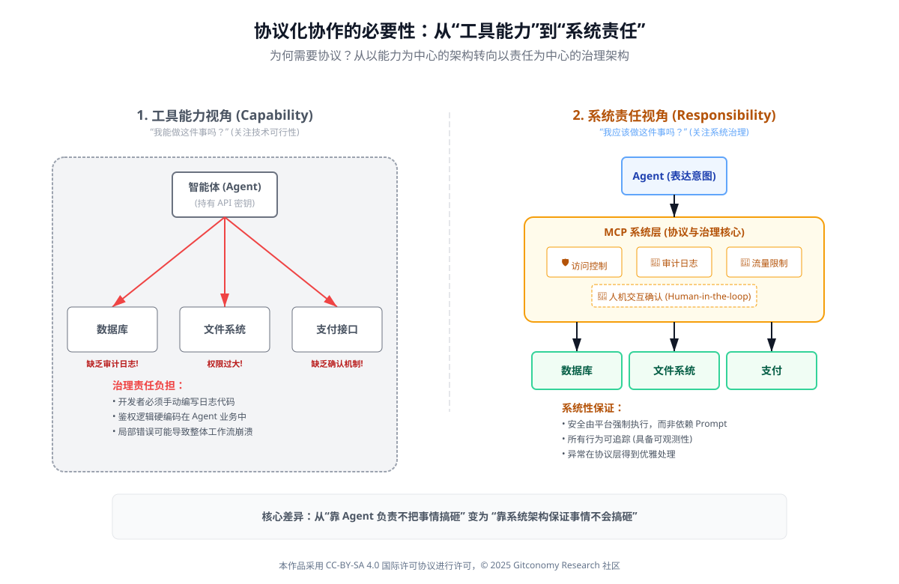
*图：协议化协作的必要性*

在这一视角下，MCP 的意义不再只是“让模型更容易用工具”，而是通过协议明确每一次上下文读取、工具调用与状态变更的结构与边界，使多智能体协作具备系统级可解释性。

### 7.4.2 多智能体不是“并行模型”，而是“分工系统”

在多智能体系统中，一个常见但危险的误解是只要创建多个Agent，让它们各自调用模型并交换信息，就自然会产生协作与智能涌现。

事实上，缺乏明确分工与协作协议的多Agent系统，往往只会放大不确定性。Anthropic在其关于“Constitutional AI”与后续对复杂系统安全的讨论中，提出了一种非常重要的工程直觉：角色清晰、职责单一、交互受限的系统，往往比“能力全面但边界模糊”的系统更稳定、更安全。

这一思想在多智能体系统中体现为三个基本原则：

|原则|含义|
|---|---|
|角色单一性|每个 Agent 只承担明确职责|
|交互显式化|Agent 间通信必须通过协议|
|状态可追溯|所有关键决策与行动均可回放|

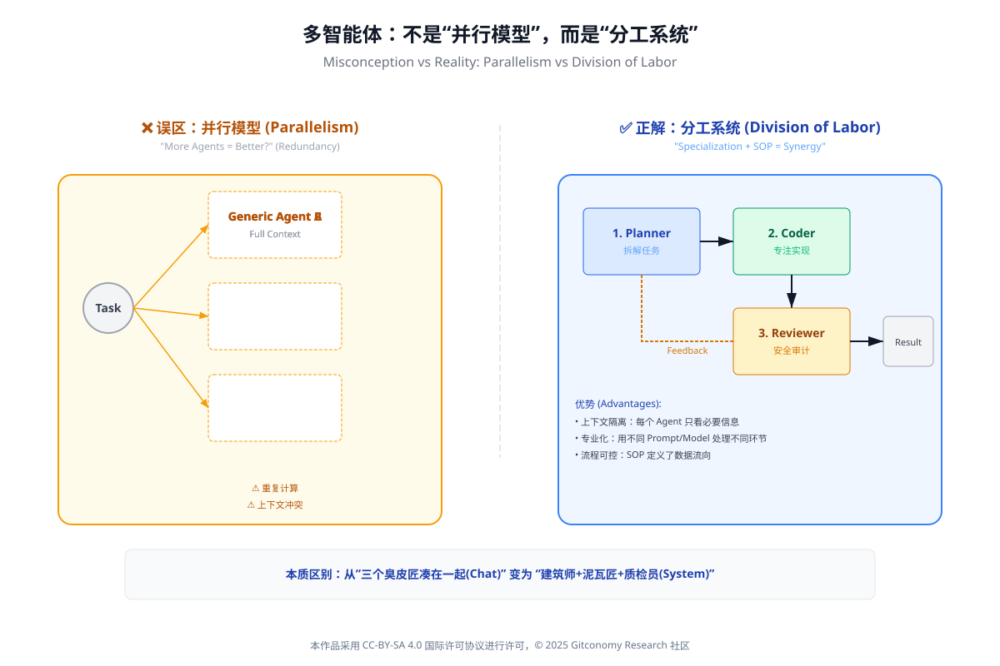
*图：MCP的分工体系与并行模型的差异*

MCP所提供的上下文协议、工具描述与消息结构，正是为了支撑这种“分工明确的协作系统”，而不是一个混乱的并行生成网络。

### 7.4.3 协议、运行环境与安全边界的统一

在前几章中，你已经看到：

- 第五章强调 **Agentic Workflow**
- 第六章强调 **Agent Runtime（运行环境）**

 
而在多智能体场景下，这两者必须通过**协议机制**进行统一。在Anthropic 的系统设计理念中，一个反复出现的主题是安全不是一个外挂模块，而是系统结构本身的一部分。

这意味着：

- 协议定义了**什么信息可以被共享**
- 协议限定了**什么工具可以被调用**
- 协议约束了**什么状态可以被修改**

 
MCP 在工程层面所做的，正是将这些约束前移到系统接口层，而不是依赖模型在生成时“自觉遵守规则”。这种设计思路，与传统分布式系统中的接口契约（Interface Contract）高度一致（Kleppmann, 2017）[8]。

### 7.4.4 从单体Agent到协议驱动的协作系统

综合来看，多智能体系统的工程化落点并不在于“模型数量”或“推理能力”，而在于：

- 是否存在**稳定的运行环境**
- 是否具备**可验证的协作协议**
- 是否能将**智能体行为纳入系统治理**

 
在这一意义上，MCP 不仅是一个“上下文协议”，更是一种将多智能体系统从实验性构想引向工程可控形态的关键基础设施。它所体现的设计思想，与当前大模型安全、系统工程与人机协作研究中的主流方向是高度一致的。

*图：单体智能体到协议驱动的协作系统*

### 7.4.5 小结：多智能体不是规模升级，而是结构升级

本节的核心是多智能体系统并不是让 AI“更多地思考”，而是让系统“以结构的方式思考”。通过协作结构、角色分工与MCP协议，多智能体系统实现了从“单点智能”到“系统智能”的跃迁。

当多个 Agent 面对同一决策产生分歧时，系统必须具备确定性的冲突处理逻辑。无论是由于模型幻觉导致的策略冲突，还是由于资源限制引发的竞争，系统都需要通过预设的仲裁 Agent 或硬编码规则来强行收敛，防止任务进度停滞。

---

## 7.5 实践与展望：基于 MCP 的多智能体协作原型

在前面的章节中，我们已经从概念、结构与协议机制三个层面，系统性地讨论了多智能体系统（Multi-Agent Systems）以及 MCP（Model Context Protocol）在其中所扮演的关键角色。本节的目标并不是引入新的理论框架，而是回答一个更为务实的问题：在不追求大规模工程化的前提下，如何基于 MCP 构建一个“最小可行”的多智能体协作原型？

这一问题的教学意义在于，它标志着课程从“理解多智能体为何重要”，进一步过渡到“理解多智能体如何被组织与运行”。

### 7.5.1 从单一智能体到多智能体协作的最小跃迁

在第六章中，我们已经构建了一个本地优先、人在回路的单体Agent Runtime。向多智能体迈进，并不意味着系统复杂度需要指数级增长。相反，在 MCP 的语境下，这一跃迁可以被刻意控制在一个“最小变化集”中。

| 维度    | 单一智能体      | 基于 MCP 的多智能体        |
| ----- | ---------- | ------------------- |
| 决策主体  | 单一 LLM 实例  | 多个具备角色分工的 Agent     |
| 上下文管理 | 单一上下文窗口    | 通过 MCP 显式交换 Context |
| 工具调用  | Agent 直接调用 | 通过 MCP 描述工具与能力      |
| 协作方式  | 串行推理       | 协议化的任务分派与协作         |

*表 ：从单一智能体到多智能体的最小变化*

可以看到，多智能体并不是“更多模型的简单堆叠”，而是通过协议化上下文与能力边界，使多个 Agent 能够形成稳定协作关系。MCP 在这里提供的，正是这种“最小但关键”的结构支撑。

### 7.5.2 MCP 驱动的协作模式：角色、任务与上下文

在一个教学级别的多智能体原型中，通常不需要复杂的博弈或自治机制，而是可以从明确的角色分工入手。例如：

- **Planner Agent**：负责任务分解与计划生成
- **Executor Agent**：负责执行具体步骤或工具调用
- **Critic Agent**：负责评估结果并给出修正建议

 
在 MCP 的框架下，这些角色并不是通过“硬编码的调用关系”耦合在一起，而是通过标准化的上下文交换协同工作。每一次协作，实质上都是一次 MCP Context 的生成、传递与更新过程。

这种设计方式，与经典多智能体研究中强调的“通信协议”高度一致，但 MCP 将其具体化为面向大模型时代的工程协议，使得多智能体协作第一次具备了“即插即用”的可能性。

### 7.5.3 教学场景下的多智能体原型示例

在课程实验中，一个典型的MCP多智能体原型可以围绕**知识工作流**展开，例如：

1. Planner Agent 接收用户目标（如“整理本周研究笔记”）
2. Planner 通过 MCP 生成任务 Context，并分派给 Executor
3. Executor 调用本地知识库或远程工具完成子任务
4. Critic Agent 对结果进行评估，并通过 MCP 返回修正建议

 
整个过程中，MCP 扮演的是“协作总线（Coordination Bus）”的角色，而不是控制逻辑本身。这种设计使得系统依然保持“人在回路”，同时又具备清晰的多智能体结构。

### 7.5.4 多智能体的现实边界与课程定位

需要特别强调的是，本章并不试图构建一个完全自治的多智能体系统。原因在于：

- 多智能体的复杂性主要来自协作失控与上下文膨胀
- 教学环境更关注可解释性与可调试性
- MCP 的真正价值，在于“降低协作门槛”，而非“追求完全自治”

 
正如 Simon（1996）所指出的，复杂系统的有效性往往来源于**结构上的约束**，而不是能力的无限扩张[11]。将 MCP 引入课程体系，正是为了让学习者理解：多智能体并不是“更聪明”，而是“更有组织”**。

### 7.5.5 小结：为什么需要多智能体协作？

多智能体系统（MAS）的引入是为了突破单体 Agent 的“能力天花板”。当任务链路过长或涉及多个专业领域时，单模型往往会因为上下文信息过载或指令遵循度下降而失效。通过将复杂问题拆解为多个子任务并交给垂直领域的 Agent 处理，我们可以显著降低系统的逻辑熵，提升复杂任务的完成率。

多智能体系统不是“共享一个 Runtime”，而是多个Runtime通过 MCP 协同运行：

- 单体 Agent 仍然在自己的运行环境中完成 PEAR 闭环
- MCP 负责在 Agent 之间协调任务、同步状态与传递结果

---

## 7.6 基于MCP的多智能体系统参考架构设计

在本课程语境里，你可以把 MCP 理解为多智能体系统的“上下文与工具总线”。它通过清晰的 Host/Client/Server 结构，让“谁负责推理”“谁负责调用工具”“谁负责权限与审计”变得可被系统性设计，而不是写在某段 Prompt 里。

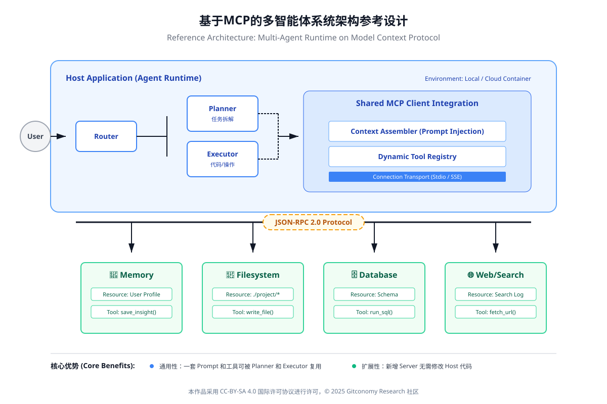
*图：MCP 多智能体系统参考架构设计*

### 7.6.1 设计目标与约束

在教学与实验环境约束下（远程 LLM + 本地知识库 + 多工具扩展），本节架构设计以MVA（最小可行多智能体）为目标，不追求“全自动自治”，而追求以下五个“可运行特性”：

|目标维度|设计目标|可验证结果|
|---|---|---|
|可组合|新增一个工具，不需要改动每个 Agent 的集成代码|只新增/替换 MCP Server 配置即可|
|可治理|工具调用有权限、审计与边界|调用记录可追溯，敏感工具有确认|
|可迁移|更换模型或客户端，不影响工具层|更换 LLM 只影响推理层配置|
|可扩展|多智能体可按角色拆分职责|Planner/Executor/Critic 角色清晰|
|可维护|运行与观测一体化|日志、失败原因、重试策略明确|

*表 ：MCP 多智能体架构的设计目标*

这里强调“可组合”，本质上来自 MCP 的开放协议定位：它为工具与数据提供标准接入方式，让 AI 应用避免陷入 N×M 的定制连接成本。

### 7.6.2 架构分层

在课程可实践的粒度上，一个 MCP多智能体系统可以分为五层。注意：分层不是为了画图好看，而是为了明确责任边界。

|层级|核心组件|职责|典型实现形态|
|---|---|---|---|
|L1 推理层|远程 LLM（Qwen/DeepSeek 等）|语言推理、计划生成、反思评估|API/远程服务|
|L2 编排层|Orchestrator（编排器）|任务分解、路由、状态机、重试|规则 + 状态机 + 日志|
|L3 角色层|多智能体角色集合|专业分工：计划/执行/审查/记忆|Planner / Executor / Critic / Librarian|
|L4 协议层|MCP Host/Client|标准化“上下文+工具”访问方式|MCP Client（在客户端或编排器内）|
|L5 工具层|MCP Servers（工具服务）|对外部系统提供可调用能力|文件、搜索、数据库、支付、日历等|

*表：基于 MCP 的多智能体系统五层架构*

MCP 的“协议层”之所以值得单独成层，是因为它把工具调用从“某家模型的函数调用格式”提升为“跨模型、跨客户端的统一接口”，从而降低系统碎片化。

### 7.6.3 角色划分与协作方式

多智能体并不等于“多开几个聊天窗口”。在工程上，多智能体的价值来自**关注点分离（Separation of Concerns）**：把一个复杂任务拆成若干可审计的子职责，降低单一 Agent 的上下文压力与错误传播风险。

|角色|输入|输出|与 MCP 的关系|
|---|---|---|---|
|Planner（计划代理）|目标、约束、当前状态|Action Plan（步骤序列）|不直接调用工具，只产出计划|
|Executor（执行代理）|Action Plan|工具调用结果、执行状态|通过 MCP Client 调用工具|
|Critic（审查代理）|草稿结果、日志|风险提示、改进建议|对工具调用做“合理性审计”|
|Librarian（知识代理）|知识库/索引|可引用证据、上下文包|主要与“检索类 MCP Server”交互|

*表：课程推荐的最小多智能体角色集*

在教学上你可以把它对齐为：**PEAR 的系统化拆分**——Perceive 更多由 Librarian/Executor 承担，Evaluate 更多由 Planner/Critic 承担，Act 更多由 Executor（+人在回路）承担，Reflect 更多由 Critic（+知识回写）承担。

### 7.6.4 MCP 工具层设计：Server、能力边界与权限

MCP 的关键贡献不在“能调用工具”，而在于：工具作为 Server 被独立部署、独立治理、独立复用。这让你可以用“工具市场/工具仓库”的方式管理能力，而不是把能力写死在某个 Agent 的 Prompt 里。

在课程实践中，工具层建议按“风险等级”分类，并把确认机制写入编排层（或客户端策略），而不是交给模型“自觉”。

|风险级别|工具类型|示例|控制策略|
|---|---|---|---|
|R0 只读|检索/读取|知识库检索、网页搜索、读文件|允许自动调用，强制记录日志|
|R1 低风险写入|结构化写入|写入草稿、生成摘要、加标签|允许自动调用 + 事后审计|
|R2 高风险写入|影响知识结构|合并笔记、删除、批量重命名|必须人工确认（confirm-to-act）|
|R3 外部系统动作|影响外部世界|支付、发消息、创建工单|默认禁止，白名单 + 强确认|

*表：MCP 工具风险分级与控制策略*

如果你采用 ModelScope 的 MCP 广场/大本营作为“工具发现与复用来源”，也应维持同样的分级原则：市场负责“可获得性”，课程负责“可治理性”。

### 7.6.5 运行时数据流：一次任务如何穿越多智能体与 MCP

下面用“运行时数据流”把系统串起来（你也可以把它画成示意图）：

1. **用户目标进入编排层**：形成 Task（带约束、截止时间、可用工具集）。
2. **Planner 生成 Action Plan**：输出结构化步骤，并标注每一步需要的工具能力（Tool Capability Tags）。
3. **Executor 按步骤调用 MCP**：Executor 通过 MCP Client 发起调用，请求对应 MCP Server 执行工具动作；工具结果回到 Executor。
4. **Critic 做过程审查**：对每个关键步骤进行“合理性检查”（是否越权、是否证据不足、是否需要人工确认）。
5. **Librarian 回写知识**：把证据链、结论、反思写回知识库（形成可持续运行的记忆）。
6. **编排层更新状态机**：成功/失败/重试/中断原因进入日志，为后续优化提供数据。

 
这套流程的关键在于：**“计划—执行—审查—沉淀”被拆开了**。拆开的好处是：即便远程 LLM 不稳定，系统仍然能靠编排与审查把错误控制在边界内。

### 7.6.6 本课程推荐的最小落地形态（MVA）

结合第六章“本地优先”的约束，第七章的最小落地形态建议是：

- **远程 LLM**：负责推理与规划（Qwen/DeepSeek）。
- **本地知识库**：Obsidian（或等价本地 Markdown 知识库）。
- **MCP 工具层**：优先选 R0/R1 工具，R2/R3 必须人工确认。
- **编排层**：用一个“任务状态机 + 日志”就够（不必上复杂框架）。
- **工具来源**：可从 MCP 生态与市场快速引入，但要通过课程分级治理。([ModelScope](https://modelscope.cn/brand/view/MCP?utm_source=chatgpt.com "MCP大本营"))

 

| 模块        | 最小配置                                    | 你在实验中要验证什么       |
| --------- | --------------------------------------- | ---------------- |
| 编排器       | 任务表 + 状态机（pending/running/blocked/done） | 任务能持续推进而不是“一问一答” |
| Planner   | 输出结构化 Action Plan                       | 计划可执行、步骤可追溯      |
| Executor  | 只调用 R0/R1 工具                            | 工具调用有日志、有证据链     |
| Critic    | 关键步骤审查 + 风险提示                           | 能阻止越权与幻觉驱动的行动    |
| Librarian | 证据与反思回写                                 | 知识库随运行而演化        |

*表：MVA 配置清单（教学可执行版）*

### 7.6.7 小结：从单体可运行到系统可协作

实现从单体运行到集群协同的规模化演进，核心在于组件的“标准化”与“可插拔化”。只有当每个 Agent 的接口和职责都被清晰定义后，系统才能通过增加 Worker 节点来横向扩展处理能力。这种演进标志着智能体从简单的工具调用者转变为具备组织协同能力的数字员工群体。

通过MCP，多智能体系统获得了：

- 稳定的协作语言
- 可审计的协作过程
- 可演化的系统结构

---

## 7.7 学员学习思考指南

第七章的重点不是“多开几个模型/窗口”，而是让你真正理解：当任务复杂度上升到一定程度，单体 Agent 的问题不再是“聪明不够”，而是“结构不够”。多智能体系统要解决的核心矛盾，是把复杂任务从一个脑袋里拆出来，变成**可分工、可接力、可治理、可审计**的协作系统；而 MCP 则提供了让协作稳定发生的“协议层”。

### 问题 1：你为什么需要多智能体？你的任务“结构”真的变了吗？

**当你说“我要用多智能体”，你的理由是“单体不够强”，还是“单体的角色负载与上下文竞争已经导致系统性退化”？**

- **思考引导**：请从你的真实任务出发，写下单体 Agent 同时承担的职责（规划/执行/检索/审查/修正等），并标记其中最容易互相污染的两项（例如：执行者为了完成任务而放松审查，或检索与写作争夺上下文窗口）。如果你把其中一项职责独立出来交给另一个 Agent，系统会在哪个环节变得更稳、更可解释？

### 问题 2：你的“多智能体”是角色分工，还是并行对话？

**你设计的多智能体系统，是否已经明确了每个角色的输入、输出与责任边界？**

- **思考引导**：用一句话分别定义你系统中的 3–4 个角色（例如：Planner / Executor / Critic / Librarian），并写清楚它们各自“交付什么”。再反过来检查：如果删除其中一个角色，系统会退化成什么（比如计划无法落地、质量无法守住、证据无法追溯）？如果多个角色都能做同一件事，是否意味着你的分工仍然模糊，会导致协作成本上升？

### 问题 3：你的协作是“靠默契”，还是“靠协议层”？

**你的多智能体系统在接力时，靠的是“彼此猜上下文”，还是靠 MCP 这样的协议层把上下文与工具调用组织成可追溯的结构？**

- **思考引导**：对照 MCP 的定位，把你的协作路径写成一条明确的“接力链”：谁负责封装上下文包、谁负责发起工具调用、谁负责回收结果、谁负责审查并更新状态。再进一步，你是否把协作需要的关键要素从 Prompt 中抽离出来，放到了系统结构里（例如：统一的消息结构、状态记录、工具权限与日志）？如果没有这些机制，你的协作最可能在哪一步丢信息、走偏或失控？

## 7.8 课程总结

本章完成了一次关键的系统性跃迁：从“能运行的单体智能体”，走向“可组织、可治理的多智能体协作体系”。你已经不再将 Agent 理解为模型调用的外壳，而是将其视为具备角色、边界与责任的系统组件。通过引入多智能体范式，本章揭示了复杂任务并非依赖更强模型，而依赖更合理的分工与协作结构；而 MCP 的引入，则为这种协作提供了协议级的上下文交换、工具治理与系统可扩展性基础。最终，你看到的是一种新的工程范式：智能不再集中于单点推理，而是通过协议化协同在系统中涌现，这正是从“Agent 能用”迈向“Agent 可持续运行”的关键一步。

---

## 7.9 附录1：核心概念术语表 (Glossary)

|**English Term**|**中文术语**|**定义与解析**|
|---|---|---|
|**Multi-Agent System (MAS)**|**多智能体系统**|由多个相互作用的智能体构成的集合。通过分工与协作，系统能够解决单个智能体无法处理的复杂、跨领域长链路任务。|
|**Orchestrator**|**编排者/中控元**|在多智能体架构中负责任务分发、进度监控及结果汇总的核心角色。它通常拥有最高的决策权限，负责维持协作的秩序。|
|**Standard Operating Procedure (SOP)**|**标准作业程序**|为多智能体协作制定的显式流程规范。它定义了智能体之间传递信息的格式、触发条件及流转顺序，减少了由于模型不确定性带来的混乱。|
|**Handoff (Handover)**|**接力/交付**|任务在不同智能体之间流转的关键动作。有效的接力需要包含：当前状态快照、已完成工作摘要及明确的下一步指令。|
|**Communication Protocol**|**通讯协议**|智能体之间对话的“共同语言”。在工程实践中，通常表现为特定的 JSON 结构或结构化文本协议，用于确保信息传递的零损耗。|
|**Conflict Resolution**|**冲突解决机制**|当多个智能体对同一任务产生分歧（如策略冲突或资源争夺）时，系统预设的仲裁逻辑，通常由中控 Agent 或硬编码规则执行。|
|**Agent Swarm**|**智能体集群**|一种去中心化或弱中心化的协作形态。大量功能单一的智能体通过自组织方式，针对大规模并行任务（如全网搜寻、多方案对比）进行协同。|
|**Inter-Agent Feedback**|**代理间反馈**|智能体之间互相评价、修正对方产出物的机制。通过“交叉审核”逻辑（如 Critic Agent 对 Coder Agent 的代码审查），大幅提升最终产出的质量。|
|**Task Decomposition**|**任务拆解**|将复杂的终极目标重构成一系列相互依赖的子任务。这是多智能体协作的起点，决定了协作效率的上限。|
|**Shared Context Buffer**|**共享上下文缓冲区**|一块所有协作 Agent 均可访问的公共内存空间。用于存储全局变量、公共知识及协作进度，避免每个 Agent 重复存储冗余信息。|

---

## 7.10 附录2：参考文献

[1] Wooldridge, M. (2009). _An introduction to multiagent systems_ (2nd ed.). Wiley.  
[2]  Russell, S. J., & Norvig, P. (2021). _Artificial intelligence: A modern approach_ (4th ed.). Pearson.   ## 许可声明

本文档采用 [知识共享署名--相同方式共享 4.0 国际许可协议 (CC BY--SA 4.0)](https://creativecommons.org/licenses/by-sa/4.0/deed.zh) 进行许可， &copy; 2025 Gitconomy Research社区。
[3] Sculley, D., et al. (2015). Hidden technical debt in machine learning systems. _Advances in Neural Information Processing Systems_. https://papers.nips.cc/paper_files/paper/2015/file/86df7dcfd896fcaf2674f757a2463eba-Paper.pdf  
[4] Luckcuck, M., Farrell, M., Dennis, L. A., Dixon, C., & Fisher, M. (2019). Formal specification and verification of autonomous robotic systems. _ACM Computing Surveys, 52_(5), 1–41. [https://doi.org/10.1145/334235](https://doi.org/10.1145/3342355) 
[5]  Yao, S., Zhao, J., Yu, D., Du, N., Shafran, I., Narasimhan, K., & Cao, Y. (2022). _ReAct: Synergizing reasoning and acting in language models_. arXiv preprint.  arXiv:2210.03629](https://arxiv.org/abs/2210.03629) 
[6] Anthropic. (2024). _Model Context Protocol (MCP) specification_. [https://modelcontextprotocol.io/](https://modelcontextprotocol.io/)  
[7] Bai, Y., et al. (2022). _Constitutional AI: Harmlessness from AI feedback_. [arXiv:2212.08073](https://arxiv.org/abs/2212.08073)|  
[8] Kleppmann, M. (2017).  Designing data-intensive applications_. O’Reilly Media.

[9]  Stone, P., & Veloso, M. (2000). Multiagent systems: A survey from a machine learning perspective. _Autonomous Robots, 8_(3), 345–383. [https://doi.org/10.1023/A:1008942012299](https://doi.org/10.1023/A:1008942012299)  
[10] Minsky, M. (1988). _The society of mind_. Simon & Schuster.  
[11] Simon, H. A. (1996). _The sciences of the artificial_ (3rd ed.). MIT Press.
 

---

## 许可声明

本文档采用 [知识共享署名--相同方式共享 4.0 国际许可协议 (CC BY--SA 4.0)](https://creativecommons.org/licenses/by-sa/4.0/deed.zh) 进行许可， &copy; 2025 Gitconomy Research社区。
