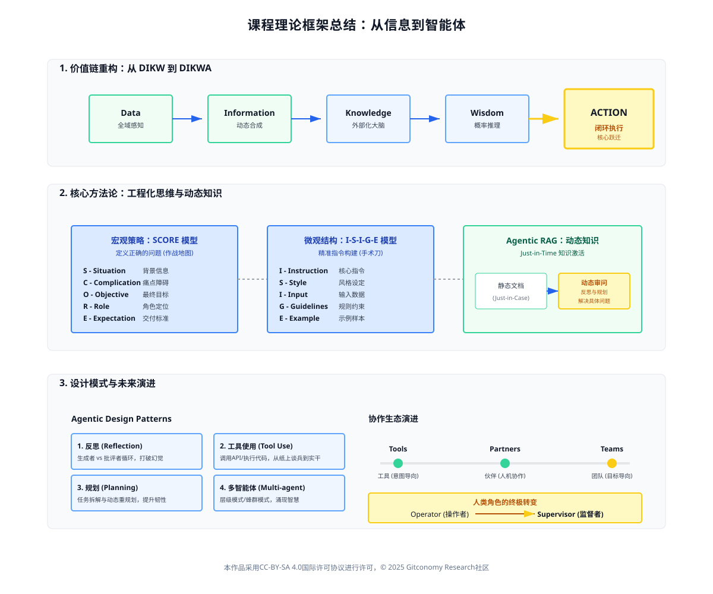
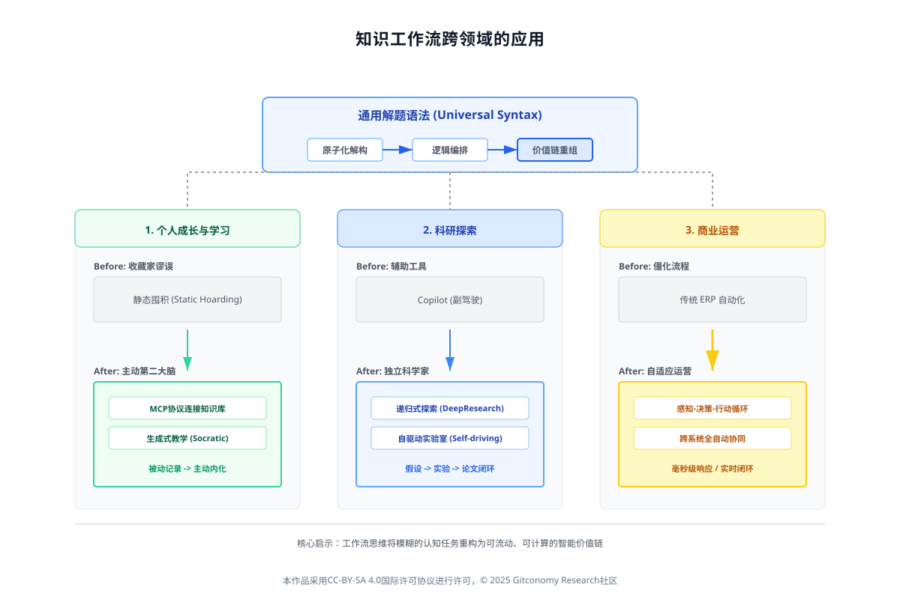
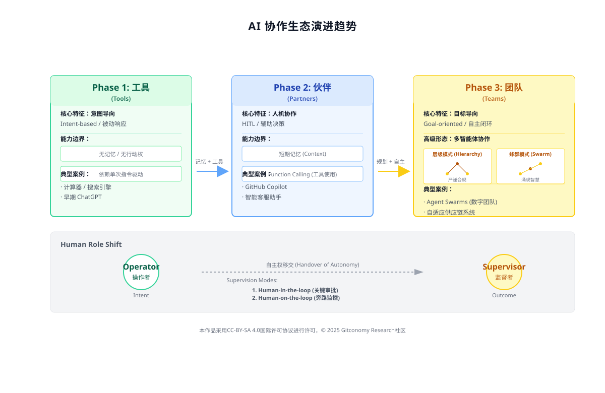
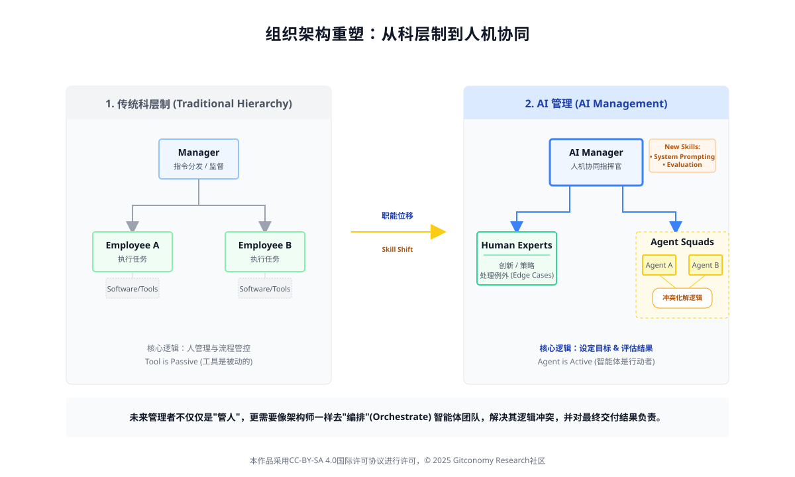

# 第八章 课程总结：从信息到智能体

## 8.1从信息到智能体：重新梳理知识工作流的完整价值链条

知识工作的本质，在很长一段时间内被定义为对信息的获取、处理和输出。然而，生成式人工智能（Generative AI）的出现，特别是智能体（Agentic AI）的兴起，迫使我们重新审视这一古老的定义。

*图：生成式思维和知识工作流课程关键理论框架*
### 8.1.1 价值链的演变：从DIKW到DIKWA模型

传统的知识管理和认知科学领域，一直奉行着经典的 **DIKW 金字塔模型**（Data-Information-Knowledge-Wisdom）。

- **数据（Data）：** 原始的、未经处理的事实与符号。
- **信息（Information）：** 被赋予了上下文和结构的数据。
- **知识（Knowledge）：** 通过分析、综合和内化信息而形成的理解。
- **智慧（Wisdom）：** 基于知识、经验和伦理判断做出的高阶决策。

 
然而，生成式思维引入了一个全新的维度，将模型扩展为 **DIKWA** (Data-Information-Knowledge-Wisdom-**Action**)。AI 智能体不仅仅是内容的生成者，更是行动的执行者。

|**层级**|**传统知识工作流 (Human-Centric)**|**生成式智能体工作流 (Agentic AI)**|**价值链重构点**|
|---|---|---|---|
|**数据 (Data)**|存储在孤立的数据库中，需人工提取|**全域感知**：Agent通过API和MCP协议实时读取多源异构数据|数据不再是被动资源，而是Agent的感知输入|
|**信息 (Information)**|通过报表和Dashboard呈现|**动态合成**：Agent根据任务上下文实时清洗、结构化非结构化数据|消除信息过载，仅提供决策所需的最简信息集|
|**知识 (Knowledge)**|依赖文档库（Wiki）和人脑记忆|**外部化大脑**：利用RAG和向量数据库构建可被模型调用的长期记忆|知识从“人的经验”变为“系统的资产”|
|**智慧 (Wisdom)**|依赖专家的直觉和经验判断|**概率推理**：利用LLM的推理能力进行多路径规划和利弊权衡|决策过程可追溯、可量化、可复用|
|**行动 (Action)**|**断点**：需人工切换系统进行操作|**闭环执行**：Agent通过工具调用（Function Calling）直接执行操作|**核心跃迁：从“给建议”到“做任务”**|

*表：传统 vs. 智能体工作流对比表*
### 8.1.2 核心方法论：I-S-I-G-E与SCORE的工程化思维

在迈向智能体（Agent）的高阶应用之前，我们必须重温奠定这一切基石的两个核心思维模型。它们不仅是编写 Prompt 的技巧，更是我们将模糊的自然语言转化为精确机器指令的“编译器”，代表了从“直觉式对话”到“工程化交互”的思维跃迁。

1. **微观结构：** I-S-I-G-E 提示词构建模型

I-S-I-G-E 框架解决了**“如何让 AI 听懂指令”的问题。它通过五个标准化的模块，确保了单次交互的精准度、可控性和可复现性，特别是引入了 Guidelines (规则/约束)，有效防止了模型跑偏。

|**模块 (Module)**|**全称 (Full Name)**|**定义与工程价值 (Definition & Engineering Value)**|**典型应用 (Typical Application)**|
|---|---|---|---|
|**I**|**Instruction**      (核心指令)|**动词驱动**的原子化任务描述。明确 AI “做什么”。避免模糊请求，指向具体动作。|“撰写”、“总结”、“提取”、“重构代码”、“翻译”|
|**S**|**Style/System**      (风格与设定)|定义输出的语调、格式及系统级设定。这是控制 AI “幻觉”和保持**输出一致性**的关键。|“以麦肯锡顾问的口吻”、“输出为 Markdown 表格”、“保持 JSON 格式”|
|**I**|**Input**      (输入数据)|明确划定 AI 处理的**数据边界**。使用分隔符物理隔离指令与数据，防止提示注入。|使用 `"""` 或 `###` 包裹待处理的文本、代码或数据。|
|**G**|**Guidelines**      (规则与约束)|**核心控制层**。明确“不能做什么”（负向约束）、逻辑步骤（思维链 CoT）以及特定的业务规则。|“不要使用敬语”、“分步思考”、“如果数据缺失，请回复‘未知’而非编造”|
|**E**|**Example**      (示例/Few-Shot)|提供“输入-输出”的对齐样本（Few-Shot Learning）。**一个高质量的示例胜过一千字的描述性指令。**|User: "苹果" -> AI: "红色, 水果"      User: "天空" -> AI: "蓝色, 自然"|

*表：I-S-I-G-E框架核心要素*

2. **宏观策略：** SCORE 任务定义模型

SCORE 框架解决了“如何定义复杂问题”的问题。它借鉴了经典的咨询思维，用于在编写 Prompt 之前梳理业务逻辑，确保 AI 解决的是“正确的问题”。

|**维度 (Dimension)**|**全称 (Full Name)**|**核心逻辑 (Core Logic)**|**作用 (Function)**|
|---|---|---|---|
|**S**|**Situation**      (现状情境)|交代任务发生的**背景信息** (Context)。|为 AI 构建“世界观”，让模型理解任务的上下文环境。|
|**C**|**Complication**      (冲突与障碍)|明确当前的**痛点、难点**或限制条件。|激活 AI 的**问题解决能力**，使其不仅是检索信息，而是针对性地克服困难。|
|**O**|**Objective**      (最终目标)|定义**成功的标准**。不仅是“做什么”，更是“达成什么效果”。|设定任务的终点，确保 AI 的输出聚焦于核心价值。|
|**R**|**Role**      (角色定位)|赋予 AI 具体的**专家身份** (Persona)。|激活模型内部特定领域的**知识权重**（如“资深 Python 架构师” vs “初中老师”）。|
|**E**|**Expectation**      (期望与交付)|具体的**交付物标准**与格式要求。|明确字数限制、语言风格、必含要素以及输出格式（可视化图表、代码块等）。|

*表：SCORE框架核心要素*

如果说 ISIE 是我们手中的**手术刀**，用于精准切割每一个具体的任务模块；那么 SCORE 就是我们的**作战地图**，用于规划整场战役的战略走向。只有将 SCORE 的宏观思考注入到 I-S-I-G-E 的微观结构中，我们才能构建出真正具备生产力的 Agent 工作流。

### 8.1.3 深度解析：Agentic RAG与知识的动态激活

Agentic RAG的真正威力，在于它彻底改变了知识存在的形态。在传统检索中，知识是静止的“固体”，封存在文档中等待被关键词“命中”；而在 Agentic 模式下，知识被转化为流动的“液体”。智能体通过多轮的自我反思（Self-Reflection）**和**动态规划（Dynamic Planning），实际上是在对静态文档进行一场“动态审问”（Dynamic Interrogation）。

它不再机械地搬运检索到的文字片段，而是像一位高明的分析师，将检索到的碎片化信息（Fragmented Information）在用户当前的特定任务语境下进行逻辑重组、矛盾排查和因果链接。这种机制使得沉睡在数据库中的“死数据”，被瞬间激活为能够解决当下具体问题的“活智慧”。这标志着知识管理终于实现了从 **"Just-in-Case"（为了存储而存储）** 到 **"Just-in-Time"（为了解决问题而实时计算）** 的范式转移。

### 8.1.4 核心设计模式：构建智能工作流的四根支柱

在重构价值链的过程中，我们不仅要理解概念，更要掌握构建的方法论。Andrew Ng（吴恩达）教授提出的四种 **Agentic Design Patterns（代理设计模式）** 是我们在课程中反复实践的“心法”。这四种模式并非孤立的技术手段，而是将人类解决复杂问题的高阶认知流程——如反思、利用工具、拆解任务和团队协作——映射到 AI 系统中的通用语言。掌握了这四根支柱，我们才能从单纯的 Prompt 编写者晋升为智能系统的架构师。

|**模式名称 (Pattern Name)**|**人类工作流映射 (Human Mapping)**|**技术实现逻辑 (Implementation)**|**核心价值 (Core Value)**|
|---|---|---|---|
|**1. 反思 (Reflection)**|类似人类写完稿件后的**自我检查**或**同行评审**。|建立 **Generator**（生成者）与 **Critic**（批评者）的双重角色循环。Generator 生成初稿，Critic 提出修改建议，如此迭代优化。|将质量控制内化到生成过程中，有效打破模型“幻觉”，显著提升输出准确性。|
|**2. 工具使用 (Tool Use)**|人类使用计算器处理数据、用搜索引擎查资料等**借助外力**的行为。|赋予 LLM **Function Calling**（函数调用）能力，使其能调用 API、查询数据库或执行代码。|连接数字世界与物理世界，让 AI 从“纸上谈兵”的咨询师变为能解决实际问题的**实干家**。|
|**3. 规划 (Planning)**|项目经理面对大项目时，拆解 **WBS**（工作分解结构）并制定里程碑。|模型**自主生成任务序列**（Task Decomposition），并具备在执行受阻时**动态调整计划**（Re-planning）的能力。|赋予系统处理长时程（Long-horizon）、高复杂度任务的**韧性**，避免在第一步失败后就全面停摆。|
|**4. 多智能体协作 (Multi-agent Collaboration)**|**跨部门专家会议**，不同背景（如技术、法务、产品）的专家共同解决问题。|设定不同**角色（Persona）**和权限的 Agent，在特定框架（如 AutoGen, CrewAI）下进行对话、辩论与分工。|激发**涌现智慧**（Emergent Intelligence），通过专精分工解决单一通用模型无法覆盖的深度垂直问题。|

*表：智能体设计模式对比表*

---

## 8.2 展望：生成式思维的无限可能

### 8.2.1 知识工作流在其他领域的扩展应用

工作流思维的核心魅力，在于它提供了一种通用的解题语法：将那些原本模糊、复杂的认知任务，精细解构为明确的、可被 AI 代理执行的原子步骤，再通过严密的逻辑编排，将这些步骤重组为高效流动的价值链。这种思维模式具有极强的穿透力，当我们将它迁移至学习、科研与商业领域时，会发现它正在从根本上重塑这些行业的运作逻辑。

*图：知识工作流跨领域的应用*

首先，在个人成长与学习领域，工作流思维正在终结“收藏家谬误”，将我们静态的知识库转化为“主动第二大脑”。过去，我们习惯于囤积文章和笔记，却鲜少回顾，导致知识淤积；现在，借助 MCP 协议，智能体可以直接连接我们的本地知识库（如 Obsidian 或 Notion），使其从被动的存储容器转变为活跃的对话伙伴。当你撰写新文章时，后台运行的智能体会自动扫描旧笔记，建立语义连接，主动提示你多年前记录的相关灵感。更进一步，这种思维还能演化为“生成式教学”：智能体能根据你的笔记结构，自动设计苏格拉底式的问答或测试题，在你认知的薄弱环节进行针对性补强，真正实现从被动记录到主动内化的闭环。

其次，在科研探索的前沿，AI 的角色正经历从辅助工具（Copilot）到独立科学家（Scientist）的质变。DeepResearch 等系统的出现，展示了“递归式探索”的威力：智能体不再满足于单次搜索，而是像人类研究员一样，基于初步结果提出更深层的问题，层层递进挖掘长尾知识与跨学科联系。而在物理化学等领域，“自驱动实验室”更是将这种思维推向极致——从基于海量文献构思科学假设、设计实验代码，到操控机械臂执行物理实验、实时分析数据，乃至最终撰写符合学术规范的论文，AI 智能体已经能够自主完成科学发现的全流程闭环。这不仅是效率的提升，更是人类发现能力边界的实质性扩张。

最后，在商业运营的深水区，工作流思维正在推动企业从僵化的流程自动化向“自适应运营”转型。传统的 ERP 系统往往反应迟钝，而基于“感知-决策-行动”循环构建的供应链智能体，则能实现毫秒级的响应。例如，当气象智能体感知到台风即将登陆时，物流智能体会立即计算受影响货物，并在瞬间完成跨运力的成本比对与舱位预订，随后同步通知库存智能体调整水位。同样在营销领域，智能体能够实时捕捉用户的微小行为（如放弃购物车），全自动完成从偏好分析、个性化文案生成到邮件触达与客服回复的整个链条。这种跨系统、全自动的协同能力，让企业运营不再依赖人工的层层审批，而是进化为一种自适应的有机体。

---

### 8.2.2 AI协作生态的演进趋势：从工具到伙伴再到团队

随着 Agent 能力的指数级增长，我们正在见证 AI 协作生态经历一场深刻的质变。这不仅仅是技术参数的提升，更是数字生产力形态的根本性重组。我们与 AI 的关系，正沿着一条清晰的路径，从简单的指令执行演变为复杂的组织协作。

*图：AI协作生态的演进趋势*

 1. **演进的三个阶段：能力与自主权的跃迁**

回顾 AI 的发展历程，我们可以清晰地描绘出一条从被动响应到主动规划的进化曲线。这种演进反映了 AI 在记忆力、行动权以及任务理解深度上的逐级突破：

| **演进阶段 **                  | **核心特征**                                       | **能力与权限 **                                  | **角色定位**                                                | **典型案例**       |
| -------------------------- | ---------------------------------------------- | ------------------------------------------- | ------------------------------------------------------- | -------------- |
| **Phase 1: 工具 (Tools)**    | 意图导向 (Intent-based)      被动响应      | 具备极强的知识检索与生成能力；      但无记忆、无行动权。 | 高科技百科全书 / 计算器      完全依赖人类单次指令驱动。            | 早期 ChatGPT     |
| **Phase 2: 伙伴 (Partners)** | 人机协作 (Human-in-the-loop)      辅助决策 | 具备短期上下文记忆；      拥有特定工具使用能力。     | 副驾驶 (Copilot) / 导航员      提供建议和草稿，但方向盘由人类掌握。 | GitHub Copilot |
| **Phase 3: 团队 (Teams)**    | 目标导向 (Goal-oriented)      自主闭环     | 具备长期记忆；      拥有复杂规划能力和独立行动权。    | 数字团队 (Digital Team)      能自主拆解目标、分工协作并交付结果。 | Agent Swarms   |
*表：AI 协作生态演进阶段对比表*

2. **多智能体协作模式：秩序与涌现的平衡**

当AI从单一的伙伴演变为群体的团队，如何编排（Orchestration）这些智能体成为了新的挑战。目前，业界主要探索出了两种核心的协作拓扑结构，分别对应不同的应用场景：

- **层级模式 (Hierarchy)：**

    类似于传统的公司组织架构，由一个主智能体（Manager）向下分发任务给子智能体（Worker）。这种模式结构严谨、权责分明，非常适合对准确性和合规性要求极高的企业级应用，确保每一个步骤都是可控和可追溯的。

- **蜂群模式 (Swarm)：**

    类似于自然界中的蚁群或蜂群，智能体之间没有绝对的领导，而是通过即时通信进行扁平化协作。这种模式具有极低的延迟和极高的并发能力，能够激发“涌现智慧”，特别适合创意生成、科学探索及高频实时决策等需要灵活应对变化的场景。

3. 人类角色的终极转变：从 Operator 到 Supervisor

在这场变革中，人类并未被淘汰，但我们的职能发生了根本性的位移。我们正在从亲自操作工具的 **Operator（操作者）**，进化为定义目标和评估结果的 **Supervisor（监督者）**。这种监督关系的转变，具体体现为 **Human-in-the-loop (HITL)** 机制的三种新形态：

|**监督模式 (Supervision Mode)**|**运作机制 (Mechanism)**|**适用场景 (Scenarios)**|
|---|---|---|
|**Human-on-the-loop**      （旁路监督）|**实时监控**：人类处于流程之外观测仪表盘，AI 自主运行。      **例外介入**：仅在系统出现严重异常或偏离轨道时，人类介入“踩刹车”。|高频交易、实时运维|
|**Human-in-the-loop**      （关键节点审批）|**流程阻断**：AI 运行至业务关键风险点时自动暂停。      **强制授权**：必须经过人类确认和批准，AI 才能继续执行下一步。|资金转账、代码发布、法律函件发送|
|**Human-out-of-the-loop**      （全自动）|**完全放权**：人类不再进行干预。      **自动闭环**：允许 AI 独立完成从感知到决策再到行动的全过程。|数据清洗、初级客服      _(低风险、标准化、重复性任务)_|

*表：人类在 AI 回路中的角色演变 (Human-in-the-loop Evolution)*

**组织架构的重塑：** 随着这种角色的转变，未来的职场将诞生一种核心技能——**AI Management（AI 管理）**。管理者不仅要懂得管理人类员工，更要学会如何给 Agent 设定清晰的目标（System Prompting）、如何设计评估指标（Evaluation）、以及如何化解 Agent 团队内部的逻辑冲突。

*图：组织架构重塑——从科层制到人机协同*

---

### 8.3 结语

《生成式思维和知识工作流》课程至此画上句号。

我们正站在人类历史上一个罕见的转折点上。生成式AI不仅仅是一种技术，它是一种新的 **生产力基座**。它要求我们从“独行侠”转变为“指挥官”。

未来的路不在于你掌握了多少个具体的 Prompt 技巧，而在于你是否能用 **Agentic Workflow** 的视角，去重新审视每一个痛点，去重构每一个流程，去释放每一个被低效束缚的灵魂。

愿大家带着这份生成式思维，在各自的领域里，构建出属于未来的无限可能。

---

## 许可声明

本文档采用 [知识共享署名--相同方式共享 4.0 国际许可协议 (CC BY--SA 4.0)](https://creativecommons.org/licenses/by-sa/4.0/deed.zh) 进行许可， &copy; 2025 Gitconomy Research社区。
