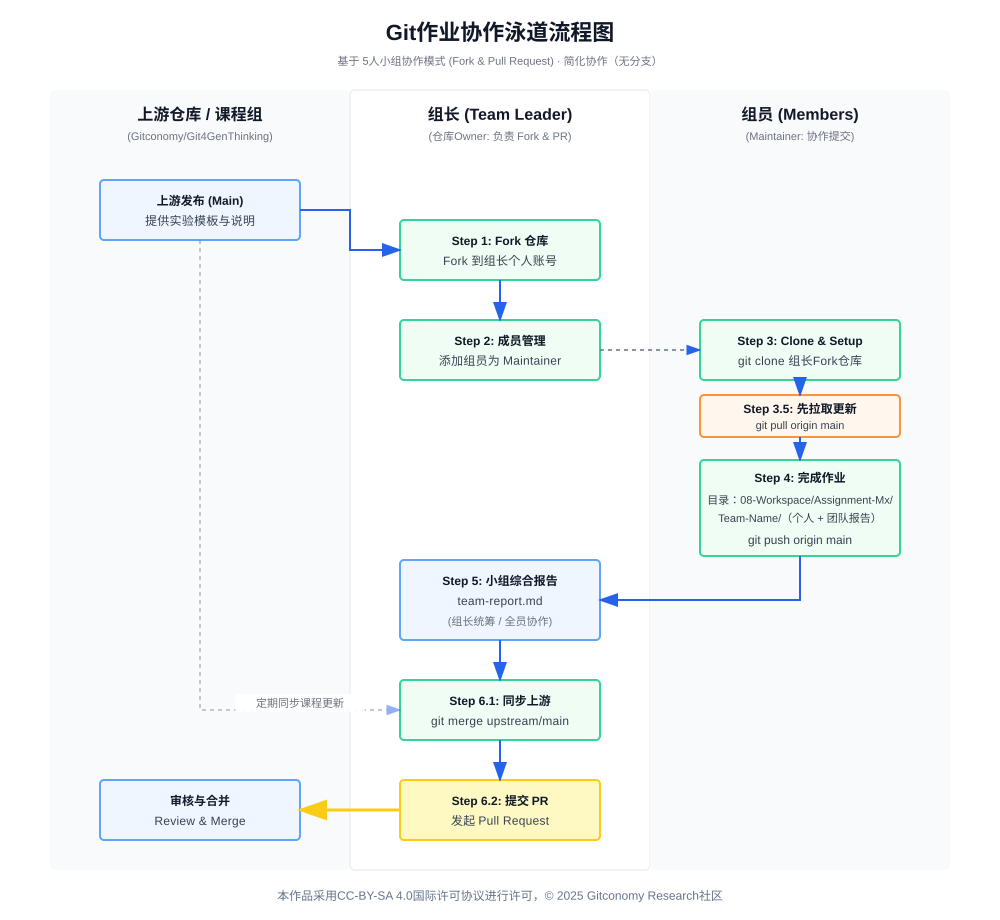
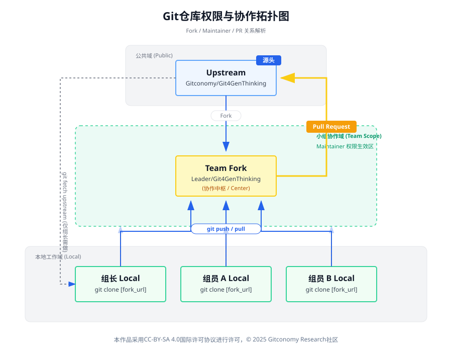

# 学员Git作业提交操作指南（GitLink）

**适用仓库**：[https://www.gitlink.org.cn/Gitconomy/Git4GenThinking](https://www.gitlink.org.cn/Gitconomy/Git4GenThinking)

本课程所有实验与作业均采用 **Git协作 + Pull Request（PR）** 的方式提交。 该流程本身即是课程的一部分，目的是让学员在真实工程环境中掌握**协作式知识生产**。

---

## 1. 作业提交总体流程概览

> **5 人一组 · 组长负责 Fork · 组员协作 · PR 回传上游**

**整体流程如下：**



*图：Git作业协作提交全流程*

1. 课程分组（5人/组），确定 **组长**
2. 组长Fork上游仓库 `Git4GenThinking`
3. 组长将其余4名组员添加为 **Maintainer**
4. 每位组员完成各自实验任务并提交
5. 小组完成**个人实验报告 + 小组综合报告**
6. 组长向上游仓库提交**Pull Request（PR）**

---

## 2. 仓库与角色说明

### 2.1 上游仓库（Upstream）

- **仓库名**：`Git4GenThinking`
- **维护方**：课程组/Gitconomy  
- **用途**：
    - 提供课程讲义、实验模板
    - 接收各小组的作业PR

> ⚠️ 学员 **不要直接向上游仓库 Push**

### 2.2 小组仓库（Fork Repository）

- 每个小组 **仅 Fork 一次**

- Fork后的仓库归 **组长账号** 所有
- 小组内部所有协作都在 **该 Fork 仓库中完成**



*图：Git仓库权限与协作拓扑图*

---

## 3. Git入门实战指南

欢迎来到Git的世界！Git是目前世界上最先进的分布式版本控制系统。简单来说，它可以帮你记录文件的每一次改动，让你不仅能随时“后悔”（回退到之前的版本），还能方便地与他人协作。

本指南将带你完成从安装到第一次“提交”的全过程。

### 3.1 准备工作

在开始之前，你需要拥有一个 GitLink 账号。

  * 如果还没有，请前往 [https://gitlink.org.cn/](https://gitlink.org.cn /) 注册。
  * *提示：注册后请记住你的用户名和注册邮箱，稍后配置 Git 时会用到。*

-----

### 3.2 安装Git客户端

首先，我们需要在你的电脑上安装Git命令行工具。请根据你的操作系统选择对应的安装方式。

#### Windows 用户

1.  前往Git官网下载页面：[https://git-scm.com/download/win](https://git-scm.com/download/win)
2.  点击 "Click here to download" 下载最新的 64-bit 安装程序。
3.  运行安装程序。**一路点击 "Next"（下一步）使用默认设置即可**。
4.  安装完成后，在桌面空白处右键点击，如果看到 **"Git Bash Here"** 菜单，说明安装成功。

#### macOS用户

大多数 macOS 系统已预装 Git。

1.  打开 "终端(Terminal)" 应用（可以通过 Command + 空格搜索 "Terminal"）。
2.  输入 `git --version` 并回车。
3.  如果显示了版本号（如 `git version 2.x.x`），则无需安装。
4.  如果没有，终端会提示你安装 "Xcode Command Line Tools"，点击 "安装" 并按照提示操作即可。
      * *(备选方案：你也可以像 Windows 一样去 [git-scm.com/download/mac](https://git-scm.com/download/mac) 下载安装包)*

#### Linux用户

打开终端，根据你的发行版输入安装命令：

  * **Debian/Ubuntu:** `sudo apt-get install git`
  * **Fedora:** `sudo dnf install git`

### 3.3 初次运行配置 (必须做！)

安装后，你必须告诉 Git “你是谁”。Git在每次提交时都会记录这些信息。

打开你的命令行工具（Windows 用户请右键选择 **Git Bash**，Mac/Linux 用户打开**终端**），依次输入以下两行命令（注意替换为你自己的信息）：

```bash
# 设置你的名字 (建议使用英文名或拼音)
git config --global user.name "Your Name"

# 设置你的邮箱 (建议使用你注册 GitCode 的邮箱)
git config --global user.email "your_email@example.com"
```

*验证配置是否成功：*
输入 `git config --list`，确认你刚才输入的信息出现在列表中。

---

## 4. 学员实验操作指引

### 4.1 组长操作指南

#### 4.1.1 步骤1：Fork 仓库

1. 打开课程仓库  
    👉 [https://www.gitlink.org.cn/Gitconomy/Git4GenThinking](https://www.gitlink.org.cn/Gitconomy/Git4GenThinking)

2. 点击右上角 **Fork**
3. Fork 到 **组长自己的 GitLink 账号**

#### 4.1.2 步骤2：添加组员为 Maintainer

1. 进入 Fork 后的仓库
2. 打开 **仓库设置 / 成员管理**
3. 将其他 4 名组员添加为：

> ✅ **Maintainer（维护者）**

📌 这样组员即可：

- Clone 仓库
- Push 内容

#### 4.1.3 步骤3：建立作业目录结构（只做一次）

所有作业统一提交到：

```text
08-Workspace/
```

每一章实验对应一个目录，例如：

```text
08-Workspace/
├── Assignment-M1/   # 第一章实验
├── Assignment-M2/   # 第二章实验
├── Assignment-M3/
```

在对应章节目录下，**以小组名创建目录**：

```text
08-Workspace/Assignment-M1/
                    └── Team-Alpha/
```

📌 **目录命名规范**

- 统一使用英文或拼音

- 不使用空格

- 示例：

    - `Team-Alpha`
    - `Team-GitThinkers`
    - `Group-01`

### 4.1.4 定期保持和上游仓库同步

```bash
# 命令行添加上游仓库，并定期保持和上游仓库的同步

git remote add upstream https://www.gitlink.org.cn/Gitconomy/Git4GenThinking.git
git fetch upstream
git merge upstream/main

# 然后将更新的本地仓库提交到远程Fork仓库

git push origin main
```

---

### 4.2  组员操作指南

#### 4.2.1 步骤1：Clone小组仓库

```bash
git clone https://www.gitlink.org.cn/组长账号/Git4GenThinking.git
cd Git4GenThinking
```

#### 4.2.2 步骤2：确认当前分支（必须）

```bash
git branch

# 确认当前为：
* main
```

❗如果不是 `main`，请执行：

```bash
git checkout main
```

#### 4.2.3 步骤3：在指定目录完成作业

统一作业提交目录：

```bash
08-Workspace/Assignment-M1/Team-Alpha/

```

建议目录结构如下：

```markdown
Team-Alpha/
├── README.md                # 小组说明
├── members/
│   ├── zhangsan.md          # 个人实验报告
│   ├── lisi.md
│   ├── wangwu.md
│   └── ...
└── team-report.md           # 小组综合实验报告
```

#### 4.2.4 步骤4：提交作业（直接提交到 main）

```bash
git add .
git commit -m "M1: add experiment report by zhangsan"
git push origin m1-zhangsan
```

 **Commit Message 建议格式**

```markdown
`M1: add experiment report by 姓名 M1: update team report
```

### 4.3 小组综合报告要求

每个小组需提交一份 **小组综合实验报告**：

📄 文件名：

```text
team-report.md
```

📌 内容建议包括：

- 小组分工说明
- 不同成员方案对比
- 共识与分歧
- 小组级 Prompt / Workflow 设计总结
- 对生成式思维方法的整体反思

---

### 4.4 组长提交PR（最终步骤）

#### 4.4.1 步骤1：向上游提交Pull Request

1. 打开 Fork 仓库页面

2. 点击 **New Pull Request**

3. **Base repository**：  
    `Gitconomy/Git4GenThinking`

4. **Compare repository**：  
    `你的Fork`

#### 4.4.2 步骤2：填写PR说明

PR 标题示例：

```text
[M1] Team-Alpha Assignment Submission
```

PR 描述建议模板：

```markdown
## 小组信息
- 小组名称：Team-Alpha
- 组长：XXX
- 成员：A / B / C / D / E

## 提交内容
- 第一章实验（Assignment-M1）
- 包含个人实验报告与小组综合报告

## 特别说明
- （如有特殊实验方法或补充说明）
```

---

### 4.5 重要规则与常见错误

#### 4.5.1 必须遵守

- 所有作业 **必须通过 PR 提交**
- 不得直接向上游仓库 Push
- 不得随意修改他人小组目录    
- 不得改变课程既有目录结构

#### 4.5.2 常见错误（请避免）

- 小组未 Fork 仓库而直接操作上游
- 目录命名混乱、使用中文空格
- 多个小组混用同一目录

---

## 5. 为什么要这样做？

这套流程并非“形式要求”，而是课程目标的一部分：

- 你正在练习：

    - **协作式知识生产**
    - **工程化表达**
    - **可追溯的思维过程**

- Git 在这里不是工具，而是：

>  📌  **生成式思维的载体与记忆系统**

---

## 许可声明

本文档采用 [知识共享署名--相同方式共享 4.0 国际许可协议 (CC BY--SA 4.0)](https://creativecommons.org/licenses/by-sa/4.0/deed.zh) 进行许可， &copy; 2025 Gitconomy Research社区。
