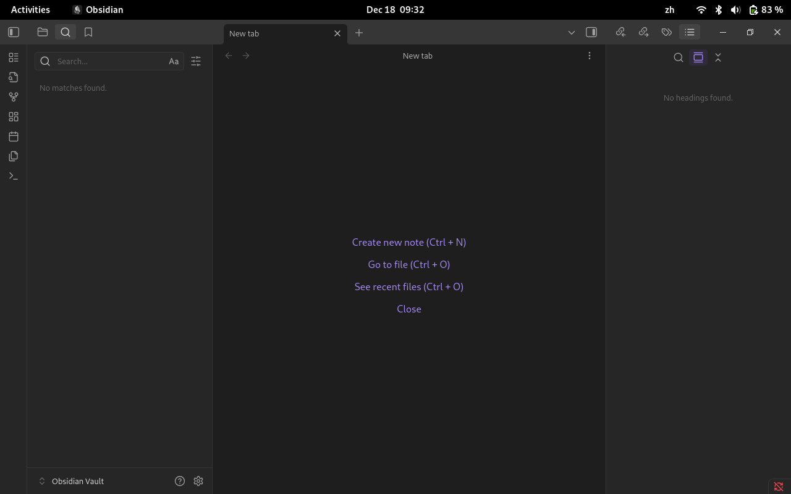
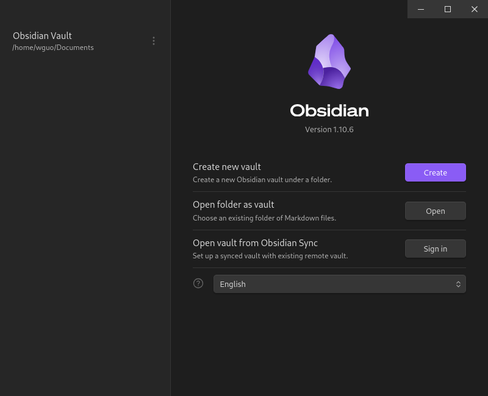
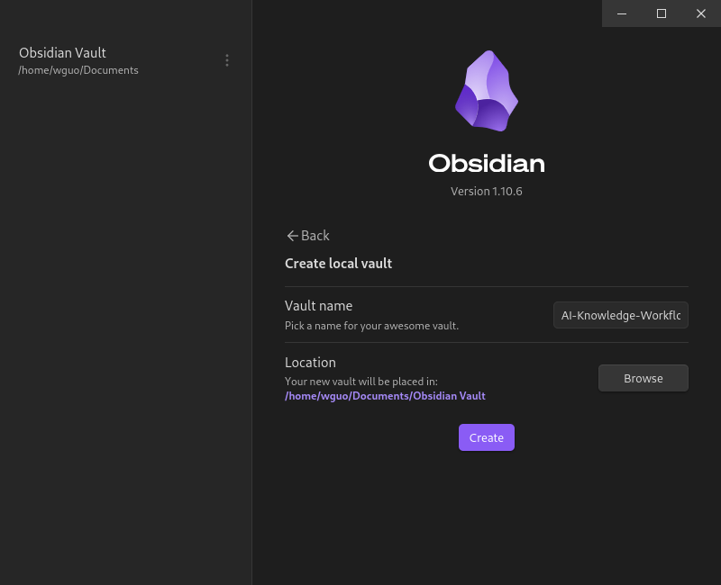
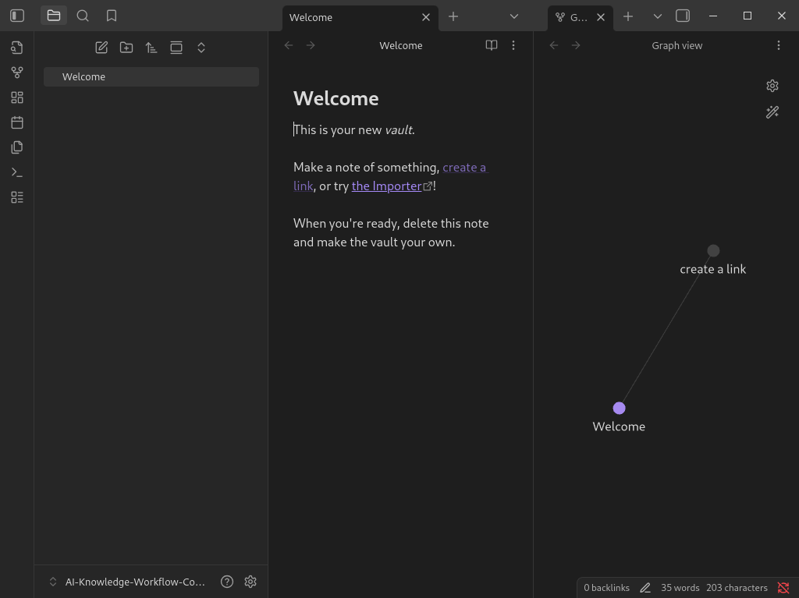

# 第一章实验操作指南：认知重构——启动你的“生成式”工作台

## 1. 实验背景与目标

完成本实验后，你将能够：

1. **打破检索惯性**：体验并描述“搜索（Search）”与“生成（Generate）”两种思维模式的本质区别。
2. **测绘能力边界**：通过实测找到当前 AI 模型的“锯齿状边界”，识别出 AI 的**“能力区”**（High Capabilities）和**“幻觉区”**（Hallucinations）。
3. **建立数字阵地**：完成 Obsidian 的安装与基础库（Vault）配置，建立课程学习的知识库结构。

<!-- end list -->

---

## 2. 实验能力说明：前置要求与学习产出

> 📌 本章节用于明确 Lab01 的**技术能力起点**与**能力达成目标**，帮助学员理解：  
> **“我带着什么能力进入实验？完成后我真正学会了什么？”**

### 2.1 前置实验技术能力要求（Prerequisites）

 Lab01是一项 **低门槛、但非零基础** 的实验。它不考察编程能力，但要求学员具备基本的数字工具使用意识与规范意识。

#### 2.1.1 工具与环境能力

学员在开始实验前，应具备以下能力或完成对应准备：

-  能在 **Linux / macOS / Windows** 任一系统中启动桌面应用
-  已成功安装并打开 **Obsidian**
-  能理解“文件夹 / 文件”的基本概念
-  能进行基础文本编辑（输入、保存、复制粘贴）

<!-- end list -->
#### 2.1.2. 基础数字素养要求

- 理解：
    - **本地文件 ≠ 云端应用**
    - **笔记 ≠ 临时对话记录**

- 能区分：
    - 内容本身
    - 内容的组织方式（结构）

<!-- end list -->


> 📌 如果你习惯“所有东西都直接发在聊天窗口里”，而从不保存、整理或复盘，这个实验将对你形成明显挑战。

#### 2.1. 3. 认知与态度要求（隐含前置能力）

- 愿意尝试与AI**多轮对话**，而非“一问一答”
- 接受 AI 会犯错，且错误需要被**识别与记录**
- 愿意对自己的输出结果承担**最终责任**

<!-- end list -->

### 2.2 完成实验后将掌握的核心技能

完成 Lab01 后，学员将首次完成从“AI 使用者”向“AI 编排者（AI Orchestrator）”的能力迁移。

#### 2.2.1  工具层技能

学员将能够：

- 独立创建并管理一个 **Obsidian Vault**
- 构建符合课程规范的基础目录结构（`00–04`）
- 将零散对话转化为**可复用的实验记录文档**

<!-- end list -->

#### 2.2.2 认知层技能

学员将掌握：

- 区分 **Search vs Generate** 两种不同的问题解决范式
- 识别 AI 的 **能力边界（Jagged Frontier）**
- 理解：
    - AI 输出 ≠ 事实
    - 流畅表达 ≠ 正确结论

<!-- end list -->

#### 2.2.3 协作与编排技能

学员将能够：

- 与 AI 进行 **多轮协作式写作**
- 通过迭代而非一次性生成，优化文本质量
- 明确：
    - AI 负责生成候选
    - 人负责判断、取舍与定稿

<!-- end list -->
#### 2.2.4 工程意识与规范意识

完成实验后，学员将初步具备：

- 将学习成果以 **文档 + 结构** 的方式保存
- 按要求完成 **成果提交清单**
- 理解：
    - 实验不是“体验”
    - 而是一次 **可被复现、可被评估** 的过程

<!-- end list -->
### 2.3 能力迁移提示（为后续实验埋点）

Lab01 中建立的 Obsidian Vault 与记录规范，将在后续实验中作为：

- 知识工作流的基础容器
- Agent / MCP 的外部记忆库
- 多人协作实验的共同语境

<!-- end list -->

---

## 3. 实验准备

- **软件环境**：

    - **Obsidian** (v1.5+): [下载地址](https://obsidian.md/)

    - **LLM 访问权限**: 推荐使用 Qwen/DeepSeek/Kimi/ChatGPT等主流大模型 (Web 版即可，暂不需要 API)。

- **知识储备**：

    - 阅读[第一章讲义](./../03-Modules/module01-introduction.md) ，特别是关于“生成式思维”和“人机协作四阶段”的部分。

<!-- end list -->

---

## 4. 实验流程 环境初始化

**任务**：搭建你的“第二大脑”地基，这将是我们后续所有 AI Agent 和工作流的栖息地。

**操作指南**：

1. 安装并打开 Obsidian。

2. 点击左下角Obisidian Vault Tab，然后点击`Manage vaults` Tab ，进入创建Valut界面  。然后点击`Create new vault`（创建新仓库），命名为 `AI-Knowledge-Workflow-Course`。


<br>

<br>

<br>

<br>

3. 在仓库中建立以下文件夹结构（这是标准的知识工程目录）：

    - `00-Inbox` (收集箱：存放未经处理的 AI 对话记录)
    - `01-Labs` (实验区：存放 Lab01-Lab05 的作业)
    - `02-Knowledge` (知识库：存放整理后的概念与笔记)
    - `03-Templates` (模版库：存放 Prompt 模版)
    - `04-Screenshot` (截图：存放实验过程中的截图文件)
    - `05-Output` (成果区：存放最终发布的文章或报告)

	<!-- end list -->

```markdown
📁 AI-Knowledge-Workflow-Course
├─ 00-Inbox
├─ 01-Labs
├─ 02-Knowledge
├─ 03-Screenshot
├─ 04-Template
└─ 05-Output
```

4. 在 `01-Labs` 目录下，新建笔记 `lab01-Log.md`，用于记录今天的实验过程。

<!-- end list -->

---

## 5. 实验任务
### 5.1 认知实验 一 —— “搜索 vs. 生成” (Search vs. Generate)

**任务**：同一个问题，分别用搜索引擎和 LLM 解决，对比体验差异。

**操作指南**：

1. **设定问题**：选择一个你相对陌生的概念，例如：“_什么是‘认知卸载’ (Cognitive Offloading)？它对知识工作者有什么影响？_”

2. **动作 A（搜索模式）**：使用 Google/Baidu 搜索。

    - 记录：你点击了几个链接？你花费了多少时间拼凑信息？你对信息的信任度如何？

3. **动作 B（生成模式）**：使用 LLM（如Qwen）提问。

    - Prompt 参考：`请作为一名认知心理学专家，向我解释“认知卸载”的概念，并列举 3 个它对现代知识工作者的具体正面和负面影响。`

    - 记录：获得答案的速度？答案的结构化程度？你是否产生了“想进一步提问”的冲动？

4. **反思**：在 `lab01_log.md` 中填写对比表格：

<!-- end list -->

| **维度**     | **搜索引擎 (Search)** | **生成式 AI (Generate)** |
| ---------- | ----------------- | --------------------- |
| **信息获取方式** | 主动筛选、拼凑           | 被动接收、交互               |
| **思维负担**   | 高（需辨别真伪/整合）       | 低（但也容易产生惰性）           |
| **结果形态**   | 碎片化网页链接           | 结构化文本/观点              |
### 5.2 认知实验二 —— 测绘“锯齿状边界” (The Jagged Frontier)

**任务**：第一章提到AI的能力是不均匀的。你需要通过测试，找到 AI 的“天才”一面和“白痴”一面。

**操作指南**：

1. **测试“天才”一面（创造力/结构化）**：

    - Prompt：`请为“咖啡杯”写5条标语，分别对应：乔布斯的极简风格、马斯克的硬核科幻风格、李佳琦的带货风格、海明威的硬汉风格、以及一只猫的视角。`

    - 观察：AI 是否展现了惊人的风格迁移和创造力？

2. **测试“白痴”一面（事实/逻辑陷阱）**：

    - Prompt：`林黛玉在《红楼梦》中第几回倒拔垂杨柳？请详细描述该场景。` 或者问一个具体的、最新的本地新闻细节（如果模型未联网）。

    - 观察：AI 是否一本正经地胡说八道（幻觉）？

3. **记录**：将这两段对话的截图或文本复制到 `lab01-Log.md` 中，标记你的发现：

    > 发现边界
    >
    > AI 擅长... 但在处理... 时会产生严重幻觉，这要求我在... 环节必须介入审核。

以下是一个标记的例子：

- **能力区（AI 擅长）**：在“风格迁移/结构化表达”任务上，AI 能快速生成多风格标语，结构清晰、语言有张力。
- **幻觉区（AI 不可靠）**：在“具体事实/文本细节”（如《红楼梦》情节细节）上，AI 会给出看似可信但实际错误的描述，出现一本正经的编造。
- **我的介入点（必须审核）**：凡是涉及 **人名-地名-时间-出处-原文情节** 的内容，我必须在 **引用/发布** 前做二次核验（查原文或权威来源），并在笔记中标注“已核验/待核验”。

<!-- end list -->
### 5.3 初次编排 —— 你的第一个“人机协作”闭环

**任务**：尝试第一章所述的 **（协作）** 模式，不再单向提问，而是“共同打磨”。

**操作指南**：

1. **第一轮（Draft）**：让 AI 写一段200字的自我介绍，用于你的 LinkedIn/微信简介。

2. **第二轮（Critique）**：不要直接用。对其进行**批判性反馈**。

    - Prompt：`这段文字太生硬了，有点像翻译腔。请保留核心经历，但把语气改得更亲切、自信一点，像是一个真人在和朋友交谈。`

3. **第三轮（Finalize）**：人工微调。将 AI 生成的第二版复制到 Obsidian，手动修改 2-3 个词，使其真正符合你的口吻。

4. **记录**：在笔记中标记出：“AI 做的部分” vs “我做的部分”。

<!-- end list -->

---

## 6. 成果提交

请将你的 `lab01-log.md` 笔记导出，通过Pull Request方式提交。

**提交清单**：

1. [ ] **Obsidian 截图**：展示你建立的 `00-04`文件夹结构。
2. [ ] **对比表格**：关于 Search vs Generate 的思考。
3. [ ] **边界案例**：一个AI 表现极其出色和一个极其愚蠢的案例记录。
4. [ ] **协作记录**：初次编排 实验中经过迭代的自我介绍文本。

## 7. Lab01 成果提交说明（模板）

> 📌 本文档用于提交 **Lab01｜生成式思维初体验** 的学习成果，请按模板要求填写并通过 Pull Request 提交。

**lab01-log.md文档参考模板**

### 0. 基本信息

```markdown
- **姓名 / 昵称**：       
- **课程名称**：《生成式思维与知识工作流》
- **实验编号**：Lab01
- **提交日期**：
```

### 1. Obsidian Vault 结构截图

 **要求说明**  

请展示你在 Obsidian 中创建的 `00–04` 文件夹结构截图，确保目录名称清晰可见。


> （此处插入Vault目录机构截图）

```markdown

```

**完成情况**  

已完成基础知识库结构的初始化，并理解 Vault 即“可持续演进的知识空间”。
### 2. Search vs Generate 对比思考

本部分用于比较「搜索式思维」与「生成式思维」在知识获取与问题解决中的差异。搜索强调“是否存在答案”，而生成强调“如何构造答案”，两者对应的是完全不同的思维范式。

### 对比表格

|维度|Search（搜索式思维）|Generate（生成式思维）|
|---|---|---|
|核心目标|找到已有答案|构造新的表达或方案|
|输入方式|关键词|语境 + 约束 +目标|
|输出特征|碎片化信息|结构化生成|
|人的角色|筛选者|编排者 / 审核者|
|典型工具|Google / Bing|LLM / Agent|

### 3. 边界案例记录（Jagged Frontier）

 以下案例用于记录 AI 能力的“锋利边界”，即在哪些情况下表现极好，在哪些情况下会严重失误。

```markdown
**案例一：AI 表现极其出色**

- **任务描述**：
- **我的输入（Prompt）**：
- **AI 输出摘要**：
- **评价**：
```    

> [!success]  
> AI 在该任务中展现出强大的结构化能力和语言组织能力，明显提升了我的工作效率。
---


```markdown
**案例二：AI 表现极其愚蠢 / 产生严重幻觉**

- **任务描述**：
- **我的输入（Prompt）**：
- **AI 输出摘要**：
- **问题分析**：
```

AI在涉及具体事实 / 细节核验时出现严重幻觉，这提醒我在该类型任务中必须保持人工介入。

### 4. 协作记录：自我介绍文本的迭代过程

本部分记录你在“初次编排实验”中，与 AI 协作、不断修改完善自我介绍文本的过程。

初始版本（V0）

```markdown
（粘贴最初版本）
```

迭代版本（V1 / V2 / V3）

```markdown
（粘贴关键迭代版本）
```

最终版本（Final）

```markdown
（粘贴最终提交版本）
```

> 📌反思：我不再把 AI 当作“替我写作的人”，而是作为一个可以快速生成候选方案、由我来做判断与取舍的协作对象。

### 5. Lab01总结反思

通过 Lab01，我第一次明确感受到：生成式 AI 改变的不是“写得快不快”，而是**我如何组织问题、评估结果并承担最终责任**。

---

## 6. 实验总结

本次实验并未要求我掌握新的算法或工具，而是通过一次完整、可记录、可复盘的实践，让我第一次意识到：**与生成式 AI 协作，本身就是一项需要被训练的技术能力**。

在实验过程中，我不再将 AI 视为“给出正确答案的工具”，而是将其作为一个能够快速生成候选方案、但同时存在明显能力边界的协作对象。通过对Search 与 Generate 两种思维模式的对比**，以及对 成功案例与失败案例** 的记录，我开始学会判断：哪些任务可以放心交给 AI，哪些环节必须由人介入审核与决。

更重要的是，本实验促使我完成了一次角色转变——从被动接受输出的“使用者”，转向主动设计流程、评估结果并承担责任的**编排者（Orchestrator）**。这种转变为后续实验中构建知识工作流、引入智能体与多轮协作，奠定了基础。

---

## 许可声明

本文档采用 [知识共享署名--相同方式共享 4.0 国际许可协议 (CC BY--SA 4.0)](https://creativecommons.org/licenses/by-sa/4.0/deed.zh) 进行许可， &copy; 2025 Gitconomy Research社区。
