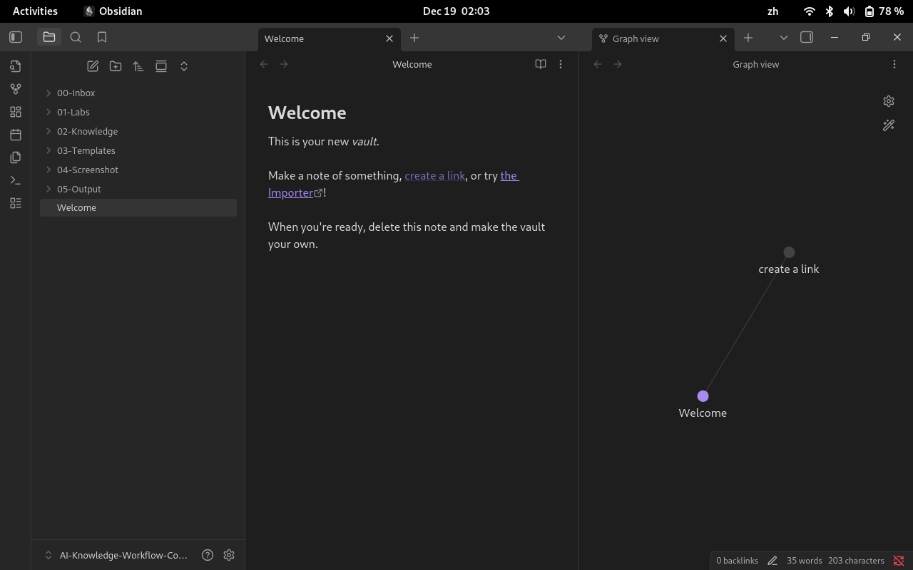
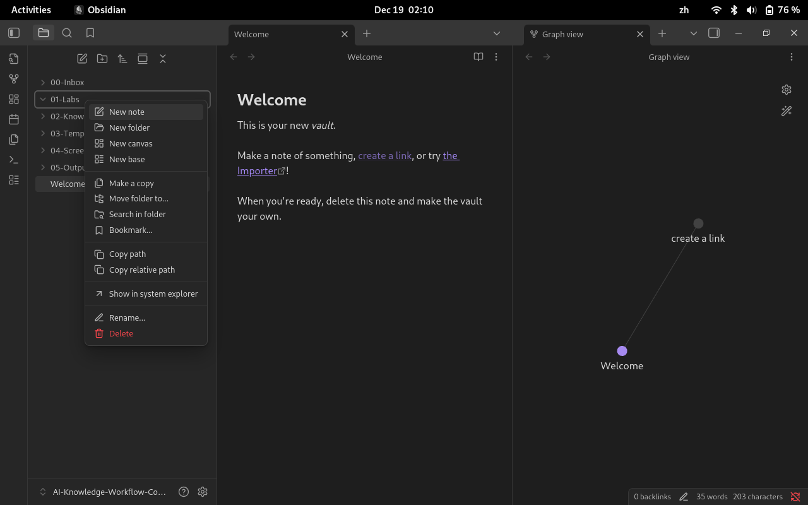
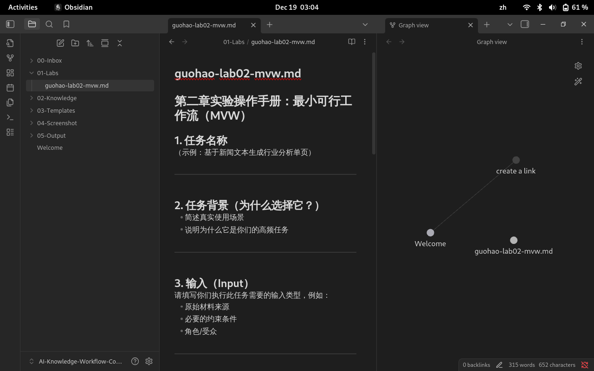

# 第二章实验操作指南：构建你的第一个知识工作流雏形

> 📌本节将完成第二课最终目标：建立可运行的 MVW。

## 1. 实验背景与目标

完成本实验后，你将能够：

1. **从指令转向系统**：理解Prompt并非单点命令，而是知识工作流中“结构化（Structure）→ 生成（Generate）”的通信协议。
2. **掌握 I-S-G-I-E 模型**：能够将模糊的任务拆解为输入、结构、生成、迭代、表达五个标准化环节。
3. **实践 S.C.O.R.E 框架**：运用结构化提示工程模型，编写具备角色、背景、目标、要求与评估要素的高质量 Prompt。
4. **跑通 MVW（最小可行工作流）**：在 15 分钟内完成一个端到端的任务闭环，实现从“原始材料”到“可用成果”的系统化路径。

<!-- end list -->

---

## 2. 实验能力说明：前置要求与学习产出

### 2.1 前置技术能力要求

	在开始 Lab02 前，请确认你已经完成以下准备：

- 已完成 **Lab01**，理解 Search 与 Generate 的差异    
- 已熟悉 Markdown 的基本结构
- 已加入课程仓库并了解小组协作方式

<!-- end list -->

### 2.2 完成实验后将掌握的核心技能

- **思维层**：形成“流程化、结构化”解决复杂问题的元能力。
- **方法层**：掌握**人为熵减**的技术，通过引入约束降低 AI 输出的不确定性。
- **执行层**：学会通过“人工自检 + 反向指令”进行有效的 **Iterate（迭代）**，而非被动接受初稿。

<!-- end list -->

---

## 3. 实验准备

在开始 Lab02 实验之前，请先完成以下准备工作。

### 3.1 学习准备（认知层面）

请确认你已经完成并理解以下内容：

- 已完成 **第一章（Module 01）** 的学习与 Lab01 实验
- 能区分 **Search（检索）** 与 **Generate（生成）** 的差异
- 理解本章的目标不是“生成更好的答案”，而是**组织生成过程**

<!-- end list -->

### 3.2 工具与环境准备（最低要求）

本实验不引入新工具，请确认你已具备以下基础环境：

- 已安装 **Obsidian**
- 已打开并使用 **Lab01 中创建的课程 Vault**
- 能在 Obsidian 中创建和编辑 Markdown 文件
- 熟悉基本的标题（`# ## ###`）与列表语法

<!-- end list -->

> 📌 说明  
> Obsidian 在本章中**仅作为 Markdown 编辑器与连续记录环境**使用，  
> 不要求使用双链、标签或插件。

---

## 4. 实验流程：构建你的 MVW

### 4.1 实验任务说明

请选择一个**你本人真实、且会反复出现的知识任务**，例如：

- 整理一节课程的学习要点
- 将零散材料汇总为一页说明
- 把原始信息转化为结构化文本

请避免选择“规模过大”或“一次性”的任务。

### 4.2 实验实操指南

#### 4.2.1 步骤1：打开已有课程 Vault

1. 启动 Obsidian
2. 打开你在 **Lab01 中已使用的课程 Vault**
3. 进入你在01-labs目录，在该目录中 **右键 → New note**





4. 将新建文件命名为：`<YourName>-lab02-mvw.md`, 例如：`guohao-lab02-nmw.md`



接下来你要做的事，打开 `<YourName>-lab02-mvw.md`，  按照 **Lab02 实验操作步骤（MVW 五步法）**，  在这个文件中完成你的全部实验内容。


<!-- end list -->

#### 4.2.2 步骤2：输入准备（Input）

列出生成前你准备的**最小输入集合**：

- 原始材料（文本 / 笔记 / 链接）
- 目标受众或角色
- 必要约束（篇幅、风格等）

#### 4.2.3 步骤3：结构设计（Structure）

参照讲义 2.4.6 的模板，将你的结构化思考翻译成 AI 可读的协议。

- **S (Setting)**：设定一个专家角色。
- **C (Context)**：喂入你整理的原始材料。
- **O (Objective)**：明确你的生成目标。
- **R (Requirements)**：设立字数、风格、格式的“护栏”。
- **E (Evaluation)**：预设自检标准，开启 AI 的“系统 2”思考。

#### 4.2.4 步骤4：生成初稿（Generate）

````markdown
# 第二章实验操作手册：最小可行工作流（MVW）

## 1. 任务名称
（示例：基于新闻文本生成行业分析单页）

---

## 2. 任务背景（为什么选择它？）
- 简述真实使用场景
- 说明为什么它是你们的高频任务

---

## 3. 输入（Input）
请填写你们执行此任务需要的输入类型，例如：
- 原始材料来源
- 必要的约束条件
- 角色/受众

---

## 4. 结构化方式（Structure）
请填写你们如何将原始信息结构化，例如：
- 大纲结构
- 表格结构
- 信息分类方式（如：事实 / 数据 / 观点）

---

## 5. SCORE Prompt（核心提交内容）

S（Setting）：
C（Context）：
O（Objective）：
R（Requirements）：
E（Evaluation）：

````

#### 4.2.5 步骤五：评估与迭代（Iterate）

至少写下 **2 轮迭代日志**，附加在文件后面，更新后再次提交：

- 发现的问题（Problem）
- 修正指令（Fix Prompt）
- 改进后的输出（Improved Output）

```markdown
## 迭代日志（Iteration Log）

### Iteration 1

**发现的问题（Problem）**  
- （例如：结构松散，段落顺序不清晰）
- （例如：生成内容偏离任务目标）

**修正指令（Fix Prompt）**  

（写出你为解决上述问题而补充或修改的指令）

### Iteration 1

**发现的问题（Problem）**  
- （例如：结构松散，段落顺序不清晰）
- （例如：生成内容偏离任务目标）

**修正指令（Fix Prompt）**  

（写出你为解决上述问题而补充或修改的指令

```

#### 4.2.6 步骤六：整理与表达（Express）

将最终结果整理为**清晰、可交付的文本**：

- 标题分级清楚
- 内容可独立阅读
- 他人可据此复现流程
---

## 5. 实验成果提交方式
### 5.1 小组目录结构（统一规范）
`
```markdown
08-Workspace/
└── Assignment-M02/
    └── <GroupName>/
        ├── README.md
        ├── zhangsan-mvw.md
        ├── lisi-mvw.md
        └── wangwu-mvw.md
```

- 小组目录由组长创建
- 每位成员提交**独立的个人 MVW 文件**

### 5.2 Pull Request 作业提交流程（正式提交）

当小组组员完提交后，需由 **组长** 提交最终 PR。

#### 5.2.1 步骤 1：Commit 规范

Commit message：

```bash

git commit -m '[M02] <YouName>提交MVW版本'

```

#### 5.2.2 步骤 2：Push 至队长仓库

```bash
git push origin main
```

#### 5.2.3 步骤 3：Pull Request到主仓库

PR标题规范：

```markdown
<GroupName>提交第二章MVW成果
```

PR 内容须包含：

```markdown
- 文件路径  
- 本次更新摘要  
```

#### 5.2.4 步骤4：等待讲师Review → Merge

讲师/助教会进行审核并给予意见。

---

## 6. 小结：第二章实验操作的“提交物”

| 提交物        | 说明                  | 位置                                       |
| ---------- | ------------------- | ---------------------------------------- |
| **MVW 文件** | `<YourName>-MVW.md` | `08-Workspace/Assignment-M02/<GroupName` |
| **最终 PR**  | 由组长提交，作为本章最终作业      | Pull Requests                            |

🎉 **恭喜完成 Lab02！**

你已经完成了从“写 Prompt”到“设计工作流”的关键跃迁。

---
## 许可声明

本文档采用 [知识共享署名--相同方式共享 4.0 国际许可协议 (CC BY--SA 4.0)](https://creativecommons.org/licenses/by-sa/4.0/deed.zh) 进行许可， &copy; 2025 Gitconomy Research社区。
