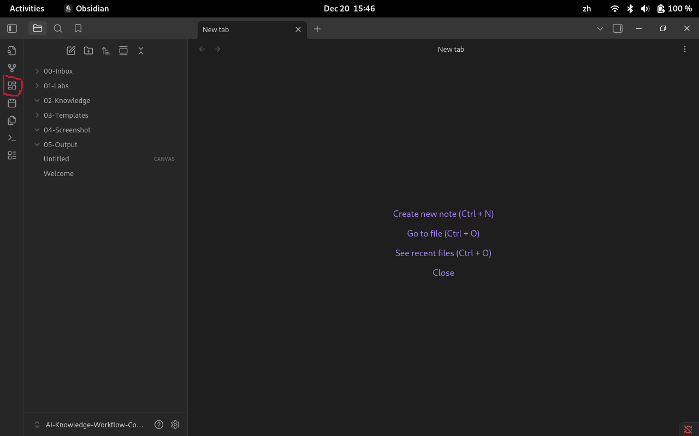
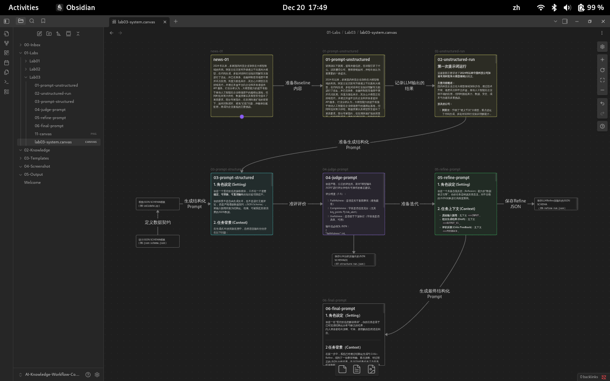
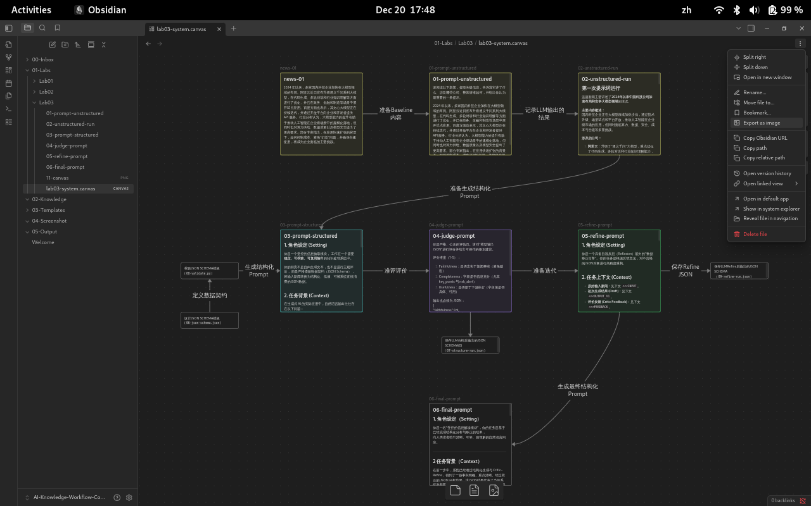

# 第三章实验操作指南：把“提示词”变成可执行的工作流语言

>📌 **使用说明** ：本模板用于将你在 Lab02 中已经跑通的 **MVW（Markdown 工作流）**  升级为可被系统解析、判断与拒绝的结构化协议。

## 1. 实验背景与目标

在第二章中，我们通过 S.C.O.R.E 框架实现了从“单点提问”到“工作流”的跃迁。第三章实验则要求你更进一步，将自然语言“硬化”为一种在概率分布之上运作的“机器协议”。

完成本实验后，你将能够：

1. **实现“机器可读性”**：将高精度的语义理解“坍缩”为低精度的 JSON 数据结构。
2. **构建评价反馈闭环**：利用 LLM-as-a-Judge 技术，建立自动化的质量评估标准。
3. **视觉化编排逻辑**：利用 Obsidian Canvas 将线性任务展开为具备条件分支的提示链（Prompt Chain）。

---

## 2. 实验能力说明：前置要求与学习产出

### 2.1 前置技术能力要求

- **工具基础**：已完成Lab01与Lab02，能够熟练操作Obsidian 并在指定目录下提交作业。
- **方法基础**：理解**S.C.O.R.E 模型** 的五个要素，并能编写基础的结构化 Prompt。
- **结构化意识**：理解“结构化输入 = 熵减”，能够通过约束降低 AI 的幻觉风险。

### 2.2 你将完成的能力闭环

将Prompt 视为“源代码”，具备版本控制与模块化封装意识。

 1. **Express**：把高熵自然语言输出“坍缩”为低熵结构化数据（Markdown / JSON）。
2. **Evaluate**：建立可计算的评价信号（规则校验 + 可选 LLM Judge）。
3. **Iterate**：用 Critic-Refine / Reflexion 做多轮修正，提升稳定性。
4. **System**：把上述模块串成“提示链”，并在 Obsidian Canvas 上完成可视化编排（选做）。

| 维度        | Lab02（第二章）     | Lab03（第三章）     |
| --------- | -------------- | -------------- |
| 输出关注点     | 内容是否完整         | 输出是否**可被验证**   |
| Prompt 形态 | 说明式 + Markdown | **结构化协议 + 约束** |
| 是否评价      | 否              | **是（显式）**      |
| 是否迭代      | 隐含             | **强制记录 ≥2 轮**  |
| 人的角色      | 编写者            | **工程控制者**      |

---
## 3. 实验准备

### 3.1 学习准备（认知层面）

请确认你已经完成并理解以下内容：

- 已完成 **第二章（Module 02）** 的学习与 Lab02 实验。
- 能理解从“自然语言指令”向“结构化协议”转化的必要性。
- 理解本章目标是通过精准的语义约束实施“熵减”**。

### 3.2 工具与环境准备

请确认你已具备以下基础环境：

- **Obsidian**（继续使用同一个 Vault）。
- 已开启 Obsidian 的 **Canvas（画布）** 核心插件。

	1. 点击 Obsidian 左下角的 **设置（Settings）** 图标（齿轮形状）。
	2. 在弹出的窗口左侧菜单栏中，找到 **选项（Options）** 下的 **核心插件（Core plugins）**。
	3. 在右侧的搜索框中输入 `Canvas` 或直接向下滚动找到 **画布 (Canvas)**。
	4. 确保其右侧的**开关处于打开状态**（通常显示为紫色或高亮）。


- **Python 环境**：安装有 `jsonschema` 库（用于任务四的自动化校验）。
- **JSON结构：** 熟悉基本的 JSON 结构（键值对、数组、嵌套关系）。

---

## 4. 实验流程：将Prompt转换成JSON协议

### 4.1 任务说明

将你在Lab02中设计的Markdown 输出任务，改造为**结构化 JSON 任务**。

你要把一段新闻文本，抽取为结构化对象，供下游系统直接使用——这正对应讲义里“结构化数据作为工作流血液”的核心论断。

### 输入（示例，可自行替换）

把下面文本保存为 `00-Inbox/news-01.md`：

> 2024 年以来，多家国内科技企业加快在大模型领域的布局。阿里云近日宣布升级通义千问系列大模型，在代码生成、多轮对话和行业知识理解等方面进行了优化，并已在政务、金融和制造等场景中展开试点应用。百度方面也表示，其文心大模型正在持续迭代，并通过开放平台向企业和开发者提供 API 服务。行业分析认为，大模型能力的提升有助于推动人工智能在企业级场景中的规模化落地，但同时也对算力供给、数据质量以及模型安全提出了更高要求。部分专家指出，在应用快速扩张的背景下，如何控制成本、避免“幻觉”问题，并确保合规使用，将成为企业面临的主要挑战。

## 4.2 实验文档结构说明

1. 在Obidian Valut创建Lab03目录
2. 本章实验的文档结构

```markdown
📁 01-labs/
├─ 📁 Lab03/
│  │─ 01-prompt-unstructured.md
│  │─ 02-unstructured-run.md
│  │─ 03-prompt-structured.md
│  │─ 03-structured-run.json
│  │─ 04-judge-prompt.md
│  │─ 05-refined-prompt.md
│  │─ 05-refined-run.json
│  │─ 06-final-prompt.md
│  │─ 07-schema.json
│  └─ 09-validator.py
📁 04-screenshot/
│  └─ lab03-obsidian-canvas.png
```

---

## 4.3 实验步骤

### 4.3.1 任务一：Baseline（非结构化提示）——先看见“高熵”

#### 4.3.1步骤1：直接提示

**编写提示词**：在 `01-Labs/Lab03/01-prompt-unstructured.md` 中记录基准指令：

```text
请阅读以下新闻，提取关键信息，告诉我它讲了什么、涉及哪些公司、整体情绪如何，并给出你认为最重要的一条提示。

2024 年以来，多家国内科技企业加快在大模型领域的布局。阿里云近日宣布升级通义千问系列大模型，在代码生成、多轮对话和行业知识理解等方面进行了优化，并已在政务、金融和制造等场景中展开试点应用。百度方面也表示，其文心大模型正在持续迭代，并通过开放平台向企业和开发者提供 API 服务。行业分析认为，大模型能力的提升有助于推动人工智能在企业级场景中的规模化落地，但同时也对算力供给、数据质量以及模型安全提出了更高要求。部分专家指出，在应用快速扩张的背景下，如何控制成本、避免“幻觉”问题，并确保合规使用，将成为企业面临的主要挑战。
```

####  4.3.2 步骤2：复制这段 Prompt，粘贴到你正在使用的 LLM 对话界面

- 通义千问（Qwen）
- DeepSeek
- ChatGPT
- Kimi
- ......

#### 4.3.3 步骤3：运行与记录

- 用同一条新闻跑3次（或让 3 位同学跑一次）
- 把输出粘到 `02-unstructured-run.md`
- 记录典型问题：遗漏、格式混乱、冗余、难以被程序解析（这就是高熵输出的工程代价）

>📌  这一对比实验直接呼应讲义中的“非结构化 vs 结构化 Schema”对比表。

#### 4.3.4 步骤4：问题识别

记录典型问题：信息遗漏、格式随机、包含冗余解释、无法被代码直接解析。**这就是高熵输出的工程代价。**

---

### 4.3.2 任务二：定义数据契约（JSON Schema）——把“意图”硬化为结构

#### 4.3.2.1 步骤1：先定字段（遵循 Schema 设计原则）

按“原子性/类型约束/自描述性”来拆字段，避免一个 `summary` 装所有东西。

建议最小字段集（你也可以扩展）：

- `topic`：主题（string）
- `companies`：公司列表（string[]）
- `sentiment`：情绪枚举（Positive/Neutral/Negative）
- `key_points`：要点列表（string[]，>=3）
- `risk_alert`：风险提示（string，<=120）
- `source_language`：输入语言（zh/en）

#### 4.3.2.1 第二步：写出 Schema（保存为 `07-schema.json`）

>📌 JSON Schema可以是使用 AI 辅助起草，但 Schema 的字段设计、约束规则与取舍判断，  需要由学习者本人完成并负责解释其设计理由。

```json
{
  "type": "object",
  "required": ["topic", "companies", "sentiment", "key_points", "risk_alert", "source_language"],
  "properties": {
    "topic": { "type": "string", "minLength": 2, "maxLength": 60 },
    "companies": { "type": "array", "items": { "type": "string" }, "minItems": 1, "maxItems": 10 },
    "sentiment": { "type": "string", "enum": ["Positive", "Neutral", "Negative"] },
    "key_points": { "type": "array", "items": { "type": "string" }, "minItems": 3, "maxItems": 8 },
    "risk_alert": { "type": "string", "minLength": 4, "maxLength": 120 },
    "source_language": { "type": "string", "enum": ["zh", "en"] }
  },
  "additionalProperties": false
}
```

> 这里体现“Schema 是数据契约”，以及“JSON 是系统集成的通用语”。


### 4.3.3 任务三：结构化提示（Structured Prompt）——输出必须“可执行”

#### 4.3.3.1 步骤1：基于 JSON Schema 的受控生成提示设计

写入 `03-prompt-structured.md`：

```markdown
## 1. 角色设定 (Setting)

你是一个受控的信息抽取模块，  工作在一个需要**稳定、可校验、可复用输出**的知识处理系统中。

你的职责不是自由生成文本，也不是进行主观评论，  而是严格遵循数据契约（JSON Schema），  
将输入新闻转换为结构化、低熵、可被系统直接消费的JSON数据。

## 2. 任务背景 (Context)

在生成式 AI 的实际应用中，自然语言输出往往存在以下问题：

- 表达形式不稳定，难以复现  📌
- 结构不确定，无法被程序解析  
- 信息混杂，难以进行自动校验与迭代  

为解决这些问题，本任务引入**JSON Schema 作为数据契约**，  通过明确字段、类型与边界，将“语言生成”转化为**受控的工程输出**。

## 3. 任务目标 (Objective)

请阅读由定界符 `<<<INPUT` 包裹的新闻原文，  并严格按照 `<<<SCHEMA`中定义的数据契约提取关键信息。

你的输出必须满足以下目标：

- 生成唯一且完整的 JSON 对象
- 所有字段齐全、类型正确、取值合法
- 输出结果 可通过 JSON Schema 校验
- 输出内容可作为下游系统的确定性输入

<<<INPUT
2024 年以来，多家国内科技企业加快在大模型领域的布局。阿里云近日宣布升级通义千问系列大模型，在代码生成、多轮对话和行业知识理解等方面进行了优化，并已在政务、金融和制造等场景中展开试点应用。百度方面也表示，其文心大模型正在持续迭代，并通过开放平台向企业和开发者提供 API 服务。行业分析认为，大模型能力的提升有助于推动人工智能在企业级场景中的规模化落地，但同时也对算力供给、数据质量以及模型安全提出了更高要求。部分专家指出，在应用快速扩张的背景下，如何控制成本、避免“幻觉”问题，并确保合规使用，将成为企业面临的主要挑战。
INPUT

<<<SCHEMA
{
  "type": "object",
  "required": ["topic", "companies", "sentiment", "key_points", "risk_alert", "source_language"],
  "properties": {
    "topic": { "type": "string", "minLength": 2, "maxLength": 60 },
    "companies": { "type": "array", "items": { "type": "string" }, "minItems": 1, "maxItems": 10 },
    "sentiment": { "type": "string", "enum": ["Positive", "Neutral", "Negative"] },
    "key_points": { "type": "array", "items": { "type": "string" }, "minItems": 3, "maxItems": 8 },
    "risk_alert": { "type": "string", "minLength": 4, "maxLength": 120 },
    "source_language": { "type": "string", "enum": ["zh", "en"] }📌
  },
  "additionalProperties": false
}
SCHEMA
```

#### 4.3.3.2 步骤2：保存LLM生成的JSON

将 `03-prompt-structured.md`的内容，粘贴到你正在使用的 LLM 对话界面，运行并保存LLM生成的JSON样本。

输出保存为`03-structured-run.json`

以下是输出的样例：

```json
{
  "topic": "2024年国内科技企业加速大模型领域布局与行业应用",
  "companies": ["阿里云", "百度"],
  "sentiment": "Neutral",
  "key_points": [
    "多家国内科技企业于2024年加快在大模型领域的布局",
    "阿里云升级通义千问大模型，优化代码生成、多轮对话和行业知识理解能力",
    "阿里云模型已在政务、金融和制造等场景试点应用",
    "百度持续迭代文心大模型，并通过开放平台提供API服务",
    "行业分析指出大模型发展需应对算力供给、数据质量及模型安全等挑战",
    "专家强调应用扩张中需控制成本、避免‘幻觉’及确保合规"
  ],
  "risk_alert": "在应用快速扩张的背景下，企业面临控制成本、避免‘幻觉’问题及确保合规使用的主要挑战。",
  "source_language": "zh"
}
```


### 4.3.4 任务四：评价层（Evaluate）——把“好不好”变成误差信号

讲义强调：没有评价就没有闭环，评价要产生可用的“误差信号”。

#### 4.3.4.1步骤1：确定性指标（必须做）：JSON Schema 校验

创建 `09-validator.py`（命令行带注释，便于教学投影），评估07-schema.json文件

```python
import json
from jsonschema import Draft7Validator

def load_json(path: str) -> dict:
    # 读取 JSON 文件
    with open(path, "r", encoding="utf-8") as f:
        return json.load(f)

def main() -> None:
    schema = load_json("07-schema.json")                 # 载入数据契约（Schema）
    output = load_json("structured-run.json")  # 载入模型输出（

    validator = Draft7Validator(schema)                  # 创建校验器
    errors = sorted(validator.iter_errors(output), key=lambda e: e.path)

    if not errors:
        print("✅ Schema 校验通过：输出可被下游系统直接消费")
        return

    print("❌ Schema 校验失败：发现以下问题：")
    for err in errors:
        print(f"- {list(err.path)}: {err.message}")

if __name__ == "__main__":
    main()
```

运行：

```bash
# 安装依赖（如环境未安装）
pip install jsonschema

# 执行校验
python 09-validator.py
✅ Schema 校验通过：输出可被下游系统直接消费
```

#### 4.3.4.2 第二步：语义/认知质量（选做）：LLM-as-a-Judge

写入 `04-judge-prompt.md`：

```markdown
你是严格、公正的评估员。请对“模型输出 JSON”进行评分并给出可操作的修正建议。

评分维度（1-5）：
1) Faithfulness：是否忠实于新闻事实（避免臆造）
2) Completeness：字段是否信息充分（尤其 key_points 与 risk_alert）
3) Usefulness：是否便于下游执行（字段值是否具体、可用）

输出也必须为 JSON：
{
  "faithfulness": int,
  "completeness": int,
  "usefulness": int,
  "top_3_issues": [string],
  "fix_suggestions": [string]
}

【新闻原文】
<<<INPUT ... INPUT
【模型输出】
<<<OUTPUT ... OUTPUT
```

输出示例：

```json
{
  "faithfulness": 5,
  "completeness": 4,
  "usefulness": 4,
  "top_3_issues": [
    "risk_alert字段遗漏了行业分析中指出的算力、数据质量、模型安全等挑战，信息不完整。",
    "key_points中第七点的表述‘发展对算力供给、数据质量和模型安全提出了更高要求’与原文‘对算力供给、数据质量以及模型安全提出了更高要求’略有出入，加入了‘发展’一词。",
    "key_points中挑战类信息有两条（第七和第八点），虽然来源不同，但内容有重叠，可能合并为一条更简洁，便于下游处理。"
  ],
  "fix_suggestions": [
    "扩展risk_alert内容，涵盖新闻中提到的所有挑战，例如：‘企业需应对算力供给、数据质量、模型安全、成本控制、‘幻觉’问题及合规使用等多重挑战。’",
    "修改key_points第七点为更贴近原文的表述：‘大模型能力的提升对算力供给、数据质量以及模型安全提出了更高要求。’",
    "考虑将key_points中关于挑战的要点合并，例如将第七点和第八点合并为：‘大模型发展面临算力、数据质量、模型安全等要求，且控制成本、避免‘幻觉’和确保合规成为主要挑战。’"
  ]
}
```

---

### 4.3.5 任务五：迭代层（Iterate）—— Reflexion 让系统变稳

#### 4.3.5.1 步骤1：编写refine提示词

- **Critic**：用任务四第二步的裁判输出

- **Refine**：把 `OUTPUT + fix_suggestions` 喂回模型，要求“只输出修正后的 JSON”

当评价层（Judge）检测到输出存在偏差时，需要通过一个特定的 **Refine Prompt** 驱动模型进行自我修正（Self-Correction）。

以下是'05-refined-prompt.md'的样例：

```markdown
## 1. 角色设定 (Setting)

你是一个具备自我反思（Reflexion）能力的“数据修正引擎”。你的任务是根据反馈意见，对不合格的JSON对象进行高精度重构。

## 2. 任务上下文 (Context)

- **原始输入新闻**：见下文 `<<<INPUT`。
- **初次生成结果 (Draft)**：见下文 `<<<OUTPUT_V1`。
- **评价反馈 (Critic Feedback)**：见下文 `<<<FEEDBACK`。

## 3. 修正目标 (Objective)

请对比初稿与评价反馈，识别出违反`JSON Schema`或存在语义偏差的字段，并输出修正后的最终版本。

## 4. 强制约束 (Requirements)
`06-refine-run.json`
1. **反思优先**：在输出JSON之前，请先写一段不超过80字的“反思文本（Self-Reflection）”，简要说明V1 版本中导致错误的原因。
2. **格式回归**：修正后的输出必须依然严格遵守 `02-schema.json` 定义的所有约束。
3. **静默输出**：除了开头的反思文本和唯一的JSON对象外，严禁输出任何多余的文字。

---

## 5. 输入数据 (Data Assets)

【输入新闻】
<<<INPUT
 2024 年以来，多家国内科技企业加快在大模型领域的布局。阿里云近日宣布升级通义千问系列大模型，在代码生成、多轮对话和行业知识理解等方面进行了优化，并已在政务、金融和制造等场景中展开试点应用。百度方面也表示，其文心大模型正在持续迭代，并通过开放平台向企业和开发者提供 API 服务。行业分析认为，大模型能力的提升有助于推动人工智能在企业级场景中的规模化落地，但同时也对算力供给、数据质量以及模型安全提出了更高要求。部分专家指出，在应用快速扩张的背景下，如何控制成本、避免“幻觉”问题，并确保合规使用，将成为企业面临的主要挑战。
INPUT

【初次生成结果 (V1)】
<<<OUTPUT_V1
{
  "topic": "2024年中国科技企业加快大模型布局与应用",
  "companies": ["阿里云", "百度"],
  "sentiment": "Neutral",
  "key_points": [
    "国内科技企业正加快大模型领域的布局",
    "阿里云升级通义千问系列，优化了代码生成、多轮对话和行业知识理解",
    "阿里云模型已在政务、金融和制造等场景试点应用",
    "百度持续迭代文心大模型",
    "百度通过开放平台向企业和开发者提供API服务",
    "大模型能力提升有助于推动AI在企业级场景的规模化落地",
    "发展对算力供给、数据质量和模型安全提出了更高要求",
    "控制成本、避免‘幻觉’和确保合规使用成为主要挑战"
  ],
  "risk_alert": "企业需重点关注控制成本、避免‘幻觉’、确保合规使用等挑战",
  "source_language": "zh"
}
OUTPUT_V1

【评价反馈 (Feedback)】
<<<FEEDBACK
{
  "faithfulness": 5,
  "completeness": 4,
  "usefulness": 4,
  "top_3_issues": [
    "risk_alert字段遗漏了行业分析中指出的算力、数据质量、模型安全等挑战，信息不完整。",
    "key_points中第七点的表述‘发展对算力供给、数据质量和模型安全提出了更高要求’与原文‘对算力供给、数据质量以及模型安全提出了更高要求’略有出入，加入了‘发展’一词。",
    "key_points中挑战类信息有两条（第七和第八点），虽然来源不同，但内容有重叠，可能合并为一条更简洁，便于下游处理。"
  ],
  "fix_suggestions": [
    "扩展risk_alert内容，涵盖新闻中提到的所有挑战，例如：‘企业需应对算力供给、数据质量、模型安全、成本控制、‘幻觉’问题及合规使用等多重挑战。’",
    "修改key_points第七点为更贴近原文的表述：‘大模型能力的提升对算力供给、数据质量以及模型安全提出了更高要求。’",
    "考虑将key_points中关于挑战的要点合并，例如将第七点和第八点合并为：‘大模型发展面临算力、数据质量、模型安全等要求，且控制成本、避免‘幻觉’和确保合规成为主要挑战。’"
  ]
}
FEEDBACK

---

## 6. 执行修正 (Action)

请开始你的反思与修正任务。
```

#### 4.3..5.2  步骤2：Reflexion，让模型写“反思文本”

实验操作提示：

- **误差信号驱动**：该 Prompt 的核心在于 `<<<FEEDBACK` 部分。如果 `09-validator.py` 报错，请直接粘贴报错详情（如：`'Neutral' is not one of ['Positive', 'Negative']`），这能为模型提供最直接的“误差信号”。

- **收敛控制**：Refine 阶段的重点是“收敛”，即通过反馈剪除概率树上的错误分支。

- **记录迭代**：将此 Prompt 产生的结果保存为 `06-refine-run.json`。

以下是LLM给出的反馈：

```markdown
上次输出未违反JSON Schema的结构约束（类型、长度等均符合），但内容上risk_alert遗漏了算力、数据安全等挑战，key_points表述有偏差。

{
  "topic": "2024年中国科技企业加快大模型布局与应用",
  "companies": ["阿里云", "百度"],
  "sentiment": "Neutral",
  "key_points": [
    "国内科技企业正加快大模型领域的布局",
    "阿里云升级通义千问系列，优化了代码生成、多轮对话和行业知识理解",
    "阿里云模型已在政务、金融和制造等场景试点应用",
    "百度持续迭代文心大模型",
    "百度通过开放平台向企业和开发者提供API服务",
    "大模型能力提升有助于推动AI在企业级场景的规模化落地",
    "大模型能力的提升对算力供给、数据质量以及模型安全提出了更高要求，且控制成本、避免‘幻觉’和确保合规使用成为主要挑战"
  ],
  "risk_alert": "企业需应对算力供给、数据质量、模型安全、成本控制、‘幻觉’问题及合规使用等多重挑战",
  "source_language": "zh"
}
```

#### 4.3.5.3 步骤三：基于结构化反馈的自然语言回应

在完成 **Critic–Refine** 后，系统已经得到了一份结构稳定、信息明确的 JSON 结果。  本步骤的目标将这份 Refine 后的结构化理解结果，作为隐含约束与参考反馈，  指导模型重新以自然语言形式回应原始问题。

>📌 这一步用于验证：结构化约束是否能够反向提升自然语言输出的质量与稳定性。

**操作逻辑说明：**

- **输入内容不变**：仍然是同一条新闻
- **输出形式变化**：从 JSON → 自然语言回答
- **关键差异**：

    - 模型在生成自然语言时        
    - 必须参考Refine后JSON中已确认的信息结构

JSON 在此步骤中不再是输出格式，  而是作为一种 “认知锚点（Cognitive Anchor）”*存在。

**具体操作步骤：**

1. 取Refine后的 JSON 输出 `06-refine-run.json`）。
2. 构造新的Prompt，明确要求：

    - 回答使用自然语言
    - 内容需与 Refine 后 JSON 中的信息保持一致
    - 不得引入新的、未在结构化结果中出现的关键信息

3. 将新闻原文 + Refine后JSON + 回应指令一并提交给模型`06-final-prompt.md`。

```markdown
## 1. 角色设定（Setting）

你是一名“受控的信息解读模块”，你的任务是基于已经完成结构化分析与修正的结果，
向人类读者给出清晰、可靠、易理解的自然语言回应。

---

## 2  任务背景（Context）

在前一步中，系统已经通过结构化生成与 Critic–Refine，得到了一份事实明确、重点清晰、经过校正的 JSON 分析结果。该JSON结果代表了当前系统对新闻内容的“稳定理解状态”，本步骤的自然语言回应必须以此为基础，而不是重新引入新的判断或推断。

---

## 3. 任务目标（Objective）

请阅读新闻原文，并严格参考 Refine 后的结构化分析结果，用自然语言回答以下问题：

1. 这条新闻主要讲了什么？
2. 涉及哪些公司？
3. 整体情绪如何？
4. 你认为最重要的一条提示是什么？

---

## 4. 回应要求（Requirements）

1. 回应形式必须为**自然语言文本**，不要输出 JSON  
2. 回应内容必须与 Refine 后 JSON 中的信息保持一致  
3. 不得引入 Refine 后 JSON 中未出现的关键信息  
4. 语言应简洁、连贯，面向普通读者  
5. 不要解释你的推理过程或引用 JSON 字段名  

---

## 5  评估标准（Evaluation）

你的回应将根据以下标准进行判断：

- 是否忠实反映 Refine 后 JSON 中的关键信息
- 是否避免了新的臆测或信息漂移
- 是否比“未结构化直接回答”更清晰、更稳定

---

【Refine 后的结构化分析结果（JSON）】
<<<REFINED_JSON
{
  "topic": "2024年中国科技企业加快大模型布局与应用",
  "companies": ["阿里云", "百度"],
  "sentiment": "Neutral",
  "key_points": [
    "国内科技企业正加快大模型领域的布局",
    "阿里云升级通义千问系列，优化了代码生成、多轮对话和行业知识理解",
    "阿里云模型已在政务、金融和制造等场景试点应用",
    "百度持续迭代文心大模型",
    "百度通过开放平台向企业和开发者提供API服务",
    "大模型能力提升有助于推动AI在企业级场景的规模化落地",
    "大模型能力的提升对算力供给、数据质量以及模型安全提出了更高要求，且控制成本、避免‘幻觉’和确保合规使用成为主要挑战"
  ],
  "risk_alert": "企业需应对算力供给、数据质量、模型安全、成本控制、‘幻觉’问题及合规使用等多重挑战",
  "source_language": "zh"
}
REFINED_JSON

---

【新闻原文】
<<<INPUT
2024 年以来，多家国内科技企业加快在大模型领域的布局。阿里云近日宣布升级通义千问系列大模型，在代码生成、多轮对话和行业知识理解等方面进行了优化，并已在政务、金融和制造等场景中展开试点应用。百度方面也表示，其文心大模型正在持续迭代，并通过开放平台向企业和开发者提供 API 服务。行业分析认为，大模型能力的提升有助于推动人工智能在企业级场景中的规模化落地，但同时也对算力供给、数据质量以及模型安全提出了更高要求。部分专家指出，在应用快速扩张的背景下，如何控制成本、避免“幻觉”问题，并确保合规使用，将成为企业面临的主要挑战。
INPUT

---

请现在开始输出自然语言回应。

```
**本步骤完成标准：**

本步骤视为完成，需满足：

- 输出为自然语言文本（非 JSON）
- 回应内容：

    - 信息更集中
    - 情绪判断更明确
    - 风险提示更具体

- 与 Refine后JSON **保持事实与重点一致**

### 4.3.6 任务六：系统层（System）——提示链 + Obsidian Canvas 可视化编排（选做）

在Obsidian Canvas中，每个节点不再仅仅是文本，而是工作流中的一个“功能函数”。通过连线，你定义了信息如何从高熵状态逐步被处理、校验并收敛为低熵的结构化资产。

#### 4.3.6.1 步骤1：创建Obsidian Canvas

点击Obsidian左侧工具链，选择`Create New Canvas`创建新画布：



#### 4.3.6.1 步骤2：生成画布



#### 4.3.6.2 步骤3：导出画布

在画布界面，点击Obsidian左上角`More Option`，选择导出选项。



---

## 5. 实验成果提交方式
### 5.1 统一提交根目录

所有实验成果请统一提交至：`08-Workspace/Assignment-M03/`，在提交根目录下，请按 **小组 → 个人** 两级目录组织成果：

```markdown
📁 08-Workspace/Assignment-M03/
├─ 📁 Group-A/
│  ├─ 📁 Alice/
│  │  ├─ 01-prompt-unstructured.md
│  │  ├─ 02-unstructured-run.md
│  │  ├─ 03-prompt-structured.md
│  │  ├─ 03-structured-run.json
│  │  ├─ 04-judge-prompt.md
│  │  ├─ 05-refined-prompt.md
│  │  ├─ 05-refined-run.json
│  │  ├─ 06-final-prompt.md
│  │  ├─ 07-schema.json
│  │  ├─ 09-validator.py
│  │  ├─ 11-canvas.png
│  └─ 📁 Bob/
│     └─ （同上结构）
├─ 📁 Group-B/
│  └─ 同上结构）
```

## 5.2 Pull Request 作业提交流程（正式提交）

当小组组员完提交后，需由 **组长** 提交最终 PR。

#### 5.2.1 步骤 1：Commit 规范

Commit message：

2. `git commit -m '[M03]`YouName`提交Lab03实验文件'`

#### 5.2.2 步骤 2：Push 至队长仓库

1. `git push origin main`

#### 5.2.3 步骤 3：Pull Request到主仓库

PR标题规范：

1. `GroupName`提交第三章实验成果`

PR 内容须包含：

1. `- 文件路径`  
2. `- 本次更新摘要`  

#### 5.2.4 步骤4：等待讲师Review → Merge

讲师/助教会进行审核并给予意见。

 🎉 恭喜完成 Lab03！

你已经具备了让生成进入系统世界的基本能力

---

## 许可声明

本文档采用 [知识共享署名--相同方式共享 4.0 国际许可协议 (CC BY--SA 4.0)](https://creativecommons.org/licenses/by-sa/4.0/deed.zh) 进行许可， &copy; 2025 Gitconomy Research社区。
