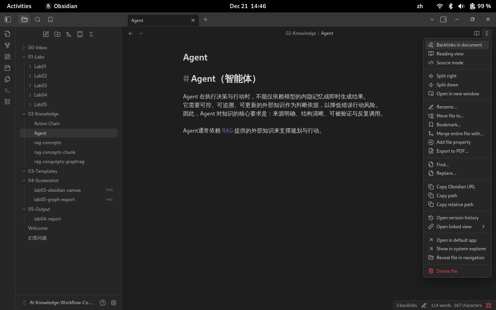
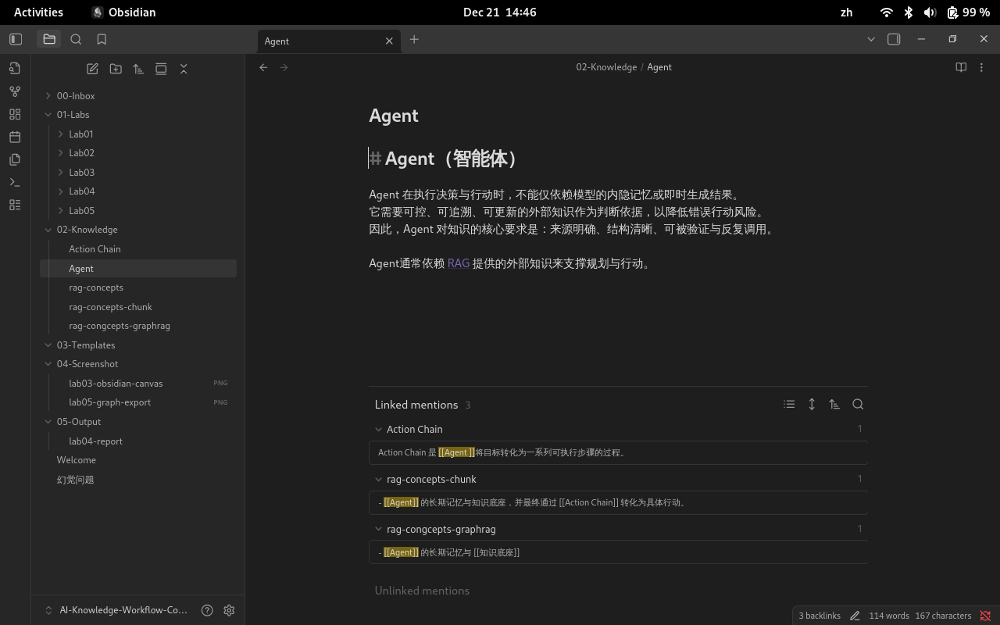
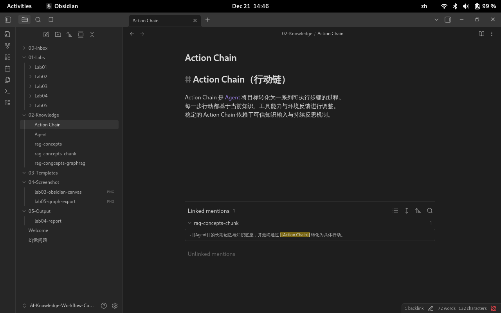
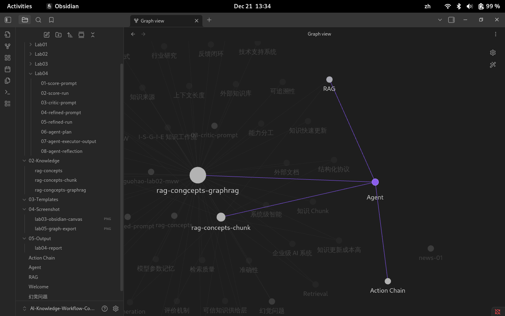

# 第五章实验手册：在 Obsidian 中构建本地智能知识助手（RAG + GraphRAG + 行动链）

>📌 **实验宗旨**：本章实验是前四章能力的集成落地。你将利用 **Obsidian** 作为基座，通过构建 **RAG（检索增强生成）** 和 **GraphRAG（图增强检索）** 体系，赋予知识库“可检索”与“可推理”的能力，并最终通过 **行动链（Action Chain）** 实现从知识到执行的闭环。

## 1. 实验目标与学习成果

本章实验不是搭建一个“自动运行的 AI 系统”，而是在 **Obsidian 本地环境**中，**手动构建并运行**一个可解释、可审计、可演化的**智能知识助手原型**：

1. **构建检索增强体系 (RAG)**：利用 YAML 元数据与合成问题，实现基于语义的高精度知识召回。
2. **构建图谱推理体系 (GraphRAG)**：利用双向链接建立知识拓扑，实现跨实体的复杂关系推理。
3. **设计智能体行动链 (Agentic Action Chain)**：实践 **ReAct 模式**（推理 + 行动），让助手能够根据知识库内容自主规划并执行任务。
4. **落地本地环境**：在 Obsidian 中配置运行环境，实现“所见即所得”的智能协作。

最终学员章嗯我使用 Obsidian 作为本地知识工作台，构建一个具 **检索 → 评估 → 行动 → 反思** 能力的智能知识助手原型。

---
## 2. 实验能力说明：前置要求与学习产出

### 2.1 前置成果检查

请确认以下成果已存在（来自 Lab03 / Lab04）：

- 至少一份 **S.C.O.R.E Prompt**（`03-score-prompt.md`）
- 至少一份 **Critic / Refine Prompt**（`04-critic-prompt.md` / `0-refine-prompt.md`）
- 至少一次 **行动决策 JSON / YAML**（来自 Lab04）

### 2.2启用核心内置功能

在 **Settings → Core plugins** 中启用：

- `Backlinks`/`Outgoing links`：用于显式呈现知识之间的双向关系
- `Graph view`：用于观察 Chunk 与概念网络的整体结构
- `Command palette`加速在“感知–评估–行动”之间的切换
- `Templates`：用于规范化 Agent 输出与行动记录
- `Daily notes`：作为 Agent 的 Reflect / 反思层载体

上述功能共同构成了本课程中 **GraphRAG 的最小可视与可操作基础**：

### 2.3 核心技能产出

- **知识工程层**：掌握面向 AI 的“分块（Chunking）”与“检索路径”设计。
- **代理系统层**：能够独立设计具备**自检与反馈逻辑**的自主智能体流。

---

## 3. 实验准备

### 3.1 学习准备（认知层）

在进入 Lab05 实验前，请确认你已经理解以下核心概念：

- **掌握 ReAct 推理模式**：理解智能体如何通过“推理（Reasoning）”引导“行动（Action）”，并根据“观察（Observation）”进行修正。
- **理解检索层差异**：能区分朴素 **RAG**（点状语义匹配）与 **GraphRAG**（结构化关联推理）在解决复杂问题时的不同作用。
- **识别智能体生命周期**：理解 **Planning（规划）**、**Tool Use（工具调用）** 与 **Reflection（反思）** 构成的行动闭环。

### 3.2 工具与环境准备

请确认你已具备以下基础实验环境，这是构建本地助手的基座：

- **Obsidian 软件环境**：

    - 已打开并持续使用课程 **Vault** 仓库。
    - 确保已开启核心插件 **Canvas（画布）**，我们将在此编排 Agent 行动链。
    - 确保已开启核心插件 **Graph View（关系图谱）**，用于验证 GraphRAG 的连接逻辑。

- **知识资产储备**：

    - 拥有在 Lab04 中完成重构的 `rag-concepts-chunk.md` 笔记。
    - 该笔记必须包含完整的 **YAML Frontmatter**（具备 `uuid`, `type`, `status` 等字段）。
    - 该笔记必须包含由 **原子化拆分** 生成的 **Synthetic Questions（合成问题库）**。

`rag-conecpts-chunk.md`文件示例：

```markdown
# 检索增强生成（RAG）

## 1. 什么是 RAG？（What）

**检索增强生成（Retrieval-Augmented Generation，[[RAG]]）**  
是一种将**外部知识检索（[[Retrieval]]）**与**大语言模型生成（[[Generation]]）**相结合的知识处理范式。

在 RAG 中，模型并非仅依赖自身参数进行回答，而是在生成之前，
先从一个**可控、可更新的知识源**中检索相关内容，
再将检索结果作为上下文输入给模型完成生成。

这一机制使生成结果具备更高的**准确性、可控性与可追溯性**。

---

## 2. 为什么需要 RAG？（Why）

在仅依赖 Prompt 的纯生成式模型中，常见工程问题包括：

- **[[幻觉问题]]**：模型可能生成不存在或不准确的信息  
- **[[知识不可控]]**：无法确认模型回答基于哪些事实  
- **[[知识更新成本高]]**：更新知识通常需要重新训练或微调模型  

[[RAG]] 通过“**先检索、再生成**”的机制，
将回答锚定在外部文档之上，从工程层面显著缓解上述问题。

---

## 3. RAG 的基本工作流程是什么？（How）

一个最小可行的 [[RAG]] 工作流程通常包含以下阶段：

1. **Query 构造**：将用户问题转化为可检索的查询表达  
2. **Retrieval**：从向量库或文档库中检索相关内容  
3. **Context 拼接**：将检索结果整理为模型可理解的上下文  
4. **Generation**：将上下文与 Prompt 一并输入给 LLM 生成回答  

在本课程中，该流程被抽象为 [[I-S-G-I-E 知识工作流]]，
用于指导从输入到输出的完整生成路径设计。

---

## 4. RAG 的核心价值是什么？（Value）

从工程与系统视角看，[[RAG]] 具备以下核心价值：

- **降低幻觉风险**：回答基于真实文档而非纯模型猜测  
- **增强可解释性**：可追溯“答案来自哪些文档 Chunk”  
- **支持快速更新**：更新知识库 ≠ 重新训练模型  
- **工程友好**：适合集成到业务系统与 [[Agent 决策系统]]  

这些特性使 RAG 成为企业级 AI 系统中的关键基础组件。

---

## 5. RAG 与 Prompt Engineering 的关系是什么？

[[Prompt Engineering]] 主要解决的是：

> **“模型应该如何表达与思考？”**

而 [[RAG]] 解决的是：

> **“模型基于什么事实与知识作答？”**

二者并非替代关系，而是**分工协作**：

- Prompt 决定 **生成方式**
- RAG 决定 **知识来源**

在工程实践中，稳定系统通常需要二者协同使用。

---

## 6. RAG 的典型应用场景有哪些？（Where）

[[RAG]] 常被应用于以下场景：

- 企业内部知识问答（制度 / 文档 / 规范）
- 行业研究与报告辅助生成
- 客服与技术支持系统
- [[Agent]] 的长期记忆与知识底座  

在这些场景中，RAG 主要承担“**可信知识供给层**”的角色。

---

## 7. 使用 RAG 时需要注意哪些挑战？（Limits）

尽管 [[RAG]] 提供了显著优势，但仍存在关键工程挑战：

- **检索质量决定生成上限**
- **Chunk 切分策略影响召回精度**
- **上下文长度与推理成本需要权衡**
- **仍需评价与反馈机制避免错误累积**

因此，RAG 并不是“自动正确”，而是一种**可被工程化管理的改进路径**。

---

## 8. RAG 在课程体系中的位置是什么？（Course Mapping）

在《生成式思维与知识工作流》课程中，[[RAG]] 位于承上启下的位置：

- 基于 [[MVW]] 跑通最小生成闭环  
- 承接 [[结构化协议]]，实现低熵输出  
- 为 [[GraphRAG]] 与 [[Agent 决策系统]] 提供知识基础  

它是从“文本生成”迈向“系统级智能”的关键中间层。

---

## 9. 修改记录（Version Notes）

- v0.1：概念定义与基础流程说明  
- v0.2：补充工程价值、应用场景与课程映射  
```

- **模型与推理能力**：

    - 拥有稳定访问主流大语言模型（如 DeepSeek R1/V3, Qwen3等）的权限，用于模拟 Agent 的逻辑编排。

---

## 4. 实验流程：构建本地智能知识助手

### 4.1 任务说明

你将使用 **Obsidian + 本地知识库 + Prompt 协议**，构建一个可被你操控、可被你理解、可被你审计的本地智能知识助手。

你将通过三个核心环节，实现从“静态知识管理”到“代理式工作流”的跨越：

- **RAG 语义检索增强：** 利用 YAML 元数据中的“合成问题”作为语义锚点，提升知识召回的精确度，确保 AI 能够基于你的私有笔记准确回答问题。
- **GraphRAG 拓扑推理：** 利用双向链接建立知识间的关联，模拟 AI 如何在复杂的知识图谱上进行路径遍历，解决跨文档的综合性推理任务。
- **行动链（Action Chain）模拟：** 手动运行 **Planning-Tool-Reflection** 闭环。你将看到助手如何自主拆解目标、根据检索到的知识调整方案，并通过自我反思修正错误。

### 4.2 实验文档结构说明

1. 在Obidian Valut创建Lab05目录
2. 本章实验的文档结构

```markdown
📁 AI-Knowledge-Workflow-Course
├─ 📁 01-Labs
│  └─ 📁 Lab05/
│ 	   │─ 01-graph-reasoning.md
│      │─ 02-action-chain.md
│      └─ 03-agentic-workflow.md
├─ 📁 02-Knowledge
│     └─ rag-concepts-chunk.md
├─ 📁 03-Screenshot
│     └─ lab05-graph-export.png
└─ 📁 05-Output
      └─ lab05-report.md
```

各文档的作用说明：

| 文件名                      | 作用说明                                         |
| ------------------------ | -------------------------------------------- |
| `01-graph-reasoning.md`  | 记录 Agent 在 Graph / 双向链接中的推理路径                |
| `02-action-chain.md`     | 抽象总结 Agent 的行动链（Action Chain）                |
| 03-agentic-workflow.md`  | 最小 可执行Agentic Workflow 模板                    |
| `rag-concepts-chunk.md`  | 来自 Lab04 的 Chunk 化知识，是 Agent 的“长期记忆”         |
| `lab05-graph-export.png` | Obsidian Graph / Canvas 的导出截图（用于理解 GraphRAG） |
| `lab05-report.md`        | 本章实验总结报告                                     |

---

## 4.3 实验步骤

### 4.3.1 任务一：RAG 语义检索增强（基于合成问题的召回）

>📌 **理论对应**： 讲义 5.2.1（从 RAG 到 GraphRAG）& 讲义 4.2.3（显式关联与知识图谱思维）

#### 4.3.1.1 步骤 1：确认知识 Chunk 的边界

**操作说明：**

1. 打开你已经重构完成的 `rag-concepts-chunk.md`

2. 确认每一个 `##`：
    - 只回答一个问题
    - 不依赖前文才能理解

判断标准：如果这一小节可以单独复制进 Prompt 作为 Context，  它就是一个合格的 Chunk。

做一个非常工程化的测试：

```markdown
请仅基于以下 Context 回答问题，不要使用外部知识：

[粘贴该 Chunk]
```

然后问模型：

- “什么是 RAG？”
- “为什么需要 RAG？”

如果模型能完整、稳定地回答，说明这个 Chunk 已经满足了RAG / Agent 的上下文要求。


下面这些情况，在写作时非常容易出现：

1. ** 多问题混合型 Chunk**

```markdown
`## RAG 的作用  RAG 不仅可以降低幻觉，还可以提升可解释性， 同时在企业中常用于客服、搜索和 Agent 系统。`
```

问题：

- 是在回答「作用是什么」？
- 还是「应用场景是什么」？

👉 一个Chunk试图服务多个问题 → 不合格

 2. **依赖上下文的Chunk**

```markdown
`## 基本流程  它主要包括四个步骤，其中第二步尤为关键……
```

问题：

- “它”是谁？
- 四个步骤是哪四个？

👉 脱离全文就失效 → 不合格

#### 4.3.1.2 步骤 2：为 Chunk 生成「合成问题」

**操作说明：**

1. 选择一个 Chunk（例如：`## 为什么需要 RAG`）
2. 将该 Chunk 的正文复制给 LLM
3. 使用如下任务描述：

```markdown
请基于以下知识内容，生成 2–3 个用户可能提出的问题。

要求：
- 问题必须能被该段内容完整回答
- 问题应贴近真实用户提问方式
- 不要引入正文中未出现的新概念
```

#### 4.3.1.3 步骤 3：写入 YAML 元数据作为语义锚点

**操作说明：**

1. 打开 `rag-concepts-chunk.md` 顶部的 YAML Frontmatter
2. 将生成的问题加入 `related_questions` 字段

```yaml
related_questions:
  - 什么是 RAG？
  - RAG为什么能降低幻觉？
  - RAG与纯Prompt有什么区别？
```

**关键理解**：

- 这些问题 不是给人看的
- 而是作为：
    - 向量检索的 Query 模板
    - Agent 判断“这条知识是否相关”的依据

### 4.3.2 任务二：GraphRAG 拓扑推理（基于双向链接）

>📌 **理论对应：**  讲义 5.2.2（GraphRAG：从向量检索到图结构推理）& 讲义 5.3.1（Agent 的知识拓扑与路径规划）

通过在 Obsidian 中构建显式双向链接（Backlinks）， 模拟GraphRAG 的“路径遍历（Path Traversal）”能力，  让系统从“只会找一条知识”，升级为能沿着知识关系，找到“下一条该用的知识”。

你将亲手验证：

- GraphRAG推理不是关键词匹配
- 而是在知识图上寻找“可支撑结论的证据路径”

你在前序实验中，实际上已经把 `rag-concepts-chunk.md` 设计成了**理想的 GraphRAG 节点集合**：

|GraphRAG 要求|rag-concepts-chunk.md 是否满足|
|---|---|
|Chunk 原子化|✅ 每个 `##` 只回答一个问题|
|独立可理解|✅ 可单独放入 Prompt|
|可建立关系|✅ 支持 `[[ ]]` 显式链接|

👉 **GraphRAG 不需要“新知识”，只需要“关系”**


如何基于 `rag-concepts-chunk.md` 做 GraphRAG 示例？核心原则只有一句话：

> 📌 **GraphRAG 的“节点” = 你已经切好的 Chunk**

`rag-concepts-chunk.md` 中包含如下 Chunk（示意）：

```markdown
## 什么是RAG？（What）
## 为什么需要RAG？（Why）
## RAG的基本工作流程是什么？（How）
## RAG的核心价值是什么？（Value）
## RAG与Prompt Engineering的关系是什么？
## RAG的典型应用场景有哪些？（Where）
## 使用RAG时需要注意哪些挑战？（Limits）
## RAG在课程体系中的位置是什么？（Course Mapping）
```

👉 **每一个 `##` = 一个 Graph 节点**

#### 4.3.2.1步骤1：在 Chunk 中显式标注关系（关键动作）

你只需要做一件事：  在正文中“点名”另一个 Chunk。

示例：在「RAG 的工程价值」中

```markdown
## 6. RAG 的典型应用场景有哪些？（Where）

[[RAG]] 常被应用于以下场景：

- 企业内部知识问答（制度 / 文档 / 规范）
- 行业研究与报告辅助生成
- 客服与技术支持系统
- [[Agent]] 的长期记忆与知识底座，并最终通过 [[Action Chain]] 转化为具体行动。
```

📌 到这里，你已经“无感”地构建了：

```markdown
[[什么是 RAG]]
      ↓
[[RAG 的工程价值]]
      ↓
[[RAG 与 Agent 的关系]]
      ↓
[[Agent 对知识的要求]]
      ↓
[[Action Chain 的基本概念]]

```

这条路径表达的是：RAG 提供可控知识 → Agent 基于知识做决策 →  Action Chain 将决策转化为行动。


#### 4.3.2.4 步骤2：执行“拓扑跳跃”推理

模拟智能体接收到一个复杂指令：“RAG在 Agent系统中为什么重要？”，以下是相关的实验步骤。点击`rag-concept-chunk.md`文档中：

1. 在 Obsidian 搜索 `[[Agent]]`，系统会自动创建节点 `Agent`，然后输（示例：

```markdown
# Agent（智能体）

Agent 在执行决策与行动时，不能仅依赖模型的内隐记忆或即时生成结果。  
它需要可控、可追溯、可更新的外部知识作为判断依据，以降低错误行动风险。  
因此，Agent 对知识的核心要求是：来源明确、结构清晰、可被验证与反复调用。

Agent通常依赖 [[RAG]] 提供的外部知识来支撑规划与行动。
```

然后查看 **Backlinks（反向链接）** 面板，识别出谁在引用它。





2. 在 Obsidian 搜索 `[[Action Chain]]`，系统会自动节点 `Action Chain`，然后输入（示例）：

```markdown
# Action Chain（行动链）

Action Chain 是 [[Agent ]]将目标转化为一系列可执行步骤的过程。  
每一步行动都基于当前知识、工具能力与环境反馈进行调整。  
稳定的 Action Chain 依赖于可信知识输入与持续反思机制。
```

查看Backlinks（反向链接）面板，识别出谁在引用它。



#### 4.3.2.3 步骤 3：使用 Graph View验证拓扑结构

在 Obsidian 中：

1. 打开右侧 **Graph View**
2. 将视图范围限制在：
    - `rag-concepts-chunk.md`
    - 及其关联的概念节点

3. 观察以下现象，你应当看到：

	- 知识节点之间出现连线
	- 不再是“孤立点”，而是**连通结构**    
	- RAG 位于多个关系的“中枢位置”


📸 截图保存为：

```text
03-Screenshot/lab05-graph-export.png
```



#### 4.3.2.4 步骤 4：模拟一次GraphRAG推理路径（人工执行）

现在你将像 Agent 一样思考。

**给定问题示例：** “RAG在Agent系统中为什么重要？”

**人工推理路径示例：**

1. 起点节点：`[[RAG]]`
2. 沿链接跳转到：`[[Agent]]`、[[Action Chain]]
3. 再结合：
    - RAG 的工程价值
    - Agent 对可控知识的依赖


请将你的推理路径记录到：

```markdown
01-Labs/Lab05/01-graph-reasoning.md
```

**记录模板示例：**

```markdown
### 问题
RAG在Agent系统中为什么重要？

### Graph推理路径
RAG → Agent → Action Chain

### 推理结论
RAG为Agent提供了可追溯、可更新的外部知识基础，
使其决策不再依赖模型的内隐记忆。
```
#### 4.3.2.5 步骤 5：对比普通 RAG 与 GraphRAG 的差异（反思）

在同一文件中补充一小段反思：

```markdown
### 对比反思

- 普通RAG：一次检索，只回答一个问题
- GraphRAG：沿知识关系组合多个Chunk，支持复合推理

在本实验中，我通过显式链接模拟了 Agent 的路径选择过程。
```

这份文档现在**同时满足三件事**：

1. **人类可读**：仍然是一篇完整、连贯的教学型概念文档
2. **系统可遍历**：每一个关键概念都可以作为 GraphRAG 的节点
3. **Agent 可推理**：任意一个 Chunk 都可以被单独抽取进 Prompt 作为 Context

### 4.3.3 任务三：行动链（Action Chain）的 Obsidian 实现

>📌 **理论对应**：  讲义 4.4.1（从“回答”到“行动”） & 讲义 4.4.2（Planning–Tool–Reflection 行动闭环）

在前一任务中，你已经通过 **GraphRAG 拓扑推理**，完成了一次“跨知识节点的证据路径构建”。本任务将进一步回答一个关键问题：当知识已经被找到并组织好之后，系统如何“决定下一步做什么”？这正是 **行动链（Action Chain）** 的核心作用。

通过在 Obsidian 中**人工模拟 Agent 的行动决策过程**，理解：

- 行动不是“自动发生”的，而是由明确的计划步骤驱动
- 每一步行动都依赖：
    - 当前目标
    - 可用知识（RAG / GraphRAG）
    - 上一步的结果反馈

- 行动链的本质是一个 **Planning → Action → Reflection** 的循环，而不是一次性输出

在本课程中，我们使用一个**最小可运行的行动链模型**：

```markdown
Goal（目标）
  ↓
Plan（行动计划）
  ↓
Action（执行 / 记录）
  ↓
Observation（结果）
  ↓
Reflection（反思与修正）
```

#### 4.3.3.1 步骤 1：定义行动目标（Goal）

在 `01-Labs/Lab05/02-action-chain.md` 中，首先写下本次 Agent 的**明确目标**。

**示例：**

```markdown
## 1. 行动目标（Goal）

分析并说明：
RAG 如何通过 GraphRAG 支撑 Agent 的稳定决策与行动执行。
```

**要求说明：**

- 目标必须是：
    - 可回答的
    - 可验证的
    - 与已有知识节点相关的
- 避免模糊目标（如“深入理解 RAG”）

#### 4.3.3.2 步骤 2：制定行动计划（Planning）

接下来，模拟 Agent 制定一个**可执行的行动计划**。

**示例：**

```markdown
## 2. 行动计划（Planning）

为完成目标，计划执行以下步骤：

1. 回顾 [[RAG]] 节点，总结其核心工程价值  
2. 通过 [[GraphRAG]] 节点，确认“关系推理”在其中的作用  
3. 结合 [[Action Chain]] 的定义，说明为什么 Agent 需要高质量检索作为前提  
4. 综合以上信息，形成结构化结论
```

说明：

- 每一步计划都应明确依赖哪个知识节点
- 这些节点来自你前一任务已经构建的 GraphRAG 结构


#### 4.3.3.3 步骤 3：执行行动并记录结果（Action & Observation）

在 Obsidian 中，你将**人工执行上述计划**，并同步记录执行结果。

**示例：**

```markdown
## 3. 行动执行与结果（Action & Observation）

### Step 1 执行结果
从 [[RAG]] 中确认：
- RAG 提供外部、可更新、可追溯的知识来源

### Step 2 执行结果
从 [[GraphRAG]] 中确认：
- GraphRAG 通过知识关系组合多条证据
- 提升了复杂问题的回答稳定性

### Step 3 执行结果
结合 [[行动链]]：
- Agent 的每一步决策都依赖可靠上下文
- 若检索错误，将导致错误行动
```

#### 4.3.3.3 步骤 4：反思与修正（Reflection）

行动链**必须包含反思**，否则无法形成闭环。

在 `01-Labs/Lab05/03-agent-reflection.md` 中记录：

```markdown
## 4. 行动反思（Reflection）

- 哪一步最依赖 GraphRAG 的支持？
- 如果只使用关键词检索，是否足以支撑该行动？
- 在真实系统中，哪些步骤可以被自动化？哪些仍需人工介入？
```

关键理解：Reflection 的作用不是“总结内容”，  而是为下一轮行动提供修正依据。

### 4.3.4 任务四：最小 Agentic Workflow

>📌 **理论对应**：  讲义 5.1.1（Agentic Workflow 的基本构成） & 讲义 5.1.2（从单次行动到可复用流程）

在上一任务中，你已经**人工运行了一次完整的行动链（Action Chain）**，  
但此时还存在一个关键问题：这个过程是否只能“做一次”？还是可以被重复调用、迁移到新问题？本任务的目标，就是将你已经跑通的 Action Chain收敛为一个“最小可复用的 Agentic Workflow”**。

通过整理与抽象，你将完成以下转变：

- 从 一次性的行动记录  → 可被重复执行的最小 Agent 工作流
- 明确区分：
    - 哪些步骤是固定结构
    - 哪些内容是可替换变量
- 为后续自动化 Agent 奠定清晰的“运行骨架”

在本课程中，**最小 Agentic Workflow** 指：一个在不依赖具体问题内容的情况下，  仍可被重复使用的Agent 行动流程模板。

```markdown
它至少包含 4 个稳定阶段：

Trigger（触发问题）
  ↓
Retrieve（检索知识）
  ↓
Reason（组合与判断）
  ↓
Act / Respond（输出或行动）
  ↓
Reflect（反思与修正）
```

#### 4.3.4.1 步骤 1：抽象你的行动链（找“不变部分”）

打开你在上一任务中完成的：`02-action-chain.md`

```markdown
## 🔍 Workflow 抽象分析

1. 哪些步骤在任何问题下都会出现？
2. 哪些内容只是“本次问题的具体填充”？
3. 如果换一个问题，哪些部分可以原样复用？
```

**示例总结（教学示意）：**

- 固定结构：
    - 目标定义
    - 基于知识节点的检索
    - 组合推理
    - 反思

- 可变内容：
    - 具体问题
    - 被检索的知识节点
    - 输出结论文本


#### 4.3.4.2 步骤 2：整理为最小 Workflow 模板

在 `03-agentic-workflow.md` 中，整理出一个**不带具体内容的流程模板**。

**示例：**

```markdown
## 最小 Agentic Workflow（模板）

### Trigger
【用户问题】
<在此填写问题>

### Retrieve
- 从知识库检索与问题相关的节点：
  - [[核心概念 A]]
  - [[相关概念 B]]

### Reason
- 比较各节点提供的证据
- 判断哪些信息对当前目标最关键

### Act / Respond
- 输出结构化结论
- 或生成下一步行动建议

### Reflect
- 本次检索是否充分？
- 是否遗漏关键节点？
- 下一轮是否需要调整检索路径？
```


要求：不要写具体问题，这是一个“骨架”，不是一次实验记录。

#### 4.3.4.3 步骤 3：用新问题验证 Workflow（可复用性测试）

现在，请使用一个**新的问题**来测试你的 Workflow 是否真的“可复用”。

**示例问题：**

“为什么企业级 Agent 不能只依赖 Prompt，而必须结合 RAG？”

执行方式：

1. 不修改 Workflow 结构
2. 只替换：
    - Trigger 中的问题
    - Retrieve 中的知识节点
3. 完整跑一轮流程（可简要记录）

判断标准：如果你不需要重新设计流程，只需要换内容，  那么这个 Agentic Workflow就是合格的。

---

## 5. 实验成果提交方式

### 5.1 统一提交根目录

所有实验成果请统一提交至：`08-Workspace/Assignment-M05/`，在提交根目录下，请按 **小组 → 个人** 两级目录组织成果

```markdown
📁 08-Workspace/Assignment-M05/
├─ 📁 Group-A/
│  ├─ 📁 Alice/
│ 	  │─ 01-graph-reasoning.md
│     │─ 02-action-chain.md
│     └─ 03-agentic-workflow.md
│  │─📁 Bob/
│  │     └─ （同上结构）
│─📁 Group-B/
│  └─📁 Charlie/
│     └─ （同上结构）

```

### 5.2 Pull Request 作业提交流程（正式提交）

当小组组员完提交后，需由 **组长** 提交最终 PR。
#### 5.2.1 步骤 1：Commit 规范

Commit message：

2. `git commit -m '[M05]`YouName`提交Lab05实验文件'`

#### 5.2.2 步骤 2：Push 至队长仓库

1. `git push origin main`

#### 5.2.3 步骤 3：Pull Request到主仓库

PR标题规范：

1. `GroupName`提交第五周章实验成果`

PR 内容须包含：

1. `- 文件路径`
2. `- 本次更新摘要`

#### 5.2.4 步骤4：等待讲师Review → Merge

讲师/助教会进行审核并给予意见。

🎉 **恭喜完成 Lab05！**

这标志着你已经从“使用生成式 AI”，迈入“**设计智能体系统**”的阶段。

---

## 许可声明

本文档采用 [知识共享署名--相同方式共享 4.0 国际许可协议 (CC BY--SA 4.0)](https://creativecommons.org/licenses/by-sa/4.0/deed.zh) 进行许可， &copy; 2025 Gitconomy Research社区。
