# Cherry Studio安装与配置指南

> 本课程未在本地部署大语言模型（LLM），  因此采用 Cherry Studio 作为本地智能体客户端，  用于连接远程 LLM（如 Qwen / DeepSeek），并参与智能体的 Evaluate / Planning / Reflection环节。

## 1. Cherry Studio 在本实验中的角色说明

Cherry Studio 承担以下角色：

|系统角色|在 Lab06 中的功能|
|---|---|
|决策与推理入口|与远程 LLM 通信，生成分析与行动计划|
|智能体编排界面|支持多角色 / 多轮推理|
|人在回路节点|所有行动均需人工确认后再落地到 Obsidian|

> 📌 **重要说明** ：Cherry Studio 不直接修 Obsidian文件， 所有实际“行动（Act）”均在 Obsidian 中由人类执行。

---

## 2. 安装前准备

在开始安装前，请确认你的环境满足以下条件：

### 2.1 操作系统要求

- Windows 10 / 11
- macOS 12+
- Linux（Ubuntu 20.04+）

### 2.2 网络要求

- 能访问所选远程 LLM 服务（例如通义千问 / DeepSeek）
- 已具备对应的 **API Key**

---

## 3. Cherry Studio 安装步骤

### 3.1 步骤 1：下载 Cherry Studio

1. 打开 [Cherry Studio](https://www.cherry-ai.com/）) 官方项目页面
2. 根据你的操作系统下载对应版本：

    - Windows：`.exe`
    - macOS：`.dmg`
    - Linux：`.AppImage` 或 `.deb`


---

### 3.2 步骤 2：安装与启动

#### Windows / macOS

- 双击安装包 → 按提示完成安装
- 安装完成后启动 Cherry Studio

#### Linux（以deb安装包为例）

```bash
sudo dpkg -i Cherry-Studio-1.7.6-amd64.deb
```

---

### 3.3 步骤 3：首次启动检查

首次启动后，请确认：

- 能正常进入主界面
- 未报错退出
- 可创建新对话 / 项目

---

## 4. 配置远程 LLM（Qwen / DeepSeek）

> 本实验 **任选其一即可**，不要求多模型对比。

### 4.1 配置硅基流动连接主流LLM

1. 登陆[硅基流动](https://www.siliconflow.cn/)动官网。<br>
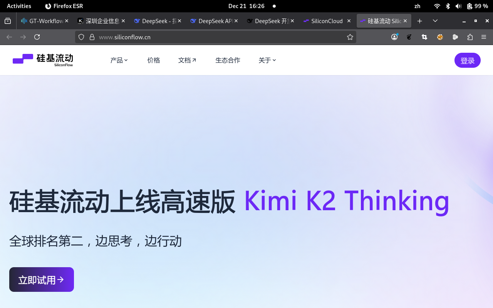
<br>
2. 登陆后，在用户控制台的左侧导航栏中找到并点击 **“API密钥”** (API Keys)。<br>

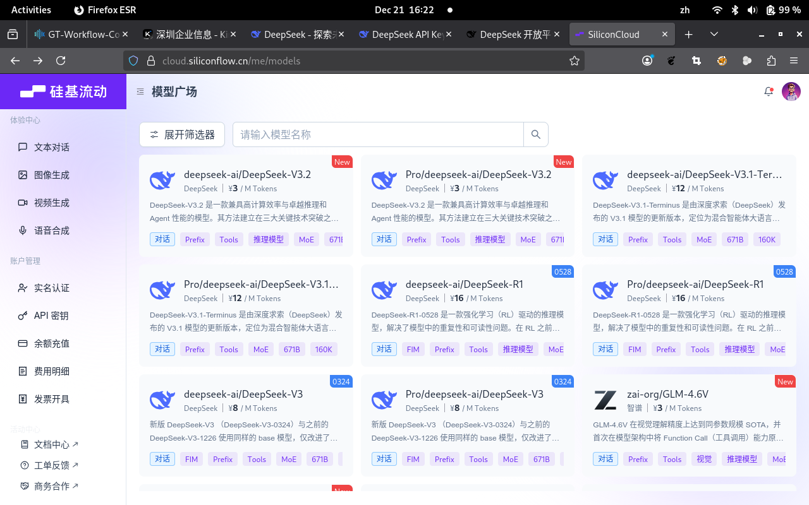
<br>
3. 点击 **“新建API密钥”** (或类似按钮)，按提示填写描述后创建。<br>

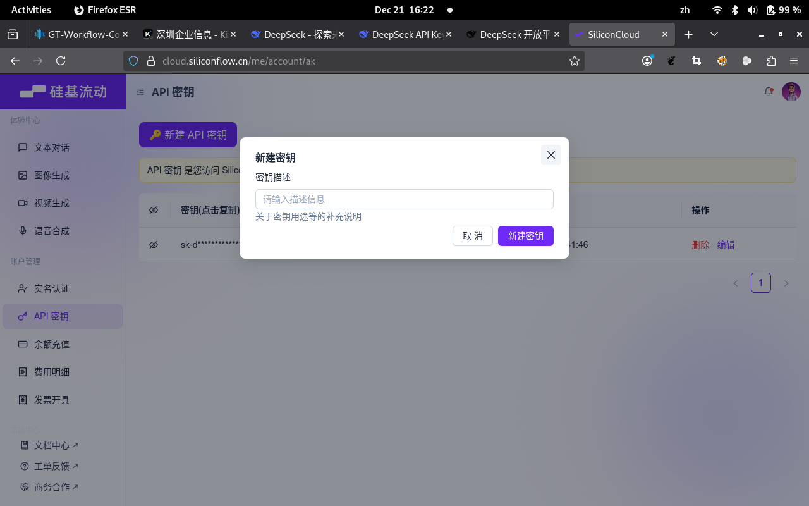
<br>
4. 打开Cherry Studio，点击左下角`Setting` 按钮，进行LLM Provider链接的配置。<br>

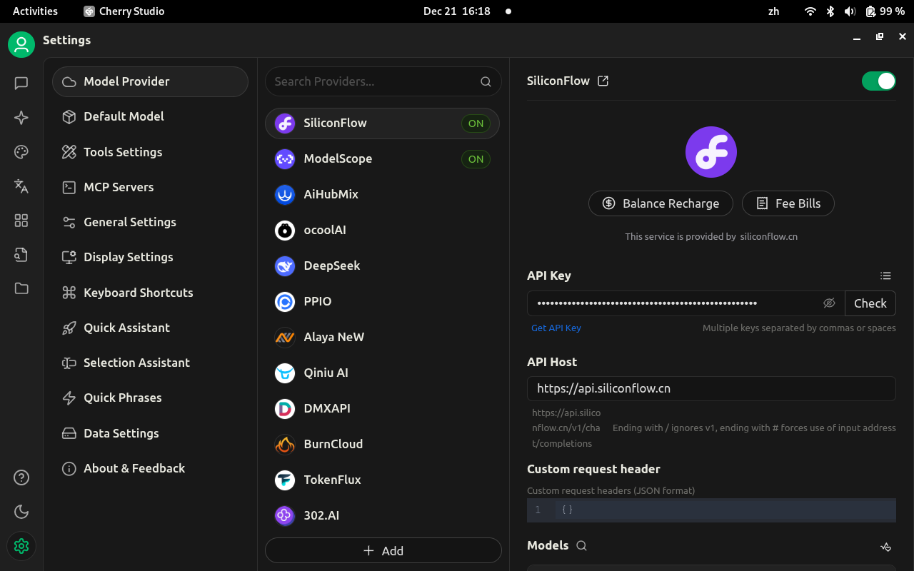
<br>
5. 进入硅基流动的配置页面，输入刚刚申请的APIkey。<br>

<br>
6. 添加DeepSeek/Qwen等模型 <br>

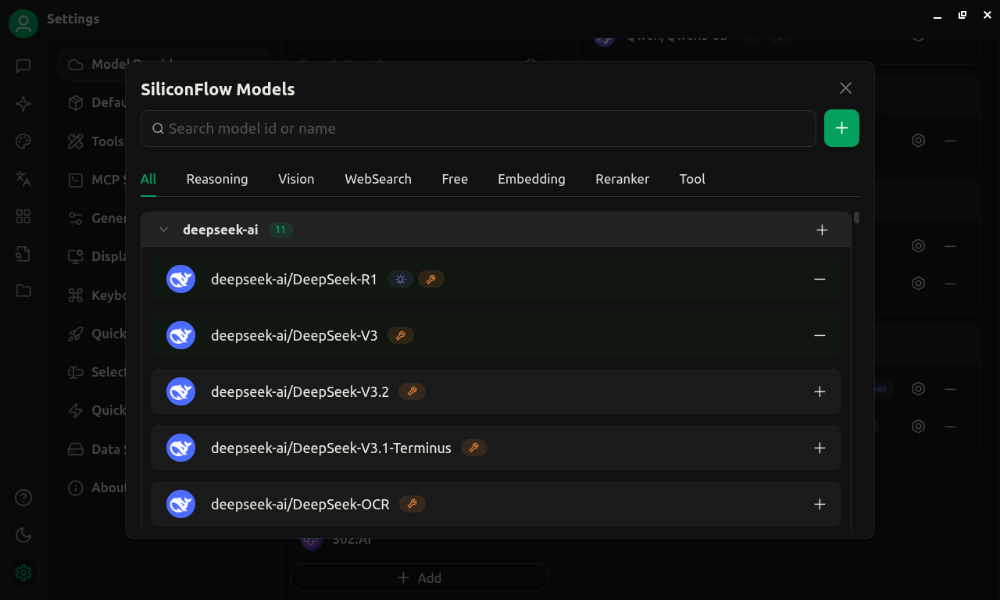


<br>
7. 测试添加的大模型的通讯链接是否成功？ <br>

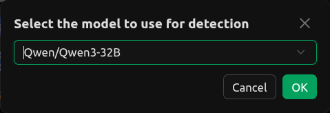

<br>

### 4.2 配置 ModelScope链接Qwen

1. 1. 登陆[魔搭社区](https://modelscope.cn/)官网，在左侧工具栏，点击访问令牌。 <br>
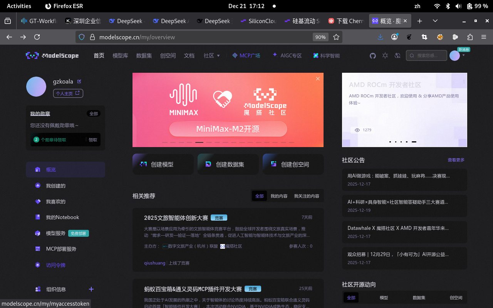
 <br>
2. 点击`新建令牌`按钮。<br>

<br>

3. 打开 Cherry Studio → **Settings / 模型配置**

4. 新增模型配置：

    - Provider：ModelScope
    - API Key：填写你的 Key

5. 测试连接（Test / Ping）

### 4.3 模型选择建议（教学推荐）

|场景|推荐模型类型|
|---|---|
|行动计划生成|通用推理模型|
|反思与总结|长上下文模型|
|实验稳定性|不追求最大参数|

---

## 5. Cherry Studio 的基础使用方式

### 5.1 创建“Agent 会话”

- 新建会话

- 命名示例：  
    `Lab06-Agent-Planning`


---

### 5.2 使用“角色提示”而非普通聊天

在对话开头，使用**明确角色提示**，例如：

```text
你是一个“知识管理智能体规划器”，
你的任务不是直接给答案，
而是为本地 Obsidian 知识库生成可执行的行动计划。
```

---

### 5.3 输出要求（非常重要）

在 Lab06 中，**所有输出必须是结构化的**，例如：

- 行动计划列表

- 分步骤说明

- 风险提示


**避免：**

- 散文式回答

- 直接“帮我改文件”


---

## 6. Cherry Studio × Obsidian 的协作方式（概念说明）

> Cherry Studio 与 Obsidian **不是自动集成关系**，而是通过人完成“桥接”。

```markdown
┌────────────┐
│  Obsidian  │  ← 本地知识库 / 状态 / 行动环境
└─────▲──────┘
      │（读 / 写）
┌─────┴──────┐
│ Agent Client│  ← Cherry Studio
│ (Runtime)   │
└─────▲──────┘
      │（API）
┌─────┴──────┐
│ Remote LLM │  ← Qwen / DeepSeek
└────────────┘
```


典型流程：

1. Cherry Studio 生成：

    - 行动建议
    - 合并方案
    - 重构思路

2. 学员在 Obsidian 中：

    - 手动执行
    - 校验结果

3. 执行结果再反馈给 Cherry Studio 进行反思

---

## 7. 配置 ModelScope MCP Server

Cherry Studio 使用 **MCP Server 配置** 接入广场能力。

👉 [ModelScope MCP Server + Cherry Studio集成的官方文档](https://modelscope.cn/docs/mcp/cherry-studio)

1. 点击Cherry Studio的右下角配置按钮，选择左侧配置栏的MCP Server。<br>

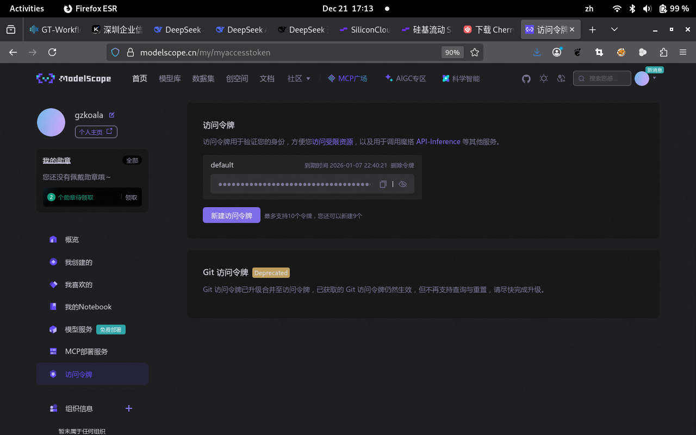
<br>

2. 点击右上角`Sync Server`按钮。<br>


<br>

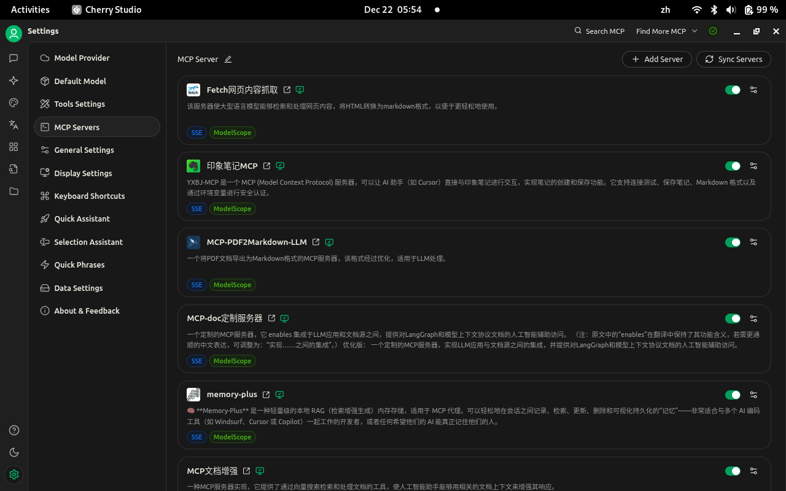
<br>

3. 在Cherry Studio对话框，选择添加MCP服务器。<br>

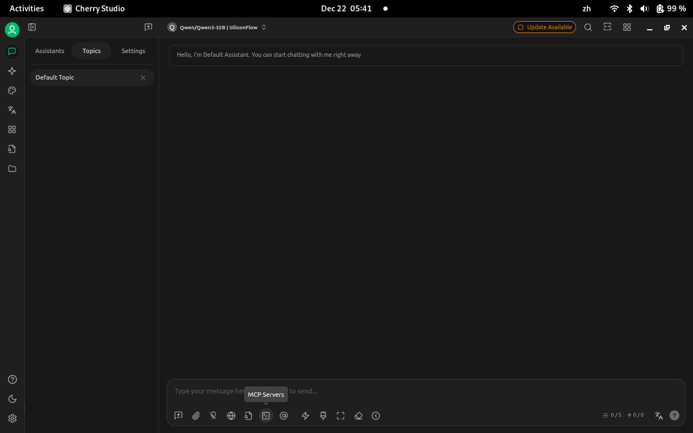
<br>

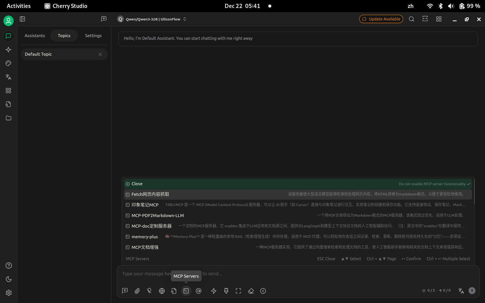
<br>

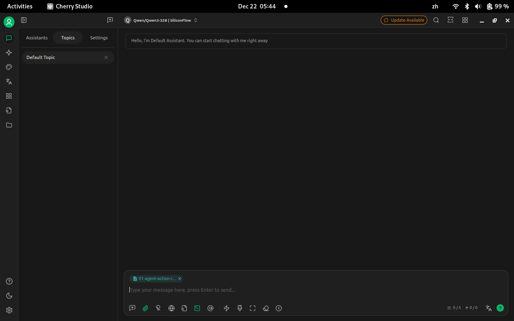
<br>

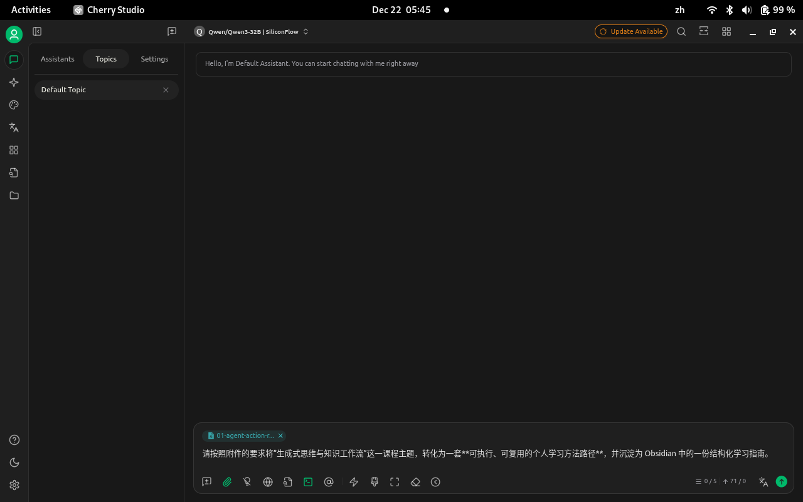
<br>

这样在和远程LLM对话中，就会自动调用所选择的MCP服务器，实现组合的查询。

>目前已经实现了自动配置和连接来自魔搭社区默认的MCP服务器，后续实验手册将会继续增加手动配置链接魔搭社区MCP广场托管或者可以本地化部署的MCP服务器。未来教程也会增加如何开发属于自己定制的MCP服务。（提示：这些进阶功能不属于本次课程的学习范围。

---

## 许可声明

本文档采用 [知识共享署名--相同方式共享 4.0 国际许可协议 (CC BY--SA 4.0)](https://creativecommons.org/licenses/by-sa/4.0/deed.zh) 进行许可， &copy; 2025 Gitconomy Research社区。
