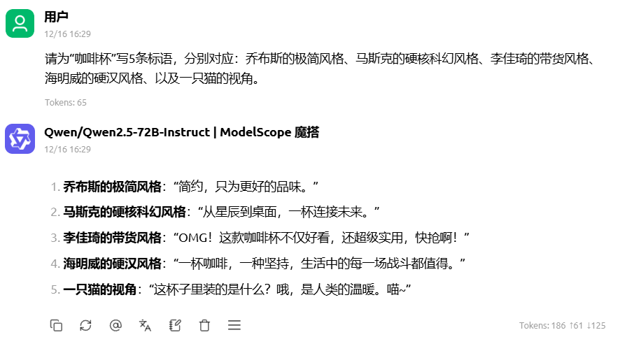

## 认知实验 —— “搜索 vs. 生成” (Search vs. Generate)

**动作 A（搜索模式）**：使用 Google/Baidu 搜索。同一个问题我点击了至少两个链接才将一个陌生的概念认识清楚，信息密度不是很高，而且存在很多杂乱的信息，作为信息的接收者，我需要不断的翻找网页进行一定的思考和总结得出最后一个问题的答案。
**动作 B（生成模式）**： 我使用了Qwen2.5-72B-Instruct后ai不经给我列举了定义还分点解答了后续几个问题效率相较于直接搜索网页少了点思考多了点便捷，并且答案获取速度结构化程度都是比较高的水准。

| **维度**         | **搜索引擎 (Search)** | **生成式 AI (Generate)** |
| ---------------- | --------------------- | ------------------------ |
| **信息获取方式** | 主动筛选、拼凑        | 被动接收、交互           |
| **思维负担**     | 高（需辨别真伪/整合） | 低（但也容易产生惰性）   |
| **结果形态**     | 碎片化网页链接        | 结构化文本/观点          |

## 认知实验二 —— 测绘“锯齿状边界” (The Jagged Frontier)


> 发现边界
> AI 在处理海量数据并在生成结构化内容的时候具有良好的内容总结性


> > 发现边界
> > AI 擅长快速处理海量数据并生成结构化内容，如批量撰写常规新闻稿件、整理基础行业报告等，但在处理涉及冷门专业知识、最新行业动态或需要精准引用权威数据的内容时会产生严重幻觉，这要求我在内容发布或交付用户前的事实核验环节必须介入审核。


## 初次编排 —— 你的第一个“人机协作”闭环


```
【大家可以叫我】 书山
【坐标】：江西赣州
【所学专业/工作职业】：软件工程
【我对本课程的熟悉程度】了解过LLM基本原理，agent基本原理和mcp的基本使用，想要增加一些实操经验
【本次课程目标】完成对所学知识的实践，增添项目实践经历，希望通过此次课程，对智能体有更加深入的了解，最终构建一款可解决学习问题、支持知识库快速查询的实用智能体。
【打算怎么做达成目标】每天学习1~2小时完成对应的课程内容
【每天预计学习时间和学习时段】每天学习时段大致在21点到22点
【是否已经组队】目前已经创建队伍欢迎大佬进队，无限进步

请根据上述内容生成一段书山的自我介绍
```


```
[存在一下问题]：
1. 字数需要限制在200字
2. 自我介绍个性化少过于生硬
[优化要求]:
3. 语言能够通过自我介绍迅速了解书山的具体信息
4. 语言能够让看到描述的人，内心勾勒出具体的人物信息
```


最终优化效果
```
大家好，我是书山，来自江西赣州的一名软件工程师。我一直对人工智能领域充满好奇，尤其是LLM、智能体和MCP的应用。虽然我已经了解了一些基本原理，但总感觉理论与实践之间还差了一步。因此，我报名了这门课程，希望能通过实际操作，将这些知识转化为自己的技能。

每天晚上9点到10点，我会抽出时间来学习，逐步实现我的目标——构建一个能够帮助学习和快速查询知识库的智能体。这个过程对我来说既是挑战也是乐趣，我相信通过努力，一定能够有所收获。

我目前已经创建了一个小团队，欢迎大家加入，一起探讨、共同进步。如果你也对智能体感兴趣，或者有任何独到的见解，欢迎随时联系我！期待与你们并肩作战，一起创造更多精彩！
```

