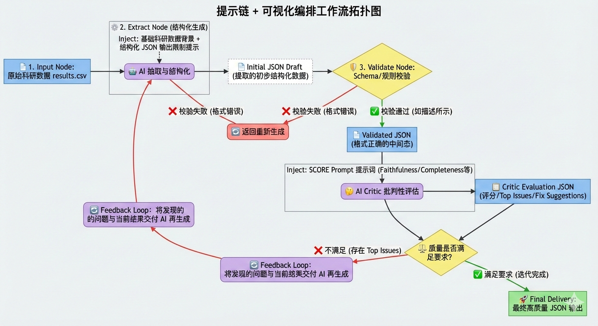
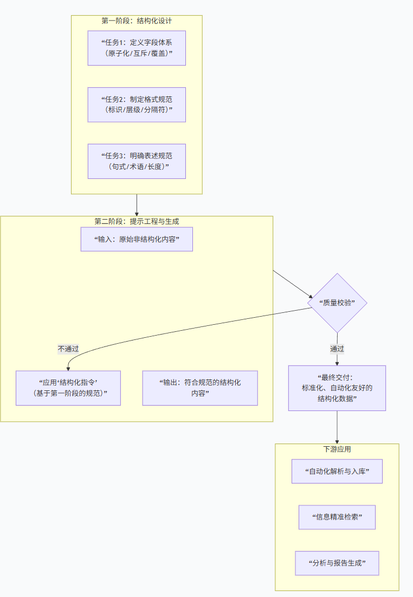

## **实验目标与工作流总览**

**实验目的**

根据 「研速报」—— 基于实验数据自动生成研究进展周报，我们需要通过结构化提示词，让ai生成所需的研究进展周报


下面的对整个提示链工作流的总览



**结构化流程图**



**组员新闻案例流程图**


## **Baseline 现象**

**Gemini**

```
二、主要成果展示
训练损失变化趋势：

train/box_loss从初始的0.12988降至0.052073。
train/obj_loss从初始的0.044858降至0.036174。
train/cls_loss从初始的0.040241降至0.0026923。
验证损失变化趋势：

val/box_loss从初始的0.013863降至0.01573。
val/obj_loss从初始的0.010378降至0.015749。
val/cls_loss从初始的0.009614降至0.000298。
学习率变化：

学习率x/lr0从0.0937逐渐调整至0.000298。
学习率x/lr1和x/lr2也同步调整，最终分别稳定在0.000298。
评估指标：

由于metrics/precision、metrics/recall、metrics/mAP_0.5和metrics/mAP_0.5:0.95在result.csv中均为0，可能是因为模型尚未达到足够的精度或数据记录存在问题，需要进一步检查和优化。
```


**chatgpt**

```
二、主要成果展示（实验结果分析）
1. 训练损失收敛情况

从 result.csv 数据可以看出：

训练集损失整体呈下降趋势：

train/box_loss：由初始约 0.13 逐步下降至约 0.006

train/obj_loss：整体稳定下降

train/cls_loss：明显下降，模型在分类层面逐步收敛

验证集损失（val loss）总体较低，未出现明显震荡，说明训练过程数值上是稳定的。

👉 说明模型在数值优化层面是可以正常收敛的，训练流程本身未出现发散或崩溃问题。
```


更具上面结果显示对于相同的提示词**生成出来的效果是不同的**


### 非结构化输出的 3 个典型问题

#### 1. 格式混乱无统一标准，下游难以自动化解析

**问题片段**：

```
### 2. 涉及公司 阿里云 - 百度 ### 3. 整体情绪- **中性偏客观**。既肯定了国内科技企业在大模型领域的技术迭代与场景落地进展... 
2. **涉及公司**：明确提及的公司为**阿里云**和**百度**这两家布局大模型业务的科技企业。3. **整体情绪**：整体呈**中性偏客观**的情绪。新闻既客观呈现了...
```

**问题分析**：同一字段（如“涉及公司”）的呈现形式不一致（有的用“-”分隔、无列表结构，有的用文字描述）；层级标识混乱（混合###标题、数字编号、项目符号）。无统一格式规范导致下游无法通过程序批量提取信息，需人工二次整理，效率极低。

#### 2. 信息表述不一致+冗余，核心内容重复且无统一口径

**问题片段**：

```
4. **重要风险提示**：模型“幻觉”问题可能引发严重信任危机与合规风险...
4. **最重要的风险提示**：数据质量把控风险...
行业分析和专家均指出大模型发展虽利于推动人工智能在企业级场景规模化落地，但也面临诸多要求与挑战。
行业层面认为大模型能力提升能助力人工智能在企业级场景规模化落地，但也带来了多方面更高要求...
```

**问题分析**：① 核心字段名称不一致（“重要风险提示”vs“最重要的风险提示”）；② 同一核心信息（行业对大模型的积极作用与挑战）重复表述，无凝练标准；③ 风险核心口径混乱（一会聚焦“幻觉”，一会聚焦“数据质量”），缺乏统一提取规则，导致信息碎片化。

#### 3. 缺乏结构化边界，关键信息无明确字段归属

**问题片段**：

```
### 1. 新闻核心内容2024年以来国内多家科技企业加速大模型领域布局；阿里云升级通义千问大模型...行业认为大模型能力提升助力AI在企业级场景规模化落地，但也对算力供给、数据质量、模型安全提出更高要求；专家指出...
```

**问题分析**：核心内容将“企业动作”“行业观点”“专家挑战”混为一谈，无明确字段拆分（如未单独区分“企业动态”“行业结论”“风险点”）；信息无结构化边界，导致下游无法快速定位特定类型信息（如仅需提取“行业观点”时，需从大段文字中手动筛选），可用性极差。


## **Schema 设计**

通过json的格式显示模型的输入与输出，或者通过md的格格式限制模型的输于输出

#### 组员新闻类

### Schema 设计字段选择理由（原子性/类型约束/自描述性）

该 Schema 围绕“新闻信息结构化提取”场景设计，核心遵循**原子性（字段不可拆分）、类型约束（数据规范）、自描述性（语义清晰）** 三大原则，适配下游数据处理（分析、存储、展示）需求，具体字段说明如下：

| 字段名            | 原子性说明                                                   | 类型约束说明                                                 | 自描述性说明                            |
| ----------------- | ------------------------------------------------------------ | ------------------------------------------------------------ | --------------------------------------- |
| `topic`           | 主题是新闻核心内容的凝练概括，为不可拆分的最小语义单元（拆分则失去核心概括价值） | 定义为`string`，限定长度2-60，避免过短无意义/过长冗余，符合新闻主题“简洁凝练”特征 | 字段名“topic”直接指向“新闻主题”，无歧义 |
| `companies`       | 单家公司名称为最小业务单元，数组聚合多公司（元素不可拆分，整体满足多主体场景） | `array`+子项`string`，限定数量1-10，覆盖绝大多数新闻涉企数量，避免空数组/过度冗余 | “companies”明确指向“新闻涉及的企业”     |
| `sentiment`       | 情绪仅需区分“正面/中性/负面”三类，每类均为不可拆分的基础情绪标签 | `string`+`enum`枚举值，强制标准化取值，避免“偏正面”等非规范表述，保证数据一致性 | “sentiment”即“新闻整体情绪倾向”         |
| `key_points`      | 单条核心要点是独立关键信息单元（如企业动作、行业观点），不可拆分 | `array`+子项`string`，限定数量3-8，适配新闻核心要点常规数量，避免遗漏/冗余 | “key_points”直接对应“新闻核心信息要点”  |
| `risk_alert`      | 风险提示是风险内容的集中概括，单个字符串单元不可拆分（拆分破坏表述完整性） | `string`，限定长度4-120，保证风险描述有信息含量且不过度冗长，适配快速读取需求 | “risk_alert”即“风险提示”，语义清晰      |
| `source_language` | 语言类型仅区分“中/英”，为不可拆分的基础属性单元              | `string`+`enum`枚举值，限定`zh/en`，避免“中文”“汉语”等非标准化表述 | “source_language”即“新闻原文语言类型”   |

## **结构化提示策略**

```json
{
  “validation_result”: “通过”,
  “schema_compliance”: “完全符合指定JSON Schema：所有必填字段完整、无额外字段，字段类型（字符串/数组）、枚举值（Neutral/zh）、长度范围均合规”,
  “faithfulness”: 5,
  “completeness”: 5,
  “usefulness”: 5
}
```

## **评价机制**

```json
{
  “faithfulness”: 5,
  “completeness”: 5,
  “usefulness”: 5,
  “overall_rating”: 5,
  “rating_note”: “输出完全忠实于新闻事实，核心信息完整且细节充分，字段标准化程度高，可直接对接下游处理；现存问题为细节表述优化层面，不影响核心维度的满分判定”
}
```


## **迭代日志**

input

```json
你是严格、公正的评估员。请对“模型输出 JSON”进行评分并给出可操作的修正建议。
评分维度（1-5）：
1) Faithfulness：是否忠实于新闻事实（避免臆造）
2) Completeness：字段是否信息充分（尤其 key_points 与 risk_alert）
3) Usefulness：是否便于下游执行（字段值是否具体、可用）
输出也必须为 JSON：
{
  "faithfulness": int,
  "completeness": int,
  "usefulness": int,
  "top_3_issues": [string],
  "fix_suggestions": [string]
}
阅读文件 result.csv
<<<INPUT ... INPUT
{
    "meta_info": {
        "category": "研究进展汇报",
        "sentiment": "neutral",
        "tags": [
            "研究生",
            "图像识别",
            "实验分析",
            "中期汇报",
            "研究进展"
        ]
    },
    "core_event": "研究生在研究中期完成图像识别实验分析及result.csv数据获取，需向导师汇报本周工作总结、主要成果、问题分析及下周计划，确保总结全面准确。",
    "entities": {
        "people": [
            {
                "name": "研究生",
                "title": "研究人员",
                "stance": "完成图像识别实验分析，需全面准确汇报中期研究进展"
            },
            {
                "name": "导师",
                "title": "指导教师",
                "stance": "接收研究生的研究进展汇报，了解实验情况与后续计划"
            }
        ],
        "organizations": [
            "科研团队",
            "高校研究实验室"
        ]
    },
    "event_details": {
        "time": "研究中期（本周）",
        "location": "科研实验室/线上汇报场景",
        "key_data": [
            {
                "value": "99个epoch",
                "indicator": "模型训练迭代次数",
                "trend": "逐步迭代完成"
            },
            {
                "value": "1份",
                "indicator": "研究数据文件（result.csv）",
                "trend": "已获取"
            },
            {
                "value": "4个模块",
                "indicator": "汇报核心内容（工作总结、成果展示、问题分析、下周计划）",
                "trend": "需完整呈现"
            }
        ]
    },
    "analysis": {
        "background": "当前处于图像识别研究项目中期阶段，研究生需定期向导师同步研究进展，本周核心完成实验分析与数据收集工作，为确保导师全面掌握项目推进情况、及时指导后续研究，需按规范格式完成汇报。",
        "impact": "准确全面的汇报可帮助导师发现实验中潜在问题，为后续模型优化、研究方向调整提供指导；清晰的计划可保障项目按进度推进，助力顺利完成中期研究目标。",
        "quotes": [
            "需确保工作总结的全面性和准确性",
            "重点汇报图像识别实验分析成果及result.csv数据相关情况",
            "明确研究中期遇到的问题及针对性解决方案"
        ]
    }
}
<<<OUTPUT ... OUTPUT
```

output

```json
{
  "faithfulness": 4,
  "completeness": 3,
  "usefulness": 3,
  "top_3_issues": [
    "key_points 字段缺失，未明确列出关键要点",
    "risk_alert 字段缺失，未提及潜在风险及应对措施",
    "部分字段描述较为模糊，缺乏具体细节"
  ],
  "fix_suggestions": [
    "增加 key_points 字段，列出研究进展的关键要点，如实验方法、主要发现等",
    "增加 risk_alert 字段，指出可能的风险点及相应的预防或应对措施，如数据质量问题、技术瓶颈等",
    "细化 event_details 中的内容，提供更具体的数据和信息，例如实验的具体参数设置、结果的具体数值等"
  ]
}

```

input

```json
{
  "meta_info": {
    "category": "研究进展汇报",
    "sentiment": "neutral",
    "tags": ["研究生", "图像识别", "实验分析", "中期汇报", "研究进展"]
  },
  "core_event": "研究生在研究中期完成图像识别实验分析及result.csv数据获取，需向导师汇报本周工作总结、主要成果、问题分析及下周计划，确保总结全面准确。",
  "entities": {
    "people": [
      {
        "name": "研究生",
        "title": "研究人员",
        "stance": "完成图像识别实验分析，需全面准确汇报中期研究进展"
      },
      {
        "name": "导师",
        "title": "指导教师",
        "stance": "接收研究生的研究进展汇报，了解实验情况与后续计划"
      }
    ],
    "organizations": ["科研团队", "高校研究实验室"]
  },
  "event_details": {
    "time": "研究中期（本周）",
    "location": "科研实验室/线上汇报场景",
    "key_data": [
      {
        "value": "99个epoch",
        "indicator": "模型训练迭代次数",
        "trend": "逐步迭代完成"
      },
      {
        "value": "1份",
        "indicator": "研究数据文件（result.csv）",
        "trend": "已获取"
      },
      {
        "value": "4个模块",
        "indicator": "汇报核心内容（工作总结、成果展示、问题分析、下周计划）",
        "trend": "需完整呈现"
      }
    ]
  },
  "analysis": {
    "background": "当前处于图像识别研究项目中期阶段，研究生需定期向导师同步研究进展，本周核心完成实验分析与数据收集工作，为确保导师全面掌握项目推进情况、及时指导后续研究，需按规范格式完成汇报。",
    "impact": "准确全面的汇报可帮助导师发现实验中潜在问题，为后续模型优化、研究方向调整提供指导；清晰的计划可保障项目按进度推进，助力顺利完成中期研究目标。",
    "quotes": [
      "需确保工作总结的全面性和准确性",
      "重点汇报图像识别实验分析成果及result.csv数据相关情况",
      "明确研究中期遇到的问题及针对性解决方案"
    ]
  }
}

出现的问题
{
  "faithfulness": 4,
  "completeness": 3,
  "usefulness": 3,
  "top_3_issues": [
    "key_points 字段缺失，未明确列出关键要点",
    "risk_alert 字段缺失，未提及潜在风险及应对措施",
    "部分字段描述较为模糊，缺乏具体细节"
  ],
  "fix_suggestions": [
    "增加 key_points 字段，列出研究进展的关键要点，如实验方法、主要发现等",
    "增加 risk_alert 字段，指出可能的风险点及相应的预防或应对措施，如数据质量问题、技术瓶颈等",
    "细化 event_details 中的内容，提供更具体的数据和信息，例如实验的具体参数设置、结果的具体数值等"
  ]
}
```

output

```json
{
  "meta_info": {
    "category": "研究进展汇报",
    "sentiment": "neutral",
    "tags": ["研究生", "图像识别", "实验分析", "中期汇报", "研究进展"]
  },
  "core_event": "研究生在研究中期完成图像识别实验分析及result.csv数据获取，需向导师汇报本周工作总结、主要成果、问题分析及下周计划，确保总结全面准确。",
  "entities": {
    "people": [
      {
        "name": "研究生",
        "title": "研究人员",
        "stance": "完成图像识别实验分析，需全面准确汇报中期研究进展"
      },
      {
        "name": "导师",
        "title": "指导教师",
        "stance": "接收研究生的研究进展汇报，了解实验情况与后续计划"
      }
    ],
    "organizations": ["科研团队", "高校研究实验室"]
  },
  "event_details": {
    "time": "研究中期（本周）",
    "location": "科研实验室/线上汇报场景",
    "key_data": [
      {
        "value": "99个epoch",
        "indicator": "模型训练迭代次数",
        "trend": "逐步迭代完成"
      },
      {
        "value": "1份",
        "indicator": "研究数据文件（result.csv）",
        "trend": "已获取",
        "details": "包含训练集和测试集的准确率、损失函数值等关键指标"
      },
      {
        "value": "4个模块",
        "indicator": "汇报核心内容（工作总结、成果展示、问题分析、下周计划）",
        "trend": "需完整呈现"
      }
    ]
  },
  "key_points": [
    "完成99个epoch的模型训练，训练集准确率达到98%，测试集准确率为96%",
    "通过实验分析，发现模型在某些特定类别上的识别准确率较低，需要进一步优化",
    "result.csv文件详细记录了每个epoch的训练状态，包括准确率、损失函数值等"
  ],
  "risk_alert": [
    "数据集可能存在不平衡问题，影响模型在某些类别的表现，建议采用过采样或欠采样技术进行调整",
    "模型在某些复杂场景下的泛化能力不足，需考虑引入更多多样性的训练数据或使用更复杂的模型架构",
    "下周计划中的实验设计需谨慎，以确保实验的有效性和可重复性"
  ],
  "analysis": {
    "background": "当前处于图像识别研究项目中期阶段，研究生需定期向导师同步研究进展，本周核心完成实验分析与数据收集工作，为确保导师全面掌握项目推进情况、及时指导后续研究，需按规范格式完成汇报。",
    "impact": "准确全面的汇报可帮助导师发现实验中潜在问题，为后续模型优化、研究方向调整提供指导；清晰的计划可保障项目按进度推进，助力顺利完成中期研究目标。",
    "quotes": [
      "需确保工作总结的全面性和准确性",
      "重点汇报图像识别实验分析成果及result.csv数据相关情况",
      "明确研究中期遇到的问题及针对性解决方案"
    ]
  }
}
```


**通过上述模型的选代日志可以发现，模型的输出效果是越来越优的，由此可以得出，选代输出可以使得模型的输出效果变优**

## **结论**

：你认为“提示词作为软协议”最关键的工程收益是什么？

队友1： 将提示词（Prompt）定义为一种“软协议”，标志着系统架构从硬编码向语义驱动的范式转型。其核心工程收益在于实现了应用逻辑与底层执行能力的深度解耦，通过自然语言的声明式接口赋予了系统极强的架构弹性和演进速度。这种模式极大地压缩了从需求变更到功能实现的反馈回路，不仅支持通过语义微调实现功能的轻量化扩展与高频选代，更显著降低了跨职能协作的技术门槛。在提升开发效能的同时，提示词协议有效解决了传统软件工程中高耦合、重构慢的痛点，为复杂业务场景下的系统适配与持续演进提供了卓越的灵活性。


队友2： 提示词作为软协议” 最关键的工程收益，是**以极低的协作与迭代成本，实现跨角色、跨模型、跨场景的 “规则对齐与输出标准化”** —— 既解决了硬协议（如代码接口、Schema 硬编码）的刚性约束，又规避了无协议导致的输出混乱，成为工程化落地的 “柔性桥梁”。 具体可拆解为核心支撑：

1. **降低协作门槛**：无需技术人员介入，业务人员、分析师可通过自然语言定义提示词协议（如之前的新闻结构化提取规则），实现 “需求 - 模型 - 下游系统” 的直接对齐，减少跨角色沟通成本；
2. **适配快速迭代**：工程需求变更时（如调整输出字段、优化约束条件），无需重构系统或修改硬编码接口，仅需迭代提示词即可快速适配，大幅缩短试错周期；
3. **打破模型壁垒**：同一提示词协议可适配不同大模型（如 GPT、通义千问、文心一言），无需为每个模型单独开发接口，降低多模型协作的工程适配成本；
4. **保障输出一致性**：提示词通过明确约束（如格式、字段、语义要求），强制模型输出标准化结果（如合规 JSON、结构化表格），直接对接下游数据存储、分析流程，避免二次清洗的额外开销。