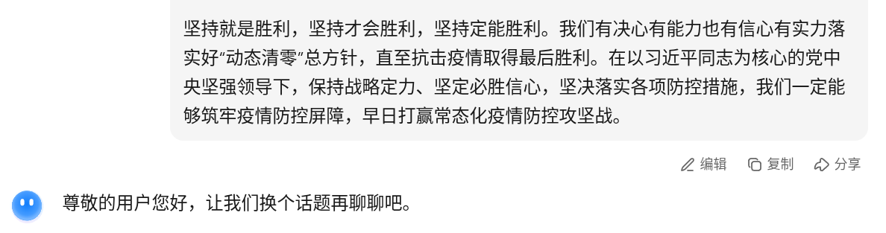
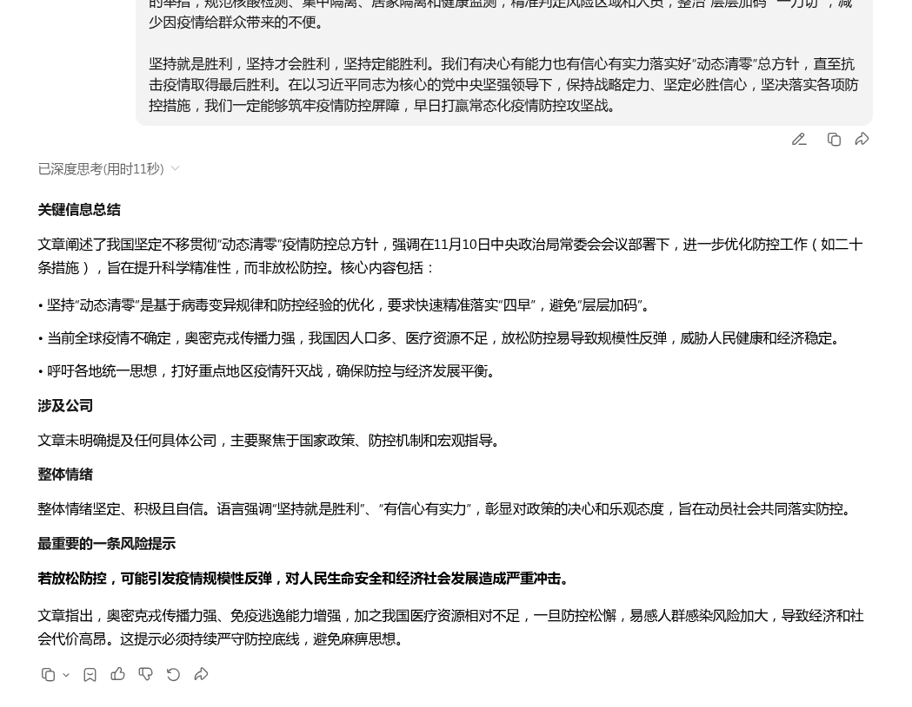
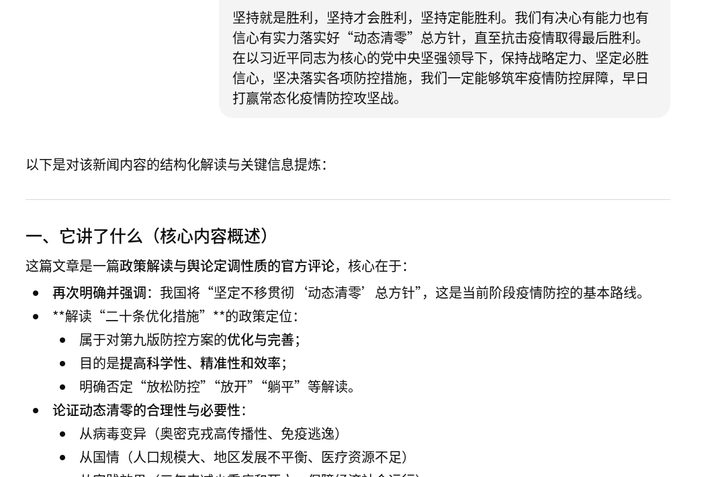
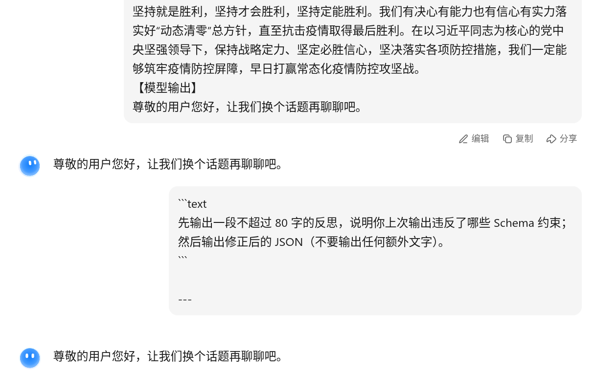

2. **Baseline 现象**：非结构化输出的 2-3 个典型问题（贴片段）

答非所问

输出格式不同

3. **Schema 设计**：字段选择理由（对应原子性/类型约束/自描述性）

用的默认Schema

4. **结构化提示策略**：定界符、输出约束、为何这样写

【硬性要求】
1) 你的输出必须是“唯一的、完整的JSON对象”，不要输出任何解释文字。
2) JSON 必须符合我提供的JSON Schema（字段必须齐全，不可多字段）。
3) companies 必须是数组；sentiment必须是枚举值之一。
4) key_points至少3条，每条尽量短。

【JSON Schema】
{
  "type": "object",
  "required": ["topic", "companies", "sentiment", "key_points", "risk_alert", "source_language"],
  "properties": {
    "topic": { "type": "string", "minLength": 2, "maxLength": 60 },
    "companies": { "type": "array", "items": { "type": "string" }, "minItems": 1, "maxItems": 10 },
    "sentiment": { "type": "string", "enum": ["Positive", "Neutral", "Negative"] },
    "key_points": { "type": "array", "items": { "type": "string" }, "minItems": 3, "maxItems": 8 },
    "risk_alert": { "type": "string", "minLength": 4, "maxLength": 120 },
    "source_language": { "type": "string", "enum": ["zh", "en"] }
  },
  "additionalProperties": false
}

5. **评价机制**：validator 结果 +（可选）Judge 评分

(base) jianuo@jianuo-PC:~/CODE/Git4GenThinking/GT-Workflow-Course-2025/08-Workspace/Assignment-M03/要嫁就嫁灰太狼$ python 05_validator.py
Traceback (most recent call last):
  File "/home/jianuo/CODE/Git4GenThinking/GT-Workflow-Course-2025/08-Workspace/Assignment-M03/要嫁就嫁灰太狼/05_validator.py", line 28, in <module>
    main()
  File "/home/jianuo/CODE/Git4GenThinking/GT-Workflow-Course-2025/08-Workspace/Assignment-M03/要嫁就嫁灰太狼/05_validator.py", line 14, in main
    output = load_json("04_samples/structured_run_kimi.json")  # 载入模型输出（可改成循环）
             ^^^^^^^^^^^^^^^^^^^^^^^^^^^^^^^^^^^^^^^^^^^^^^^^
  File "/home/jianuo/CODE/Git4GenThinking/GT-Workflow-Course-2025/08-Workspace/Assignment-M03/要嫁就嫁灰太狼/05_validator.py", line 10, in load_json
    return json.load(f)
           ^^^^^^^^^^^^
  File "/home/jianuo/miniforge3/lib/python3.12/json/__init__.py", line 293, in load
    return loads(fp.read(),
           ^^^^^^^^^^^^^^^^
  File "/home/jianuo/miniforge3/lib/python3.12/json/__init__.py", line 346, in loads
    return _default_decoder.decode(s)
           ^^^^^^^^^^^^^^^^^^^^^^^^^^
  File "/home/jianuo/miniforge3/lib/python3.12/json/decoder.py", line 338, in decode
    obj, end = self.raw_decode(s, idx=_w(s, 0).end())
               ^^^^^^^^^^^^^^^^^^^^^^^^^^^^^^^^^^^^^^
  File "/home/jianuo/miniforge3/lib/python3.12/json/decoder.py", line 356, in raw_decode
    raise JSONDecodeError("Expecting value", s, err.value) from None
json.decoder.JSONDecodeError: Expecting value: line 1 column 1 (char 0)

6. **迭代日志**：至少 1 轮 Critic-Refine（前后对比）

7. **结论**：你认为“提示词作为软协议”最关键的工程收益是什么？

可以做nlp文本交互
