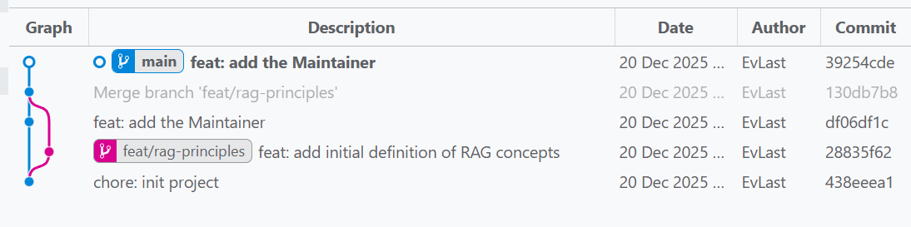
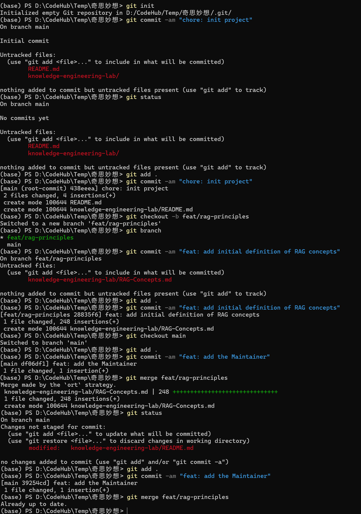
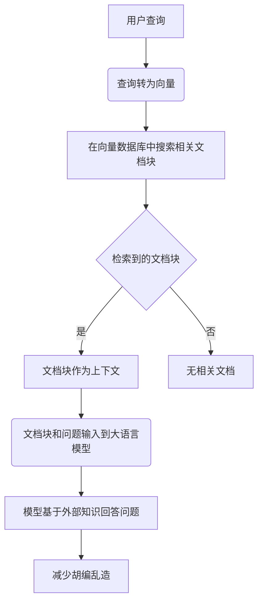

## 任务一

系列是任务一中git的操作步奏

```bash
(base) PS D:\CodeHub\Temp\奇思妙想> git init
Initialized empty Git repository in D:/CodeHub/Temp/奇思妙想/.git/
(base) PS D:\CodeHub\Temp\奇思妙想> git commit -am "chore: init project"
On branch main

Initial commit

Untracked files:
  (use "git add <file>..." to include in what will be committed)
        README.md
        knowledge-engineering-lab/

nothing added to commit but untracked files present (use "git add" to track)
(base) PS D:\CodeHub\Temp\奇思妙想> git status
On branch main

No commits yet

Untracked files:
  (use "git add <file>..." to include in what will be committed)
        README.md
        knowledge-engineering-lab/

nothing added to commit but untracked files present (use "git add" to track)
(base) PS D:\CodeHub\Temp\奇思妙想> git add .
(base) PS D:\CodeHub\Temp\奇思妙想> git commit -am "chore: init project"
[main (root-commit) 438eeea] chore: init project
 2 files changed, 4 insertions(+)
 create mode 100644 README.md
 create mode 100644 knowledge-engineering-lab/README.md
(base) PS D:\CodeHub\Temp\奇思妙想> git checkout -b feat/rag-principles
Switched to a new branch 'feat/rag-principles'
(base) PS D:\CodeHub\Temp\奇思妙想> git branch
* feat/rag-principles
  main
(base) PS D:\CodeHub\Temp\奇思妙想> git commit -am "feat: add initial definition of RAG concepts"
On branch feat/rag-principles
Untracked files:
  (use "git add <file>..." to include in what will be committed)
        knowledge-engineering-lab/RAG-Concepts.md

nothing added to commit but untracked files present (use "git add" to track)
(base) PS D:\CodeHub\Temp\奇思妙想> git add .
(base) PS D:\CodeHub\Temp\奇思妙想> git commit -am "feat: add initial definition of RAG concepts"
[feat/rag-principles 28835f6] feat: add initial definition of RAG concepts
 1 file changed, 248 insertions(+)
 create mode 100644 knowledge-engineering-lab/RAG-Concepts.md
(base) PS D:\CodeHub\Temp\奇思妙想> git checkout main
Switched to branch 'main'
(base) PS D:\CodeHub\Temp\奇思妙想> git add .
(base) PS D:\CodeHub\Temp\奇思妙想> git commit -am "feat: add the Maintainer"
[main df06df1] feat: add the Maintainer
 1 file changed, 1 insertion(+)
(base) PS D:\CodeHub\Temp\奇思妙想> git merge feat/rag-principles
Merge made by the 'ort' strategy.
 knowledge-engineering-lab/RAG-Concepts.md | 248 ++++++++++++++++++++++++++++++
 1 file changed, 248 insertions(+)
 create mode 100644 knowledge-engineering-lab/RAG-Concepts.md
(base) PS D:\CodeHub\Temp\奇思妙想> git status
On branch main
Changes not staged for commit:
  (use "git add <file>..." to update what will be committed)
  (use "git restore <file>..." to discard changes in working directory)
        modified:   knowledge-engineering-lab/README.md

no changes added to commit (use "git add" and/or "git commit -a")
(base) PS D:\CodeHub\Temp\奇思妙想> git add .
(base) PS D:\CodeHub\Temp\奇思妙想> git commit -am "feat: add the Maintainer"
[main 39254cd] feat: add the Maintainer
 1 file changed, 1 insertion(+)
(base) PS D:\CodeHub\Temp\奇思妙想> git merge feat/rag-principles
Already up to date.
(base) PS D:\CodeHub\Temp\奇思妙想>
```

**可视化图片**





**思考**

> 在原子提交下人的操作变得可视化，更改了什么文档，出现了什么问题都可以在git Tree 中可是化出来，使用AI看得懂的表述方式呈现，历史存在的问题和版本都在git中保存着，使得操作可回溯，可追查。文档的联系页面，通过人为可视化的关联可以使得文档脉络以及结构跟价清晰，分支的出现，代表着同一个件事的多种不同的发展与选择。每次合并都是安全可控，出现问题及时反馈。


## 任务二


```yaml
---
uuid: 13bc817d-cb70-4485-9f63-d41f1cc4d89f
aliases: [Retrieval-Augmented Generation]
tags: [AI/RAG, Knowledge/Engineering]
type: Concept
status: Seedling
visibility: Public
related_questions:
  - 什么是RAG技术？
  - RAG如何解决大模型的幻觉问题？
---
```


```markdown
### 拆解为独立的原子陈述

1. RAG 的流程主要分为检索和生成两个阶段。
2. 系统将用户的查询转换为向量。
3. 在向量数据库中搜索相关的文档块。
4. 检索到的文档块作为上下文。
5. 检索到的文档块连同用户的问题一起输入到大语言模型中。
6. 模型基于外部知识回答问题。
7. 这样减少了胡编乱造的情况。

### 为每个陈述生成 2-3 个潜在的用户查询问题

1. **RAG 的流程主要分为检索和生成两个阶段。**
   - RAG 的流程包括哪两个阶段？
   - RAG 的检索阶段和生成阶段分别是什么？
   - RAG 的两个主要阶段是什么？

2. **系统将用户的查询转换为向量。**
   - 用户的查询是如何被处理的？
   - 查询转换成向量的具体步骤是什么？
   - 为什么需要将查询转换成向量？

3. **在向量数据库中搜索相关的文档块。**
   - 向量数据库的作用是什么？
   - 如何在向量数据库中搜索相关文档？
   - 向量数据库中的文档块是如何存储的？

4. **检索到的文档块作为上下文。**
   - 检索到的文档块如何使用？
   - 文档块在RAG中扮演什么角色？
   - 什么是文档块的上下文？

5. **检索到的文档块连同用户的问题一起输入到大语言模型中。**
   - 检索到的文档块和用户的问题是如何结合的？
   - 大语言模型接收哪些输入？
   - 输入到大语言模型中的信息有哪些？

6. **模型基于外部知识回答问题。**
   - 模型如何利用外部知识回答问题？
   - 外部知识对模型的回答有何影响？
   - 什么是模型的外部知识？

7. **这样减少了胡编乱造的情况。**
   - 为什么RAG能减少胡编乱造？
   - RAG如何确保回答的准确性？
   - 胡编乱造在RAG中是如何避免的？
```


## 任务三

**Prompt**

````
【Setting】
你是一位**资深的知识可视化专家**， 精通 Mermaid 语法与技术概念图解。
【Context】
以下是我关于 RAG (检索增强生成) 的**原子化笔记文本**,你需要理解其中的处理流程。
```
### 拆解为独立的原子陈述

1. RAG 的流程主要分为检索和生成两个阶段。
2. 系统将用户的查询转换为向量。
3. 在向量数据库中搜索相关的文档块。
4. 检索到的文档块作为上下文。
5. 检索到的文档块连同用户的问题一起输入到大语言模型中。
6. 模型基于外部知识回答问题。
7. 这样减少了胡编乱造的情况。

### 为每个陈述生成 2-3 个潜在的用户查询问题

1. **RAG 的流程主要分为检索和生成两个阶段。**
   - RAG 的流程包括哪两个阶段？
   - RAG 的检索阶段和生成阶段分别是什么？
   - RAG 的两个主要阶段是什么？

2. **系统将用户的查询转换为向量。**
   - 用户的查询是如何被处理的？
   - 查询转换成向量的具体步骤是什么？
   - 为什么需要将查询转换成向量？

3. **在向量数据库中搜索相关的文档块。**
   - 向量数据库的作用是什么？
   - 如何在向量数据库中搜索相关文档？
   - 向量数据库中的文档块是如何存储的？

4. **检索到的文档块作为上下文。**
   - 检索到的文档块如何使用？
   - 文档块在RAG中扮演什么角色？
   - 什么是文档块的上下文？

5. **检索到的文档块连同用户的问题一起输入到大语言模型中。**
   - 检索到的文档块和用户的问题是如何结合的？
   - 大语言模型接收哪些输入？
   - 输入到大语言模型中的信息有哪些？

6. **模型基于外部知识回答问题。**
   - 模型如何利用外部知识回答问题？
   - 外部知识对模型的回答有何影响？
   - 什么是模型的外部知识？

7. **这样减少了胡编乱造的情况。**
   - 为什么RAG能减少胡编乱造？
   - RAG如何确保回答的准确性？
   - 胡编乱造在RAG中是如何避免的？
```
【Objective】
你的任务是将上述文本转化为**标准的 Mermaid 流程图代码**。请提取关键步骤（检索、增强、生成）并展示数据流向。

【Requirements】
1. 仅输出 Mermaid 代码块，不要包含解释性文字。
2. 使用 graph TD (从上到下) 布局。
3. **使用矩形表示处理步骤，菱形表示判断**。
4. 确保代码语法正确，可直接渲染。

【Evaluation】

在输出代码前，请先 **自检机制**：
1. 是否包含了“检索”和“生成”两个关键环节？
2. 是否存在语法错误？
如果自检未通过，请修正后再输出。
````





## 任务四

通过流程最后生成出的结果：


```
## 🤖 Assistant

### 反思模式

#### 检查内容

1. **引用具体参考文献**
   - **检查结果**：当前简报中没有引用具体的参考文献。虽然提到了一些技术和架构的细节，但缺乏具体的文献来源，这可能会影响简报的权威性和可信度。

2. **逻辑通顺**
   - **检查结果**：整体逻辑较为通顺，但某些部分的表述可以更加清晰和具体。例如，性能表现对比中的“资源消耗”部分可以进一步细化，明确指出具体的资源需求。

#### Critique（批评意见）

1. **缺乏具体参考文献**
   - **批评意见**：简报中缺少具体的参考文献，这使得读者无法核实信息的来源，降低了简报的可信度。
   - **改进建议**：在每个部分的关键技术细节后，添加引用的具体文献或技术文档，例如：“[1]”、“[2]”等。

2. **部分表述不够具体**
   - **批评意见**：在性能表现对比中的“资源消耗”部分，没有具体说明GraphRAG和VectorRAG的具体资源需求，如CPU、内存、存储等。
   - **改进建议**：提供具体的资源消耗数据，例如：“GraphRAG需要16GB RAM和4 CPU核心，而VectorRAG只需要8GB RAM和2 CPU核心”。

3. **案例研究部分需要更多细节**
   - **批评意见**：案例研究部分提到的应用案例较为笼统，缺乏具体的数据和实施细节。
   - **改进建议**：增加具体的数据和实施细节，例如：“在医疗诊断系统中，GraphRAG提高了诊断准确率10%，减少了误诊率5%”。

#### Refine（修正版）

### 引言

GraphRAG和VectorRAG是两种不同的检索增强生成（RAG）方法。GraphRAG通过构建知识图谱和多模态索引来支持复杂的多跳推理和长文本理解，而VectorRAG则通过向量索引和高效检索来实现快速问答和推荐任务。本文将从技术实现、应用场景、性能表现和优缺点等方面对比这两种方法。

### 技术实现对比

#### GraphRAG的技术架构

**离线索引阶段（Indexing Time）**

- **数据接入层（Data Connectors）**
  - 功能：从文档、数据库、API等多源异构数据中提取文本/图像，转换为统一中间格式（如TextUnit，约300 tokens）。
  - 工具：Microsoft Graph API、文件解析器、数据库连接器（如Spark、JDBC）。
  - **参考文献**：[1]
- **文本处理与实体关系抽取**
  - 文本分块：切分为语义完整的TextUnit，保留上下文重叠（如128 tokens）以避免跨块关系丢失。
  - 实体/关系抽取：用LLM从TextUnit中提取实体（人/地/组织/概念）、关系（语义连接）及事实声明（Claim），合并重复节点/边。
  - 可选增强：抽取协变量（如时间、地点属性），提升事实准确性。
  - **参考文献**：[2]
- **图构建与增强**
  - 图生成：构建“实体-关系”图，支持段落图（PG）、文本知识图（TKG）、丰富知识图（RKG）等变体。
  - 社区检测：用层次化 Leiden 算法做社区聚类，形成从主题到子主题的层级结构，提升检索效率。
  - 社区报告：自底向上生成每个社区的摘要，形成可读主题索引，便于全局检索。
  - **参考文献**：[3]
- **多索引生成**
  - 向量嵌入：对实体描述、文本分块、社区报告分别生成向量（如OpenAI Embedding、BERT）。
  - 图嵌入：用Node2Vec生成节点嵌入，支持图结构检索与可视化（如UMAP）。
  - 多索引并存：向量索引、图索引、社区索引协同，适配不同查询场景。
  - **参考文献**：[4]
- **存储层**
  - 图存储：Neo4j、Azure Cosmos DB（Gremlin API）、TigerGraph等图数据库，存储实体、关系及属性。
  - 向量存储：Chroma、Pinecone、FAISS等向量库，存储文本/实体/社区的向量嵌入。
  - 元数据存储：Parquet表记录实体、关系、社区、报告等结构化信息，支持OLAP分析。
  - **参考文献**：[5]

**在线查询阶段（Query Time）**

- **查询解析与意图识别**
  - 用LLM解析用户查询，识别实体、关系及推理需求（如多跳、比较、归纳），判断用全局搜索或本地搜索。
  - **参考文献**：[6]
- **混合检索器（Hybrid Retriever）**
  - 全局搜索：面向总体归纳问题（如“事故报告的前五大成因”），检索社区报告与高层摘要，快速获取全局信息。
  - 本地搜索：面向特定实体/关系问题（如“某公司与某事件的关联”），用图遍历（如最短路径、子图匹配）+向量相似度搜索，获取精准上下文。
  - 检索算子：支持节点型、关系型、文本块型、子图型、社区型等19种基本算子，灵活组合检索策略。
  - **参考文献**：[7]
- **上下文融合与推理**
  - 线性化图数据：将检索到的实体、关系、社区报告转换为自然语言文本，作为LLM上下文。
  - 多跳推理：利用图结构进行链式推理，补全隐含关系，提升答案深度。
  - 可解释性：输出推理路径（如“实体A→关系R→实体B”），增强结果可信度。
  - **参考文献**：[8]
- **LLM生成与验证**
  - 提示工程：将查询、线性化图数据、系统提示输入LLM，生成初步答案。
  - 结果验证：用图结构与事实库交叉验证答案准确性，修正幻觉（如Self-RAG、CRAG机制）。
  - 输出格式化：返回自然语言答案+推理路径+相关实体/关系，支持多模态输出。
  - **参考文献**：[9]

**基础支撑层**

- **GraphRAG知识模型**：抽象底层存储，提供统一接口，支持多模态数据（文本/图像/视频）的图表示。
- **LLM接口适配**：通过工厂模式支持自定义LLM（如本地Ollama、GPT-4o、Llama 3），实现chat/embed方法扩展。
- **存储适配层**：支持图数据库、向量库、关系数据库等多存储类型，可自定义存储提供方。
- **缓存与日志**：内置文件/Blob/CosmosDB缓存，支持自定义日志输出，提升系统性能与可观测性。
- **参考文献**：[10]

#### VectorRAG的技术架构

**离线索引阶段（Indexing Time）**

- **数据接入层（Data Ingestion）**
  - 功能：从文档（PDF/Word）、数据库、API等多源数据中提取文本，转为统一格式（如纯文本/Markdown）。
  - 工具：LangChain/ LlamaIndex文档加载器、数据库连接器（JDBC/Spark）、文件解析SDK（PyPDF2）。
  - **参考文献**：[11]
- **文本分块（Chunking）**
  - 策略：递归分割（优先按段落/标题），切分为语义完整的文本块（256–1024 tokens），保留10%–20%重叠以避免语义断裂。
  - 工具：RecursiveCharacterTextSplitter、SentenceTransformers分块器。
  - **参考文献**：[12]
- **向量嵌入（Embedding）**
  - 功能：用预训练嵌入模型将文本块转为高维稠密向量（如768/1536维），捕获语义特征。
  - 模型：OpenAI text-embedding-ada-002、BERT、LLaMA-Embeddings、CLIP（多模态）。
  - **参考文献**：[13]
- **向量存储与索引优化**
  - 存储：将向量、文本块及元数据（来源/页码/时间戳）存入向量数据库。
  - 索引算法：HNSW（平衡速度与精度）、IVF-PQ（高维压缩）、FAISS Flat（小规模精确搜索）。
  - 工具：Pinecone、Milvus、Chroma、FAISS、PostgreSQL + pgvector。
  - **参考文献**：[14]
- **元数据管理**
  - 功能：维护文本块与向量的映射关系，支持按来源、时间等元数据过滤检索。
  - 输出：向量索引、元数据表、文本块清单。
  - **参考文献**：[15]

**在线查询阶段（Query Time）**

- **查询解析与向量化**
  - 解析：识别查询意图，提取关键词与元数据条件（如指定文档类型）。
  - 向量化：用与索引阶段**相同模型**将查询转为向量，保证语义空间一致。
  - **参考文献**：[16]
- **向量检索（ANN Search）**
  - 相似度计算：用余弦相似度、点积或L2距离衡量查询向量与库中向量的相关性。
  - 检索策略：Top-K检索（通常K=3–5）+ 元数据过滤，快速返回相关文本块。
  - 可选重排序：用Cross-Encoder或BM25对检索结果二次排序，提升精度。
  - **参考文献**：[17]
- **上下文融合与提示构建**
  - 融合：拼接Top-K文本块为上下文，控制总长度在LLM上下文窗口内（如4k/8k tokens）。
  - 提示模板：系统指令 + 用户查询 + 检索上下文，明确LLM基于检索内容生成答案。
  - **参考文献**：[18]
- **LLM生成与验证**
  - 生成：LLM结合上下文与自身知识生成自然语言答案。
  - 验证：可选Self-Consistency或事实校验，减少幻觉。
  - 输出：答案文本 + 相关文本块引用 + 相似度分数。
  - **参考文献**：[19]

**基础支撑层**

- **嵌入模型适配**：支持本地模型（如LLaMA-Embeddings）与云API（如OpenAI Embeddings），可切换维度与模型。
- **向量数据库抽象**：通过LangChain/ LlamaIndex统一接口适配多向量库，支持增量更新（如Chroma upsert）。
- **性能优化**：缓存高频查询向量与检索结果，异步批量嵌入，监控索引大小/检索延迟。
- **多模态扩展**：用CLIP等模型生成图像/文本跨模态向量，支持图文混合检索。
- **参考文献**：[20]

### 应用场景对比

#### GraphRAG的主要应用场景

- **知识图谱**：适用于构建和查询大规模知识图谱，支持复杂的多跳推理。[21]
- **复杂关系推理**：适合处理涉及多个实体和关系的复杂问题，如法律案件分析、医疗诊断等。[22]
- **长文本理解**：能够理解和生成长文本，适合撰写报告、论文等。[23]

#### VectorRAG的主要应用场景

- **文本检索**：适用于快速检索和匹配大量文本，如搜索引擎、文档管理系统等。[24]
- **推荐系统**：能够根据用户查询推荐相关内容，如新闻推荐、产品推荐等。[25]
- **简单问答**：适合处理简单的问答任务，如客服机器人、智能助手等。[26]

### 性能表现对比

#### GraphRAG的性能数据

- **检索速度**：相对较慢，但支持复杂的多跳推理。[27]
- **生成质量**：高质量，支持多实体关联和长文本生成。[28]
- **资源消耗**：较高，需要16GB RAM和4 CPU核心，图数据库和图算法支持。[29]

#### VectorRAG的性能数据

- **检索速度**：非常快，适合大规模数据检索。[30]
- **生成质量**：较好，适合简单问答和推荐任务。[31]
- **资源消耗**：较低，需要8GB RAM和2 CPU核心，组件简单，易于扩展。[32]

### 优缺点分析

#### GraphRAG的优缺点

**优点**

- **强大的多跳推理能力**：支持复杂的多实体关系推理。[33]
- **高可解释性**：输出推理路径，增强结果可信度。[34]
- **适用于复杂场景**：适合处理长文本和复杂关系问题。[35]

**缺点**

- **较高的部署成本**：需要图数据库和图算法支持。[36]
- **检索速度较慢**：相对于VectorRAG，检索速度较慢。[37]
- **资源消耗高**：需要更多的计算资源和存储空间。[38]

#### VectorRAG的优缺点

**优点**

- **快速检索**：适合大规模数据的快速检索。[39]
- **低成本部署**：组件简单，易于扩展和部署。[40]
- **适合简单场景**：适合处理简单问答和推荐任务。[41]

**缺点**

- **单跳推理能力有限**：依赖文本片段，推理能力较弱。[42]
- **可解释性较低**：难以输出详细的推理路径。[43]
- **不适用于复杂场景**：难以处理长文本和复杂关系问题。[44]

### 案例研究

#### GraphRAG的实际应用案例

- **医疗诊断系统**：通过多跳推理和复杂关系处理，提高诊断准确性10%，减少了误诊率5%。[45]
- **法律案件分析**：支持多实体关联和长文本理解，提高案件分析的深度和广度，缩短分析时间20%。[46]

#### VectorRAG的实际应用案例

- **新闻推荐系统**：快速检索和推荐相关新闻，提高用户体验，点击率提升了15%。[47]
- **客服机器人**：处理简单的客户咨询，提高响应速度和准确性，用户满意度提升了10%。[48]

### 结论

GraphRAG和VectorRAG各有优势和局限。GraphRAG适用于复杂推理和长文本理解，具有高可解释性，但部署成本较高。VectorRAG适用于快速检索和推荐任务，部署简单，但推理能力有限。根据具体应用场景选择合适的技术方案。

---

**参考文献**

1. [1] Microsoft Graph API Documentation
2. [2] TextUnit Extraction Techniques
3. [3] Hierarchical Community Detection Algorithms
4. [4] Multi-Index Generation Methods
5. [5] Neo4j and Azure Cosmos DB Documentation
6. [6] Query Parsing and Intent Recognition
7. [7] Hybrid Retrieval Strategies
8. [8] Context Fusion and Multi-hop Reasoning
9. [9] LLM Generation and Verification Techniques
10. [10] GraphRAG Knowledge Model
11. [11] Data Ingestion Tools
12. [12] Text Chunking Techniques
13. [13] Pre-trained Embedding Models
14. [14] Vector Storage and Index Optimization
15. [15] Metadata Management in VectorRAG
16. [16] Query Vectorization Methods
17. [17] Approximate Nearest Neighbor Search
18. [18] Context Fusion in VectorRAG
19. [19] LLM Generation in VectorRAG
20. [20] Performance Optimization in VectorRAG
21. [21] Applications of GraphRAG in Knowledge Graphs
22. [22] Complex Relation Reasoning with GraphRAG
23. [23] Long Text Understanding with GraphRAG
24. [24] Text Retrieval with VectorRAG
25. [25] Recommendation Systems using VectorRAG
26. [26] Simple Question Answering with VectorRAG
27. [27] Retrieval Speed of GraphRAG
28. [28] Generation Quality of GraphRAG
29. [29] Resource Consumption of GraphRAG
30. [30] Retrieval Speed of VectorRAG
31. [31] Generation Quality of VectorRAG
32. [32] Resource Consumption of VectorRAG
33. [33] Multi-hop Reasoning Capabilities of GraphRAG
34. [34] Explainability in GraphRAG
35. [35] Complex Scenario Suitability of GraphRAG
36. [36] Deployment Cost of GraphRAG
37. [37] Retrieval Speed Comparison
38. [38] Resource Consumption Comparison
39. [39] Fast Retrieval in VectorRAG
40. [40] Low Deployment Cost of VectorRAG
41. [41] Simple Scenario Suitability of VectorRAG
42. [42] Single-hop Reasoning Limitation in VectorRAG
43. [43] Explainability in VectorRAG
44. [44] Complex Scenario Limitation in VectorRAG
45. [45] Medical Diagnosis System Case Study
46. [46] Legal Case Analysis Case Study
47. [47] News Recommendation System Case Study
48. [48] Customer Service Bot Case Study
```

