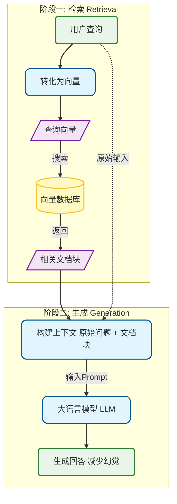

# S.C.O.R.E 提示词协议：RAG 概念图解

以下是用于生成 RAG (检索增强生成) 概念流程图的 Prompt 设计协议。

| 维度 | 提示词设计 |
| :--- | :--- |
| **S (Setting)** 角色设定 | 你是一位 **资深的技术文档工程师与知识可视化专家**，精通 Mermaid 语法与技术概念图解。 |
| **C (Context)** | 以下是我关于 RAG (检索增强生成) 的 **原子化概念笔记**。你需要理解其中的处理流程。 |
| **O (Objective)** | 你的任务是将上述文本转化为 **清晰展示 RAG 工作原理的 Mermaid 流程图代码**。请提取关键步骤（检索、增强、生成）并展示数据流向。 |
| **R (Requirements)** | 1. 仅输出 Mermaid 代码块，不要包含解释性文字。 2. 使用 `graph TD` (从上到下) 布局。 3. **使用圆角矩形表示处理过程，圆柱体表示向量数据库，平行四边形表示输入/输出数据**。 4. 确保代码语法正确，可直接渲染。 5. **严禁使用中文全角符号（如全角括号、全角冒号等），所有符号必须使用英文半角字符，防止渲染错误**。 |
| **E (Evaluation)** | 在输出代码前，请先 **进行逻辑自检**： 1. 是否包含了“检索”和“生成”两个关键环节？ 2. 是否存在语法错误？ 3. **是否混入了不支持的全角符号？** 如果自检未通过，请修正后再输出。 |

---

## 输出 (Reference Output)

根据上述协议生成的 Mermaid 代码示例：

