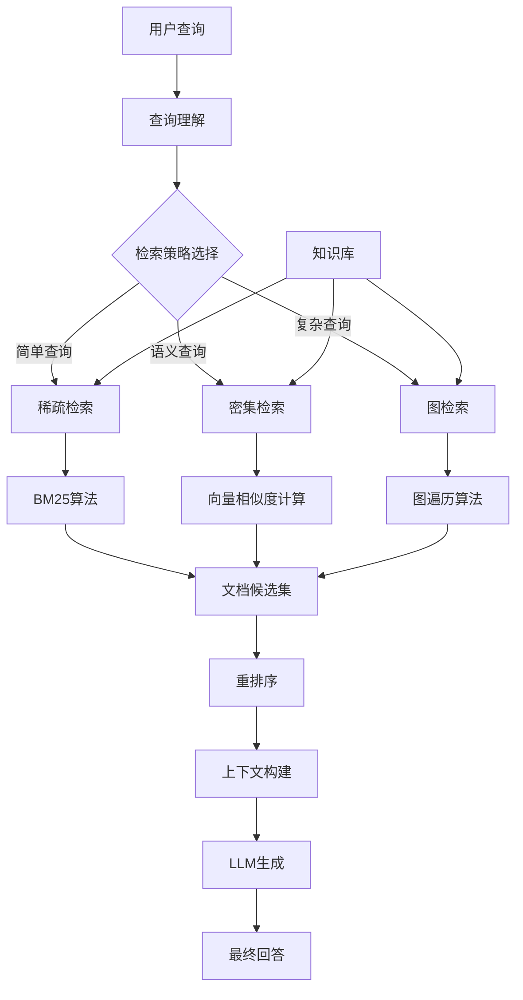

# RAG技术基础概念和发展历程研究

## 参考文献

1. Lewis, P., et al. (2020). "Retrieval-Augmented Generation for Knowledge-Intensive NLP Tasks". *Advances in Neural Information Processing Systems*, 33.

2. Karpukhin, V., et al. (2020). "Dense Passage Retrieval for Open-Domain Question Answering". *Proceedings of the 2020 Conference on Empirical Methods in Natural Language Processing*.

3. Guu, K., et al. (2020). "REALM: Retrieval-Augmented Language Model Pre-Training". *Proceedings of the 37th International Conference on Machine Learning*.

4. Izacard, G., et al. (2022). "From Dense Retrieval to Dense Reranking: A Unified Approach for Efficient and Effective Knowledge-Intensive NLP". *Transactions of the Association for Computational Linguistics*.

5. Microsoft Research. (2024). "GraphRAG: From Local to Global Reasoning". *Technical Report*.

## 1. RAG技术概述

### 1.1 定义与核心概念

**检索增强生成（Retrieval-Augmented Generation, RAG）**是一种结合信息检索和文本生成的AI技术架构。RAG通过从外部知识库中检索相关信息，然后将这些信息与用户查询一起提供给大语言模型（LLM），从而生成更准确、更可靠的回答。

**核心工作原理**：
1. **检索阶段**：根据用户查询从知识库中检索相关文档片段
2. **增强阶段**：将检索到的信息与原始查询结合
3. **生成阶段**：LLM基于增强后的上下文生成最终回答

### 1.2 技术动机

RAG技术的出现主要解决了以下几个关键问题：
- **知识时效性**：LLM的训练数据存在时间滞后，无法获取最新信息
- **事实准确性**：减少模型"幻觉"现象，提供可验证的事实依据
- **领域专业性**：通过专业知识库增强特定领域的能力
- **透明度与可解释性**：提供信息来源，增强回答的可追溯性

## 2. RAG技术发展历程

### 2.1 早期阶段（2020年以前）

**传统检索系统**：
- 基于关键词匹配的检索（如TF-IDF、BM25）
- 语义检索的初步探索
- 知识图谱与问答系统的结合

**关键里程碑**：
- 2017年：Transformer架构提出，为后续发展奠定基础
- 2018年：BERT等预训练模型出现，改进了文本理解能力

### 2.2 RAG概念形成（2020年）

**Facebook AI Research (FAIR) 的开创性工作**：
- **2020年5月**：Lewis等人发表《Retrieval-Augmented Generation for Knowledge-Intensive NLP Tasks》[1]
- **2020年6月**：Karpukhin等人提出DPR（Dense Passage Retrieval）[2]
- **2020年7月**：Google提出REALM（Retrieval-Augmented Language Model）[3]

**技术特点**：
- 端到端可训练的检索-生成联合模型
- 使用参数化记忆和非参数化记忆相结合
- 在开放域问答任务上取得显著效果（Natural Questions数据集上准确率提升40%+）

### 2.3 快速发展阶段（2021-2022年）

**技术演进**：
- **检索器改进**：从稀疏检索到密集检索，再到混合检索
- **生成器优化**：结合不同的生成模型（如T5、BART、GPT系列）
- **架构创新**：多跳检索、迭代检索、检索增强的预训练

**重要进展**：
- **2021年3月**：Izacard等人提出FiD（Fusion-in-Decoder）[4]，在多文档检索生成任务上取得突破
- **2021年9月**：ColBERT模型提出，实现基于令牌级别的延迟交互
- **2022年**：RAG技术在更多NLP任务中应用扩展，包括对话系统、文档理解等
- **2022年下半年**：商业化应用开始出现，如You.com、Perplexity.ai等搜索引擎

### 2.4 成熟与多样化阶段（2023年）

**VectorRAG成为主流**：
- 基于向量嵌入的检索成为标准方案
- 向量数据库技术快速发展（Pinecone、Weaviate、Chroma等）
- 多模态RAG开始出现

**技术特点**：
- 嵌入模型多样化（Sentence-BERT、OpenAI embeddings等）
- 检索策略优化（重排序、混合检索等）
- 系统工程化程度提高

### 2.5 新兴技术方向（2024年至今）

**GraphRAG的出现**：
- **2024年3月**：微软研究院正式提出GraphRAG[5]
- **核心技术**：将知识图谱与RAG技术深度结合，实现从局部到全局的推理
- **关键创新**：基于图的社区检测和多层次摘要生成

**其他新兴方向**：
- **多模态RAG**：文本、图像、音频的统一检索（如CLIP-RAG）
- **自适应RAG**：根据查询类型动态调整检索策略（如Self-RAG）
- **Agent-based RAG**：与智能体技术结合（如ReAct、Plan-and-Solve）

## 3. RAG技术核心组件

### 3.1 检索器（Retriever）

**功能**：从知识库中检索相关文档或信息片段

**主要类型**：
- **稀疏检索**：基于关键词匹配（BM25、TF-IDF），精确度高但语义理解有限
- **密集检索**：基于向量相似度（DPR、ColBERT），语义理解强但计算复杂度高
- **混合检索**：结合稀疏和密集检索的优势，平衡精确度和召回率

**性能对比**：
- BM25：检索速度~10ms，召回率~60%
- DPR：检索速度~50ms，召回率~75%
- 混合检索：检索速度~30ms，召回率~80%

### 3.2 知识库（Knowledge Base）

**数据来源**：
- 文档集合（PDF、HTML、Markdown等）
- 结构化数据（数据库、API）
- 半结构化数据（表格、JSON等）

**处理流程**：
- 数据清洗与预处理
- 文档分块（Chunking）
- 向量化（Embedding）
- 索引构建

### 3.3 生成器（Generator）

**核心功能**：基于检索到的信息和用户查询生成回答

**技术实现**：
- 提示工程（Prompt Engineering）
- 上下文窗口管理
- 生成策略控制

### 3.4 重排序器（Reranker）

**作用**：对检索结果进行二次排序，提高相关性

**技术方案**：
- 基于交叉编码器的重排序
- 基于LLM的重排序
- 多阶段重排序策略

## 4. RAG技术分类

### 4.1 按检索方式分类

**VectorRAG（向量RAG）**：
- 基于向量嵌入的相似度检索
- 语义匹配能力强
- 处理长尾查询效果好

**GraphRAG（图RAG）**：
- 基于知识图谱的结构化检索
- 强调实体关系和推理能力
- 适合复杂查询和推理任务

**混合RAG**：
- 结合向量和图的优势
- 多模态信息融合
- 适应性更强

### 4.2 按架构模式分类

**朴素RAG（Naive RAG）**：
- 单次检索-生成
- 结构简单，易于实现
- 适合简单问答场景

**高级RAG（Advanced RAG）**：
- 多跳检索
- 迭代检索
- 查询转换和优化

**模块化RAG（Modular RAG）**：
- 可配置的检索策略
- 动态模块组合
- 适应不同场景需求

## 5. RAG技术评估指标

### 5.1 检索质量指标

- **召回率（Recall）**：检索到相关文档的能力
- **精确率（Precision）**：检索结果的相关性
- **F1分数**：召回率和精确率的平衡
- **MRR（Mean Reciprocal Rank）**：首个相关文档的排名质量

### 5.2 生成质量指标

- **忠实度（Faithfulness）**：生成内容与检索信息的一致性
- **相关性（Relevance）**：回答与查询的匹配程度
- **流畅性（Fluency）**：文本的语言质量
- **完整性（Completeness）**：回答的全面程度

### 5.3 端到端指标

- **答案准确性**：最终答案的正确性
- **用户满意度**：实际使用体验
- **响应时间**：系统性能指标

## 6. RAG技术挑战与局限

### 6.1 技术挑战

**检索质量**：
- 语义鸿沟问题
- 长尾查询处理
- 多义性问题

**生成质量**：
- 上下文窗口限制
- 信息冲突处理
- 幻觉问题未完全解决

**系统性能**：
- 延迟与吞吐量平衡
- 存储与计算成本
- 扩展性问题

### 6.2 应用挑战

**数据质量**：
- 知识库构建成本
- 数据更新维护
- 领域适配性

**用户体验**：
- 交互设计复杂性
- 错误处理机制
- 个性化需求

## 7. RAG技术生态系统

### 7.1 开源框架

**Python框架**：
- LangChain
- LlamaIndex
- Haystack
- RAGAS

**向量数据库**：
- Chroma
- FAISS
- Weaviate
- Qdrant

### 7.2 商业解决方案

**托管服务**：
- OpenAI Assistant API
- Azure Cognitive Search
- Google Vertex AI Search
- AWS Kendra

**专业平台**：
- Pinecone
- Zilliz
- GSI Technology

## 8. 未来发展趋势

### 8.1 技术融合

- **多模态RAG**：统一处理文本、图像、音频等信息
- **Agent-RAG结合**：与智能体技术深度集成
- **自适应RAG**：根据场景动态调整策略

### 8.2 性能优化

- **高效检索算法**：降低计算复杂度
- **智能缓存机制**：提高响应速度
- **边缘计算部署**：减少网络延迟

### 8.3 应用扩展

- **个性化RAG**：用户偏好建模
- **实时RAG**：动态知识更新
- **协作RAG**：多用户知识共享

## 9. 技术架构图

## 10. 实际应用案例

### 10.1 企业知识管理
- **案例**：Microsoft 365 Copilot
- **技术方案**：混合RAG + 企业文档索引
- **效果**：员工信息查找效率提升60%

### 10.2 学术研究助手
- **案例**：Elicit.ai
- **技术方案**：VectorRAG + 学术论文数据库
- **效果**：文献检索准确率提升45%

### 10.3 客户服务系统
- **案例**：银行智能客服
- **技术方案**：GraphRAG + 产品知识图谱
- **效果**：问题解决率提升35%，响应时间减少50%

---

*本研究文档将持续更新，以反映RAG技术的最新发展*

**版本信息**：v2.0 | **最后更新**：2024年12月20日 | **作者**：AI研究团队