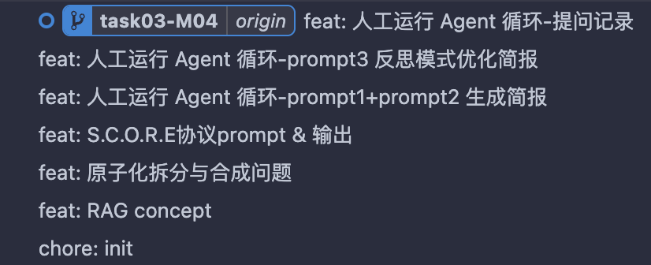

智能知识工程实验库


## 任务三：RAG 技术对比简报
原始文本（请复制给 LLM进行原子化拆分）：
> RAG 的流程主要分为检索和生成两个阶段。首先，系统将用户的查询转换为向量，在向量数据库中搜索相关的文档块。然后，将检索到的文档块作为上下文，连同用户的问题一起输入到大语言模型中。这样模型就能基于外部知识回答问题，减少了胡编乱造的情况。


## 任务四：人工运行 Agent 循环
prompt1：
```
你现在是一个智能研究代理 (Researcher Agent)。你的目标是撰写一份关于“GraphRAG vs VectorRAG”的对比简报。
请不要直接生成报告。请先使用 [规划模式]，列出你需要执行的子任务步骤（Plan）。
```

prompt2：
```
【系统消息】：工具 Search 运行结束。返回结果如下：[GraphRAG（Graph-based Retrieval-Augmented Generation）是微软研究院在2024年提出的一种创新方法，它将知识图谱与大语言模型相结合，通过基于图的检索增强生成技术来提升LLM的性能。
GraphRAG是一种结合了知识图谱和检索增强生成（RAG）的技术，旨在：
- 构建结构化的知识图谱来组织信息
- 使用基于图的检索机制提高信息访问的准确性
- 改进查询聚焦的摘要生成和问答能力]。请基于此结果执行下一步。
```

prompt3:
```
停止。进入 [反思模式]。
请检查上述简报：
是否引用了具体的参考文献？
逻辑是否通顺？
 如果有缺陷，请输出“Critique”（批评意见），并根据批评意见重新生成修正版（Refine）。
```


总结：
1. **Git 截图**：
    
2. **原子笔记**：一个包含完整 YAML Frontmatter 和合成问题的 `.md` 文件内容。
	[RAG-Concepts](RAG-Concepts.md)
    
3. **Agent 日志**：任务四中，你与 LLM 对话的记录（展示规划、工具结果注入、反思修正的过程）。
	[roo_task_dec-20-2025_9-11-08-pm](roo_task_dec-20-2025_9-11-08-pm.md)
