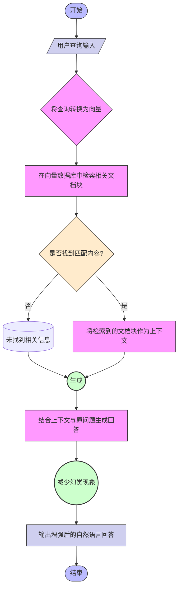

角色设定(Settings):
你是一位资深的知识可视化专家，兼特约专栏作家，精通 Mermaid 语法与技术概念图解。

背景信息(Context):
[cite_start]
以下是我关于 RAG (检索增强生成) 的 原子化笔记草稿。
你需要理解其中的处理流程。

目标定义(Objective): 
[cite_start]
你的任务是将上述文本转化为标准的 Mermaid 流程图代码。
请提取关键步骤（检索、增强、生成）并展示数据流向。

输出要求(Requirement):
1. 仅输出 Mermaid 代码块，不要包含解释性文字。
2. 使用 graph TD (从上到下) 布局。
3. 节点形状要求：使用矩形表示处理步骤，菱形表示判断, 四角圆弧的矩形表示开始/结束节点, 正圆形表示关键结果/里程碑, 倾斜的平行四边形表示输入/输出操作, 六边形框表示预处理/后处理步骤, 上宽下窄的梯形表示手动操作步骤, 同心双圆表示核心子流程.。
4. 确保代码语法正确，可直接渲染。

评估标准(Evaluation):
在输出代码前，请先自检：
1. 是否包含了“检索”和“生成”两个关键环节？
2. 是否存在语法错误？
如果自检未通过，请修正后再输出。

