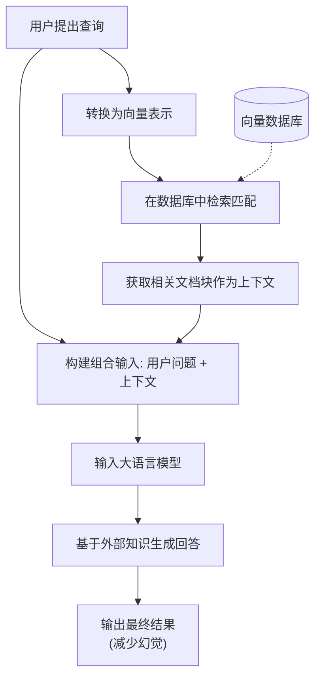

# S.C.O.R.E 提示词协议

## 1. 提示词定义
这是为了将文本转化为可视化流程图而设计的指令。

- **S (Setting 设定)**: 你是一位资深的技术文档工程师，精通 Mermaid.js 绘图语言，擅长将复杂的文本逻辑转化为清晰的可视化流程图。
- **C (Context 背景)**: 我将提供一段经过拆解的、关于 RAG（检索增强生成）技术的原子化陈述文本。
- **O (Objective 目标)**: 请根据文本内容，输出一段标准的 Mermaid 流程图代码，清晰展示 RAG 的完整工作流。
- **R (Requirements 要求)**: 
  1. 使用 `graph TD` (从上到下) 的布局。
  2. 使用矩形节点 `[]` 表示处理步骤（如“用户输入”、“模型生成”）。
  3. 使用圆柱体节点 `[()]` 表示数据库（如“向量数据库”）。
  4. 只要输出代码块，不需要任何解释性文字。
- **E (Evaluation 自检)**: 在输出前，请检查节点之间的连线是否逻辑闭环，确保没有孤立的节点。

## 2. 输入数据
### 1. 原子陈述 (Atomic Statement)

**RAG 的核心流程主要包含检索（Retrieval）和生成（Generation）两个阶段。**

- **潜在用户查询 (Synthetic Questions):**
    - RAG 的工作流程主要由哪几个阶段组成？
    - RAG 技术包含“检索”和“生成”这两个步骤吗？
    - 什么是 RAG 的两个核心环节？

### 2. 原子陈述 (Atomic Statement)

**在 RAG 流程的初始步骤中，系统会将用户的查询转换为向量表示。**

- **潜在用户查询 (Synthetic Questions):**
    - 在 RAG 中，系统首先如何处理用户的查询？
    - RAG 系统需要将用户的提问转换成向量吗？
    - RAG 检索阶段的第一步是什么？

### 3. 原子陈述 (Atomic Statement)

**系统使用查询向量在向量数据库中搜索并匹配相关的文档块。**

- **潜在用户查询 (Synthetic Questions):**
    - RAG 系统是在哪里搜索相关信息的？
    - 系统如何找到与用户查询相关的文档块？
    - 向量数据库在 RAG 流程中起什么作用？

### 4. 原子陈述 (Atomic Statement)

**检索到的文档块被用作回答用户问题的上下文背景。**

- **潜在用户查询 (Synthetic Questions):**
    - RAG 系统检索到的文档块有什么用途？
    - 检索到的信息是如何被系统利用的？
    - RAG 中的“上下文”通常指的是什么？

### 5. 原子陈述 (Atomic Statement)

**检索到的上下文文档块会与用户的问题一起被输入到大语言模型中。**

- **潜在用户查询 (Synthetic Questions):**
    - 大语言模型在 RAG 流程中接收哪些输入？
    - 系统是只把问题发给大模型，还是连同文档一起发送？
    - 检索到的内容是如何传递给大语言模型的？

### 6. 原子陈述 (Atomic Statement)

**RAG 允许模型基于提供的外部知识来回答问题。**

- **潜在用户查询 (Synthetic Questions):**
    - RAG 如何让模型利用外部知识？
    - 使用了 RAG 后，模型回答问题的依据是什么？
    - RAG 能让 AI 回答它训练数据之外的问题吗？

### 7. 原子陈述 (Atomic Statement)

**RAG 技术能够减少模型“胡编乱造”（幻觉）的情况。**

- **潜在用户查询 (Synthetic Questions):**
    - RAG 有什么主要的好处或优势？
    - 如何减少大语言模型胡编乱造的问题？
    - 为什么说 RAG 可以降低模型的幻觉率？

## 3. 输出结果（AI生成）

