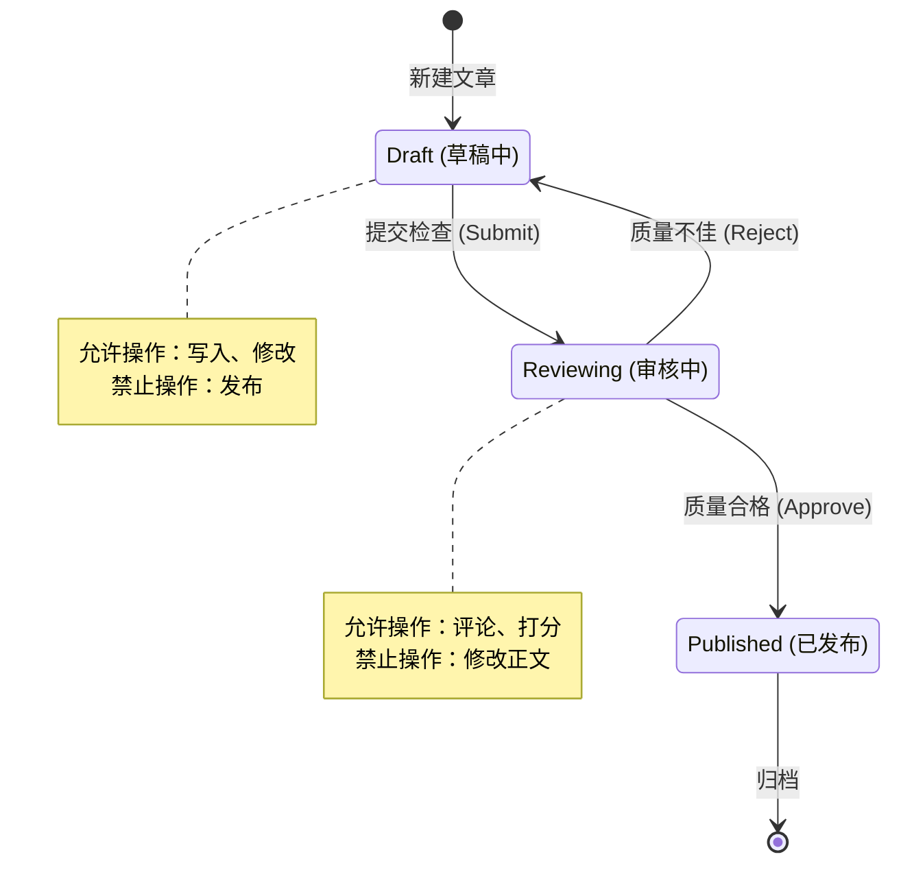

```mermaid
stateDiagram-v2
    %% 定义状态
    [*] --> Draft: 新建文章
    
    state "Draft (草稿中)" as Draft
    state "Reviewing (审核中)" as Review
    state "Published (已发布)" as Done

    %% 定义流转规则
    Draft --> Review: 提交检查 (Submit)
    
    Review --> Done: 质量合格 (Approve)
    Review --> Draft: 质量不佳 (Reject)
    
    Done --> [*]: 归档
    
    %% 注释：智能体行为限制
    note right of Draft
        允许操作：写入、修改
        禁止操作：发布
    end note
    
    note right of Review
        允许操作：评论、打分
        禁止操作：修改正文
    end note
```
