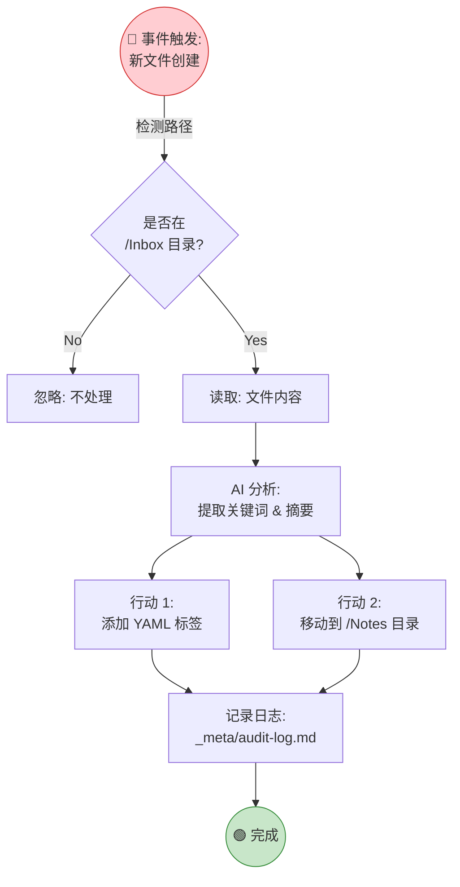

```mermaid
graph TD
    %% 1. 事件触发层
    Event((🔴 事件触发:<br>新文件创建)) -->|检测路径| Condition{是否在<br>/Inbox 目录?}
    
    %% 2. 逻辑判断层
    Condition -- No --> Ignore[忽略: 不处理]
    Condition -- Yes --> Read[读取: 文件内容]
    
    %% 3. 智能处理层 (Agent)
    Read --> Analysis[AI 分析:<br>提取关键词 & 摘要]
    
    %% 4. 行动执行层 (Side Effects)
    Analysis --> Action1[行动 1:<br>添加 YAML 标签]
    Analysis --> Action2[行动 2:<br>移动到 /Notes 目录]
    
    %% 5. 结束
    Action1 & Action2 --> Log[记录日志:<br>_meta/audit-log.md]
    Log --> End((🟢 完成))
    
    %% 样式
    style Event fill:#ffcdd2,stroke:#d32f2f
    style End fill:#c8e6c9,stroke:#388e3c
```
