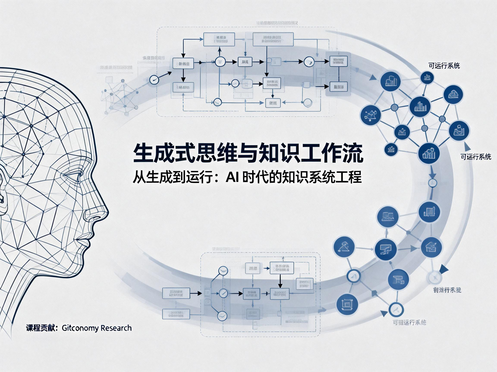
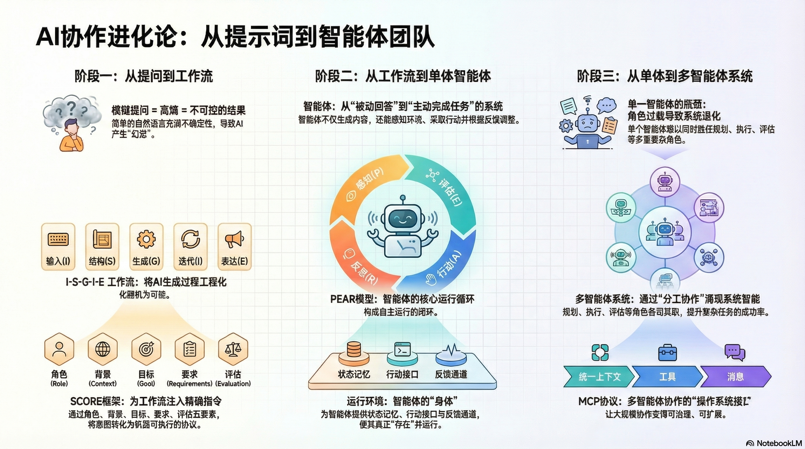
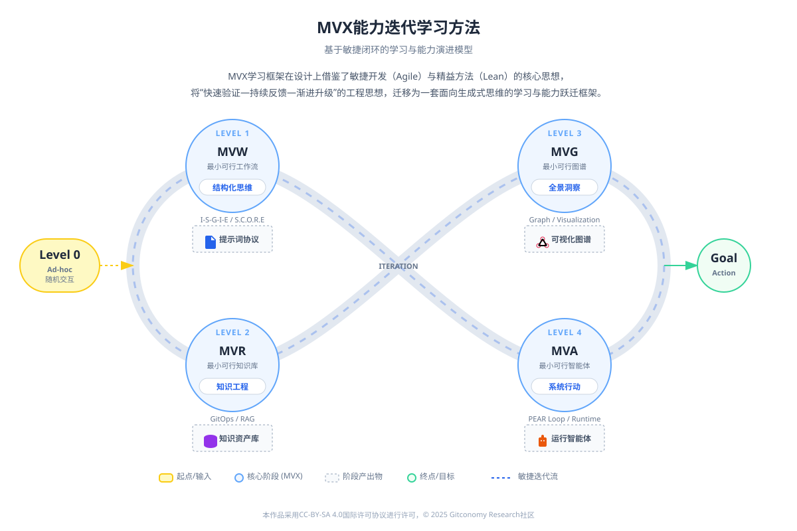

# 生成式思维与知识工作流 (Generative Thinking & Knowledge Workflows)

> **从“向 AI 提问”，到“设计一个能持续为你工作的智能系统”。**

[]() []() []()   []() [](https://creativecommons.org/licenses/by-sa/4.0/deed.zh)

## 1. 课程简介（Brief Introduction )

本课程是《生成式思维与智能工作系统》体系的理论部分。这不是一份简单的Prompt大全，而是一套面向未来的知识工程体系。在生成式 AI 时代，真正的竞争力不再是“会写提示词”，而是具备**生成式思维**，并能构建**可运行、可复用、可演进**的知识工作流。本课程将带你完成从“单点工具使用者”到“智能系统编排者”的认知跃迁。



核心主张：

- **Prompt即协议 (Protocol)：** 不仅仅是聊天，而是人机交互的结构化通信协议（如 S.C.O.R.E 模型）。
- **知识即代码 (Knowledge as Code)：** 像管理软件代码一样，通过Git版本控制管理你的知识资产。
- **Agent 即系统 (System)：** 超越单次问答，构建具备感知、决策、行动、反思（PEAR）能力的智能体。

---

## 2. 学习路线图 (Course Curriculum)

本课程共[8个模块](./02-Syllabus/syllabus.md)，分为三个进阶阶段：


*图：课程学习路线图*
### 第一阶段：思维重构与协议构建 (Mindset & Protocol)
建立生成式思维，掌握将模糊意图转化为机器可执行协议的能力。
* **[Module 01：课程导论](./03-Modules/module01-introduction.md)**
    * 跨越“锯齿状技术前沿”，理解从搜索思维到生成式思维的范式转移。
* **[Module 02：重构知识工作流](./03-Modules/module02-workflow-thinking.md)**
    * **MVW(最小可行工作流)：** 从“单次生成”走向“流程化作业”。
    * 核心模型：**I-S-G-I-E** (输入-结构-生成-迭代-表达)。
* **[Module 03：结构化提示工程](./03-Modules/module03-structured-input.md)**
    * 将Prompt视为机器协议。
    * 核心框架：**S.C.O.R.E** (Setting, Context, Objective, Requirements, Evaluation) 与 **CO-STAR**。

### 第二阶段：智能知识工程 (Intelligent Knowledge Engineering)
为 AI 准备高质量的“食物”，构建机器可读的知识底座。
* **[Module 04：智能知识工程体系](./03-Modules/module04-Intelligent-Knowledge-Engineering.md)**
    * **知识即代码**：Git 工作流在知识管理中的应用。
    * **RAG基座**：语义分块、元数据管理与知识图谱构建 (GraphRAG)。
    * **Knowledge Ops**：构建持续集成/持续部署的知识流水线。

### 第三阶段：智能体系统构建 (Agentic Systems)
从被动问答走向主动行动，构建多智能体协作网络。
* **[Module 05：构建本地化知识助手智能体](./03-Modules/module05-agentic-workflows.md)**
    * 智能体核心架构：**PEAR模型** (Perceive-Evaluate-Act-Reflect)。
    * 设计模式：反思、工具使用与规划。
* **[Module 06：智能体运行环境 (Agent Runtime)](./03-Modules/module06-agent-runtime.md)**
    * **MVA(最小可行Agent)：** 构建具备状态、记忆与行动出口的本地闭环系统。
    * 核心原则：本地优先、人机回路 (HITL)。
* **[Module 07：多智能体协作体系 (MCP)](./03-Modules/module07-mcp-agent-build.md)**
    * **MCP(Model Context Protocol)：** 理解Agent时代的“USB协议”。
    * 构建Planner、Executor、Critic分工协作的智能体网络。

### 最后，课程总结
- **[Module 08: 课程总结](./03-Modules/module08-summary.md)**
	* 价值链重构：从 DIKW 到 **DIKWA** (Data-Information-Knowledge-Wisdom-**Action**)。

---

## 3. 核心方法论 (Key Frameworks)

本课程不仅仅提供工具，更提供一套从**思维**到**系统**的完整工程化方法论。以下模型按课程进阶路径排列：

| **核心理论模型**           | **全称**                           | **定义与核心价值**                                                                              | **来源**                                                  |
| -------------------- | -------------------------------- | ---------------------------------------------------------------------------------------- | ------------------------------------------------------- |
| **MVW**              | **Minimum Viable Workflow**      | **最小可行工作流**。拒绝过度设计，先构建一个包含“输入-处理-反馈-输出”的最简闭环，验证 AI 协作的可行性。                               | [Module 02](./03-Modules/module02-workflow-thinking.md) |
| **I-S-G-I-E**        | **Workflow Stages**              | **知识处理五环**。将复杂的知识任务拆解为标准步骤：输入(Input)、结构(Structure)、生成(Generate)、迭代(Iterate)、表达(Express)。 | [Module 02](./03-Modules/module02-workflow-thinking.md) |
| **S.C.O.R.E**        | **Structure for Prompts**        | **提示词结构标准**。通过角色(S)、背景(C)、目标(O)、要求(R)、评估(E)五要素，将模糊意图转化为机器可执行的“软协议”。                      | [Module 03](./03-Modules/module03-workflow-thinking.md) |
| **MVR**              | **Minimum Viable Repository**    | **最小可行知识库**。基于 Git 版本控制和元数据规范构建的工程化知识底座，确保知识资产“机器可读”且“历史可溯”。                             | [Module 04](./03-Modules/module04-workflow-thinking.md) |
| **PEAR**             | **Agent Loop**                   | **智能体运行闭环**。将智能体行为解构为四个系统阶段：感知(Perceive) → 评估(Evaluate) → 行动(Act) → 反思(Reflect)。         | [Module 05](./03-MOdules/module05-workflow-thinking.md) |
| **MVG**              | **Minimum Viable Graph**         | **最小可行图谱**。在本地构建包含核心实体与关系的最小知识图谱 (GraphRAG)，赋予智能体跨文档推理与全局结构理解能力。                         | [Module 05](./03-Modules/module05-workflow-thinking.md) |
| **Agentic Workflow** | **Agentic Workflow**             | **智能体式工作流**。从被动的“问答模式”升级为“主动行动模式”。系统基于目标(Goals)、状态(State)与事件(Events)持续运行，而非单次触发。         | [Module 05](./03-MOdules/module05-workflow-thinking.md) |
| **Agent Runtime**    | **Agent Runtime**                | **智能体运行环境**。承载智能体的系统基础设施，提供状态管理、记忆存储、行动接口与反馈通道，决定了智能体能力的上限。                              | [Module 06](./03-Modules/module06-workflow-thinking.md) |
| **MVA**              | **Minimum Viable Agent**         | **最小可行智能体**。在本地运行环境中构建的具备完整 PEAR 闭环、且“推理外包、状态内生”的最小工程实体。                                 | [Module 06](./03-Modules/module06-workflow-thinking.md) |
| **DIKWA**            | **Data-Info-Know-Wisdom-Action** | **价值链重构**。在传统的DIKW知识金字塔顶端增加Action (行动)，标志着从“给建议”到“做任务”的范式跃迁。                             | [Module 08](./03-Modules/module08-workflow-thinking.md) |

1. **MVW / I-S-G-I-E(Module 2)**: 起步，先学会把任务变成流程。
2. **S.C.O.R.E(Module 3)**: 细化，学会写好流程中的每一个 Prompt 协议。
3. **MVR (Module 4)**: 沉淀，把流程产物变成工程化的知识资产（Git/元数据）。
4. **PEAR / MVG / Agentic Workflow (Module 5)**: 升维，从线性流程升级为具备图谱记忆和循环能力的智能体逻辑。
5. **Agent Runtime / MVA(Module 6)**: 落地，把智能体逻辑变成可运行、可独立存在的系统实体。
6. **DIKWA(Module 8)**: 总结，升华整个课程的价值链条。

---

## 4. 课堂实验与作业 (Labs & Assignments)

本课程采用💻 **TBL(Task-Based Learning)** 模式，实验与作业分为 **核心 Labs (Labs)** 与 **进阶任务(Tasks)** 两部分，所有的练习都基于真实的Gi 协作流程。

###  🧪 核心实验 (Core Labs)

这两个实验是课程的基础，旨在帮助学习者快速建立认知与流程感。

* **Lab 01**: [体验生成式思维与幻觉边界](./04-Labs/lab01-guide.md)
* **Lab 02**: [设计你的第一个 MVW](./04-Labs/lab02-guide.md)

### 📝 进阶实践任务 (Advanced Tasks)

这些任务贯穿于后续章节，构成了完整的**生成式知识工作流螺旋上升路径**。

* **Lab 03**: [把“提示词”变成可执行的工作流语言](./04-Labs/lab03-guide.md)
* **Lab 04**: [构建智能知识系统的工程化基座](./04-Labs/lab04-guide.md)
* **Lab 05**: [构建本地智能知识助手](./04-Labs/lab05-guide.md)
* **Lab 06**: [本地优先智能体运行环境实验](./04-Labs/lab06-guide.md)
* **Lab 07**: [基于MCP的最小化Agent实现](./04-Labs/lab07-guide.md)

<br>
💡 实验对应说明：每个实验对应相应的章节，例如Lab 01对应第一章讲义的知识点。

### 📚 推荐工具栈(Tools)

为了实现“本地优先”与“智能体构建”，本课程推荐以下工具：

- **LLM 推理**：[DeepSeek](https://chat.deepseek.com/)/[Qwen](https://www.qianwen.com/) (通过 API 或本地部署)
- **知识库**：[Obsidian](https://obsidian.md/) (支持本地Markdown与插件扩展)
- **AI客户端**: [Cherry Studio](https://www.cherry-ai.com/)
- **版本控制**：[GitLink](https://www.gitlink.org.cn)
- **协议标准**：Model Context Protocol (MCP)
- **模型源**: [ModelScope (魔搭社区)](https://modelscope.cn/)

---

## 5. 课程学习方法 （Learning Methodology）

**MVX四步法：从“会用AI”到“能跑起来的工作系统”**

MVX学习框架在设计上借鉴了敏捷开发（Agile）与精益方法（Lean）的核心思想，将其抽象为适用于知识工作与生成式 AI 学习的通用方法论。首先，MVW（最小可行工作流）对应敏捷中的 _MVP_ 理念，强调尽早跑通一条“能工作的最小系统”，避免在工具、技巧或完美方案上过度设计；其次，MVG（最小可行治理）与精益中的“减少浪费、建立反馈回路”一致，通过评估标准与反思机制，让系统在运行中不断纠偏；MVR（最小可行运行）体现了敏捷的迭代节奏，要求工作流可重复、可审计，而非一次性成果；最终，MVA（最小可行智能体）则对应持续改进与自动化升级，将稳定流程逐步交由智能体执行。



*图：MVX学习方法框架图*

整体而言，MVX将“快速验证—持续反馈—渐进升级”的工程思想，迁移为一套面向生成式思维的学习与能力跃迁框架。

---

## 6. 学习路径与作业提交 （Task Assignments）

本课程模拟真实的开源软件协作流程，所有学习与作业提交均遵循 **“小组协作 + 个人贡献可追溯”** 的基本原则。请在开始课程前，认真阅读并遵守以下流程规范。

### 6.1 环境准备（Pre-flight Check）

在正式开始课程实验前，请完成以下准备工作：

* 阅读 `📁 01-guidebook/tool-setup-guide.md`
* 全员安装 **Obsidian**（用于知识整理与过程记录）
* 全员安装 **Cherry Studio**（将在后续章节使用）
* 申请并配置 **ModelScope API Key**

### 6.2 获取仓库（Fork & Clone）

* 由队长`Fork`本仓库到个人GitLink账号
* 队员`clone`队长`Fork`的仓库到本地进行协作
* 小组内部协作均基于`队长Fork的仓库`进行

### 6.3 完成任务（Mission Execution）

* 理论学习材料位于 `📁 03-Modules`
* 实验操作指南位于 `📁 04-Labs`
* 可复用模板与脚手架位于 `📁 05-Templates`

### 6.4 作业提交规范（Submission Rules）

所有实验作业统一提交至：

```text
📁 GT-Workflow-Course-2025/08-Workspace/
```

并遵循 **“先建小组目录，再提交个人文件”** 的提交规则。

#### 6.4.1 小组目录优先原则（必须遵守）

从所有实验作业必须遵循以下结构：

```markdown
GT-Workflow-Course-2025/08-Workspace/
└── Assignment-M01/
    └── GroupName/                              ## 每个小组自己的名字
        ├── README.md
        ├── zhangshan-lab-log-01.md
        ├── lisi-lab-log-01.md
        └── wangwu-lab-log-01.md
```

**规则说明：**

* `GroupName` 由组长创建，作为本组统一提交入口
* `README.md` 由组长维护，用于说明：

  * 本组选择的任务背景
  * 小组共识流程
  * 成员分工说明

* 每位成员 **必须提交独立文件**，体现个人实践与思考

#### 6.4.2 个人文件提交要求

* 文件必须放置在对应小组目录下
* 文件命名建议包含个人标识，例如：

```4
zhangsan-mvw.md
lisi-mvw.md
```

* 内容可以基于小组共识任务
* 但必须体现**个人对流程 / Prompt / 迭代的独立理解**


#### 6.4.3 提交顺序建议（教学友好）

1. 组长先创建 `GroupName` 目录并提交 `README.md`
2. 组员依次提交个人实践文件
3. 组内完成互评与必要修订
4. **由组长统一发起 Pull Request**

### 6.5 Pull Request 提交说明

* **PR 由队长统一发起**，面向课程主仓库
* PR标题规范：

```markdown
[小组名]lab01-任务提交
```

**示例：**

```markdown
[银河护卫队]lab01-任务提交
```

* PR 描述中需简要说明：

  * 本次提交覆盖的实验章节
  * 是否完成小组内互评
  * 是否所有成员均已提交个人文件

---

## 7. 仓库导航 (Directory Map)

```markdown
GT-Workflow-Course-2025/
├── 📁 01-Guidebook/      # [必读] 包含工具安装、评分标准、Git操作指南
├── 📁 02-Syllabus/       # [大纲] 详细的学习目标与能力地图
├── 📁 03-Modules/        # [课件] 所有的理论学习材料 (Markdown/PPT)
├── 📁 04-Labs/           # [实验] Step-by-Step的技术实操手册
├── 📁 05-Templates/      # [模板] 拿来即用的Prompt和Config文件
├── 📁 06-Tools/          # [工具] 辅助脚本与软件下载清单
├── 📁 07-Assets/         # [素材] 课程演示用的图片与数据
└── 📁 08-Workspace/      # [作业] 你们的主战场，请在此提交代码
````
---

## 8. 互助与支持 （Peer Support）

- **Issues**: 遇到技术难题或发现课件错误，请在仓库的[`Issues`](https://www.gitlink.org.cn/Gitconomy/Git4GenThinking/issues) 区提问（请使用提供的 Issue Template）。

- **Discussions**: 分享灵感、寻找队友或讨论非技术话题，请前往[`Wiki`](https://www.gitlink.org.cn/Gitconomy/Git4GenThinking/wiki)区。

---
## 许可声明

本文档采用 [知识共享署名--相同方式共享 4.0 国际许可协议 (CC BY--SA 4.0)](https://creativecommons.org/licenses/by-sa/4.0/deed.zh) 进行许可， &copy; 2025 Gitconomy Research社区。
