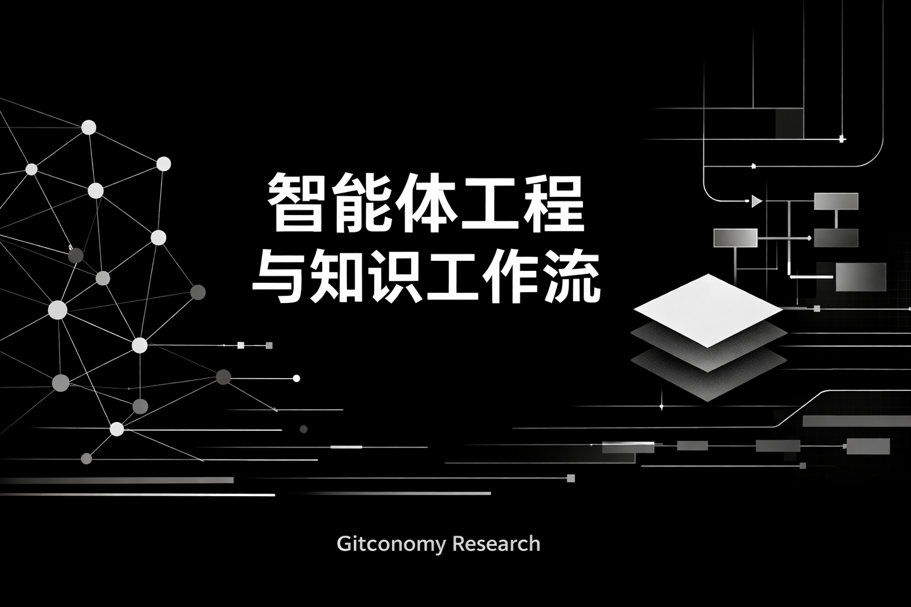
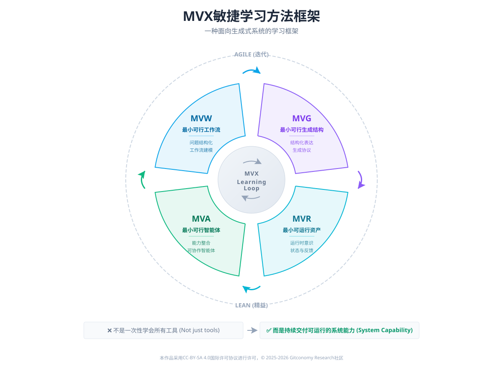

# 《智能体工程与知识工作流》课程体系说明

🔁 **从“提示词技巧”到“设计、运行与演进智能体系统”**

Git4GenThinking 是一门面向真实工作场景的智能体工程与 AI 知识工作流课程仓库。通过结构化输入、Prompt 设计、Workflow 模板化、到最终构建基于 MCP 协议的可运行智能体，让学习者从“会让 AI 回答”进阶到“会让 AI 工作”。

    
## 1. 课程简介

当生成式 AI 将知识生产推向“智能编排”的新时代，大多数实践者却仍受困于“工具使用”的孤岛：会写提示词，却无法构建系统。为了跨越从单次生成到持续产出的工程鸿沟，《智能体工程与知识工作流》课程致力于引导学习者完成关键的能力跃迁——从被动“使用”AI，升级为主动“设计与工程化”智能体系统。

课程超越了对单一工具或模型的讲解，聚焦于一个更本质的命题：如何利用 AI 的推理与行动能力，将离散的知识工作重构为**可运行、可演进的自动化系统**。




<br>

我们像开发软件一样“开发”知识体系，像管理代码一样管理 AI 提示词与智能体配置。

👥 **课程适合人群**

- 希望系统性理解 **Agentic AI** 的知识工作者
- 正在探索 **Agentic Workflow** 的开发者与研究者
- 对“AI + 知识工程 / 自动化 / 组织协作”感兴趣的实践者
- 不满足于碎片化“提示词技巧”的系统学习者

---

## 2. 课程目标 （Course Objectives）

教学目标不仅是工具堆堆砌，而是深入探讨在 AI 具备生成、推理与行动能力的前提下，如何将传统工作流重构为具备鲁棒性与演进能力的**智能体网络**。

| **维度**                 | **课程目标描述**                                  |
| ---------------------- | ------------------------------------------- |
| **认知目标 (Thinking)**    | 建立智能体工程观，理解 AI 从“对话工具”到“系统要素”的范式转变。         |
| **方法目标 (Method)**      | 掌握知识任务的结构化与协议化方法，利用 SCORE、MVX 等框架设计可复用的工作流。 |
| **能力目标 (Skill)**       | 掌握 Agent Skills（规划、反思、工具调用等），并映射至实际业务场景。    |
| **系统目标 (System)**      | 理解状态、记忆、约束、接口在智能体系统中的核心作用。                  |
| **工程目标 (Engineering)** | 构建最小可行智能体（MVA），理解 MCP 等协议在多智能体协作中的意义。       |
| **实践目标 (Practice)**    | 实现从“临时对话”向“可复用、可审计、可协作的工作流资产”的转型。           |

---

## 3. 课程学习方法论

课程采用统一的方法框架 **MVX 四步法**，一种面向生成式系统的学习框架，避免“做完一次就结束”的学习陷阱。MVX借鉴了敏捷开发（Agile）与精益思想（Lean）中“以最小可行成果驱动迭代、以真实反馈持续改进”的核心原则，将复杂的智能系统学习过程拆解为可验证、可积累的学习阶段。  



在 MVX 框架中，学习不以“是否学会某个功能”为终点，而以“是否形成可运行、可复用的系统能力”为判断标准。通过 **MVW（最小可行工作流）→ MVG（最小可行生成系统）→ MVR（最小可运行资产）→ MVA（最小可行智能体）** 的递进路径，学习者像推进一个敏捷项目一样，不断交付“可运行的中间成果”，避免一次性设计与空洞理解。这一过程强调快速验证、持续反思与价值沉淀，使学习本身成为一条可持续演进的工程化路径，而非一次性的知识消费。

- **MVW（Minimum Viable Workflow）** 聚焦“理解任务”：学习者首先学会把模糊目标拆解为可运行的最小工作流，建立对生成过程的整体认知。
- **MVG（Minimum Viable Grammar）** 聚焦“表达能力”：通过结构化提示与协议化输入，训练将思考转译为机器可执行语言的能力。
- **MVR（Minimum Viable Runtime）** 聚焦“系统意识”：引导学习者理解状态、记忆与反思如何支撑持续运行，而非单次生成。    
- **MVA（Minimum Viable Agent）** 聚焦“能力整合”：在前述学习成果之上，完成一个可协作、可审计的最小智能体系统。

<br>
因此，MVX的本质不是教你“多快搭一个 Agent”，而是训练你如何循序完成从认知、方法到系统的学习跃迁。它把“学习”本身视为一条可运行、可迭代的工作流，使能力真正沉淀为可迁移的长期资产。

---

## 4. 课程体系设计

本课程构建了一个四层递进（入门启蒙 → 认知范式 → 能力组件 → 系统实现）的课程体系，确保不同背景的学习者都能找到切入点：

| **课程系列**                                                               | **阶段定位** | **核心教学重点**                                     | **对应 MVX 阶段**                   | **预期学习成果**                 |
| ---------------------------------------------------------------------- | -------- | ---------------------------------------------- | ------------------------------- | -------------------------- |
| [**🐣 入门篇**](./Agentic-KW-Engineering-2026/README.md)<br> (Onboarding) | **直觉培养** | 生成式 AI 基础能力、高效对话直觉、基础 Prompt 模板使用              | **Quick Start**                 | 消除 AI 恐惧，实现从 0 到 1 的单点任务增效 |
| [**📚 理论篇**](./GT-Workflow-Course-2025/README.md)<br> (Theory)         | **认知建模** | 智能体工程观、SCORE 框架、知识工作流（Workflow）建模方法论           | **MVW** (Workflow)              | 理解“系统化生成”逻辑，具备拆解模糊任务的能力    |
| **🛠️ 工具篇**<br> (Tooling)                                              | **能力解构** | Agent Skill（规划/反思/工具调用）、Cherry 助手封装、RAG 基础实战   | **MVG & MVR** (Grammar/Runtime) | 熟练配置与组合智能体能力单元，实现工作流自动化    |
| **🚀 开发篇**<br> (Development)                                           | **工程落地** | Agentic Workflow 设计、**MCP 协议**协作、多智能体系统（MAS）构建 | **MVA** (Agent)                 | 具备设计、实现与演进复杂智能工作系统的架构能力    |

---

## 5. 课程 Git 分支策略设计

Git 不仅是托管工具，更是课程运行的核心基础设施。通过四分支协作模型，使学习过程具备工程化、可追溯特征。

| **分支名称**        | **分支定位** | **承载内容**             |
| --------------- | -------- | -------------------- |
| **`main`**      | 稳定基线     | 已验证、可复用的课程标准讲义与示例工程  |
| **`dev`**       | 教学演进     | 讲义修订、实验流程调整等演进中的内容   |
| **`feature/*`** | 功能探索     | 教学辅助工具、实验脚本或局部功能验证   |
| **`learning`**  | 学习轨迹     | 学员个人已完成、阶段稳定的作业与实验成果 |

Git 成为连接学习、反馈与课程演进的统一载体。学习不再是一次性提交作业，而是一个持续构建、反思与积累的过程。Git 也不只是工具，而是课程方法论本身的重要组成部分。

---

## 6. 如何开始学习

本课程采用 **Git 驱动的学习与作业提交模式**。所有学习成果、实验记录与作业提交，均通过 Git 仓库进行版本化管理。
### Fork课程仓库

点击仓库页面右上角的 **`Fork`** 按钮，将课程仓库复制到你的GitLink账号下。  `Fork`后，你将拥有一个独立可写的个人仓库，用于完成课程中的所有实验与作业。

### Clone到本地

将你的 Fork 版本克隆到本地电脑：

```bash
`git clone [https://gitlink.org.cn/你的用户名/Git4GenThinking.git]`
```

进入项目目录：

```bash
cd Git4GenThinking
```

此时你已经拥有一份**完整的本地学习环境**。


### 创建你的学习分支（推荐做法）

请不要直接在 `main` 、`dev`或'feature‘ 分支上进行作业修改。  为每次实验或作业创建独立的分支，例如`leraning/{yourname}`

```bash
git checkout -b learning/zhangshan

```

后续所有修改、提交均在该分支中完成。

---
## 许可声明

本文档采用 [知识共享署名--相同方式共享 4.0 国际许可协议 (CC BY--SA 4.0)](https://creativecommons.org/licenses/by-sa/4.0/deed.zh) 进行许可， &copy; 2025-2026 Gitconomy Research社区。
