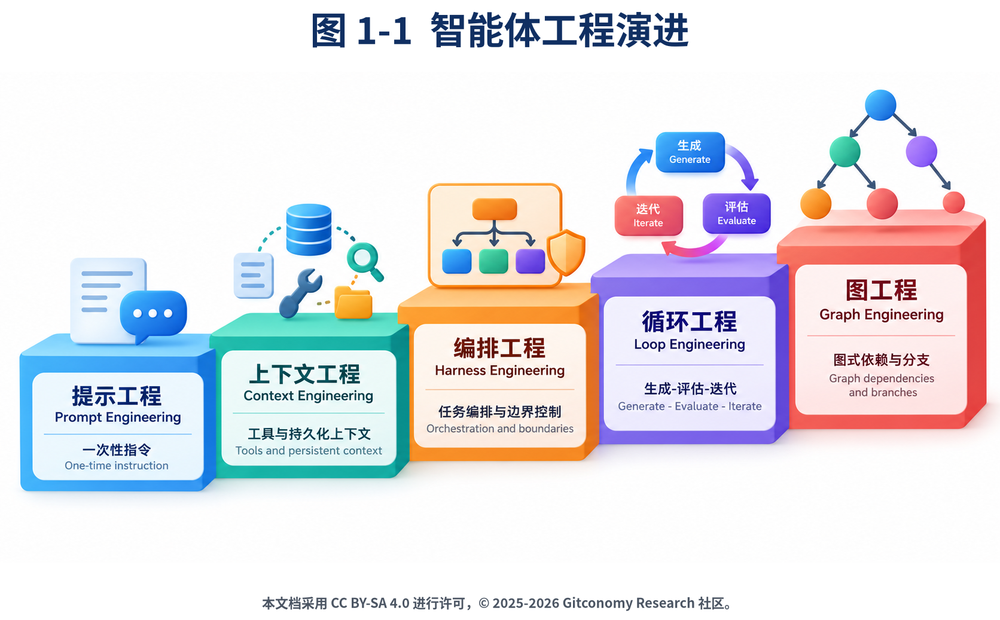

# [会写规格，就会造出你的专属 harness](https://gitlink.org.cn/Gitconomy/Git4GenThinking/tree/main/courses/course-sdd-engineering/)
## 第 1 章 认识 SDD
  - 1. 智能体的工程化演进：为什么需要 SDD
    - 1.1 从提示词工程到 Graph 工程
    
    - 1.2 什么是 harness
    - 1.3 为什么用 SDD
    - 1.4 当前 harness 生态与趋势
    - 1.5 开源实践的分层结构
      - 用 SDD 把通用 harness 变成专属 harness
    - 1.6 智能体、工具、助手的边界
    - 1.7 观察你的 agent：工具、助手、智能体差异
  - 2. 认识你的载体：OpenCode
    - 2.1 OpenCode 是什么
    - 2.2 装上并跑起来
    - 2.3 安装命令速查
      - /init
      - /share
      - /details
      - /editor, /exit
      - !ls
    - 2.4 案例：一个最小的专属 agent 配置（Karpathy 风格）
  - 3. 认识 Deep Research 并让它做一次真实研究
    - 3.1 第一次跑：让默认 agent 做研究
    - 3.2 一次研究的输出长什么样
## 第 2 章 从聊天到规格：AI编程的新范式
  - 本章导读
  - 1. 从差距到解决方案
  - 2. Karpathy 原则：让 AI 守纪律
    - 1. 先思考（Think Before Coding）：不确定就问，有更简单的方法就说出来
    - 2. 简单优先（Simplicity First）：能用简单方案就不用复杂方案
    - 3. 精准修改（Surgical Changes）：只改必须改的，不波及其他代码
    - 4. 目标驱动（Goal-Driven Execution）：明确目标再动手，不做无用功
    - 最小体验样例：让 AI 守纪律
  - 3. OpenSpec：让需求可追踪
    - 最小体验样例：让需求可追踪
    - npm install -g @fission-ai/openspec@latest
    - mkdir todo-app && cd todo-app
    - openspec init
    - /opsx:propose 添加用户登录功能
    - ls openspec/changes/add-user-auth/
  - 4. Superpowers：让执行可验证
    - Superpowers 的工作流是： brainstorm → spec → plan → build → review → merge
    - 4.2 安装 Superpowers
    - 4.3 验证安装是否成功
    - 4.4 最小体验样例：让执行可验证
    - 4.5 常见问题与使用边界
  - 5. GStack：让复杂任务可管理
    - 5.1 GStack 解决什么问题？
      - GStack 是 YC CEO Garry Tan 开发的开源工具。它提供一组斜杠命令，每个命令激活一个专家角色：
        ```
        /office-hours    → CEO：重新定义问题
        /plan-ceo-review → CEO：审视产品方向
        /plan-eng-review → 架构师：锁定技术方案
        /review          → 工程经理：代码审查
        /qa              → QA：打开真实浏览器测试
        /ship            → 发布经理：测试、提交、部署
        ```
    - 5.2 安装 GStack
      - git clone --single-branch --depth 1 https://github.com/garrytan/gstack.git ~/gstack
      - cd ~/gstack
      - ./setup --host opencode
    - 5.3 验证安装是否成功
    - 5.4 如何使用 GStack
      - GStack 的使用顺序应从问题定义开始，再逐步进入方案、实现、审查和测试。一个常见的最小路径是：
        ```
        /office-hours       → 说清问题、用户和目标
        /plan-ceo-review    → 审视产品方向和范围
        /plan-eng-review    → 审视架构、数据流和技术风险
        /review             → 检查当前分支的代码改动
        /qa                 → 在真实浏览器或测试环境中验证功能
        /ship               → 汇总检查结果，准备交付
        这些命令不是必须全部运行。产品想法可以先用 /office-hours；已有代码的功能修改可以从 /plan-eng-review 或 /review 开始；涉及网页交互时再使用 /qa。使用 /ship 前，应确认测试、代码审查和发布权限都在自己的授权范围内。
        ```
    - 5.5 最小体验样例：让复杂任务可管理
      - use Gstack office-hours 我想做一个帮助学生管理作业的 AI 助手
    - 5.6 常见问题与使用边界