# [会写规格，就会造出你的专属 harness](https://gitlink.org.cn/Gitconomy/Git4GenThinking/tree/main/courses/course-sdd-engineering/)
## 第 1 章 认识 SDD
  - 1. 智能体的工程化演进：为什么需要 SDD
    - 1.1 从提示词工程到 Graph 工程
    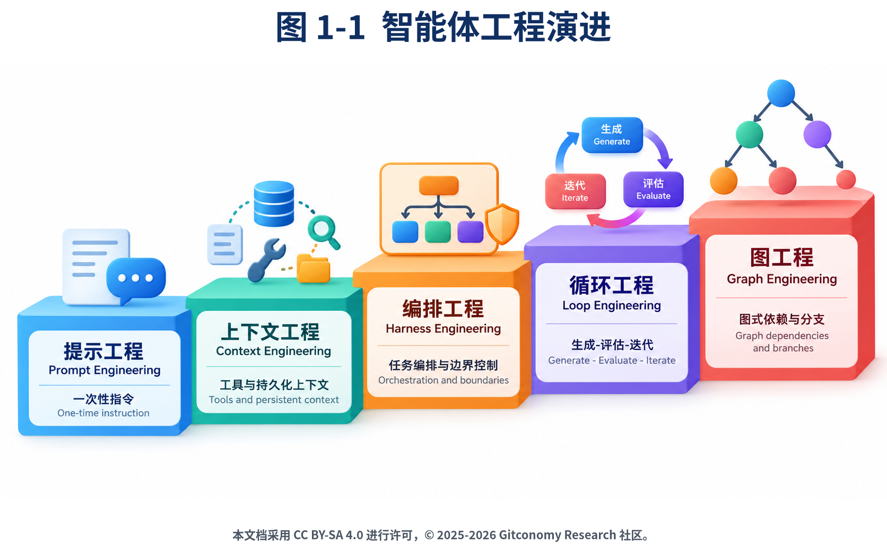
    - 1.2 什么是 harness
    - 1.3 为什么用 SDD
    - 1.4 当前 harness 生态与趋势
    - 1.5 开源实践的分层结构
      - 用 SDD 把通用 harness 变成专属 harness
    - 1.6 智能体、工具、助手的边界
    - 1.7 观察你的 agent：工具、助手、智能体差异
  - 2. 认识你的载体：OpenCode
    - 2.1 OpenCode 是什么
    - 2.2 装上并跑起来
    - 2.3 安装命令速查
      - /init
      - /share
      - /details
      - /editor, /exit
      - !ls
    - 2.4 案例：一个最小的专属 agent 配置（Karpathy 风格）
  - 3. 认识 Deep Research 并让它做一次真实研究
    - 3.1 第一次跑：让默认 agent 做研究
    - 3.2 一次研究的输出长什么样
## 第 2 章 从聊天到规格：AI编程的新范式
  - 本章导读
  - 1. 从差距到解决方案
  - 2. Karpathy 原则：让 AI 守纪律
    - 1. 先思考（Think Before Coding）：不确定就问，有更简单的方法就说出来
    - 2. 简单优先（Simplicity First）：能用简单方案就不用复杂方案
    - 3. 精准修改（Surgical Changes）：只改必须改的，不波及其他代码
    - 4. 目标驱动（Goal-Driven Execution）：明确目标再动手，不做无用功
    - 最小体验样例：让 AI 守纪律
  - 3. OpenSpec：让需求可追踪
    - 最小体验样例：让需求可追踪
    - npm install -g @fission-ai/openspec@latest
    - mkdir todo-app && cd todo-app
    - openspec init
    - /opsx:propose 添加用户登录功能
    - ls openspec/changes/add-user-auth/
  - 4. Superpowers：让执行可验证
    - Superpowers 的工作流是： brainstorm → spec → plan → build → review → merge
    - 4.2 安装 Superpowers
    - 4.3 验证安装是否成功
    - 4.4 最小体验样例：让执行可验证
    - 4.5 常见问题与使用边界
  - 5. GStack：让复杂任务可管理
    - 5.1 GStack 解决什么问题？
      - GStack 是 YC CEO Garry Tan 开发的开源工具。它提供一组斜杠命令，每个命令激活一个专家角色：
        ```
        /office-hours    → CEO：重新定义问题
        /plan-ceo-review → CEO：审视产品方向
        /plan-eng-review → 架构师：锁定技术方案
        /review          → 工程经理：代码审查
        /qa              → QA：打开真实浏览器测试
        /ship            → 发布经理：测试、提交、部署
        ```
    - 5.2 安装 GStack
      - git clone --single-branch --depth 1 https://github.com/garrytan/gstack.git ~/gstack
      - cd ~/gstack
      - ./setup --host opencode
    - 5.3 验证安装是否成功
    - 5.4 如何使用 GStack
      - GStack 的使用顺序应从问题定义开始，再逐步进入方案、实现、审查和测试。一个常见的最小路径是：
        ```

        /office-hours       → 说清问题、用户和目标
        /plan-ceo-review    → 审视产品方向和范围
        /plan-eng-review    → 审视架构、数据流和技术风险
        /review             → 检查当前分支的代码改动
        /qa                 → 在真实浏览器或测试环境中验证功能
        /ship               → 汇总检查结果，准备交付
        这些命令不是必须全部运行。产品想法可以先用 /office-hours；已有代码的功能修改可以从 /plan-eng-review 或 /review 开始；涉及网页交互时再使用 /qa。使用 /ship 前，应确认测试、代码审查和发布权限都在自己的授权范围内。
        ```
    - 5.5 最小体验样例：让复杂任务可管理
      - use Gstack office-hours 我想做一个帮助学生管理作业的 AI 助手
    - 5.6 常见问题与使用边界
    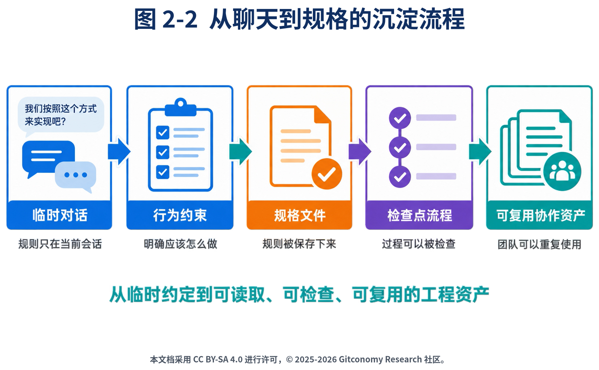
    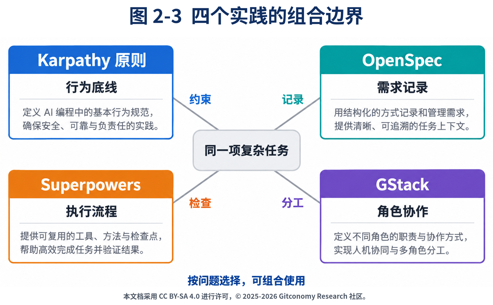
  - 6. 这些实践说明了什么
## 第 3 章 六层框架：把工具变成方法
  - 1. 六层框架：把零散工具变成体系

    '''

        Layer 5: 可组合工具层  ─── Matt Pocock Skills（grill-me / tdd / diagnose / handoff）
        Layer 4: 角色专业层    ─── GStack（9 个角色 slash 命令）
        Layer 3: 工作流编排层  ─── Superpowers（brainstorm→spec→plan→build→review→merge）
        Layer 2: 规范持久层    ─── OpenSpec（delta spec / project.md / archive）
        Layer 1: 上下文工程层  ─── GSD Core（五步阶段循环 / 200K 子代理隔离）
        Layer 0: 行为约束层    ─── Karpathy（4 条原则：先思考·简单优先·精准修改·目标驱动）  
    '''
    - 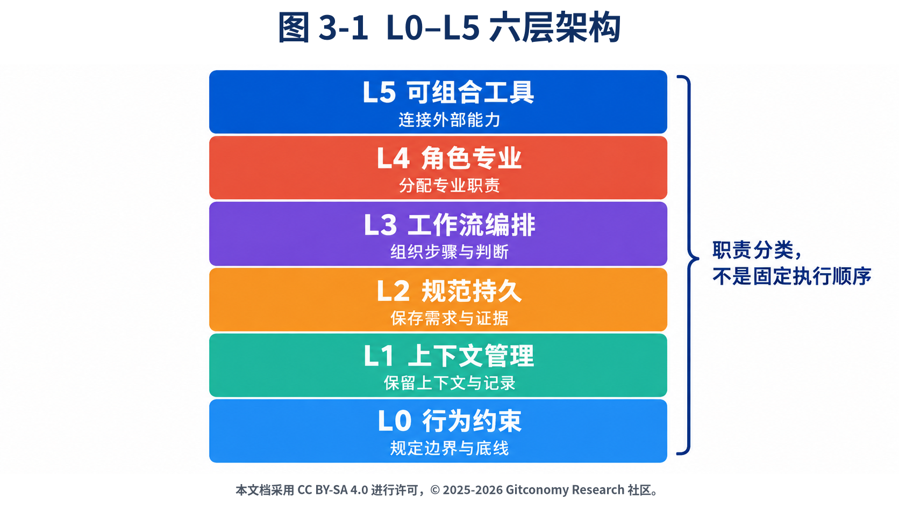
    - Layer 0：行为约束层——地基
    - Layer 1：上下文工程层——抗腐化
    - Layer 2：规范持久层——可追溯
      - OpenSpec
    - Layer 3：工作流编排层——可验证
      - Superpowers
    - Layer 4：角色专业层——可管理
      - GStack
    - Layer 5：可组合工具层——有解法
  - 2. Deep Research 是什么
    - 2.1 一句话定义
    - 2.2 业界已有 Deep Research 的 MCP 和 Skill
    - 2.3 一个关键区分：Wide Research vs Deep Research
      - 
  - 3. 用六层框架理解 Deep Research
      - 
## 第 4 章 逐层配置，搭出 Deep Research
  - 本章导读
    - 核心层
        L0（行为约束）：给 AI 装上纪律，确保它不失控
        L2（规范持久）：给 Deep Research 写一份规格，明确做什么、怎么做、边界在哪
        L3（工作流编排）：配一套执行流程，让它按固定步骤干活
        L5（可组合工具）：接上搜索工具和最小知识库，让它能碰到外部信息
  - 1. 搭建 Deep Research 项目骨架
    - 1.1 为什么需要项目骨架：
      - 项目骨架不是形式主义，它是让配置可管理、AI 可读取的地基
    - 1.2 核心目录结构
        ‘’‘
        
            deep-research/
            ├── AGENTS.md              ← L0：行为约束（Karpathy 四原则）
            ├── spec.md                ← L2：Deep Research 规格
            ├── workflows/             ← L3：工作流编排
            │   └── research-flow.md   ← 六步研究流程定义
            ├── tools/                 ← L5：可组合工具配置
            │   ├── search.md          ← 搜索工具配置
            │   └── knowledge-base.md  ← 最小知识库配置
            ├── docs/                  ← 研究资料（非代码内容）
            │   └── sources/           ← 接入的资料源文件
            ├── reports/               ← 研究报告输出目录
            └── .git/                  ← 版本控制（Git）    
        ’‘’
        
        - 每个目录的具体职责：
          -  根目录：放置核心配置文件（AGENTS.md 和 spec.md），AI 启动时首先读取这里
          -  **workflows/**：放置工作流定义文件，规定 Deep Research 的执行步骤
          -  **tools/**：放置工具配置文件，定义如何接入外部工具和知识库
          -  **docs/sources/**：放置研究资料，作为 Deep Research 的本地知识库
          -  **reports/**：放置 Deep Research 生成的研究报告，作为输出目录
    - 1.3 创建步骤
      
  - 2. 配置 L0 行为约束：写 AGENTS.md
    - 2.1 为什么需要行为约束
    - 2.2 四条原则的具体化
    - 2.3 AGENTS.md 的内容
    - 2.4 如何验证配置有效
  - 3. 配置 L2 规范持久：写 spec.md
    - 3.1 为什么需要规格文件
    - 3.2 OpenSpec 四部分结构
    - 3.3 spec.md 的完整内容
    - 3.4 spec.md 与 AGENTS.md 的关系
  - 4. 配置 L3 工作流编排：配置六步流程
    - 4.1 为什么需要工作流
    - 4.2 六步流程的设计
      - 工作流配置文件需要明确三件事：
        1. 步骤顺序：先做什么、后做什么
        2. 每步的输入输出：这步需要什么信息、产出什么结果
        3. 检查点：这步完成的条件是什么，怎样算“通过”
      
    - 4.3 workflows/research-flow.md 的内容
    - 4.4 工作流与规格的关系
  - 5. 配置 L5 可组合工具：接入搜索工具和最小知识库
    - 5.1 为什么需要工具
    - 5.2 工具选择策略
    - 5.3 搜索工具配置
    - 5.4 最小知识库配置
    - 5.5 工具与工作流的对接
      - 步骤 3 的工具调用：
        对每个子问题，先用 Tavily 搜索互联网资料
        再读取 docs/sources/ 中的本地资料
        合并两部分来源，去重后作为本步骤的输出
  - 6. 搭出最小可运行版本
    - 6.1 组合配置
      - L0（AGENTS.md）：行为纪律——先思考、简单优先、精准修改、目标驱动
      - L2（spec.md）：任务规格——做什么、怎么做、拒绝条件、验收标准
      - L3（workflows/research-flow.md）：执行流程——六步、每步输入输出、检查点
      - L5（tools/search.md + tools/knowledge-base.md）：工具使用——搜索工具和本地知识库
        这些配置是互补的：L0 管纪律，L2 管规格，L3 管流程，L5 管工具。它们一起构成了 Deep Research 的“最小可运行版本”。
    - 6.2 跑通一次
## 第 5 章 跑通与拆解——主流程落地
  - 1. 跑通主流程
    - 1.1 跑通的意义
    - 1.2 跑通前的检查清单
      在启动 Deep Research 之前，先确认以下几项：
        - AGENTS.md 存在于项目根目录：AI 启动时会首先读取这个文件。如果它不在根目录，AI 可能读不到。
        - spec.md 写好了四部分：做什么、怎么做、拒绝条件、验收标准。不完整的规格会导致 AI 行为不可预测。
        - workflows/research-flow.md 定义了六步流程：每步有输入输出和检查点。如果流程文件缺失，AI 可能跳步。
        - 搜索工具可用：Tavily API Key 已设置，或者内置 WebSearch 可用。如果搜索工具不可用，步骤 3（资料检索）会失败。
        - docs/sources/ 目录存在：即使为空，目录也要存在。如果目录缺失，AI 可能报错。
        - 这五项都确认无误后，启动 OpenCode，进入项目目录，开始跑通。
    - 1.3 跑通过程的观察要点
      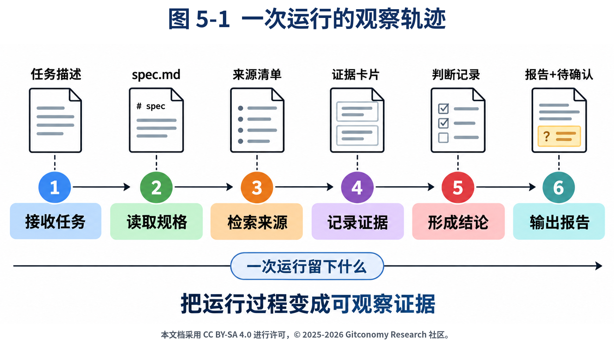
    - 1.4 跑通记录模板
    - 1.5 跑通后的第一反应
      - SDD 的做法是：先评估，再判断，再改。
  - 2. 评估运行结果
    - 2.1 评估的四个维度
      - 维度一：流程完整性
      - 维度二：来源质量
      - 维度三：结论可靠性
      - 维度四：输出稳定性
    - 2.2 常见问题与根因分析
    - 2.3 评估记录模板
    - 2.4 评估后的决策点
  - 3. 单 Agent、工作流还是多 Agent
    - 3.1 三种模式的本质区别
      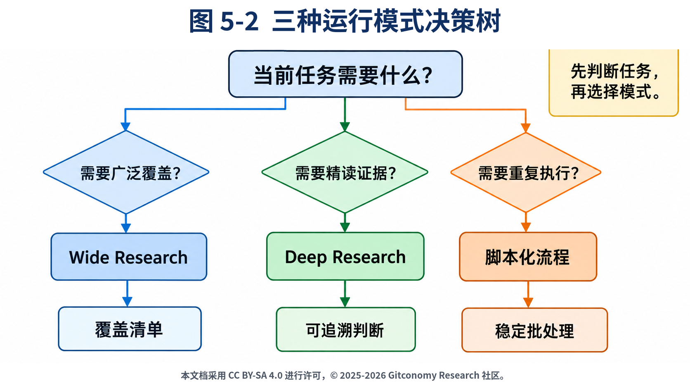
    - 3.2 两个选择维度
      - 维度一：任务复杂度
      - 维度二：输出稳定性要求
    - 3.3 Deep Research 的判断路径
    - 3.4 一个判断的实例
  - 4. 按需拆解
    - 4.1 拆解的前提
    - 4.2 工作流拆解
    - 4.3 多 Agent 拆解
    - 4.4 拆解的成本
  - 5. 补全 L1 上下文管理
    - 5.1 为什么需要 L1
    - 5.2 会话持久：把中间结果写入文件
      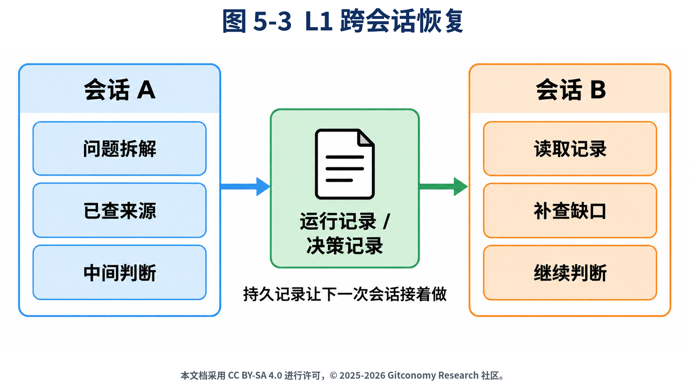
    - 5.3 跨会话记忆：每次从干净起点开始
    - 5.4 L1 的配置落地
  - 6. 补全 L4 角色分工
    - 6.1 为什么需要 L4
    - 6.2 角色专业化的原则
    - 6.3 GStack 风格的 Deep Research 角色设计
    - 6.4 配置落地
    - 6.5 L4 与 L3 的衔接
      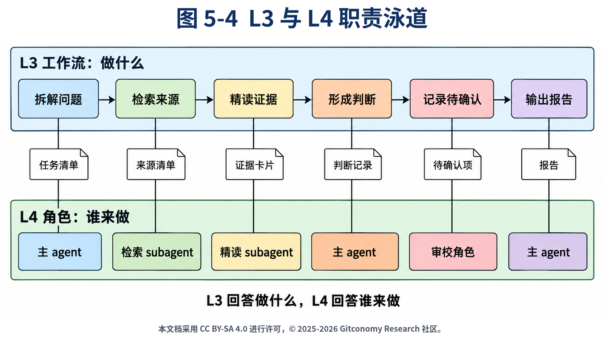
## 第 6 章 测试与迭代——用证据改进 Deep Research
  - 1. 准备测试输入
    - 1.1 为什么要专门准备测试输入
    - 1.2 两类测试输入
    - 1.3 测试用例设计原则
    - 1.4 测试用例清单模板
      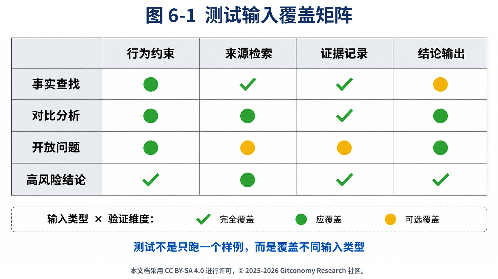
  - 2. 证据验证：逐层检查 L0-L5
    - 2.1 为什么逐层验证
      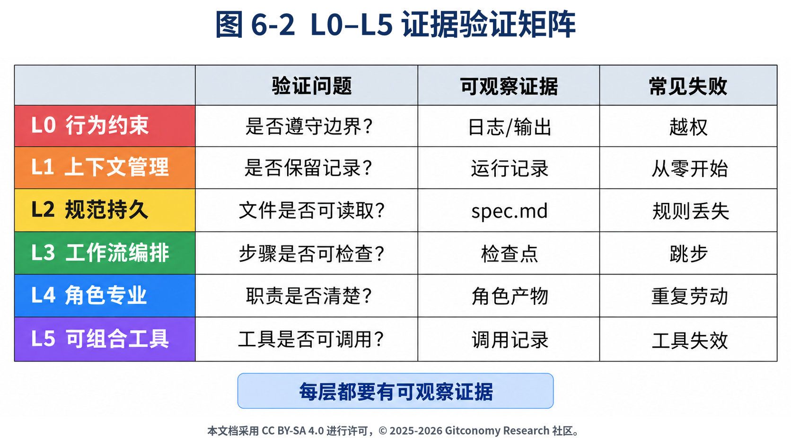
    - 2.2 每层的验证方法
    - 2.3 验证记录模板
  - 3. 差距分析：规格要求 vs 实际行为
    - 3.1 差距分析的三步法
    - 3.2 常见差距与根因
    - 3.3 差距分析记录模板
  - 4. 回归测试：改完之后再跑一遍
    - 4.1 为什么需要回归测试
    - 4.2 回归测试的步骤
    - 4.3 回归测试的判断标准
    - 4.4 回归测试记录模板
      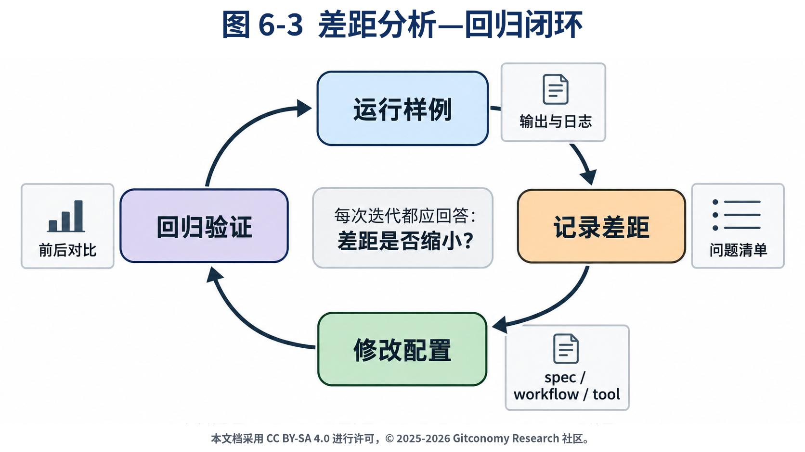
  - 5. 迭代门禁：什么时候停止迭代
    - 5.1 迭代不是无限循环
    - 5.2 每轮迭代必须有的四样东西
      - 测试任务：用什么测试输入、预期什么行为
      - 执行结果：实际跑出来的结果是什么
      - 差距分析：哪里不符合规格、为什么、根因是什么
      - 回归记录：修改后重新跑之前的测试，确认没有破坏原有能力
    - 5.3 迭代记录模板
    - 5.4 停止迭代的三个信号
      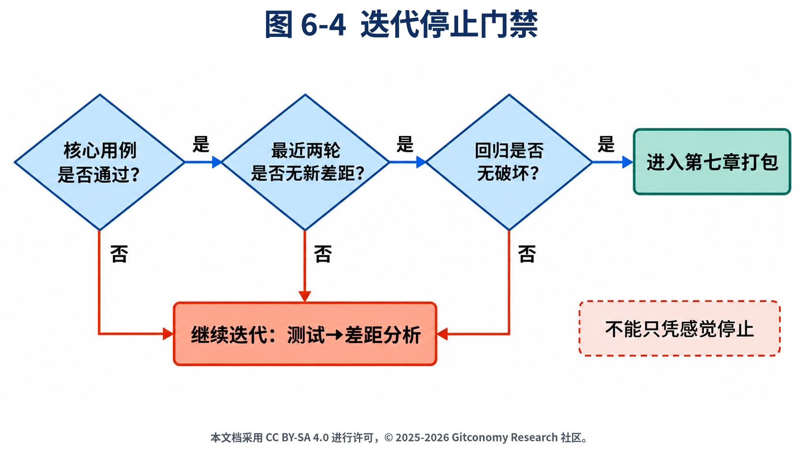
    - 5.5 已知限制的处理
    - 5.6 迭代质量评估清单