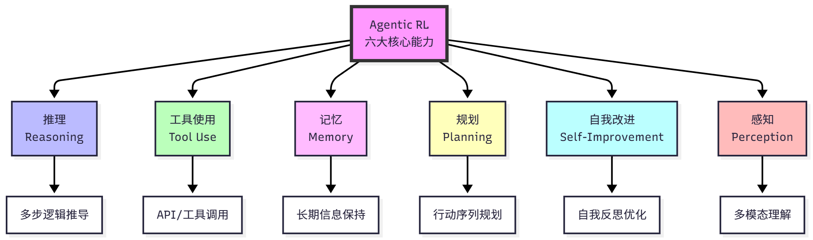

### Vicuna
* https://github.com/ggerganov/llama.cpp
* https://huggingface.co/eachadea/ggml-vicuna-13b-1.1/tree/main
* download ggml-vicuna-13b-4bit-rev1.bin to models
* make
* ./main -i --interactive-first -r "### Human:" --temp 0 -c 2048 -n -1 --ignore-eos --repeat_penalty 1.2 --instruct -m ./models/ggml-vicuna-13b-1.0-uncensored-q4_2.bin 

### Dalai_Alpaca
* cd alpaca
* npx dalai serve

### EleutherAI_pythia

## [Deep Learnong AI courses](https://github.com/jackhwl/OpenAI_LLaMa/tree/main/DeepLearningAI)
## Career Essentials in Generative AI by Microsoft and LinkedIn

## Hello-Agents
### 第一部分：智能体与语言模型基础
- 第一章 初识智能体
  - 1.1 什么是智能体？
    - [Hello Agent](https://github.com/datawhalechina/Hello-Agents)
    - 1.1.1 传统视角下的智能体
    - 1.1.2 大语言模型驱动的新范式
    - 1.1.3 智能体的类型
  - 1.2 智能体的构成与运行原理
    - 1.2.1 任务环境定义
    - 1.2.2 智能体的运行机制
    - 1.2.3 智能体的感知与行动
  - 1.3 动手体验：5 分钟实现第一个智能体
    - Thought-Action-Observation
    - 1.3.1 准备工作
    - 1.3.2 接入大语言模型
    - 1.3.3 执行行动循环
  - 1.4 智能体应用的协作模式
    - 1.4.1 作为开发者工具的智能体
    - 1.4.2 作为自主协作者的智能体
    - 1.4.3 Workflow和Agent的差异
- 第二章 智能体发展史
  - 2.1 基于符号与逻辑的早期智能体
    - 2.1.1 物理符号系统假说
    - 2.1.2 专家系统
    - 2.1.3 SHRDLU
    - 2.1.4 符号主义面临的根本性挑战
  - 2.2 构建基于规则的聊天机器人
    - 2.2.1 ELIZA 的设计思想
    - 2.2.2 模式匹配与文本替换
    - 2.2.3 核心逻辑的实现
  - 2.3 马文·明斯基的心智社会
    - 2.3.1 对单一整体智能模型的反思
    - 2.3.2 作为协作体的智能
    - 2.3.3 对多智能体系统的理论启发
  - 2.4 学习范式的演进与现代智能体
    - 2.4.1 从符号到联结
    - 2.4.2 基于强化学习的智能体
    - 2.4.3 基于大规模数据的预训练
    - 2.4.4 基于大语言模型的智能体
    - 2.4.5 智能体发展关键节点概览
    - 2.5 本章小结
- 第三章 大语言模型基础
  - 3.1 语言模型与 Transformer 架构
    - 3.1.1 从 N-gram 到 RNN, LSTM
    - 3.1.2 Transformer 架构解析
    - 3.1.3 Decoder-Only 架构
  - 3.2 与大语言模型交互
    - 3.2.1 提示工程
    - 3.2.2 文本分词
    - 3.2.3 调用开源大语言模型
    - 3.2.4 模型的选择
  - 3.3 大语言模型的缩放法则与局限性
  - 3.4 本章小结
### 第二部分：构建你的大语言模型智能体
- 第四章 智能体经典范式构建
    ```
    ReAct (Reasoning and Acting): 一种将“思考”和“行动”紧密结合的范式，让智能体边想边做，动态调整。
    Plan-and-Solve: 一种“三思而后行”的范式，智能体首先生成一个完整的行动计划，然后严格执行。
    Reflection: 一种赋予智能体“反思”能力的范式，通过自我批判和修正来优化结果。
    ```
  - 4.1 环境准备与基础工具定义
    - 4.1.1 安装依赖库
      - pip install openai python-dotenv
    - 4.1.2 配置 API 密钥
    - 4.1.3 封装基础 LLM 调用函数
    - 4.2 ReAct
      - 4.2.1 ReAct 的工作流程
      - 4.2.2 工具的定义与实现
      - 4.2.3 ReAct 智能体的编码实现
      - 4.2.4 ReAct 的特点、局限性与调试技巧
    - 4.3 Plan-and-Solve
      - 4.3.1 Plan-and-Solve 的工作原理
      - 4.3.2 规划阶段
      - 4.3.3 执行器与状态管理
      - 4.3.4 运行实例与分析
    - 4.4 Reflection
      - 4.4.1 Reflection 机制的核心思想
      - 4.4.2 案例设定与记忆模块设计
      - 4.4.3 Reflection 智能体的编码实现
      - 4.4.4 运行实例与分析
      - 4.4.5 Reflection 机制的成本收益分析
    - 4.5 本章小结
- 第五章 基于低代码平台的智能体搭建
  - 5.1 平台化构建的兴起
    - 5.1.1 为何需要低代码平台
    - 5.1.2 低代码平台的选择: Coze、Dify和 n8n
  - 5.2 平台一：Coze
    - 5.2.1 Coze 的功能模块
    - 5.2.2 构建“每日AI简报”助手
    - 5.2.3 Coze 的优势与局限性分析
  - 5.3 平台二：Dify
    - 5.3.1 Dify 的介绍与生态
    - 5.3.2 构建一个超级智能体个人助手
    - 5.3.3 Dify 的优势与局限性分析
  - 5.4 平台三：n8n
    - 5.4.1 n8n 的节点与工作流
    - 5.4.2 搭建智能邮件助手
    - 5.4.3 构建 Agent 的私有知识库
    - 5.4.4 创建 Agent 主工作流
    - 5.4.5 n8n 的优势与局限性分析
  - 5.5 本章小结
- 第六章 框架开发实践
  - 6.1 从手动实现到框架开发
    - 6.1.1 为何需要智能体框架
    - 6.1.2 主流框架的选型与对比
      - AutoGen
      - AgentScope
      - CAMEL
      - LangGraph
  - 6.2 框架一：AutoGen
    - 6.2.1 AutoGen 的核心机制
    - 6.2.2 软件开发团队
    - 6.2.3 核心代码实现
    - 6.2.4 AutoGen 的优势与局限性分析
  - 6.3 框架二：AgentScope
    - 6.3.1 AgentScope 的设计
    - 6.3.2 三国狼人杀游戏
    - 6.3.3 AgentScope 的优势与局限性分析
  - 6.4 框架三：CAMEL
    - 6.4.1 CAMEL 的自主协作
    - 6.4.2 AI科普电子书
    - 6.4.3 CAMEL 的优势与局限性分析
  - 6.5 框架四：LangGraph
    - 6.5.1 LangGraph 的结构梳理
    - 6.5.2 三步问答助手
    - 6.5.3 LangGraph 的优势与局限性分析
    - 6.6 本章小结
- 第七章 构建你的智能体框架
  - 7.1 框架整体架构设计
    - 7.1.1 为何需要自建Agent框架
    - 7.1.2 HelloAgents框架的设计理念
    - 7.1.3 本章学习目标
      - 快速开始：安装HelloAgents框架
  - 7.2 HelloAgentsLLM扩展
    - 7.2.1 支持多提供商
    - 7.2.2 本地模型调用
      - ollama
    - 7.2.3 自动检测机制
  - 7.3 框架接口实现
    - 7.3.1 Message 类
    - 7.3.2 Config 类
    - 7.3.3 Agent 抽象基类
  - 7.4 Agent范式的框架化实现
    - 7.4.1 SimpleAgent
      - bring hello agent to pkg folder venv editable install
    - 7.4.2 ReActAgent
    - 7.4.3 ReflectionAgent
    - 7.4.4 PlanAndSolveAgent
    - 7.4.5 FunctionCallAgent
  - 7.5 工具系统
    - 7.5.1 工具基类与注册机制设计
    - 7.5.2 自定义工具开发
    - 7.5.3 多源搜索工具
    - 7.5.4 工具系统的高级特性
  - 7.6 本章小结
    - chapter07_basic_setup.py
### 第三部分：高级知识扩展
- 第八章 记忆与检索
  - test case:
    .venv312  pyhtong 3.12 in order to support 'pip install spacy'
    source .venv/bin/activate
    python my_main.py
    python aws.py
    python chapter07_basic_setup.py
    python test_8_memory.py
  - 8.1 从认知科学到智能体记忆
    - 8.1.1 人类记忆系统的启发
    - 8.1.2 为何智能体需要记忆与RAG
    - 8.1.3 记忆与RAG系统架构设计
    - 8.1.4 本章学习目标与快速体验
  - 8.2 记忆系统：让智能体拥有记忆
    - 8.2.1 记忆系统的工作流程
    - 8.2.2 快速体验：30秒上手记忆功能
    - 8.2.3 MemoryTool详解
    - 8.2.4 MemoryManager详解
    - 8.2.5 四种记忆类型
      - 工作记忆（WorkingMemory）
      - 情景记忆（EpisodicMemory）
      - 语义记忆（SemanticMemory）
      - 感知记忆（PerceptualMemory）
  - 8.3 RAG系统：知识检索增强
    - 8.3.1 RAG的基础知识
    - 8.3.2 RAG系统工作原理
    - 8.3.3 快速体验：30秒上手RAG功能
    - 8.3.4 RAG系统架构设计
    - 8.3.5 高级检索策略
      - 多查询扩展（MQE）
      - 假设文档嵌入（HyDE）
      - 扩展检索框架
  - 8.4 构建智能文档问答助手
    - 8.4.1 案例背景与目标
      - sample pdf: Happy-LLM-0727.pdf
    - 8.4.2 核心助手类的实现
    - 8.4.3 智能问答功能
    - 8.4.4 其他核心功能
    - 8.4.5 运行效果展示
      - python test_8.4_11_QandA_Assistant.py
    - 8.5 本章总结与展望
- 第九章 上下文工程
  - cd pkg
  - git clone https://github.com/jjyaoao/HelloAgents.git HelloAgents-0.27
  - cd HelloAgents-0.27
  - git checkout V0.2.7
  - pip install -e pkg/HelloAgents-0.27
  - 9.1 什么是上下文工程
  - 9.2 为什么上下文工程重要
    - 9.2.1 有效上下文的“解剖学”
    - 9.2.2 上下文检索与智能体式搜索
    - 9.2.3 面向长时程任务的上下文工程
  - 9.3 在 Hello-Agents 中的实践：ContextBuilder
    - 9.3.1 设计动机与目标
    - 9.3.2 核心数据结构
    - 9.3.3 GSSC 流水线详解
    - 9.3.4 完整使用示例
    - 9.3.5 最佳实践与优化建议
  - 9.4 NoteTool：结构化笔记
    - 9.4.1 设计理念与应用场景
    - 9.4.2 存储格式详解
    - 9.4.3 核心操作详解
    - 9.4.4 与 ContextBuilder 的深度集成
    - 9.4.5 最佳实践
  - 9.5 TerminalTool：即时文件系统访问
    - 9.5.1 设计理念与安全机制
    - 9.5.2 核心功能详解
    - 9.5.3 典型使用模式
    - 9.5.4 与其他工具的协同
  - 9.6 长程智能体实战：代码库维护助手
    - 9.6.1 场景设定与需求分析
    - 9.6.2 系统架构设计
    - 9.6.3 核心实现
    - 9.6.4 完整使用示例
    - 9.6.5 运行效果分析
  - 9.7 本章总结
- 第十章 智能体通信协议
  - 10.1 智能体通信协议基础
    - 10.1.2 三种协议设计理念比较
    - 10.1.3 HelloAgents 通信协议架构设计
    - 10.1.4 本章学习目标与快速体验
  - 10.2 MCP 协议实战
    - 10.2.1 MCP 协议概念介绍
    - 10.2.2 使用 MCP 客户端
    - 10.2.3 MCP 传输方式详解
    - 10.2.4 在智能体中使用 MCP 工具
    - 10.2.5 MCP 社区生态
  - 10.3 A2A 协议实战
    - 10.3.1 协议设计动机
    - 10.3.2 使用 A2A 协议实战
    - 10.3.3 使用 HelloAgents A2A 工具
    - 10.3.4 在智能体中使用 A2A 工具
  - 10.4 ANP 协议实战
    - 10.4.1 协议目标
    - 10.4.2 使用 ANP 服务发现
    - 10.4.3 实战案例
  - 10.5 构建自定义 MCP 服务器
    - 10.5.1 创建你的第一个 MCP 服务器
    - 10.5.2 上传 MCP 服务器
      - https://smithery.ai/
  - 10.6 本章总结
- 第十一章 Agentic-RL
  - 11.1 从 LLM 训练到 Agentic RL
    - 11.1.1 从强化学习到 Agentic RL
    - 11.1.2 LLM 训练全景图
    - 11.1.3 Agentic RL 的核心理念
    
    - 11.1.4 HelloAgents 的 Agentic RL 设计
    - 11.1.5 快速上手示例
  - 11.2 数据集与奖励函数
    - 11.2.1 GSM8K 数学推理数据集
    - 11.2.2 奖励函数设计
    - 11.2.3 自定义数据集和奖励函数
  - 11.3 SFT 训练
    - 11.3.1 为什么需要 SFT
    - 11.3.2 LoRA:参数高效微调
    - 11.3.3 SFT 训练实战
    - 11.3.4 模型评估
  - 11.4 GRPO 训练
    - 11.4.1 从 PPO 到 GRPO
    - 11.4.2 GRPO 训练实战
  - 11.5 模型评估与分析
    - 11.5.1 评估指标体系
    - 11.5.2 评估实战
    - 11.5.3 错误分析
    - 11.5.4 改进方向
  - 11.6 完整训练流程实战
    - 11.6.1 端到端训练流程
    - 11.6.2 超参数调优
    - 11.6.3 分布式训练
    - 11.6.4 生产部署
  - 11.8 本章小结
- 第十二章 智能体性能评估
  - 12.1 智能体评估基础
    - 12.1.1 为何需要智能体评估
    - 12.1.2 主流评估基准概览